# Package rbac

**Path**: `tests/common/rbac`

## Table of Contents

- [Overview](#overview)
- [Structs](#structs)
  - [CrdResource](#crdresource)
  - [RoleResource](#roleresource)
  - [RoleRule](#rolerule)
- [Exported Functions](#exported-functions)
  - [EvaluateAutomountTokens](#evaluateautomounttokens)
  - [FilterRulesNonMatchingResources](#filterrulesnonmatchingresources)
  - [GetAllRules](#getallrules)
  - [GetCrdResources](#getcrdresources)
  - [SliceDifference](#slicedifference)
- [Local Functions](#local-functions)
  - [isResourceInRoleRule](#isresourceinrolerule)

## Overview

The rbac package provides utilities for evaluating RBAC configurations and ServiceAccount token mounting in Kubernetes workloads, as well as helper functions for dissecting Roles into actionable rules and matching them against Custom Resource Definitions (CRDs). It is used when validating access control policies or preparing audit reports for clusters.

### Key Features

- Determines if a Pod’s ServiceAccount token is automatically mounted, respecting explicit settings on the Pod or its ServiceAccount
- Deconstructs Kubernetes Role objects into individual RoleRule entries for fine‑grained analysis
- Separates RoleRules that match a list of CRDs from those that do not, enabling targeted permission checks

### Design Notes

- The package assumes the default for automatic token mounting is false unless explicitly overridden by Pod or ServiceAccount settings; this matches Kubernetes’ current behavior but may change in future releases
- SliceDifference performs a naïve O(n²) comparison; for large rule sets a map‑based approach would be more efficient but was omitted to keep dependencies minimal
- Best practice: call GetAllRules first, then use FilterRulesNonMatchingResources or SliceDifference to isolate relevant permissions before reporting

### Structs Summary

| Name | Purpose |
|------|----------|
| [**CrdResource**](#crdresource) | Representation of a Custom Resource Definition (CRD) |
| [**RoleResource**](#roleresource) | Represents a reference to an RBAC role or cluster‑role |
| [**RoleRule**](#rolerule) | One-line purpose |

### Exported Functions Summary

| Name | Purpose |
|------|----------|
| [func EvaluateAutomountTokens(client corev1typed.CoreV1Interface, put *provider.Pod) (bool, string)](#evaluateautomounttokens) | Determines whether a Pod is correctly configured to avoid automatic mounting of the ServiceAccount token. The function passes only if the token is explicitly set to `false` either on the Pod or its associated ServiceAccount, or if the configuration defaults to `false`. |
| [func FilterRulesNonMatchingResources(ruleList []RoleRule, resourceList []CrdResource) (matching, nonMatching []RoleRule)](#filterrulesnonmatchingresources) | Separates `RoleRule` entries into those that apply to any CRD in the supplied list (`matching`) and those that do not (`nonMatching`). |
| [func (*rbacv1.Role) GetAllRules() []RoleRule](#getallrules) | Deconstructs a Kubernetes `rbacv1.Role` into the smallest actionable units, returning one `RoleRule` for each combination of API group, resource, and verb. |
| [func GetCrdResources(crds []*apiextv1.CustomResourceDefinition) (resourceList []CrdResource)](#getcrdresources) | Transforms a slice of `*apiextv1.CustomResourceDefinition` into a slice of `CrdResource`, extracting group, singular/ plural names and short names for each CRD. |
| [func SliceDifference(s1, s2 []RoleRule) (diff []RoleRule)](#slicedifference) | Computes the set difference of two `[]RoleRule` slices – elements that exist in *s1* but not in *s2*. |

### Local Functions Summary

| Name | Purpose |
|------|----------|
| [func isResourceInRoleRule(crd CrdResource, roleRule RoleRule) bool](#isresourceinrolerule) | Determines whether a custom resource definition (CRD) matches a given RBAC `RoleRule` by comparing the CRD’s API group and plural name against the rule’s resource specification. |

## Structs

### CrdResource


#### Fields
| Field        | Type      | Description |
|--------------|-----------|-------------|
| `Group`      | `string`  | API group to which the CRD belongs (e.g., `"apps.example.com"`). |
| `PluralName` | `string`  | Plural form of the resource name used in REST paths (e.g., `"widgets"`). |
| `SingularName` | `string` | Singular form of the resource name (e.g., `"widget"`). |
| `ShortNames` | `[]string` | Optional list of short names that can be used as aliases when referring to the CRD in commands. |

#### Purpose
`CrdResource` encapsulates the minimal identifying information for a Kubernetes Custom Resource Definition that is needed when evaluating RBAC rules against available resources. It holds the API group, singular and plural names, and any defined short names so that functions can match these against role rules.

#### Related Functions
| Function | Purpose |
|----------|---------|
| `GetCrdResources` | Converts a slice of `apiextv1.CustomResourceDefinition` objects into a slice of `CrdResource`, extracting the group and name fields. |
| `FilterRulesNonMatchingResources` | Filters a list of role rules, returning those that reference resources present in the provided `CrdResource` list. |
| `isResourceInRoleRule` | Determines whether a given `CrdResource` matches the resource component of a role rule by comparing group and plural name. |

---

---

### RoleResource


#### Fields
| Field | Type   | Description |
|-------|--------|-------------|
| Group | string | The API group that defines the role type (`rbac.authorization.k8s.io` for standard roles, `rbac.authorization.k8s.io` for cluster‑roles). If empty, defaults to the core RBAC group. |
| Name  | string | The name of the specific role or cluster‑role being referenced. |

#### Purpose
`RoleResource` encapsulates a minimal identifier for an RBAC resource (either a `Role` or a `ClusterRole`). It is used throughout the test suite to specify which role should be granted, revoked, or inspected during permission checks.

#### Related functions
| Function | Purpose |
|----------|---------|
| *none*   | No direct helper functions are defined for this struct in the current codebase. |

---

---

### RoleRule


Represents a single permission entry extracted from a Kubernetes RBAC `Role`, specifying which resource group and name a verb applies to.

---

#### Fields

| Field   | Type        | Description |
|---------|-------------|-------------|
| Resource | `RoleResource` | The API group and plural resource name that the rule targets. *(definition not shown in provided code)* |
| Verb     | `string`    | An allowed action (e.g., `"get"`, `"list"`, `"create"`). |

---

#### Purpose

The `RoleRule` struct is used to flatten the nested structure of a Kubernetes RBAC `Role`.  
Each rule in a `Role` can specify multiple API groups, resources, and verbs. By creating one `RoleRule` per combination, the code simplifies comparison, filtering, and difference calculations between roles and CRD resources.

---

#### Related functions

| Function | Purpose |
|----------|---------|
| `GetAllRules(aRole *rbacv1.Role)` | Converts all rules in a Kubernetes `Role` into a slice of `RoleRule`, one per group‑resource‑verb combination. |
| `FilterRulesNonMatchingResources(ruleList []RoleRule, resourceList []CrdResource)` | Separates `RoleRule`s that match any CRD resource from those that do not, based on API group and plural name. |
| `SliceDifference(s1, s2 []RoleRule)` | Computes the set difference between two slices of `RoleRule`, used to identify rules present in one role but absent in another. |
| `isResourceInRoleRule(crd CrdResource, roleRule RoleRule)` | Checks whether a given CRD resource is covered by a specific `RoleRule` (matching group and plural name). |

---

---

## Exported Functions

### EvaluateAutomountTokens

**EvaluateAutomountTokens** - Determines whether a Pod is correctly configured to avoid automatic mounting of the ServiceAccount token. The function passes only if the token is explicitly set to `false` either on the Pod or its associated ServiceAccount, or if the configuration defaults to `false`.


#### 1) Signature (Go)
```go
func EvaluateAutomountTokens(client corev1typed.CoreV1Interface, put *provider.Pod) (bool, string)
```

#### 2) Summary Table
| Aspect | Details |
|--------|---------|
| **Purpose** | Determines whether a Pod is correctly configured to avoid automatic mounting of the ServiceAccount token. The function passes only if the token is explicitly set to `false` either on the Pod or its associated ServiceAccount, or if the configuration defaults to `false`. |
| **Parameters** | `client corev1typed.CoreV1Interface – Kubernetes Core API client.<br>`put *provider.Pod – The Pod under evaluation. |
| **Return value** | `(bool, string)` – Boolean indicating pass/fail; a descriptive error message when failing (empty on success). |
| **Key dependencies** | • `fmt.Sprintf`<br>• `IsAutomountServiceAccountSetOnSA()` (method of `*provider.Pod`)<br>• `Error` (from the same package) |
| **Side effects** | No state mutation or I/O; purely functional evaluation. |
| **How it fits the package** | Part of the RBAC checks suite, used to validate that Pods do not unintentionally expose ServiceAccount tokens. |

#### 3) Internal workflow
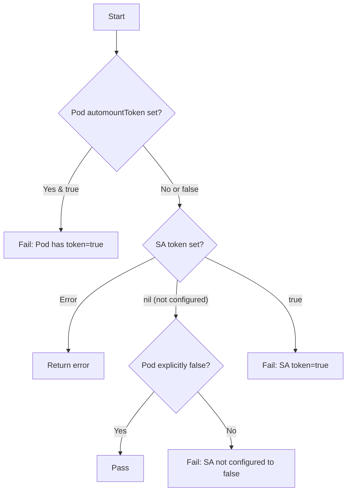

#### 4) Function dependencies
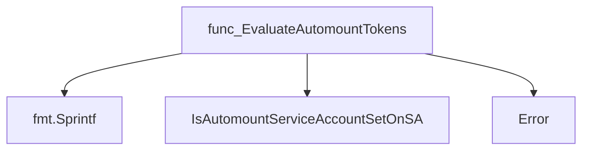

#### 5) Functions calling `EvaluateAutomountTokens`
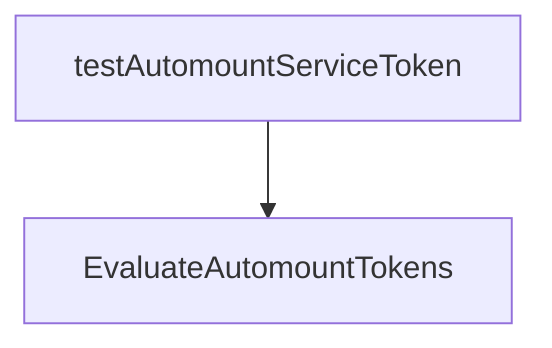

#### 6) Usage example (Go)
```go
// Minimal example invoking EvaluateAutomountTokens
import (
	"github.com/redhat-best-practices-for-k8s/certsuite/tests/common/rbac"
	corev1typed "k8s.io/client-go/kubernetes/typed/core/v1"
)

func main() {
	var client corev1typed.CoreV1Interface   // assume initialized
	var pod *provider.Pod                    // assume populated

	passed, msg := rbac.EvaluateAutomountTokens(client, pod)
	if !passed {
		fmt.Println("Automount check failed:", msg)
	} else {
		fmt.Println("Pod automount configuration is compliant.")
	}
}
```

---

### FilterRulesNonMatchingResources

**FilterRulesNonMatchingResources** - Separates `RoleRule` entries into those that apply to any CRD in the supplied list (`matching`) and those that do not (`nonMatching`).


#### 1) Signature (Go)
```go
func FilterRulesNonMatchingResources(ruleList []RoleRule, resourceList []CrdResource) (matching, nonMatching []RoleRule)
```

#### 2) Summary Table
| Aspect | Details |
|--------|---------|
| **Purpose** | Separates `RoleRule` entries into those that apply to any CRD in the supplied list (`matching`) and those that do not (`nonMatching`). |
| **Parameters** | `ruleList []RoleRule` – all rules to evaluate. <br> `resourceList []CrdResource` – CRDs against which rules are checked. |
| **Return value** | Two slices of `RoleRule`: <br>• `matching` – rules that match at least one CRD.<br>• `nonMatching` – rules that do not match any CRD. |
| **Key dependencies** | • `isResourceInRoleRule(crd CrdResource, roleRule RoleRule) bool` – determines a single match.<br>• `SliceDifference(s1, s2 []RoleRule)` – computes non‑matching slice. |
| **Side effects** | None; pure function that only returns new slices. |
| **How it fits the package** | Provides core filtering logic used by higher‑level tests (e.g., `testCrdRoles`) to assess role compliance with CRDs. |

#### 3) Internal workflow (Mermaid)
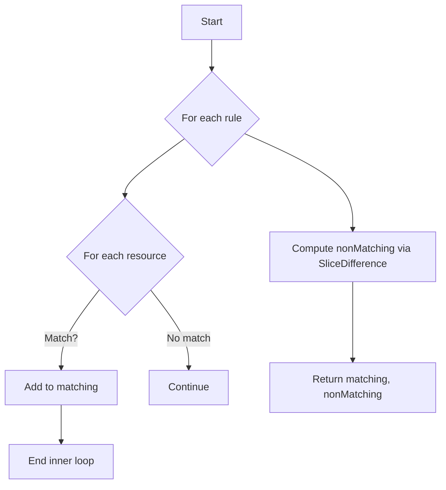

#### 4) Function dependencies (Mermaid)
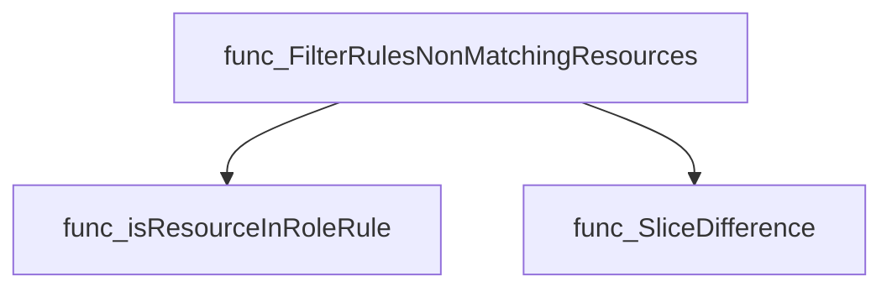

#### 5) Functions calling `FilterRulesNonMatchingResources` (Mermaid)
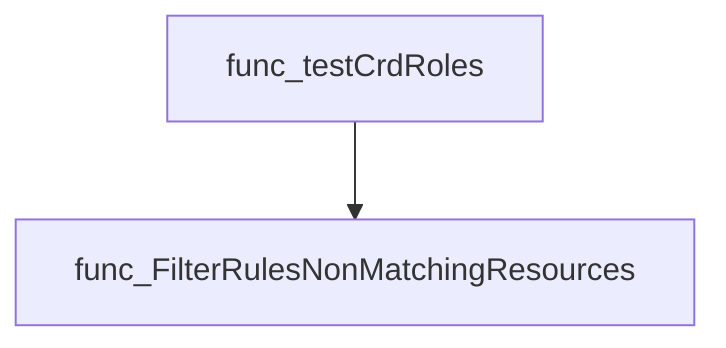

#### 6) Usage example (Go)
```go
// Minimal example invoking FilterRulesNonMatchingResources
rules := []RoleRule{
    {Resource: Resource{Name:"pods", Group:""}, Verb:"get"},
    {Resource: Resource{Name:"deployments.apps", Group:"apps"}, Verb:"list"},
}
crds := []CrdResource{
    {Group:"apps", PluralName:"deployments"},
    {Group:"batch", PluralName:"jobs"},
}

matching, nonMatching := FilterRulesNonMatchingResources(rules, crds)

// matching will contain the deployment rule
// nonMatching will contain the pods rule
```

---

### GetAllRules

**GetAllRules** - Deconstructs a Kubernetes `rbacv1.Role` into the smallest actionable units, returning one `RoleRule` for each combination of API group, resource, and verb.


#### Signature (Go)

```go
func (*rbacv1.Role) GetAllRules() []RoleRule
```

#### Summary Table

| Aspect | Details |
|--------|---------|
| **Purpose** | Deconstructs a Kubernetes `rbacv1.Role` into the smallest actionable units, returning one `RoleRule` for each combination of API group, resource, and verb. |
| **Parameters** | `aRole *rbacv1.Role` – The Role object whose rules are to be flattened. |
| **Return value** | `[]RoleRule` – A slice where each element represents a single rule (group, resource, verb). |
| **Key dependencies** | - `append` (built‑in) for building the result slice.<br>- `rbacv1.Role`, `RoleRule` types from the package. |
| **Side effects** | None – pure function; does not modify its input or any external state. |
| **How it fits the package** | Provides a foundational utility for higher‑level analysis functions that need to inspect or filter Role rules at the granularity of individual permissions. |

#### Internal workflow (Mermaid)

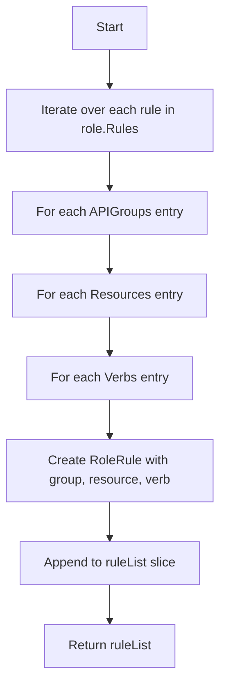

#### Function dependencies (Mermaid)

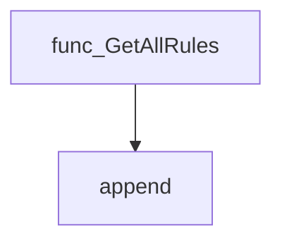

#### Functions calling `GetAllRules` (Mermaid)

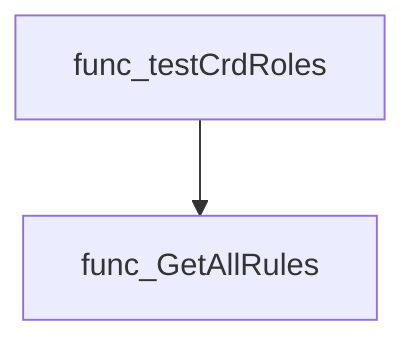

#### Usage example (Go)

```go
// Minimal example invoking GetAllRules
package main

import (
	"fmt"

	rbacv1 "k8s.io/api/rbac/v1"
	"github.com/redhat-best-practices-for-k8s/certsuite/tests/common/rbac"
)

func main() {
	role := &rbacv1.Role{
		Rules: []rbacv1.PolicyRule{
			{
				APIGroups: []string{"apps"},
				Resources: []string{"deployments"},
				Verbs:     []string{"get", "list"},
			},
		},
	}

	allRules := rbac.GetAllRules(role)
	for _, r := range allRules {
		fmt.Printf("Group=%s, Resource=%s, Verb=%s\n",
			r.Resource.Group, r.Resource.Name, r.Verb)
	}
}
```

---

### GetCrdResources

**GetCrdResources** - Transforms a slice of `*apiextv1.CustomResourceDefinition` into a slice of `CrdResource`, extracting group, singular/ plural names and short names for each CRD.


#### 1) Signature (Go)

```go
func GetCrdResources(crds []*apiextv1.CustomResourceDefinition) (resourceList []CrdResource)
```

#### 2) Summary Table

| Aspect | Details |
|--------|---------|
| **Purpose** | Transforms a slice of `*apiextv1.CustomResourceDefinition` into a slice of `CrdResource`, extracting group, singular/ plural names and short names for each CRD. |
| **Parameters** | `crds []*apiextv1.CustomResourceDefinition` – the CRDs to process |
| **Return value** | `resourceList []CrdResource` – one `CrdResource` per input CRD |
| **Key dependencies** | • `append` (built‑in)<br>• `apiextv1.CustomResourceDefinition` (Kubernetes API) |
| **Side effects** | None; pure function that only reads its arguments and returns a new slice. |
| **How it fits the package** | Provides foundational data for role‑based access control checks that need to know which resources are represented by CRDs in the cluster. |

#### 3) Internal workflow (Mermaid)

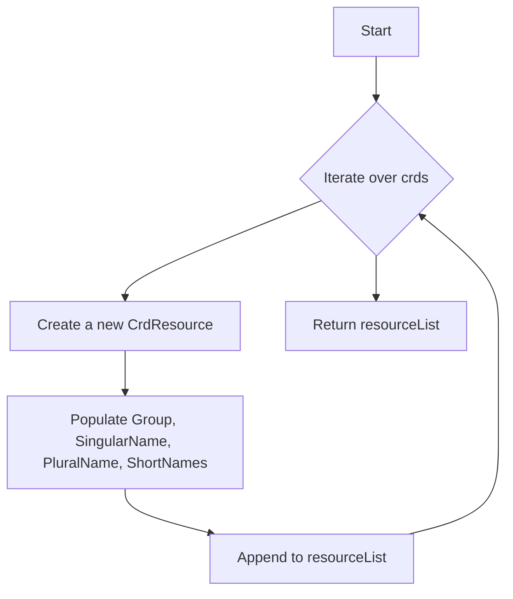

#### 4) Function dependencies (Mermaid)

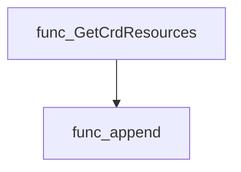

#### 5) Functions calling `GetCrdResources` (Mermaid)

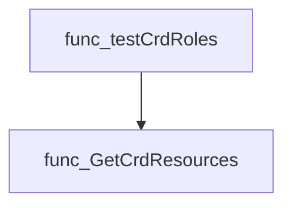

#### 6) Usage example (Go)

```go
// Minimal example invoking GetCrdResources
import (
    "github.com/redhat-best-practices-for-k8s/certsuite/tests/common/rbac"
    apiextv1 "k8s.io/apiextensions-apiserver/pkg/apis/apiextensions/v1"
)

func example() {
    // Assume crds is a slice of *apiextv1.CustomResourceDefinition retrieved elsewhere
    var crds []*apiextv1.CustomResourceDefinition

    // Convert to CrdResource slice
    resources := rbac.GetCrdResources(crds)

    // Use the resulting resources as needed...
    _ = resources
}
```

---

### SliceDifference

**SliceDifference** - Computes the set difference of two `[]RoleRule` slices – elements that exist in *s1* but not in *s2*.


#### Signature (Go)

```go
func SliceDifference(s1, s2 []RoleRule) (diff []RoleRule)
```

#### Summary Table

| Aspect | Details |
|--------|---------|
| **Purpose** | Computes the set difference of two `[]RoleRule` slices – elements that exist in *s1* but not in *s2*. |
| **Parameters** | `s1 []RoleRule` – first slice; `s2 []RoleRule` – second slice. |
| **Return value** | `diff []RoleRule` – the subset of *s1* that is missing from *s2*. |
| **Key dependencies** | • `len()` to compare slice lengths.<br>• `append()` to build the result slice. |
| **Side effects** | Pure function: no global state or I/O; returns a new slice. |
| **How it fits the package** | Used by higher‑level RBAC helpers (e.g., `FilterRulesNonMatchingResources`) to isolate unmatched role rules. |

#### Internal workflow

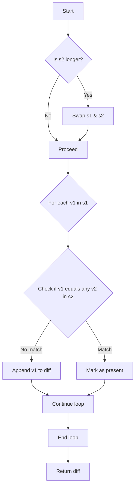

#### Function dependencies

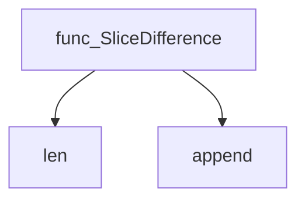

#### Functions calling `SliceDifference`

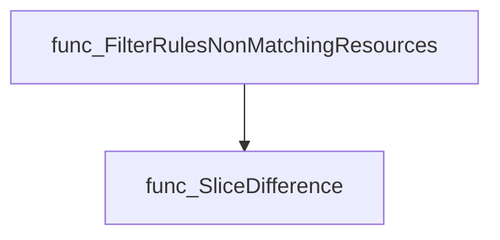

#### Usage example (Go)

```go
// Minimal example invoking SliceDifference
rulesA := []RoleRule{
    {"apiGroups": []string{""}, "resources": []string{"pods"}, "verbs": []string{"get"}},
    {"apiGroups": []string{""}, "resources": []string{"services"}, "verbs": []string{"list"}},
}
rulesB := []RoleRule{
    {"apiGroups": []string{""}, "resources": []string{"pods"}, "verbs": []string{"get"}},
}

diff := SliceDifference(rulesA, rulesB)
// diff contains the rule for "services"
```

---

## Local Functions

### isResourceInRoleRule

**isResourceInRoleRule** - Determines whether a custom resource definition (CRD) matches a given RBAC `RoleRule` by comparing the CRD’s API group and plural name against the rule’s resource specification.


#### 1) Signature (Go)

```go
func isResourceInRoleRule(crd CrdResource, roleRule RoleRule) bool
```

#### 2) Summary Table

| Aspect | Details |
|--------|---------|
| **Purpose** | Determines whether a custom resource definition (CRD) matches a given RBAC `RoleRule` by comparing the CRD’s API group and plural name against the rule’s resource specification. |
| **Parameters** | `crd CrdResource – the CRD to evaluate`<br>`roleRule RoleRule – the RBAC rule containing the target resource definition` |
| **Return value** | `bool – true if the CRD’s group and plural name match those of the rule; otherwise false` |
| **Key dependencies** | • `strings.Split` from the standard library (used to strip sub‑resource segments)<br>• The types `CrdResource` and `RoleRule` defined in the same package |
| **Side effects** | None. Pure function with no state mutation or I/O. |
| **How it fits the package** | Serves as a helper used by higher‑level functions such as `FilterRulesNonMatchingResources`, enabling the package to filter RBAC rules based on whether they correspond to existing CRDs. |

#### 3) Internal workflow (Mermaid)

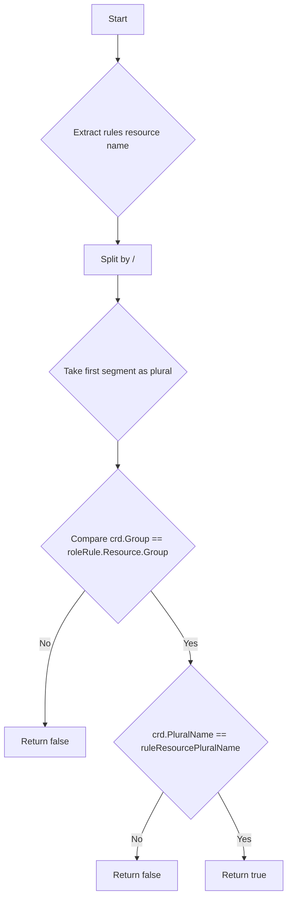

#### 4) Function dependencies (Mermaid)

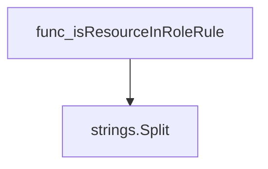

#### 5) Functions calling `isResourceInRoleRule` (Mermaid)

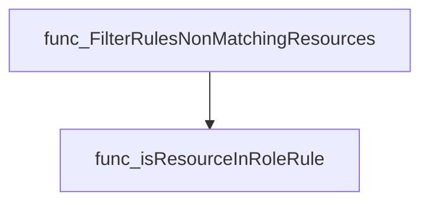

#### 6) Usage example (Go)

```go
// Minimal example invoking isResourceInRoleRule
package main

import (
	"fmt"

	"github.com/redhat-best-practices-for-k8s/certsuite/tests/common/rbac"
)

func main() {
	crd := rbac.CrdResource{
		Group:       "apps.example.com",
		PluralName:  "widgets",
	}
	roleRule := rbac.RoleRule{
		Resource: struct{ Name, Group string }{
			Name:  "widgets", // could be "widgets/subresource"
			Group: "apps.example.com",
		},
	}

	matches := rbac.isResourceInRoleRule(crd, roleRule)
	fmt.Printf("Does the CRD match the rule? %t\n", matches)
}
```

---

