# Package identifiers

**Path**: `tests/identifiers`

## Table of Contents

- [Overview](#overview)
- [Exported Functions](#exported-functions)
  - [AddCatalogEntry](#addcatalogentry)
  - [GetTestIDAndLabels](#gettestidandlabels)
  - [InitCatalog](#initcatalog)
- [Local Functions](#local-functions)
  - [init](#init)

## Overview

The identifiers package defines test identifiers, catalog registration helpers, and mapping utilities for the Certsuite testing framework.

### Key Features

- Centralized catalog of test case descriptions and impact statements
- Convenient helper functions (AddCatalogEntry, GetTestIDAndLabels) to register and retrieve tests
- Automatic initialization that populates a global catalog on import

### Design Notes

- Registration occurs in init() via InitCatalog(); catalog is a map[claim.Identifier]claim.TestCaseDescription
- Identifiers are built from constants; impact mapping is separate for readability
- Functions avoid exposing internal structures; only exported helpers are used by test generators

### Exported Functions Summary

| Name | Purpose |
|------|----------|
| [func AddCatalogEntry(     testID string,     suiteName string,     description string,     remediation string,     exception string,     reference string,     qe bool,     categoryclassification map[string]string,     tags ...string, ) (aID claim.Identifier)](#addcatalogentry) | Creates a `claim.TestCaseDescription`, stores it in the global catalog, and records its classification. It returns the unique identifier for the test case. |
| [func GetTestIDAndLabels(identifier claim.Identifier) (testID string, tags []string)](#gettestidandlabels) | Transforms a `claim.Identifier` into a test identifier suitable for the test framework and collects labels that describe the test. The returned ID is used as the key in check registrations; the labels are later used for filtering or categorisation. |
| [func InitCatalog() map[claim.Identifier]claim.TestCaseDescription](#initcatalog) | Populates a global catalog with test case descriptions by registering each test identifier via `AddCatalogEntry`. Returns the populated catalog. |

### Local Functions Summary

| Name | Purpose |
|------|----------|
| [func init()](#init) | Automatically registers a collection of test identifiers when the package is imported. It invokes `InitCatalog()` to populate the internal catalog. |

## Exported Functions

### AddCatalogEntry

**AddCatalogEntry** - Creates a `claim.TestCaseDescription`, stores it in the global catalog, and records its classification. It returns the unique identifier for the test case.


#### 1) Signature (Go)

```go
func AddCatalogEntry(
    testID string,
    suiteName string,
    description string,
    remediation string,
    exception string,
    reference string,
    qe bool,
    categoryclassification map[string]string,
    tags ...string,
) (aID claim.Identifier)
```

#### 2) Summary Table

| Aspect | Details |
|--------|---------|
| **Purpose** | Creates a `claim.TestCaseDescription`, stores it in the global catalog, and records its classification. It returns the unique identifier for the test case. |
| **Parameters** | • `testID` – internal id of the test case<br>• `suiteName` – name of the test suite (e.g., “preflight”)<br>• `description` – human‑readable description<br>• `remediation` – suggested fix when the test fails<br>• `exception` – exception text, defaults to `NoDocumentedProcess` if empty<br>• `reference` – documentation link, defaults to “No Reference Document Specified” if empty<br>• `qe` – flag for Quality‑Engineering overrides<br>• `categoryclassification` – map of category → classification (e.g., FarEdge: Optional)<br>• `tags …string` – optional tags; default is `TagCommon`. |
| **Return value** | The generated `claim.Identifier` that uniquely identifies the test case. |
| **Key dependencies** | • `strings.TrimSpace`<br>• `claim.BuildTestCaseDescription`<br>• Global maps: `Catalog`, `Classification` |
| **Side effects** | Mutates the global `Catalog` map by inserting a new entry and updates `Classification`. |
| **How it fits the package** | Provides the core cataloging mechanism used throughout the test suite to expose all tests, their metadata, and classification for reporting and filtering. |

#### 3) Internal workflow (Mermaid)

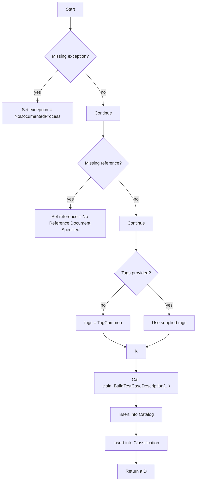

#### 4) Function dependencies (Mermaid)

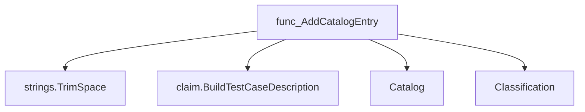

#### 5) Functions calling `AddCatalogEntry` (Mermaid)

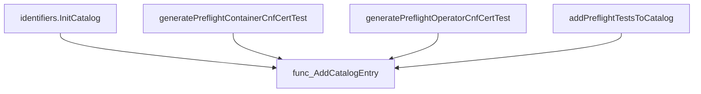

#### 6) Usage example (Go)

```go
// Minimal example invoking AddCatalogEntry
package main

import (
    "github.com/redhat-best-practices-for-k8s/certsuite/tests/identifiers"
    claimPkg "github.com/redhat-best-practices-for-rh/.../claim" // replace with real path
)

func main() {
    id := identifiers.AddCatalogEntry(
        "example-test",
        "preflight",
        "Checks that example condition holds",
        "Adjust configuration to satisfy the test",
        "", // empty => defaults to NoDocumentedProcess
        "", // empty => defaults to “No Reference Document Specified”
        false,
        map[string]string{
            identifiers.FarEdge:  identifiers.Optional,
            identifiers.Telco:    identifiers.Optional,
            identifiers.NonTelco: identifiers.Optional,
            identifiers.Extended: identifiers.Optional,
        },
        identifiers.TagPreflight, // optional tag
    )
    _ = id // use the identifier as needed
}
```

This example demonstrates how to register a new test case with default values for exception and reference, classify it across categories, and assign a tag.

---

### GetTestIDAndLabels

**GetTestIDAndLabels** - Transforms a `claim.Identifier` into a test identifier suitable for the test framework and collects labels that describe the test. The returned ID is used as the key in check registrations; the labels are later used for filtering or categorisation.


#### Signature (Go)
```go
func GetTestIDAndLabels(identifier claim.Identifier) (testID string, tags []string)
```

#### Summary Table
| Aspect | Details |
|--------|---------|
| **Purpose** | Transforms a `claim.Identifier` into a test identifier suitable for the test framework and collects labels that describe the test. The returned ID is used as the key in check registrations; the labels are later used for filtering or categorisation. |
| **Parameters** | `identifier claim.Identifier –` a struct containing fields `Id`, `Suite`, and `Tags`. |
| **Return value** | `testID string` – the test identifier (`identifier.Id`).<br>`tags []string` – a slice of label strings derived from `identifier.Tags` plus the ID and suite name. |
| **Key dependencies** | * `strings.Split` – splits comma‑separated tags.<br>* `append` – adds additional labels to the slice.<br>* Assignment to global map `TestIDToClaimID`. |
| **Side effects** | Stores the mapping from test ID to its original claim identifier in the package‑level map `TestIDToClaimID`; mutates no external state. |
| **How it fits the package** | The identifiers package centralises conversion between claim data and test metadata. Functions that register checks call this helper to obtain a unique test ID and the labels required for skip logic, categorisation, and reporting. |

#### Internal workflow (Mermaid)
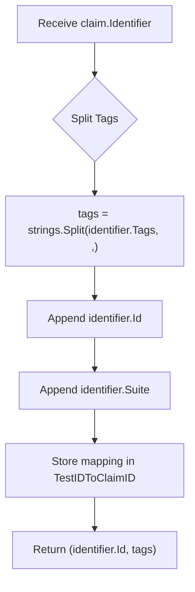

#### Function dependencies (Mermaid)
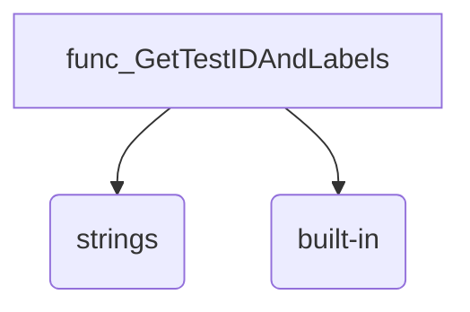

#### Functions calling `GetTestIDAndLabels` (Mermaid)
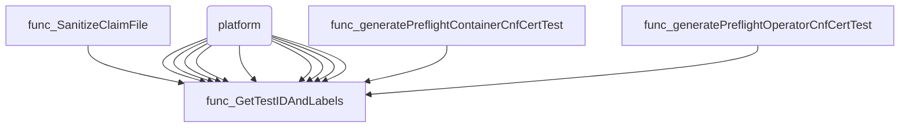

#### Usage example (Go)
```go
// Minimal example invoking GetTestIDAndLabels
package main

import (
	"fmt"

	"github.com/redhat-best-practices-for-k8s/certsuite/tests/identifiers"
	"github.com/redhat-best-practices-for-k8s/certsuite/pkg/claim"
)

func main() {
	id := claim.Identifier{
		Id:   "SecContextCapabilities",
		Suite:"accesscontrol",
		Tags: "security,capabilities",
	}
	testID, tags := identifiers.GetTestIDAndLabels(id)
	fmt.Printf("Test ID: %s\n", testID)          // SecContextCapabilities
	fmt.Printf("Tags: %v\n", tags)               // [security capabilities SecContextCapabilities accesscontrol]
}
```

---

### InitCatalog

**InitCatalog** - Populates a global catalog with test case descriptions by registering each test identifier via `AddCatalogEntry`. Returns the populated catalog.


#### Signature (Go)

```go
func InitCatalog() map[claim.Identifier]claim.TestCaseDescription
```

#### Summary Table

| Aspect | Details |
|--------|---------|
| **Purpose** | Populates a global catalog with test case descriptions by registering each test identifier via `AddCatalogEntry`. Returns the populated catalog. |
| **Parameters** | none |
| **Return value** | A map where keys are `claim.Identifier` and values are `claim.TestCaseDescription`, representing all registered tests. |
| **Key dependencies** | - Calls `AddCatalogEntry` repeatedly to register each test case.<br>- Relies on global variables such as `TestNetworkPolicyDenyAllIdentifier`, `TagCommon`, etc., for identifiers and default tags. |
| **Side effects** | Mutates the global `Catalog` and `Classification` maps via `AddCatalogEntry`. No I/O or concurrency is performed. |
| **How it fits the package** | The function is invoked during package initialization (`init()`), ensuring that all test cases are available before any tests run. It centralises catalog creation, making the test suite self‑contained and deterministic. |

#### Internal workflow (Mermaid)

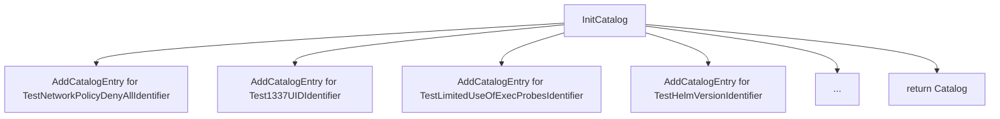

#### Function dependencies (Mermaid)

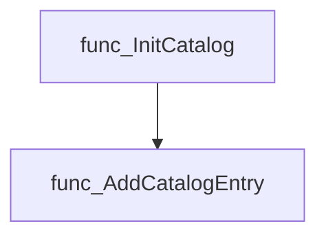

#### Functions calling `InitCatalog` (Mermaid)

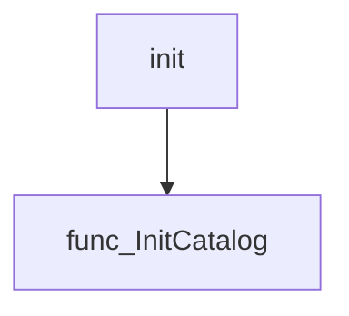

#### Usage example (Go)

```go
// Minimal example invoking InitCatalog
package main

import (
    "fmt"

    "github.com/redhat-best-practices-for-k8s/certsuite/tests/identifiers"
)

func main() {
    catalog := identifiers.InitCatalog()
    fmt.Printf("Loaded %d test cases\n", len(catalog))
}
```

---

---

## Local Functions

### init

**init** - Automatically registers a collection of test identifiers when the package is imported. It invokes `InitCatalog()` to populate the internal catalog.


#### Signature
```go
func init()
```

#### Summary Table
| Aspect | Details |
|--------|---------|
| **Purpose** | Automatically registers a collection of test identifiers when the package is imported. It invokes `InitCatalog()` to populate the internal catalog. |
| **Parameters** | None |
| **Return value** | None |
| **Key dependencies** | • Calls `InitCatalog()` from the same package. |
| **Side effects** | Populates global state (the identifier catalog) which is used by other tests in the package. No I/O or concurrency involved. |
| **How it fits the package** | Acts as a module‑initialization hook, ensuring that all identifiers are available before any test execution begins. |

#### Internal workflow
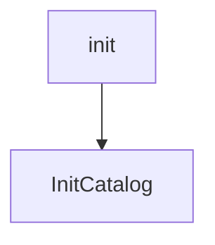

#### Function dependencies
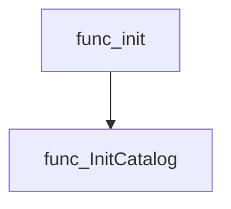

#### Functions calling `init`
None – this function is automatically invoked by the Go runtime when the package is imported.  

#### Usage example (Go)
```go
// The init function runs automatically; no explicit call is required.
// Importing the package triggers registration of identifiers.
import _ "github.com/redhat-best-practices-for-k8s/certsuite/tests/identifiers"
```

---

