# Package lifecycle

**Path**: `tests/lifecycle`

## Table of Contents

- [Overview](#overview)
- [Exported Functions](#exported-functions)
  - [LoadChecks](#loadchecks)
- [Local Functions](#local-functions)
  - [nameInDeploymentSkipList](#nameindeploymentskiplist)
  - [nameInStatefulSetSkipList](#nameinstatefulsetskiplist)
  - [testAffinityRequiredPods](#testaffinityrequiredpods)
  - [testCPUIsolation](#testcpuisolation)
  - [testContainersImagePolicy](#testcontainersimagepolicy)
  - [testContainersLivenessProbe](#testcontainerslivenessprobe)
  - [testContainersPostStart](#testcontainerspoststart)
  - [testContainersPreStop](#testcontainersprestop)
  - [testContainersReadinessProbe](#testcontainersreadinessprobe)
  - [testContainersStartupProbe](#testcontainersstartupprobe)
  - [testDeploymentScaling](#testdeploymentscaling)
  - [testHighAvailability](#testhighavailability)
  - [testPodNodeSelectorAndAffinityBestPractices](#testpodnodeselectorandaffinitybestpractices)
  - [testPodPersistentVolumeReclaimPolicy](#testpodpersistentvolumereclaimpolicy)
  - [testPodTolerationBypass](#testpodtolerationbypass)
  - [testPodsOwnerReference](#testpodsownerreference)
  - [testPodsRecreation](#testpodsrecreation)
  - [testScaleCrd](#testscalecrd)
  - [testStatefulSetScaling](#teststatefulsetscaling)
  - [testStorageProvisioner](#teststorageprovisioner)

## Overview

The lifecycle test suite registers a collection of checks that validate Kubernetes objects (Pods, Deployments, StatefulSets, CRDs, storage, tolerations, etc.) against best‑practice rules during certification runs.

### Key Features

- Comprehensive set of check functions covering pod lifecycle hooks, probes, affinity, scaling, owner references and resource cleanup
- Dynamic skip logic based on configuration and test environment state
- Integration with the internal checks database to expose results to the certsuite framework

### Design Notes

- Checks are registered lazily via LoadChecks; each check records detailed report objects for post‑mortem analysis
- Skip functions rely on runtime data (e.g., pod sets, node count) to avoid false positives in unsuitable clusters
- The suite uses a TestEnvironment abstraction to access cluster resources without hardcoding API calls

### Exported Functions Summary

| Name | Purpose |
|------|----------|
| [func LoadChecks()](#loadchecks) | Registers all lifecycle‑related test checks into the internal check database. It creates a `ChecksGroup` for the lifecycle suite and adds individual checks with their skip logic, execution functions, and metadata. |

### Local Functions Summary

| Name | Purpose |
|------|----------|
| [func nameInDeploymentSkipList(name, namespace string, list []configuration.SkipScalingTestDeploymentsInfo) bool](#nameindeploymentskiplist) | Checks whether a given deployment (`name` and `namespace`) is present in the skip‑list defined by `list`. Returns `true` if it should be skipped. |
| [func nameInStatefulSetSkipList(name, namespace string, list []configuration.SkipScalingTestStatefulSetsInfo) bool](#nameinstatefulsetskiplist) | Determines whether a StatefulSet identified by `name` and `namespace` is listed in the skip configuration for scaling tests. |
| [func testAffinityRequiredPods(check *checksdb.Check, env *provider.TestEnvironment)](#testaffinityrequiredpods) | Iterates over all pods marked as requiring node affinity in the test environment and records whether each pod satisfies its affinity constraints. The function logs progress, captures compliance status, and sets the check result. |
| [func testCPUIsolation(check *checksdb.Check, env *provider.TestEnvironment)](#testcpuisolation) | Evaluates each pod with exclusive CPUs to determine if it meets CPU‑isolation best practices and records compliant/non‑compliant findings. |
| [func testContainersImagePolicy(check *checksdb.Check, env *provider.TestEnvironment)](#testcontainersimagepolicy) | Iterates over all containers in the test environment and records whether each uses `IfNotPresent` as its image pull policy. Non‑compliant containers are reported with an error message; compliant ones are logged. |
| [func testContainersLivenessProbe(check *checksdb.Check, env *provider.TestEnvironment)](#testcontainerslivenessprobe) | Checks each container in the provided environment for the presence of a `livenessProbe`. It records compliant and non‑compliant containers and reports the outcome. |
| [func testContainersPostStart(check *checksdb.Check, env *provider.TestEnvironment)](#testcontainerspoststart) | Determines whether every container in the test environment defines a `postStart` lifecycle hook and records compliance. |
| [func testContainersPreStop(check *checksdb.Check, env *provider.TestEnvironment)](#testcontainersprestop) | Ensures each container in the test environment has a `preStop` lifecycle hook; records compliant and non‑compliant containers. |
| [func (*checksdb.Check, *provider.TestEnvironment)()](#testcontainersreadinessprobe) | Checks each container in the test environment to confirm a readiness probe is defined; records compliant and non‑compliant containers. |
| [func testContainersStartupProbe(check *checksdb.Check, env *provider.TestEnvironment)](#testcontainersstartupprobe) | Determines whether every container in the test environment defines a Kubernetes `startupProbe`. Containers lacking this probe are flagged as non‑compliant. |
| [func testDeploymentScaling(env *provider.TestEnvironment, timeout time.Duration, check *checksdb.Check) {}](#testdeploymentscaling) | Determines whether deployments can scale safely, either via HPA or direct scaling, and records compliance. |
| [func testHighAvailability(check *checksdb.Check, env *provider.TestEnvironment)](#testhighavailability) | Confirms that each Deployment or StatefulSet has more than one replica and defines Pod anti‑affinity rules, unless the resource is marked with `AffinityRequired`. |
| [func testPodNodeSelectorAndAffinityBestPractices(testPods []*provider.Pod, check *checksdb.Check)](#testpodnodeselectorandaffinitybestpractices) | Ensures that each Pod in the supplied slice does not specify a node selector or node affinity, flagging any violations. |
| [func testPodPersistentVolumeReclaimPolicy(check *checksdb.Check, env *provider.TestEnvironment)](#testpodpersistentvolumereclaimpolicy) | Ensures each pod that mounts a Persistent Volume Claim has its underlying PV set to `Delete` reclaim policy. Non‑compliant pods are reported for remediation. |
| [func testPodTolerationBypass(check *checksdb.Check, env *provider.TestEnvironment)](#testpodtolerationbypass) | Validates every Pod in `env.Pods` contains only the default Kubernetes tolerations. Non‑default or modified tolerations mark the Pod as non‑compliant. |
| [func testPodsOwnerReference(check *checksdb.Check, env *provider.TestEnvironment)](#testpodsownerreference) | Iterates over all pods in the test environment and verifies that each pod’s owner reference meets defined best‑practice rules. Logs results and records compliant/non‑compliant objects for reporting. |
| [func testPodsRecreation(check *checksdb.Check, env *provider.TestEnvironment)](#testpodsrecreation) | Verifies that pods belonging to deployments and statefulsets are correctly recreated and become ready after a node is cordoned/drained. |
| [func testScaleCrd(env *provider.TestEnvironment, timeout time.Duration, check *checksdb.Check)](#testscalecrd) | Iterates over all CRs under test, attempts to scale each via its HorizontalPodAutoscaler (HPA) if present; otherwise performs a direct scaling test. Records compliant and non‑compliant objects in the supplied check result. |
| [func testStatefulSetScaling(env *provider.TestEnvironment, timeout time.Duration, check *checksdb.Check)](#teststatefulsetscaling) | Evaluates whether each StatefulSet in the environment can be scaled (directly or via HPA) and logs compliance. |
| [func(*checksdb.Check, *provider.TestEnvironment)()](#teststorageprovisioner) | Ensures pods use an appropriate storage provisioner (local or non‑local) according to whether the cluster is single‑node or multi‑node, and records compliance. |

## Exported Functions

### LoadChecks

**LoadChecks** - Registers all lifecycle‑related test checks into the internal check database. It creates a `ChecksGroup` for the lifecycle suite and adds individual checks with their skip logic, execution functions, and metadata.

#### 1) Signature (Go)

```go
func LoadChecks()
```

---

#### 2) Summary Table

| Aspect | Details |
|--------|---------|
| **Purpose** | Registers all lifecycle‑related test checks into the internal check database. It creates a `ChecksGroup` for the lifecycle suite and adds individual checks with their skip logic, execution functions, and metadata. |
| **Parameters** | None |
| **Return value** | None – the function populates global state via the checks database. |
| **Key dependencies** | • `log.Debug` – logs start of loading.<br>• `checksdb.NewChecksGroup` – creates a new group.<br>• `WithBeforeEachFn`, `WithCheckFn`, `WithSkipCheckFn` – chain configuration helpers.<br>• `identifiers.GetTestIDAndLabels` – supplies test IDs and tags.<br>• Various `testhelper.*` skip functions (e.g., `GetNoContainersUnderTestSkipFn`).<br>• Test implementation functions such as `testContainersPreStop`, `testScaleCrd`, `testHighAvailability`, etc. |
| **Side effects** | Mutates the global checks database by adding a group and its checks; logs debug information; may close over test environment (`env`) captured from outer scope. |
| **How it fits the package** | Part of the `lifecycle` test suite; invoked during overall test initialization via `LoadInternalChecksDB`. It defines all checks that verify Kubernetes resource best practices related to lifecycle events and scaling. |

---

#### 3) Internal workflow (Mermaid)

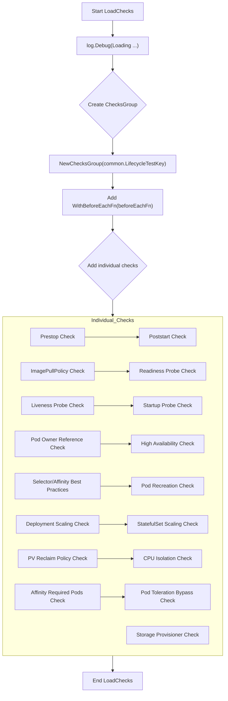

---

#### 4) Function dependencies (Mermaid)

```mermaid
graph TD
  func_LoadChecks --> log_Debug
  func_LoadChecks --> checksdb_NewChecksGroup
  func_LoadChecks --> WithBeforeEachFn
  func_LoadChecks --> identifiers_GetTestIDAndLabels
  func_LoadChecks --> testhelper_GetNoContainersUnderTestSkipFn
  func_LoadChecks --> testhelper_GetNotIntrusiveSkipFn
  func_LoadChecks --> testhelper_GetNotEnoughWorkersSkipFn
  func_LoadChecks --> testhelper_SkipIfNoPodSetsetsUnderTest
  func_LoadChecks --> testContainersPreStop
  func_LoadChecks --> testScaleCrd
  func_LoadChecks --> testContainersPostStart
  func_LoadChecks --> testContainersImagePolicy
  func_LoadChecks --> testContainersReadinessProbe
  func_LoadChecks --> testContainersLivenessProbe
  func_LoadChecks --> testContainersStartupProbe
  func_LoadChecks --> testPodsOwnerReference
  func_LoadChecks --> testHighAvailability
  func_LoadChecks --> testPodNodeSelectorAndAffinityBestPractices
  func_LoadChecks --> testPodsRecreation
  func_LoadChecks --> testDeploymentScaling
  func_LoadChecks --> testStatefulSetScaling
  func_LoadChecks --> testPodPersistentVolumeReclaimPolicy
  func_LoadChecks --> testCPUIsolation
  func_LoadChecks --> testAffinityRequiredPods
  func_LoadChecks --> testPodTolerationBypass
  func_LoadChecks --> testStorageProvisioner
```

---

#### 5) Functions calling `LoadChecks` (Mermaid)

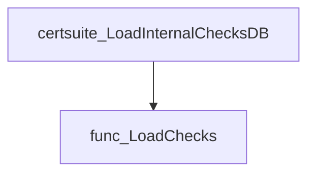

*Called by:* `certsuite.LoadInternalChecksDB` to populate the lifecycle check group during overall test suite initialization.

---

#### 6) Usage example (Go)

```go
// In a test initialization routine:
func init() {
    // Load all lifecycle checks into the global database.
    lifecycle.LoadChecks()
}
```

This invocation registers the entire set of lifecycle‑related tests, after which they can be executed by the certsuite framework.

---

## Local Functions

### nameInDeploymentSkipList

**nameInDeploymentSkipList** - Checks whether a given deployment (`name` and `namespace`) is present in the skip‑list defined by `list`. Returns `true` if it should be skipped.

#### Signature (Go)

```go
func nameInDeploymentSkipList(name, namespace string, list []configuration.SkipScalingTestDeploymentsInfo) bool
```

#### Summary Table

| Aspect | Details |
|--------|---------|
| **Purpose** | Checks whether a given deployment (`name` and `namespace`) is present in the skip‑list defined by `list`. Returns `true` if it should be skipped. |
| **Parameters** | `name string –` Deployment name.<br>`namespace string –` Deployment namespace.<br>`list []configuration.SkipScalingTestDeploymentsInfo –` Collection of deployment identifiers to skip. |
| **Return value** | `bool –` `true` when the deployment matches an entry in `list`; otherwise `false`. |
| **Key dependencies** | *None* – purely local logic. |
| **Side effects** | None; function is pure. |
| **How it fits the package** | Used by test harnesses to exclude specific deployments from scaling tests based on configuration. |

#### Internal workflow (Mermaid)

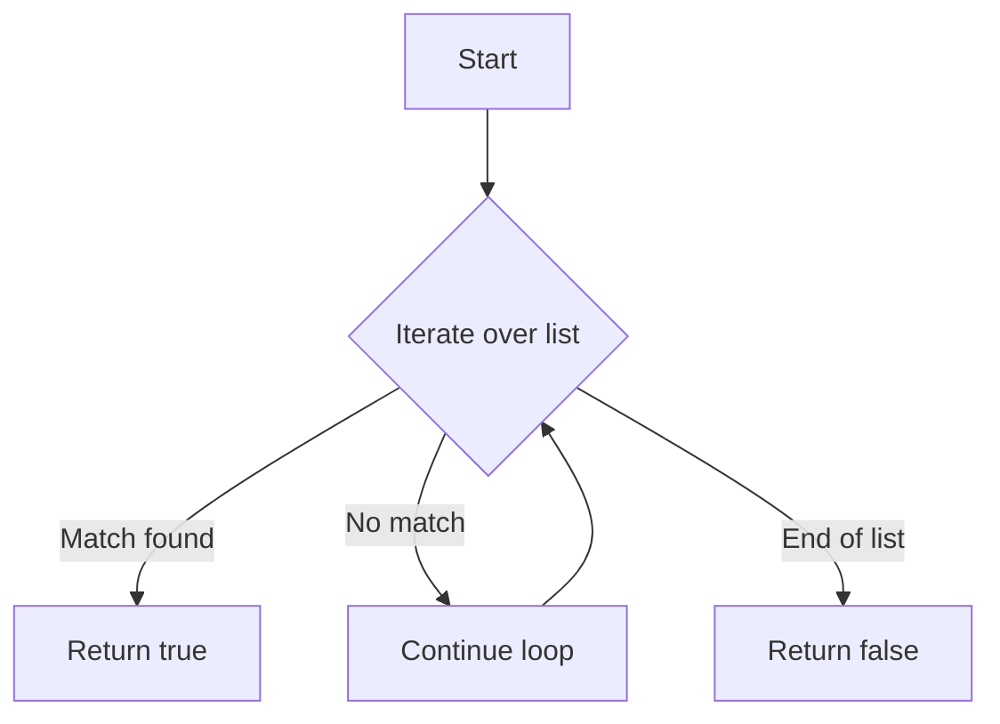

#### Function dependencies (Mermaid)

None – this function is currently not referenced elsewhere in the package.

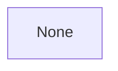

#### Functions calling `nameInDeploymentSkipList` (Mermaid)

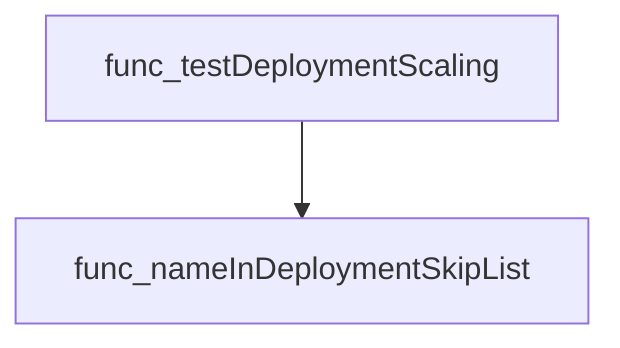

#### Usage example (Go)

```go
// Minimal example invoking nameInDeploymentSkipList
package main

import (
 "fmt"

 "github.com/redhat-best-practices-for-k8s/certsuite/tests/lifecycle"
 "github.com/redhat-best-practices-for-k8s/certsuite/tests/configuration"
)

func main() {
 skipList := []configuration.SkipScalingTestDeploymentsInfo{
  {Name: "frontend", Namespace: "prod"},
 }
 if lifecycle.nameInDeploymentSkipList("frontend", "prod", skipList) {
  fmt.Println("Deployment is skipped")
 } else {
  fmt.Println("Deployment will be tested")
 }
}
```

---

### nameInStatefulSetSkipList

**nameInStatefulSetSkipList** - Determines whether a StatefulSet identified by `name` and `namespace` is listed in the skip configuration for scaling tests.

#### Signature (Go)

```go
func nameInStatefulSetSkipList(name, namespace string, list []configuration.SkipScalingTestStatefulSetsInfo) bool
```

#### Summary Table

| Aspect | Details |
|--------|---------|
| **Purpose** | Determines whether a StatefulSet identified by `name` and `namespace` is listed in the skip configuration for scaling tests. |
| **Parameters** | `name string` – name of the StatefulSet; <br>`namespace string` – namespace containing the StatefulSet; <br>`list []configuration.SkipScalingTestStatefulSetsInfo` – slice of skip‑rules to check against. |
| **Return value** | `bool` – `true` if the StatefulSet matches any rule in `list`; otherwise `false`. |
| **Key dependencies** | *None* – function contains only a loop and conditional logic. |
| **Side effects** | None. Purely functional; no state mutation or I/O. |
| **How it fits the package** | Used by test harnesses to skip scaling tests for specific StatefulSets defined in the configuration (`SkipScalingTestStatefulSets`). |

#### Internal workflow (Mermaid)

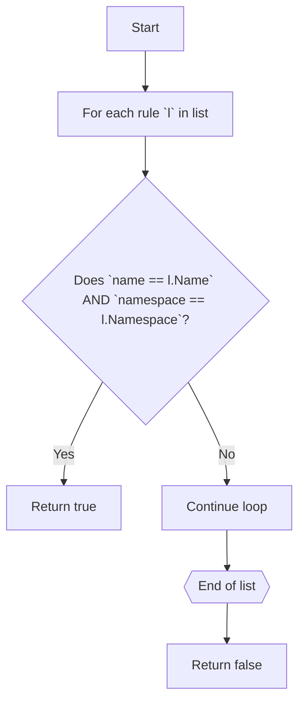

#### Function dependencies (Mermaid)

None – this function is currently not referenced elsewhere in the package.

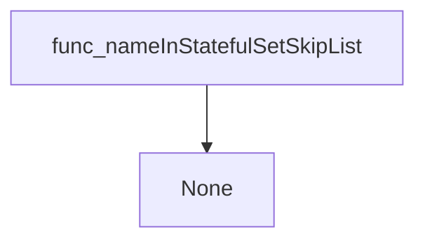

#### Functions calling `nameInStatefulSetSkipList` (Mermaid)

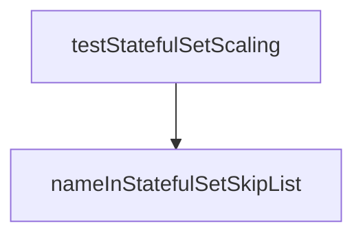

#### Usage example (Go)

```go
// Minimal example invoking nameInStatefulSetSkipList
import (
    "github.com/redhat-best-practices-for-k8s/certsuite/tests/lifecycle"
    "github.com/redhat-best-practices-for-k8s/certsuite/tests/configuration"
)

func main() {
    skipRules := []configuration.SkipScalingTestStatefulSetsInfo{
        {Name: "example-ss", Namespace: "default"},
    }

    // Will return true because the StatefulSet matches a rule
    shouldSkip := lifecycle.nameInStatefulSetSkipList("example-ss", "default", skipRules)

    fmt.Printf("Should skip: %v\n", shouldSkip)
}
```

---

### testAffinityRequiredPods

**testAffinityRequiredPods** - Iterates over all pods marked as requiring node affinity in the test environment and records whether each pod satisfies its affinity constraints. The function logs progress, captures compliance status, and sets the check result.

#### Signature (Go)

```go
func testAffinityRequiredPods(check *checksdb.Check, env *provider.TestEnvironment)
```

#### Summary Table

| Aspect | Details |
|--------|---------|
| **Purpose** | Iterates over all pods marked as requiring node affinity in the test environment and records whether each pod satisfies its affinity constraints. The function logs progress, captures compliance status, and sets the check result. |
| **Parameters** | `check *checksdb.Check` – the current check context for logging and result reporting.<br>`env *provider.TestEnvironment` – provides access to the set of pods under test (`GetAffinityRequiredPods`). |
| **Return value** | None (void). The outcome is communicated via `check.SetResult`. |
| **Key dependencies** | • `env.GetAffinityRequiredPods()` – retrieves the slice of pod wrappers.<br>• `put.IsAffinityCompliant()` – evaluates a single pod’s affinity compliance.<br>• `check.LogInfo`, `check.LogError` – logging utilities.<br>• `testhelper.NewPodReportObject` – constructs report objects for compliant/non‑compliant pods.<br>• `check.SetResult` – stores the final result set. |
| **Side effects** | • Emits log messages for each pod processed.<br>• Modifies the internal state of `check` by setting its result; does not alter any external system or pod objects. |
| **How it fits the package** | This function implements the “Affinity required pods” test within the lifecycle suite, ensuring that all relevant pods adhere to node affinity best practices before a cluster is considered compliant. |

#### Internal workflow

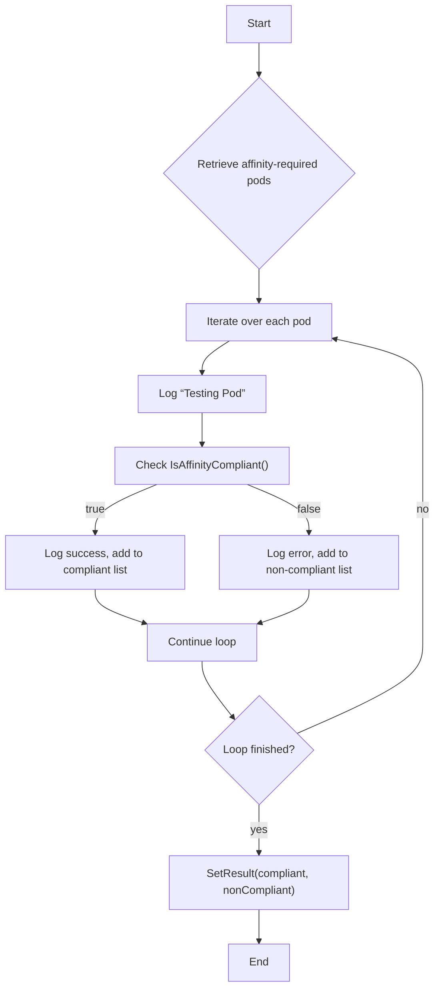

#### Function dependencies

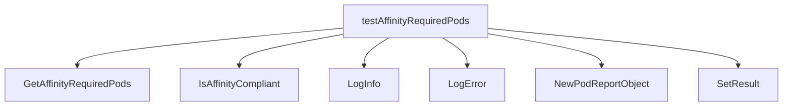

#### Functions calling `testAffinityRequiredPods`

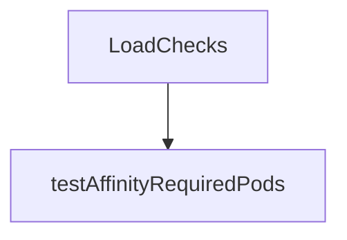

#### Usage example (Go)

```go
// Minimal example invoking testAffinityRequiredPods
package main

import (
    "github.com/redhat-best-practices-for-k8s/certsuite/tests/lifecycle"
    "github.com/redhat-best-practices-for-k8s/certsuite/pkg/checksdb"
    "github.com/redhat-best-practices-for-k8s/certsuite/pkg/provider"
)

func main() {
    // Assume env is already populated with pods requiring affinity
    var env *provider.TestEnvironment
    // Create a dummy check context
    check := checksdb.NewCheck("dummy-test")
    lifecycle.testAffinityRequiredPods(check, env)
}
```

---

### testCPUIsolation

**testCPUIsolation** - Evaluates each pod with exclusive CPUs to determine if it meets CPU‑isolation best practices and records compliant/non‑compliant findings.

#### Signature

```go
func testCPUIsolation(check *checksdb.Check, env *provider.TestEnvironment)
```

#### Summary Table

| Aspect | Details |
|--------|---------|
| **Purpose** | Evaluates each pod with exclusive CPUs to determine if it meets CPU‑isolation best practices and records compliant/non‑compliant findings. |
| **Parameters** | `check` – *checksdb.Check, the test context; <br> `env` –*provider.TestEnvironment, provides the pods under test. |
| **Return value** | None (results are stored via `check.SetResult`). |
| **Key dependencies** | • `env.GetGuaranteedPodsWithExclusiveCPUs()`<br>• `put.IsCPUIsolationCompliant()`<br>• `testhelper.NewPodReportObject`<br>• `check.LogInfo`, `check.LogError`<br>• `check.SetResult` |
| **Side effects** | Logs informational and error messages; updates the check result with lists of compliant and non‑compliant report objects. No external I/O beyond logging. |
| **How it fits the package** | Part of the lifecycle test suite, specifically registered under `TestCPUIsolationIdentifier`. It ensures pods that claim exclusive CPUs also satisfy CPU isolation requirements such as proper request/limit values, runtime class, and annotations. |

#### Internal workflow

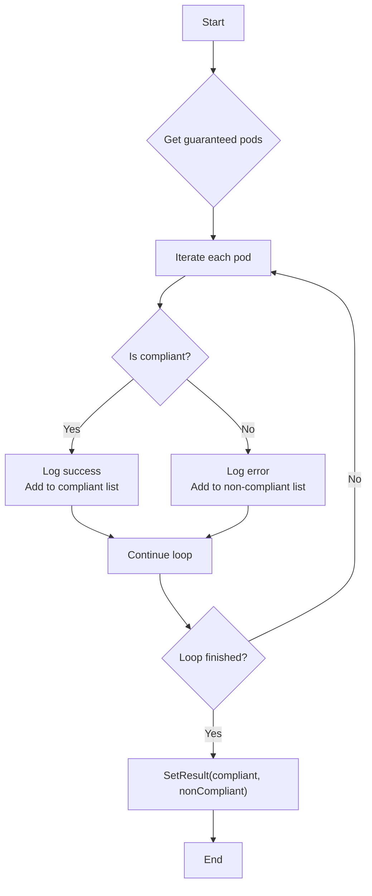

#### Function dependencies

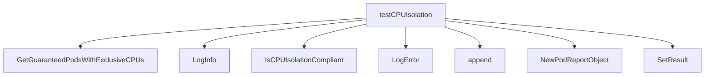

#### Functions calling `testCPUIsolation`

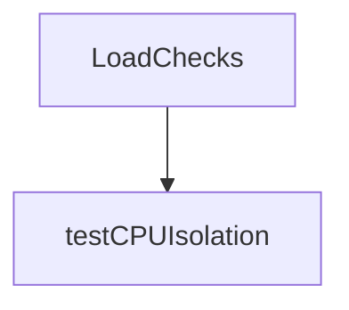

#### Usage example

```go
// Minimal example invoking testCPUIsolation
check := checksdb.NewCheck("example")
env := provider.NewTestEnvironment()
testCPUIsolation(check, env)
```

---

### testContainersImagePolicy

**testContainersImagePolicy** - Iterates over all containers in the test environment and records whether each uses `IfNotPresent` as its image pull policy. Non‑compliant containers are reported with an error message; compliant ones are logged.

#### Signature (Go)

```go
func testContainersImagePolicy(check *checksdb.Check, env *provider.TestEnvironment)
```

#### Summary Table

| Aspect | Details |
|--------|---------|
| **Purpose** | Iterates over all containers in the test environment and records whether each uses `IfNotPresent` as its image pull policy. Non‑compliant containers are reported with an error message; compliant ones are logged. |
| **Parameters** | *check* `*checksdb.Check` – the check context for logging and result aggregation.<br>*env* `*provider.TestEnvironment` – contains the list of containers to evaluate. |
| **Return value** | None (results are stored via `check.SetResult`). |
| **Key dependencies** | • `check.LogInfo`, `check.LogError`<br>• `testhelper.NewContainerReportObject`<br>• `append` (built‑in)<br>• `check.SetResult` |
| **Side effects** | • Writes log entries.<br>• Modifies the check’s result state via `SetResult`. No external I/O. |
| **How it fits the package** | It is one of several container‑level tests registered in `LoadChecks`; specifically, it enforces best practice for image pull policies within the lifecycle test suite. |

#### Internal workflow

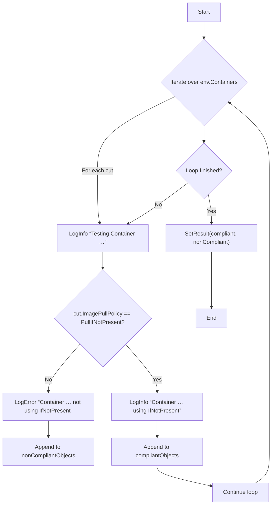

#### Function dependencies

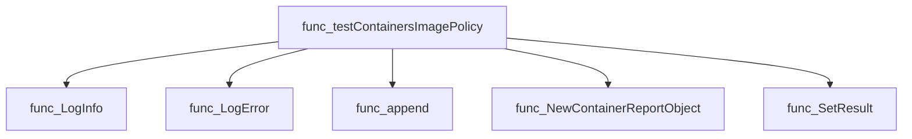

#### Functions calling `testContainersImagePolicy`

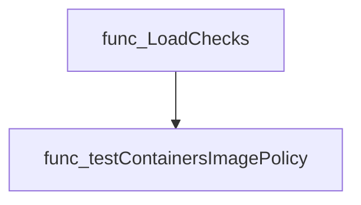

#### Usage example (Go)

```go
// Minimal example invoking testContainersImagePolicy
check := checksdb.NewCheck(...)
env := &provider.TestEnvironment{ /* populate Containers slice */ }
testContainersImagePolicy(check, env)
```

---

### testContainersLivenessProbe

**testContainersLivenessProbe** - Checks each container in the provided environment for the presence of a `livenessProbe`. It records compliant and non‑compliant containers and reports the outcome.

#### Signature (Go)

```go
func testContainersLivenessProbe(check *checksdb.Check, env *provider.TestEnvironment)
```

#### Summary Table

| Aspect | Details |
|--------|---------|
| **Purpose** | Checks each container in the provided environment for the presence of a `livenessProbe`. It records compliant and non‑compliant containers and reports the outcome. |
| **Parameters** | `check *checksdb.Check` – test context used to log information and store results.<br>`env *provider.TestEnvironment` – holds the list of containers (`Containers`) to evaluate. |
| **Return value** | None (results are stored via `check.SetResult`). |
| **Key dependencies** | • `check.LogInfo`, `check.LogError`<br>• `testhelper.NewContainerReportObject`<br>• `check.SetResult` |
| **Side effects** | Emits log entries and populates the check’s result set; no external I/O beyond logging. |
| **How it fits the package** | Part of the lifecycle test suite, executed as part of the “Liveness probe” check registration in `LoadChecks`. |

#### Internal workflow (Mermaid)

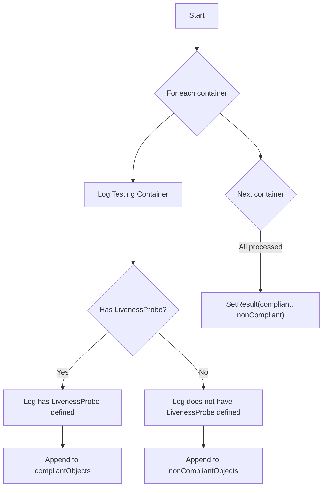

#### Function dependencies (Mermaid)

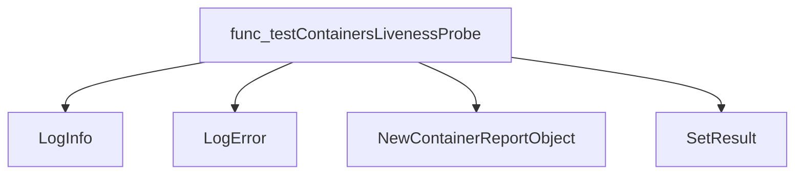

#### Functions calling `testContainersLivenessProbe` (Mermaid)

```mermaid
graph TD
  LoadChecks --> testContainersLivenessProbe
```

#### Usage example (Go)

```go
// Minimal example invoking testContainersLivenessProbe
import (
    "github.com/redhat-best-practices-for-k8s/certsuite/tests/lifecycle"
    "github.com/redhat-best-practices-for-k8s/certsuite/pkg/checksdb"
    "github.com/redhat-best-practices-for-k8s/certsuite/pkg/provider"
)

func main() {
    // Assume env and check are already prepared
    var env provider.TestEnvironment
    var check checksdb.Check

    lifecycle.testContainersLivenessProbe(&check, &env)
}
```

---

### testContainersPostStart

**testContainersPostStart** - Determines whether every container in the test environment defines a `postStart` lifecycle hook and records compliance.

#### Signature (Go)

```go
func testContainersPostStart(check *checksdb.Check, env *provider.TestEnvironment)
```

#### Summary Table

| Aspect | Details |
|--------|---------|
| **Purpose** | Determines whether every container in the test environment defines a `postStart` lifecycle hook and records compliance. |
| **Parameters** | `check` – the current check context; `env` – test environment containing containers to evaluate. |
| **Return value** | None (results are stored via `check.SetResult`). |
| **Key dependencies** | - `check.LogInfo`, `check.LogError` <br>- `testhelper.NewContainerReportObject` <br>- `check.SetResult` |
| **Side effects** | Logs messages; appends report objects to internal slices; updates the check result. |
| **How it fits the package** | Implements the *Post‑Start* test in the lifecycle suite, invoked by `LoadChecks`. |

#### Internal workflow (Mermaid)

```mermaid
flowchart TD
  Start["Start"] --> Iterate["Loop over env.Containers"]
  Iterate --> CheckLifecycle{"Lifecycle defined?"}
  CheckLifecycle -- No --> LogError["Log error"]
  LogError --> NonCompliant["Append non‑compliant object"]
  CheckLifecycle -- Yes --> LogInfo["Log info"]
  LogInfo --> Compliant["Append compliant object"]
  Compliant --> SetResult["check.SetResult(compliant, noncompliant)"]
```

#### Function dependencies (Mermaid)

```mermaid
graph TD
  testContainersPostStart --> LogInfo
  testContainersPostStart --> LogError
  testContainersPostStart --> NewContainerReportObject
  testContainersPostStart --> SetResult
```

#### Functions calling `testContainersPostStart` (Mermaid)

```mermaid
graph TD
  LoadChecks --> testContainersPostStart
```

#### Usage example (Go)

```go
// Minimal example invoking testContainersPostStart
package main

import (
    "github.com/redhat-best-practices-for-k8s/certsuite/tests/lifecycle"
    "github.com/redhat-best-practices-for-k8s/certsuite/pkg/checksdb"
    "github.com/redhat-best-practices-for-k8s/certsuite/provider"
)

func main() {
    // Assume we have a populated Check and TestEnvironment
    var check *checksdb.Check
    var env  *provider.TestEnvironment

    lifecycle.testContainersPostStart(check, env)
}
```

---

### testContainersPreStop

**testContainersPreStop** - Ensures each container in the test environment has a `preStop` lifecycle hook; records compliant and non‑compliant containers.

#### Signature (Go)

```go
func testContainersPreStop(check *checksdb.Check, env *provider.TestEnvironment) 
```

#### Summary Table

| Aspect | Details |
|--------|---------|
| **Purpose** | Ensures each container in the test environment has a `preStop` lifecycle hook; records compliant and non‑compliant containers. |
| **Parameters** | `check *checksdb.Check` – test framework check context.<br>`env *provider.TestEnvironment` – holds the list of containers to evaluate. |
| **Return value** | None (side‑effects only). |
| **Key dependencies** | • `check.LogInfo`, `check.LogError`<br>• Go built‑in `append`<br>• `testhelper.NewContainerReportObject`<br>• `check.SetResult` |
| **Side effects** | Logs informational and error messages; creates report objects; updates the check result via `SetResult`. |
| **How it fits the package** | Used by the lifecycle test suite to validate container best practices before other tests run. |

#### Internal workflow

```mermaid
flowchart TD
  A["TestContainersPreStop"] --> B["Initialize compliant/non‑compliant slices"]
  B --> C{"For each container in env.Containers"}
  C --> D["Check if Lifecycle.PreStop exists"]
  D -->|"Missing"| E["Log error & add non‑compliant report"]
  D -->|"Present"| F["Log info & add compliant report"]
  C --> G["End loop"]
  G --> H["SetResult with compliant/non‑compliant lists"]
```

#### Function dependencies

```mermaid
graph TD
  func_testContainersPreStop --> func_LogInfo
  func_testContainersPreStop --> func_LogError
  func_testContainersPreStop --> func_append
  func_testContainersPreStop --> testhelper_NewContainerReportObject
  func_testContainersPreStop --> func_SetResult
```

#### Functions calling `testContainersPreStop`

```mermaid
graph TD
  func_LoadChecks --> func_testContainersPreStop
```

#### Usage example (Go)

```go
// Minimal example invoking testContainersPreStop
package main

import (
 "github.com/redhat-best-practices-for-k8s/certsuite/tests/lifecycle"
)

func main() {
 var check *checksdb.Check        // obtain from test framework
 var env   *provider.TestEnvironment // populate with containers to test

 lifecycle.testContainersPreStop(check, env)
}
```

---

### testContainersReadinessProbe

**testContainersReadinessProbe** - Checks each container in the test environment to confirm a readiness probe is defined; records compliant and non‑compliant containers.

#### Signature (Go)

```go
func (*checksdb.Check, *provider.TestEnvironment)()
```

#### Summary Table

| Aspect | Details |
|--------|---------|
| **Purpose** | Checks each container in the test environment to confirm a readiness probe is defined; records compliant and non‑compliant containers. |
| **Parameters** | `check` – *checksdb.Check (test context)<br>`env` –*provider.TestEnvironment (containers under test) |
| **Return value** | None; results are stored in the `check` object via `SetResult`. |
| **Key dependencies** | • `check.LogInfo`, `check.LogError`<br>• `append` (builtin)<br>• `testhelper.NewContainerReportObject`<br>• `check.SetResult` |
| **Side effects** | Logs information/errors; mutates the check’s result slice. No external I/O or concurrency. |
| **How it fits the package** | Implements the readiness‑probe test in the lifecycle suite, called by `LoadChecks`. |

#### Internal workflow (Mermaid)

```mermaid
flowchart TD
    A["Start"] --> B{"for each container in env.Containers"}
    B --> C["LogInfo “Testing Container …”"]
    C --> D{"container.ReadinessProbe == nil?"}
    D -- Yes --> E["LogError “Container … does not have ReadinessProbe defined”"]
    E --> F["Append non‑compliant report object"]
    D -- No --> G["LogInfo “Container … has ReadinessProbe defined”"]
    G --> H["Append compliant report object"]
    H & F --> I{"next container?"}
    I -- Yes --> B
    I -- No --> J["SetResult(compliantObjects, nonCompliantObjects)"]
    J --> K["End"]
```

#### Function dependencies (Mermaid)

```mermaid
graph TD
  testContainersReadinessProbe --> LogInfo
  testContainersReadinessProbe --> LogError
  testContainersReadinessProbe --> append
  testContainersReadinessProbe --> NewContainerReportObject
  testContainersReadinessProbe --> SetResult
```

#### Functions calling `testContainersReadinessProbe` (Mermaid)

```mermaid
graph TD
  LoadChecks --> testContainersReadinessProbe
```

#### Usage example (Go)

```go
// Minimal example invoking testContainersReadinessProbe
package main

import (
    "github.com/redhat-best-practices-for-k8s/certsuite/tests/lifecycle"
    "github.com/redhat-best-practices-for-k8s/certsuite/pkg/checksdb"
    "github.com/redhat-best-practices-for-k8s/certsuite/pkg/provider"
)

func main() {
    check := checksdb.NewCheck(nil) // placeholder for a real Check
    env   := &provider.TestEnvironment{ /* populate Containers */ }
    lifecycle.testContainersReadinessProbe(check, env)
}
```

---

### testContainersStartupProbe

**testContainersStartupProbe** - Determines whether every container in the test environment defines a Kubernetes `startupProbe`. Containers lacking this probe are flagged as non‑compliant.

#### Signature (Go)

```go
func testContainersStartupProbe(check *checksdb.Check, env *provider.TestEnvironment)
```

#### Summary Table

| Aspect | Details |
|--------|---------|
| **Purpose** | Determines whether every container in the test environment defines a Kubernetes `startupProbe`. Containers lacking this probe are flagged as non‑compliant. |
| **Parameters** | `check *checksdb.Check` – test context for logging and result storage.<br>`env *provider.TestEnvironment` – contains a slice of containers (`Containers`) to evaluate. |
| **Return value** | None; results are stored via `check.SetResult`. |
| **Key dependencies** | • `check.LogInfo`, `check.LogError` (logging)<br>• `testhelper.NewContainerReportObject` (creates report entries)<br>• `check.SetResult` (records compliant/non‑compliant objects) |
| **Side effects** | Emits log messages, builds two slices of report objects (`compliantObjects`, `nonCompliantObjects`) and stores them in the check result. No external I/O beyond logging. |
| **How it fits the package** | This helper is used by the *Startup probe* test within the lifecycle test suite to enforce best‑practice compliance for container startup probes across all pods under test. |

#### Internal workflow (Mermaid)

```mermaid
flowchart TD
  A["Start"] --> B{"Iterate env.Containers"}
  B --> C{"cut.StartupProbe == nil?"}
  C -- Yes --> D["Log error"]
  D --> E["Append non‑compliant report object"]
  C -- No --> F["Log info"]
  F --> G["Append compliant report object"]
  G --> H["Continue loop"]
  H --> B
  B --> I["SetResult(compliantObjects, nonCompliantObjects)"]
```

#### Function dependencies (Mermaid)

```mermaid
graph TD
  func_testContainersStartupProbe --> LogInfo
  func_testContainersStartupProbe --> LogError
  func_testContainersStartupProbe --> testhelper.NewContainerReportObject
  func_testContainersStartupProbe --> SetResult
```

#### Functions calling `testContainersStartupProbe` (Mermaid)

```mermaid
graph TD
  LoadChecks --> testContainersStartupProbe
```

#### Usage example (Go)

```go
// Minimal example invoking testContainersStartupProbe
check := checksdb.NewCheck("example-test")
env := provider.TestEnvironment{
    Containers: []provider.Container{ /* populate with test containers */ },
}
testContainersStartupProbe(check, &env)
// check.Result now contains compliant and non‑compliant objects
```

---

---

### testDeploymentScaling

**testDeploymentScaling** - Determines whether deployments can scale safely, either via HPA or direct scaling, and records compliance.

#### Signature (Go)

```go
func testDeploymentScaling(env *provider.TestEnvironment, timeout time.Duration, check *checksdb.Check) {}
```

#### Summary Table

| Aspect | Details |
|--------|---------|
| **Purpose** | Determines whether deployments can scale safely, either via HPA or direct scaling, and records compliance. |
| **Parameters** | `env *provider.TestEnvironment` – test context; `timeout time.Duration` – maximum wait for scaling operations; `check *checksdb.Check` – check instance used for logging and result reporting. |
| **Return value** | None (side‑effect: sets check results). |
| **Key dependencies** | • `scaling.IsManaged`, `scaling.CheckOwnerReference`, `nameInDeploymentSkipList` <br>• `scaling.GetResourceHPA`, `scaling.TestScaleHpaDeployment`, `scaling.TestScaleDeployment` <br>• `testhelper.NewDeploymentReportObject` <br>• `check.SetResult`, logging helpers |
| **Side effects** | • Logs informational and error messages via the check’s logger. <br>• Appends report objects to compliant/non‑compliant slices. <br>• Calls `env.SetNeedsRefresh()` on defer, marking environment for refresh. |
| **How it fits the package** | Part of the lifecycle test suite; invoked by `LoadChecks` as the handler for “Deployment scaling” checks. It orchestrates the actual scaling logic and aggregates results for reporting. |

#### Internal workflow

```mermaid
flowchart TD
  A["Start"] --> B["Iterate deployments"]
  B --> C{"Is deployment managed?"}
  C -- Yes --> D["Test owner references via CheckOwnerReference"]
  D --> E{"Valid?"}
  E -- No --> F["Log error, add non‑compliant object"]
  E -- Yes --> G["Skip scaling, log info"]
  C -- No --> H{"In skip list?"}
  H -- Yes --> I["Log skip, continue"]
  H -- No --> J{"Has HPA?"}
  J -- Yes --> K["Test HPA scale via TestScaleHpaDeployment"]
  K --> L{"Success?"}
  L -- No --> M["Log error, add non‑compliant object"]
  L -- Yes --> N["Continue"]
  J -- No --> O["Test direct deployment scaling via TestScaleDeployment"]
  O --> P{"Success?"}
  P -- No --> Q["Log error, add non‑compliant object"]
  P -- Yes --> R["Add compliant object"]
  R & M & Q --> S["End loop"]
  S --> T["Set check result"]
```

#### Function dependencies

```mermaid
graph TD
  func_testDeploymentScaling --> func_IsManaged
  func_testDeploymentScaling --> func_CheckOwnerReference
  func_testDeploymentScaling --> func_nameInDeploymentSkipList
  func_testDeploymentScaling --> func_GetResourceHPA
  func_testDeploymentScaling --> func_TestScaleHpaDeployment
  func_testDeploymentScaling --> func_TestScaleDeployment
  func_testDeploymentScaling --> func_NewDeploymentReportObject
  func_testDeploymentScaling --> func_SetResult
```

#### Functions calling `testDeploymentScaling`

```mermaid
graph TD
  func_LoadChecks --> func_testDeploymentScaling
```

#### Usage example (Go)

```go
// Minimal example invoking testDeploymentScaling
env := provider.NewTestEnvironment()
timeout := 5 * time.Minute
check := checksdb.NewCheck("deployment-scaling", nil)

testDeploymentScaling(env, timeout, check)

// After execution, results are available via check.GetResult().
```

---

### testHighAvailability

**testHighAvailability** - Confirms that each Deployment or StatefulSet has more than one replica and defines Pod anti‑affinity rules, unless the resource is marked with `AffinityRequired`.

#### Signature (Go)

```go
func testHighAvailability(check *checksdb.Check, env *provider.TestEnvironment)
```

#### Summary Table

| Aspect | Details |
|--------|---------|
| **Purpose** | Confirms that each Deployment or StatefulSet has more than one replica and defines Pod anti‑affinity rules, unless the resource is marked with `AffinityRequired`. |
| **Parameters** | `check *checksdb.Check` – the test check context; `env *provider.TestEnvironment` – environment containing Deployments and StatefulSets. |
| **Return value** | None (results are set via `check.SetResult`). |
| **Key dependencies** | • `logInfo`, `logError` on `check` <br>• `ToString` on objects <br>• `testhelper.NewDeploymentReportObject`, `NewStatefulSetReportObject` <br>• `check.SetResult` |
| **Side effects** | Generates log output; populates the check’s result slices with compliant and non‑compliant report objects. |
| **How it fits the package** | Part of the lifecycle test suite; registered as a check for high‑availability best practices. |

#### Internal workflow

```mermaid
flowchart TD
  A["Start"] --> B{"Iterate Deployments"}
  B --> C{"Replicas > 1?"}
  C -- No --> D["Log error, add non‑compliant report"]
  C -- Yes --> E{"AffinityRequired == true?"}
  E -- Yes --> F["Skip this Deployment"]
  E -- No --> G{"PodAntiAffinity defined?"}
  G -- No --> H["Log error, add non‑compliant report"]
  G -- Yes --> I["Add compliant report"]
  B --> J{"Iterate StatefulSets"}
  J --> K{"Replicas > 1?"}
  K -- No --> L["Log error, add non‑compliant report"]
  K -- Yes --> M{"AffinityRequired == true?"}
  M -- Yes --> N["Skip this StatefulSet"]
  M -- No --> O{"PodAntiAffinity defined?"}
  O -- No --> P["Log error, add non‑compliant report"]
  O -- Yes --> Q["Add compliant report"]
  I & Q --> R["SetResult(compliant, nonCompliant)"]
```

#### Function dependencies

```mermaid
graph TD
  func_testHighAvailability --> func_LogInfo
  func_testHighAvailability --> func_ToString
  func_testHighAvailability --> func_LogError
  func_testHighAvailability --> func_Append
  func_testHighAvailability --> func_NewDeploymentReportObject
  func_testHighAvailability --> func_NewStatefulSetReportObject
  func_testHighAvailability --> func_SetResult
```

#### Functions calling `testHighAvailability`

```mermaid
graph TD
  func_LoadChecks --> func_testHighAvailability
```

#### Usage example (Go)

```go
// Minimal example invoking testHighAvailability
import (
    "github.com/redhat-best-practices-for-k8s/certsuite/tests/lifecycle"
    "github.com/redhat-best-practices-for-k8s/certsuite/tests/provider"
    "github.com/redhat-best-practices-for-k8s/certsuite/tests/checksdb"
)

func main() {
    // Assume env is populated with Deployments and StatefulSets
    var env *provider.TestEnvironment
    check := checksdb.NewCheck("exampleID")
    lifecycle.testHighAvailability(check, env)
}
```

---

### testPodNodeSelectorAndAffinityBestPractices

**testPodNodeSelectorAndAffinityBestPractices** - Ensures that each Pod in the supplied slice does not specify a node selector or node affinity, flagging any violations.

#### Signature (Go)

```go
func testPodNodeSelectorAndAffinityBestPractices(testPods []*provider.Pod, check *checksdb.Check)
```

#### Summary Table

| Aspect | Details |
|--------|---------|
| **Purpose** | Ensures that each Pod in the supplied slice does not specify a node selector or node affinity, flagging any violations. |
| **Parameters** | `testPods []*provider.Pod` – Pods to evaluate.<br>`check *checksdb.Check` – Check instance used for logging and result reporting. |
| **Return value** | None; results are stored via `check.SetResult`. |
| **Key dependencies** | • `check.LogInfo`, `check.LogError` (logging)<br>• `put.HasNodeSelector()` (Pod helper)<br>• `testhelper.NewPodReportObject` (report object creation)<br>• `check.SetResult` (storing compliance data) |
| **Side effects** | Modifies the check result state; writes log messages. No external I/O or concurrency. |
| **How it fits the package** | Part of the lifecycle test suite, specifically verifying best‑practice compliance for pod scheduling attributes. |

#### Internal workflow

```mermaid
flowchart TD
  A["Start"] --> B{"Iterate over Pods"}
  B --> C["Log info: testing Pod"]
  C --> D{"Has node selector?"}
  D -- Yes --> E["Log error, add non‑compliant report"]
  D -- No --> F{"Has node affinity?"}
  F -- Yes --> G["Log error, add non‑compliant report"]
  F -- No --> H["Set compliant flag"]
  H --> I["Add compliant report"]
  B --> J{"Next Pod"}
  J -->|"All processed"| K["Set check result with reports"]
```

#### Function dependencies

```mermaid
graph TD
  testPodNodeSelectorAndAffinityBestPractices --> LogInfo
  testPodNodeSelectorAndAffinityBestPractices --> HasNodeSelector
  testPodNodeSelectorAndAffinityBestPractices --> LogError
  testPodNodeSelectorAndAffinityBestPractices --> append
  testPodNodeSelectorAndAffinityBestPractices --> NewPodReportObject
  testPodNodeSelectorAndAffinityBestPractices --> SetResult
```

#### Functions calling `testPodNodeSelectorAndAffinityBestPractices` (Mermaid)

```mermaid
graph TD
  LoadChecks --> testPodNodeSelectorAndAffinityBestPractices
```

#### Usage example

```go
// Minimal example invoking testPodNodeSelectorAndAffinityBestPractices
import (
    "github.com/redhat-best-practices-for-k8s/certsuite/pkg/provider"
    "github.com/redhat-best-practices-for-k8s/certsuite/tests/lifecycle/checksdb"
)

func runExample() {
    // Assume we have a slice of Pods and a Check instance
    pods := []*provider.Pod{ /* … */ }
    check := checksdb.NewCheck("example-id")

    testPodNodeSelectorAndAffinityBestPractices(pods, check)

    // Results are now available via check.Result()
}
```

---

### testPodPersistentVolumeReclaimPolicy

**testPodPersistentVolumeReclaimPolicy** - Ensures each pod that mounts a Persistent Volume Claim has its underlying PV set to `Delete` reclaim policy. Non‑compliant pods are reported for remediation.

#### Signature (Go)

```go
func testPodPersistentVolumeReclaimPolicy(check *checksdb.Check, env *provider.TestEnvironment)
```

#### Summary Table

| Aspect | Details |
|--------|---------|
| **Purpose** | Ensures each pod that mounts a Persistent Volume Claim has its underlying PV set to `Delete` reclaim policy. Non‑compliant pods are reported for remediation. |
| **Parameters** | `check *checksdb.Check` – test context used for logging and result aggregation.<br>`env *provider.TestEnvironment` – runtime environment containing cluster resources such as Pods, PersistentVolumes, and PersistentVolumeClaims. |
| **Return value** | None; results are stored via `check.SetResult`. |
| **Key dependencies** | • `log.LogInfo`, `log.LogError`<br>• `volumes.IsPodVolumeReclaimPolicyDelete` (checks reclaim policy)<br>• `testhelper.NewPodReportObject`, `AddField`<br>• `check.SetResult` |
| **Side effects** | Logs informational and error messages; mutates the check’s result set. No external I/O or concurrency is performed. |
| **How it fits the package** | Part of the lifecycle test suite, specifically the *Persistent volume reclaim policy* check. It is invoked by `LoadChecks` when registering this particular check. |

#### Internal workflow (Mermaid)

```mermaid
flowchart TD
  A["Start"] --> B{"Iterate over env.Pods"}
  B -->|"for each pod"| C["Log pod name"]
  C --> D["Set compliantPod = true"]
  D --> E["Iterate over pod.Spec.Volumes"]
  E --> F{"Volume has PVC?"}
  F -- No --> G["Skip volume, continue loop"]
  F -- Yes --> H{"Is reclaim policy DELETE?"}
  H -- Yes --> I["Continue to next volume"]
  H -- No --> J["Log error"]
  J --> K["Create non‑compliant report object"]
  K --> L["Set compliantPod = false"]
  L --> M["Break out of volume loop"]
  M --> N{"compliantPod?"}
  N -- Yes --> O["Create compliant report object"]
  N -- No --> P["Do nothing"]
  E --> Q{"End volume loop"}
  B --> R{"End pod loop"}
  R --> S["SetResult with objects"]
```

#### Function dependencies

```mermaid
graph TD
  func_testPodPersistentVolumeReclaimPolicy --> log.LogInfo
  func_testPodPersistentVolumeReclaimPolicy --> volumes.IsPodVolumeReclaimPolicyDelete
  func_testPodPersistentVolumeReclaimPolicy --> testhelper.NewPodReportObject
  func_testPodPersistentVolumeReclaimPolicy --> check.SetResult
```

#### Functions calling `testPodPersistentVolumeReclaimPolicy` (Mermaid)

```mermaid
graph TD
  func_LoadChecks --> func_testPodPersistentVolumeReclaimPolicy
```

#### Usage example (Go)

```go
// Minimal example invoking testPodPersistentVolumeReclaimPolicy
func runExample() {
    // Assume check and env are already populated.
    var check *checksdb.Check
    var env *provider.TestEnvironment

    // Invoke the function directly.
    testPodPersistentVolumeReclaimPolicy(check, env)

    // Results can now be inspected via check.Result().
}
```

---

### testPodTolerationBypass

**testPodTolerationBypass** - Validates every Pod in `env.Pods` contains only the default Kubernetes tolerations. Non‑default or modified tolerations mark the Pod as non‑compliant.

#### Signature (Go)

```go
func testPodTolerationBypass(check *checksdb.Check, env *provider.TestEnvironment) 
```

#### Summary Table

| Aspect | Details |
|--------|---------|
| **Purpose** | Validates every Pod in `env.Pods` contains only the default Kubernetes tolerations. Non‑default or modified tolerations mark the Pod as non‑compliant. |
| **Parameters** | `check *checksdb.Check` – test context for logging and result aggregation.<br>`env *provider.TestEnvironment` – environment holding the list of Pods to evaluate. |
| **Return value** | None; results are stored via `check.SetResult`. |
| **Key dependencies** | • `tolerations.IsTolerationModified`<br>• `testhelper.NewPodReportObject`<br>• Logging helpers: `LogInfo`, `LogError`<br>• `check.SetResult` |
| **Side effects** | Generates log entries, creates report objects, and updates the check result. No external I/O beyond logging. |
| **How it fits the package** | Implements the “Pod toleration bypass” test in the lifecycle suite, ensuring Pods do not introduce security‑weakening tolerations. |

#### Internal workflow (Mermaid)

```mermaid
flowchart TD
  A["Start"] --> B{"Iterate over env.Pods"}
  B -->|"For each pod"| C["Initialize podIsCompliant=true"]
  C --> D{"Iterate over pod.Spec.Tolerations"}
  D -->|"Check IsTolerationModified"| E["If true → log error & create non‑compliant object"]
  E --> F["Set podIsCompliant=false"]
  D --> G{"End toleration loop"}
  G --> H{"podIsCompliant?"}
  H -- Yes --> I["Log info & add compliant object"]
  H -- No --> J["Skip adding compliant object"]
  B --> K{"Next pod?"}
  K --> L["End loop"]
  L --> M["check.SetResult(compliantObjects, nonCompliantObjects)"]
  M --> N["Finish"]
```

#### Function dependencies (Mermaid)

```mermaid
graph TD
  func_testPodTolerationBypass --> func_IsTolerationModified
  func_testPodTolerationBypass --> func_NewPodReportObject
  func_testPodTolerationBypass --> func_LogInfo
  func_testPodTolerationBypass --> func_LogError
  func_testPodTolerationBypass --> func_SetResult
```

#### Functions calling `testPodTolerationBypass` (Mermaid)

```mermaid
graph TD
  func_LoadChecks --> func_testPodTolerationBypass
```

#### Usage example (Go)

```go
// Minimal example invoking testPodTolerationBypass
import (
    "github.com/redhat-best-practices-for-k8s/certsuite/tests/lifecycle"
    "github.com/redhat-best-practices-for-k8s/certsuite/tests/lifecycle/provider"
    "github.com/redhat-best-practices-for-k8s/certsuite/tests/lifecycle/checksdb"
)

func example() {
    // Assume env is prepared with Pods to test
    var env provider.TestEnvironment
    // Create a dummy check context
    check := checksdb.NewCheck("example")
    lifecycle.testPodTolerationBypass(check, &env)
}
```

---

### testPodsOwnerReference

**testPodsOwnerReference** - Iterates over all pods in the test environment and verifies that each pod’s owner reference meets defined best‑practice rules. Logs results and records compliant/non‑compliant objects for reporting.

#### Signature (Go)

```go
func testPodsOwnerReference(check *checksdb.Check, env *provider.TestEnvironment)
```

#### Summary Table

| Aspect | Details |
|--------|---------|
| **Purpose** | Iterates over all pods in the test environment and verifies that each pod’s owner reference meets defined best‑practice rules. Logs results and records compliant/non‑compliant objects for reporting. |
| **Parameters** | `check *checksdb.Check` – context for logging and result aggregation.<br>`env *provider.TestEnvironment` – contains the list of pods to evaluate (`Pods`). |
| **Return value** | None (side‑effects only). |
| **Key dependencies** | - `ownerreference.NewOwnerReference(put.Pod)`<br>- `o.RunTest(check.GetLogger())`<br>- `o.GetResults()`<br>- `testhelper.NewPodReportObject(...)`<br>- `check.LogInfo`, `check.LogError`, `check.SetResult` |
| **Side effects** | • Logs informational and error messages via the supplied check.<br>• Builds slices of compliant/non‑compliant report objects and stores them in the check’s result. |
| **How it fits the package** | This function is one of many pod‑level tests registered under the *Lifecycle* test suite; it specifically enforces owner reference best practices for all pods discovered in the environment. |

#### Internal workflow (Mermaid)

```mermaid
flowchart TD
  A["Start"] --> B{"For each pod in env.Pods"}
  B --> C["Create OwnerReference object"]
  C --> D["Run test with check logger"]
  D --> E{"Owner reference compliant?"}
  E -- Yes --> F["Log success, add to compliant list"]
  E -- No --> G["Log error, add to non‑compliant list"]
  F & G --> H["Next pod"]
  H --> B
  B --> I["Set result on check"]
  I --> J["End"]
```

#### Function dependencies (Mermaid)

```mermaid
graph TD
  func_testPodsOwnerReference --> func_LogInfo
  func_testPodsOwnerReference --> ownerreference.NewOwnerReference
  func_testPodsOwnerReference --> func_RunTest
  func_testPodsOwnerReference --> func_GetResults
  func_testPodsOwnerReference --> func_LogError
  func_testPodsOwnerReference --> func_NewPodReportObject
  func_testPodsOwnerReference --> func_SetResult
```

#### Functions calling `testPodsOwnerReference` (Mermaid)

```mermaid
graph TD
  LoadChecks --> testPodsOwnerReference
```

#### Usage example (Go)

```go
// Minimal example invoking testPodsOwnerReference
import (
    "github.com/redhat-best-practices-for-k8s/certsuite/tests/lifecycle"
    "github.com/redhat-best-practices-for-k8s/certsuite/pkg/checksdb"
)

func main() {
    // Assume env and check are already created and populated.
    var env *provider.TestEnvironment
    var check *checksdb.Check

    lifecycle.testPodsOwnerReference(check, env)
}
```

---

### testPodsRecreation

**testPodsRecreation** - Verifies that pods belonging to deployments and statefulsets are correctly recreated and become ready after a node is cordoned/drained.

#### Signature (Go)

```go
func testPodsRecreation(check *checksdb.Check, env *provider.TestEnvironment) 
```

#### Summary Table

| Aspect | Details |
|--------|---------|
| **Purpose** | Verifies that pods belonging to deployments and statefulsets are correctly recreated and become ready after a node is cordoned/drained. |
| **Parameters** | `check *checksdb.Check` – test context; `env *provider.TestEnvironment` – current cluster snapshot |
| **Return value** | None (result recorded via `check.SetResult`) |
| **Key dependencies** | • `podsets.WaitForAllPodSetsReady`<br>• `podrecreation.CordonHelper`, `CordonCleanup`, `CountPodsWithDelete`<br>• `testhelper.New*ReportObject` for reporting<br>• Logging via `check.Log…` |
| **Side effects** | • Modifies node schedulability (cordon/uncordon)<br>• Deletes pods during draining<br>• Sets test result and may log post‑mortem info |
| **How it fits the package** | Part of the lifecycle test suite; invoked by `LoadChecks` as the “Pod recreation” check. |

#### Internal workflow

```mermaid
flowchart TD
  A["Start"] --> B["Check all podsets ready"]
  B --> C{"Any not ready?"}
  C -- Yes --> D["Record non‑compliant, exit"]
  C -- No --> E["Filter pods with node selectors"]
  E --> F{"Any found?"}
  F -- Yes --> G["Record non‑compliant, exit"]
  F -- No --> H["Iterate over nodes"]
  H --> I["Cordon node"]
  I --> J["Count pods on node"]
  J --> K["Drain node (delete foreground)"]
  K --> L["Wait for podsets ready again"]
  L --> M{"Any not ready?"}
  M -- Yes --> N["Record non‑compliant, exit"]
  M -- No --> O["Uncordon node"]
  O --> H
  H --> P["All nodes processed"]
  P --> Q["If no non‑compliant objects"] --> R["Mark deployments/sts compliant"]
  R --> S["Finish"]
```

#### Function dependencies

```mermaid
graph TD
  func_testPodsRecreation --> podsets.WaitForAllPodSetsReady
  func_testPodsRecreation --> podrecreation.CordonHelper
  func_testPodsRecreation --> podrecreation.CordonCleanup
  func_testPodsRecreation --> podrecreation.CountPodsWithDelete
  func_testPodsRecreation --> testhelper.NewDeploymentReportObject
  func_testPodsRecreation --> testhelper.NewStatefulSetReportObject
  func_testPodsRecreation --> testhelper.NewPodReportObject
  func_testPodsRecreation --> testhelper.NewNodeReportObject
```

#### Functions calling `testPodsRecreation`

```mermaid
graph TD
  func_LoadChecks --> func_testPodsRecreation
```

#### Usage example (Go)

```go
// Minimal example invoking testPodsRecreation
import (
    "github.com/redhat-best-practices-for-k8s/certsuite/tests/lifecycle"
    "github.com/redhat-best-practices-for-k8s/certsuite/pkg/checksdb"
    "github.com/redhat-best-practices-for-k8s/certsuite/pkg/provider"
)

func runExample() {
    // Assume env and check are initialized appropriately
    var env *provider.TestEnvironment
    var check *checksdb.Check

    lifecycle.testPodsRecreation(check, env)
}
```

---

### testScaleCrd

**testScaleCrd** - Iterates over all CRs under test, attempts to scale each via its HorizontalPodAutoscaler (HPA) if present; otherwise performs a direct scaling test. Records compliant and non‑compliant objects in the supplied check result.

#### Signature (Go)

```go
func testScaleCrd(env *provider.TestEnvironment, timeout time.Duration, check *checksdb.Check)
```

#### Summary Table

| Aspect | Details |
|--------|---------|
| **Purpose** | Iterates over all CRs under test, attempts to scale each via its HorizontalPodAutoscaler (HPA) if present; otherwise performs a direct scaling test. Records compliant and non‑compliant objects in the supplied check result. |
| **Parameters** | `env *provider.TestEnvironment` – Test environment containing CRs and scaler data.<br>`timeout time.Duration` – Maximum duration for each scaling operation.<br>`check *checksdb.Check` – Check object used to log errors, info, and store results. |
| **Return value** | None (void). |
| **Key dependencies** | • `env.SetNeedsRefresh()`<br>• `scaling.GetResourceHPA`<br>• `scaling.TestScaleHPACrd`<br>• `scaling.TestScaleCrd`<br>• `check.LogError`, `check.LogInfo`<br>• `testhelper.NewCrdReportObject`<br>• `append` (to slices)<br>• `check.SetResult` |
| **Side effects** | • Marks the test environment for refresh via `SetNeedsRefresh`. <br>• Emits logs through the check’s logger. <br>• Modifies two slices (`compliantObjects`, `nonCompliantObjects`) and stores them in the check result. |
| **How it fits the package** | Used by the lifecycle test loader to validate that each CRD can scale correctly, either via an HPA or directly, before other tests are executed. |

#### Internal workflow (Mermaid)

```mermaid
flowchart TD
  A["Start"] --> B["Mark env for refresh"]
  B --> C{"Iterate over ScaleCrUnderTest"}
  C -->|"HPA exists"| D["Get HPA via GetResourceHPA"]
  D --> E["TestScaleHPACrd"]
  E -- success --> F["Continue loop"]
  E -- failure --> G["Log error, record non‑compliant"]
  G --> F
  D -- nil HPA --> H["TestScaleCrd"]
  H -- success --> I["Log info, record compliant"]
  H -- failure --> J["Log error, record non‑compliant"]
  I --> F
  J --> F
  F --> K["Set check result"]
  K --> L["End"]
```

#### Function dependencies (Mermaid)

```mermaid
graph TD
  func_testScaleCrd --> env_SetNeedsRefresh
  func_testScaleCrd --> scaling_GetResourceHPA
  func_testScaleCrd --> scaling_TestScaleHPACrd
  func_testScaleCrd --> scaling_TestScaleCrd
  func_testScaleCrd --> check_LogError
  func_testScaleCrd --> check_LogInfo
  func_testScaleCrd --> testhelper_NewCrdReportObject
  func_testScaleCrd --> check_SetResult
```

#### Functions calling `testScaleCrd` (Mermaid)

```mermaid
graph TD
  func_LoadChecks --> func_testScaleCrd
```

#### Usage example (Go)

```go
// Minimal example invoking testScaleCrd
import (
    "time"
    "github.com/redhat-best-practices-for-k8s/certsuite/tests/lifecycle/provider"
    "github.com/redhat-best-practices-for-k8s/certsuite/pkg/checksdb"
)

// Assume env and check are already initialized:
var env *provider.TestEnvironment
var check *checksdb.Check

// Run the scaling test with a 5‑minute timeout.
testScaleCrd(env, 5*time.Minute, check)
```

---

### testStatefulSetScaling

**testStatefulSetScaling** - Evaluates whether each StatefulSet in the environment can be scaled (directly or via HPA) and logs compliance.

#### Signature

```go
func testStatefulSetScaling(env *provider.TestEnvironment, timeout time.Duration, check *checksdb.Check)
```

#### Summary Table

| Aspect | Details |
|--------|---------|
| **Purpose** | Evaluates whether each StatefulSet in the environment can be scaled (directly or via HPA) and logs compliance. |
| **Parameters** | `env` – test context containing StatefulSets, CRDs, config.<br>`timeout` – maximum wait time for scaling operations.<br>`check` – check object used for logging and result aggregation. |
| **Return value** | None; results are stored in the `check`. |
| **Key dependencies** | *`scaling.IsManaged`<br>* `scaling.CheckOwnerReference`<br>*`nameInStatefulSetSkipList`<br>* `scaling.GetResourceHPA`<br>*`scaling.TestScaleHpaStatefulSet`<br>* `scaling.TestScaleStatefulSet`<br>* `testhelper.NewStatefulSetReportObject` |
| **Side effects** | *Calls `env.SetNeedsRefresh()` on exit.<br>* Logs informational and error messages via the check logger.<br>* Appends compliance objects to the check result. |
| **How it fits the package** | This function is the entry point for the StatefulSet scaling test added in `LoadChecks`. It orchestrates all logic needed to determine if a StatefulSet can be scaled safely. |

#### Internal workflow

```mermaid
flowchart TD
  A["TestStatefulSetScaling"] --> B["Iterate over env.StatefulSets"]
  B --> C{"IsManaged?"}
  C -- Yes --> D{"CheckOwnerReference"}
  D -- Not scalable --> E["Log error & add non‑compliant report"]
  D -- Scalable --> F["Skip HPA test; continue loop"]
  C -- No --> G{"nameInStatefulSetSkipList"}
  G -- Skip --> H["Continue loop"]
  G -- Continue --> I{"GetResourceHPA"}
  I -- Found HPA --> J["TestScaleHpaStatefulSet"]
  J -- Fail --> K["Log error & add non‑compliant report"]
  J -- Pass --> L["Skip direct scaling; continue loop"]
  I -- No HPA --> M["TestScaleStatefulSet"]
  M -- Fail --> N["Log error & add non‑compliant report"]
  M -- Pass --> O["Add compliant report"]
  O --> P["End loop"]
  P --> Q["SetResult(compliant, nonCompliant)"]
```

#### Function dependencies

```mermaid
graph TD
  func_testStatefulSetScaling --> func_IsManaged
  func_testStatefulSetScaling --> func_CheckOwnerReference
  func_testStatefulSetScaling --> func_nameInStatefulSetSkipList
  func_testStatefulSetScaling --> func_GetResourceHPA
  func_testStatefulSetScaling --> func_TestScaleHpaStatefulSet
  func_testStatefulSetScaling --> func_TestScaleStatefulSet
  func_testStatefulSetScaling --> func_NewStatefulSetReportObject
```

#### Functions calling `testStatefulSetScaling`

```mermaid
graph TD
  func_LoadChecks --> func_testStatefulSetScaling
```

#### Usage example

```go
// Minimal example invoking testStatefulSetScaling
env := &provider.TestEnvironment{
    StatefulSets: ... , // populated with StatefulSet objects
    HorizontalScaler: ... ,
    Crds: ... ,
    Config: ... ,
}
check := checksdb.NewCheck(...)

testStatefulSetScaling(env, 30*time.Second, check)

// After execution, the check holds compliant and non‑compliant reports.
```

---

### testStorageProvisioner

**testStorageProvisioner** - Ensures pods use an appropriate storage provisioner (local or non‑local) according to whether the cluster is single‑node or multi‑node, and records compliance.

#### Signature (Go)

```go
func(*checksdb.Check, *provider.TestEnvironment)()
```

#### Summary Table

| Aspect | Details |
|--------|---------|
| **Purpose** | Ensures pods use an appropriate storage provisioner (local or non‑local) according to whether the cluster is single‑node or multi‑node, and records compliance. |
| **Parameters** | `check *checksdb.Check` – test harness; `env *provider.TestEnvironment` – current test environment containing Pods, StorageClasses, PVCs, etc. |
| **Return value** | None (void) |
| **Key dependencies** | - `LogInfo`, `LogDebug`, `LogError` (logging)<br>- `IsSNO()` (cluster topology check)<br>- `NewPodReportObject` and `AddField` (report construction)<br>- `SetResult` (finalizes test outcome) |
| **Side effects** | Logs messages, creates report objects for compliant/non‑compliant pods, updates the supplied `Check` with results. No global state is altered beyond the check result. |
| **How it fits the package** | This function implements the “Storage provisioner” test within the lifecycle suite, invoked by `LoadChecks`. It checks pod volume configuration against cluster storage policy. |

#### Internal workflow (Mermaid)

```mermaid
flowchart TD
  A["Start"] --> B{"Iterate over Pods"}
  B --> C{"Pod has PVCs?"}
  C -- No --> D["Mark pod compliant"]
  C -- Yes --> E{"Find matching PVC"}
  E --> F{"Match StorageClass?"}
  F -- No --> G["Mark pod compliant (no local storage)"]
  F -- Yes --> H{"Check SNO?"}
  H -- Yes --> I{"Local or LVM provisioner?"}
  I -- Local/LVM --> J["Log compliance, add to compliant list"]
  I -- Other --> K["Log error, add to non‑compliant list"]
  H -- No --> L{"Local or LVM provisioner?"}
  L -- Local/LVM --> M["Log error, add to non‑compliant list"]
  L -- Other --> N["Log compliance, add to compliant list"]
  J & K & M & N --> O["Continue loop"]
  O --> B
  B --> P["SetResult(compliant, nonCompliant)"]
```

#### Function dependencies (Mermaid)

```mermaid
graph TD
  func_testStorageProvisioner --> LogInfo
  func_testStorageProvisioner --> LogDebug
  func_testStorageProvisioner --> IsSNO
  func_testStorageProvisioner --> NewPodReportObject
  func_testStorageProvisioner --> AddField
  func_testStorageProvisioner --> LogError
  func_testStorageProvisioner --> SetResult
```

#### Functions calling `testStorageProvisioner` (Mermaid)

```mermaid
graph TD
  LoadChecks --> testStorageProvisioner
```

#### Usage example (Go)

```go
// Minimal example invoking testStorageProvisioner
func runExample(check *checksdb.Check, env *provider.TestEnvironment) {
    // The function performs its work through side‑effects on the check.
    testStorageProvisioner(check, env)

    // After execution, the check contains compliant and non‑compliant reports:
    fmt.Println("Compliant pods:", len(check.CompliantObjects))
    fmt.Println("Non‑compliant pods:", len(check.NonCompliantObjects))
}
```

---
