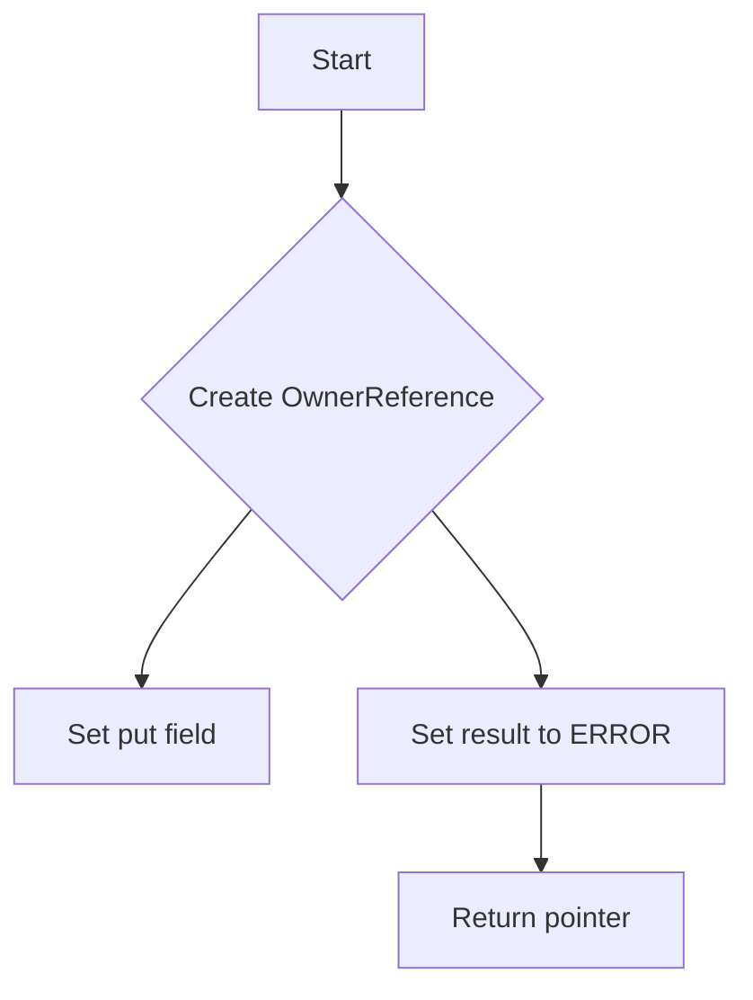
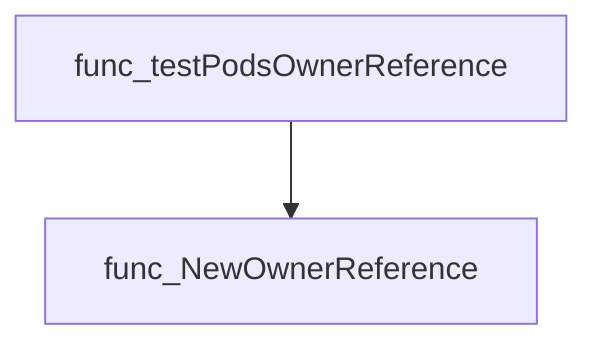
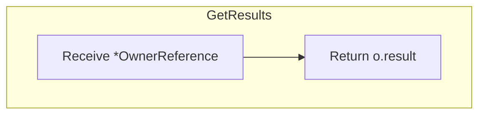
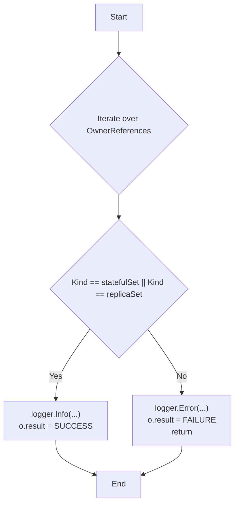
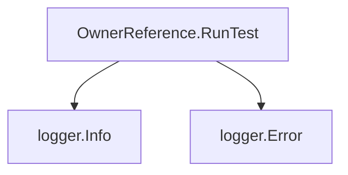

# Package ownerreference

**Path**: `tests/lifecycle/ownerreference`

## Table of Contents

- [Overview](#overview)
- [Structs](#structs)
  - [OwnerReference](#ownerreference)
- [Exported Functions](#exported-functions)
  - [NewOwnerReference](#newownerreference)
  - [OwnerReference.GetResults](#ownerreference.getresults)
  - [OwnerReference.RunTest](#ownerreference.runtest)

## Overview

Provides utilities for testing Kubernetes pod owner references within the Certsuite lifecycle tests.

### Key Features

- Creates and manages an OwnerReference instance tied to a specific Pod
- Runs validation checks on the pod’s owner references, logging progress and recording results
- Exposes the test outcome via a simple integer status

### Design Notes

- OwnerReference stores only a pointer to the pod and an int result, assuming one-to-one mapping per test run
- RunTest logs both informational steps and errors but does not propagate failures—errors are captured in result field
- Consumers should invoke GetResults after RunTest to determine pass/fail; negative values indicate failure

### Structs Summary

| Name | Purpose |
|------|----------|
| [**OwnerReference**](#ownerreference) | One-line purpose |

### Exported Functions Summary

| Name | Purpose |
|------|----------|
| [func NewOwnerReference(put *corev1.Pod) *OwnerReference](#newownerreference) | Instantiates a new `OwnerReference` struct for the provided Pod, initializing its result status to an error state. |
| [func (o *OwnerReference) GetResults() int](#ownerreference.getresults) | Returns the integer result currently stored in an `OwnerReference` instance. |
| [func (*OwnerReference) RunTest(*log.Logger)](#ownerreference.runtest) | Executes a series of checks on the owner references of a pod, logs progress, and records success or failure in `o.result`. |

## Structs

### OwnerReference


The `OwnerReference` type encapsulates a Kubernetes Pod and records the outcome of a test that verifies whether the pod’s owner references belong to acceptable resource kinds (`StatefulSet` or `ReplicaSet`).

#### Fields
| Field | Type | Description |
|-------|------|-------------|
| `put` | `*corev1.Pod` | Reference to the Pod under test. |
| `result` | `int` | Numeric status of the test (e.g., success, failure). |

#### Purpose
`OwnerReference` is used in lifecycle tests to assert that a pod’s owner references are of the expected kinds. It stores the pod being examined and the result of the validation, enabling later retrieval via `GetResults()`.

#### Related functions
| Function | Purpose |
|----------|---------|
| `NewOwnerReference(put *corev1.Pod) *OwnerReference` | Creates a new instance initialized with the given pod and a default error status. |
| `OwnerReference.GetResults() int` | Returns the stored test result. |
| `OwnerReference.RunTest(logger *log.Logger)` | Iterates over the pod’s owner references, logs details, and updates the result based on whether each reference is of kind `StatefulSet` or `ReplicaSet`. |

---

---

## Exported Functions

### NewOwnerReference

**NewOwnerReference** - Instantiates a new `OwnerReference` struct for the provided Pod, initializing its result status to an error state.


#### Signature (Go)

```go
func NewOwnerReference(put *corev1.Pod) *OwnerReference
```

#### Summary Table

| Aspect | Details |
|--------|---------|
| **Purpose** | Instantiates a new `OwnerReference` struct for the provided Pod, initializing its result status to an error state. |
| **Parameters** | `put *corev1.Pod` – The Kubernetes Pod object whose ownership will be referenced. |
| **Return value** | `*OwnerReference` – A pointer to the newly created OwnerReference instance. |
| **Key dependencies** | - `corev1.Pod` from `k8s.io/api/core/v1` <br>- `testhelper.ERROR` status flag |
| **Side effects** | None; only returns a new struct without modifying external state. |
| **How it fits the package** | Provides a helper to create OwnerReference objects that are later used for compliance checks on Pod ownership within the lifecycle tests. |

#### Internal workflow (Mermaid)



#### Function dependencies

None – this function is currently not referenced elsewhere in the package.

#### Functions calling `NewOwnerReference` (Mermaid)



#### Usage example (Go)

```go
// Minimal example invoking NewOwnerReference
import (
    corev1 "k8s.io/api/core/v1"
    ownerreference "github.com/redhat-best-practices-for-k8s/certsuite/tests/lifecycle/ownerreference"
)

// Assume pod is an existing *corev1.Pod instance
var pod *corev1.Pod

// Create the OwnerReference wrapper for compliance checks
or := ownerreference.NewOwnerReference(pod)

// The returned object can now be used to run tests, e.g.:
// or.RunTest(logger)
```

---

### OwnerReference.GetResults

**GetResults** - Returns the integer result currently stored in an `OwnerReference` instance.


#### Signature (Go)

```go
func (o *OwnerReference) GetResults() int
```

#### Summary Table

| Aspect | Details |
|--------|---------|
| **Purpose** | Returns the integer result currently stored in an `OwnerReference` instance. |
| **Parameters** | None – the method operates on the receiver `*OwnerReference`. |
| **Return value** | An `int` representing the saved result. |
| **Key dependencies** | • None – this method performs a simple field read. |
| **Side effects** | No state changes, no I/O, no concurrency operations. |
| **How it fits the package** | Provides public access to the internal `result` field of `OwnerReference`, allowing external code (e.g., tests) to inspect the outcome after lifecycle operations. |

#### Internal workflow



#### Function dependencies

None – this function is currently not referenced elsewhere in the package.

#### Functions calling `OwnerReference.GetResults`

None – this function is currently not referenced elsewhere in the package.

#### Usage example (Go)

```go
// Minimal example invoking OwnerReference.GetResults
package main

import (
	"fmt"

	"github.com/redhat-best-practices-for-k8s/certsuite/tests/lifecycle/ownerreference"
)

func main() {
	or := &ownerreference.OwnerReference{result: 42}
	fmt.Println("Result:", or.GetResults()) // Output: Result: 42
}
```

---

### OwnerReference.RunTest

**RunTest** - Executes a series of checks on the owner references of a pod, logs progress, and records success or failure in `o.result`.


#### Signature (Go)
```go
func (*OwnerReference) RunTest(*log.Logger)
```

#### Summary Table
| Aspect | Details |
|--------|---------|
| **Purpose** | Executes a series of checks on the owner references of a pod, logs progress, and records success or failure in `o.result`. |
| **Parameters** | `logger *log.Logger` – logger used to output informational or error messages. |
| **Return value** | None; results are stored directly on the receiver (`o.result`). |
| **Key dependencies** | • `logger.Info`<br>• `logger.Error`<br>• `testhelper.SUCCESS`, `testhelper.FAILURE` |
| **Side effects** | Modifies `o.result`; writes log entries. |
| **How it fits the package** | Part of the lifecycle tests for owner references; verifies that pods are owned by StatefulSet or ReplicaSet objects. |

#### Internal workflow (Mermaid)


#### Function dependencies (Mermaid)


#### Functions calling `OwnerReference.RunTest` (Mermaid)
None – this function is currently not referenced elsewhere in the package.

#### Usage example (Go)
```go
// Minimal example invoking OwnerReference.RunTest
package main

import (
	"log"

	"github.com/redhat-best-practices-for-k8s/certsuite/tests/lifecycle/ownerreference"
)

func main() {
	logger := log.Default()
	or := &ownerreference.OwnerReference{
		put:     "mypod",
		result:  "", // will be set by RunTest
	}
	or.RunTest(logger)
}
```

---

