# Package podrecreation

**Path**: `tests/lifecycle/podrecreation`

## Table of Contents

- [Overview](#overview)
- [Exported Functions](#exported-functions)
  - [CordonCleanup](#cordoncleanup)
  - [CordonHelper](#cordonhelper)
  - [CountPodsWithDelete](#countpodswithdelete)
- [Local Functions](#local-functions)
  - [deletePod](#deletepod)
  - [skipDaemonPod](#skipdaemonpod)
  - [waitPodDeleted](#waitpoddeleted)

## Overview

This package implements the logic for pod‑recreation tests in CertSuite’s lifecycle suite, handling node cordoning/uncordoning and controlled deletion of deployment or statefulset pods on a target node.

### Key Features

- CordonHelper – toggles a node’s *Unschedulable* flag to cordon or uncordon it
- CountPodsWithDelete – enumerates and optionally deletes pods belonging to Deployments, StatefulSets, or DaemonSets with configurable delete mode (Foreground/Background)
- waitPodDeleted – watches the namespace for pod removal and times out if deletion stalls

### Design Notes

- CordonHelper uses a retry loop to cope with Kubernetes update conflicts
- CountPodsWithDelete skips daemon‑set pods because they should not be removed during recreation tests
- Deletion of non‑background pods is performed asynchronously and waited on via a WaitGroup to ensure full cleanup before proceeding

### Exported Functions Summary

| Name | Purpose |
|------|----------|
| [func CordonCleanup(node string, check *checksdb.Check)](#cordoncleanup) | Ensures a Kubernetes node is marked schedulable again after test operations. It attempts to uncordon the node and aborts the test if this fails. |
| [func CordonHelper(name, operation string) error](#cordonhelper) | Sets the *Unschedulable* flag on a Kubernetes node to either cordon or uncordon it. |
| [func CountPodsWithDelete(pods []*provider.Pod, nodeName, mode string) (count int, err error)](#countpodswithdelete) | Counts all deployment or statefulset pods scheduled on a specified node. If `mode` is not `NoDelete`, it initiates deletion of those pods using the appropriate delete mode (`Foreground` or `Background`). |

### Local Functions Summary

| Name | Purpose |
|------|----------|
| [func deletePod(pod *corev1.Pod, mode string, wg *sync.WaitGroup) error](#deletepod) | Removes a pod from the cluster. If the deletion mode is not background, it spawns a goroutine that waits for the pod to be fully deleted before signalling completion via the supplied `WaitGroup`. |
| [func skipDaemonPod(pod *corev1.Pod) bool](#skipdaemonpod) | Determines whether a pod is owned by a DaemonSet and should therefore be exempt from deletion during recreation tests. |
| [func waitPodDeleted(ns string, podName string, timeout int64, watcher watch.Interface)](#waitpoddeleted) | Monitors the specified Kubernetes namespace for the deletion of a pod named `podName`. If the pod is deleted or the watcher signals a deletion event, the function returns. It also times out after `timeout` seconds if no deletion occurs. |

## Exported Functions

### CordonCleanup

**CordonCleanup** - Ensures a Kubernetes node is marked schedulable again after test operations. It attempts to uncordon the node and aborts the test if this fails.

#### 1) Signature (Go)

```go
func CordonCleanup(node string, check *checksdb.Check)
```

---

#### 2) Summary Table

| Aspect | Details |
|--------|---------|
| **Purpose** | Ensures a Kubernetes node is marked schedulable again after test operations. It attempts to uncordon the node and aborts the test if this fails. |
| **Parameters** | `node string` – name of the node to uncordon.<br>`check *checksdb.Check` – context object used for logging, aborting, and reporting. |
| **Return value** | None (void). Errors are handled via the `check.Abort` method. |
| **Key dependencies** | - `CordonHelper(node, Uncordon)`<br>- `check.Abort(fmt.Sprintf(...))`<br>- `fmt.Sprintf` from standard library |
| **Side effects** | Calls `CordonHelper`, which updates the node’s spec via Kubernetes API.<br>May abort test execution through `check.Abort`. |
| **How it fits the package** | Part of pod‑recreation tests; invoked in a deferred cleanup loop to restore node state after each drain/cordon operation. |

---

#### 3) Internal workflow (Mermaid)

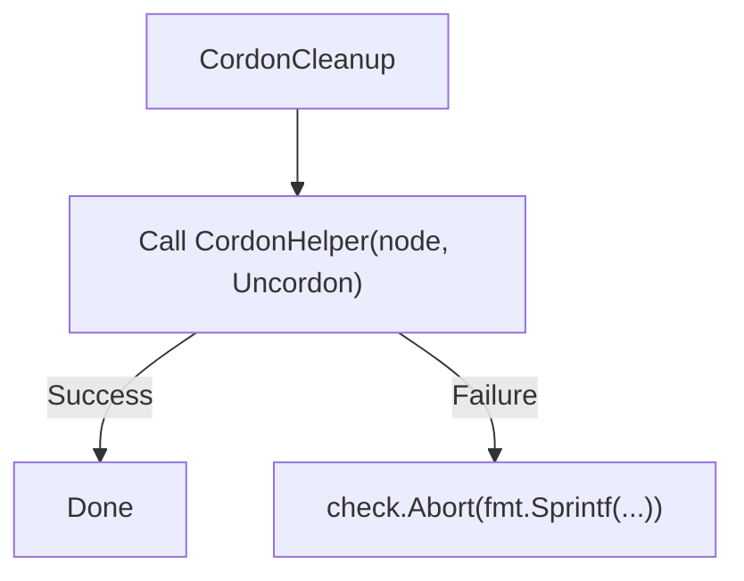

---

#### 4) Function dependencies (Mermaid)

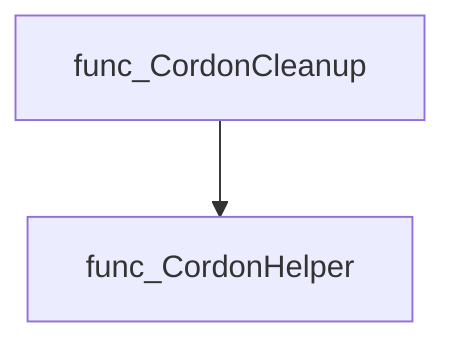

---

#### 5) Functions calling `CordonCleanup` (Mermaid)

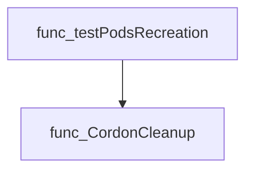

---

#### 6) Usage example (Go)

```go
// Minimal example invoking CordonCleanup
import (
    "github.com/redhat-best-practices-for-k8s/certsuite/tests/lifecycle/podrecreation"
    "github.com/redhat-best-practices-for-k8s/certsuite/internal/checksdb"
)

func example() {
    var check *checksdb.Check // assume initialized
    podrecreation.CordonCleanup("node-1", check)
}
```

---

---

### CordonHelper

**CordonHelper** - Sets the *Unschedulable* flag on a Kubernetes node to either cordon or uncordon it.

#### 1) Signature (Go)

```go
func CordonHelper(name, operation string) error
```

#### 2) Summary Table

| Aspect | Details |
|--------|---------|
| **Purpose** | Sets the *Unschedulable* flag on a Kubernetes node to either cordon or uncordon it. |
| **Parameters** | `name` string – the node name; `operation` string – `"Cordon"` or `"Uncordon"`. |
| **Return value** | `error` – nil if the update succeeded, otherwise the error encountered (including retry failures). |
| **Key dependencies** | • `clientsholder.GetClientsHolder()`<br>• `log.Info`, `log.Error`<br>• `retry.RetryOnConflict`<br>• Kubernetes clientset (`CoreV1().Nodes()`) |
| **Side effects** | Mutates the node object in the cluster (sets `Spec.Unschedulable`). Performs I/O via API calls and may retry on conflicts. |
| **How it fits the package** | Provides a low‑level helper used by higher‑level pod‑recreation tests to drain or restore nodes during lifecycle checks. |

#### 3) Internal workflow (Mermaid)

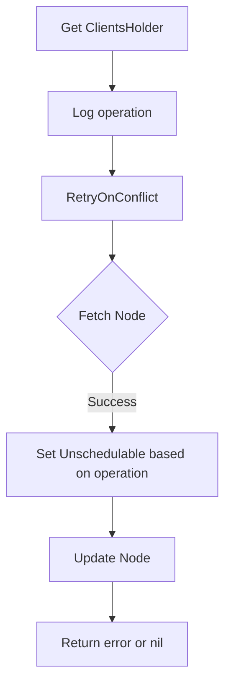

#### 4) Function dependencies (Mermaid)

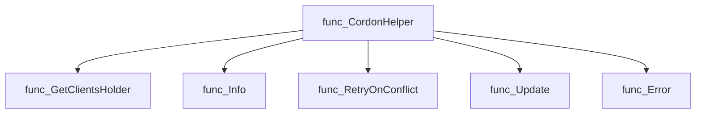

#### 5) Functions calling `CordonHelper` (Mermaid)

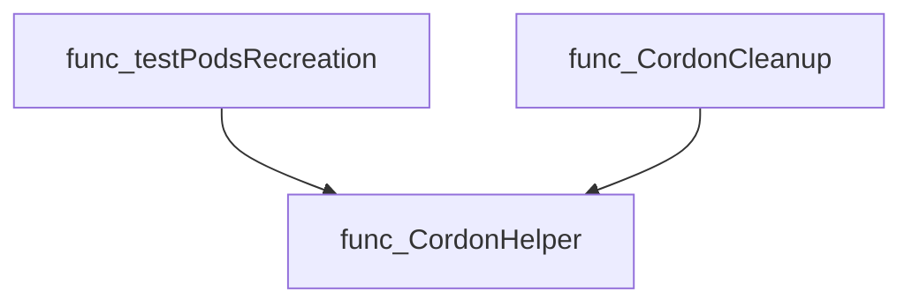

#### 6) Usage example (Go)

```go
// Minimal example invoking CordonHelper
import (
    "github.com/redhat-best-practices-for-k8s/certsuite/tests/lifecycle/podrecreation"
)

func main() {
    // Cordons a node named "worker-1"
    if err := podrecreation.CordonHelper("worker-1", podrecreation.Cordon); err != nil {
        log.Fatalf("Failed to cordon: %v", err)
    }

    // Later, uncordon the same node
    if err := podrecreation.CordonHelper("worker-1", podrecreation.Uncordon); err != nil {
        log.Fatalf("Failed to uncordon: %v", err)
    }
}
```

---

### CountPodsWithDelete

**CountPodsWithDelete** - Counts all deployment or statefulset pods scheduled on a specified node. If `mode` is not `NoDelete`, it initiates deletion of those pods using the appropriate delete mode (`Foreground` or `Background`).

#### Signature (Go)

```go
func CountPodsWithDelete(pods []*provider.Pod, nodeName, mode string) (count int, err error)
```

#### Summary Table

| Aspect | Details |
|--------|---------|
| **Purpose** | Counts all deployment or statefulset pods scheduled on a specified node. If `mode` is not `NoDelete`, it initiates deletion of those pods using the appropriate delete mode (`Foreground` or `Background`). |
| **Parameters** | `pods []*provider.Pod` – list of pod wrappers; `nodeName string` – target node; `mode string` – delete strategy (`NoDelete`, `DeleteForeground`, etc.). |
| **Return value** | `count int` – number of pods considered; `err error` – aggregated errors are not returned, only the first deletion error is logged. |
| **Key dependencies** | • `skipDaemonPod(pod *corev1.Pod) bool` – skips daemonset pods.<br>• `deletePod(pod *corev1.Pod, mode string, wg *sync.WaitGroup)` – performs the actual pod deletion and watcher setup.<br>• `log.Error` – logs deletion errors. |
| **Side effects** | Deletes pods in parallel via goroutines; blocks until all deletions complete (`wg.Wait()`). Logs but does not return individual deletion failures. |
| **How it fits the package** | Used by node‑draining tests to simulate pod recreation: first counts pods without deleting, then deletes them with a chosen mode and waits for completion before verifying cluster readiness. |

#### Internal workflow (Mermaid)

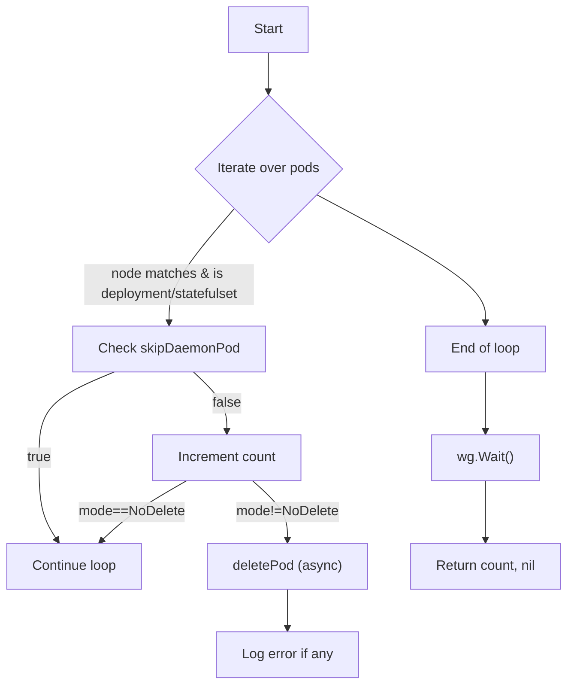

#### Function dependencies (Mermaid)

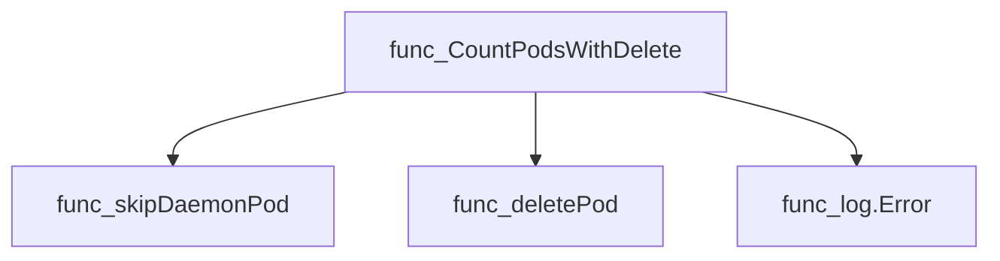

#### Functions calling `CountPodsWithDelete` (Mermaid)

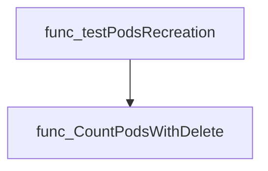

#### Usage example (Go)

```go
// Minimal example invoking CountPodsWithDelete
package main

import (
 "fmt"
 podrecreation "github.com/redhat-best-practices-for-k8s/certsuite/tests/lifecycle/podrecreation"
 provider "github.com/redhat-best-practices-for-k8s/certsuite/internal/provider"
)

func main() {
 // Assume pods is populated elsewhere
 var pods []*provider.Pod

 node := "worker-1"

 // Count pods without deleting
 count, err := podrecreation.CountPodsWithDelete(pods, node, podrecreation.NoDelete)
 if err != nil {
  fmt.Printf("Error counting pods: %v\n", err)
  return
 }
 fmt.Printf("Node %s has %d relevant pods.\n", node, count)

 // Delete pods with foreground mode
 _, err = podrecreation.CountPodsWithDelete(pods, node, podrecreation.DeleteForeground)
 if err != nil {
  fmt.Printf("Error deleting pods: %v\n", err)
 }
}
```

---

## Local Functions

### deletePod

**deletePod** - Removes a pod from the cluster. If the deletion mode is not background, it spawns a goroutine that waits for the pod to be fully deleted before signalling completion via the supplied `WaitGroup`.

Delete a Kubernetes pod and optionally wait for its removal based on the deletion mode.

```go
func deletePod(pod *corev1.Pod, mode string, wg *sync.WaitGroup) error
```

| Aspect | Details |
|--------|---------|
| **Purpose** | Removes a pod from the cluster. If the deletion mode is not background, it spawns a goroutine that waits for the pod to be fully deleted before signalling completion via the supplied `WaitGroup`. |
| **Parameters** | *`pod`* *corev1.Pod* – target pod<br>*`mode`* string – deletion strategy (`DeleteBackground`, `NoDelete`, etc.)<br>*`wg`* *sync.WaitGroup* – synchronisation aid for callers that need to know when the pod is gone |
| **Return value** | error – non‑nil if any step (watch creation or delete call) fails |
| **Key dependencies** | • `clientsholder.GetClientsHolder()` – retrieves shared Kubernetes client<br>• `log.Debug` / `log.Error` – logging utilities<br>• `clients.K8sClient.CoreV1().Pods(...).Watch(...)` – sets up a watch for the pod’s deletion event<br>• `clients.K8sClient.CoreV1().Pods(...).Delete(...)` – performs the actual delete call |
| **Side effects** | • Makes an API request to delete the pod.<br>• If `mode != DeleteBackground`, starts a goroutine that watches for the deletion event and decrements the `WaitGroup`. |
| **How it fits the package** | Used by higher‑level functions (e.g., `CountPodsWithDelete`) to remove pods during lifecycle tests, ensuring proper cleanup and optional waiting for completion. |

#### Internal workflow

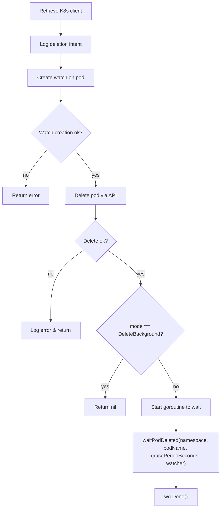

#### Function dependencies

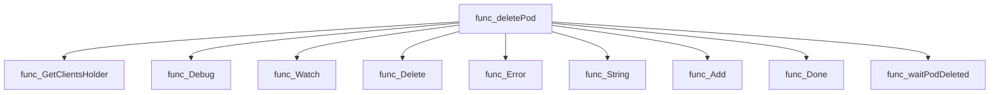

#### Functions calling `deletePod`

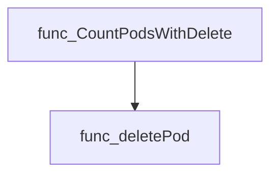

#### Usage example (Go)

```go
// Minimal example invoking deletePod
package main

import (
    "sync"

    corev1 "k8s.io/api/core/v1"
)

func main() {
    var wg sync.WaitGroup
    pod := &corev1.Pod{
        ObjectMeta: metav1.ObjectMeta{
            Namespace: "default",
            Name:      "example-pod",
        },
        Spec: corev1.PodSpec{
            TerminationGracePeriodSeconds: ptr.Int64(30),
        },
    }
    // Mode can be "DeleteBackground" or any custom string understood by the caller
    if err := deletePod(pod, "DeleteForeground", &wg); err != nil {
        fmt.Printf("Failed to delete pod: %v\n", err)
        return
    }
    wg.Wait() // Wait until the pod is fully deleted (if not background mode)
}
```

---

### skipDaemonPod

**skipDaemonPod** - Determines whether a pod is owned by a DaemonSet and should therefore be exempt from deletion during recreation tests.

#### Signature (Go)

```go
func skipDaemonPod(pod *corev1.Pod) bool
```

#### Summary Table

| Aspect | Details |
|--------|---------|
| **Purpose** | Determines whether a pod is owned by a DaemonSet and should therefore be exempt from deletion during recreation tests. |
| **Parameters** | `pod` – pointer to a `corev1.Pod`; the pod to inspect. |
| **Return value** | `bool`: `true` if the pod’s owner references include a DaemonSet, otherwise `false`. |
| **Key dependencies** | *Core Kubernetes API types* (`corev1.Pod`, `OwnerReference`). |
| **Side effects** | None; purely read‑only inspection. |
| **How it fits the package** | Used by the pod recreation logic to filter out DaemonSet pods, ensuring only user‑managed workloads are targeted for deletion. |

#### Internal workflow (Mermaid)

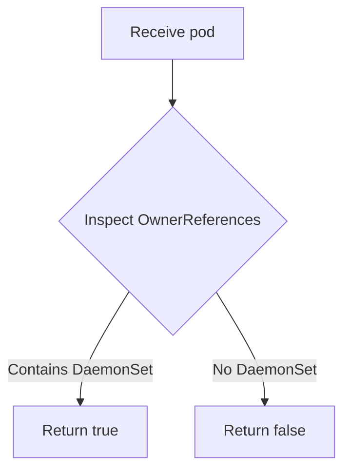

#### Function dependencies

None – this function is currently not referenced elsewhere in the package.

#### Functions calling `skipDaemonPod` (Mermaid)

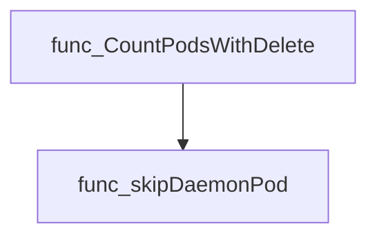

#### Usage example (Go)

```go
// Minimal example invoking skipDaemonPod
import (
 "k8s.io/api/core/v1"
)

func main() {
 pod := &v1.Pod{
  ObjectMeta: metav1.ObjectMeta{
   Name: "example",
   OwnerReferences: []metav1.OwnerReference{
    {Kind: "DaemonSet", Name: "ds-example"},
   },
  },
 }
 if skipDaemonPod(pod) {
  fmt.Println("Skipping pod owned by DaemonSet")
 } else {
  fmt.Println("Pod can be deleted")
 }
}
```

---

### waitPodDeleted

**waitPodDeleted** - Monitors the specified Kubernetes namespace for the deletion of a pod named `podName`. If the pod is deleted or the watcher signals a deletion event, the function returns. It also times out after `timeout` seconds if no deletion occurs.

#### 1) Signature (Go)

```go
func waitPodDeleted(ns string, podName string, timeout int64, watcher watch.Interface)
```

---

#### 2) Summary Table

| Aspect | Details |
|--------|---------|
| **Purpose** | Monitors the specified Kubernetes namespace for the deletion of a pod named `podName`. If the pod is deleted or the watcher signals a deletion event, the function returns. It also times out after `timeout` seconds if no deletion occurs. |
| **Parameters** | *`ns string` – Namespace containing the pod.<br>* `podName string` – Name of the pod to watch for deletion.<br>*`timeout int64` – Maximum number of seconds to wait before timing out.<br>* `watcher watch.Interface` – A Kubernetes watch interface that streams pod events. |
| **Return value** | None (void). The function signals completion by returning or timing out. |
| **Key dependencies** | • `log.Debug` and `log.Info` from the internal logging package<br>• `time.After`, `time.Duration` for timeout handling<br>• `watch.Interface.ResultChan()` to receive watch events |
| **Side effects** | *Stops the provided watcher (`watcher.Stop()`).<br>* Logs debug and info messages via the logger.<br>* No mutation of external state; only logs and internal control flow. |
| **How it fits the package** | In `podrecreation`, this helper is invoked after initiating a pod deletion to asynchronously wait for confirmation that the pod has been removed, ensuring subsequent tests run against the correct cluster state. |

---

#### 3) Internal workflow (Mermaid)

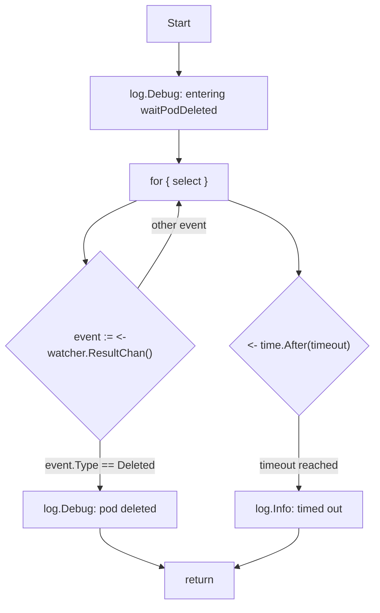

---

#### 4) Function dependencies (Mermaid)

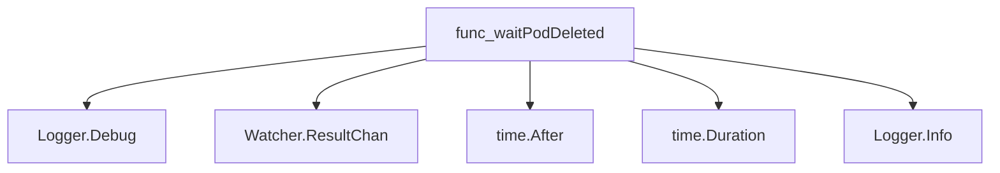

---

#### 5) Functions calling `waitPodDeleted` (Mermaid)

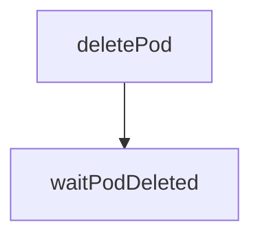

---

#### 6) Usage example (Go)

```go
// Minimal example invoking waitPodDeleted
import (
    "k8s.io/apimachinery/pkg/watch"
)

// Assume watcher is already created for the pod we want to monitor.
var ns = "default"
var podName = "example-pod"
var timeoutSeconds int64 = 30
var watcher watch.Interface // obtained from a Kubernetes client

waitPodDeleted(ns, podName, timeoutSeconds, watcher)
```

---

---
