# Package podsets

**Path**: `tests/lifecycle/podsets`

## Table of Contents

- [Overview](#overview)
- [Exported Functions](#exported-functions)
  - [GetAllNodesForAllPodSets](#getallnodesforallpodsets)
  - [WaitForAllPodSetsReady](#waitforallpodsetsready)
  - [WaitForStatefulSetReady](#waitforstatefulsetready)
- [Local Functions](#local-functions)
  - [getDeploymentsInfo](#getdeploymentsinfo)
  - [getNotReadyDeployments](#getnotreadydeployments)
  - [getNotReadyStatefulSets](#getnotreadystatefulsets)
  - [getStatefulSetsInfo](#getstatefulsetsinfo)
  - [isDeploymentReady](#isdeploymentready)
  - [isStatefulSetReady](#isstatefulsetready)

## Overview

The podsets package provides utilities for monitoring and waiting on Kubernetes Deployment and StatefulSet resources within test environments, ensuring that pods are correctly scheduled and ready before proceeding.

### Key Features

- Retrieves all nodes hosting ReplicaSet or StatefulSet pods
- Polls the cluster until Deployments and StatefulSets become ready or a timeout occurs
- Convenience functions to wait for individual StatefulSet readiness

### Design Notes

- Assumes provider package supplies status checks; errors logged but not propagated
- Limits polling granularity to Sleep intervals; may miss rapid state changes
- Best practice: use exported WaitFor… functions rather than internal helpers directly

### Exported Functions Summary

| Name | Purpose |
|------|----------|
| [func GetAllNodesForAllPodSets(pods []*provider.Pod) (nodes map[string]bool)](#getallnodesforallpodsets) | Returns a map of node names that host at least one pod whose owner is a ReplicaSet or StatefulSet. The boolean value in the map is always `true`. |
| [func WaitForAllPodSetsReady(env *provider.TestEnvironment, timeout time.Duration, logger *log.Logger) ([]*provider.Deployment, []*provider.StatefulSet)](#waitforallpodsetsready) | Repeatedly polls a test environment until all Deployments and StatefulSets are ready or a timeout expires. Returns the remaining not‑ready items. |
| [func WaitForStatefulSetReady(ns string, name string, timeout time.Duration, logger *log.Logger) bool](#waitforstatefulsetready) | Polls the Kubernetes API for a StatefulSet’s status and returns `true` when it becomes ready or `false` if the timeout is reached. |

### Local Functions Summary

| Name | Purpose |
|------|----------|
| [func getDeploymentsInfo(deployments []*provider.Deployment) []string](#getdeploymentsinfo) | Converts each `*provider.Deployment` into a string formatted as `<namespace>:<name>` and returns the collection. |
| [func getNotReadyDeployments(deployments []*provider.Deployment) []*provider.Deployment](#getnotreadydeployments) | Iterates over a slice of `Deployment` objects, checks each one's readiness via `isDeploymentReady`, and returns only those that are not ready or whose status could not be determined. |
| [func getNotReadyStatefulSets(statefulSets []*provider.StatefulSet) []*provider.StatefulSet](#getnotreadystatefulsets) | Iterates over a slice of `*provider.StatefulSet`, determines readiness via `isStatefulSetReady`, and returns only those that are not ready or whose status could not be retrieved. |
| [func getStatefulSetsInfo(statefulSets []*provider.StatefulSet) []string](#getstatefulsetsinfo) | Produces a slice of strings, each formatted as `namespace:name`, representing the location and identity of given StatefulSet resources. |
| [func isDeploymentReady(name, namespace string) (bool, error)](#isdeploymentready) | Determines if the specified Deployment has reached a ready state by delegating to provider logic. |
| [func isStatefulSetReady(name, namespace string) (bool, error)](#isstatefulsetready) | Determines readiness of a Kubernetes StatefulSet by retrieving its latest state and evaluating its status. |

## Exported Functions

### GetAllNodesForAllPodSets

**GetAllNodesForAllPodSets** - Returns a map of node names that host at least one pod whose owner is a ReplicaSet or StatefulSet. The boolean value in the map is always `true`.


#### Signature (Go)

```go
func GetAllNodesForAllPodSets(pods []*provider.Pod) (nodes map[string]bool)
```

#### Summary Table

| Aspect | Details |
|--------|---------|
| **Purpose** | Returns a map of node names that host at least one pod whose owner is a ReplicaSet or StatefulSet. The boolean value in the map is always `true`. |
| **Parameters** | `pods []*provider.Pod` – slice of all pods to inspect. |
| **Return value** | `nodes map[string]bool` – keys are node names; values are `true`. |
| **Key dependencies** | * `make` (to allocate the map) <br>* Iteration over pod and owner reference data structures |
| **Side effects** | None: pure function, no external state changes or I/O. |
| **How it fits the package** | Provides a helper for other tests that need to know which nodes contain pods from ReplicaSet or StatefulSet workloads (e.g., node draining tests). |

#### Internal workflow (Mermaid)

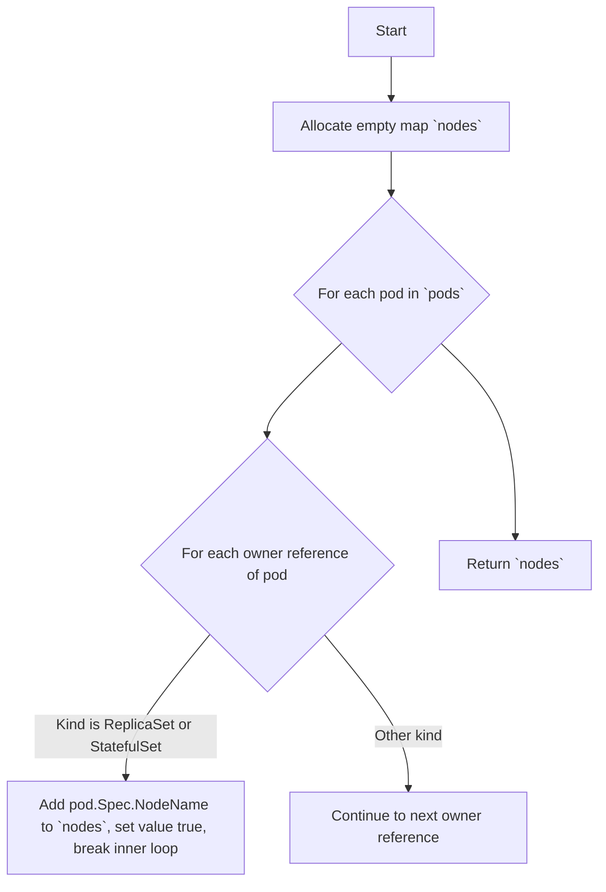

#### Function dependencies (Mermaid)

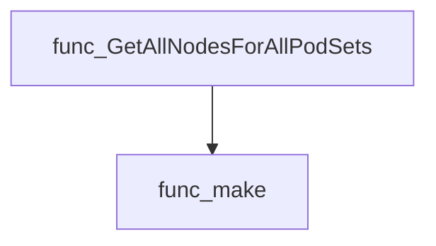

#### Functions calling `GetAllNodesForAllPodSets` (Mermaid)

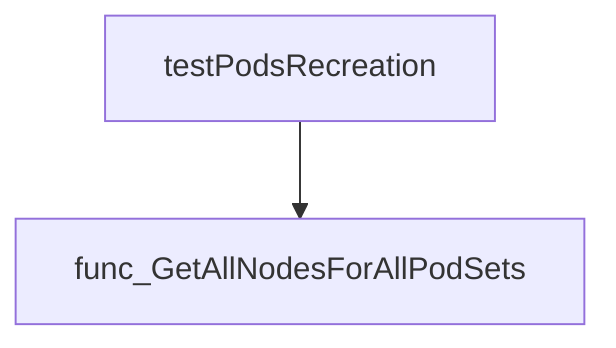

#### Usage example (Go)

```go
// Minimal example invoking GetAllNodesForAllPodSets
package main

import (
	"fmt"

	"github.com/redhat-best-practices-for-k8s/certsuite/tests/lifecycle/podsets"
	"github.com/redhat-best-practices-for-k8s/certsuite/tests/lifecycle/provider"
)

func main() {
	// Assume pods is a slice of *provider.Pod populated elsewhere
	var pods []*provider.Pod

	nodes := podsets.GetAllNodesForAllPodSets(pods)
	for nodeName := range nodes {
		fmt.Println("Node hosting RS/STS pod:", nodeName)
	}
}
```

---

### WaitForAllPodSetsReady

**WaitForAllPodSetsReady** - Repeatedly polls a test environment until all Deployments and StatefulSets are ready or a timeout expires. Returns the remaining not‑ready items.


#### Signature (Go)

```go
func WaitForAllPodSetsReady(env *provider.TestEnvironment, timeout time.Duration, logger *log.Logger) ([]*provider.Deployment, []*provider.StatefulSet)
```

#### Summary Table

| Aspect | Details |
|--------|---------|
| **Purpose** | Repeatedly polls a test environment until all Deployments and StatefulSets are ready or a timeout expires. Returns the remaining not‑ready items. |
| **Parameters** | `env *provider.TestEnvironment` – collection of podsets to check.<br>`timeout time.Duration` – maximum wait period.<br>`logger *log.Logger` – logger for progress and error reporting. |
| **Return value** | Two slices: deployments that never reached readiness, and StatefulSets that remained not ready after the timeout. |
| **Key dependencies** | `time.Sleep`, `time.Now`, `time.Since`, `time.Duration`; helper functions `getDeploymentsInfo`, `getStatefulSetsInfo`, `getNotReadyDeployments`, `getNotReadyStatefulSets`. |
| **Side effects** | Periodic logging; no mutation of the environment or podsets. |
| **How it fits the package** | Provides a blocking readiness check used by lifecycle tests to ensure resources are stable before proceeding with operations such as node draining or pod recreation. |

#### Internal workflow (Mermaid)

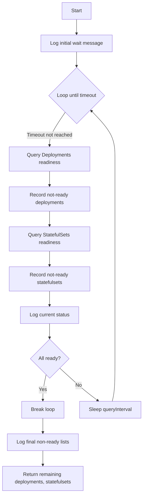

#### Function dependencies (Mermaid)

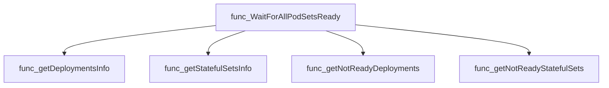

#### Functions calling `WaitForAllPodSetsReady` (Mermaid)

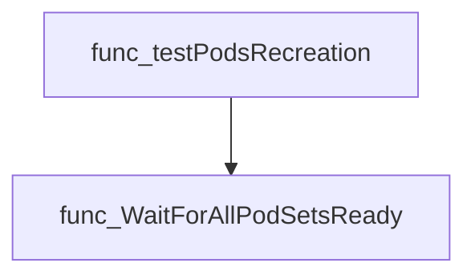

#### Usage example (Go)

```go
// Minimal example invoking WaitForAllPodSetsReady
env := provider.NewTestEnvironment()
timeout := 5 * time.Minute
logger := log.Default()

notReadyDeps, notReadySts := podsets.WaitForAllPodSetsReady(env, timeout, logger)
if len(notReadyDeps) > 0 || len(notReadySts) > 0 {
    fmt.Println("Some podsets never became ready")
}
```

---

### WaitForStatefulSetReady

**WaitForStatefulSetReady** - Polls the Kubernetes API for a StatefulSet’s status and returns `true` when it becomes ready or `false` if the timeout is reached.

Checks a StatefulSet in the specified namespace until it reports readiness or a timeout expires, logging progress throughout.

#### Signature (Go)
```go
func WaitForStatefulSetReady(ns string, name string, timeout time.Duration, logger *log.Logger) bool
```

#### Summary Table
| Aspect | Details |
|--------|---------|
| **Purpose** | Polls the Kubernetes API for a StatefulSet’s status and returns `true` when it becomes ready or `false` if the timeout is reached. |
| **Parameters** | `ns string – namespace of the StatefulSet`, `name string – name of the StatefulSet`, `timeout time.Duration – maximum wait time`, `logger *log.Logger – logger for debug/info/error messages`. |
| **Return value** | `bool – true if ready, false otherwise`. |
| **Key dependencies** | • `clientsholder.GetClientsHolder()`<br>• `time.Now()`, `time.Since()`, `time.Sleep()`<br>• `provider.GetUpdatedStatefulset()`<br>• `StatefulSet.IsStatefulSetReady()`<br>• Logger methods (`Debug`, `Info`, `Error`). |
| **Side effects** | • Makes repeated API calls to fetch the StatefulSet.<br>• Emits log messages; no mutation of external state. |
| **How it fits the package** | Utility function used by scaling helpers to ensure a StatefulSet is fully operational after changes. |

#### Internal workflow (Mermaid)
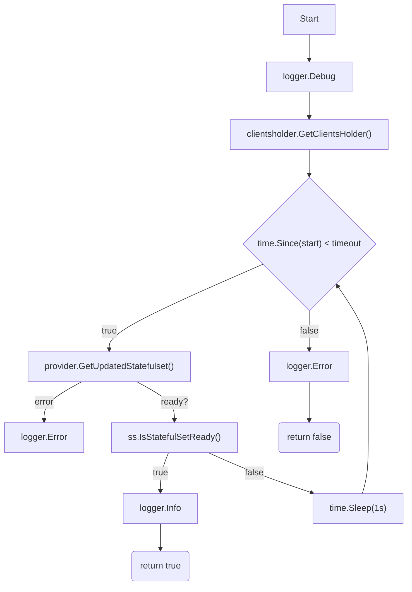

#### Function dependencies (Mermaid)
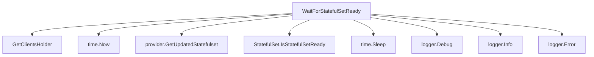

#### Functions calling `WaitForStatefulSetReady` (Mermaid)
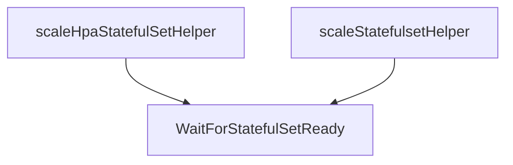

#### Usage example (Go)
```go
// Minimal example invoking WaitForStatefulSetReady
import (
    "log"
    "time"

    "github.com/redhat-best-practices-for-k8s/certsuite/tests/lifecycle/podsets"
)

func main() {
    logger := log.New(os.Stdout, "", log.LstdFlags)
    ready := podsets.WaitForStatefulSetReady("default", "my-app", 5*time.Minute, logger)
    if !ready {
        // handle timeout
    }
}
```

---

## Local Functions

### getDeploymentsInfo

**getDeploymentsInfo** - Converts each `*provider.Deployment` into a string formatted as `<namespace>:<name>` and returns the collection.


#### Signature (Go)

```go
func getDeploymentsInfo(deployments []*provider.Deployment) []string
```

#### Summary Table

| Aspect | Details |
|--------|---------|
| **Purpose** | Converts each `*provider.Deployment` into a string formatted as `<namespace>:<name>` and returns the collection. |
| **Parameters** | `deployments []*provider.Deployment` – slice of deployment pointers to process. |
| **Return value** | `[]string` – ordered list of “namespace:name” identifiers. |
| **Key dependencies** | • `append` (built‑in) <br>• `fmt.Sprintf` from the standard library |
| **Side effects** | None; pure function that only reads input and returns new data. |
| **How it fits the package** | Used by higher‑level test utilities to log or compare deployment identities during readiness checks. |

#### Internal workflow (Mermaid)

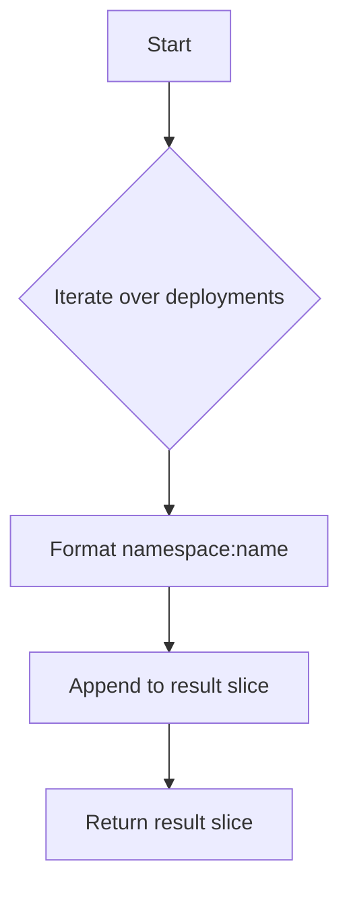

#### Function dependencies (Mermaid)

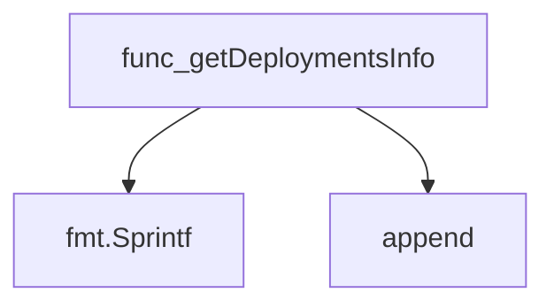

#### Functions calling `getDeploymentsInfo` (Mermaid)

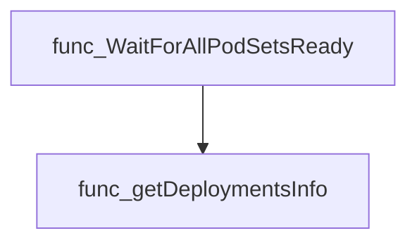

#### Usage example (Go)

```go
// Minimal example invoking getDeploymentsInfo
package main

import (
	"fmt"

	"github.com/redhat-best-practices-for-k8s/certsuite/tests/lifecycle/podsets"
	"github.com/redhat-best-practices-for-k8s/certsuite/tests/provider"
)

func main() {
	// Sample deployments (normally provided by the test environment)
	deployments := []*provider.Deployment{
		{Namespace: "tnf", Name: "test"},
		{Namespace: "tnf", Name: "hazelcast-platform-controller-manager"},
	}

	info := podsets.GetDeploymentsInfo(deployments) // note: function is unexported; in real use it would be called within the package
	fmt.Println(info)
}
```

---

### getNotReadyDeployments

**getNotReadyDeployments** - Iterates over a slice of `Deployment` objects, checks each one's readiness via `isDeploymentReady`, and returns only those that are not ready or whose status could not be determined.


#### Signature (Go)

```go
func getNotReadyDeployments(deployments []*provider.Deployment) []*provider.Deployment
```

#### Summary Table

| Aspect | Details |
|--------|---------|
| **Purpose** | Iterates over a slice of `Deployment` objects, checks each one's readiness via `isDeploymentReady`, and returns only those that are not ready or whose status could not be determined. |
| **Parameters** | `deployments []*provider.Deployment` – list to evaluate. |
| **Return value** | `[]*provider.Deployment` – subset containing non‑ready deployments. |
| **Key dependencies** | * `isDeploymentReady(name, namespace)` – determines readiness.<br>* `log.Error`, `log.Debug` – logging side effects.<br>* `append` – slice manipulation.<br>* `dep.ToString()` – string representation for logs. |
| **Side effects** | Logs errors and debug messages; does not modify input slice or external state. |
| **How it fits the package** | Used by the pod‑set readiness checker (`WaitForAllPodSetsReady`) to iteratively filter out ready deployments until all are confirmed ready or a timeout occurs. |

#### Internal workflow (Mermaid)

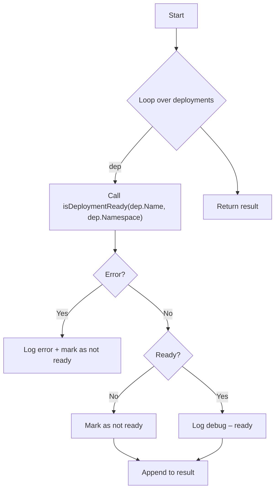

#### Function dependencies (Mermaid)

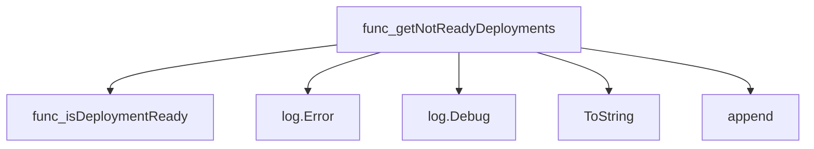

#### Functions calling `getNotReadyDeployments` (Mermaid)

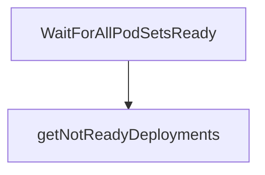

#### Usage example (Go)

```go
// Minimal example invoking getNotReadyDeployments
import (
    "github.com/redhat-best-practices-for-k8s/certsuite/tests/lifecycle/podsets"
    "github.com/redhat-best-practices-for-k8s/certsuite/internal/provider"
)

func main() {
    // Assume env.Deployments is already populated
    var deployments []*provider.Deployment

    notReady := podsets.GetNotReadyDeployments(deployments) // note: function is unexported; normally called within the package
    _ = notReady // use result as needed
}
```

---

### getNotReadyStatefulSets

**getNotReadyStatefulSets** - Iterates over a slice of `*provider.StatefulSet`, determines readiness via `isStatefulSetReady`, and returns only those that are not ready or whose status could not be retrieved.


#### Signature (Go)

```go
func getNotReadyStatefulSets(statefulSets []*provider.StatefulSet) []*provider.StatefulSet
```

#### Summary Table

| Aspect | Details |
|--------|---------|
| **Purpose** | Iterates over a slice of `*provider.StatefulSet`, determines readiness via `isStatefulSetReady`, and returns only those that are not ready or whose status could not be retrieved. |
| **Parameters** | `statefulSets []*provider.StatefulSet` – list of StatefulSets to evaluate. |
| **Return value** | `[]*provider.StatefulSet` – the subset of input StatefulSets that are not ready or failed to query. |
| **Key dependencies** | • `isStatefulSetReady(name, namespace string) (bool, error)`<br>• Logging via `log.Error`, `log.Debug` |
| **Side effects** | Emits debug/error logs; no mutation of input slice. |
| **How it fits the package** | Used by `WaitForAllPodSetsReady` to repeatedly poll podset readiness during test setup. |

#### Internal workflow (Mermaid)

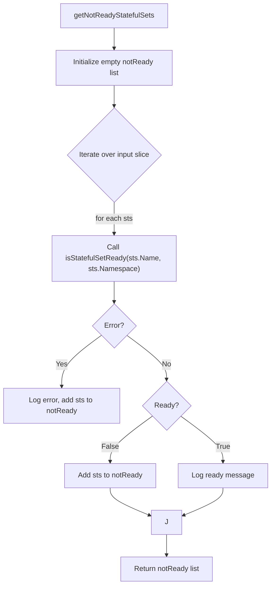

#### Function dependencies (Mermaid)

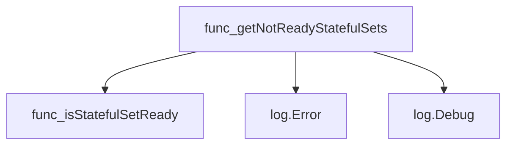

#### Functions calling `getNotReadyStatefulSets` (Mermaid)

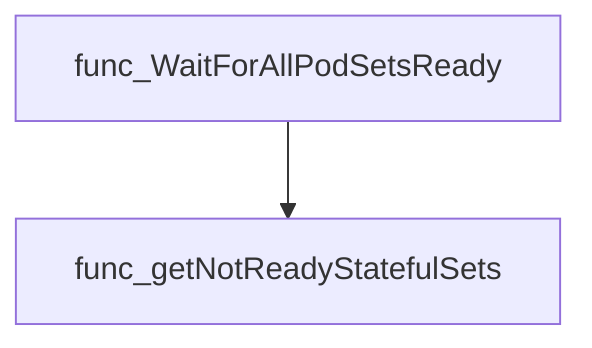

#### Usage example (Go)

```go
// Minimal example invoking getNotReadyStatefulSets
import (
    "github.com/redhat-best-practices-for-k8s/certsuite/tests/lifecycle/podsets"
    "github.com/redhat-best-practices-for-k8s/certsuite/internal/provider"
)

func example() {
    // Assume stsList is obtained from the test environment.
    var stsList []*provider.StatefulSet
    notReady := podsets.getNotReadyStatefulSets(stsList)
    fmt.Printf("Found %d not‑ready StatefulSets\n", len(notReady))
}
```

---

---

### getStatefulSetsInfo

**getStatefulSetsInfo** - Produces a slice of strings, each formatted as `namespace:name`, representing the location and identity of given StatefulSet resources.


#### Signature (Go)

```go
func getStatefulSetsInfo(statefulSets []*provider.StatefulSet) []string
```

#### Summary Table

| Aspect | Details |
|--------|---------|
| **Purpose** | Produces a slice of strings, each formatted as `namespace:name`, representing the location and identity of given StatefulSet resources. |
| **Parameters** | `statefulSets []*provider.StatefulSet` – collection of StatefulSet pointers to inspect. |
| **Return value** | `[]string` – list of namespace‑name pairs for all provided StatefulSets. |
| **Key dependencies** | • `append` (builtin) <br>• `fmt.Sprintf` from the standard library |
| **Side effects** | None; purely functional, no mutation of inputs or external state. |
| **How it fits the package** | Utility used by higher‑level monitoring functions to log and report readiness status of StatefulSets during test lifecycle. |

#### Internal workflow (Mermaid)

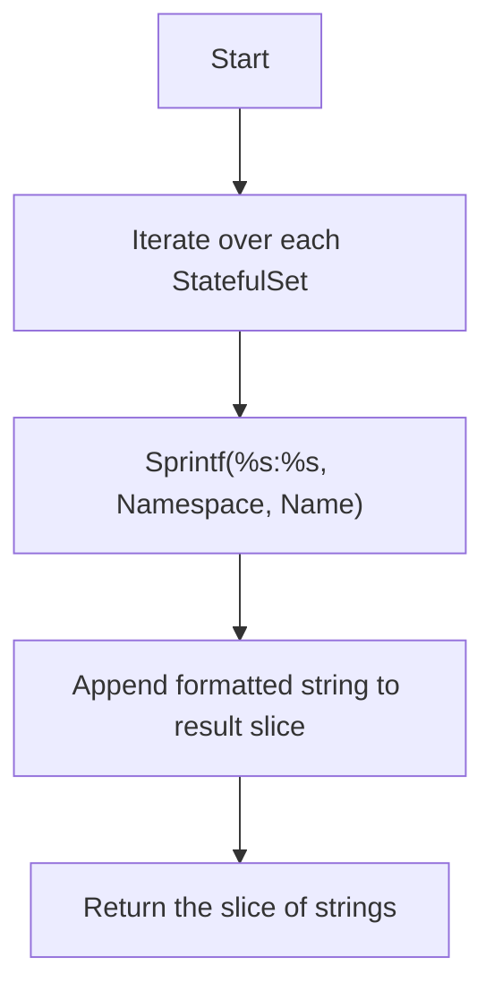

#### Function dependencies (Mermaid)

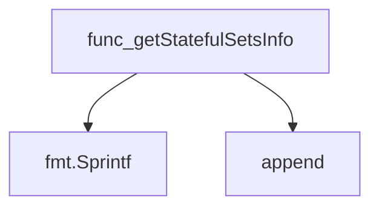

#### Functions calling `getStatefulSetsInfo` (Mermaid)

```mermaid
graph TD
  func_WaitForAllPodSetsReady --> func_getStatefulSetsInfo
```

#### Usage example (Go)

```go
// Minimal example invoking getStatefulSetsInfo
import (
	"github.com/redhat-best-practices-for-k8s/certsuite/tests/lifecycle/podsets"
	"github.com/redhat-best-practices-for-k8s/certsuite/provider"
)

func main() {
	var sts []*provider.StatefulSet
	// sts would be populated from a Kubernetes client or test fixture
	info := podsets.getStatefulSetsInfo(sts)
	for _, s := range info {
		fmt.Println(s) // prints namespace:name for each StatefulSet
	}
}
```

---

### isDeploymentReady

**isDeploymentReady** - Determines if the specified Deployment has reached a ready state by delegating to provider logic.


#### 1) Signature (Go)

```go
func isDeploymentReady(name, namespace string) (bool, error)
```

#### 2) Summary Table

| Aspect | Details |
|--------|---------|
| **Purpose** | Determines if the specified Deployment has reached a ready state by delegating to provider logic. |
| **Parameters** | `name` – deployment name; `namespace` – namespace containing the deployment. |
| **Return value** | `bool` – true if the deployment is ready; `error` – any error encountered while retrieving or evaluating the deployment. |
| **Key dependencies** | • `clientsholder.GetClientsHolder()`<br>• `k8s.io/client-go/kubernetes/typed/apps/v1.AppsV1Interface` (AppsV1 API)<br>• `provider.GetUpdatedDeployment()`<br>• `provider.Deployment.IsDeploymentReady()` |
| **Side effects** | None; performs read‑only operations against the Kubernetes cluster. |
| **How it fits the package** | Utility used by test helpers to filter deployments that are not yet ready during lifecycle tests. |

#### 3) Internal workflow (Mermaid)

```mermaid
flowchart TD
    A["Start"] --> B{"Retrieve AppsV1 client"}
    B --> C["get ClientsHolder"]
    C --> D["AppsV1 API"]
    D --> E{"Get Deployment"}
    E --> F["provider.GetUpdatedDeployment"]
    F --> G{"Check readiness"}
    G --> H["Return IsDeploymentReady result"]
```

#### 4) Function dependencies (Mermaid)

```mermaid
graph TD
  func_isDeploymentReady --> AppsV1
  func_isDeploymentReady --> func_GetClientsHolder
  func_isDeploymentReady --> func_GetUpdatedDeployment
  func_isDeploymentReady --> func_IsDeploymentReady
```

#### 5) Functions calling `isDeploymentReady` (Mermaid)

```mermaid
graph TD
  func_getNotReadyDeployments --> func_isDeploymentReady
```

#### 6) Usage example (Go)

```go
// Minimal example invoking isDeploymentReady
ready, err := podsets.isDeploymentReady("my-app", "default")
if err != nil {
    log.Fatalf("failed to check deployment readiness: %v", err)
}
fmt.Printf("Deployment ready: %t\n", ready)
```

---

### isStatefulSetReady

**isStatefulSetReady** - Determines readiness of a Kubernetes StatefulSet by retrieving its latest state and evaluating its status.

Checks whether a StatefulSet identified by name and namespace is ready in the cluster.

```go
func isStatefulSetReady(name, namespace string) (bool, error)
```

| Aspect | Details |
|--------|---------|
| **Purpose** | Determines readiness of a Kubernetes StatefulSet by retrieving its latest state and evaluating its status. |
| **Parameters** | `name` string – name of the StatefulSet; `namespace` string – namespace containing the StatefulSet. |
| **Return value** | `bool` – true if the StatefulSet is ready, false otherwise; `error` – non‑nil on retrieval or evaluation failure. |
| **Key dependencies** | • `clientsholder.GetClientsHolder()`<br>• `provider.GetUpdatedStatefulset(appsV1Api, namespace, name)`<br>• `sts.IsStatefulSetReady()` method of the returned StatefulSet |
| **Side effects** | None (pure function). |
| **How it fits the package** | Used by test helpers to filter ready vs. not‑ready StatefulSets during lifecycle tests. |

#### Internal workflow
```mermaid
flowchart TD
  A["Get K8s AppsV1 client"] --> B["Retrieve updated StatefulSet"]
  B --> C["Check readiness via IsStatefulSetReady()"]
```

#### Function dependencies
```mermaid
graph TD
  func_isStatefulSetReady --> func_GetClientsHolder
  func_isStatefulSetReady --> func_GetUpdatedStatefulset
  func_IsStatefulSetReady --> func_isStatefulSetReady
```

#### Functions calling `isStatefulSetReady`
```mermaid
graph TD
  func_getNotReadyStatefulSets --> func_isStatefulSetReady
```

#### Usage example (Go)
```go
// Minimal example invoking isStatefulSetReady
ready, err := podsets.isStatefulSetReady("my-statefulset", "default")
if err != nil {
    log.Fatalf("Failed to check readiness: %v", err)
}
fmt.Printf("StatefulSet ready: %t\n", ready)
```

---

