# Package scaling

**Path**: `tests/lifecycle/scaling`

## Table of Contents

- [Overview](#overview)
- [Exported Functions](#exported-functions)
  - [CheckOwnerReference](#checkownerreference)
  - [GetResourceHPA](#getresourcehpa)
  - [IsManaged](#ismanaged)
  - [TestScaleCrd](#testscalecrd)
  - [TestScaleDeployment](#testscaledeployment)
  - [TestScaleHPACrd](#testscalehpacrd)
  - [TestScaleHpaDeployment](#testscalehpadeployment)
  - [TestScaleHpaStatefulSet](#testscalehpastatefulset)
  - [TestScaleStatefulSet](#testscalestatefulset)
- [Local Functions](#local-functions)
  - [scaleCrHelper](#scalecrhelper)
  - [scaleDeploymentHelper](#scaledeploymenthelper)
  - [scaleHpaCRDHelper](#scalehpacrdhelper)
  - [scaleHpaDeploymentHelper](#scalehpadeploymenthelper)
  - [scaleHpaStatefulSetHelper](#scalehpastatefulsethelper)
  - [scaleStatefulsetHelper](#scalestatefulsethelper)

## Overview

The scaling package provides utilities and tests for verifying that Kubernetes resources—Deployments, StatefulSets, and Custom Resources—can be scaled up and down reliably, both with and without Horizontal Pod Autoscalers.

### Key Features

- Comprehensive test functions (e.g., TestScaleDeployment, TestScaleStatefulSet) that perform real scaling operations and validate readiness
- Helper routines that adjust replica counts while handling conflicts and waiting for pod or HPA stabilization
- Owner‑reference filtering to ensure only scalable CRDs are targeted

### Design Notes

- Scaling helpers retry on conflict to cope with concurrent updates; they block until the target resource reaches the desired state
- Tests operate against live clusters, so they require appropriate RBAC permissions and may be slow; use in integration or end‑to‑end test suites
- Owner reference checks rely on a filter list of CRDs marked as scalable; missing entries will cause tests to skip scaling for that CRD

### Exported Functions Summary

| Name | Purpose |
|------|----------|
| [func CheckOwnerReference(ownerReference []apiv1.OwnerReference, crdFilter []configuration.CrdFilter, crds []*apiextv1.CustomResourceDefinition) bool](#checkownerreference) | Evaluates whether all owner references of a Kubernetes object refer to CRDs that are marked as scalable in the supplied filter list. Returns `true` if at least one reference matches a scalable CRD; otherwise, returns `false`. |
| [func GetResourceHPA(hpaList []*scalingv1.HorizontalPodAutoscaler, name, namespace, kind string) *scalingv1.HorizontalPodAutoscaler](#getresourcehpa) | Searches a list of `HorizontalPodAutoscaler` objects for one that targets the specified resource (`name`, `namespace`, and `kind`) and returns it. |
| [func IsManaged(podSetName string, managedPodSet []configuration.ManagedDeploymentsStatefulsets) bool](#ismanaged) | Returns `true` if the supplied pod set name is present in the provided slice of `ManagedDeploymentsStatefulsets`; otherwise returns `false`. |
| [func (*provider.CrScale, schema.GroupResource, time.Duration, *log.Logger) bool](#testscalecrd) | Attempts to scale a Custom Resource up and down by one replica, verifying that scaling operations succeed. |
| [func TestScaleDeployment(deployment *appsv1.Deployment, timeout time.Duration, logger *log.Logger) bool](#testscaledeployment) | Determines whether a Kubernetes `Deployment` can be scaled up and down reliably when not managed by a Horizontal Pod Autoscaler. It performs a scale‑up followed by a scale‑down (or vice versa) and reports success or failure. |
| [func TestScaleHPACrd(cr *provider.CrScale, hpa *scalingv1.HorizontalPodAutoscaler, groupResourceSchema schema.GroupResource, timeout time.Duration, logger *log.Logger) bool](#testscalehpacrd) | Validates that a CR can be scaled via its HPA. It performs an up‑scale followed by a down‑scale (or vice versa), then restores the original HPA limits. |
| [func (*provider.Deployment, *v1autoscaling.HorizontalPodAutoscaler, time.Duration, *log.Logger) bool](#testscalehpadeployment) | Verifies that a Deployment managed by an HPA can be scaled up and down correctly while maintaining its desired replica count. |
| [func TestScaleHpaStatefulSet(statefulset *appsv1.StatefulSet, hpa *v1autoscaling.HorizontalPodAutoscaler, timeout time.Duration, logger *log.Logger) bool](#testscalehpastatefulset) | Attempts to scale a StatefulSet up and down using its Horizontal Pod Autoscaler (HPA), ensuring the HPA’s `minReplicas`/`maxReplicas` are respected and that the StatefulSet becomes ready after each operation. Returns `true` if all scaling steps succeed. |
| [func TestScaleStatefulSet(statefulset *appsv1.StatefulSet, timeout time.Duration, logger *log.Logger) bool](#testscalestatefulset) | Performs a basic scale test on a StatefulSet: scales it up if replicas ≤ 1, otherwise scales down. After each operation it waits for readiness via `scaleStatefulsetHelper`. Returns `true` only when both operations succeed. |

### Local Functions Summary

| Name | Purpose |
|------|----------|
| [func(scale.ScalesGetter, schema.GroupResource, *provider.CrScale, int32, bool, time.Duration, *log.Logger) bool](#scalecrhelper) | Adjusts the replica count of a CRD instance and waits for the scaling operation to complete. |
| [func scaleDeploymentHelper(     client typedappsv1.AppsV1Interface,     deployment *appsv1.Deployment,     replicas int32,     timeout time.Duration,     up bool,     logger *log.Logger, ) bool](#scaledeploymenthelper) | Adjusts a Deployment’s `spec.replicas` to the desired count, handling conflicts via retry and confirming pod readiness within a timeout. |
| [func scaleHpaCRDHelper(     hpscaler hps.HorizontalPodAutoscalerInterface,     hpaName string,     crName string,     namespace string,     min int32,     max int32,     timeout time.Duration,     groupResourceSchema schema.GroupResource,     logger *log.Logger, ) bool](#scalehpacrdhelper) | Updates the `minReplicas` and `maxReplicas` fields of a HorizontalPodAutoscaler (HPA), retries on conflicts, then waits for the associated CustomResource to reach the desired state. Returns `true` if successful. |
| [func scaleHpaDeploymentHelper(     hpscaler hps.HorizontalPodAutoscalerInterface,     hpaName, deploymentName, namespace string,     min, max int32,     timeout time.Duration,     logger *log.Logger, ) bool](#scalehpadeploymenthelper) | Updates a Horizontal Pod Autoscaler (HPA) to new minimum and maximum replica counts, retries on conflict, then waits until the associated deployment becomes ready. Returns `true` if all steps succeed. |
| [func scaleHpaStatefulSetHelper(     hpscaler hps.HorizontalPodAutoscalerInterface,     hpaName, statefulsetName, namespace string,     min, max int32,     timeout time.Duration,     logger *log.Logger) bool](#scalehpastatefulsethelper) | Atomically updates a Horizontal Pod Autoscaler's `MinReplicas` and `MaxReplicas`, then waits until the referenced StatefulSet reaches a ready state. Returns `true` on success, `false` otherwise. |
| [func scaleStatefulsetHelper(     clients *clientsholder.ClientsHolder,     ssClient v1.StatefulSetInterface,     statefulset *appsv1.StatefulSet,     replicas int32,     timeout time.Duration,     logger *log.Logger, ) bool](#scalestatefulsethelper) | Scales a StatefulSet to the desired replica count, retrying on conflicts and waiting for readiness. |

## Exported Functions

### CheckOwnerReference

**CheckOwnerReference** - Evaluates whether all owner references of a Kubernetes object refer to CRDs that are marked as scalable in the supplied filter list. Returns `true` if at least one reference matches a scalable CRD; otherwise, returns `false`.


#### Signature (Go)

```go
func CheckOwnerReference(ownerReference []apiv1.OwnerReference, crdFilter []configuration.CrdFilter, crds []*apiextv1.CustomResourceDefinition) bool
```

#### Summary Table

| Aspect | Details |
|--------|---------|
| **Purpose** | Evaluates whether all owner references of a Kubernetes object refer to CRDs that are marked as scalable in the supplied filter list. Returns `true` if at least one reference matches a scalable CRD; otherwise, returns `false`. |
| **Parameters** | - `ownerReference []apiv1.OwnerReference`: Owner references attached to the target object.<br>- `crdFilter []configuration.CrdFilter`: List of CRD name suffixes and their scalability flag.<br>- `crds []*apiextv1.CustomResourceDefinition`: All available CRDs in the cluster. |
| **Return value** | `bool` – `true` if a scalable owner reference is found, otherwise `false`. |
| **Key dependencies** | • `strings.HasSuffix` (standard library)<br>• Types from `apiv1`, `configuration`, and `apiextv1` packages. |
| **Side effects** | None; purely functional. |
| **How it fits the package** | Used by scaling tests (`testDeploymentScaling`, `testStatefulSetScaling`) to skip or flag resources whose ownership cannot be scaled due to non‑scalable CRDs. |

#### Internal workflow (Mermaid)

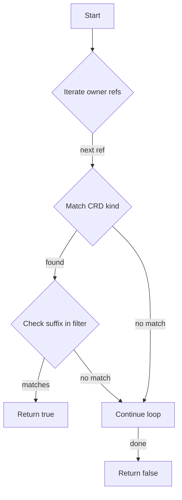

#### Function dependencies (Mermaid)

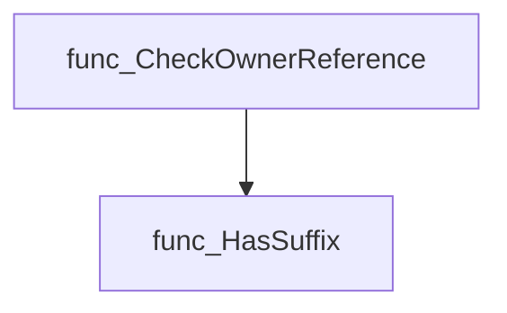

#### Functions calling `CheckOwnerReference` (Mermaid)

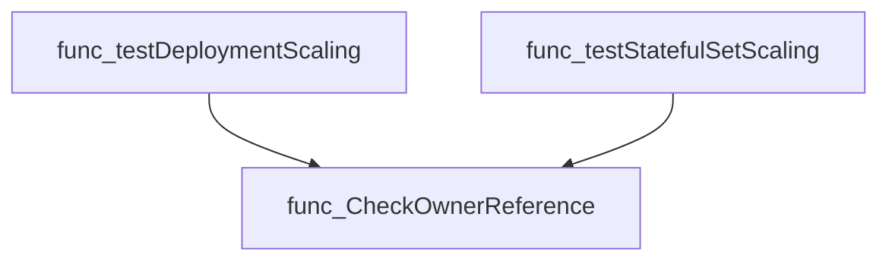

#### Usage example (Go)

```go
// Minimal example invoking CheckOwnerReference
import (
    apiv1 "k8s.io/api/core/v1"
    apiextv1 "k8s.io/apiextensions-apiserver/pkg/apis/apiextensions/v1"
    "github.com/redhat-best-practices-for-k8s/certsuite/tests/lifecycle/scaling/..."
)

func example() {
    ownerRefs := []apiv1.OwnerReference{
        {Kind: "Deployment", Name: "my-deploy"},
    }
    crdFilter := []configuration.CrdFilter{
        {NameSuffix: "-example.com", Scalable: true},
    }
    crds := []*apiextv1.CustomResourceDefinition{
        // populate with CRDs discovered in the cluster
    }

    scalable := scaling.CheckOwnerReference(ownerRefs, crdFilter, crds)
    if scalable {
        fmt.Println("Owner references are scalable")
    } else {
        fmt.Println("No scalable owner references found")
    }
}
```

---

### GetResourceHPA

**GetResourceHPA** - Searches a list of `HorizontalPodAutoscaler` objects for one that targets the specified resource (`name`, `namespace`, and `kind`) and returns it.


#### Signature (Go)
```go
func GetResourceHPA(hpaList []*scalingv1.HorizontalPodAutoscaler, name, namespace, kind string) *scalingv1.HorizontalPodAutoscaler
```

#### Summary Table
| Aspect | Details |
|--------|---------|
| **Purpose** | Searches a list of `HorizontalPodAutoscaler` objects for one that targets the specified resource (`name`, `namespace`, and `kind`) and returns it. |
| **Parameters** | - `hpaList []*scalingv1.HorizontalPodAutoscaler`: slice of HPA objects to search.<br>- `name string`: target resource name.<br>- `namespace string`: namespace of the target resource.<br>- `kind string`: kind of the target resource (e.g., `"Deployment"`). |
| **Return value** | `*scalingv1.HorizontalPodAutoscaler`: the matching HPA, or `nil` if none is found. |
| **Key dependencies** | - `scalingv1.HorizontalPodAutoscaler` type from the Kubernetes autoscaling API.<br>- Basic Go slice iteration and comparison operators. |
| **Side effects** | None – purely functional; does not modify input slices or external state. |
| **How it fits the package** | Provides a helper for test functions that need to determine whether a resource is managed by an HPA before performing scaling tests. |

#### Internal workflow (Mermaid)
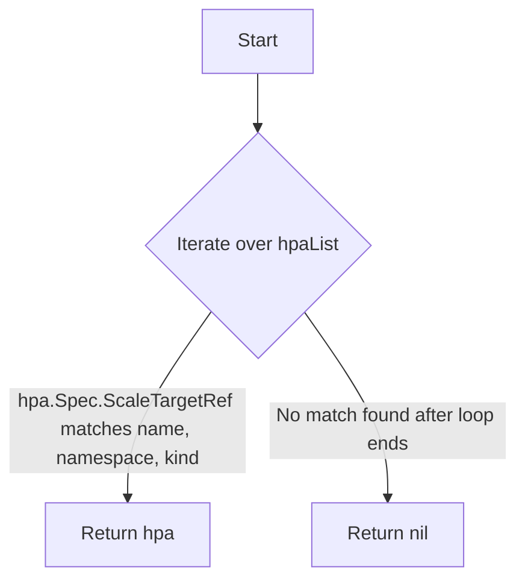

#### Function dependencies (Mermaid)
None – this function is currently not referenced elsewhere in the package.

#### Functions calling `GetResourceHPA` (Mermaid)
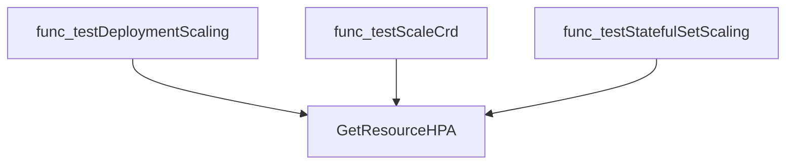

#### Usage example (Go)
```go
// Minimal example invoking GetResourceHPA
package main

import (
    "fmt"

    scalingv1 "k8s.io/api/autoscaling/v2beta2"
)

func main() {
    // Example HPA slice (normally obtained from the cluster)
    hpaList := []*scalingv1.HorizontalPodAutoscaler{
        &scalingv1.HorizontalPodAutoscaler{Spec: scalingv1.HorizontalPodAutoscalerSpec{
            ScaleTargetRef: scalingv1.CrossVersionObjectReference{
                Kind: "Deployment",
                Name: "frontend",
            },
        }},
    }

    // Look for an HPA controlling the "frontend" Deployment in "default"
    hpa := GetResourceHPA(hpaList, "frontend", "default", "Deployment")
    if hpa != nil {
        fmt.Println("Found HPA:", hpa.Name)
    } else {
        fmt.Println("No matching HPA found.")
    }
}
```

---

### IsManaged

**IsManaged** - Returns `true` if the supplied pod set name is present in the provided slice of `ManagedDeploymentsStatefulsets`; otherwise returns `false`.


Checks whether a given pod set name appears in a list of managed deployments or statefulsets.

---

#### Signature (Go)

```go
func IsManaged(podSetName string, managedPodSet []configuration.ManagedDeploymentsStatefulsets) bool
```

---

#### Summary Table

| Aspect | Details |
|--------|---------|
| **Purpose** | Returns `true` if the supplied pod set name is present in the provided slice of `ManagedDeploymentsStatefulsets`; otherwise returns `false`. |
| **Parameters** | `podSetName string` – name to look for.<br>`managedPodSet []configuration.ManagedDeploymentsStatefulsets` – slice containing known managed objects. |
| **Return value** | `bool` – `true` when a match is found, `false` otherwise. |
| **Key dependencies** | • Accesses the `Name` field of each element in `managedPodSet`. |
| **Side effects** | None; purely functional. |
| **How it fits the package** | Used by scaling tests to decide whether a deployment or statefulset should be considered for scaling checks. |

---

#### Internal workflow (Mermaid)

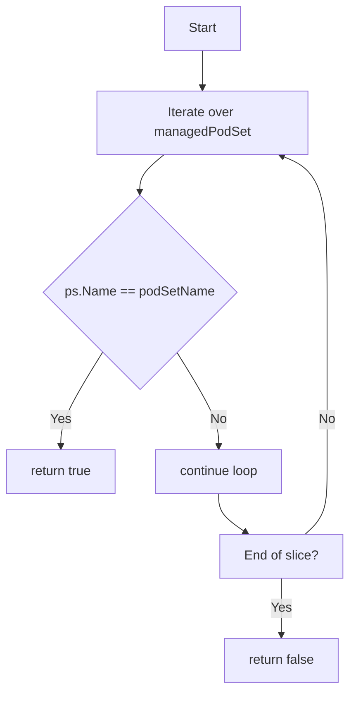

---

#### Function dependencies (Mermaid)

None – this function is currently not referenced elsewhere in the package.

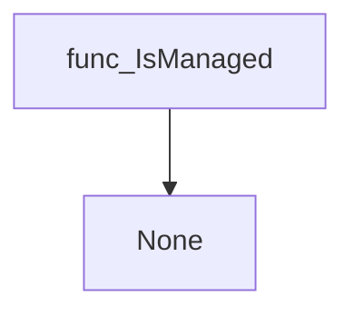

---

#### Functions calling `IsManaged` (Mermaid)

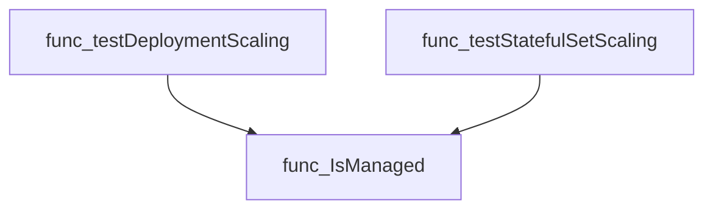

---

#### Usage example (Go)

```go
// Minimal example invoking IsManaged
import (
    "github.com/redhat-best-practices-for-k8s/certsuite/tests/lifecycle/scaling"
    "github.com/redhat-best-practices-for-k8s/certsuite/tests/lifecycle/configuration"
)

func main() {
    // Example list of managed objects
    managed := []configuration.ManagedDeploymentsStatefulsets{
        {Name: "frontend"},
        {Name: "backend"},
    }

    // Check if a pod set is managed
    if scaling.IsManaged("frontend", managed) {
        fmt.Println("This pod set is managed.")
    } else {
        fmt.Println("Not a managed pod set.")
    }
}
```

---

### TestScaleCrd

**TestScaleCrd** - Attempts to scale a Custom Resource up and down by one replica, verifying that scaling operations succeed.


#### Signature (Go)
```go
func (*provider.CrScale, schema.GroupResource, time.Duration, *log.Logger) bool
```

#### Summary Table
| Aspect | Details |
|--------|---------|
| **Purpose** | Attempts to scale a Custom Resource up and down by one replica, verifying that scaling operations succeed. |
| **Parameters** | `crScale` – pointer to the CR being tested.<br>`groupResourceSchema` – Kubernetes Group‑Resource of the CR.<br>`timeout` – maximum duration for waiting on scaling completion.<br>`logger` – logger for diagnostic messages. |
| **Return value** | `bool` – `true` if both scale‑up and scale‑down succeeded; otherwise `false`. |
| **Key dependencies** | • `clientsholder.GetClientsHolder()`<br>• `scaleCrHelper(...)` (internal helper that performs the actual scaling)<br>• Methods of `crScale`: `GetName()`, `GetNamespace()`, `Spec.Replicas` |
| **Side effects** | Calls to Kubernetes API via the dynamic scaler; logs errors and status messages. No global state mutation beyond those calls. |
| **How it fits the package** | Provides the core logic used by higher‑level test functions (`testScaleCrd`) to validate that a CR supports scaling without HPA. |

#### Internal workflow (Mermaid)
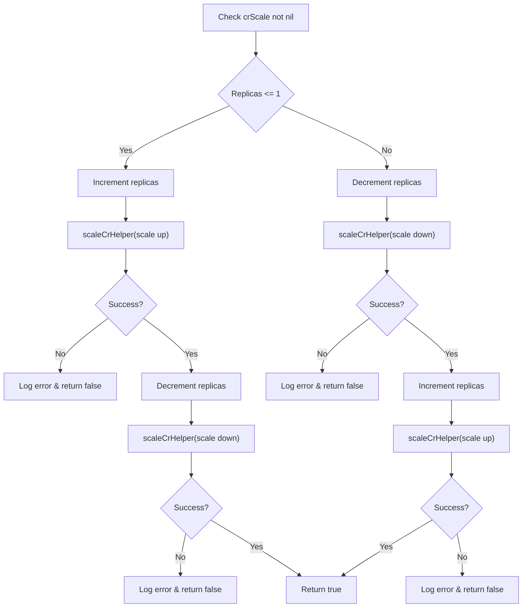

#### Function dependencies (Mermaid)
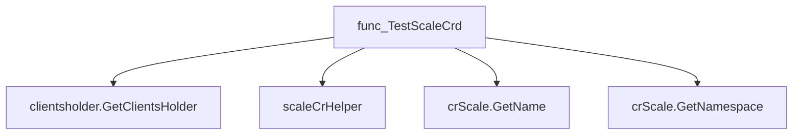

#### Functions calling `TestScaleCrd` (Mermaid)
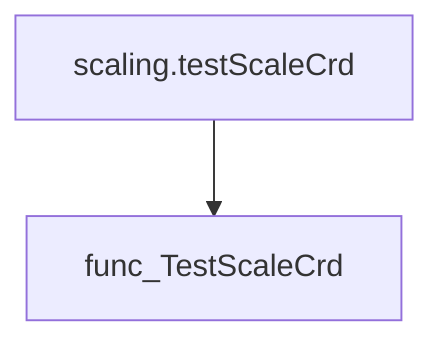

#### Usage example (Go)
```go
// Minimal example invoking TestScaleCrd
import (
    "time"
    "github.com/redhat-best-practices-for-k8s/certsuite/tests/lifecycle/scaling"
    "github.com/redhat-best-practices-for-k8s/certsuite/internal/provider"
    "k8s.io/apimachinery/pkg/runtime/schema"
    log "github.com/sirupsen/logrus"
)

func main() {
    // Assume crScale is obtained from somewhere
    var crScale *provider.CrScale
    groupRes := schema.GroupResource{Group: "example.com", Resource: "widgets"}
    timeout := 30 * time.Second
    logger := log.New()

    success := scaling.TestScaleCrd(crScale, groupRes, timeout, logger)
    if success {
        println("Scaling test passed")
    } else {
        println("Scaling test failed")
    }
}
```

---

### TestScaleDeployment

**TestScaleDeployment** - Determines whether a Kubernetes `Deployment` can be scaled up and down reliably when not managed by a Horizontal Pod Autoscaler. It performs a scale‑up followed by a scale‑down (or vice versa) and reports success or failure.


#### Signature (Go)
```go
func TestScaleDeployment(deployment *appsv1.Deployment, timeout time.Duration, logger *log.Logger) bool
```

#### Summary Table
| Aspect | Details |
|--------|---------|
| **Purpose** | Determines whether a Kubernetes `Deployment` can be scaled up and down reliably when not managed by a Horizontal Pod Autoscaler. It performs a scale‑up followed by a scale‑down (or vice versa) and reports success or failure. |
| **Parameters** | `deployment *appsv1.Deployment` – the Deployment to test; `timeout time.Duration` – maximum wait for readiness after each scaling operation; `logger *log.Logger` – logger used for informational and error messages. |
| **Return value** | `bool` – `true` if both scale operations succeeded, otherwise `false`. |
| **Key dependencies** | • `clientsholder.GetClientsHolder()` – obtains Kubernetes client set.<br>• `scaleDeploymentHelper` – performs the actual scaling logic with retries and readiness checks. |
| **Side effects** | Modifies the number of replicas in the Deployment during the test; logs progress and errors; does not persist changes beyond the test’s scope. |
| **How it fits the package** | Provides core functionality for non‑HPA scaling tests used by higher‑level test orchestration functions such as `testDeploymentScaling`. |

#### Internal workflow (Mermaid)
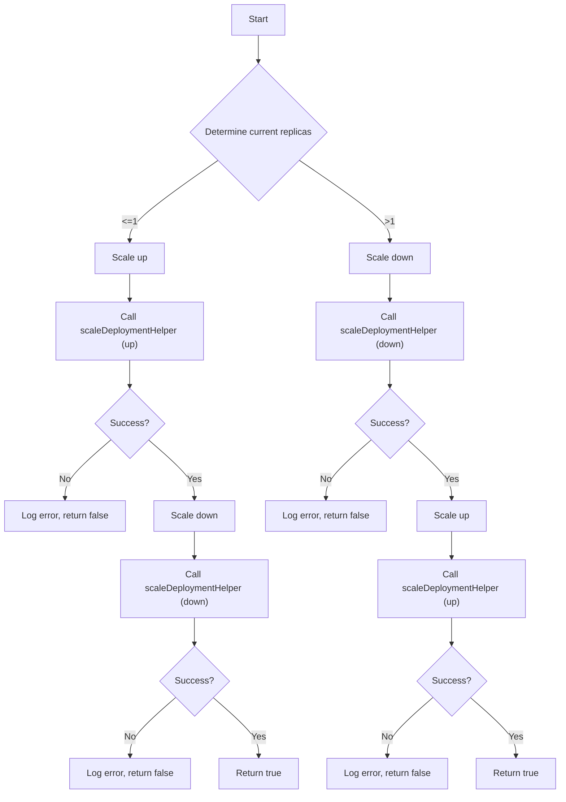

#### Function dependencies (Mermaid)
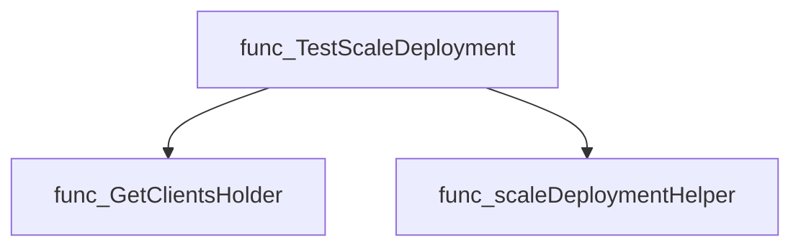

#### Functions calling `TestScaleDeployment` (Mermaid)
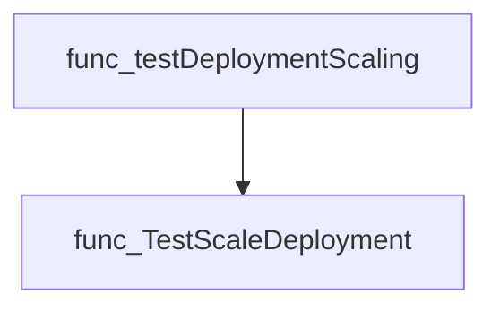

#### Usage example (Go)
```go
// Minimal example invoking TestScaleDeployment
import (
    "time"
    logpkg "github.com/redhat-best-practices-for-k8s/certsuite/internal/logging"
    appsv1 "k8s.io/api/apps/v1"
)

func main() {
    // Assume deployment is fetched elsewhere
    var deployment *appsv1.Deployment

    logger := logpkg.NewLogger()
    timeout := 2 * time.Minute

    success := scaling.TestScaleDeployment(deployment, timeout, logger)
    if success {
        fmt.Println("Scaling test passed")
    } else {
        fmt.Println("Scaling test failed")
    }
}
```

---

### TestScaleHPACrd

**TestScaleHPACrd** - Validates that a CR can be scaled via its HPA. It performs an up‑scale followed by a down‑scale (or vice versa), then restores the original HPA limits.


Performs a scaling test on a Custom Resource (CR) that is managed by a HorizontalPodAutoscaler (HPA). The function scales the CR up and down through the HPA, verifying that the HPA updates correctly and that the CR reaches the desired state.

---

#### Signature (Go)

```go
func TestScaleHPACrd(cr *provider.CrScale, hpa *scalingv1.HorizontalPodAutoscaler, groupResourceSchema schema.GroupResource, timeout time.Duration, logger *log.Logger) bool
```

---

#### Summary Table

| Aspect | Details |
|--------|---------|
| **Purpose** | Validates that a CR can be scaled via its HPA. It performs an up‑scale followed by a down‑scale (or vice versa), then restores the original HPA limits. |
| **Parameters** | `cr *provider.CrScale` – the CR to test.<br>`hpa *scalingv1.HorizontalPodAutoscaler` – the HPA controlling the CR.<br>`groupResourceSchema schema.GroupResource` – Kubernetes resource descriptor used for scaling checks.<br>`timeout time.Duration` – maximum wait time for each scaling operation.<br>`logger *log.Logger` – logger for debug/error output. |
| **Return value** | `bool` – `true` if all scaling steps succeeded, otherwise `false`. |
| **Key dependencies** | • `clientsholder.GetClientsHolder()`<br>• `hpscaler := clients.K8sClient.AutoscalingV1().HorizontalPodAutoscalers(namespace)`<br>• `scaleHpaCRDHelper` (internal helper for performing the actual HPA update and wait)<br>• Logging methods (`logger.Error`, `logger.Debug`) |
| **Side effects** | Calls the Kubernetes API to modify the HPA’s `minReplicas`/`maxReplicas`. No other global state is altered. |
| **How it fits the package** | Part of the `scaling` test suite; used by higher‑level tests (`testScaleCrd`) to verify that CRs with an HPA can be scaled correctly. |

---

#### Internal workflow (Mermaid)

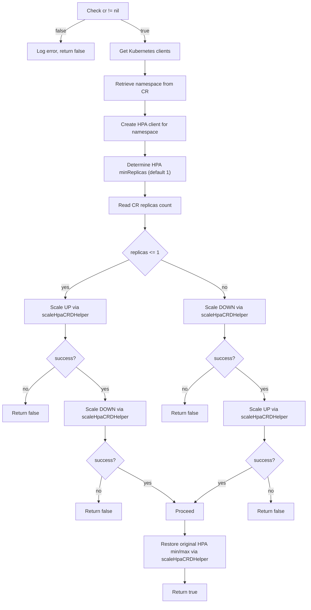

---

#### Function dependencies (Mermaid)

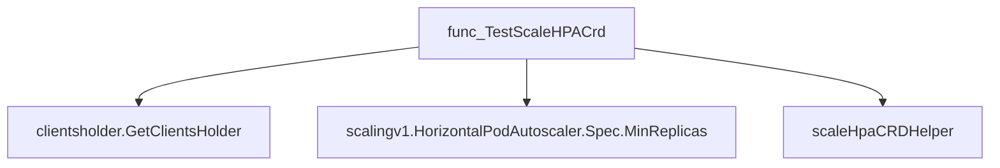

---

#### Functions calling `TestScaleHPACrd` (Mermaid)

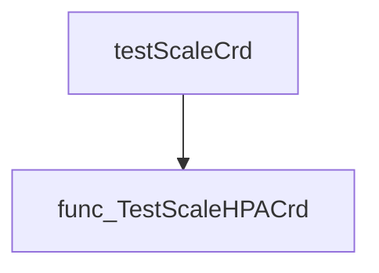

---

#### Usage example (Go)

```go
// Minimal example invoking TestScaleHPACrd
package main

import (
	"time"

	"github.com/redhat-best-practices-for-k8s/certsuite/tests/lifecycle/scaling"
	"github.com/redhat-best-practices-for-k8s/certsuite/internal/provider"
	"k8s.io/apimachinery/pkg/runtime/schema"
)

func main() {
	cr := &provider.CrScale{ /* populate fields */ }
	hpa := &scalingv1.HorizontalPodAutoscaler{ /* populate fields */ }
	groupRes := schema.GroupResource{Group: "apps", Resource: "deployments"}
	timeout := 5 * time.Minute
	logger := log.New(os.Stdout, "", log.LstdFlags)

	success := scaling.TestScaleHPACrd(cr, hpa, groupRes, timeout, logger)
	if success {
		fmt.Println("Scaling test passed")
	} else {
		fmt.Println("Scaling test failed")
	}
}
```

---

---

### TestScaleHpaDeployment

**TestScaleHpaDeployment** - Verifies that a Deployment managed by an HPA can be scaled up and down correctly while maintaining its desired replica count.


#### Signature (Go)
```go
func (*provider.Deployment, *v1autoscaling.HorizontalPodAutoscaler, time.Duration, *log.Logger) bool
```

#### Summary Table
| Aspect | Details |
|--------|---------|
| **Purpose** | Verifies that a Deployment managed by an HPA can be scaled up and down correctly while maintaining its desired replica count. |
| **Parameters** | `deployment` – Deployment to test; `hpa` – the owning HorizontalPodAutoscaler; `timeout` – maximum wait for readiness; `logger` – logging helper. |
| **Return value** | `bool` – `true` if all scaling steps succeeded, otherwise `false`. |
| **Key dependencies** | • `clientsholder.GetClientsHolder()` – retrieves Kubernetes clients.<br>• `clients.K8sClient.AutoscalingV1().HorizontalPodAutoscalers(namespace)` – HPA client.<br>• `scaleHpaDeploymentHelper` – performs the actual scaling and readiness checks. |
| **Side effects** | Modifies the HPA’s `minReplicas` and `maxReplicas`, updates Deployment replica counts, writes log messages, waits for pod set readiness within a timeout. |
| **How it fits the package** | Implements core logic used by higher‑level tests (`testDeploymentScaling`) to confirm that HPA‑controlled workloads behave correctly during scale operations. |

#### Internal workflow (Mermaid)
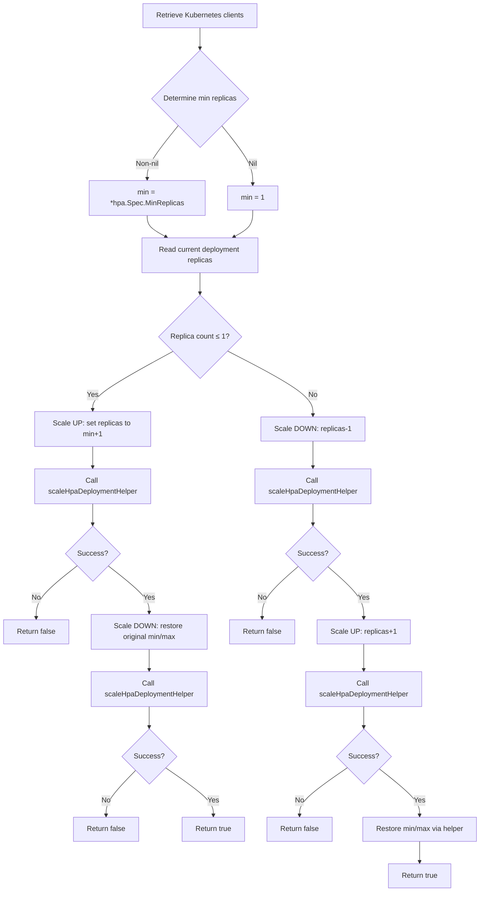

#### Function dependencies (Mermaid)
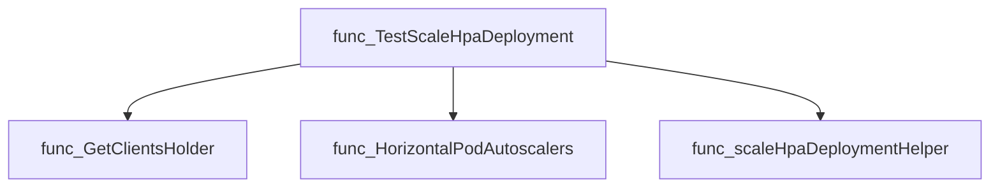

#### Functions calling `TestScaleHpaDeployment` (Mermaid)
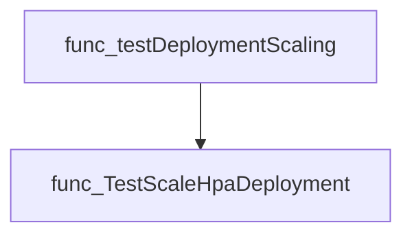

#### Usage example (Go)
```go
// Minimal example invoking TestScaleHpaDeployment
import (
    "time"
    log "github.com/sirupsen/logrus"

    "github.com/redhat-best-practices-for-k8s/certsuite/tests/lifecycle/scaling"
    "github.com/redhat-best-practices-for-k8s/certsuite/tests/lifecycle/provider"
    v1autoscaling "k8s.io/api/autoscaling/v1"
)

func main() {
    // Assume deployment and hpa have been fetched from the cluster
    var dep *provider.Deployment   // Deployment under test
    var hpa *v1autoscaling.HorizontalPodAutoscaler // Owning HPA

    logger := log.New()
    timeout := 2 * time.Minute

    success := scaling.TestScaleHpaDeployment(dep, hpa, timeout, logger)
    if !success {
        logger.Error("Scaling test failed")
    } else {
        logger.Info("Scaling test succeeded")
    }
}
```

---

---

### TestScaleHpaStatefulSet

**TestScaleHpaStatefulSet** - Attempts to scale a StatefulSet up and down using its Horizontal Pod Autoscaler (HPA), ensuring the HPA’s `minReplicas`/`maxReplicas` are respected and that the StatefulSet becomes ready after each operation. Returns `true` if all scaling steps succeed.


#### Signature (Go)
```go
func TestScaleHpaStatefulSet(statefulset *appsv1.StatefulSet, hpa *v1autoscaling.HorizontalPodAutoscaler, timeout time.Duration, logger *log.Logger) bool
```

#### Summary Table
| Aspect | Details |
|--------|---------|
| **Purpose** | Attempts to scale a StatefulSet up and down using its Horizontal Pod Autoscaler (HPA), ensuring the HPA’s `minReplicas`/`maxReplicas` are respected and that the StatefulSet becomes ready after each operation. Returns `true` if all scaling steps succeed. |
| **Parameters** | *statefulset* `*appsv1.StatefulSet` – target StatefulSet.<br>*hpa* `*v1autoscaling.HorizontalPodAutoscaler` – HPA controlling the StatefulSet.<br>*timeout* `time.Duration` – maximum wait for readiness after each scale.<br>*logger* `*log.Logger` – logger for debug and error messages. |
| **Return value** | `bool` – `true` when every scaling operation succeeded, otherwise `false`. |
| **Key dependencies** | • `clientsholder.GetClientsHolder()`<br>• `clients.K8sClient.AutoscalingV1().HorizontalPodAutoscalers(namespace)`<br>• `scaleHpaStatefulSetHelper` (internal retry‑and‑wait helper)<br>• Kubernetes client-go for HPA get/update and StatefulSet readiness checks |
| **Side effects** | Mutates the HPA’s `Spec.MinReplicas` and `Spec.MaxReplicas`. Triggers actual scaling of the StatefulSet via the HPA. Logs debug/error messages but does not modify global state beyond these operations. |
| **How it fits the package** | Part of the lifecycle scaling tests; used by higher‑level test functions to confirm that an HPA‑managed StatefulSet can be scaled reliably. |

#### Internal workflow (Mermaid)
```mermaid
flowchart TD
  A["Get Kubernetes clients"] --> B["Determine hpaName, namespace"]
  B --> C["Retrieve current replicas & min/max from statefulset/HPA"]
  C --> D{"replicas ≤ 1?"}
  D -- Yes --> E["Scale up to replicas+1 via helper"]
  E --> F["Check success"]
  F -- No --> G["Return false"]
  F -- Yes --> H["Scale down to replicas via helper"]
  H --> I["Check success"]
  I -- No --> G
  I -- Yes --> J["Proceed"]
  D -- No --> K["Scale down to replicas-1 via helper"]
  K --> L["Check success"]
  L -- No --> G
  L -- Yes --> M["Scale up to original replicas via helper"]
  M --> N["Check success"]
  N -- No --> G
  N -- Yes --> J
  J --> O["Restore HPA min/max via helper"]
  O --> P{"Success?"}
  P -- Yes --> Q["Return true"]
  P -- No --> G
```

#### Function dependencies (Mermaid)
```mermaid
graph TD
  func_TestScaleHpaStatefulSet --> clientsholder.GetClientsHolder
  func_TestScaleHpaStatefulSet --> scaleHpaStatefulSetHelper
  func_TestScaleHpaStatefulSet --> log.Logger
```

#### Functions calling `TestScaleHpaStatefulSet` (Mermaid)
```mermaid
graph TD
  testStatefulSetScaling --> TestScaleHpaStatefulSet
```

#### Usage example (Go)
```go
// Minimal example invoking TestScaleHpaStatefulSet
import (
    "time"
    log "github.com/sirupsen/logrus"

    appsv1 "k8s.io/api/apps/v1"
    autoscalingv1 "k8s.io/api/autoscaling/v1"
)

func main() {
    logger := log.New()
    // Assume statefulSet and hpa are obtained from a client or fixture
    var statefulSet *appsv1.StatefulSet
    var hpa *autoscalingv1.HorizontalPodAutoscaler

    timeout := 2 * time.Minute
    success := scaling.TestScaleHpaStatefulSet(statefulSet, hpa, timeout, logger)
    if success {
        logger.Info("Scaling test passed")
    } else {
        logger.Error("Scaling test failed")
    }
}
```

---

### TestScaleStatefulSet

**TestScaleStatefulSet** - Performs a basic scale test on a StatefulSet: scales it up if replicas ≤ 1, otherwise scales down. After each operation it waits for readiness via `scaleStatefulsetHelper`. Returns `true` only when both operations succeed.


#### Signature (Go)
```go
func TestScaleStatefulSet(statefulset *appsv1.StatefulSet, timeout time.Duration, logger *log.Logger) bool
```

#### Summary Table
| Aspect | Details |
|--------|---------|
| **Purpose** | Performs a basic scale test on a StatefulSet: scales it up if replicas ≤ 1, otherwise scales down. After each operation it waits for readiness via `scaleStatefulsetHelper`. Returns `true` only when both operations succeed. |
| **Parameters** | `statefulset *appsv1.StatefulSet` – target object; <br>`timeout time.Duration` – maximum wait for ready state; <br>`logger *log.Logger` – logger for debug/error output. |
| **Return value** | `bool` – `true` if scaling succeeded, `false` otherwise. |
| **Key dependencies** | • `clientsholder.GetClientsHolder()` to obtain Kubernetes clients.<br>• `scaleStatefulsetHelper` to perform the actual scale operation and wait for readiness.<br>• `log.Logger` methods (`Debug`, `Error`). |
| **Side effects** | Modifies the StatefulSet’s replica count in the cluster; writes logs. No other external state is altered. |
| **How it fits the package** | Provides the low‑level scaling routine used by higher‑level tests (e.g., `testStatefulSetScaling`) to verify that a StatefulSet can be scaled when not managed by an HPA. |

#### Internal workflow (Mermaid)
```mermaid
flowchart TD
  A["Get Kubernetes client"] --> B["Retrieve namespace & name"]
  B --> C["Determine current replicas"]
  C --> D{"replicas <= 1?"}
  D -- Yes --> E["Increment replicas"]
  E --> F["scaleStatefulsetHelper (up)"]
  F --> G{"success?"}
  G -- No --> H["Log error, return false"]
  G -- Yes --> I["Decrement replicas"]
  I --> J["scaleStatefulsetHelper (down)"]
  J --> K{"success?"}
  K -- No --> L["Log error, return false"]
  K -- Yes --> M["Return true"]
  D -- No --> N["Decrement replicas"]
  N --> O["scaleStatefulsetHelper (down)"]
  O --> P{"success?"}
  P -- No --> Q["Log error, return false"]
  P -- Yes --> R["Increment replicas"]
  R --> S["scaleStatefulsetHelper (up)"]
  S --> T{"success?"}
  T -- No --> U["Log error, return false"]
  T -- Yes --> M
```

#### Function dependencies (Mermaid)
```mermaid
graph TD
  func_TestScaleStatefulSet --> func_GetClientsHolder
  func_TestScaleStatefulSet --> func_scaleStatefulsetHelper
```

#### Functions calling `TestScaleStatefulSet` (Mermaid)
```mermaid
graph TD
  func_testStatefulSetScaling --> func_TestScaleStatefulSet
```

#### Usage example (Go)
```go
// Minimal example invoking TestScaleStatefulSet
import (
    "log"
    "time"

    appsv1 "k8s.io/api/apps/v1"
)

func main() {
    // Assume statefulset is obtained from the cluster
    var ss *appsv1.StatefulSet

    logger := log.New(os.Stdout, "", log.LstdFlags)
    timeout := 5 * time.Minute

    success := scaling.TestScaleStatefulSet(ss, timeout, logger)
    if !success {
        log.Println("Scaling test failed")
    } else {
        log.Println("Scaling test succeeded")
    }
}
```

---

## Local Functions

### scaleCrHelper

**scaleCrHelper** - Adjusts the replica count of a CRD instance and waits for the scaling operation to complete.


#### 1️⃣ Signature
```go
func(scale.ScalesGetter, schema.GroupResource, *provider.CrScale, int32, bool, time.Duration, *log.Logger) bool
```

#### 2️⃣ Summary Table
| Aspect | Details |
|--------|---------|
| **Purpose** | Adjusts the replica count of a CRD instance and waits for the scaling operation to complete. |
| **Parameters** | `scalesGetter` – client providing scale operations<br>`rc` – resource group and kind (e.g., `"apps/v1", "Deployment"`) <br>`autoscalerpram` – pointer to the CR object being scaled<br>`replicas` – target replica count<br>`up` – flag indicating scaling direction (true for up, false for down)<br>`timeout` – maximum wait time for scaling to finish<br>`logger` – logger for debug and error output |
| **Return value** | `bool` – `true` if scaling succeeded; otherwise `false`. |
| **Key dependencies** | • `retry.RetryOnConflict` (exponential back‑off retry)<br>• `scalesGetter.Scales(...).Get()` & `.Update()` for fetching and updating the scale object<br>• `podsets.WaitForScalingToComplete()` to poll until desired state is reached |
| **Side effects** | • Mutates the CR’s scale specification via an Update call.<br>• Logs debug messages and errors; may retry on conflicts. |
| **How it fits the package** | Supports test harness scaling logic by providing a reusable helper for up‑/down scaling of arbitrary CRDs within the `scaling` test suite. |

#### 3️⃣ Internal workflow (Mermaid)
```mermaid
flowchart TD
    A["Start"] --> B{"Scaling direction?"}
    B -- Up --> C["Log “Scale UP”"]
    B -- Down --> D["Log “Scale DOWN”"]
    C & D --> E["RetryOnConflict loop"]
    E --> F["Get current scale object"]
    F --> G["Set Spec.Replicas = target"]
    G --> H["Update scale object"]
    H --> I{"Update succeeded?"}
    I -- No --> J["Log error, return failure"]
    I -- Yes --> K["WaitForScalingToComplete"]
    K --> L{"Completed?"}
    L -- No --> M["Log error, return failure"]
    L -- Yes --> N["Return success"]
```

#### 4️⃣ Function dependencies (Mermaid)
```mermaid
graph TD
  func_scaleCrHelper --> func_retry.RetryOnConflict
  func_scaleCrHelper --> func_scalesGetter.Scales.Get
  func_scaleCrHelper --> func_scalesGetter.Scales.Update
  func_scaleCrHelper --> func_podsets.WaitForScalingToComplete
```

#### 5️⃣ Functions calling `scaleCrHelper` (Mermaid)
```mermaid
graph TD
  func_TestScaleCrd --> func_scaleCrHelper
```

#### 6️⃣ Usage example (Go)
```go
// Minimal example invoking scaleCrHelper
import (
    "time"
    "github.com/redhat-best-practices-for-k8s/certsuite/tests/lifecycle/scaling"
    "k8s.io/client-go/util/retry"
)

func example() {
    // Assume `scalesClient` implements scale.ScalesGetter,
    // `resource` is a schema.GroupResource, and `cr` is *provider.CrScale.
    success := scaling.scaleCrHelper(
        scalesClient,
        resource,
        cr,
        5,              // target replicas
        true,           // scaling up
        30*time.Second, // timeout for wait
        logger,         // *log.Logger instance
    )
    if !success {
        fmt.Println("Scaling failed")
    }
}
```

---

---

### scaleDeploymentHelper

**scaleDeploymentHelper** - Adjusts a Deployment’s `spec.replicas` to the desired count, handling conflicts via retry and confirming pod readiness within a timeout.


#### Signature (Go)

```go
func scaleDeploymentHelper(
    client typedappsv1.AppsV1Interface,
    deployment *appsv1.Deployment,
    replicas int32,
    timeout time.Duration,
    up bool,
    logger *log.Logger,
) bool
```

#### Summary Table

| Aspect | Details |
|--------|---------|
| **Purpose** | Adjusts a Deployment’s `spec.replicas` to the desired count, handling conflicts via retry and confirming pod readiness within a timeout. |
| **Parameters** | `client` – Kubernetes AppsV1 client.<br>`deployment` – Target Deployment object.<br>`replicas` – Desired replica count.<br>`timeout` – Max duration to wait for pods to become ready.<br>`up` – Flag indicating whether scaling up or down (used only for logging).<br>`logger` – Logger for informational and error messages. |
| **Return value** | `bool` – `true` if the scale operation succeeded; `false` otherwise. |
| **Key dependencies** | • `retry.RetryOnConflict` from `k8s.io/client-go/util/retry`<br>• Deployment `Get` and `Update` via the client<br>• `podsets.WaitForDeploymentSetReady` to verify readiness<br>• Standard Go packages: `context`, `errors` |
| **Side effects** | Mutates the Deployment’s replica count in the cluster; performs network I/O to Kubernetes API; logs informational or error messages. |
| **How it fits the package** | Provides a low‑level helper used by higher‑level tests (e.g., `TestScaleDeployment`) to validate scaling behaviour without HPA. |

#### Internal workflow

```mermaid
flowchart TD
  A["Start"] --> B{"Scaling direction"}
  B -- up --> C["Log “Scale UP”"]
  B -- down --> D["Log “Scale DOWN”"]
  C & D --> E["retry.RetryOnConflict"]
  subgraph retryLoop["Retry on conflict"]
    E --> F["Get latest Deployment"]
    F --> G{"Error?"}
    G -- yes --> H["Log error, return err"]
    G -- no --> I["Set dp.Spec.Replicas = &replicas"]
    I --> J["Update Deployment"]
    J --> K{"Update error?"}
    K -- yes --> L["Log error, return err"]
    K -- no --> M["WaitForDeploymentSetReady"]
    M --> N{"Ready?"}
    N -- no --> O["Log error, return new error"]
    N -- yes --> P["Return nil"]
  end
  E --> Q{"Retry result"}
  Q -- err --> R["Log final error, return false"]
  Q -- nil --> S["Return true"]
```

#### Function dependencies

```mermaid
graph TD
  func_scaleDeploymentHelper --> retry_RetryOnConflict
  func_scaleDeploymentHelper --> client_Deployments_Get
  func_scaleDeploymentHelper --> client_Deployments_Update
  func_scaleDeploymentHelper --> podsets_WaitForDeploymentSetReady
  func_scaleDeploymentHelper --> context_TODO
  func_scaleDeploymentHelper --> errors_New
```

#### Functions calling `scaleDeploymentHelper`

```mermaid
graph TD
  func_TestScaleDeployment --> func_scaleDeploymentHelper
```

#### Usage example (Go)

```go
// Minimal example invoking scaleDeploymentHelper
import (
    "log"
    "time"

    appsv1 "k8s.io/api/apps/v1"
    typedappsv1 "k8s.io/client-go/kubernetes/typed/apps/v1"
)

func example(client typedappsv1.AppsV1Interface, deployment *appsv1.Deployment) {
    logger := log.New(os.Stdout, "", log.LstdFlags)
    // Scale up to 5 replicas
    success := scaleDeploymentHelper(client, deployment, 5, 2*time.Minute, true, logger)
    if !success {
        logger.Println("Scaling failed")
    }
}
```

---

### scaleHpaCRDHelper

**scaleHpaCRDHelper** - Updates the `minReplicas` and `maxReplicas` fields of a HorizontalPodAutoscaler (HPA), retries on conflicts, then waits for the associated CustomResource to reach the desired state. Returns `true` if successful.


#### 1) Signature (Go)

```go
func scaleHpaCRDHelper(
    hpscaler hps.HorizontalPodAutoscalerInterface,
    hpaName string,
    crName string,
    namespace string,
    min int32,
    max int32,
    timeout time.Duration,
    groupResourceSchema schema.GroupResource,
    logger *log.Logger,
) bool
```

#### 2) Summary Table

| Aspect | Details |
|--------|---------|
| **Purpose** | Updates the `minReplicas` and `maxReplicas` fields of a HorizontalPodAutoscaler (HPA), retries on conflicts, then waits for the associated CustomResource to reach the desired state. Returns `true` if successful. |
| **Parameters** | `hpscaler` – HPA client interface<br>`hpaName` – name of the HPA resource<br>`crName` – name of the related custom resource<br>`namespace` – Kubernetes namespace<br>`min`, `max` – desired replica bounds<br>`timeout` – maximum wait time for scaling to complete<br>`groupResourceSchema` – schema of the CRD to query during wait<br>`logger` – logger for error reporting |
| **Return value** | `bool`: `true` if the scale operation succeeded, otherwise `false`. |
| **Key dependencies** | * `k8s.io/client-go/util/retry.RetryOnConflict`<br>* `hpscaler.Get`, `hpscaler.Update`<br>* `podsets.WaitForScalingToComplete`<br>* `errors.New` |
| **Side effects** | Mutates the HPA object in the cluster; may block until scaling completes or timeout. Logs errors via `logger`. |
| **How it fits the package** | Helper used by test functions to perform controlled scaling of HPAs during lifecycle tests, ensuring CRs reflect the new replica counts before proceeding. |

#### 3) Internal workflow (Mermaid)

```mermaid
flowchart TD
    A["Start"] --> B{"RetryOnConflict"}
    B -->|"Success"| C["Get HPA"]
    C --> D{"Error?"}
    D -- Yes --> E["Log error & return err"]
    D -- No --> F["Update Spec.MinReplicas"]
    F --> G["Update Spec.MaxReplicas"]
    G --> H["Update HPA via API"]
    H --> I{"Error?"}
    I -- Yes --> J["Log error & return err"]
    I -- No --> K["WaitForScalingToComplete"]
    K --> L{"Success?"}
    L -- No --> M["Log error, return new error"]
    L -- Yes --> N["Return nil"]
    B -->|"Retry"| B
    N --> O["End (true)"]
    E --> P["End (false)"]
    J --> P
    M --> P
```

#### 4) Function dependencies (Mermaid)

```mermaid
graph TD
  func_scaleHpaCRDHelper --> retry_RetryOnConflict
  func_scaleHpaCRDHelper --> hpscaler_Get
  func_scaleHpaCRDHelper --> hpscaler_Update
  func_scaleHpaCRDHelper --> podsets_WaitForScalingToComplete
  func_scaleHpaCRDHelper --> errors_New
```

#### 5) Functions calling `scaleHpaCRDHelper` (Mermaid)

```mermaid
graph TD
  func_TestScaleHPACrd --> func_scaleHpaCRDHelper
```

#### 6) Usage example (Go)

```go
// Minimal example invoking scaleHpaCRDHelper
import (
    "time"
    hps "k8s.io/client-go/kubernetes/typed/autoscaling/v1"
    log "github.com/sirupsen/logrus"
    "k8s.io/apimachinery/pkg/runtime/schema"
)

// Assume hpscaler is an initialized HorizontalPodAutoscalerInterface.
var hpscaler hps.HorizontalPodAutoscalerInterface
var logger *log.Logger = log.New()
var groupResource schema.GroupResource

success := scaleHpaCRDHelper(
    hpscaler,
    "my-hpa",
    "my-cr",
    "default",
    2,            // min replicas
    5,            // max replicas
    30*time.Second, // timeout for scaling to complete
    groupResource,
    logger,
)

if success {
    fmt.Println("HPA scaled successfully")
} else {
    fmt.Println("Failed to scale HPA")
}
```

---

### scaleHpaDeploymentHelper

**scaleHpaDeploymentHelper** - Updates a Horizontal Pod Autoscaler (HPA) to new minimum and maximum replica counts, retries on conflict, then waits until the associated deployment becomes ready. Returns `true` if all steps succeed.


#### Signature (Go)

```go
func scaleHpaDeploymentHelper(
    hpscaler hps.HorizontalPodAutoscalerInterface,
    hpaName, deploymentName, namespace string,
    min, max int32,
    timeout time.Duration,
    logger *log.Logger,
) bool
```

#### Summary Table

| Aspect | Details |
|--------|---------|
| **Purpose** | Updates a Horizontal Pod Autoscaler (HPA) to new minimum and maximum replica counts, retries on conflict, then waits until the associated deployment becomes ready. Returns `true` if all steps succeed. |
| **Parameters** | `hpscaler` – HPA client interface.<br>`hpaName` – name of the target HPA.<br>`deploymentName` – name of the deployment controlled by the HPA.<br>`namespace` – Kubernetes namespace.<br>`min`, `max` – desired replica bounds.<br>`timeout` – maximum wait time for deployment readiness.<br>`logger` – logger for diagnostics. |
| **Return value** | `bool`: `true` on success, `false` if any retry or update fails. |
| **Key dependencies** | • `k8s.io/client-go/util/retry.RetryOnConflict`<br>• `hpscaler.Get` / `Update`<br>• `podsets.WaitForDeploymentSetReady` |
| **Side effects** | Mutates the HPA spec (`MinReplicas`, `MaxReplicas`) and triggers a deployment readiness check. Logs errors and state changes. |
| **How it fits the package** | Central helper for tests that simulate scaling of deployments via HPAs, ensuring consistency between autoscaler configuration and actual pod counts. |

#### Internal workflow (Mermaid)

```mermaid
flowchart TD
  Start --> RetryOnConflict["Retry on conflict"]
  RetryOnConflict --> GetHPA["Get HPA"]
  GetHPA --> UpdateSpec["Set Min/Max Replicas"]
  UpdateSpec --> UpdateHPA["Update HPA"]
  UpdateHPA --> WaitReady["Wait for Deployment Ready"]
  WaitReady --> Success{"Success?"}
  Success -- Yes --> End
  Success -- No --> LogError["Log error"]
  LogError --> End
```

#### Function dependencies (Mermaid)

```mermaid
graph TD
  func_scaleHpaDeploymentHelper --> retry.RetryOnConflict
  func_scaleHpaDeploymentHelper --> hpscaler.Get
  func_scaleHpaDeploymentHelper --> hpscaler.Update
  func_scaleHpaDeploymentHelper --> podsets.WaitForDeploymentSetReady
```

#### Functions calling `scaleHpaDeploymentHelper` (Mermaid)

```mermaid
graph TD
  func_TestScaleHpaDeployment --> func_scaleHpaDeploymentHelper
```

#### Usage example (Go)

```go
// Minimal example invoking scaleHpaDeploymentHelper
import (
    "log"
    hps "k8s.io/client-go/kubernetes/typed/autoscaling/v1"
)

func demo(hpscaler hps.HorizontalPodAutoscalerInterface, logger *log.Logger) {
    ok := scaleHpaDeploymentHelper(
        hpscaler,
        "my-hpa",          // HPA name
        "my-deploy",       // Deployment name
        "default",         // Namespace
        2,                 // Desired min replicas
        5,                 // Desired max replicas
        30*time.Second,    // Timeout for deployment readiness
        logger,
    )
    if !ok {
        log.Println("Scaling operation failed")
    }
}
```

---

### scaleHpaStatefulSetHelper

**scaleHpaStatefulSetHelper** - Atomically updates a Horizontal Pod Autoscaler's `MinReplicas` and `MaxReplicas`, then waits until the referenced StatefulSet reaches a ready state. Returns `true` on success, `false` otherwise.


#### Signature (Go)

```go
func scaleHpaStatefulSetHelper(
    hpscaler hps.HorizontalPodAutoscalerInterface,
    hpaName, statefulsetName, namespace string,
    min, max int32,
    timeout time.Duration,
    logger *log.Logger) bool
```

#### Summary Table

| Aspect | Details |
|--------|---------|
| **Purpose** | Atomically updates a Horizontal Pod Autoscaler's `MinReplicas` and `MaxReplicas`, then waits until the referenced StatefulSet reaches a ready state. Returns `true` on success, `false` otherwise. |
| **Parameters** | *`hpscaler`* – HPA client interface.<br>*`hpaName`* – name of the target HPA.<br>*`statefulsetName`* – associated StatefulSet name.<br>*`namespace`* – Kubernetes namespace.<br>*`min`, `max`* – desired replica bounds.<br>*`timeout`* – maximum wait time for readiness.<br>*`logger`* – logger for diagnostics. |
| **Return value** | `bool`: `true` if HPA update and StatefulSet readiness succeeded; otherwise `false`. |
| **Key dependencies** | • `k8s.io/client-go/util/retry.RetryOnConflict`<br>• HPA client methods: `Get`, `Update`<br>• `github.com/redhat-best-practices-for-k8s/certsuite/tests/lifecycle/podsets.WaitForStatefulSetReady` |
| **Side effects** | Mutates the specified HPA’s replica limits; logs errors and debug information. No external I/O beyond Kubernetes API calls. |
| **How it fits the package** | Helper used by `TestScaleHpaStatefulSet` to test scaling scenarios, ensuring that HPA configuration changes propagate correctly and the StatefulSet stabilizes within a timeout. |

#### Internal workflow (Mermaid)

```mermaid
flowchart TD
  A["Start"] --> B{"Retry loop"}
  B -->|"Success"| C["Get current HPA"]
  C --> D["Update MinReplicas & MaxReplicas"]
  D --> E["Send Update request"]
  E --> F{"Update ok?"}
  F -- Yes --> G["Wait for StatefulSet ready"]
  G --> H{"Ready?"}
  H -- Yes --> I["Return true"]
  H -- No --> J["Log error"]
  J --> I
  F -- No --> K["Log error"]
  K --> L["Return false"]
  B -- Retry exhausted --> M["Log failure"]
  M --> N["Return false"]
```

#### Function dependencies (Mermaid)

```mermaid
graph TD
  func_scaleHpaStatefulSetHelper --> retry_RetryOnConflict
  func_scaleHpaStatefulSetHelper --> hpscaler_Get
  func_scaleHpaStatefulSetHelper --> hpscaler_Update
  func_scaleHpaStatefulSetHelper --> podsets_WaitForStatefulSetReady
```

#### Functions calling `scaleHpaStatefulSetHelper` (Mermaid)

```mermaid
graph TD
  TestScaleHpaStatefulSet --> scaleHpaStatefulSetHelper
```

#### Usage example (Go)

```go
// Minimal example invoking scaleHpaStatefulSetHelper
import (
    "log"
    "time"

    autoscalingv1 "k8s.io/api/autoscaling/v1"
    hps "k8s.io/client-go/kubernetes/typed/autoscaling/v1"
)

// Assume `hpscaler` is a HorizontalPodAutoscalerInterface instance.
func example(hpscaler hps.HorizontalPodAutoscalerInterface) bool {
    logger := log.Default()
    // Scale HPA to 2 replicas min/max in namespace "demo".
    return scaleHpaStatefulSetHelper(
        hpscaler,
        "my-hpa",       // HPA name
        "my-statefulset", // StatefulSet name
        "demo",         // Namespace
        2,              // MinReplicas
        2,              // MaxReplicas
        30*time.Second, // Timeout for readiness
        logger,
    )
}
```

---

---

### scaleStatefulsetHelper

**scaleStatefulsetHelper** - Scales a StatefulSet to the desired replica count, retrying on conflicts and waiting for readiness.


#### 1) Signature (Go)

```go
func scaleStatefulsetHelper(
    clients *clientsholder.ClientsHolder,
    ssClient v1.StatefulSetInterface,
    statefulset *appsv1.StatefulSet,
    replicas int32,
    timeout time.Duration,
    logger *log.Logger,
) bool
```

#### 2) Summary Table

| Aspect | Details |
|--------|---------|
| **Purpose** | Scales a StatefulSet to the desired replica count, retrying on conflicts and waiting for readiness. |
| **Parameters** | `clients` – Kubernetes client holder.<br>`ssClient` – StatefulSet client interface.<br>`statefulset` – target StatefulSet object.<br>`replicas` – desired replica number.<br>`timeout` – maximum wait time for readiness.<br>`logger` – logger for diagnostics. |
| **Return value** | `bool` – true if scaling succeeded, false otherwise. |
| **Key dependencies** | • `retry.RetryOnConflict`<br>• `ssClient.Get`<br>• `clients.K8sClient.AppsV1().StatefulSets(namespace).Update`<br>• `podsets.WaitForStatefulSetReady`<br>• `errors.New` |
| **Side effects** | Mutates the StatefulSet’s spec on the cluster; performs network I/O; logs progress. |
| **How it fits the package** | Helper for tests that perform manual scaling of StatefulSets without HPA, ensuring readiness before proceeding. |

#### 3) Internal workflow (Mermaid)

```mermaid
flowchart TD
  A["Start"] --> B{"RetryOnConflict"}
  B --> C["Get latest StatefulSet"]
  C --> D["Update replicas field"]
  D --> E["Update on API server"]
  E --> F{"WaitForStatefulSetReady"}
  F --> G["Success?"] 
  G -- Yes --> H["Return true"]
  G -- No --> I["Error, return false"]
  B --> J["Retry or abort"] 
  J --> K["Log failure"]
  K --> L["Return false"]
```

#### 4) Function dependencies (Mermaid)

```mermaid
graph TD
  func_scaleStatefulsetHelper --> retry_RetryOnConflict
  func_scaleStatefulsetHelper --> ssClient_Get
  func_scaleStatefulsetHelper --> clients_K8sClient_AppV1_StatefulSets_Update
  func_scaleStatefulsetHelper --> podsets_WaitForStatefulSetReady
  func_scaleStatefulsetHelper --> errors_New
```

#### 5) Functions calling `scaleStatefulsetHelper` (Mermaid)

```mermaid
graph TD
  TestScaleStatefulSet --> func_scaleStatefulsetHelper
```

#### 6) Usage example (Go)

```go
// Minimal example invoking scaleStatefulsetHelper
package main

import (
    "log"
    "time"

    appsv1 "k8s.io/api/apps/v1"
    v1 "k8s.io/client-go/kubernetes/typed/core/v1"
    clientsholder "github.com/redhat-best-practices-for-k8s/certsuite/tests/lifecycle/scaling/clientsholder"
)

func main() {
    clients := clientsholder.GetClientsHolder()
    ssClient := clients.K8sClient.AppsV1().StatefulSets("default")
    statefulset := &appsv1.StatefulSet{ /* populate fields */ }
    replicas := int32(3)
    timeout := 5 * time.Minute
    logger := log.Default()

    success := scaleStatefulsetHelper(clients, ssClient, statefulset, replicas, timeout, logger)
    if !success {
        logger.Println("Scaling failed")
    } else {
        logger.Println("Scaling succeeded")
    }
}
```

---

