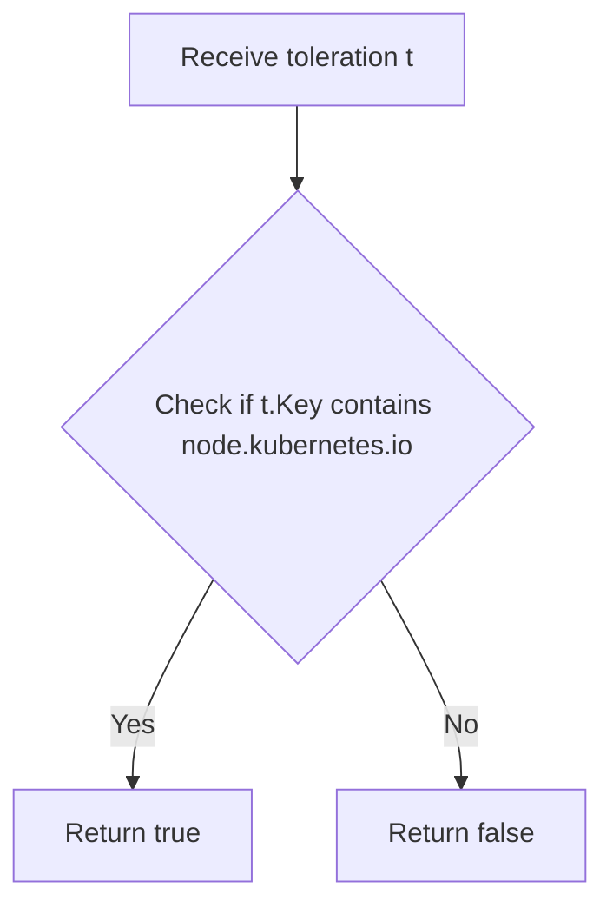
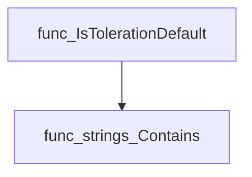
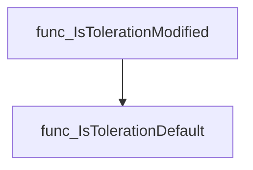
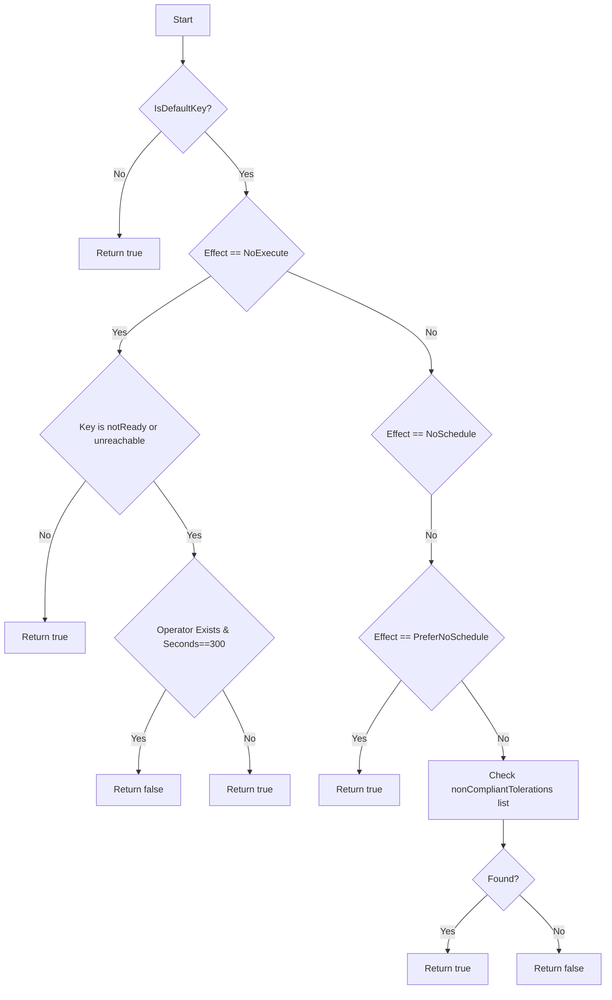
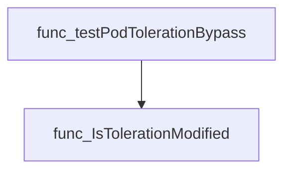

# Package tolerations

**Path**: `tests/lifecycle/tolerations`

## Table of Contents

- [Overview](#overview)
- [Exported Functions](#exported-functions)
  - [IsTolerationDefault](#istolerationdefault)
  - [IsTolerationModified](#istolerationmodified)

## Overview

Provides helper utilities for evaluating Kubernetes pod tolerations during tests, determining if a toleration is default or has been altered by the user.

### Key Features

- Identifies default tolerations by checking for the substring "node.kubernetes.io" in the key

### Design Notes

- Assumes default tolerations always contain the specific namespace substring
- Does not account for custom default tolerations added via admission controllers
- Best practice: use IsTolerationModified to detect any non‑default or changed toleration before asserting compliance

### Exported Functions Summary

| Name | Purpose |
|------|----------|
| [func IsTolerationDefault(t corev1.Toleration) bool](#istolerationdefault) | Returns `true` when the toleration key contains the substring `"node.kubernetes.io"`, indicating it is one of the default tolerations that Kubernetes automatically adds to a pod. |
| [func IsTolerationModified(t corev1.Toleration, qosClass corev1.PodQOSClass) bool](#istolerationmodified) | Checks whether a given `corev1.Toleration` is *modified* compared to the tolerations automatically injected by Kubernetes. Returns `true` for any non‑default or altered toleration. |

## Exported Functions

### IsTolerationDefault

**IsTolerationDefault** - Returns `true` when the toleration key contains the substring `"node.kubernetes.io"`, indicating it is one of the default tolerations that Kubernetes automatically adds to a pod.


#### Signature (Go)
```go
func IsTolerationDefault(t corev1.Toleration) bool
```

#### Summary Table
| Aspect | Details |
|--------|---------|
| **Purpose** | Returns `true` when the toleration key contains the substring `"node.kubernetes.io"`, indicating it is one of the default tolerations that Kubernetes automatically adds to a pod. |
| **Parameters** | `t corev1.Toleration – The toleration object being inspected. |
| **Return value** | `bool – true if the key indicates a default toleration, otherwise false`. |
| **Key dependencies** | • Calls `strings.Contains` from the standard library to search for `"node.kubernetes.io"` in the toleration key. |
| **Side effects** | None; purely functional. |
| **How it fits the package** | Used by higher‑level functions (e.g., `IsTolerationModified`) to quickly exclude default tolerations before performing more detailed checks on their properties. |

#### Internal workflow


#### Function dependencies


#### Functions calling `IsTolerationDefault`


#### Usage example (Go)
```go
import (
	"k8s.io/api/core/v1"
)

// Minimal example invoking IsTolerationDefault
func Example() {
	t := v1.Toleration{
		Key:   "node.kubernetes.io/not-ready",
		Value: "",
	}
	if IsTolerationDefault(t) {
		fmt.Println("This is a default toleration.")
	} else {
		fmt.Println("Custom toleration detected.")
	}
}
```

---

### IsTolerationModified

**IsTolerationModified** - Checks whether a given `corev1.Toleration` is *modified* compared to the tolerations automatically injected by Kubernetes. Returns `true` for any non‑default or altered toleration.


#### Signature (Go)
```go
func IsTolerationModified(t corev1.Toleration, qosClass corev1.PodQOSClass) bool
```

#### Summary Table
| Aspect | Details |
|--------|---------|
| **Purpose** | Checks whether a given `corev1.Toleration` is *modified* compared to the tolerations automatically injected by Kubernetes. Returns `true` for any non‑default or altered toleration. |
| **Parameters** | `t corev1.Toleration – the toleration to examine`<br>`qosClass corev1.PodQOSClass – QoS class of the pod (used for memory‑pressure logic)` |
| **Return value** | `bool – true if the toleration differs from the default set, false otherwise` |
| **Key dependencies** | * `IsTolerationDefault(t)` – quick check that the key starts with `node.kubernetes.io`<br>* `corev1.TaintEffectNoExecute`, `corev1.TaintEffectNoSchedule`, `corev1.TaintEffectPreferNoSchedule` constants<br>* `corev1.TolerationOpExists` constant |
| **Side effects** | None – purely functional; no state mutation or I/O. |
| **How it fits the package** | Provides core logic for tests that validate pod tolerations against Kubernetes defaults, enabling higher‑level checks to flag non‑compliant pods. |

#### Internal workflow (Mermaid)


#### Function dependencies (Mermaid)


#### Functions calling `IsTolerationModified` (Mermaid)


#### Usage example (Go)
```go
// Minimal example invoking IsTolerationModified
import (
    "k8s.io/api/core/v1"
    tolerations "github.com/redhat-best-practices-for-k8s/certsuite/tests/lifecycle/tolerations"
)

func main() {
    t := v1.Toleration{
        Key:      "node.kubernetes.io/not-ready",
        Operator: v1.TaintEffectNoExecute,
        Effect:   v1.TaintEffectNoExecute,
    }
    qos := v1.PodQOSBestEffort
    modified := tolerations.IsTolerationModified(t, qos)
    fmt.Printf("Is the toleration modified? %v\n", modified)
}
```

---

