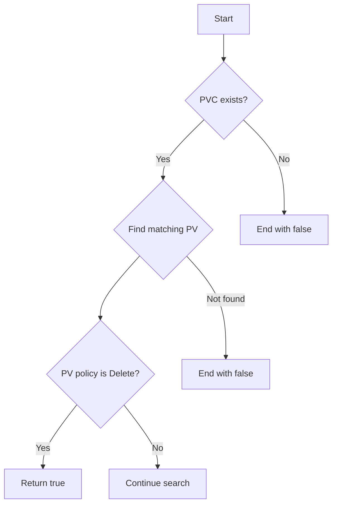
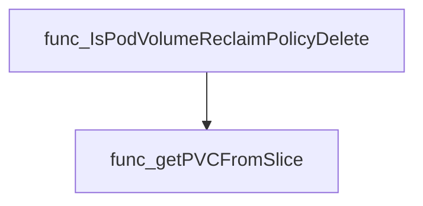
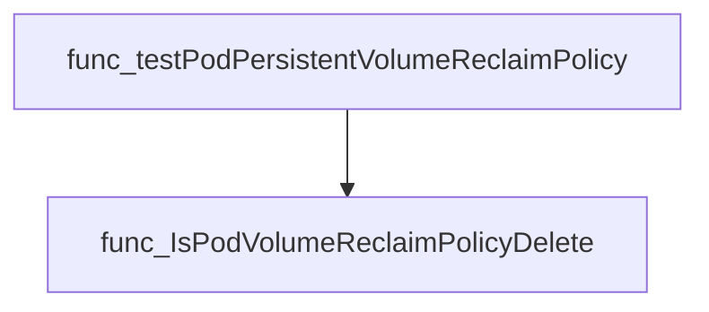

# Package volumes

**Path**: `tests/lifecycle/volumes`

## Table of Contents

- [Overview](#overview)
- [Exported Functions](#exported-functions)
  - [IsPodVolumeReclaimPolicyDelete](#ispodvolumereclaimpolicydelete)
- [Local Functions](#local-functions)
  - [getPVCFromSlice](#getpvcfromslice)

## Overview

Provides utilities for examining pod volume reclaim policies within Kubernetes tests, enabling verification that volumes are correctly configured for deletion.

### Key Features

- Determines if a pod’s backing PersistentVolume has the Delete reclamation policy
- Locates specific PersistentVolumeClaim objects by name in a slice
- Encapsulates logic for use in lifecycle test suites

### Design Notes

- Functions operate on corev1 types from k8s.io/api/core/v1
- The reclaim check expects a volume, its PV list, and PVC list to cross‑reference ownership
- Best practice is to invoke IsPodVolumeReclaimPolicyDelete after ensuring the input slices are populated

### Exported Functions Summary

| Name | Purpose |
|------|----------|
| [func IsPodVolumeReclaimPolicyDelete(vol *corev1.Volume, pvs []corev1.PersistentVolume, pvcs []corev1.PersistentVolumeClaim) bool](#ispodvolumereclaimpolicydelete) | Determines if a pod volume’s backing PV has `PersistentVolumeReclaimPolicyDelete`. |

### Local Functions Summary

| Name | Purpose |
|------|----------|
| [func getPVCFromSlice(pvcs []corev1.PersistentVolumeClaim, pvcName string) *corev1.PersistentVolumeClaim](#getpvcfromslice) | Searches a slice of `PersistentVolumeClaim` objects for one whose name matches the supplied `pvcName` and returns a pointer to it. If no match is found, it returns `nil`. |

## Exported Functions

### IsPodVolumeReclaimPolicyDelete

**IsPodVolumeReclaimPolicyDelete** - Determines if a pod volume’s backing PV has `PersistentVolumeReclaimPolicyDelete`.


Checks whether a pod’s volume is backed by a persistent volume claim whose associated persistent volume has a reclaim policy of **Delete**.

#### Signature (Go)

```go
func IsPodVolumeReclaimPolicyDelete(vol *corev1.Volume, pvs []corev1.PersistentVolume, pvcs []corev1.PersistentVolumeClaim) bool
```

#### Summary Table

| Aspect | Details |
|--------|---------|
| **Purpose** | Determines if a pod volume’s backing PV has `PersistentVolumeReclaimPolicyDelete`. |
| **Parameters** | `vol *corev1.Volume` – the pod volume to evaluate.<br>`pvs []corev1.PersistentVolume` – all cluster PVs.<br>`pvcs []corev1.PersistentVolumeClaim` – all cluster PVCs. |
| **Return value** | `bool` – `true` if the PV’s reclaim policy is Delete, otherwise `false`. |
| **Key dependencies** | • `getPVCFromSlice(pvcs, vol.PersistentVolumeClaim.ClaimName)`<br>• Comparison of `pv.Spec.PersistentVolumeReclaimPolicy == corev1.PersistentVolumeReclaimDelete` |
| **Side effects** | None (pure function). |
| **How it fits the package** | Supports compliance checks for pod volume reclaim policies within the lifecycle tests. |

#### Internal workflow



#### Function dependencies



#### Functions calling `IsPodVolumeReclaimPolicyDelete`



#### Usage example (Go)

```go
// Minimal example invoking IsPodVolumeReclaimPolicyDelete
import (
    corev1 "k8s.io/api/core/v1"
    "github.com/redhat-best-practices-for-k8s/certsuite/tests/lifecycle/volumes"
)

func main() {
    vol := &corev1.Volume{
        PersistentVolumeClaim: &corev1.PersistentVolumeClaimVolumeSource{
            ClaimName: "my-pvc",
        },
    }

    // Assume pvs and pvcs are populated from the cluster
    var pvs []corev1.PersistentVolume
    var pvcs []corev1.PersistentVolumeClaim

    ok := volumes.IsPodVolumeReclaimPolicyDelete(vol, pvs, pvcs)
    if ok {
        fmt.Println("Volume uses a PV with Delete reclaim policy")
    } else {
        fmt.Println("Volume does NOT use a PV with Delete reclaim policy")
    }
}
```

---

## Local Functions

### getPVCFromSlice

**getPVCFromSlice** - Searches a slice of `PersistentVolumeClaim` objects for one whose name matches the supplied `pvcName` and returns a pointer to it. If no match is found, it returns `nil`.


#### 1) Signature (Go)

```go
func getPVCFromSlice(pvcs []corev1.PersistentVolumeClaim, pvcName string) *corev1.PersistentVolumeClaim
```

#### 2) Summary Table

| Aspect | Details |
|--------|---------|
| **Purpose** | Searches a slice of `PersistentVolumeClaim` objects for one whose name matches the supplied `pvcName` and returns a pointer to it. If no match is found, it returns `nil`. |
| **Parameters** | `pvcs []corev1.PersistentVolumeClaim` – collection of PVCs; <br>`pvcName string` – target claim name |
| **Return value** | `*corev1.PersistentVolumeClaim` – pointer to the matched PVC or `nil` if absent |
| **Key dependencies** | Uses only standard Go looping and comparison; relies on the `corev1` types from the Kubernetes API. |
| **Side effects** | No mutation of inputs; purely read‑only lookup. |
| **How it fits the package** | Provides a helper for other functions in the `volumes` test package to resolve PVC references when inspecting pod volumes and reclaim policies. |

#### 3) Internal workflow (Mermaid)

```mermaid
flowchart TD
  Start --> Iterate{"Iterate over pvcs"}
  Iterate -- match? yes --> Return[Return &pvcs["i"]]
  Iterate -- match? no --> Continue["continue loop"]
  Continue --> End["Return nil"]
```

#### 4) Function dependencies (Mermaid)

None – this function is currently not referenced elsewhere in the package.

#### 5) Functions calling `getPVCFromSlice` (Mermaid)


#### 6) Usage example (Go)

```go
// Minimal example invoking getPVCFromSlice
import (
    corev1 "k8s.io/api/core/v1"
)

func example() {
    // Sample PVC slice
    pvcs := []corev1.PersistentVolumeClaim{
        {ObjectMeta: metav1.ObjectMeta{Name: "pvc-foo"}},
        {ObjectMeta: metav1.ObjectMeta{Name: "pvc-bar"}},
    }

    // Look up a specific PVC by name
    pvc := getPVCFromSlice(pvcs, "pvc-bar")
    if pvc != nil {
        fmt.Println("Found PVC:", pvc.Name)
    } else {
        fmt.Println("PVC not found")
    }
}
```

---

