# Package manageability

**Path**: `tests/manageability`

## Table of Contents

- [Overview](#overview)
- [Exported Functions](#exported-functions)
  - [LoadChecks](#loadchecks)
- [Local Functions](#local-functions)
  - [containerPortNameFormatCheck](#containerportnameformatcheck)
  - [testContainerPortNameFormat](#testcontainerportnameformat)
  - [testContainersImageTag](#testcontainersimagetag)

## Overview

The manageability package defines and registers tests that validate container configuration for compliance with partner naming conventions and image tagging requirements. It prepares these checks in the global database so they can be executed during a certsuite run.

### Key Features

- Registers manageability checks into the checks database via LoadChecks
- Validates container port names against allowed protocol prefixes
- Ensures each container has an explicit image tag

### Design Notes

- Uses a beforeEach function to set up environment context for each test; skip logic runs when no containers are present
- Relies on global allowedProtocolNames slice for protocol validation, which may need updating if new protocols are introduced
- Best practice: call LoadChecks during package initialization so checks are registered automatically

### Exported Functions Summary

| Name | Purpose |
|------|----------|
| [func LoadChecks()](#loadchecks) | Registers the manageability tests into the global checks database, preparing them for execution. |

### Local Functions Summary

| Name | Purpose |
|------|----------|
| [func containerPortNameFormatCheck(portName string) bool](#containerportnameformatcheck) | Determines whether a container port name follows the partner naming conventions by checking its protocol prefix. |
| [func testContainerPortNameFormat(check *checksdb.Check, env *provider.TestEnvironment)](#testcontainerportnameformat) | Validates that every port name in each container follows the partner naming conventions and records compliance results. |
| [func (*checksdb.Check, *provider.TestEnvironment)()](#testcontainersimagetag) | Determines if each container has an image tag; logs findings and records them in a compliance report. |

## Exported Functions

### LoadChecks

**LoadChecks** - Registers the manageability tests into the global checks database, preparing them for execution.

#### Signature (Go)

```go
func LoadChecks()
```

#### Summary Table

| Aspect | Details |
|--------|---------|
| **Purpose** | Registers the manageability tests into the global checks database, preparing them for execution. |
| **Parameters** | None |
| **Return value** | None |
| **Key dependencies** | • `log.Debug` – logs loading activity<br>• `checksdb.NewChecksGroup` – creates a group for these checks<br>• `WithBeforeEachFn`, `WithSkipCheckFn`, `WithCheckFn` – helper functions that attach behaviour to a check<br>• `checksdb.NewCheck` – constructs individual checks<br>• `identifiers.GetTestIDAndLabels` – retrieves test ID and tags<br>• `testContainersImageTag`, `testContainerPortNameFormat` – the actual test implementations |
| **Side effects** | Modifies the global checks database by adding a new group with two checks; logs debug output. |
| **How it fits the package** | This function is called from `pkg/certsuite.LoadInternalChecksDB()` to expose manageability tests as part of the overall certsuite test registry. |

#### Internal workflow (Mermaid)

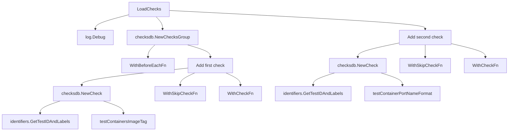

#### Function dependencies (Mermaid)

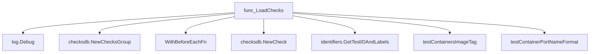

#### Functions calling `LoadChecks` (Mermaid)

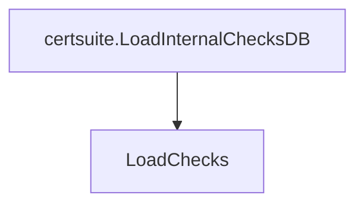

#### Usage example (Go)

```go
// Minimal example invoking LoadChecks
func main() {
    // Typically called by the test harness; here we call it directly.
    manageability.LoadChecks()
}
```

---

## Local Functions

### containerPortNameFormatCheck

**containerPortNameFormatCheck** - Determines whether a container port name follows the partner naming conventions by checking its protocol prefix.

#### Signature (Go)

```go
func containerPortNameFormatCheck(portName string) bool
```

#### Summary Table

| Aspect | Details |
|--------|---------|
| **Purpose** | Determines whether a container port name follows the partner naming conventions by checking its protocol prefix. |
| **Parameters** | `portName` (string) – the full name of the container port to validate. |
| **Return value** | `bool` – `true` if the first segment of `portName` is an allowed protocol name; otherwise `false`. |
| **Key dependencies** | • `strings.Split` from Go's standard library.<br>• `allowedProtocolNames`, a package‑level map of valid protocol prefixes. |
| **Side effects** | None – purely functional, no mutation or I/O. |
| **How it fits the package** | Used by test functions in the *manageability* suite to flag ports that do not conform to naming rules before reporting results. |

#### Internal workflow (Mermaid)

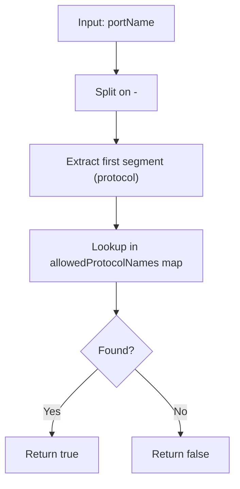

#### Function dependencies

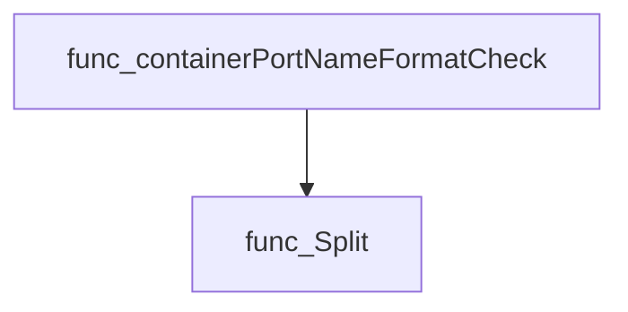

#### Functions calling `containerPortNameFormatCheck` (Mermaid)

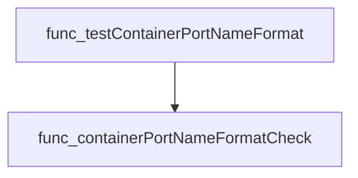

#### Usage example (Go)

```go
// Minimal example invoking containerPortNameFormatCheck
package main

import (
 "fmt"
)

// Assume allowedProtocolNames is populated elsewhere in the package.
var allowedProtocolNames = map[string]bool{
 "http":  true,
 "https": true,
}

func main() {
 name := "http-80"
 if containerPortNameFormatCheck(name) {
  fmt.Printf("Port name %q is valid.\n", name)
 } else {
  fmt.Printf("Port name %q is invalid.\n", name)
 }
}
```

---

### testContainerPortNameFormat

**testContainerPortNameFormat** - Validates that every port name in each container follows the partner naming conventions and records compliance results.

#### 1) Signature (Go)

```go
func testContainerPortNameFormat(check *checksdb.Check, env *provider.TestEnvironment)
```

#### 2) Summary Table

| Aspect | Details |
|--------|---------|
| **Purpose** | Validates that every port name in each container follows the partner naming conventions and records compliance results. |
| **Parameters** | `check *checksdb.Check` – current test context; <br> `env *provider.TestEnvironment` – environment data containing containers and protocol names. |
| **Return value** | None (results are stored via `check.SetResult`). |
| **Key dependencies** | • `LogDebug`, `LogError`, `LogInfo` on the check object<br>• `containerPortNameFormatCheck(portName string) bool`<br>• `testhelper.NewContainerReportObject`<br>• `AddField` on report objects<br>• `SetResult` on the check object |
| **Side effects** | • Populates global map `allowedProtocolNames`.<br>• Creates and stores compliant/non‑compliant report objects in the check result. |
| **How it fits the package** | Part of the *manageability* test suite; invoked by `LoadChecks` to evaluate port naming for all containers in the environment. |

#### 3) Internal workflow (Mermaid)

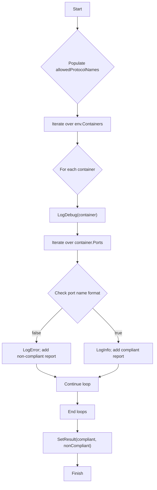

#### 4) Function dependencies (Mermaid)

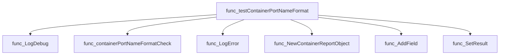

#### 5) Functions calling `testContainerPortNameFormat` (Mermaid)

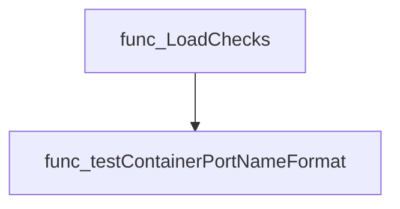

#### 6) Usage example (Go)

```go
// Minimal example invoking testContainerPortNameFormat
env := &provider.TestEnvironment{
    ValidProtocolNames: []string{"http", "https"},
    Containers: []*provider.Container{
        {
            Namespace:   "default",
            Podname:     "web-pod",
            Name:        "web-container",
            Ports:       []provider.Port{{Name: "http-80"}},
        },
    },
}
check := checksdb.NewCheck("TestContainerPortNameFormat")
testContainerPortNameFormat(check, env)
// Results are now available via check.Result()
```

---

---

### testContainersImageTag

**testContainersImageTag** - Determines if each container has an image tag; logs findings and records them in a compliance report.

Evaluates every container in a test environment to verify that an image tag is present, recording compliant and non‑compliant containers.

#### Signature (Go)

```go
func (*checksdb.Check, *provider.TestEnvironment)()
```

#### Summary Table

| Aspect | Details |
|--------|---------|
| **Purpose** | Determines if each container has an image tag; logs findings and records them in a compliance report. |
| **Parameters** | `check` – the current check context (`*checksdb.Check`).<br>`env` – test environment containing containers (`*provider.TestEnvironment`). |
| **Return value** | None (side‑effect only). |
| **Key dependencies** | • `check.LogDebug`, `check.LogError`, `check.LogInfo` <br>• `cut.IsTagEmpty()` <br>• `testhelper.NewContainerReportObject` <br>• `check.SetResult` |
| **Side effects** | Emits debug/info/error logs; appends report objects to internal slices; sets the check result via `SetResult`. |
| **How it fits the package** | Implements the *Containers Image Tag* test within the Manageability suite, invoked by `LoadChecks`. |

#### Internal workflow (Mermaid)

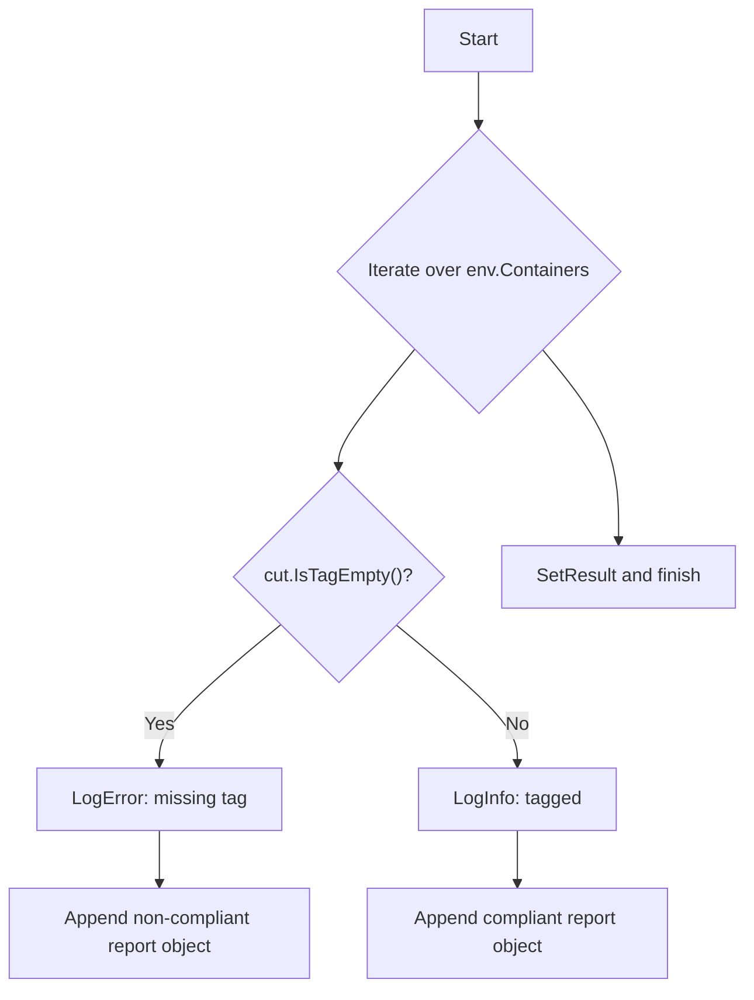

#### Function dependencies (Mermaid)

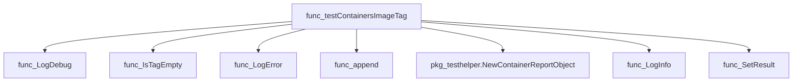

#### Functions calling `testContainersImageTag` (Mermaid)

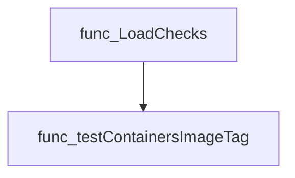

#### Usage example (Go)

```go
// Minimal example invoking testContainersImageTag
env := &provider.TestEnvironment{
    Containers: []*provider.Container{ /* populate with containers */ },
}
check := checksdb.NewCheck("example-check-id")
testContainersImageTag(check, env)
// After execution, check.Result holds compliant and non‑compliant objects.
```

---
