# Package icmp

**Path**: `tests/networking/icmp`

## Table of Contents

- [Overview](#overview)
- [Structs](#structs)
  - [PingResults](#pingresults)
- [Exported Functions](#exported-functions)
  - [BuildNetTestContext](#buildnettestcontext)
  - [PingResults.String](#pingresults.string)
  - [RunNetworkingTests](#runnetworkingtests)
- [Local Functions](#local-functions)
  - [parsePingResult](#parsepingresult)
  - [processContainerIpsPerNet](#processcontaineripspernet)

## Overview

The icmp package provides utilities for performing ICMP ping tests between containers in Kubernetes environments, building test contexts based on pod networking and reporting results.

### Key Features

- BuildNetTestContext constructs a map of network identifiers to NetTestContext objects that define source and destination IPs for pinging.
- RunNetworkingTests executes the ping tests across networks, aggregates success/failure data, and determines if overall compliance is met.
- parsePingResult parses raw ping output into structured PingResults capturing packet statistics and errors.

### Design Notes

- The package assumes containers expose network interfaces accessible via provided IP lists; it selects the first matching IP as the tester source.
- Parsing logic relies on regular expressions that may fail with non‑standard ping outputs, limiting robustness across OS variants.
- Best practice is to call BuildNetTestContext before RunNetworkingTests and log detailed reports using testhelper utilities.

### Structs Summary

| Name | Purpose |
|------|----------|
| [**PingResults**](#pingresults) | Summary of a ping command execution |

### Exported Functions Summary

| Name | Purpose |
|------|----------|
| [func BuildNetTestContext(pods []*provider.Pod, aIPVersion netcommons.IPVersion, aType netcommons.IFType, logger *log.Logger) (netsUnderTest map[string]netcommons.NetTestContext)](#buildnettestcontext) | Generates a mapping of network identifiers to `NetTestContext` objects that describe how ICMP connectivity tests should be performed between pods. It gathers IP addresses, selects tester sources, and populates destination targets based on pod networking configuration. |
| [func (results PingResults) String() string](#pingresults.string) | Produces a concise textual representation of ping test results, including outcome status and transmitted/received/error counts. |
| [func RunNetworkingTests(     netsUnderTest map[string]netcommons.NetTestContext,     count int,     aIPVersion netcommons.IPVersion,     logger *log.Logger, ) (report testhelper.FailureReasonOut, skip bool)](#runnetworkingtests) | Runs ICMP ping tests for each network attachment in `netsUnderTest`. It reports compliant and non‑compliant results per container pair and decides whether to skip the overall test. |

### Local Functions Summary

| Name | Purpose |
|------|----------|
| [func parsePingResult(stdout, stderr string) (results PingResults, err error)](#parsepingresult) | Interprets the standard output and error streams from a `ping` execution to populate a `PingResults` structure, determining whether the ping succeeded, failed, or encountered errors. |
| [func processContainerIpsPerNet(     containerID *provider.Container,     netKey string,     ipAddresses []string,     ifName string,     netsUnderTest map[string]netcommons.NetTestContext,     aIPVersion netcommons.IPVersion,     logger *log.Logger) {}](#processcontaineripspernet) | Filters container IPs by the desired IP version, then populates or updates a `NetTestContext` entry for the given network key. The first qualifying IP is used as the test initiator (tester source), while the remaining IPs become ping destinations. |

## Structs

### PingResults


#### Fields
| Field       | Type | Description |
|-------------|------|-------------|
| `outcome`   | `int` | Enumerated result code (e.g., success, failure, error) returned by the test helper. |
| `transmitted` | `int` | Number of ICMP echo requests that were sent. |
| `received`  | `int` | Number of replies received back from the target host. |
| `errors`    | `int` | Count of packets that resulted in an error (e.g., time‑outs or unreachable). |

#### Purpose
`PingResults` aggregates quantitative data about a single ping test: how many packets were sent, how many were answered, and any errors encountered. The `outcome` field classifies the overall success status using predefined constants from the test helper package.

#### Related functions
| Function | Purpose |
|----------|---------|
| `PingResults.String()` | Formats the struct into a human‑readable string for logging or display. |
| `parsePingResult(stdout, stderr string)` | Parses raw ping command output, populates a `PingResults` instance, and determines the outcome based on regex matches and packet statistics. |

---

---

## Exported Functions

### BuildNetTestContext

**BuildNetTestContext** - Generates a mapping of network identifiers to `NetTestContext` objects that describe how ICMP connectivity tests should be performed between pods. It gathers IP addresses, selects tester sources, and populates destination targets based on pod networking configuration.


#### Signature (Go)

```go
func BuildNetTestContext(pods []*provider.Pod, aIPVersion netcommons.IPVersion, aType netcommons.IFType, logger *log.Logger) (netsUnderTest map[string]netcommons.NetTestContext)
```

#### Summary Table

| Aspect | Details |
|--------|---------|
| **Purpose** | Generates a mapping of network identifiers to `NetTestContext` objects that describe how ICMP connectivity tests should be performed between pods. It gathers IP addresses, selects tester sources, and populates destination targets based on pod networking configuration. |
| **Parameters** | `pods []*provider.Pod – list of pods to inspect`<br>`aIPVersion netcommons.IPVersion – target IP version (IPv4/IPv6)`<br>`aType netcommons.IFType – network interface type (MULTUS or DEFAULT)`<br>`logger *log.Logger – logger for diagnostics` |
| **Return value** | `netsUnderTest map[string]netcommons.NetTestContext – a mapping from network key to context data used by the ICMP test runner.` |
| **Key dependencies** | • `make` (to create the map)<br>• `logger.Info` (for verbose output)<br>• `processContainerIpsPerNet` (to populate each network entry) |
| **Side effects** | No global state is modified. The function performs logging and constructs data structures only. |
| **How it fits the package** | It is the core preparatory routine for ICMP connectivity tests, called by `testNetworkConnectivity`. It translates pod information into a format consumable by the test runner. |

#### Internal workflow (Mermaid)

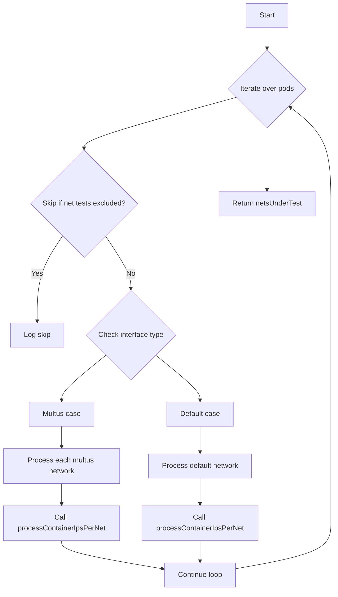

#### Function dependencies (Mermaid)

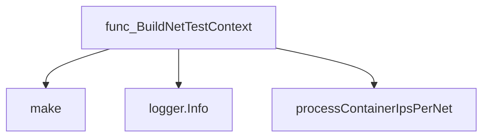

#### Functions calling `BuildNetTestContext` (Mermaid)

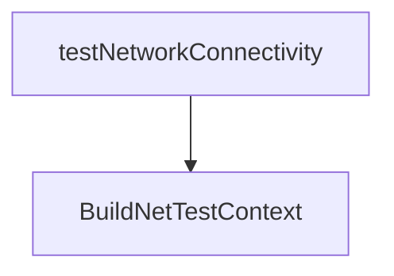

#### Usage example (Go)

```go
// Minimal example invoking BuildNetTestContext
package main

import (
    "log"
    "github.com/redhat-best-practices-for-k8s/certsuite/tests/networking/icmp"
    "github.com/redhat-best-practices-for-k8s/certsuite/tests/networking/netcommons"
    "github.com/redhat-best-practices-for-k8s/certsuite/provider"
)

func main() {
    // Assume pods is populated elsewhere
    var pods []*provider.Pod

    logger := log.Default()
    ipVersion := netcommons.IPV4
    ifType := netcommons.DEFAULT

    netsUnderTest := icmp.BuildNetTestContext(pods, ipVersion, ifType, logger)

    // netsUnderTest can now be passed to the ICMP test runner.
}
```

---

### PingResults.String

**String** - Produces a concise textual representation of ping test results, including outcome status and transmitted/received/error counts.


The `String` method formats a `PingResults` value into a human‑readable string that reports the outcome and packet statistics.

---

#### Signature (Go)

```go
func (results PingResults) String() string
```

---

#### Summary Table

| Aspect | Details |
|--------|---------|
| **Purpose** | Produces a concise textual representation of ping test results, including outcome status and transmitted/received/error counts. |
| **Parameters** | `results` – the `PingResults` value on which the method is invoked (receiver). |
| **Return value** | A formatted string such as: *"outcome: SUCCESS transmitted: 10 received: 9 errors: 1"* . |
| **Key dependencies** | • `fmt.Sprintf` from the standard library.<br>• `testhelper.ResultToString` from `github.com/redhat-best-practices-for-k8s/certsuite/pkg/testhelper`. |
| **Side effects** | None – purely functional, no state mutation or I/O. |
| **How it fits the package** | Provides a readable output for test logs and debugging within the ICMP testing suite. |

---

#### Internal workflow (Mermaid)

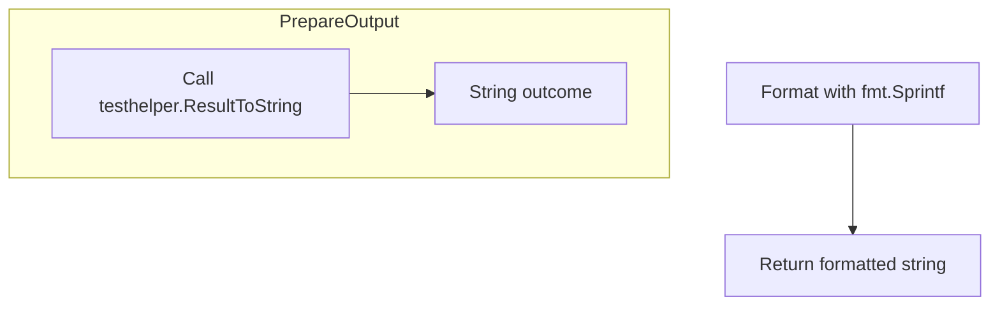

---

#### Function dependencies (Mermaid)

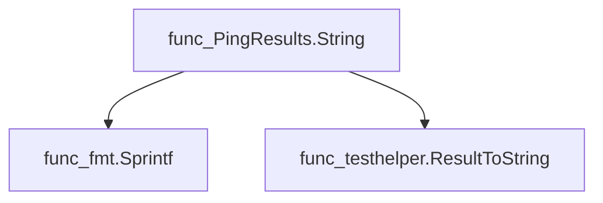

---

#### Functions calling `PingResults.String` (Mermaid)

None – this function is currently not referenced elsewhere in the package.

---

#### Usage example (Go)

```go
// Minimal example invoking PingResults.String

package main

import (
	"fmt"
	"github.com/redhat-best-practices-for-k8s/certsuite/tests/networking/icmp"
)

func main() {
	results := icmp.PingResults{
		outcome:    icmp.SUCCESS,
		transmitted: 10,
		received:   9,
		errors:     1,
	}
	fmt.Println(results.String())
}
```

---

---

### RunNetworkingTests

**RunNetworkingTests** - Runs ICMP ping tests for each network attachment in `netsUnderTest`. It reports compliant and non‑compliant results per container pair and decides whether to skip the overall test.


#### Signature (Go)

```go
func RunNetworkingTests(
    netsUnderTest map[string]netcommons.NetTestContext,
    count int,
    aIPVersion netcommons.IPVersion,
    logger *log.Logger,
) (report testhelper.FailureReasonOut, skip bool)
```

#### Summary Table

| Aspect | Details |
|--------|---------|
| **Purpose** | Runs ICMP ping tests for each network attachment in `netsUnderTest`. It reports compliant and non‑compliant results per container pair and decides whether to skip the overall test. |
| **Parameters** | - `netsUnderTest` (`map[string]netcommons.NetTestContext`) – one context per network.<br>- `count` (`int`) – number of ping packets to send.<br>- `aIPVersion` (`netcommons.IPVersion`) – IPv4 or IPv6 indicator.<br>- `logger` (`*log.Logger`) – logger for debug/info/error output. |
| **Return value** | - `report` (`testhelper.FailureReasonOut`) – contains slices of compliant and non‑compliant report objects.<br>- `skip` (`bool`) – true if no networks or containers were available to test. |
| **Key dependencies** | • `netcommons.PrintNetTestContextMap`<br>• `TestPing` (ping helper)<br>• `testhelper.NewContainerReportObject`, `NewReportObject`<br>• Logger methods (`Debug`, `Info`, `Error`) |
| **Side effects** | Emits log messages; constructs and returns report objects but does not modify external state. |
| **How it fits the package** | Core routine for the ICMP test suite, called by higher‑level networking checks to validate inter‑pod connectivity on each network attachment. |

#### Internal workflow (Mermaid)

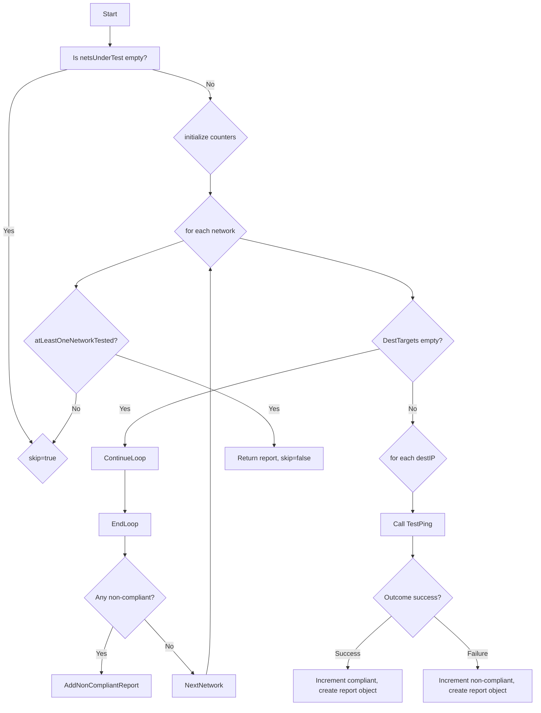

#### Function dependencies (Mermaid)

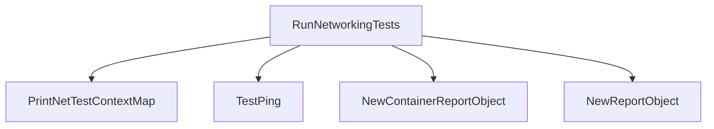

#### Functions calling `RunNetworkingTests` (Mermaid)

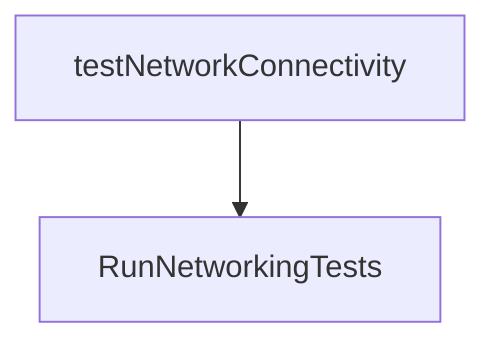

#### Usage example (Go)

```go
// Minimal example invoking RunNetworkingTests
import (
    "log"
    "github.com/redhat-best-practices-for-k8s/certsuite/tests/networking/netcommons"
    "github.com/redhat-best-practices-for-k8s/certsuite/pkg/testhelper"
)

func main() {
    logger := log.New(os.Stdout, "", 0)
    nets := map[string]netcommons.NetTestContext{
        "default": netcommons.BuildNetTestContext(...), // build a context
    }
    report, skip := icmp.RunNetworkingTests(nets, 5, netcommons.IPV4, logger)

    if skip {
        fmt.Println("No networks to test.")
    } else {
        fmt.Printf("Compliant: %v\nNon‑compliant: %v\n", len(report.CompliantObjectsOut), len(report.NonCompliantObjectsOut))
    }
}
```

---

## Local Functions

### parsePingResult

**parsePingResult** - Interprets the standard output and error streams from a `ping` execution to populate a `PingResults` structure, determining whether the ping succeeded, failed, or encountered errors.


#### Signature (Go)

```go
func parsePingResult(stdout, stderr string) (results PingResults, err error)
```

#### Summary Table

| Aspect | Details |
|--------|---------|
| **Purpose** | Interprets the standard output and error streams from a `ping` execution to populate a `PingResults` structure, determining whether the ping succeeded, failed, or encountered errors. |
| **Parameters** | *stdout* `string` – captured stdout; <br>*stderr* `string` – captured stderr |
| **Return value** | *results* `PingResults` – populated with transmitted, received, error counts and an outcome flag (`SUCCESS`, `FAILURE`, or `ERROR`).<br>*err* `error` – non‑nil if parsing fails or the output does not match expected patterns. |
| **Key dependencies** | • `regexp.MustCompile` (for two regexes)<br>• `regexp.FindStringSubmatch`<br>• `fmt.Errorf`<br>• `strconv.Atoi` |
| **Side effects** | No external I/O; only local variable manipulation and error generation. |
| **How it fits the package** | Utility function used by higher‑level test helpers to translate raw ping output into structured results for validation in networking tests. |

#### Internal workflow (Mermaid)

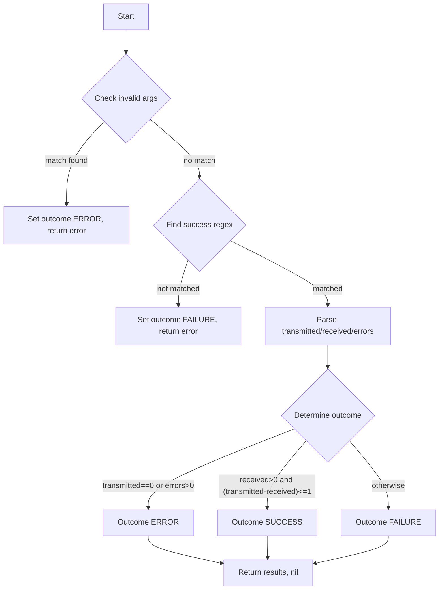

#### Function dependencies (Mermaid)

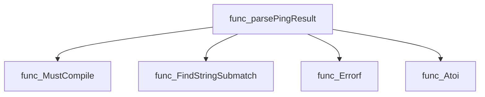

#### Functions calling `parsePingResult` (Mermaid)

None – this function is currently not referenced elsewhere in the package.

#### Usage example (Go)

```go
// Minimal example invoking parsePingResult
stdout := "PING 8.8.8.8: 56 data bytes\n64 bytes from 8.8.8.8: icmp_seq=0 ttl=117 time=10.2 ms\n--- 8.8.8.8 ping statistics ---\n1 packets transmitted, 1 received, 0% packet loss"
stderr := ""

results, err := parsePingResult(stdout, stderr)
if err != nil {
    fmt.Println("Parsing failed:", err)
} else {
    fmt.Printf("Outcome: %v, Transmitted: %d, Received: %d, Errors: %d\n",
        results.outcome, results.transmitted, results.received, results.errors)
}
```

---

### processContainerIpsPerNet

**processContainerIpsPerNet** - Filters container IPs by the desired IP version, then populates or updates a `NetTestContext` entry for the given network key. The first qualifying IP is used as the test initiator (tester source), while the remaining IPs become ping destinations.


#### 1) Signature (Go)

```go
func processContainerIpsPerNet(
    containerID *provider.Container,
    netKey string,
    ipAddresses []string,
    ifName string,
    netsUnderTest map[string]netcommons.NetTestContext,
    aIPVersion netcommons.IPVersion,
    logger *log.Logger) {}
```

#### 2) Summary Table

| Aspect | Details |
|--------|---------|
| **Purpose** | Filters container IPs by the desired IP version, then populates or updates a `NetTestContext` entry for the given network key. The first qualifying IP is used as the test initiator (tester source), while the remaining IPs become ping destinations. |
| **Parameters** | • `containerID *provider.Container` – container whose IPs are processed.<br>• `netKey string` – identifier of the network (e.g., “default” or a multus network name).<br>• `ipAddresses []string` – list of IP addresses attached to the container on that network. <br>• `ifName string` – interface name for this network, may be empty.<br>• `netsUnderTest map[string]netcommons.NetTestContext` – mutable map storing test contexts keyed by network. <br>• `aIPVersion netcommons.IPVersion` – target IP version (IPv4/IPv6).<br>• `logger *log.Logger` – logger for debug output. |
| **Return value** | None; the function mutates `netsUnderTest`. |
| **Key dependencies** | • `netcommons.FilterIPListByIPVersion` – filters IP list.<br>• Standard library: `len`, `append`.<br>• `log.Logger.Debug`. |
| **Side effects** | • Logs debug messages.<br>• Adds or updates entries in `netsUnderTest`; may set tester source and destination lists. |
| **How it fits the package** | Used by `icmp.BuildNetTestContext` to construct connectivity test data for each pod/container across all relevant networks before executing ping tests. |

#### 3) Internal workflow (Mermaid)

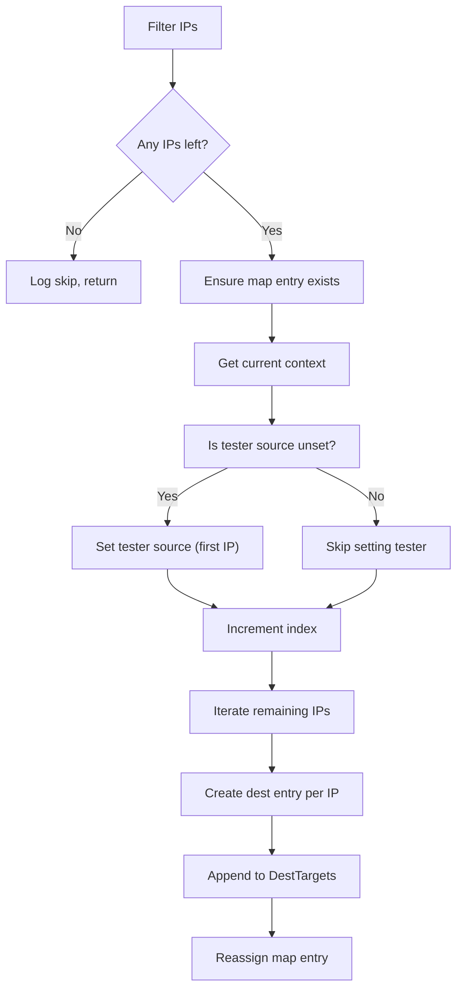

#### 4) Function dependencies (Mermaid)

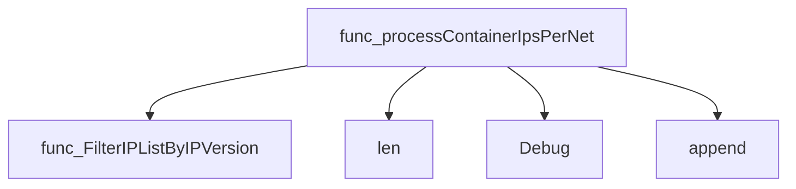

#### 5) Functions calling `processContainerIpsPerNet` (Mermaid)

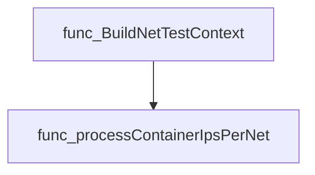

#### 6) Usage example (Go)

```go
// Minimal example invoking processContainerIpsPerNet
package main

import (
    "log"
    "github.com/redhat-best-practices-for-k8s/certsuite/tests/networking/icmp"
    "github.com/redhat-best-practices-for-k8s/certsuite/tests/networking/netcommons"
)

func main() {
    logger := log.New(os.Stdout, "", log.LstdFlags)
    netsUnderTest := make(map[string]netcommons.NetTestContext)

    // Dummy container and IP data
    container := &provider.Container{ID: "c1"}
    ipList := []string{"10.0.0.5", "fe80::1"}

    icmp.processContainerIpsPerNet(
        container,
        "default",
        ipList,
        "",
        netsUnderTest,
        netcommons.IPV4, // or IPV6
        logger)
}
```

---

---

