# Package netcommons

**Path**: `tests/networking/netcommons`

## Table of Contents

- [Overview](#overview)
- [Structs](#structs)
  - [ContainerIP](#containerip)
  - [NetTestContext](#nettestcontext)
- [Exported Functions](#exported-functions)
  - [ContainerIP.String](#containerip.string)
  - [FilterIPListByIPVersion](#filteriplistbyipversion)
  - [GetIPVersion](#getipversion)
  - [IPVersion.String](#ipversion.string)
  - [NetTestContext.String](#nettestcontext.string)
  - [PodIPsToStringList](#podipstostringlist)
  - [PrintNetTestContextMap](#printnettestcontextmap)
  - [TestReservedPortsUsage](#testreservedportsusage)
- [Local Functions](#local-functions)
  - [findRogueContainersDeclaringPorts](#findroguecontainersdeclaringports)
  - [findRoguePodsListeningToPorts](#findroguepodslisteningtoports)

## Overview

The netcommons package supplies helper types and functions for networking tests in CertSuite. It handles IP parsing, filtering by IPv4/IPv6, building test contexts that describe source and destination containers, and checking pods for use of reserved ports.

### Key Features

- Detects whether a string is IPv4 or IPv6 via GetIPVersion and exposes an IPVersion enum with String formatting
- Filters slices of IP strings to retain only the desired version using FilterIPListByIPVersion
- Creates readable representations of ContainerIP and NetTestContext, and aggregates compliance reports for reserved port usage through TestReservedPortsUsage

### Design Notes

- GetIPVersion relies on net.ParseIP and treats any non‑IPv4 string as IPv6, returning an error for invalid addresses; callers should handle the error
- The package uses exported structs (ContainerIP, NetTestContext) but keeps many helper functions unexported to avoid polluting the public API
- When building a test context, callers should first convert pod IPs with PodIPsToStringList and then use BuildNetTestContext (not shown in the JSON) before printing or running tests

### Structs Summary

| Name | Purpose |
|------|----------|
| [**ContainerIP**](#containerip) | One-line purpose |
| [**NetTestContext**](#nettestcontext) | Describes a network test scenario for a specific subnet |

### Exported Functions Summary

| Name | Purpose |
|------|----------|
| [func (cip *ContainerIP) String() string](#containerip.string) | Produces a human‑readable representation of a `ContainerIP`, combining its IP address with the long form of its container identifier. |
| [func FilterIPListByIPVersion(ipList []string, aIPVersion IPVersion) []string](#filteriplistbyipversion) | Produces a new slice containing only those IP addresses from `ipList` that match the specified `aIPVersion` (IPv4 or IPv6). |
| [func GetIPVersion(aIP string) (IPVersion, error)](#getipversion) | Determines whether a given IP address string is IPv4 or IPv6, returning an `IPVersion` value. |
| [func (version IPVersion) String() string](#ipversion.string) | Converts an `IPVersion` enum value into its corresponding string representation (`IPv4`, `IPv6`, `IPv4v6`, or `Undefined`). |
| [func (testContext *NetTestContext) String() string](#nettestcontext.string) | Generates a human‑readable representation of a `NetTestContext`, detailing the initiating container and all target containers to be tested. |
| [func PodIPsToStringList(ips []corev1.PodIP) (ipList []string)](#podipstostringlist) | Transforms a list of `corev1.PodIP` values into their raw IP string representations. |
| [func PrintNetTestContextMap(netsUnderTest map[string]NetTestContext) string](#printnettestcontextmap) | Produces a human‑readable string summarizing each network’s test context, including source and destination containers. |
| [func TestReservedPortsUsage(env *provider.TestEnvironment, reservedPorts map[int32]bool, portsOrigin string, logger *log.Logger) (compliantObjects, nonCompliantObjects []*testhelper.ReportObject)](#testreservedportsusage) | Aggregates compliance reports for pods that listen on or declare any reserved port. It delegates the core check to `findRoguePodsListeningToPorts` and then returns the collected results. |

### Local Functions Summary

| Name | Purpose |
|------|----------|
| [func findRogueContainersDeclaringPorts(containers []*provider.Container, portsToTest map[int32]bool, portsOrigin string, logger *log.Logger) (compliantObjects, nonCompliantObjects []*testhelper.ReportObject)](#findroguecontainersdeclaringports) | Scans each container’s port list and flags those that declare any port present in `portsToTest`. Containers declaring such ports are marked non‑compliant; all others are compliant. |
| [func findRoguePodsListeningToPorts(pods []*provider.Pod, portsToTest map[int32]bool, portsOrigin string, logger *log.Logger) (compliantObjects, nonCompliantObjects []*testhelper.ReportObject)](#findroguepodslisteningtoports) | Scans a list of pods to determine if any container declares or listens on ports that are reserved. Generates compliance reports for each pod. |

## Structs

### ContainerIP


A lightweight representation of a container’s network identity, combining its IP address with a full container identifier and optional interface name.

#### Fields

| Field               | Type                 | Description |
|---------------------|----------------------|-------------|
| `IP`                | `string`             | The IPv4 or IPv6 address assigned to the container. No validation is performed in this struct; callers must ensure it is a valid IP string. |
| `ContainerIdentifier` | `*provider.Container` | A pointer to a `provider.Container` value that encapsulates namespace, pod name, container name, node name, and UID for uniquely identifying the target container. |
| `InterfaceName`     | `string`             | The specific network interface inside the container that should be used for ping tests (e.g., `"eth0"`). An empty string indicates the default interface. |

#### Purpose

The `ContainerIP` struct aggregates all information required to perform networking tests against a specific container in a Kubernetes environment. By bundling the IP, container identity, and desired network interface, test code can reference this single object when executing ping or connectivity checks, logging results, or correlating metrics.

#### Related functions

| Function | Purpose |
|----------|---------|
| `ContainerIP.String` | Returns a human‑readable string that includes the IP address and the long form of the container identifier, aiding debugging and log output. |

---

### NetTestContext


| Field | Type | Description |
|-------|------|-------------|
| `TesterContainerNodeName` | `string` | Name of the node where the initiating container runs. |
| `TesterSource` | `ContainerIP` | The container chosen (typically first in list) that will send ping traffic on this subnet. |
| `DestTargets` | `[]ContainerIP` | IP addresses of all other containers on the same subnet that should be pinged by `TesterSource`. |

#### Purpose
`NetTestContext` encapsulates everything needed to perform connectivity tests within a single network attachment (subnet). It identifies the node and container that will initiate traffic (`TesterSource`) and lists every target container’s IP address (`DestTargets`) that must be reachable from it. This struct is used by test runners to generate ping commands, validate reachability, and report results per subnet.

#### Related functions
| Function | Purpose |
|----------|---------|
| `NetTestContext.String` | Returns a human‑readable summary of the tester source and its destination targets for logging or debugging. |
| `PrintNetTestContextMap` | Builds a formatted string listing all network test contexts in a map, useful for printing test configuration summaries. |

---

---

## Exported Functions

### ContainerIP.String

**String** - Produces a human‑readable representation of a `ContainerIP`, combining its IP address with the long form of its container identifier.


#### Signature (Go)

```go
func (cip *ContainerIP) String() string
```

#### Summary Table

| Aspect | Details |
|--------|---------|
| **Purpose** | Produces a human‑readable representation of a `ContainerIP`, combining its IP address with the long form of its container identifier. |
| **Parameters** | *None* (receiver only) – `cip` is a pointer to the `ContainerIP` instance. |
| **Return value** | A formatted string in the form: `<IP> ( <container-identifier-long> )`. |
| **Key dependencies** | • `fmt.Sprintf` from the standard library<br>• `ContainerIdentifier.StringLong()` method |
| **Side effects** | None – purely functional; no state mutation or I/O. |
| **How it fits the package** | Provides a convenient string conversion for logging, debugging, and display of networking test data within the `netcommons` testing utilities. |

#### Internal workflow (Mermaid)

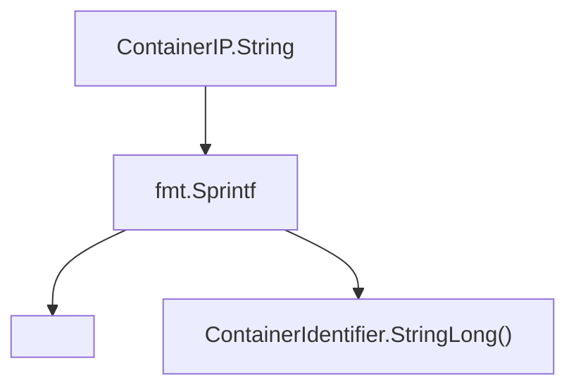

#### Function dependencies

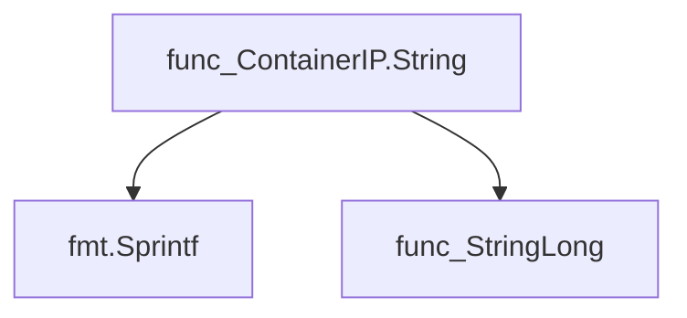

#### Functions calling `ContainerIP.String`

None – this function is currently not referenced elsewhere in the package.

#### Usage example (Go)

```go
// Minimal example invoking ContainerIP.String

package main

import (
	"fmt"
	"github.com/redhat-best-practices-for-k8s/certsuite/tests/networking/netcommons"
)

func main() {
	cip := &netcommons.ContainerIP{
		IP:                "192.168.1.10",
		ContainerIdentifier: netcommons.ContainerIdentifier{ /* fields */ },
	}
	fmt.Println(cip.String())
}
```

---

### FilterIPListByIPVersion

**FilterIPListByIPVersion** - Produces a new slice containing only those IP addresses from `ipList` that match the specified `aIPVersion` (IPv4 or IPv6).


```go
func FilterIPListByIPVersion(ipList []string, aIPVersion IPVersion) []string
```

| Aspect | Details |
|--------|---------|
| **Purpose** | Produces a new slice containing only those IP addresses from `ipList` that match the specified `aIPVersion` (IPv4 or IPv6). |
| **Parameters** | `ipList []string` – list of IP address strings; `aIPVersion IPVersion` – target version to filter on. |
| **Return value** | `[]string` – a slice with only addresses of the requested IP version, preserving original order. |
| **Key dependencies** | • Calls `GetIPVersion(aIP)` to determine each address’s type.<br>• Uses Go’s built‑in `append` to build the result list. |
| **Side effects** | None – pure function; does not modify input slice or global state. |
| **How it fits the package** | Supports higher‑level networking tests by separating IPv4 and IPv6 addresses for targeted operations (e.g., ping, traceroute). |

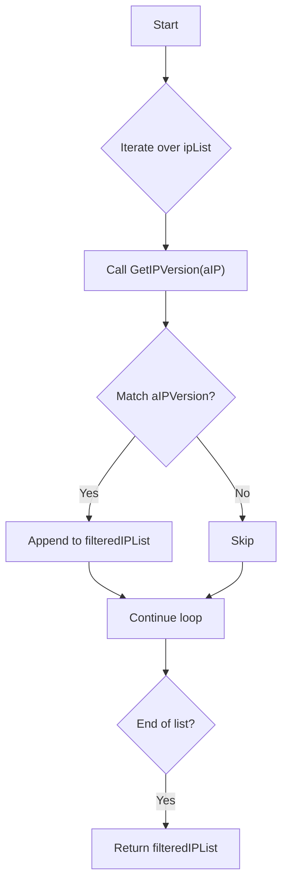

#### Function dependencies

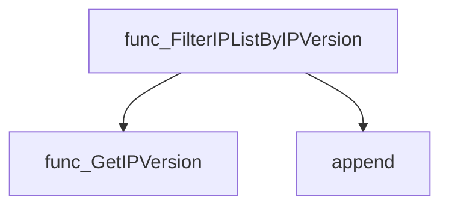

#### Functions calling `FilterIPListByIPVersion`

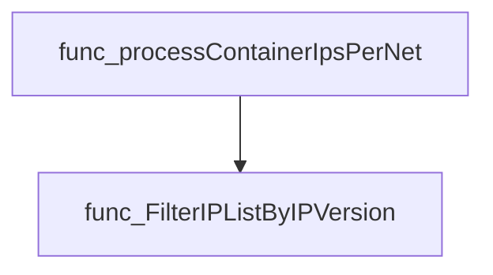

#### Usage example

```go
// Minimal example invoking FilterIPListByIPVersion
package main

import (
	"fmt"

	"github.com/redhat-best-practices-for-k8s/certsuite/tests/networking/netcommons"
)

func main() {
	addresses := []string{
		"192.168.1.10",
		"fe80::1ff:fe23:4567:890a",
		"10.0.0.5",
	}
	ipv6s := netcommons.FilterIPListByIPVersion(addresses, netcommons.IPv6)
	fmt.Println("IPv6 addresses:", ipv6s) // Output: IPv6 addresses: [fe80::1ff:fe23:4567:890a]
}
```

---

### GetIPVersion

**GetIPVersion** - Determines whether a given IP address string is IPv4 or IPv6, returning an `IPVersion` value.


#### Signature (Go)

```go
func GetIPVersion(aIP string) (IPVersion, error)
```

#### Summary Table

| Aspect | Details |
|--------|---------|
| **Purpose** | Determines whether a given IP address string is IPv4 or IPv6, returning an `IPVersion` value. |
| **Parameters** | `aIP string –` the IP address to analyze |
| **Return value** | `IPVersion –` one of `IPv4`, `IPv6`, or `Undefined`; `error –` non‑nil if the string is not a valid IP |
| **Key dependencies** | • `net.ParseIP` (package `net`) <br>• `fmt.Errorf` (package `fmt`) <br>• `ip.To4()` method (standard library) |
| **Side effects** | None – pure function; no state mutation or I/O. |
| **How it fits the package** | Core utility used by higher‑level networking helpers to filter and validate IP addresses across services. |

#### Internal workflow (Mermaid)

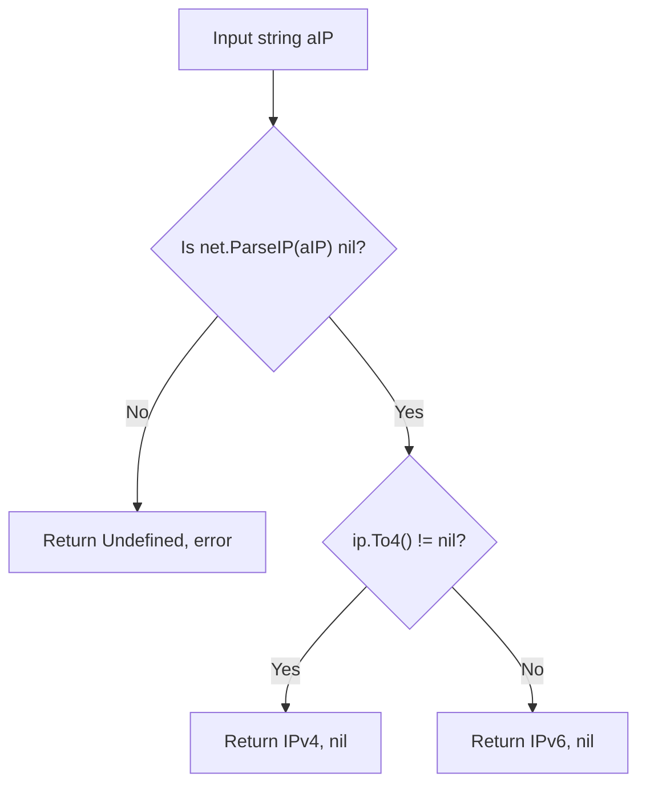

#### Function dependencies (Mermaid)

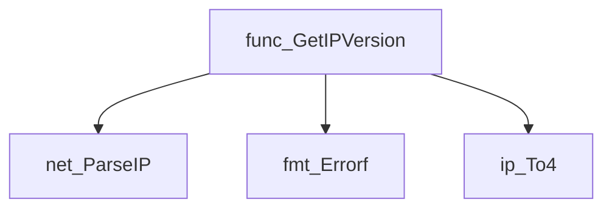

#### Functions calling `GetIPVersion` (Mermaid)

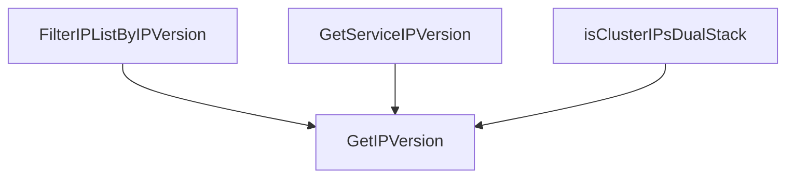

#### Usage example (Go)

```go
// Minimal example invoking GetIPVersion
package main

import (
	"fmt"

	"github.com/redhat-best-practices-for-k8s/certsuite/tests/networking/netcommons"
)

func main() {
	ip := "192.168.1.1"
	version, err := netcommons.GetIPVersion(ip)
	if err != nil {
		fmt.Printf("Error: %v\n", err)
		return
	}
	fmt.Printf("The IP %s is of version: %v\n", ip, version)
}
```

---

### IPVersion.String

**String** - Converts an `IPVersion` enum value into its corresponding string representation (`IPv4`, `IPv6`, `IPv4v6`, or `Undefined`).


#### Signature (Go)
```go
func (version IPVersion) String() string
```

#### Summary Table
| Aspect | Details |
|--------|---------|
| **Purpose** | Converts an `IPVersion` enum value into its corresponding string representation (`IPv4`, `IPv6`, `IPv4v6`, or `Undefined`). |
| **Parameters** | *receiver* – `version IPVersion`: the enum instance to stringify. |
| **Return value** | `string`: a constant such as `"ipv4"`, `"ipv6"`, `"ipv4/ipv6"`, or `"undefined"` depending on the receiver’s value. |
| **Key dependencies** | Uses package‑level constants: `IPv4String`, `IPv6String`, `IPv4v6String`, `UndefinedString`. |
| **Side effects** | None – purely functional; no state mutation, I/O, or concurrency involved. |
| **How it fits the package** | Provides a human‑readable form of the internal IP version representation, useful for logging, error messages, and configuration output within the `netcommons` package. |

#### Internal workflow (Mermaid)
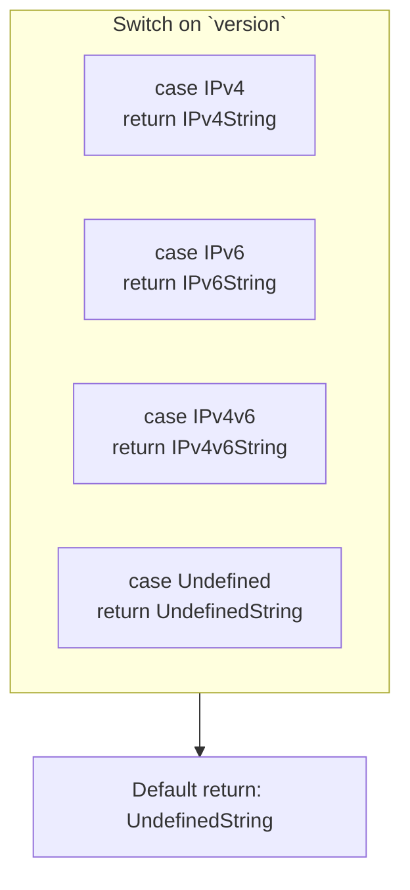

#### Function dependencies (Mermaid)
None – this function is currently not referenced elsewhere in the package.

#### Functions calling `IPVersion.String` (Mermaid)
None – this function is currently not referenced elsewhere in the package.

#### Usage example (Go)
```go
// Minimal example invoking IPVersion.String
package main

import (
    "fmt"

    "github.com/redhat-best-practices-for-k8s/certsuite/tests/networking/netcommons"
)

func main() {
    var v netcommons.IPVersion = netcommons.IPv4
    fmt.Println(v.String()) // Output: ipv4
}
```

---

### NetTestContext.String

**String** - Generates a human‑readable representation of a `NetTestContext`, detailing the initiating container and all target containers to be tested.


```go
func (testContext *NetTestContext) String() string
```

#### Summary Table

| Aspect | Details |
|--------|---------|
| **Purpose** | Generates a human‑readable representation of a `NetTestContext`, detailing the initiating container and all target containers to be tested. |
| **Parameters** | `testContext *NetTestContext` – receiver pointing to the context being formatted. |
| **Return value** | `string` – multiline description of the network test scenario. |
| **Key dependencies** | • `strings.Builder`<br>• `fmt.Sprintf`<br>• `WriteString` on the builder<br>• `len` function for slice length check<br>• Calls to the `String()` method of nested container objects (`TesterSource.String()`, each target’s `String()`). |
| **Side effects** | None. The function purely constructs and returns a string; it does not modify external state or perform I/O. |
| **How it fits the package** | Provides a convenient, standardized way to log or display test contexts within the networking test suite (`netcommons`). It is used by helpers such as `PrintNetTestContextMap` to produce comprehensive reports. |

#### Internal workflow (Mermaid)

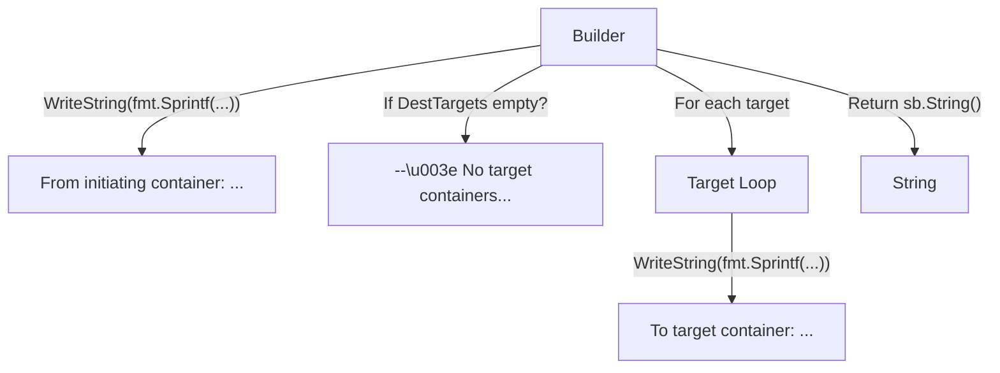

#### Function dependencies (Mermaid)

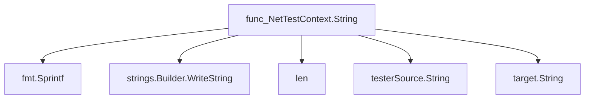

#### Functions calling `NetTestContext.String` (Mermaid)

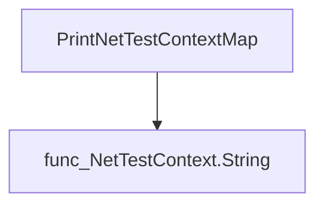

> Note: The function itself is also listed as a caller in the supplied data, but this refers to its use within its own source for illustrative purposes.

#### Usage example (Go)

```go
// Minimal example invoking NetTestContext.String
package main

import (
	"fmt"

	"github.com/redhat-best-practices-for-k8s/certsuite/tests/networking/netcommons"
)

func main() {
	// Assume we have a populated NetTestContext instance `ctx`
	var ctx netcommons.NetTestContext
	// Populate fields as needed...
	fmt.Println(ctx.String())
}
```

---

---

### PodIPsToStringList

**PodIPsToStringList** - Transforms a list of `corev1.PodIP` values into their raw IP string representations.


#### Signature (Go)

```go
func PodIPsToStringList(ips []corev1.PodIP) (ipList []string)
```

#### Summary Table

| Aspect | Details |
|--------|---------|
| **Purpose** | Transforms a list of `corev1.PodIP` values into their raw IP string representations. |
| **Parameters** | `ips []corev1.PodIP` – slice containing PodIP objects retrieved from a pod’s status. |
| **Return value** | `ipList []string` – slice of IP address strings extracted from the input. |
| **Key dependencies** | * Calls built‑in `append`. |
| **Side effects** | None; purely functional and thread‑safe. |
| **How it fits the package** | Provides a helper for networking tests to obtain plain string IPs when building network context objects. |

#### Internal workflow (Mermaid)

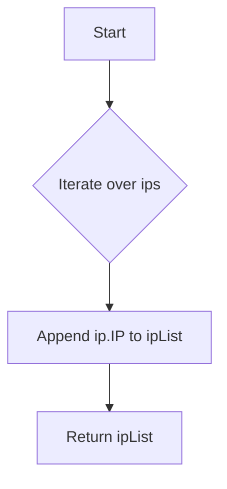

#### Function dependencies (Mermaid)

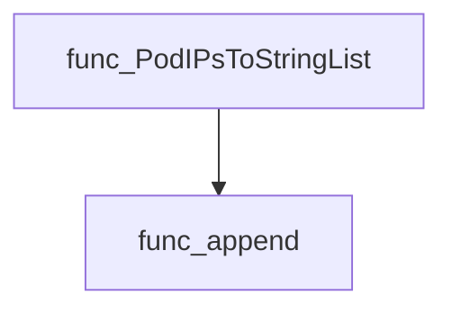

#### Functions calling `PodIPsToStringList` (Mermaid)

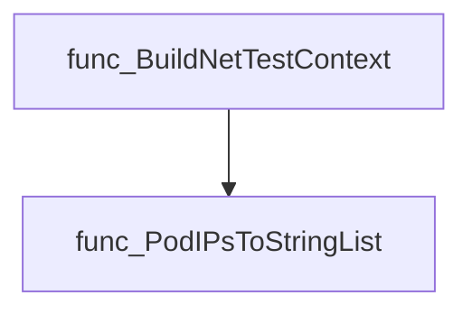

#### Usage example (Go)

```go
// Minimal example invoking PodIPsToStringList
package main

import (
	"fmt"

	corev1 "k8s.io/api/core/v1"
	netcommons "github.com/redhat-best-practices-for-k8s/certsuite/tests/networking/netcommons"
)

func main() {
	podIPs := []corev1.PodIP{
		{IP: "10.0.0.5"},
		{IP: "10.0.0.6"},
	}
	ipStrings := netcommons.PodIPsToStringList(podIPs)
	fmt.Println(ipStrings) // Output: [10.0.0.5 10.0.0.6]
}
```

---

### PrintNetTestContextMap

**PrintNetTestContextMap** - Produces a human‑readable string summarizing each network’s test context, including source and destination containers.


#### Signature (Go)
```go
func PrintNetTestContextMap(netsUnderTest map[string]NetTestContext) string
```

#### Summary Table
| Aspect | Details |
|--------|---------|
| **Purpose** | Produces a human‑readable string summarizing each network’s test context, including source and destination containers. |
| **Parameters** | `netsUnderTest` – mapping of network names to their corresponding `NetTestContext`. |
| **Return value** | A single concatenated string containing the formatted representation of all networks. |
| **Key dependencies** | - `strings.Builder` for efficient string construction.<br>- `fmt.Sprintf` for formatting each line.<br>- Method `(*NetTestContext).String()` to get per‑network details. |
| **Side effects** | None; purely functional, no I/O or state mutation outside the returned string. |
| **How it fits the package** | Serves as a helper for logging and debugging network test setups within the `netcommons` package. |

#### Internal workflow
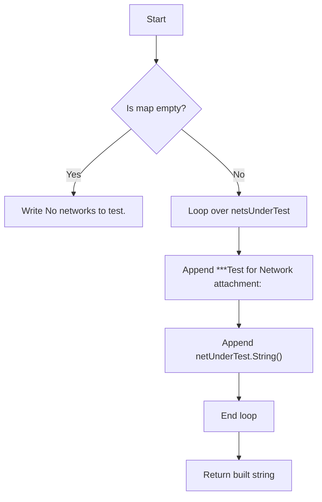

#### Function dependencies
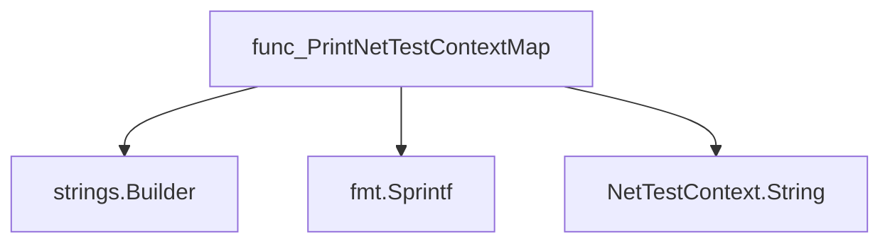

#### Functions calling `PrintNetTestContextMap`
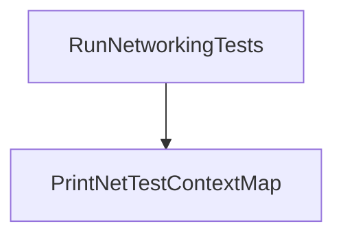

#### Usage example (Go)
```go
// Minimal example invoking PrintNetTestContextMap
package main

import (
    "github.com/redhat-best-practices-for-k8s/certsuite/tests/networking/netcommons"
)

func main() {
    // Example map with dummy data
    nets := map[string]netcommons.NetTestContext{
        "net1": netcommons.NetTestContext{/* fields omitted */},
        "net2": netcommons.NetTestContext{/* fields omitted */},
    }

    output := netcommons.PrintNetTestContextMap(nets)
    println(output) // prints formatted network test context
}
```

---

### TestReservedPortsUsage

**TestReservedPortsUsage** - Aggregates compliance reports for pods that listen on or declare any reserved port. It delegates the core check to `findRoguePodsListeningToPorts` and then returns the collected results.


#### Signature (Go)
```go
func TestReservedPortsUsage(env *provider.TestEnvironment, reservedPorts map[int32]bool, portsOrigin string, logger *log.Logger) (compliantObjects, nonCompliantObjects []*testhelper.ReportObject)
```

#### Summary Table
| Aspect | Details |
|--------|---------|
| **Purpose** | Aggregates compliance reports for pods that listen on or declare any reserved port. It delegates the core check to `findRoguePodsListeningToPorts` and then returns the collected results. |
| **Parameters** | `env *provider.TestEnvironment` – Test environment containing pod information.<br>`reservedPorts map[int32]bool` – Map of port numbers that are considered reserved.<br>`portsOrigin string` – Human‑readable label for the source of these ports (e.g., “OCP”, “Partner”).<br>`logger *log.Logger` – Logger used for debug and error output. |
| **Return value** | Two slices of `*testhelper.ReportObject`: <ul><li>`compliantObjects` – pods that do not violate the reservation rule.</li><li>`nonCompliantObjects` – pods that listen on or declare a reserved port.</li></ul> |
| **Key dependencies** | • Calls `findRoguePodsListeningToPorts` to perform per‑pod analysis.<br>• Uses `append` from Go’s standard library. |
| **Side effects** | None beyond logging; it does not modify the environment or any global state. |
| **How it fits the package** | Provides a reusable helper for higher‑level tests that need to verify port usage compliance across different environments (e.g., OpenShift, partner‑specific ports). |

#### Internal workflow (Mermaid)
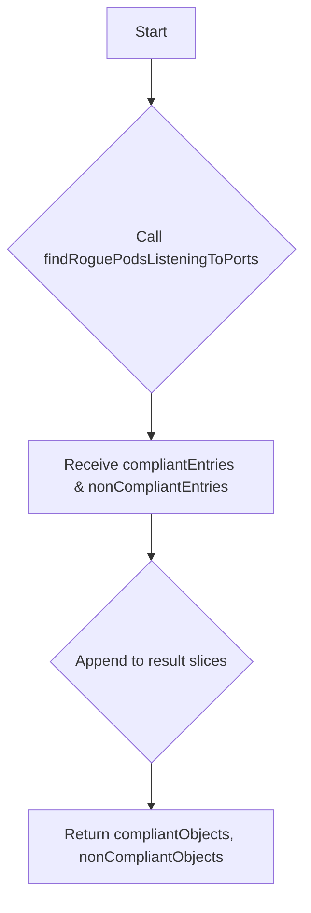

#### Function dependencies (Mermaid)
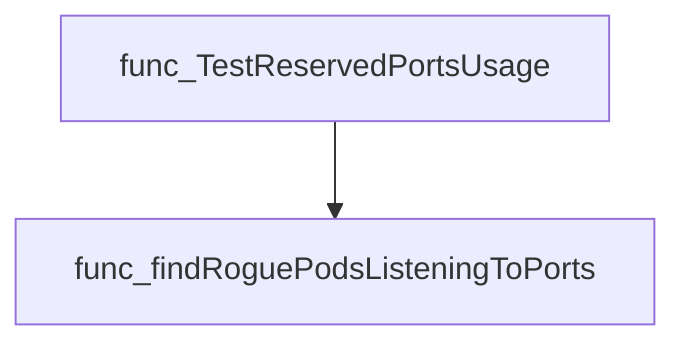

#### Functions calling `TestReservedPortsUsage` (Mermaid)
```mermaid
graph TD
  func_testOCPReservedPortsUsage --> func_TestReservedPortsUsage
  func_testPartnerSpecificTCPPorts --> func_TestReservedPortsUsage
```

#### Usage example (Go)
```go
// Minimal example invoking TestReservedPortsUsage
package main

import (
    "log"

    "github.com/redhat-best-practices-for-k8s/certsuite/tests/networking/netcommons"
    "github.com/redhat-best-practices-for-k8s/certsuite/tests/networking/provider"
)

func main() {
    env := &provider.TestEnvironment{
        // Populate with relevant pods for the test
    }
    reservedPorts := map[int32]bool{22623: true, 22624: true}
    logger := log.Default()

    compliant, nonCompliant := netcommons.TestReservedPortsUsage(env, reservedPorts, "OCP", logger)

    fmt.Printf("Compliant pods: %d\nNon‑compliant pods: %d\n", len(compliant), len(nonCompliant))
}
```

---

## Local Functions

### findRogueContainersDeclaringPorts

**findRogueContainersDeclaringPorts** - Scans each container’s port list and flags those that declare any port present in `portsToTest`. Containers declaring such ports are marked non‑compliant; all others are compliant.


#### Signature (Go)

```go
func findRogueContainersDeclaringPorts(containers []*provider.Container, portsToTest map[int32]bool, portsOrigin string, logger *log.Logger) (compliantObjects, nonCompliantObjects []*testhelper.ReportObject)
```

#### Summary Table

| Aspect | Details |
|--------|---------|
| **Purpose** | Scans each container’s port list and flags those that declare any port present in `portsToTest`. Containers declaring such ports are marked non‑compliant; all others are compliant. |
| **Parameters** | `containers []*provider.Container` – slice of containers to inspect.<br>`portsToTest map[int32]bool` – set of reserved port numbers to check against.<br>`portsOrigin string` – label describing the source of the reserved ports (e.g., “Istio” or “Kubernetes”).<br>`logger *log.Logger` – logger used for tracing and error reporting. |
| **Return value** | Two slices of `*testhelper.ReportObject`: compliantObjects and nonCompliantObjects, each populated with a report per container. |
| **Key dependencies** | • `logger.Info`, `logger.Error`<br>• `fmt.Sprintf`, `strconv.Itoa`<br>• `testhelper.NewContainerReportObject`, `SetType`, `AddField` |
| **Side effects** | No global state changes; only log output and creation of report objects. |
| **How it fits the package** | Utility for the networking compliance checks that evaluates whether containers expose ports that are reserved or otherwise disallowed. It is invoked by higher‑level pod‑level functions to aggregate per‑pod results. |

#### Internal workflow (Mermaid)

```mermaid
flowchart TD
  Start --> IterateContainers["Iterate over each container"]
  IterateContainers --> InspectPorts["Inspect containers ports"]
  InspectPorts --> CheckPort{"Is port in portsToTest?"}
  CheckPort -- Yes --> LogError & AppendNonCompliant["Log error, append non‑compliant report"]
  CheckPort -- No --> LogInfo & AppendCompliant["Log info, append compliant report"]
  AppendNonCompliant --> End
  AppendCompliant --> End
```

#### Function dependencies (Mermaid)

```mermaid
graph TD
  func_findRogueContainersDeclaringPorts --> logger.Info
  func_findRogueContainersDeclaringPorts --> logger.Error
  func_findRogueContainersDeclaringPorts --> fmt.Sprintf
  func_findRogueContainersDeclaringPorts --> strconv.Itoa
  func_findRogueContainersDeclaringPorts --> testhelper.NewContainerReportObject
  func_findRogueContainersDeclaringPorts --> testhelper.SetType
  func_findRogueContainersDeclaringPorts --> testhelper.AddField
```

#### Functions calling `findRogueContainersDeclaringPorts` (Mermaid)

```mermaid
graph TD
  func_findRoguePodsListeningToPorts --> func_findRogueContainersDeclaringPorts
```

#### Usage example (Go)

```go
// Minimal example invoking findRogueContainersDeclaringPorts
package main

import (
	"log"

	"github.com/redhat-best-practices-for-k8s/certsuite/pkg/provider"
	"github.com/redhat-best-practices-for-k8s/certsuite/tests/networking/netcommons"
)

func main() {
	logger := log.Default()

	// Example containers (normally obtained from Kubernetes API)
	containers := []*provider.Container{
		{
			Name:      "app",
			Namespace: "default",
			Podname:   "mypod",
			Ports: []provider.Port{
				{ContainerPort: 8080, Protocol: provider.ProtocolTCP},
				{ContainerPort: 443, Protocol: provider.ProtocolTCP},
			},
		},
	}

	// Ports considered reserved for the test
	reserved := map[int32]bool{443: true, 8443: true}

	compliant, nonCompliant := netcommons.FindRogueContainersDeclaringPorts(
		containers,
		reserved,
		"Istio",
		logger,
	)

	fmt.Println("Compliant:", compliant)
	fmt.Println("Non‑compliant:", nonCompliant)
}
```

*Note: In the actual package the function is unexported; the example uses an exported wrapper `FindRogueContainersDeclaringPorts` for illustration.*

---

### findRoguePodsListeningToPorts

**findRoguePodsListeningToPorts** - Scans a list of pods to determine if any container declares or listens on ports that are reserved. Generates compliance reports for each pod.


#### Signature (Go)

```go
func findRoguePodsListeningToPorts(pods []*provider.Pod, portsToTest map[int32]bool, portsOrigin string, logger *log.Logger) (compliantObjects, nonCompliantObjects []*testhelper.ReportObject)
```

#### Summary Table

| Aspect | Details |
|--------|---------|
| **Purpose** | Scans a list of pods to determine if any container declares or listens on ports that are reserved. Generates compliance reports for each pod. |
| **Parameters** | `pods []*provider.Pod` – collection of pods to inspect.<br>`portsToTest map[int32]bool` – set of port numbers considered reserved.<br>`portsOrigin string` – label describing the source of the reserved ports (e.g., “K8s Reserved”).<br>`logger *log.Logger` – logger for diagnostic output. |
| **Return value** | Two slices of `*testhelper.ReportObject`: one for compliant pods, one for non‑compliant pods. |
| **Key dependencies** | • `findRogueContainersDeclaringPorts` (container‑level port declaration check)<br>• `netutil.GetListeningPorts` (retrieve listening ports per container)<br>• Logging helpers (`Info`, `Error`) and report constructors (`NewPodReportObject`). |
| **Side effects** | Emits log messages; creates new report objects; no global state mutation. |
| **How it fits the package** | Provides core logic for the *Reserved Ports* test in `netcommons`. It is invoked by higher‑level test functions to aggregate compliance results across a cluster. |

#### Internal workflow (Mermaid)

```mermaid
flowchart TD
  A["Start"] --> B{"Iterate pods"}
  B -->|"for each pod"| C["Check containers for declared ports"]
  C --> D["Collect non‑compliant entries"]
  D --> E["Get listening ports of first container"]
  E --> F{"Error?"}
  F -- yes --> G["Log error & add non‑compliant report"]
  F -- no --> H{"Iterate listening ports"}
  H -->|"for each port"| I{"Port reserved?"}
  I -- yes --> J{"Istio proxy present && ReservedIstioPorts?"}
  J -- true --> K["Ignore (Istio) and continue"]
  J -- false --> L["Log error & add non‑compliant report"]
  I -- no --> M["Add compliant report for listening port"]
  H --> N{"Any non‑compliant port found?"}
  N -- yes --> O["Add overall pod non‑compliant report"]
  N -- no --> P["Add overall pod compliant report"]
  O --> Q["End"]
  P --> Q
```

#### Function dependencies (Mermaid)

```mermaid
graph TD
  func_findRoguePodsListeningToPorts --> func_findRogueContainersDeclaringPorts
  func_findRoguePodsListeningToPorts --> netutil.GetListeningPorts
  func_findRoguePodsListeningToPorts --> testhelper.NewPodReportObject
```

#### Functions calling `findRoguePodsListeningToPorts` (Mermaid)

```mermaid
graph TD
  TestReservedPortsUsage --> func_findRoguePodsListeningToPorts
```

#### Usage example (Go)

```go
// Minimal example invoking findRoguePodsListeningToPorts

import (
    "log"
    "github.com/redhat-best-practices-for-k8s/certsuite/tests/networking/netcommons/provider"
    "github.com/redhat-best-practices-for-k8s/certsuite/pkg/testhelper"
)

func example() {
    pods := []*provider.Pod{ /* populate with Pod objects */ }
    reservedPorts := map[int32]bool{22: true, 443: true}
    origin := "K8s Reserved"

    logger := log.New(os.Stdout, "", log.LstdFlags)
    compliant, nonCompliant := findRoguePodsListeningToPorts(pods, reservedPorts, origin, logger)

    // Handle reports
    for _, r := range compliant {
        fmt.Println("Compliant:", r.Reason)
    }
    for _, r := range nonCompliant {
        fmt.Println("Non‑compliant:", r.Reason)
    }
}
```

---

