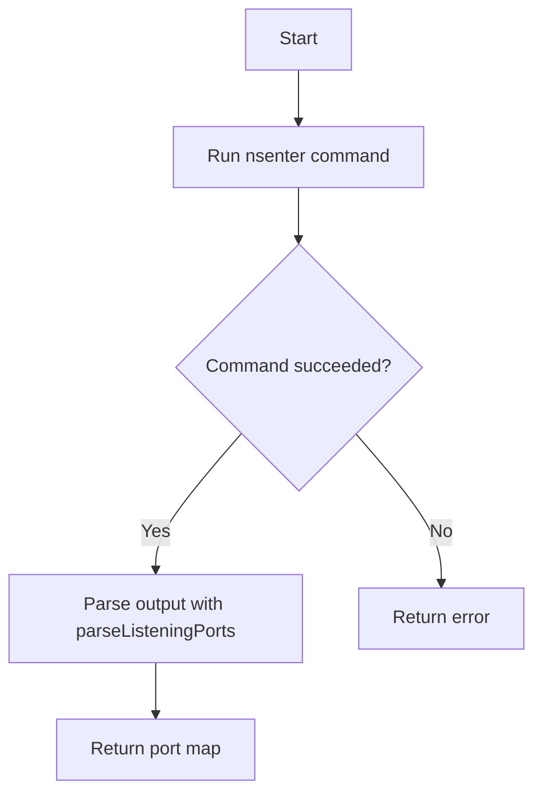
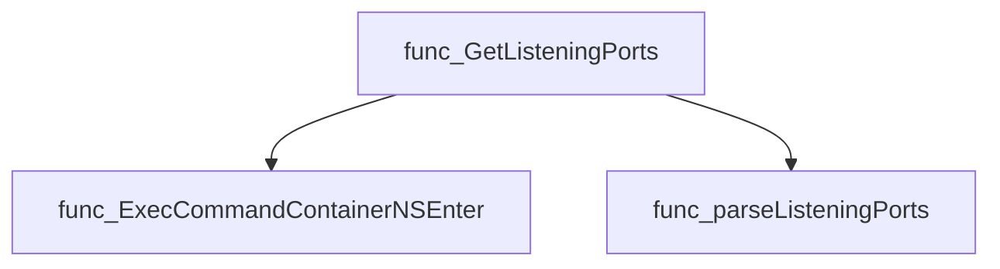
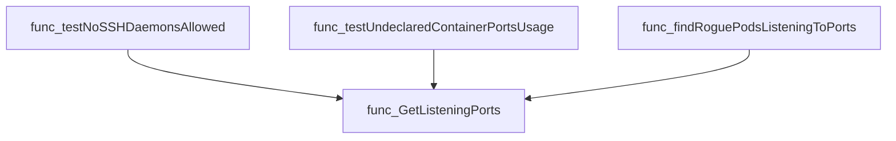
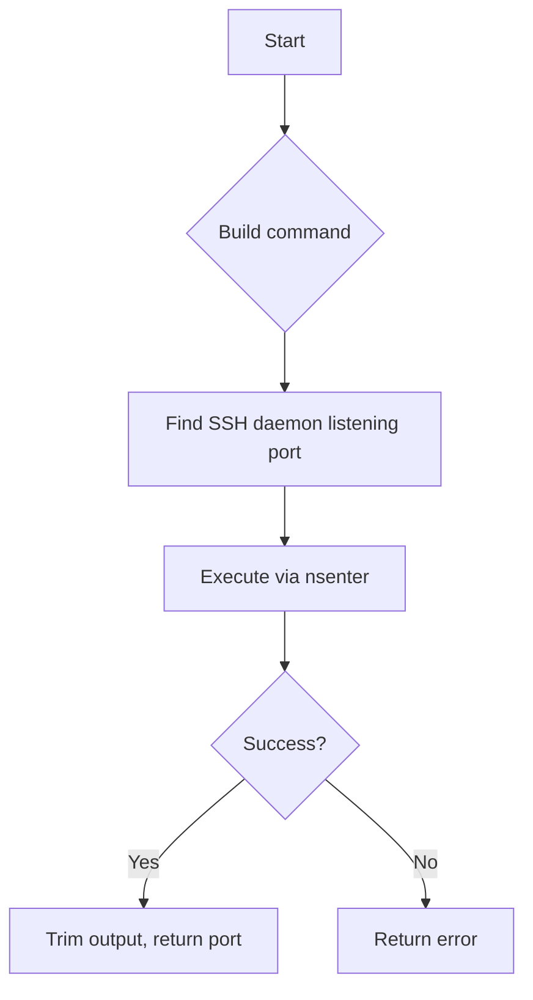
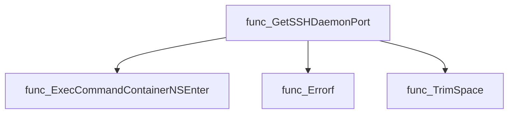
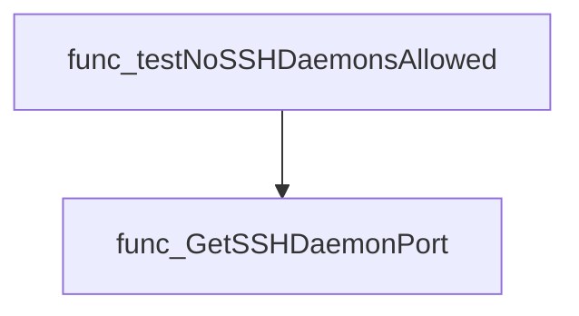
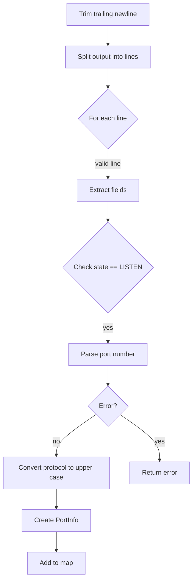
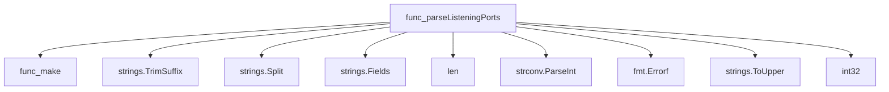
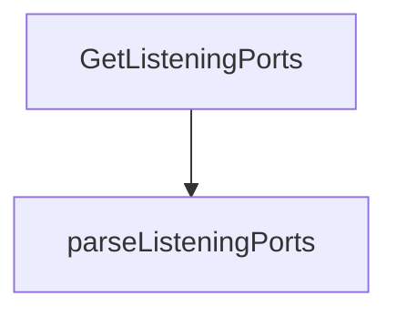

# Package netutil

**Path**: `tests/networking/netutil`

## Table of Contents

- [Overview](#overview)
- [Structs](#structs)
  - [PortInfo](#portinfo)
- [Exported Functions](#exported-functions)
  - [GetListeningPorts](#getlisteningports)
  - [GetSSHDaemonPort](#getsshdaemonport)
- [Local Functions](#local-functions)
  - [parseListeningPorts](#parselisteningports)

## Overview

The netutil package supplies helper functions for inspecting the network state of containers in a Kubernetes environment, primarily by executing `nsenter` commands to list listening sockets and extracting specific service ports such as SSH.

### Key Features

- Retrieves all active listening ports inside a container and returns them as a map of PortInfo objects
- Parses raw command output into structured port information (protocol, port number)
- Provides a dedicated helper to locate the SSH daemon’s listening port within a container

### Design Notes

- Uses `nsenter` via an external client to run commands inside container namespaces; assumes the target container has access to the required binaries
- Parsing logic is strict and expects a specific output format; malformed lines result in an error rather than silent failure
- Typical usage involves calling GetListeningPorts first, then inspecting the returned map for desired ports or protocols

### Structs Summary

| Name | Purpose |
|------|----------|
| [**PortInfo**](#portinfo) | One-line purpose |

### Exported Functions Summary

| Name | Purpose |
|------|----------|
| [func GetListeningPorts(cut *provider.Container) (map[PortInfo]bool, error)](#getlisteningports) | Executes an `nsenter` command to list active network sockets in a container and parses the output into a map of `PortInfo`. |
| [func GetSSHDaemonPort(cut *provider.Container) (string, error)](#getsshdaemonport) | Executes a shell pipeline inside the target container to locate the `sshd` process and extract its listening port number. |

### Local Functions Summary

| Name | Purpose |
|------|----------|
| [func parseListeningPorts(string) (map[PortInfo]bool, error)](#parselisteningports) | Converts the raw output of a network‐listing command into a set of `PortInfo` objects representing actively listening ports. |

## Structs

### PortInfo

A lightweight value type that identifies a network port by its numeric identifier and transport protocol.

#### Fields

| Field      | Type   | Description |
|------------|--------|-------------|
| `PortNumber` | `int32` | The integer port number (e.g., 80, 443). |
| `Protocol`    | `string` | Transport protocol in uppercase (commonly `"TCP"` or `"UDP"`). |

#### Purpose  

`PortInfo` is used to represent an individual listening port discovered within a container. It serves as the key in maps that track which ports are active, allowing functions like `GetListeningPorts` to return a set of all listening sockets.

#### Related functions

| Function | Purpose |
|----------|---------|
| `GetListeningPorts` | Executes a command inside a container to list network sockets and returns a map keyed by `PortInfo`. |
| `parseListeningPorts` | Parses the command output, constructs `PortInfo` instances for each listening socket, and populates a map of them. |

---

---

## Exported Functions

### GetListeningPorts

**GetListeningPorts** - Executes an `nsenter` command to list active network sockets in a container and parses the output into a map of `PortInfo`.

#### Signature (Go)

```go
func GetListeningPorts(cut *provider.Container) (map[PortInfo]bool, error)
```

#### Summary Table

| Aspect | Details |
|--------|---------|
| **Purpose** | Executes an `nsenter` command to list active network sockets in a container and parses the output into a map of `PortInfo`. |
| **Parameters** | `cut *provider.Container` – the target container whose listening ports are queried. |
| **Return value** | `map[PortInfo]bool` – set of listening ports; `error` – any failure during command execution or parsing. |
| **Key dependencies** | • `crclient.ExecCommandContainerNSEnter(getListeningPortsCmd, cut)`<br>• `parseListeningPorts(outStr)` |
| **Side effects** | None beyond network command invocation and error reporting. |
| **How it fits the package** | Supports networking checks by providing runtime port information used in tests such as SSH daemon detection and undeclared port verification. |

#### Internal workflow (Mermaid)



#### Function dependencies (Mermaid)



#### Functions calling `GetListeningPorts` (Mermaid)



#### Usage example (Go)

```go
// Minimal example invoking GetListeningPorts
import (
    "github.com/redhat-best-practices-for-k8s/certsuite/tests/networking/netutil"
    "github.com/redhat-best-practices-for-k8s/certsuite/internal/provider"
)

func main() {
    // Assume we have a provider.Container instance named container
    var container *provider.Container

    ports, err := netutil.GetListeningPorts(container)
    if err != nil {
        log.Fatalf("Failed to get listening ports: %v", err)
    }

    for p := range ports {
        fmt.Printf("Port %d/%s is listening\n", p.PortNumber, p.Protocol)
    }
}
```

---

### GetSSHDaemonPort

**GetSSHDaemonPort** - Executes a shell pipeline inside the target container to locate the `sshd` process and extract its listening port number.

#### Signature (Go)

```go
func GetSSHDaemonPort(cut *provider.Container) (string, error)
```

#### Summary Table

| Aspect | Details |
|--------|---------|
| **Purpose** | Executes a shell pipeline inside the target container to locate the `sshd` process and extract its listening port number. |
| **Parameters** | `cut *provider.Container` – reference to the container in which to search for an SSH daemon. |
| **Return value** | `<port string, err error>` – the port number as a trimmed string; empty if no SSH daemon is found or an error occurs. |
| **Key dependencies** | • `crclient.ExecCommandContainerNSEnter` – runs a command via nsenter in the container.<br>• `fmt.Errorf`, `strings.TrimSpace`. |
| **Side effects** | None beyond network I/O: executes a remote shell command; no state mutation. |
| **How it fits the package** | Utility for networking checks that need to determine whether an SSH service is running inside a pod, used by higher‑level tests such as access control compliance. |

#### Internal workflow (Mermaid)



#### Function dependencies (Mermaid)



#### Functions calling `GetSSHDaemonPort` (Mermaid)



#### Usage example (Go)

```go
// Minimal example invoking GetSSHDaemonPort
import (
    "github.com/redhat-best-practices-for-k8s/certsuite/tests/networking/netutil"
    "github.com/redhat-best-practices-for-k8s/certsuite/internal/provider"
)

func example(container *provider.Container) {
    port, err := netutil.GetSSHDaemonPort(container)
    if err != nil {
        fmt.Printf("Error: %v\n", err)
        return
    }
    if port == "" {
        fmt.Println("No SSH daemon found in container")
    } else {
        fmt.Printf("SSH daemon listening on port %s\n", port)
    }
}
```

---

## Local Functions

### parseListeningPorts

**parseListeningPorts** - Converts the raw output of a network‐listing command into a set of `PortInfo` objects representing actively listening ports.

#### Signature (Go)

```go
func parseListeningPorts(string) (map[PortInfo]bool, error)
```

#### Summary Table

| Aspect | Details |
|--------|---------|
| **Purpose** | Converts the raw output of a network‐listing command into a set of `PortInfo` objects representing actively listening ports. |
| **Parameters** | `cmdOut string –` the multiline text returned by the external command. |
| **Return value** | `map[PortInfo]bool` – a map where each key is a unique port/protocol pair; the boolean value is always `true`.  `error` – non‑nil if any parsing step fails. |
| **Key dependencies** | • `strings.TrimSuffix`, `strings.Split`, `strings.Fields`, `strconv.ParseInt`, `fmt.Errorf`, `strings.ToUpper`, type conversion to `int32`. |
| **Side effects** | None; operates purely on its input and returns new data structures. |
| **How it fits the package** | Internally used by `GetListeningPorts` to interpret command output into a programmatic representation of listening sockets. |

#### Internal workflow (Mermaid)



#### Function dependencies (Mermaid)



#### Functions calling `parseListeningPorts` (Mermaid)



#### Usage example (Go)

```go
// Minimal example invoking parseListeningPorts
output := "tcp        0      0 0.0.0.0:22          0.0.0.0:*           LISTEN\n"
ports, err := parseListeningPorts(output)
if err != nil {
    log.Fatalf("parsing failed: %v", err)
}
for p := range ports {
    fmt.Printf("Port %d/%s is listening\n", p.Port, p.Protocol)
}
```

---
