# Package networking

**Path**: `tests/networking`

## Table of Contents

- [Overview](#overview)
- [Exported Functions](#exported-functions)
  - [LoadChecks](#loadchecks)
- [Local Functions](#local-functions)
  - [testDualStackServices](#testdualstackservices)
  - [testExecProbDenyAtCPUPinning](#testexecprobdenyatcpupinning)
  - [testNetworkAttachmentDefinitionSRIOVUsingMTU](#testnetworkattachmentdefinitionsriovusingmtu)
  - [testNetworkConnectivity](#testnetworkconnectivity)
  - [testNetworkPolicyDenyAll](#testnetworkpolicydenyall)
  - [testOCPReservedPortsUsage](#testocpreservedportsusage)
  - [testPartnerSpecificTCPPorts](#testpartnerspecifictcpports)
  - [testRestartOnRebootLabelOnPodsUsingSriov](#testrestartonrebootlabelonpodsusingsriov)
  - [testUndeclaredContainerPortsUsage](#testundeclaredcontainerportsusage)

## Overview

Provides a suite of network‑related tests for the CertSuite framework, registering checks that validate pod networking policies, port usage, SR‑IOV configuration, service IP support, and ICMP connectivity.

### Key Features

- Registers multiple test cases with optional skip conditions and custom check functions
- Executes ICMP ping tests across IPv4/IPv6 and interface types
- Verifies compliance of pods with network policies, reserved ports, SR‑I/O‑V MTU, and CPU‑pinning exec probe rules

### Design Notes

- Test registration is performed via LoadChecks which builds a checks group; skip functions guard against missing resources
- Each check function receives a Check object for reporting and a TestEnvironment or pod list
- Reporting uses testhelper objects to aggregate results and log detailed messages

### Exported Functions Summary

| Name | Purpose |
|------|----------|
| [func LoadChecks()](#loadchecks) | Builds a checks group for the networking suite and registers individual test cases, each with optional skip conditions and check functions. |

### Local Functions Summary

| Name | Purpose |
|------|----------|
| [func testDualStackServices(check *checksdb.Check, env *provider.TestEnvironment)](#testdualstackservices) | Determines whether each Kubernetes Service in the test environment supports IPv6 or is dual‑stack; records compliant and non‑compliant services. |
| [func testExecProbDenyAtCPUPinning(check *checksdb.Check, dpdkPods []*provider.Pod)](#testexecprobdenyatcpupinning) | Ensures that every CPU‑pinned pod used for DPDK does not contain an exec probe. An exec probe is disallowed in this context because it can interfere with strict CPU pinning and predictable performance. |
| [func testNetworkAttachmentDefinitionSRIOVUsingMTU(check *checksdb.Check, sriovPods []*provider.Pod)](#testnetworkattachmentdefinitionsriovusingmtu) | Ensures each SR‑I/O‑V pod declares an MTU; records compliance status. |
| [func testNetworkConnectivity(env *provider.TestEnvironment, aIPVersion netcommons.IPVersion, aType netcommons.IFType, check *checksdb.Check)](#testnetworkconnectivity) | Orchestrates ICMP connectivity tests for a given IP version and interface type. Builds the test context, executes ping checks, and records results in the supplied `Check`. |
| [func testNetworkPolicyDenyAll(check *checksdb.Check, env *provider.TestEnvironment)()](#testnetworkpolicydenyall) | Ensures each pod in the environment is protected by a NetworkPolicy that denies all ingress and egress traffic. It logs compliance status and records results for reporting. |
| [func testOCPReservedPortsUsage(check *checksdb.Check, env *provider.TestEnvironment)](#testocpreservedportsusage) | Verifies that no pod is listening on ports reserved by OpenShift (22623, 22624). |
| [func testPartnerSpecificTCPPorts(check *checksdb.Check, env *provider.TestEnvironment)](#testpartnerspecifictcpports) | Confirms that the pods in the test environment are not listening on TCP ports reserved by a partner. The function collects all partner‑reserved ports and reports compliance. |
| [func testRestartOnRebootLabelOnPodsUsingSriov(check *checksdb.Check, sriovPods []*provider.Pod)](#testrestartonrebootlabelonpodsusingsriov) | Ensures that every pod using SR‑IOV has the `restart-on-reboot` label set to `"true"`. Pods missing the label or with a different value are marked non‑compliant. |
| [func testUndeclaredContainerPortsUsage(check *checksdb.Check, env *provider.TestEnvironment)](#testundeclaredcontainerportsusage) | For each pod, compares the ports actually listening inside containers with those declared in the pod’s container specifications. Flags pods that expose undeclared ports as non‑compliant. |

## Exported Functions

### LoadChecks

**LoadChecks** - Builds a checks group for the networking suite and registers individual test cases, each with optional skip conditions and check functions.


#### 1) Signature (Go)

```go
func LoadChecks()
```

#### 2) Summary Table

| Aspect | Details |
|--------|---------|
| **Purpose** | Builds a checks group for the networking suite and registers individual test cases, each with optional skip conditions and check functions. |
| **Parameters** | None |
| **Return value** | None |
| **Key dependencies** | <ul><li>`checksdb.NewChecksGroup` – creates the group container</li><li>`WithBeforeEachFn` – sets a per‑check setup function</li><li>Various `identifiers.GetTestIDAndLabels` calls – supply unique IDs and tags for each test</li><li>`testhelper.Get…SkipFn` functions – provide skip predicates based on environment state</li><li>Specific test functions (`testNetworkConnectivity`, `testUndeclaredContainerPortsUsage`, etc.) that perform the actual checks</li></ul> |
| **Side effects** | Adds check definitions to an in‑memory database (via `checksdb.NewChecksGroup`) and logs a debug message. No external I/O beyond logging. |
| **How it fits the package** | It is invoked by `pkg/certsuite.LoadInternalChecksDB` to load all networking checks into the central test registry, enabling them to be executed during a certsuite run. |

#### 3) Internal workflow (Mermaid)

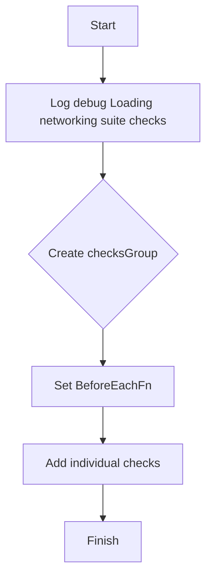

#### 4) Function dependencies (Mermaid)

```mermaid
graph TD
  func_LoadChecks --> func_Log.Debug
  func_LoadChecks --> func_checksdb.NewChecksGroup
  func_LoadChecks --> func_WithBeforeEachFn
  func_LoadChecks --> func_identifiers.GetTestIDAndLabels
  func_LoadChecks --> func_testhelper.GetNoContainersUnderTestSkipFn
  func_LoadChecks --> func_testhelper.GetDaemonSetFailedToSpawnSkipFn
  func_LoadChecks --> func_testhelper.GetNoPodsUnderTestSkipFn
  func_LoadChecks --> func_testhelper.GetNoServicesUnderTestSkipFn
  func_LoadChecks --> func_testhelper.GetNoCPUPinningPodsSkipFn
  func_LoadChecks --> func_testhelper.GetNoSRIOVPodsSkipFn
  func_LoadChecks --> func_testNetworkConnectivity
  func_LoadChecks --> func_testUndeclaredContainerPortsUsage
  func_LoadChecks --> func_testOCPReservedPortsUsage
  func_LoadChecks --> func_testDualStackServices
  func_LoadChecks --> func_testNetworkPolicyDenyAll
  func_LoadChecks --> func_testPartnerSpecificTCPPorts
  func_LoadChecks --> func_testExecProbDenyAtCPUPinning
  func_LoadChecks --> func_testRestartOnRebootLabelOnPodsUsingSriov
  func_LoadChecks --> func_testNetworkAttachmentDefinitionSRIOVUsingMTU
```

#### 5) Functions calling `LoadChecks` (Mermaid)

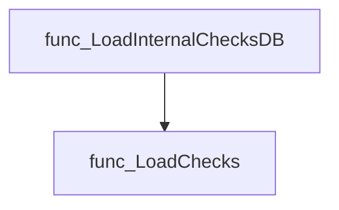

#### 6) Usage example (Go)

```go
// Assume we are in the certsuite package where LoadInternalChecksDB is defined.
func main() {
    // Register all checks from every sub‑suite.
    pkgcertsuite.LoadInternalChecksDB()

    // The networking checks are now available for execution.
}
```

---

---

## Local Functions

### testDualStackServices

**testDualStackServices** - Determines whether each Kubernetes Service in the test environment supports IPv6 or is dual‑stack; records compliant and non‑compliant services.


#### Signature (Go)
```go
func testDualStackServices(check *checksdb.Check, env *provider.TestEnvironment)
```

#### Summary Table
| Aspect | Details |
|--------|---------|
| **Purpose** | Determines whether each Kubernetes Service in the test environment supports IPv6 or is dual‑stack; records compliant and non‑compliant services. |
| **Parameters** | `check` – check context for logging and result reporting.<br>`env` – environment containing the list of Services to evaluate. |
| **Return value** | None (results are stored via `check.SetResult`). |
| **Key dependencies** | *`services.GetServiceIPVersion`* – obtains IP version information.<br>*`testhelper.NewReportObject`* – creates compliance reports.<br>*`check.LogInfo/LogError`* – logs progress and errors. |
| **Side effects** | Mutates the check result state by appending report objects; writes log entries. |
| **How it fits the package** | Implements the “Dual stack services” test case registered in `LoadChecks`; ensures network services meet IPv6 or dual‑stack requirements for certification compliance. |

#### Internal workflow (Mermaid)
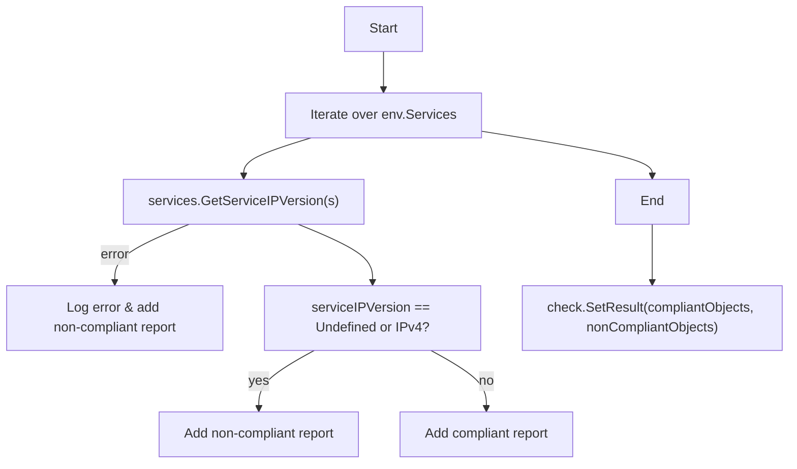

#### Function dependencies (Mermaid)
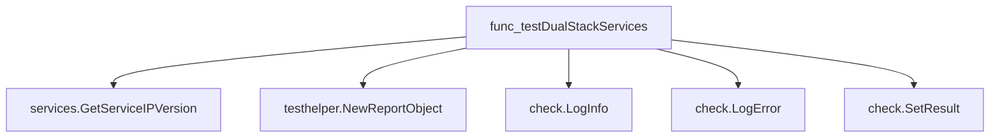

#### Functions calling `testDualStackServices` (Mermaid)
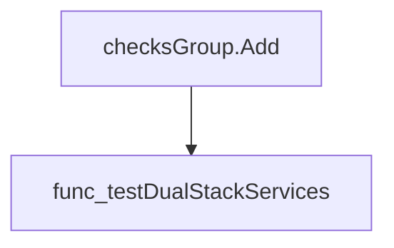

#### Usage example (Go)
```go
// Minimal example invoking testDualStackServices
func runExample(env *provider.TestEnvironment) {
    // Create a dummy check object (in real code this comes from the checks framework)
    chk := &checksdb.Check{}
    testDualStackServices(chk, env)

    // Inspect results
    fmt.Printf("Compliant: %v\n", chk.CompliantObjects)
    fmt.Printf("Non‑compliant: %v\n", chk.NonCompliantObjects)
}
```

---

---

### testExecProbDenyAtCPUPinning

**testExecProbDenyAtCPUPinning** - Ensures that every CPU‑pinned pod used for DPDK does not contain an exec probe. An exec probe is disallowed in this context because it can interfere with strict CPU pinning and predictable performance.


#### Signature (Go)
```go
func testExecProbDenyAtCPUPinning(check *checksdb.Check, dpdkPods []*provider.Pod)
```

#### Summary Table
| Aspect | Details |
|--------|---------|
| **Purpose** | Ensures that every CPU‑pinned pod used for DPDK does not contain an exec probe. An exec probe is disallowed in this context because it can interfere with strict CPU pinning and predictable performance. |
| **Parameters** | `check *checksdb.Check` – the check instance to log results and set final status.<br>`dpdkPods []*provider.Pod` – slice of pods that are CPU‑pinned and use DPDK. |
| **Return value** | None (void). Results are recorded via `SetResult`. |
| **Key dependencies** | • `check.LogInfo`, `check.LogError`<br>• `cut.HasExecProbes()`<br>• `testhelper.NewPodReportObject`<br>• `check.SetResult` |
| **Side effects** | *Logs information and errors to the check’s logger.<br>* Builds two slices of report objects (`compliantObjects`, `nonCompliantObjects`).<br>* Calls `SetResult` to store results for the test. No external I/O or state mutation beyond the check instance. |
| **How it fits the package** | Part of the networking test suite, specifically used by the *DPDK CPU pinning exec probe* test case to enforce best‑practice compliance for high‑performance workloads. |

#### Internal workflow (Mermaid)
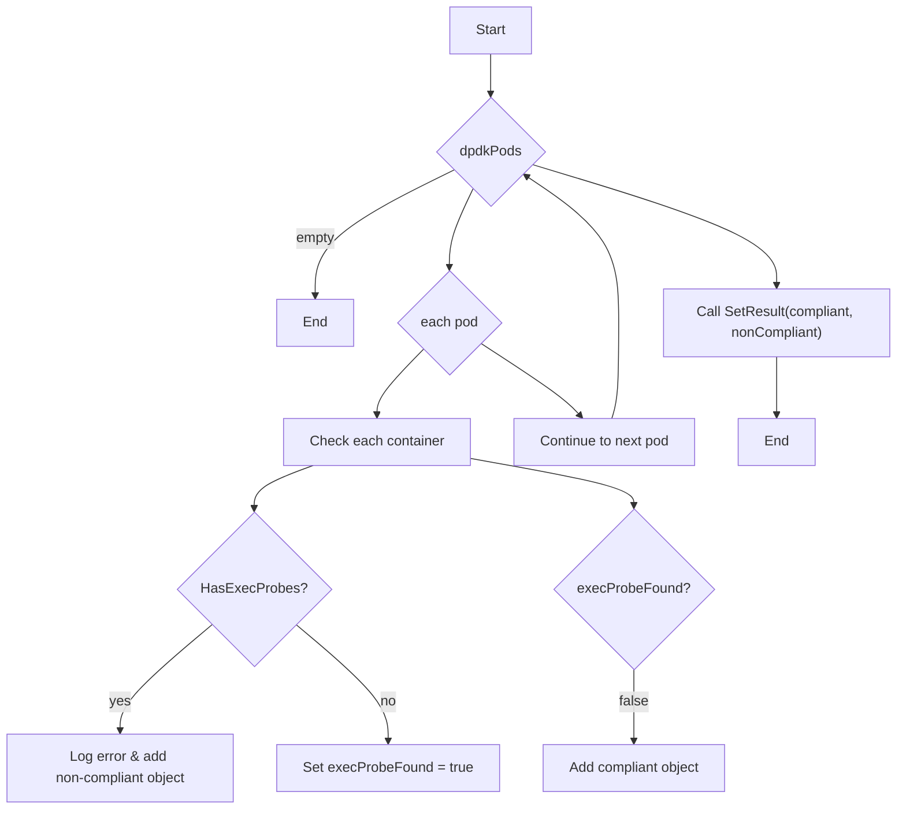

#### Function dependencies (Mermaid)
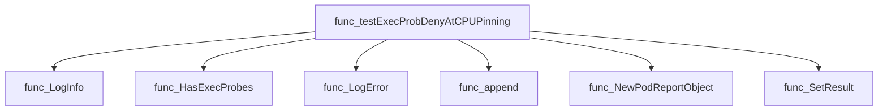

#### Functions calling `testExecProbDenyAtCPUPinning` (Mermaid)
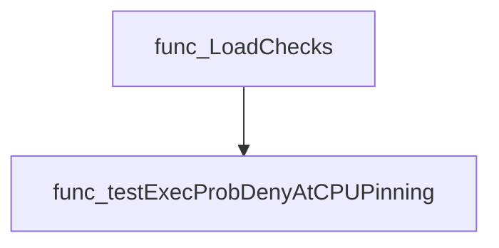

#### Usage example (Go)
```go
// Minimal example invoking testExecProbDenyAtCPUPinning
package main

import (
    "github.com/redhat-best-practices-for-k8s/certsuite/tests/networking"
    "github.com/redhat-best-practices-for-k8s/certsuite/pkg/checksdb"
    "github.com/redhat-best-practices-for-k8s/certsuite/pkg/provider"
)

func main() {
    // Assume we have a check instance and a list of CPU‑pinned DPDK pods
    var check *checksdb.Check
    var dpdkPods []*provider.Pod

    networking.TestExecProbDenyAtCPUPinning(check, dpdkPods)
}
```

---

### testNetworkAttachmentDefinitionSRIOVUsingMTU

**testNetworkAttachmentDefinitionSRIOVUsingMTU** - Ensures each SR‑I/O‑V pod declares an MTU; records compliance status.


#### Signature (Go)

```go
func testNetworkAttachmentDefinitionSRIOVUsingMTU(check *checksdb.Check, sriovPods []*provider.Pod)
```

#### Summary Table

| Aspect | Details |
|--------|---------|
| **Purpose** | Ensures each SR‑I/O‑V pod declares an MTU; records compliance status. |
| **Parameters** | `check` – the test context (`*checksdb.Check`).<br>`sriovPods` – slice of pods to evaluate (`[]*provider.Pod`). |
| **Return value** | None (side‑effect only). |
| **Key dependencies** | • `pod.IsUsingSRIOVWithMTU()` <br>• `check.LogError`, `check.LogInfo` <br>• `testhelper.NewPodReportObject` <br>• `check.SetResult` |
| **Side effects** | Logs errors or info; aggregates compliant/non‑compliant report objects and stores them via `SetResult`. |
| **How it fits the package** | Used by the networking test suite to validate SR‑I/O‑V pod configuration. |

#### Internal workflow (Mermaid)

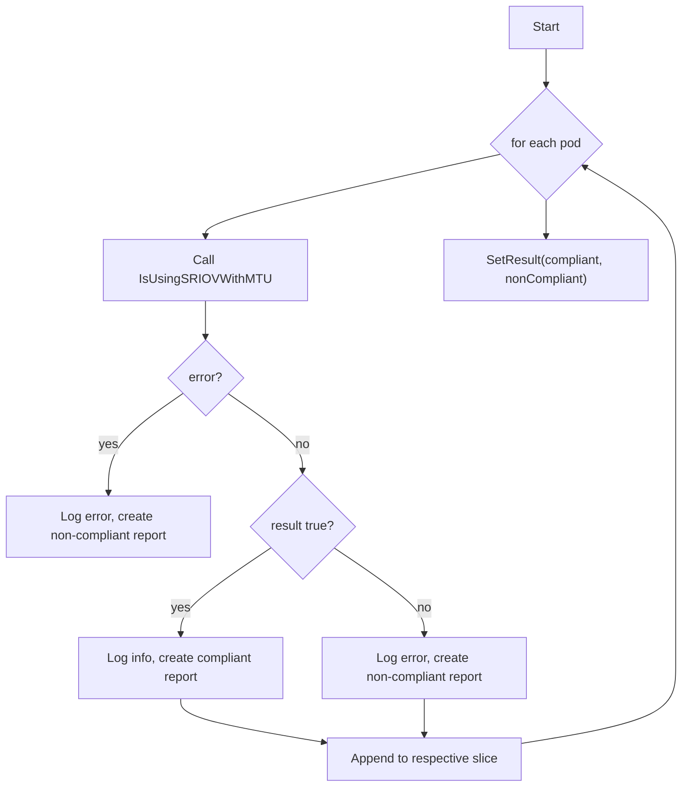

#### Function dependencies (Mermaid)

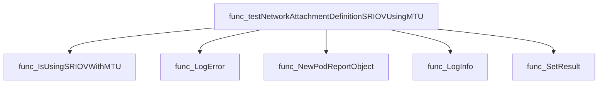

#### Functions calling `testNetworkAttachmentDefinitionSRIOVUsingMTU` (Mermaid)

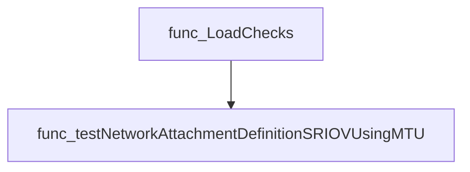

#### Usage example (Go)

```go
// Minimal example invoking testNetworkAttachmentDefinitionSRIOVUsingMTU
import (
    "github.com/redhat-best-practices-for-k8s/certsuite/pkg/checksdb"
    "github.com/redhat-best-practices-for-k8s/certsuite/tests/networking/provider"
)

func example() {
    // Assume `check` and `pods` are already obtained
    var check *checksdb.Check
    var pods []*provider.Pod

    testNetworkAttachmentDefinitionSRIOVUsingMTU(check, pods)
}
```

---

### testNetworkConnectivity

**testNetworkConnectivity** - Orchestrates ICMP connectivity tests for a given IP version and interface type. Builds the test context, executes ping checks, and records results in the supplied `Check`.


#### 1) Signature (Go)
```go
func testNetworkConnectivity(env *provider.TestEnvironment, aIPVersion netcommons.IPVersion, aType netcommons.IFType, check *checksdb.Check) 
```

#### 2) Summary Table
| Aspect | Details |
|--------|---------|
| **Purpose** | Orchestrates ICMP connectivity tests for a given IP version and interface type. Builds the test context, executes ping checks, and records results in the supplied `Check`. |
| **Parameters** | `env *provider.TestEnvironment` – environment containing pod data; <br>`aIPVersion netcommons.IPVersion` – IPv4 or IPv6; <br>`aType netcommons.IFType` – default or multus interface; <br>`check *checksdb.Check` – test check object to log and store results. |
| **Return value** | None (side‑effect on `check`). |
| **Key dependencies** | • `icmp.BuildNetTestContext` – constructs networks-to-test map.<br>• `icmp.RunNetworkingTests` – performs ping operations.<br>• Methods of `checksdb.Check`: `GetLogger`, `LogInfo`, `SetResult`. |
| **Side effects** | * Mutates the supplied `Check` by setting its result objects. <br>* Logs informational messages via the check’s logger. |
| **How it fits the package** | This helper is invoked from multiple test cases in `LoadChecks`; each case specifies IP version and interface type, enabling reuse of the same connectivity logic across different scenarios. |

#### 3) Internal workflow (Mermaid)
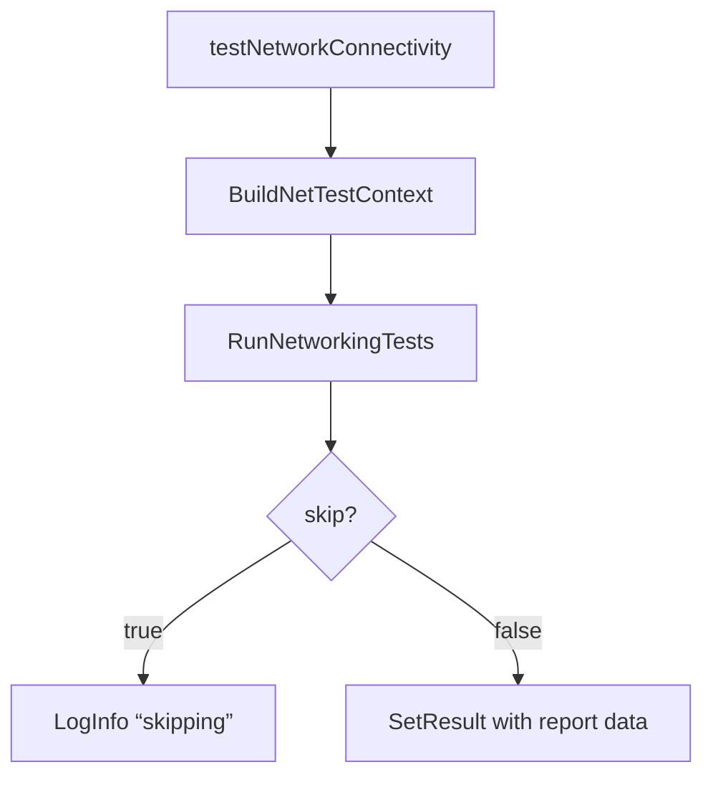

#### 4) Function dependencies (Mermaid)
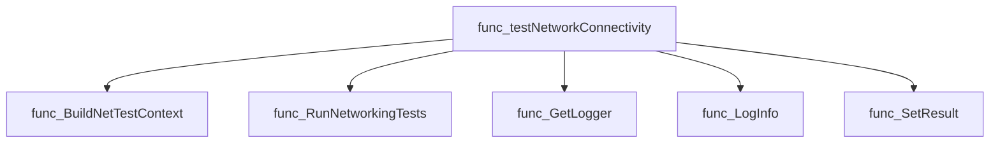

#### 5) Functions calling `testNetworkConnectivity` (Mermaid)
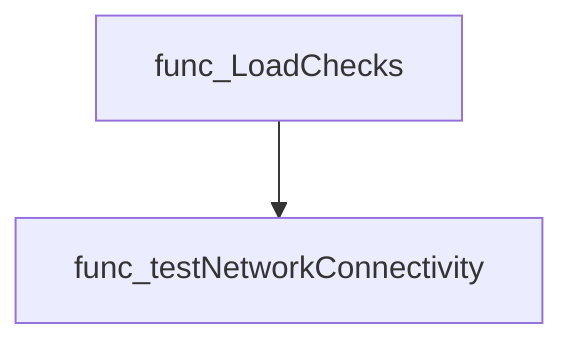

#### 6) Usage example (Go)
```go
// Minimal example invoking testNetworkConnectivity
env := &provider.TestEnvironment{ /* populate Pods, etc. */ }
check := checksdb.NewCheck("example-icmptest")
testNetworkConnectivity(env, netcommons.IPv4, netcommons.DEFAULT, check)

// The check now contains compliant and non‑compliant results.
```

---

### testNetworkPolicyDenyAll

**testNetworkPolicyDenyAll** - Ensures each pod in the environment is protected by a NetworkPolicy that denies all ingress and egress traffic. It logs compliance status and records results for reporting.


#### Signature (Go)
```go
func testNetworkPolicyDenyAll(check *checksdb.Check, env *provider.TestEnvironment)()
```

#### Summary Table
| Aspect | Details |
|--------|---------|
| **Purpose** | Ensures each pod in the environment is protected by a NetworkPolicy that denies all ingress and egress traffic. It logs compliance status and records results for reporting. |
| **Parameters** | `check *checksdb.Check` – test context used for logging and result setting.<br>`env *provider.TestEnvironment` – contains pods, network policies, and related data. |
| **Return value** | None (results are stored via `check.SetResult`). |
| **Key dependencies** | • `check.LogInfo`, `check.LogError`<br>• `policies.LabelsMatch`<br>• `policies.IsNetworkPolicyCompliant`<br>• `testhelper.NewPodReportObject`<br>• `append` (slice operation)<br>• `check.SetResult` |
| **Side effects** | Generates log entries, creates report objects for compliant/non‑compliant pods, and updates the check result. No external I/O beyond logging. |
| **How it fits the package** | Implements the *Network Policy Deny All* test case registered in `LoadChecks`. It operates on Kubernetes resources exposed by the test environment to validate security posture. |

#### Internal workflow (Mermaid)
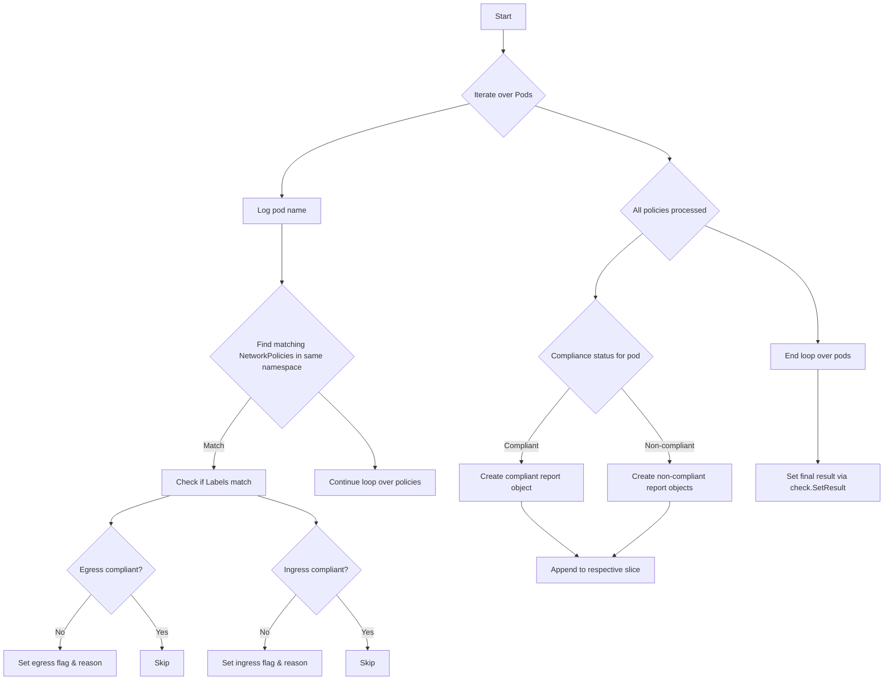

#### Function dependencies (Mermaid)
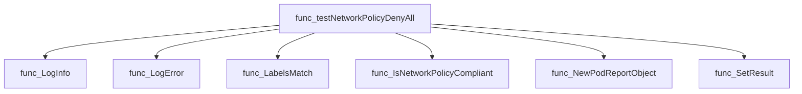

#### Functions calling `testNetworkPolicyDenyAll` (Mermaid)
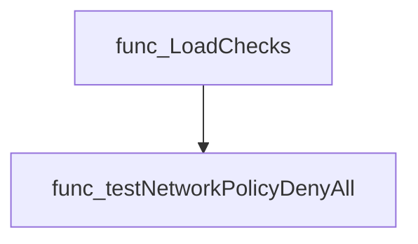

#### Usage example (Go)
```go
// Minimal example invoking testNetworkPolicyDenyAll
import (
    "github.com/redhat-best-practices-for-k8s/certsuite/tests/networking"
    "github.com/redhat-best-practices-for-k8s/certsuite/pkg/checksdb"
    "github.com/redhat-best-practices-for-k8s/certsuite/pkg/provider"
)

func main() {
    check := checksdb.NewCheck()
    env   := &provider.TestEnvironment{} // populated elsewhere
    networking.testNetworkPolicyDenyAll(check, env)
}
```

---

### testOCPReservedPortsUsage

**testOCPReservedPortsUsage** - Verifies that no pod is listening on ports reserved by OpenShift (22623, 22624).


#### Signature (Go)
```go
func testOCPReservedPortsUsage(check *checksdb.Check, env *provider.TestEnvironment)
```

#### Summary Table
| Aspect | Details |
|--------|---------|
| **Purpose** | Verifies that no pod is listening on ports reserved by OpenShift (22623, 22624). |
| **Parameters** | `check` – test metadata and result collector.<br>`env` – execution context containing cluster state. |
| **Return value** | None; results are stored via `check.SetResult`. |
| **Key dependencies** | * `netcommons.TestReservedPortsUsage` – core logic for port checking.<br>* `check.GetLogger()` – logging support.<br>* `check.SetResult` – result reporting. |
| **Side effects** | Mutates the check’s result state; performs read‑only queries on the environment. No external I/O beyond logging. |
| **How it fits the package** | Part of the networking test suite; invoked by `LoadChecks` as the OCP reserved ports test case. |

#### Internal workflow (Mermaid)
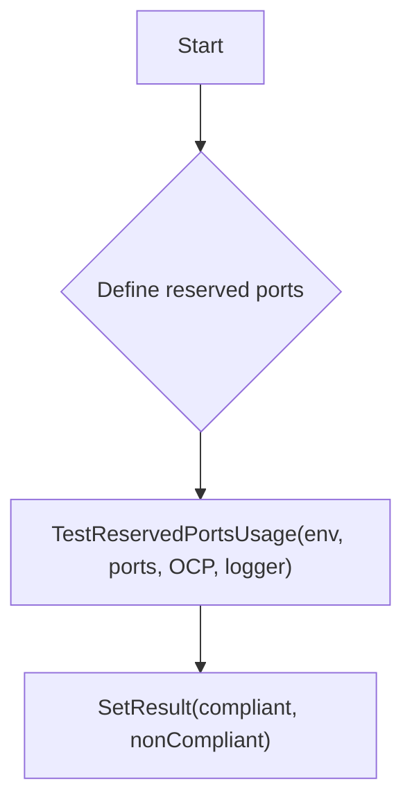

#### Function dependencies (Mermaid)
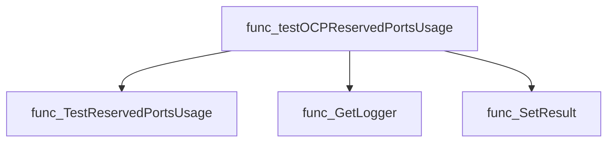

#### Functions calling `testOCPReservedPortsUsage` (Mermaid)
```mermaid
graph TD
  func_LoadChecks --> func_testOCPReservedPortsUsage
```

#### Usage example (Go)
```go
// Minimal example invoking testOCPReservedPortsUsage
func runExample(env *provider.TestEnvironment) {
    // Create a dummy check object; in real code this comes from checksdb.
    check := checksdb.NewCheck(identifiers.GetTestIDAndLabels(identifiers.TestOCPReservedPortsUsage))
    testOCPReservedPortsUsage(check, env)
}
```

---

### testPartnerSpecificTCPPorts

**testPartnerSpecificTCPPorts** - Confirms that the pods in the test environment are not listening on TCP ports reserved by a partner. The function collects all partner‑reserved ports and reports compliance.


#### 1) Signature (Go)
```go
func testPartnerSpecificTCPPorts(check *checksdb.Check, env *provider.TestEnvironment)
```

#### 2) Summary Table
| Aspect | Details |
|--------|---------|
| **Purpose** | Confirms that the pods in the test environment are not listening on TCP ports reserved by a partner. The function collects all partner‑reserved ports and reports compliance. |
| **Parameters** | `check *checksdb.Check` – current check context; <br>`env *provider.TestEnvironment` – environment containing cluster information. |
| **Return value** | None (the result is stored in the check). |
| **Key dependencies** | • `netcommons.TestReservedPortsUsage(env, ReservedPorts, "Partner", check.GetLogger())`<br>• `check.SetResult(compliantObjects, nonCompliantObjects)` |
| **Side effects** | Updates the check’s result; no external I/O or concurrency. |
| **How it fits the package** | It is a helper invoked by the *Extended partner ports* test case during suite loading to enforce partner‑specific port restrictions. |

#### 3) Internal workflow (Mermaid)
```mermaid
flowchart TD
    A["Define ReservedPorts map"] --> B["TestReservedPortsUsage"]
    B --> C["SetResult on check"]
```

#### 4) Function dependencies (Mermaid)
```mermaid
graph TD
    func_testPartnerSpecificTCPPorts --> netcommons.TestReservedPortsUsage
    func_testPartnerSpecificTCPPorts --> checksdb.Check.SetResult
```

#### 5) Functions calling `testPartnerSpecificTCPPorts` (Mermaid)
```mermaid
graph TD
    LoadChecks --> testPartnerSpecificTCPPorts
```

#### 6) Usage example (Go)
```go
// Minimal example invoking testPartnerSpecificTCPPorts
func example(env *provider.TestEnvironment, check *checksdb.Check) {
    // The function populates the check with compliance data.
    testPartnerSpecificTCPPorts(check, env)
}
```

---

### testRestartOnRebootLabelOnPodsUsingSriov

**testRestartOnRebootLabelOnPodsUsingSriov** - Ensures that every pod using SR‑IOV has the `restart-on-reboot` label set to `"true"`. Pods missing the label or with a different value are marked non‑compliant.


#### Signature (Go)

```go
func testRestartOnRebootLabelOnPodsUsingSriov(check *checksdb.Check, sriovPods []*provider.Pod)
```

#### Summary Table

| Aspect | Details |
|--------|---------|
| **Purpose** | Ensures that every pod using SR‑IOV has the `restart-on-reboot` label set to `"true"`. Pods missing the label or with a different value are marked non‑compliant. |
| **Parameters** | `check *checksdb.Check` – context for logging and result reporting.<br>`sriovPods []*provider.Pod` – list of SR‑IOV pods to evaluate. |
| **Return value** | None (the function records results via the `Check` instance). |
| **Key dependencies** | • `LogInfo`, `LogError` on the check object<br>• `GetLabels` method of `*provider.Pod`<br>• `NewPodReportObject` from `testhelper`<br>• `fmt.Sprintf` for error messages<br>• `SetResult` on the check object |
| **Side effects** | Writes logs and updates the check result; no external I/O. |
| **How it fits the package** | Implements the “Restart on reboot” test case for SR‑IOV pods within the networking test suite. |

#### Internal workflow (Mermaid)

```mermaid
flowchart TD
  A["Start"] --> B{"Iterate over sriovPods"}
  B --> C["Get pod labels"]
  C --> D{"Label exists?"}
  D -- No --> E["Log error, add non‑compliant report"]
  D -- Yes --> F{"Value == true?"}
  F -- No --> G["Log error, add non‑compliant report"]
  F -- Yes --> H["Log info, add compliant report"]
  H --> I["End loop"]
  I --> J["SetResult(compliant, nonCompliant)"]
```

#### Function dependencies (Mermaid)

```mermaid
graph TD
  func_testRestartOnRebootLabelOnPodsUsingSriov --> LogInfo
  func_testRestartOnRebootLabelOnPodsUsingSriov --> GetLabels
  func_testRestartOnRebootLabelOnPodsUsingSriov --> LogError
  func_testRestartOnRebootLabelOnPodsUsingSriov --> NewPodReportObject
  func_testRestartOnRebootLabelOnPodsUsingSriov --> Sprintf
  func_testRestartOnRebootLabelOnPodsUsingSriov --> SetResult
```

#### Functions calling `testRestartOnRebootLabelOnPodsUsingSriov` (Mermaid)

```mermaid
graph TD
  LoadChecks --> testRestartOnRebootLabelOnPodsUsingSriov
```

#### Usage example (Go)

```go
// Minimal example invoking testRestartOnRebootLabelOnPodsUsingSriov
func Example() {
    // Assume `check` and `pods` are already prepared.
    var check *checksdb.Check
    var pods []*provider.Pod

    // Run the SR‑IOV label validation.
    testRestartOnRebootLabelOnPodsUsingSriov(check, pods)
}
```

---

---

### testUndeclaredContainerPortsUsage

**testUndeclaredContainerPortsUsage** - For each pod, compares the ports actually listening inside containers with those declared in the pod’s container specifications. Flags pods that expose undeclared ports as non‑compliant.


#### Signature (Go)
```go
func testUndeclaredContainerPortsUsage(check *checksdb.Check, env *provider.TestEnvironment) 
```

#### Summary Table
| Aspect | Details |
|--------|---------|
| **Purpose** | For each pod, compares the ports actually listening inside containers with those declared in the pod’s container specifications. Flags pods that expose undeclared ports as non‑compliant. |
| **Parameters** | `check *checksdb.Check` – test framework helper for logging and result aggregation.<br>`env *provider.TestEnvironment` – runtime context containing all evaluated pods. |
| **Return value** | None; results are stored via `check.SetResult`. |
| **Key dependencies** | • `netutil.GetListeningPorts` (executes container command to list listening sockets)<br>• `testhelper.NewPodReportObject` (creates result objects)<br>• `strconv.Itoa`, `fmt.Sprintf` for formatting<br>• `log` methods (`LogInfo`, `LogError`) |
| **Side effects** | • Logs informational and error messages.<br>• Appends report objects to internal slices; no global state mutation. |
| **How it fits the package** | Implements the “Undeclared container ports usage” test case registered in `LoadChecks`. It ensures pods do not expose ports that are not explicitly declared, a key compliance requirement for Kubernetes workloads. |

#### Internal workflow (Mermaid)
```mermaid
flowchart TD
  A["testUndeclaredContainerPortsUsage"] --> B["Iterate over env.Pods"]
  B --> C["Build declaredPorts map per pod"]
  C --> D["Retrieve listening ports of first container"]
  D --> E{"Error?"}
  E -- yes --> F["Log error & mark non‑compliant"]
  E -- no --> G{"Any listening ports?"}
  G -- none --> H["Mark pod compliant (no ports)"]
  G -- some --> I["Loop over listeningPorts"]
  I --> J{"Port declared?"}
  J -- no --> K["Mark pod non‑compliant, log error"]
  J -- yes --> L["Mark pod compliant, log info"]
  I --> M["After loop: if any failures → add summary non‑compliant; else add summary compliant"]
  M --> N["SetResult with compliant & non‑compliant slices"]
```

#### Function dependencies (Mermaid)
```mermaid
graph TD
  func_testUndeclaredContainerPortsUsage --> func_GetListeningPorts
  func_testUndeclaredContainerPortsUsage --> func_NewPodReportObject
  func_testUndeclaredContainerPortsUsage --> func_LogInfo
  func_testUndeclaredContainerPortsUsage --> func_LogError
```

#### Functions calling `testUndeclaredContainerPortsUsage` (Mermaid)
```mermaid
graph TD
  func_LoadChecks --> func_testUndeclaredContainerPortsUsage
```

#### Usage example (Go)
```go
// Minimal example invoking testUndeclaredContainerPortsUsage
package main

import (
    "github.com/redhat-best-practices-for-k8s/certsuite/tests/networking/checksdb"
    "github.com/redhat-best-practices-for-k8s/certsuite/tests/networking/provider"
)

func main() {
    // Assume env is prepared with pods to test
    var env provider.TestEnvironment
    check := checksdb.NewCheck(nil) // placeholder, real init omitted

    testUndeclaredContainerPortsUsage(check, &env)
}
```

---

