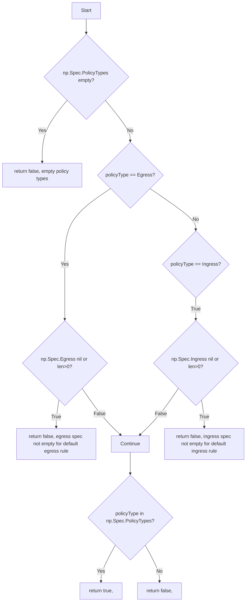
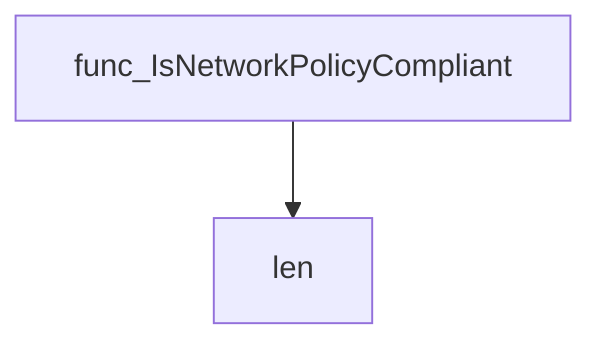
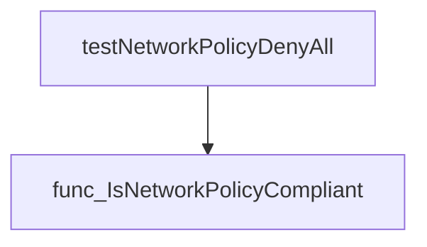
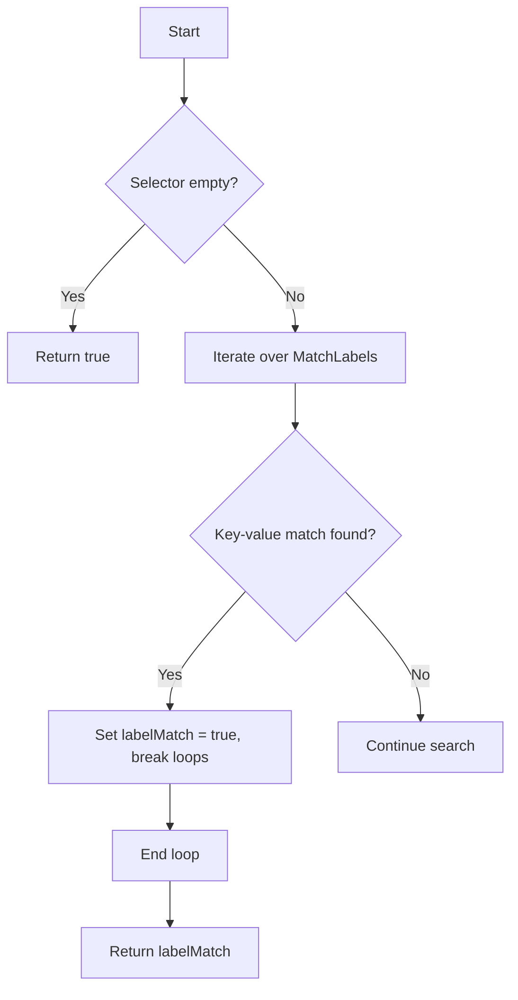
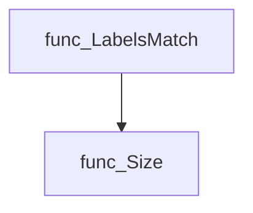
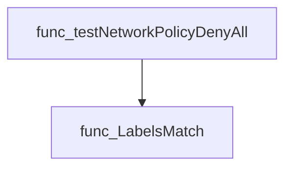

# Package policies

**Path**: `tests/networking/policies`

## Table of Contents

- [Overview](#overview)
- [Exported Functions](#exported-functions)
  - [IsNetworkPolicyCompliant](#isnetworkpolicycompliant)
  - [LabelsMatch](#labelsmatch)

## Overview

Provides helper utilities for testing Kubernetes NetworkPolicy objects, enabling verification of deny‑all compliance and label selector matching.

### Key Features

- Determines if a NetworkPolicy enforces a deny‑all rule for Ingress or Egress via IsNetworkPolicyCompliant
- Evaluates whether a pod’s labels satisfy a given LabelSelector with LabelsMatch

### Design Notes

- Relies on len checks to interpret empty selectors as matches all; assumes standard Kubernetes API types
- If the selector is non‑empty but the policy does not specify required fields, compliance may be misclassified—users should review the PolicyType passed
- Best practice: use these helpers within unit tests or integration tests where NetworkPolicy objects are constructed and validated

### Exported Functions Summary

| Name | Purpose |
|------|----------|
| [func IsNetworkPolicyCompliant(np *networkingv1.NetworkPolicy, policyType networkingv1.PolicyType) (bool, string)](#isnetworkpolicycompliant) | Determines whether a `NetworkPolicy` implements a deny‑all rule for the specified `policyType` (Ingress or Egress). |
| [func LabelsMatch(podSelectorLabels v1.LabelSelector, podLabels map[string]string) bool](#labelsmatch) | Checks if the label selector (`podSelectorLabels`) is satisfied by the supplied pod labels (`podLabels`). Returns `true` when all required key‑value pairs are present or when the selector is empty (which matches everything). |

## Exported Functions

### IsNetworkPolicyCompliant

**IsNetworkPolicyCompliant** - Determines whether a `NetworkPolicy` implements a deny‑all rule for the specified `policyType` (Ingress or Egress).


#### Signature (Go)
```go
func IsNetworkPolicyCompliant(np *networkingv1.NetworkPolicy, policyType networkingv1.PolicyType) (bool, string)
```

#### Summary Table
| Aspect | Details |
|--------|---------|
| **Purpose** | Determines whether a `NetworkPolicy` implements a deny‑all rule for the specified `policyType` (Ingress or Egress). |
| **Parameters** | *np* (`*networkingv1.NetworkPolicy`) – The policy to evaluate.<br>*policyType* (`networkingv1.PolicyType`) – The type of rule being checked. |
| **Return value** | *(bool, string)* – `true` if the policy contains a deny‑all rule for the requested type; otherwise `false`. The second return is an explanatory message when non‑compliant. |
| **Key dependencies** | *len* (builtin)<br>*networkingv1.PolicyType* and related structs from `"k8s.io/api/networking/v1"` |
| **Side effects** | None – purely functional; no state changes or I/O. |
| **How it fits the package** | Provides core logic for compliance checks used by higher‑level test functions such as `testNetworkPolicyDenyAll`. |

#### Internal workflow (Mermaid)


#### Function dependencies (Mermaid)


#### Functions calling `IsNetworkPolicyCompliant` (Mermaid)


#### Usage example (Go)
```go
// Minimal example invoking IsNetworkPolicyCompliant
import (
    "k8s.io/api/networking/v1"
)

func main() {
    // Example network policy with deny‑all egress
    np := &v1.NetworkPolicy{
        Spec: v1.NetworkPolicySpec{
            PolicyTypes: []v1.PolicyType{v1.PolicyTypeEgress},
            Egress:      []v1.NetworkPolicyEgressRule{},
        },
    }

    compliant, reason := IsNetworkPolicyCompliant(np, v1.PolicyTypeEgress)
    if compliant {
        fmt.Println("Policy is compliant")
    } else {
        fmt.Printf("Not compliant: %s\n", reason)
    }
}
```

---

### LabelsMatch

**LabelsMatch** - Checks if the label selector (`podSelectorLabels`) is satisfied by the supplied pod labels (`podLabels`). Returns `true` when all required key‑value pairs are present or when the selector is empty (which matches everything).


#### Signature
```go
func LabelsMatch(podSelectorLabels v1.LabelSelector, podLabels map[string]string) bool
```

#### Summary Table
| Aspect | Details |
|--------|---------|
| **Purpose** | Checks if the label selector (`podSelectorLabels`) is satisfied by the supplied pod labels (`podLabels`). Returns `true` when all required key‑value pairs are present or when the selector is empty (which matches everything). |
| **Parameters** | * `podSelectorLabels v1.LabelSelector` – The selector to evaluate. <br>* `podLabels map[string]string` – Labels of the pod being tested. |
| **Return value** | `bool` – `true` if the selector matches the pod labels, otherwise `false`. |
| **Key dependencies** | • Calls `Size()` on `v1.LabelSelector` to determine if it is empty.<br>• Uses standard map iteration and string comparison. |
| **Side effects** | None; purely functional. |
| **How it fits the package** | Used by network‑policy compliance checks (e.g., `testNetworkPolicyDenyAll`) to verify that a policy’s pod selector applies to a given pod. |

#### Internal workflow


#### Function dependencies


#### Functions calling `LabelsMatch`


#### Usage example (Go)
```go
// Minimal example invoking LabelsMatch
import (
    "fmt"
    v1 "k8s.io/apimachinery/pkg/apis/meta/v1"
)

func main() {
    selector := v1.LabelSelector{
        MatchLabels: map[string]string{"app": "frontend"},
    }
    podLabels := map[string]string{"app": "frontend", "env": "prod"}

    if LabelsMatch(selector, podLabels) {
        fmt.Println("Pod matches the selector")
    } else {
        fmt.Println("Pod does not match the selector")
    }
}
```

---

