# Package services

**Path**: `tests/networking/services`

## Table of Contents

- [Overview](#overview)
- [Exported Functions](#exported-functions)
  - [GetServiceIPVersion](#getserviceipversion)
  - [ToString](#tostring)
  - [ToStringSlice](#tostringslice)
- [Local Functions](#local-functions)
  - [isClusterIPsDualStack](#isclusteripsdualstack)

## Overview

Failed to parse JSON response, but content appears to contain package information.

### Exported Functions Summary

| Name | Purpose |
|------|----------|
| [func GetServiceIPVersion(aService *corev1.Service) (result netcommons.IPVersion, err error)](#getserviceipversion) | Inspects a `*corev1.Service` to decide whether it is single‑stack IPv4, single‑stack IPv6, or dual‑stack. Returns the corresponding `netcommons.IPVersion`. |
| [func ToString(aService *corev1.Service) (out string)](#tostring) | Produces a concise textual representation of a `corev1.Service` instance, summarizing its namespace, name, cluster IPs, and all cluster IP addresses. |
| [func ToStringSlice(manyServices []*corev1.Service) (out string)](#tostringslice) | Builds a human‑readable multiline string that lists each service’s namespace, name, ClusterIP, and all ClusterIPs. |

### Local Functions Summary

| Name | Purpose |
|------|----------|
| [func isClusterIPsDualStack(ips []string) (result bool, err error)](#isclusteripsdualstack) | Checks whether the supplied slice of IP address strings includes at least one IPv4 and one IPv6 address, indicating a dual‑stack configuration. |

## Exported Functions

### GetServiceIPVersion

**GetServiceIPVersion** - Inspects a `*corev1.Service` to decide whether it is single‑stack IPv4, single‑stack IPv6, or dual‑stack. Returns the corresponding `netcommons.IPVersion`.

#### Signature (Go)

```go
func GetServiceIPVersion(aService *corev1.Service) (result netcommons.IPVersion, err error)
```

#### Summary Table

| Aspect | Details |
|--------|---------|
| **Purpose** | Inspects a `*corev1.Service` to decide whether it is single‑stack IPv4, single‑stack IPv6, or dual‑stack. Returns the corresponding `netcommons.IPVersion`. |
| **Parameters** | `aService *corev1.Service` – Service object whose IP policy and cluster IPs are evaluated. |
| **Return value** | `result netcommons.IPVersion` – one of `IPv4`, `IPv6`, `IPv4v6`, or `Undefined` if unsupported.<br>`err error` – descriptive error on validation failure. |
| **Key dependencies** | • `netcommons.GetIPVersion`<br>• `fmt.Errorf`<br>• `ToString(aService)` helper<br>• `log.Debug` from internal logger<br>• `isClusterIPsDualStack` helper |
| **Side effects** | Logs debug messages; otherwise pure function. |
| **How it fits the package** | Provides core logic for IP‑family compliance checks used by higher‑level tests such as `testDualStackServices`. |

#### Internal workflow (Mermaid)

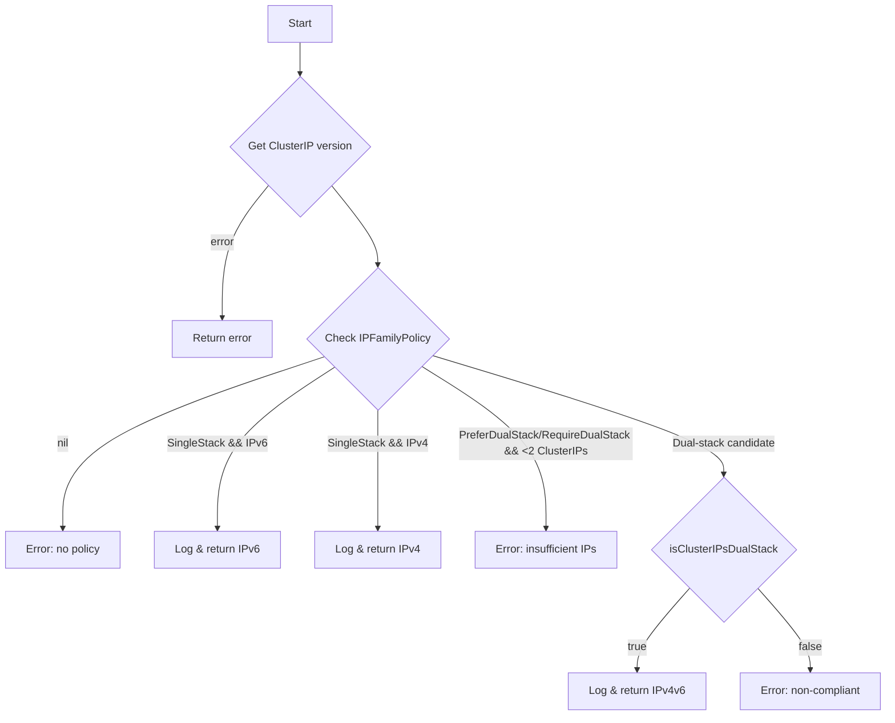

#### Function dependencies (Mermaid)

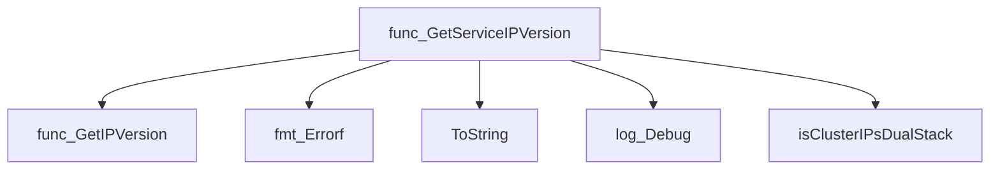

#### Functions calling `GetServiceIPVersion` (Mermaid)

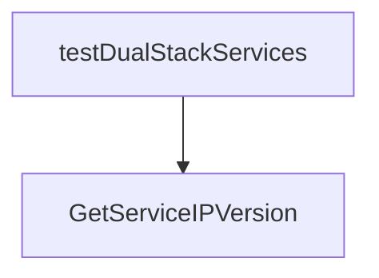

#### Usage example (Go)

```go
// Minimal example invoking GetServiceIPVersion
import (
    "github.com/redhat-best-practices-for-k8s/certsuite/tests/networking/services"
    corev1 "k8s.io/api/core/v1"
)

func main() {
    svc := &corev1.Service{
        Spec: corev1.ServiceSpec{
            ClusterIP:      "10.0.0.1",
            IPFamilyPolicy: ptrTo(corev1.IPFamilyPolicySingleStack),
        },
    }
    ipVer, err := services.GetServiceIPVersion(svc)
    if err != nil {
        log.Fatalf("Failed to determine IP version: %v", err)
    }
    fmt.Printf("Service supports %s\n", ipVer.String())
}
```

---

### ToString

**ToString** - Produces a concise textual representation of a `corev1.Service` instance, summarizing its namespace, name, cluster IPs, and all cluster IP addresses.

#### Signature (Go)

```go
func ToString(aService *corev1.Service) (out string)
```

#### Summary Table

| Aspect | Details |
|--------|---------|
| **Purpose** | Produces a concise textual representation of a `corev1.Service` instance, summarizing its namespace, name, cluster IPs, and all cluster IP addresses. |
| **Parameters** | `aService *corev1.Service` – the Service to describe. |
| **Return value** | `string` – formatted description of the Service. |
| **Key dependencies** | • `fmt.Sprintf` from the standard library. |
| **Side effects** | None; purely functional. |
| **How it fits the package** | Used throughout the networking test suite to log or report service details in a consistent format, especially when constructing error messages or debugging output. |

#### Internal workflow (Mermaid)

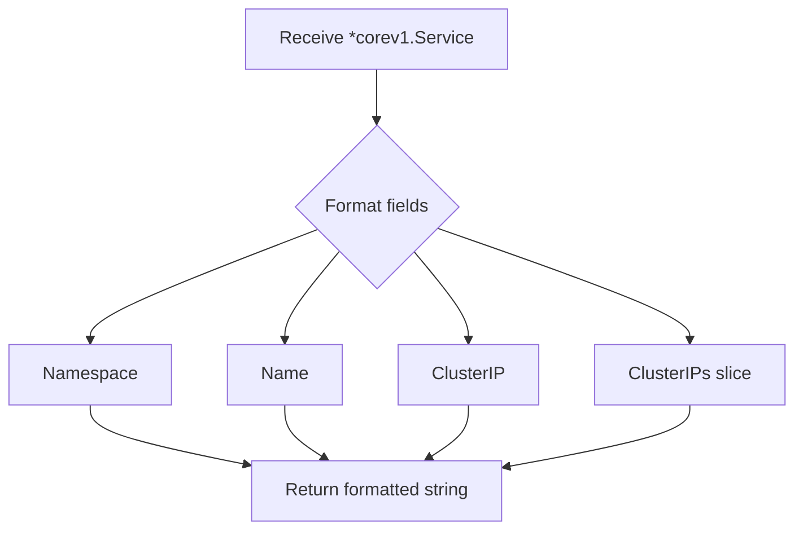

#### Function dependencies (Mermaid)

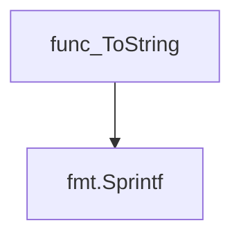

#### Functions calling `ToString` (Mermaid)

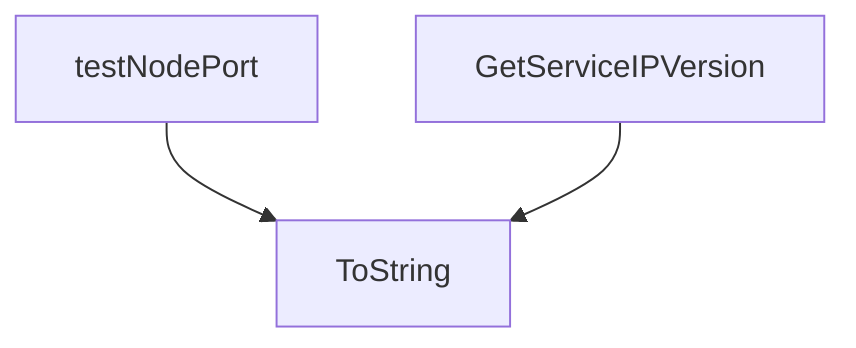

#### Usage example (Go)

```go
// Minimal example invoking ToString
import (
    corev1 "k8s.io/api/core/v1"
)

// Assume svc is a *corev1.Service that has been populated elsewhere.
svc := &corev1.Service{
    ObjectMeta: metav1.ObjectMeta{
        Namespace: "default",
        Name:      "example-service",
    },
    Spec: corev1.ServiceSpec{
        ClusterIP:  "10.0.0.1",
        ClusterIPs: []string{"10.0.0.1", "fd00::1"},
    },
}

description := ToString(svc)
fmt.Println(description)
// Output: Service ns: default, name: example-service ClusterIP:10.0.0.1 ClusterIPs: [10.0.0.1 fd00::1]
```

---

---

### ToStringSlice

**ToStringSlice** - Builds a human‑readable multiline string that lists each service’s namespace, name, ClusterIP, and all ClusterIPs.

Convert a slice of Kubernetes Service objects into a formatted string representation.

#### Signature (Go)

```go
func ToStringSlice(manyServices []*corev1.Service) (out string)
```

#### Summary Table

| Aspect | Details |
|--------|---------|
| **Purpose** | Builds a human‑readable multiline string that lists each service’s namespace, name, ClusterIP, and all ClusterIPs. |
| **Parameters** | `manyServices []*corev1.Service` – slice of Service pointers to process. |
| **Return value** | `out string` – concatenated representation of all services. |
| **Key dependencies** | • `fmt.Sprintf` from the standard library. |
| **Side effects** | None; purely functional—no state mutation or I/O. |
| **How it fits the package** | Utility helper used in tests to display service details for debugging and reporting purposes within the `services` testing package. |

#### Internal workflow (Mermaid)

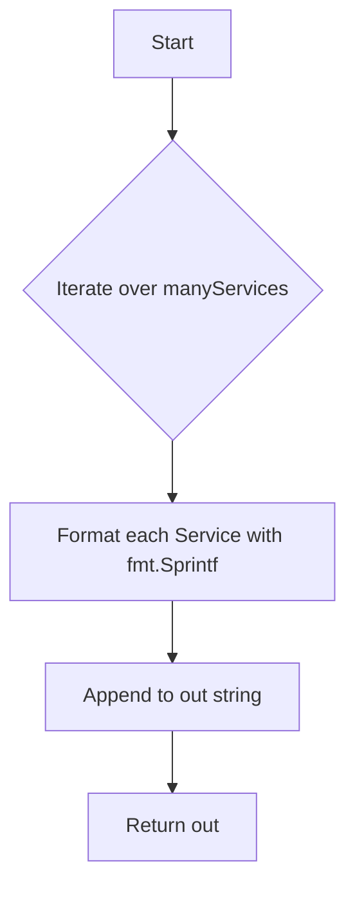

#### Function dependencies (Mermaid)

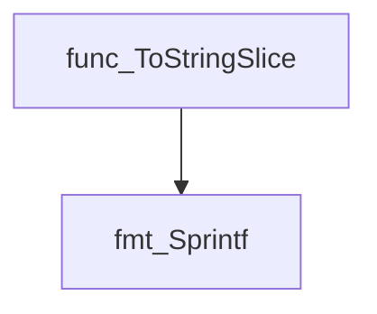

#### Functions calling `ToStringSlice` (Mermaid)

None – this function is currently not referenced elsewhere in the package.

#### Usage example (Go)

```go
// Minimal example invoking ToStringSlice
import (
    "github.com/redhat-best-practices-for-k8s/certsuite/tests/networking/services"
    corev1 "k8s.io/api/core/v1"
)

func main() {
    svc := &corev1.Service{
        ObjectMeta: metav1.ObjectMeta{Namespace: "default", Name: "example"},
        Spec:       corev1.ServiceSpec{ClusterIP: "10.0.0.1", ClusterIPs: []string{"10.0.0.1"}},
    }
    output := services.ToStringSlice([]*corev1.Service{svc})
    fmt.Println(output)
}
```

---

## Local Functions

### isClusterIPsDualStack

**isClusterIPsDualStack** - Checks whether the supplied slice of IP address strings includes at least one IPv4 and one IPv6 address, indicating a dual‑stack configuration.

#### Signature (Go)

```go
func isClusterIPsDualStack(ips []string) (result bool, err error)
```

#### Summary Table

| Aspect | Details |
|--------|---------|
| **Purpose** | Checks whether the supplied slice of IP address strings includes at least one IPv4 and one IPv6 address, indicating a dual‑stack configuration. |
| **Parameters** | `ips []string` – list of ClusterIP addresses to evaluate. |
| **Return value** | `<result bool>` – `true` if both IPv4 and IPv6 are present; otherwise `false`.  `<err error>` – non‑nil when an IP cannot be parsed or its version cannot be determined. |
| **Key dependencies** | • `netcommons.GetIPVersion(aIP string) (IPVersion, error)` – to classify each IP.<br>• `fmt.Errorf` – for error wrapping. |
| **Side effects** | None; pure function with no state mutation or I/O beyond error creation. |
| **How it fits the package** | Used by service‑level utilities (`GetServiceIPVersion`) to validate that a Service’s `ClusterIPs` slice satisfies dual‑stack requirements. |

#### Internal workflow (Mermaid)

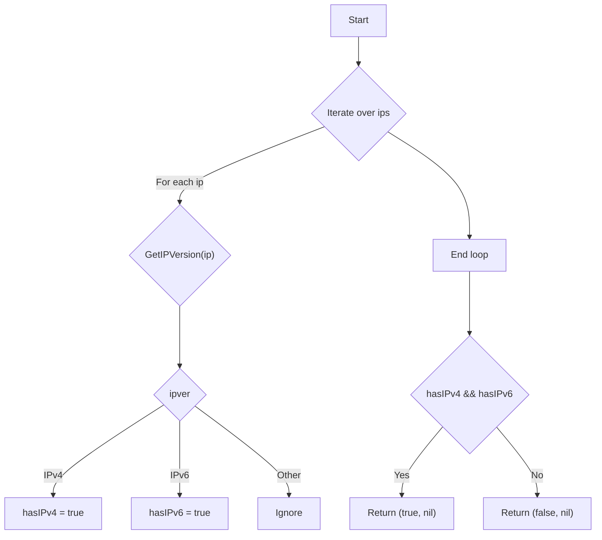

#### Function dependencies (Mermaid)

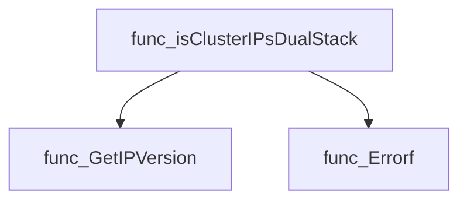

#### Functions calling `isClusterIPsDualStack` (Mermaid)

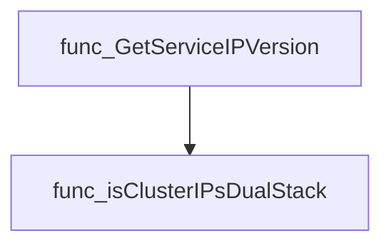

#### Usage example (Go)

```go
// Minimal example invoking isClusterIPsDualStack
package main

import (
 "fmt"
)

func main() {
 ips := []string{"10.0.0.1", "fd00::1"}
 ok, err := isClusterIPsDualStack(ips)
 if err != nil {
  fmt.Printf("error: %v\n", err)
  return
 }
 if ok {
  fmt.Println("The ClusterIP list is dual‑stack.")
 } else {
  fmt.Println("Not a dual‑stack configuration.")
 }
}
```

---
