# Package observability

**Path**: `tests/observability`

## Table of Contents

- [Overview](#overview)
- [Exported Functions](#exported-functions)
  - [LoadChecks](#loadchecks)
- [Local Functions](#local-functions)
  - [buildServiceAccountToDeprecatedAPIMap](#buildserviceaccounttodeprecatedapimap)
  - [containerHasLoggingOutput](#containerhasloggingoutput)
  - [evaluateAPICompliance](#evaluateapicompliance)
  - [extractUniqueServiceAccountNames](#extractuniqueserviceaccountnames)
  - [testAPICompatibilityWithNextOCPRelease](#testapicompatibilitywithnextocprelease)
  - [testContainersLogging](#testcontainerslogging)
  - [testCrds](#testcrds)
  - [testPodDisruptionBudgets](#testpoddisruptionbudgets)
  - [testTerminationMessagePolicy](#testterminationmessagepolicy)

## Overview

The observability package supplies a collection of checks that validate runtime behavior and configuration of workloads in a Kubernetes or OpenShift cluster. It registers these checks with the internal checks database, providing per‑test setup, skip logic, and execution functions.

### Key Features

- Populates the checks database with tests for container logging, CRD schema compliance, PodDisruptionBudget validity, termination message policy, and API deprecation safety.
- Implements environment‑aware skip conditions (e.g., no containers or CRDs under test).
- Reports detailed compliance results via structured report objects.

### Design Notes

- Checks are registered at package init time through LoadChecks, enabling automatic discovery when the suite starts.
- Each check follows a consistent signature: func(*checksdb.Check,*provider.TestEnvironment)() and records results directly on the Check object.
- Deprecated API detection uses the OpenShift apiserver v1 data to map service accounts to removed APIs, ensuring only relevant APIs are considered.

### Exported Functions Summary

| Name | Purpose |
|------|----------|
| [func LoadChecks()](#loadchecks) | Populates the internal checks database with all observability‑related tests, attaching per‑test setup/skip logic and execution functions. |

### Local Functions Summary

| Name | Purpose |
|------|----------|
| [func buildServiceAccountToDeprecatedAPIMap([]apiserv1.APIRequestCount, map[string]struct{}) map[string]map[string]string](#buildserviceaccounttodeprecatedapimap) | Creates a nested map where each key is a workload service‑account name and the corresponding value maps API names to their Kubernetes release version in which they will be removed. Only APIs with a non‑empty `status.removedInRelease` field are considered, ensuring that only genuinely deprecated APIs are tracked. |
| [func containerHasLoggingOutput(cut *provider.Container) (bool, error)](#containerhasloggingoutput) | Determines if a container has emitted any stdout/stderr log line by fetching the tail of its pod logs. |
| [func evaluateAPICompliance(     serviceAccountToDeprecatedAPIs map[string]map[string]string,     kubernetesVersion string,     workloadServiceAccountNames map[string]struct{}, ) (compliantObjects, nonCompliantObjects []*testhelper.ReportObject)](#evaluateapicompliance) | Determines whether each service account’s usage of deprecated APIs will remain valid in the next minor Kubernetes release. |
| [func extractUniqueServiceAccountNames(env *provider.TestEnvironment) map[string]struct{}](#extractuniqueserviceaccountnames) | Collects and returns a set of distinct workload‑related service account names found in the supplied test environment. |
| [func testAPICompatibilityWithNextOCPRelease(check *checksdb.Check, env *provider.TestEnvironment) {}](#testapicompatibilitywithnextocprelease) | Determines whether the workload’s service accounts use any APIs that will be removed in the next OpenShift Container Platform (OCP) release and records compliance results. |
| [func testContainersLogging(check *checksdb.Check, env *provider.TestEnvironment)](#testcontainerslogging) | Iterates over all containers under test (CUTs) in the provided environment, verifies that each emits at least one line to its stdout/stderr stream, and records compliance status. |
| [func testCrds(check *checksdb.Check, env *provider.TestEnvironment) {}](#testcrds) | Verifies that each CRD version defines a `status` property in its OpenAPI schema, reporting compliance or non‑compliance. |
| [func testPodDisruptionBudgets(check *checksdb.Check, env *provider.TestEnvironment)](#testpoddisruptionbudgets) | Ensures each Deployment or StatefulSet in the test environment has an associated PodDisruptionBudget (PDB) that satisfies validation rules. Reports compliant and non‑compliant objects. |
| [func testTerminationMessagePolicy(check *checksdb.Check, env *provider.TestEnvironment)](#testterminationmessagepolicy) | Ensures each container in the test environment uses `FallbackToLogsOnError` as its termination message policy. |

## Exported Functions

### LoadChecks

**LoadChecks** - Populates the internal checks database with all observability‑related tests, attaching per‑test setup/skip logic and execution functions.


#### Signature (Go)
```go
func LoadChecks()
```

#### Summary Table
| Aspect | Details |
|--------|---------|
| **Purpose** | Populates the internal checks database with all observability‑related tests, attaching per‑test setup/skip logic and execution functions. |
| **Parameters** | None |
| **Return value** | None (side‑effect only) |
| **Key dependencies** | • `log.Debug` – logs loading action<br>• `checksdb.NewChecksGroup`, `Add`, `WithBeforeEachFn`, `WithCheckFn`, `WithSkipCheckFn`, `WithSkipModeAll` – builder pattern for test metadata<br>• `identifiers.GetTestIDAndLabels` – derives ID and tags from a predefined identifier constant<br>• `testhelper.GetNo…SkipFn` – provides skip predicates based on the current test environment<br>• `testContainersLogging`, `testCrds`, `testTerminationMessagePolicy`, `testPodDisruptionBudgets`, `testAPICompatibilityWithNextOCPRelease` – actual check implementations |
| **Side effects** | • Emits a debug log.<br>• Creates/updates a checks group named by `common.ObservabilityTestKey`. <br>• Registers five checks, each with its own skip conditions and execution closure that operates on the shared test environment (`env`). |
| **How it fits the package** | This function is called from `pkg/certsuite.LoadInternalChecksDB`, ensuring that all observability tests are available before a test run begins. |

#### Internal workflow
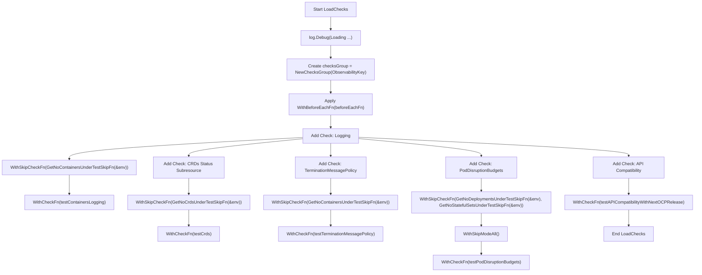

#### Function dependencies
```mermaid
graph TD
  func_LoadChecks --> func_log.Debug
  func_LoadChecks --> func_checksdb.NewChecksGroup
  func_LoadChecks --> func_Identifers.GetTestIDAndLabels
  func_LoadChecks --> func_testhelper.GetNoContainersUnderTestSkipFn
  func_LoadChecks --> func_testhelper.GetNoCrdsUnderTestSkipFn
  func_LoadChecks --> func_testhelper.GetNoDeploymentsUnderTestSkipFn
  func_LoadChecks --> func_testhelper.GetNoStatefulSetsUnderTestSkipFn
  func_LoadChecks --> func_testContainersLogging
  func_LoadChecks --> func_testCrds
  func_LoadChecks --> func_testTerminationMessagePolicy
  func_LoadChecks --> func_testPodDisruptionBudgets
  func_LoadChecks --> func_testAPICompatibilityWithNextOCPRelease
```

#### Functions calling `LoadChecks`
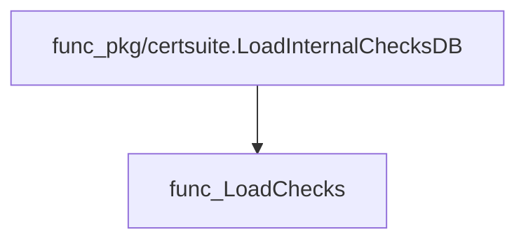

#### Usage example (Go)
```go
// During package initialization or before a test run:
func init() {
    // Register all observability checks once the environment is ready.
    LoadChecks()
}
```

---

## Local Functions

### buildServiceAccountToDeprecatedAPIMap

**buildServiceAccountToDeprecatedAPIMap** - Creates a nested map where each key is a workload service‑account name and the corresponding value maps API names to their Kubernetes release version in which they will be removed. Only APIs with a non‑empty `status.removedInRelease` field are considered, ensuring that only genuinely deprecated APIs are tracked.


#### Signature (Go)
```go
func buildServiceAccountToDeprecatedAPIMap([]apiserv1.APIRequestCount, map[string]struct{}) map[string]map[string]string
```

#### Summary Table
| Aspect | Details |
|--------|---------|
| **Purpose** | Creates a nested map where each key is a workload service‑account name and the corresponding value maps API names to their Kubernetes release version in which they will be removed. Only APIs with a non‑empty `status.removedInRelease` field are considered, ensuring that only genuinely deprecated APIs are tracked. |
| **Parameters** | `apiRequestCounts []apiserv1.APIRequestCount` – collection of API usage metrics.<br>`workloadServiceAccountNames map[string]struct{}` – set of service‑account names relevant to the current workload (extracted from environment). |
| **Return value** | `map[string]map[string]string` – outer key is a service‑account name; inner key/value pair is API name → removal release version. |
| **Key dependencies** | • `strings.Split`<br>• `make` for initializing maps<br>• Iteration over nested structs in `apiRequestCounts` (`Status.Last24h`, `ByNode.ByUser`) |
| **Side effects** | No global state mutation; purely functional. The only I/O is reading the passed slice and map. |
| **How it fits the package** | Used by the API‑compatibility test to determine which APIs a workload’s service accounts are calling that will be removed in future Kubernetes releases, enabling compliance checks against the target OCP/K8s version. |

#### Internal workflow (Mermaid)
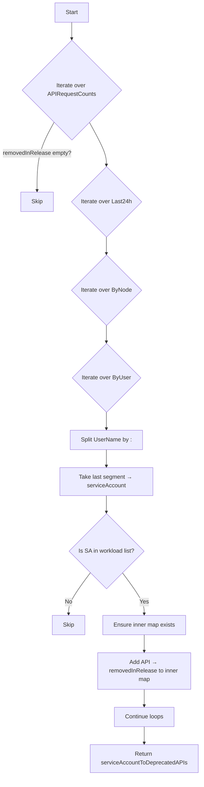

#### Function dependencies (Mermaid)
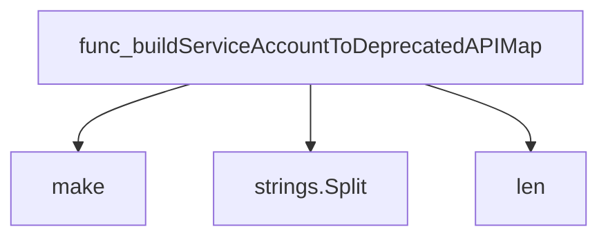

#### Functions calling `buildServiceAccountToDeprecatedAPIMap` (Mermaid)
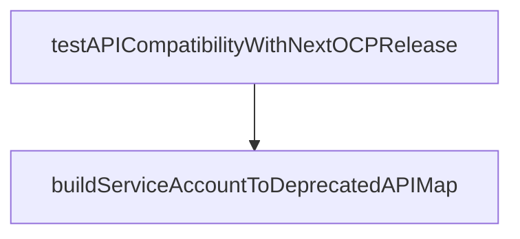

#### Usage example (Go)
```go
// Minimal example invoking buildServiceAccountToDeprecatedAPIMap
import (
    "github.com/redhat-best-practices-for-k8s/certsuite/tests/observability"
    apiserv1 "github.com/kubernetes-sigs/api-server-metrics/pkg/apis/apiserver/v1"
)

func example() {
    // Assume apiRequestCounts and workloadServiceAccountNames are already populated
    var apiRequestCounts []apiserv1.APIRequestCount
    workloadServiceAccountNames := map[string]struct{}{
        "eventtest-operator-service-account": {},
        "other-sa": {},
    }

    deprecatedMap := observability.BuildServiceAccountToDeprecatedAPIMap(
        apiRequestCounts,
        workloadServiceAccountNames,
    )

    // deprecatedMap now contains, for each SA, the APIs that will be removed
}
```

---

### containerHasLoggingOutput

**containerHasLoggingOutput** - Determines if a container has emitted any stdout/stderr log line by fetching the tail of its pod logs.

Checks whether a Kubernetes container has produced any log output by retrieving the last few lines of its logs.

---

#### Signature (Go)

```go
func containerHasLoggingOutput(cut *provider.Container) (bool, error)
```

---

#### Summary Table

| Aspect | Details |
|--------|---------|
| **Purpose** | Determines if a container has emitted any stdout/stderr log line by fetching the tail of its pod logs. |
| **Parameters** | `cut *provider.Container` – the container whose logs are examined. |
| **Return value** | `(bool, error)` – `true` if at least one log line exists; `false` otherwise. An error is returned if any step in retrieving or reading the logs fails. |
| **Key dependencies** | • `clientsholder.GetClientsHolder()` <br>• Kubernetes client `CoreV1().Pods(...).GetLogs(...)`<br>• `context.TODO()`<br>• `io.Copy` to read stream<br>• `bytes.Buffer` to accumulate output |
| **Side effects** | No state mutation; only performs I/O against the Kubernetes API and reads from a network stream. |
| **How it fits the package** | Utility used by observability tests (e.g., `testContainersLogging`) to verify that containers emit log lines, forming part of compliance checks. |

---

#### Internal workflow

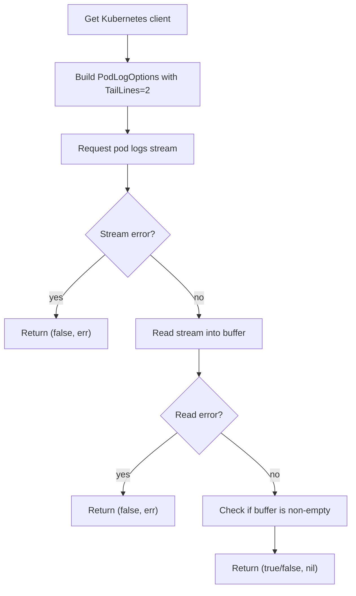

---

#### Function dependencies

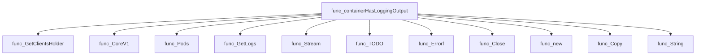

---

#### Functions calling `containerHasLoggingOutput`

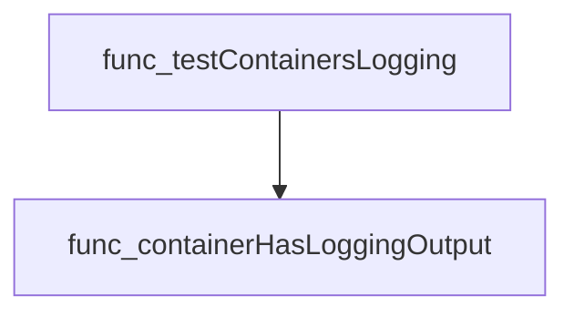

---

#### Usage example (Go)

```go
// Minimal example invoking containerHasLoggingOutput
import (
    "github.com/redhat-best-practices-for-k8s/certsuite/tests/observability"
    "github.com/redhat-best-practices-for-k8s/certsuite/internal/provider"
)

func main() {
    // Assume cut is a populated provider.Container instance.
    var cut *provider.Container
    hasLogs, err := observability.containerHasLoggingOutput(cut)
    if err != nil {
        log.Fatalf("Error checking logs: %v", err)
    }
    fmt.Printf("Container has logging output? %t\n", hasLogs)
}
```

---

### evaluateAPICompliance

**evaluateAPICompliance** - Determines whether each service account’s usage of deprecated APIs will remain valid in the next minor Kubernetes release.


#### Signature (Go)
```go
func evaluateAPICompliance(
    serviceAccountToDeprecatedAPIs map[string]map[string]string,
    kubernetesVersion string,
    workloadServiceAccountNames map[string]struct{},
) (compliantObjects, nonCompliantObjects []*testhelper.ReportObject)
```

#### Summary Table
| Aspect | Details |
|--------|---------|
| **Purpose** | Determines whether each service account’s usage of deprecated APIs will remain valid in the next minor Kubernetes release. |
| **Parameters** | `serviceAccountToDeprecatedAPIs` – map from SA name to API → removal‑release string.<br>`kubernetesVersion` – current cluster version (e.g., `"4.12.0"`).<br>`workloadServiceAccountNames` – set of service accounts belonging to the workload under test. |
| **Return value** | Two slices of `*testhelper.ReportObject`: compliant and non‑compliant findings, each containing descriptive fields. |
| **Key dependencies** | • `github.com/Masterminds/semver` for parsing and incrementing versions.<br>• `fmt` for formatted messages.<br>• `github.com/redhat-best-practices-for-k8s/certsuite/pkg/testhelper.NewReportObject`. |
| **Side effects** | No global state changes; only I/O via `fmt.Printf` on error. Generates new report objects. |
| **How it fits the package** | Used by the OpenShift API‑compatibility test to surface which APIs will be removed in the next release and whether the workload remains functional. |

#### Internal workflow (Mermaid)
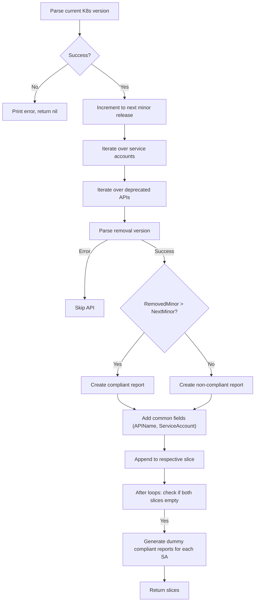

#### Function dependencies
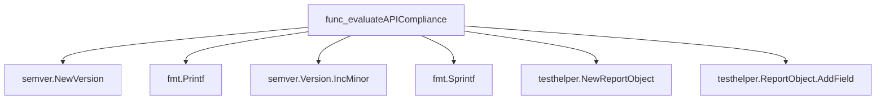

#### Functions calling `evaluateAPICompliance`
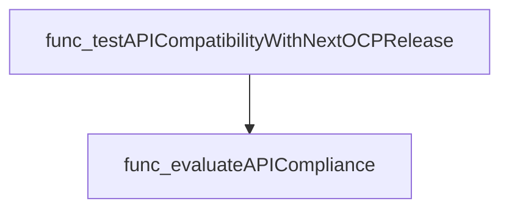

#### Usage example (Go)
```go
// Minimal example invoking evaluateAPICompliance
import (
    "github.com/redhat-best-practices-for-k8s/certsuite/pkg/testhelper"
)

func main() {
    deprecated := map[string]map[string]string{
        "serviceA": {"deployment.kubernetes.io/revision": "4.13.0"},
        "serviceB": {"apps/v1beta2/Deployment": "4.12.0"},
    }
    saSet := map[string]struct{}{
        "serviceA": {},
        "serviceB": {},
    }

    compliant, nonCompliant := evaluateAPICompliance(deprecated, "4.12.0", saSet)

    // Process results
    for _, r := range compliant {
        fmt.Println("COMPLIANT:", r.ObjectType, r.Fields)
    }
    for _, r := range nonCompliant {
        fmt.Println("NON‑COMPLIANT:", r.ObjectType, r.Fields)
    }
}
```

---

### extractUniqueServiceAccountNames

**extractUniqueServiceAccountNames** - Collects and returns a set of distinct workload‑related service account names found in the supplied test environment.


#### Signature (Go)
```go
func extractUniqueServiceAccountNames(env *provider.TestEnvironment) map[string]struct{}
```

#### Summary Table
| Aspect | Details |
|--------|---------|
| **Purpose** | Collects and returns a set of distinct workload‑related service account names found in the supplied test environment. |
| **Parameters** | `env *provider.TestEnvironment` – The test environment containing a slice of service accounts. |
| **Return value** | `map[string]struct{}` – A map where keys are unique service account names; values are empty structs to save memory. |
| **Key dependencies** | • `make` (to create the map) |
| **Side effects** | None – purely functional; no state mutation or I/O. |
| **How it fits the package** | Used by API‑compatibility tests to identify which service accounts should be evaluated against deprecated APIs. |

#### Internal workflow (Mermaid)
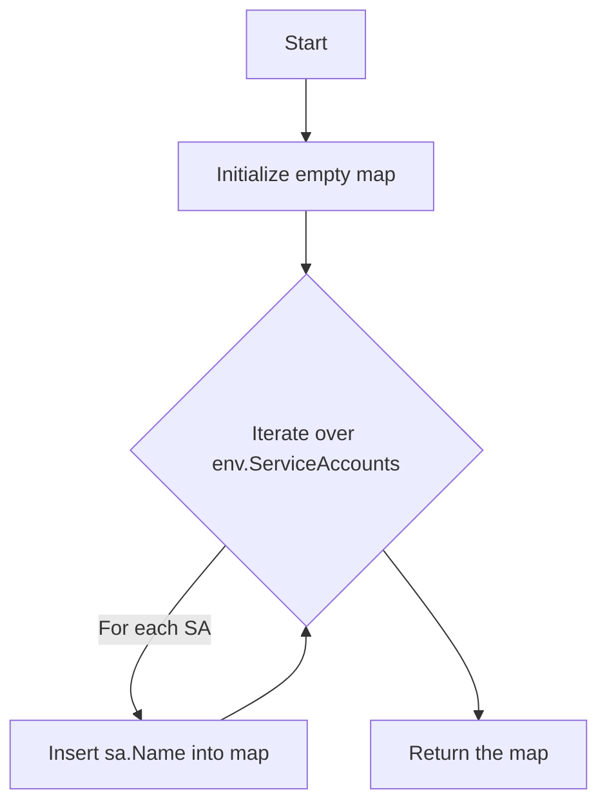

#### Function dependencies (Mermaid)
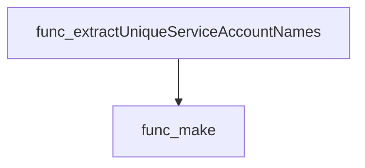

#### Functions calling `extractUniqueServiceAccountNames` (Mermaid)
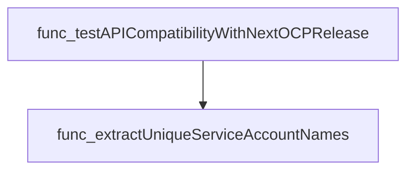

#### Usage example (Go)
```go
// Minimal example invoking extractUniqueServiceAccountNames
env := &provider.TestEnvironment{
    ServiceAccounts: []struct{ Name string }{
        {Name: "sa-frontend"},
        {Name: "sa-backend"},
        {Name: "sa-frontend"}, // duplicate, will be deduped
    },
}
uniqueSAs := extractUniqueServiceAccountNames(env)
fmt.Printf("Found %d unique service accounts\n", len(uniqueSAs))
```

---

### testAPICompatibilityWithNextOCPRelease

**testAPICompatibilityWithNextOCPRelease** - Determines whether the workload’s service accounts use any APIs that will be removed in the next OpenShift Container Platform (OCP) release and records compliance results.


#### 1) Signature (Go)
```go
func testAPICompatibilityWithNextOCPRelease(check *checksdb.Check, env *provider.TestEnvironment) {}
```

#### 2) Summary Table
| Aspect | Details |
|--------|---------|
| **Purpose** | Determines whether the workload’s service accounts use any APIs that will be removed in the next OpenShift Container Platform (OCP) release and records compliance results. |
| **Parameters** | `check *checksdb.Check` – the test check instance; `<env> *provider.TestEnvironment` – runtime environment containing cluster info, service accounts, and Kubernetes version. |
| **Return value** | None – results are stored via `check.SetResult`. |
| **Key dependencies** | • `provider.IsOCPCluster()`<br>• `clientsholder.GetClientsHolder()`<br>• `oc.ApiserverClient.ApiserverV1().APIRequestCounts().List(...)`<br>• `extractUniqueServiceAccountNames(env)`<br>• `buildServiceAccountToDeprecatedAPIMap(apiRequestCounts.Items, workloadServiceAccountNames)`<br>• `evaluateAPICompliance(serviceAccountToDeprecatedAPIs, env.K8sVersion, workloadServiceAccountNames)`<br>• `check.SetResult(compliantObjects, nonCompliantObjects)` |
| **Side effects** | • Logs informational and error messages via `check.LogInfo`/`check.LogError`.<br>• Mutates the check result state through `SetResult`. No external I/O beyond API requests. |
| **How it fits the package** | This function is a core test in the *observability* suite, specifically verifying API deprecation compliance for workloads running on OpenShift clusters.

#### 3) Internal workflow (Mermaid)
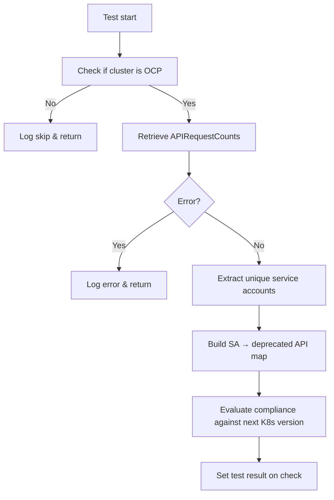

#### 4) Function dependencies (Mermaid)
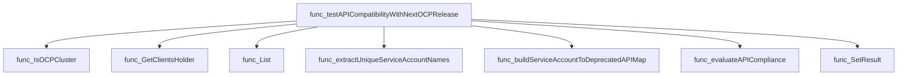

#### 5) Functions calling `testAPICompatibilityWithNextOCPRelease` (Mermaid)
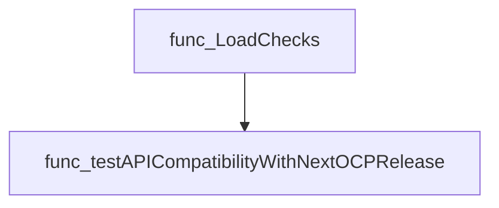

#### 6) Usage example (Go)
```go
// Minimal example invoking testAPICompatibilityWithNextOCPRelease
check := checksdb.NewCheck("example-check-id")
env := &provider.TestEnvironment{
    ServiceAccounts: []corev1.ServiceAccount{ /* … */ },
    K8sVersion:      "4.12",
}
testAPICompatibilityWithNextOCPRelease(check, env)
```

---

### testContainersLogging

**testContainersLogging** - Iterates over all containers under test (CUTs) in the provided environment, verifies that each emits at least one line to its stdout/stderr stream, and records compliance status.


#### Signature (Go)
```go
func testContainersLogging(check *checksdb.Check, env *provider.TestEnvironment)
```

#### Summary Table
| Aspect | Details |
|--------|---------|
| **Purpose** | Iterates over all containers under test (CUTs) in the provided environment, verifies that each emits at least one line to its stdout/stderr stream, and records compliance status. |
| **Parameters** | `check *checksdb.Check` – the current check instance for logging; `<br>` `env *provider.TestEnvironment` – context containing all CUTs. |
| **Return value** | None (updates the check result directly). |
| **Key dependencies** | • `LogInfo`, `LogError` on the `check` object.<br>• `containerHasLoggingOutput(cut)` to fetch log presence.<br>• `testhelper.NewContainerReportObject` for reporting objects.<br>• `SetResult` on the `check`. |
| **Side effects** | • Emits informational and error logs via the check.<br>• Appends report objects to internal slices.<br>• Calls `check.SetResult`, thereby mutating the check state. No external I/O beyond log retrieval. |
| **How it fits the package** | Part of the Observability test suite; invoked by `LoadChecks` as a check function for the *Logging* test case, ensuring containers produce observable logs. |

#### Internal workflow (Mermaid)
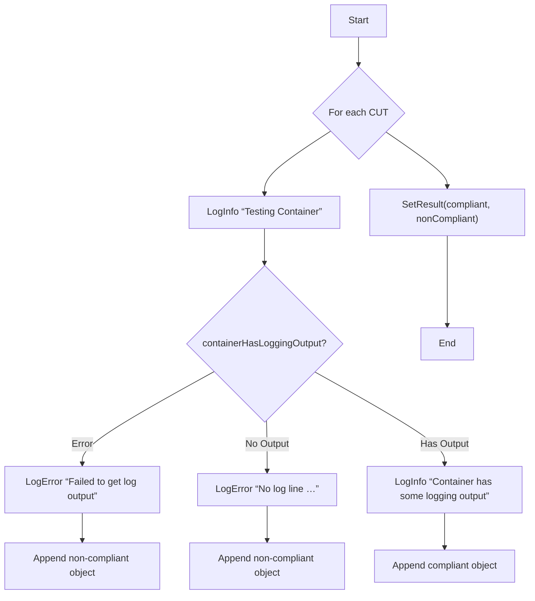

#### Function dependencies (Mermaid)
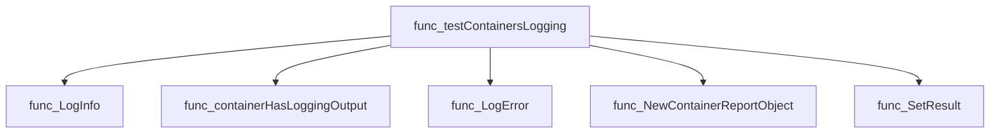

#### Functions calling `testContainersLogging` (Mermaid)
```mermaid
graph TD
  func_LoadChecks --> func_testContainersLogging
```

#### Usage example (Go)
```go
// Minimal example invoking testContainersLogging
import (
    "github.com/redhat-best-practices-for-k8s/certsuite/tests/observability"
    "github.com/redhat-best-practices-for-k8s/certsuite/pkg/checksdb"
    "github.com/redhat-best-practices-for-k8s/certsuite/provider"
)

func example() {
    env := &provider.TestEnvironment{ /* populate Containers */ }
    check := checksdb.NewCheck("logging-test")
    observability.testContainersLogging(check, env)
}
```

---

### testCrds

**testCrds** - Verifies that each CRD version defines a `status` property in its OpenAPI schema, reporting compliance or non‑compliance.


#### Signature (Go)
```go
func testCrds(check *checksdb.Check, env *provider.TestEnvironment) {}
```

#### Summary Table
| Aspect | Details |
|--------|---------|
| **Purpose** | Verifies that each CRD version defines a `status` property in its OpenAPI schema, reporting compliance or non‑compliance. |
| **Parameters** | `check *checksdb.Check –` the check context used for logging and result setting.<br>`env *provider.TestEnvironment –` environment containing the list of CRDs to evaluate. |
| **Return value** | None (results are stored via `check.SetResult`). |
| **Key dependencies** | • `check.LogInfo`, `check.LogError`<br>• `testhelper.NewReportObject`, `AddField`<br>• `check.SetResult` |
| **Side effects** | Generates log entries, creates report objects, and updates the check result. No external I/O beyond logging. |
| **How it fits the package** | Implements one of the observability suite checks; invoked by `LoadChecks` to validate CRD status sub‑resource compliance across deployments. |

#### Internal workflow (Mermaid)
```mermaid
flowchart TD
  A["Start"] --> B{"Iterate env.Crds"}
  B --> C["Log CRD name"]
  C --> D{"For each version in crd.Spec.Versions"}
  D --> E{"Check status property"}
  E -- missing --> F["Log error; add non‑compliant object"]
  E -- present --> G["Log info; add compliant object"]
  F & G --> H["End version loop"]
  H --> I["End CRD loop"]
  I --> J["SetResult(compliant, nonCompliant)"]
```

#### Function dependencies (Mermaid)
```mermaid
graph TD
  func_testCrds --> func_LogInfo
  func_testCrds --> func_LogError
  func_testCrds --> func_append
  func_testCrds --> func_AddField
  func_testCrds --> func_NewReportObject
  func_testCrds --> func_SetResult
```

#### Functions calling `testCrds` (Mermaid)
```mermaid
graph TD
  func_LoadChecks --> func_testCrds
```

#### Usage example (Go)
```go
// Minimal example invoking testCrds
env := &provider.TestEnvironment{ /* populate env.Crds */ }
check := checksdb.NewCheck("TestCRDsStatusSubresource")
testCrds(check, env)
// check now contains compliant/non‑compliant results
```

---

### testPodDisruptionBudgets

**testPodDisruptionBudgets** - Ensures each Deployment or StatefulSet in the test environment has an associated PodDisruptionBudget (PDB) that satisfies validation rules. Reports compliant and non‑compliant objects.


#### Signature (Go)
```go
func testPodDisruptionBudgets(check *checksdb.Check, env *provider.TestEnvironment) 
```

#### Summary Table
| Aspect | Details |
|--------|---------|
| **Purpose** | Ensures each Deployment or StatefulSet in the test environment has an associated PodDisruptionBudget (PDB) that satisfies validation rules. Reports compliant and non‑compliant objects. |
| **Parameters** | `check *checksdb.Check` – object for logging and result storage.<br>`env *provider.TestEnvironment` – holds collections of Deployments, StatefulSets, and PDBs to evaluate. |
| **Return value** | None (results are set via `check.SetResult`). |
| **Key dependencies** | • `log.Info`, `log.Error`<br>• `labels.Set`, `metav1.LabelSelectorAsSelector`, `Matches`<br>• `pdbv1.CheckPDBIsValid` (validation logic)<br>• `testhelper.NewReportObject`, `AddField` |
| **Side effects** | Writes log messages; creates report objects for each object; updates the check result. No external I/O beyond logging. |
| **How it fits the package** | Part of the observability test suite; invoked by `LoadChecks` to verify PodDisruptionBudget compliance in a cluster snapshot. |

#### Internal workflow
```mermaid
flowchart TD
  A["Start"] --> B{"Iterate Deployments"}
  B --> C["Log deployment name"]
  C --> D["Build selector from Deployment labels"]
  D --> E{"Find matching PDBs"}
  E --> F["Convert PDB selector to matcher"]
  F --> G{"Selector matches?"}
  G -- Yes --> H["Validate PDB via CheckPDBIsValid"]
  H -- Valid --> I["Record compliant report"]
  H -- Invalid --> J["Record non‑compliant report with error"]
  G -- No --> K["Continue search"]
  E -- Not found --> L["Log missing PDB, record non‑compliant"]

  B --> M{"Iterate StatefulSets"}
  M --> N["Log stateful set name"]
  N --> O["Build selector from StatefulSet labels"]
  O --> P{"Find matching PDBs"}
  P --> Q["Convert PDB selector to matcher"]
  Q --> R{"Selector matches?"}
  R -- Yes --> S["Validate PDB via CheckPDBIsValid"]
  S -- Valid --> T["Record compliant report"]
  S -- Invalid --> U["Record non‑compliant report with error"]
  R -- No --> V["Continue search"]
  P -- Not found --> W["Log missing PDB, record non‑compliant"]

  L & W --> X["Set check result"] --> Y["End"]
```

#### Function dependencies
```mermaid
graph TD
  func_testPodDisruptionBudgets --> LogInfo
  func_testPodDisruptionBudgets --> ToString
  func_testPodDisruptionBudgets --> Set
  func_testPodDisruptionBudgets --> LabelSelectorAsSelector
  func_testPodDisruptionBudgets --> LogError
  func_testPodDisruptionBudgets --> Matches
  func_testPodDisruptionBudgets --> CheckPDBIsValid
  func_testPodDisruptionBudgets --> NewReportObject
  func_testPodDisruptionBudgets --> fmt.Sprintf
  func_testPodDisruptionBudgets --> AddField
  func_testPodDisruptionBudgets --> SetResult
```

#### Functions calling `testPodDisruptionBudgets`
```mermaid
graph TD
  LoadChecks --> testPodDisruptionBudgets
```

#### Usage example (Go)
```go
// Minimal example invoking testPodDisruptionBudgets
check := checksdb.NewCheck("example")
env := provider.TestEnvironment{
    Deployments:          []appsv1.Deployment{ /* … */ },
    StatefulSets:         []appsv1.StatefulSet{ /* … */ },
    PodDisruptionBudgets: []policyv1.PodDisruptionBudget{ /* … */ },
}
testPodDisruptionBudgets(check, &env)
```

---

### testTerminationMessagePolicy

**testTerminationMessagePolicy** - Ensures each container in the test environment uses `FallbackToLogsOnError` as its termination message policy.


#### 1) Signature (Go)

```go
func testTerminationMessagePolicy(check *checksdb.Check, env *provider.TestEnvironment)
```

#### 2) Summary Table

| Aspect | Details |
|--------|---------|
| **Purpose** | Ensures each container in the test environment uses `FallbackToLogsOnError` as its termination message policy. |
| **Parameters** | `check *checksdb.Check` – check instance for logging and result handling.<br>`env *provider.TestEnvironment` – holds a slice of containers under test (`Containers`). |
| **Return value** | None; the function records results via `check.SetResult`. |
| **Key dependencies** | • `check.LogInfo`, `check.LogError`<br>• `testhelper.NewContainerReportObject`<br>• `check.SetResult` |
| **Side effects** | Logs information, constructs report objects, and sets the check result; no external I/O. |
| **How it fits the package** | Part of the observability test suite; called by `LoadChecks` to validate container policies during test execution. |

#### 3) Internal workflow (Mermaid)

```mermaid
flowchart TD
    A["Start"] --> B{"Iterate over env.Containers"}
    B -->|"For each container"| C["Log info about the container"]
    C --> D{"Check TerminationMessagePolicy"}
    D -- != FallbackToLogsOnError --> E["Log error, create non‑compliant report object"]
    D -- == FallbackToLogsOnError --> F["Log success, create compliant report object"]
    E & F --> G["Append to respective list"]
    G --> B
    B --> H["SetResult(compliantObjects, nonCompliantObjects)"]
    H --> I["End"]
```

#### 4) Function dependencies (Mermaid)

```mermaid
graph TD
  func_testTerminationMessagePolicy --> func_LogInfo
  func_testTerminationMessagePolicy --> func_LogError
  func_testTerminationMessagePolicy --> func_NewContainerReportObject
  func_testTerminationMessagePolicy --> func_SetResult
```

#### 5) Functions calling `testTerminationMessagePolicy` (Mermaid)

```mermaid
graph TD
  func_LoadChecks --> func_testTerminationMessagePolicy
```

#### 6) Usage example (Go)

```go
// Minimal example invoking testTerminationMessagePolicy
func Example() {
    // Assume check and env are initialized appropriately.
    var check *checksdb.Check          // e.g., from a checks group
    var env *provider.TestEnvironment // contains Containers slice

    testTerminationMessagePolicy(check, env)
}
```

---

