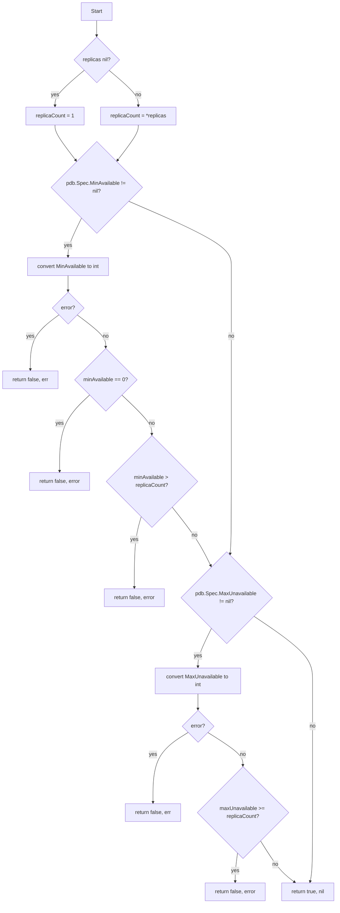
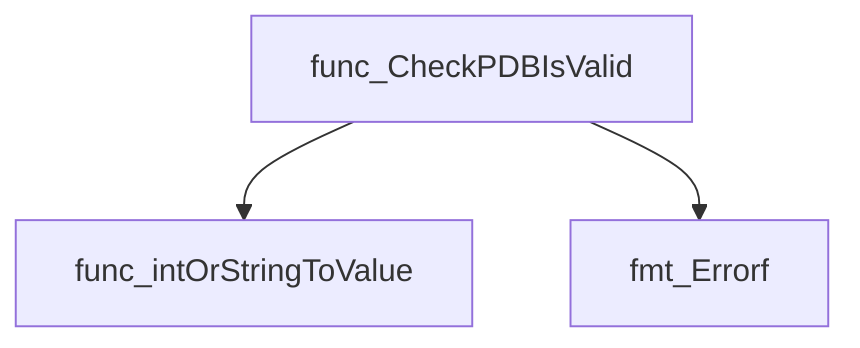
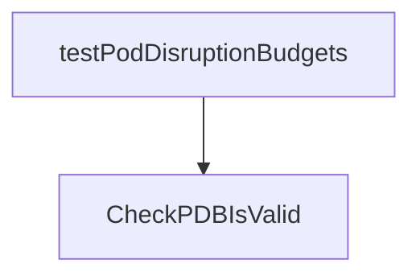
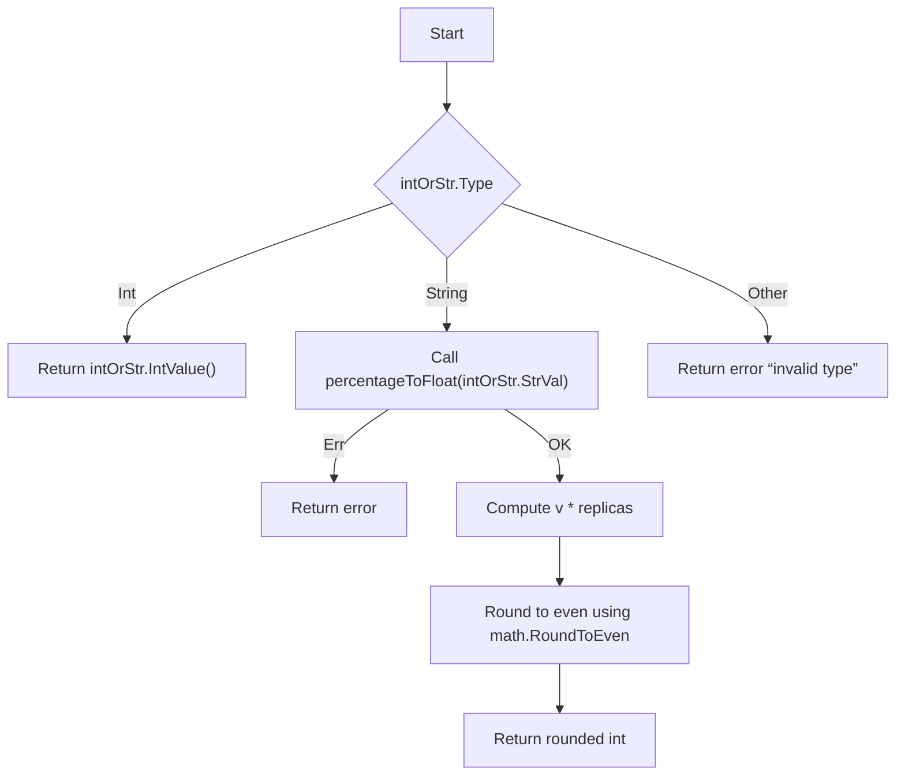
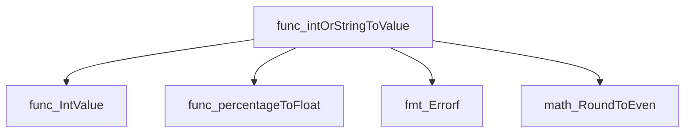
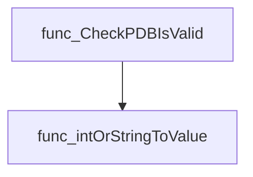
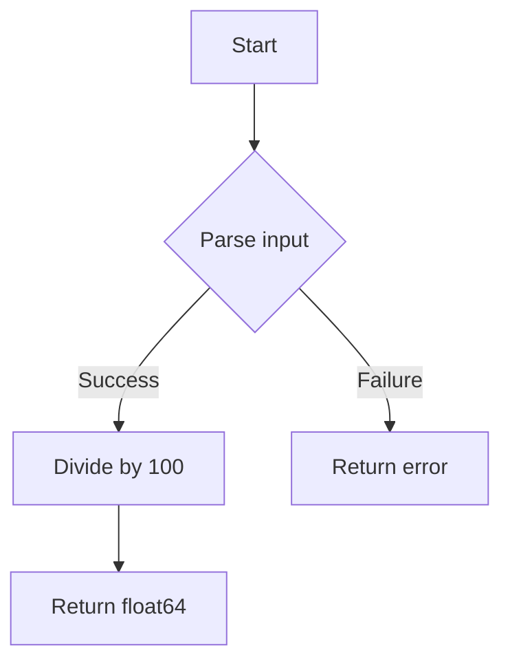
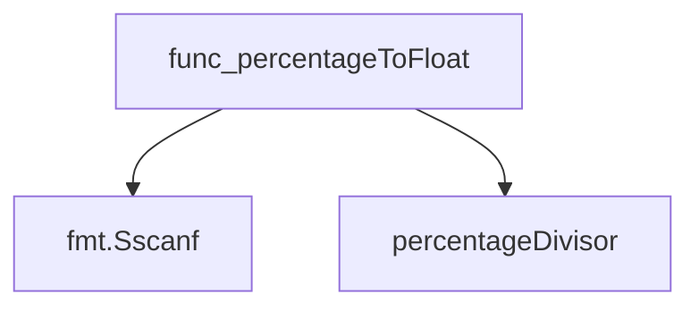
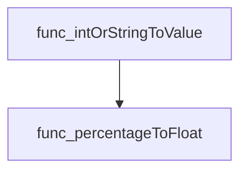

# Package pdb

**Path**: `tests/observability/pdb`

## Table of Contents

- [Overview](#overview)
- [Exported Functions](#exported-functions)
  - [CheckPDBIsValid](#checkpdbisvalid)
- [Local Functions](#local-functions)
  - [intOrStringToValue](#intorstringtovalue)
  - [percentageToFloat](#percentagetofloat)

## Overview

The pdb package validates Kubernetes PodDisruptionBudget objects against a given replica count, ensuring that the budget’s minAvailable and maxUnavailable values are logically consistent.

### Key Features

- Converts IntOrString fields to concrete integers, interpreting percentage strings relative to replica counts
- Checks minAvailable and maxUnavailable constraints for validity
- Provides error feedback when parsing or validation fails

### Design Notes

- Assumes replica count is non‑nil; if nil the function returns false with an error
- Handles percentages by converting them to float values between 0 and 1 before rounding
- Best practice: use CheckPDBIsValid in tests or controllers to pre‑validate PDB objects

### Exported Functions Summary

| Name | Purpose |
|------|----------|
| [func CheckPDBIsValid(pdb *policyv1.PodDisruptionBudget, replicas *int32) (bool, error)](#checkpdbisvalid) | Determines whether the given `PodDisruptionBudget` (`pdb`) is logically consistent with the supplied replica count. It checks that `minAvailable` and `maxUnavailable` values are within valid ranges. |

### Local Functions Summary

| Name | Purpose |
|------|----------|
| [func(*intstr.IntOrString, int32)(int, error)](#intorstringtovalue) | Transforms a Kubernetes `IntOrString` field into an absolute integer, interpreting strings as percentages of a replica count. |
| [func percentageToFloat(percentage string) (float64, error)](#percentagetofloat) | Parses a string representing a percentage (e.g., `"25%"`) and returns its numeric value as a `float64` between 0 and 1. |

## Exported Functions

### CheckPDBIsValid

**CheckPDBIsValid** - Determines whether the given `PodDisruptionBudget` (`pdb`) is logically consistent with the supplied replica count. It checks that `minAvailable` and `maxUnavailable` values are within valid ranges.

#### Signature (Go)

```go
func CheckPDBIsValid(pdb *policyv1.PodDisruptionBudget, replicas *int32) (bool, error)
```

#### Summary Table

| Aspect | Details |
|--------|---------|
| **Purpose** | Determines whether the given `PodDisruptionBudget` (`pdb`) is logically consistent with the supplied replica count. It checks that `minAvailable` and `maxUnavailable` values are within valid ranges. |
| **Parameters** | `pdb *policyv1.PodDisruptionBudget` – PDB to validate.<br>`replicas *int32` – Number of replicas; if nil, defaults to 1. |
| **Return value** | `(bool, error)` – Returns `true` and a `nil` error when the PDB is valid; otherwise returns `false` with an explanatory error. |
| **Key dependencies** | • `intOrStringToValue` – Converts `IntOrString` fields to integer values.<br>• `fmt.Errorf` – Formats validation errors. |
| **Side effects** | None. The function only reads inputs and performs calculations; no state mutation or I/O occurs. |
| **How it fits the package** | Provides core validation logic used by higher‑level tests that verify PodDisruptionBudget configurations for Deployments and StatefulSets. |

#### Internal workflow (Mermaid)



#### Function dependencies (Mermaid)



#### Functions calling `CheckPDBIsValid` (Mermaid)



#### Usage example (Go)

```go
// Minimal example invoking CheckPDBIsValid
import (
    policyv1 "k8s.io/api/policy/v1"
)

// Assume pdb is a valid *policyv1.PodDisruptionBudget instance
var replicas int32 = 3

valid, err := CheckPDBIsValid(pdb, &replicas)
if err != nil {
    fmt.Printf("Invalid PDB: %v\n", err)
} else if valid {
    fmt.Println("PodDisruptionBudget is valid")
}
```

---

## Local Functions

### intOrStringToValue

**intOrStringToValue** - Transforms a Kubernetes `IntOrString` field into an absolute integer, interpreting strings as percentages of a replica count.

#### 1) Signature (Go)

```go
func(*intstr.IntOrString, int32)(int, error)
```

#### 2) Summary Table

| Aspect | Details |
|--------|---------|
| **Purpose** | Transforms a Kubernetes `IntOrString` field into an absolute integer, interpreting strings as percentages of a replica count. |
| **Parameters** | *`intOrStr`* (`*intstr.IntOrString`) – the value to convert.<br>*`replicas`* (`int32`) – reference count for percentage calculations. |
| **Return value** | *`int`* – resolved integer value.<br>*`error`* – non‑nil if the input is invalid or of an unsupported type. |
| **Key dependencies** | `IntValue()` (from `k8s.io/apimachinery/pkg/util/intstr`)<br>`percentageToFloat()`<br>`math.RoundToEven()`<br>`fmt.Errorf()` |
| **Side effects** | None – purely functional; no global state mutation or I/O. |
| **How it fits the package** | Used by PDB validation logic to interpret `.spec.minAvailable` and `.spec.maxUnavailable` fields, which may be expressed as integers or percentage strings. |

#### 3) Internal workflow (Mermaid)



#### 4) Function dependencies (Mermaid)



#### 5) Functions calling `intOrStringToValue` (Mermaid)



#### 6) Usage example (Go)

```go
// Minimal example invoking intOrStringToValue
import (
    "k8s.io/apimachinery/pkg/util/intstr"
    pdbpkg "github.com/redhat-best-practices-for-k8s/certsuite/tests/observability/pdb"
)

func main() {
    // Example: .spec.minAvailable set to 30%
    minAvail := intstr.FromString("30%")
    replicas := int32(10)

    value, err := pdbpkg.intOrStringToValue(&minAvail, replicas)
    if err != nil {
        panic(err)
    }
    fmt.Printf("Resolved minAvailable: %d pods\n", value) // prints 3
}
```

---

---

### percentageToFloat

**percentageToFloat** - Parses a string representing a percentage (e.g., `"25%"`) and returns its numeric value as a `float64` between 0 and 1.

#### Signature (Go)

```go
func percentageToFloat(percentage string) (float64, error)
```

#### Summary Table

| Aspect | Details |
|--------|---------|
| **Purpose** | Parses a string representing a percentage (e.g., `"25%"`) and returns its numeric value as a `float64` between 0 and 1. |
| **Parameters** | `percentage string – the input text containing a numeric value followed by`%`. |
| **Return value** | `<float64> – the parsed fraction; <error> – if parsing fails. |
| **Key dependencies** | • `fmt.Sscanf` for format‑based extraction.<br>• Constant `percentageDivisor` (value 100) to convert percent to a fraction. |
| **Side effects** | None; purely functional. |
| **How it fits the package** | Used by `intOrStringToValue` in the PDB tests to interpret string values that represent replica percentages. |

#### Internal workflow (Mermaid)



#### Function dependencies (Mermaid)



#### Functions calling `percentageToFloat` (Mermaid)



#### Usage example (Go)

```go
// Minimal example invoking percentageToFloat
package main

import (
 "fmt"
)

func main() {
 value, err := percentageToFloat("42%")
 if err != nil {
  fmt.Println("error:", err)
  return
 }
 fmt.Printf("Fraction: %f\n", value) // prints 0.420000
}
```

---
