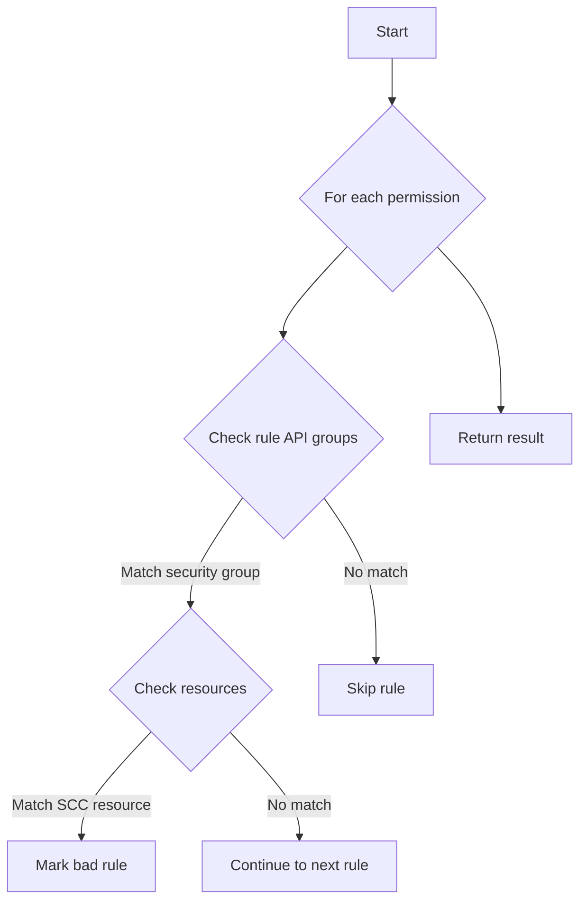
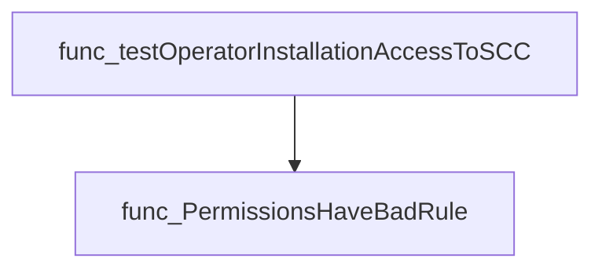

# Package access

**Path**: `tests/operator/access`

## Table of Contents

- [Overview](#overview)
- [Exported Functions](#exported-functions)
  - [PermissionsHaveBadRule](#permissionshavebadrule)

## Overview

Provides utilities for validating that an Operator's deployment permissions do not grant service accounts access to OpenShift security context constraints, which is considered insecure.

### Key Features

- Detects if any StrategyDeploymentPermissions rule allows 'security.openshift.io' API group access to the '*securitycontextconstraints*' resource
- Iterates over a slice of v1alpha1.StrategyDeploymentPermissions and returns a boolean flag
- Designed for use in tests or CI pipelines to enforce security best practices

### Design Notes

- Assumes that permissions are represented by operator-framework's v1alpha1.StrategyDeploymentPermissions type
- Only checks the specific insecure rule; other potential misconfigurations are not reported
- Best used as part of pre‑deployment validation or automated test suites

### Exported Functions Summary

| Name | Purpose |
|------|----------|
| [func PermissionsHaveBadRule(clusterPermissions []v1alpha1.StrategyDeploymentPermissions) bool](#permissionshavebadrule) | Determines if any `StrategyDeploymentPermissions` contains a rule that allows a service account to access the *securitycontextconstraints* resource in the *security.openshift.io* API group, which is considered insecure. |

## Exported Functions

### PermissionsHaveBadRule

**PermissionsHaveBadRule** - Determines if any `StrategyDeploymentPermissions` contains a rule that allows a service account to access the *securitycontextconstraints* resource in the *security.openshift.io* API group, which is considered insecure.


#### Signature (Go)
```go
func PermissionsHaveBadRule(clusterPermissions []v1alpha1.StrategyDeploymentPermissions) bool
```

#### Summary Table
| Aspect | Details |
|--------|---------|
| **Purpose** | Determines if any `StrategyDeploymentPermissions` contains a rule that allows a service account to access the *securitycontextconstraints* resource in the *security.openshift.io* API group, which is considered insecure. |
| **Parameters** | - `clusterPermissions []v1alpha1.StrategyDeploymentPermissions` – slice of permissions defined in an operator’s CSV. |
| **Return value** | `bool` – `true` if at least one rule grants such access; otherwise `false`. |
| **Key dependencies** | • Iterates over `StrategyDeploymentPermissions`, their `Rules`, and checks the `APIGroups` and `Resources` fields. |
| **Side effects** | None – purely functional, no state mutation or I/O. |
| **How it fits the package** | Used by tests to flag operators that expose cluster‑level SCC permissions, contributing to compliance validation. |

#### Internal workflow (Mermaid)


#### Function dependencies (Mermaid)
None – this function is currently not referenced elsewhere in the package.

#### Functions calling `PermissionsHaveBadRule` (Mermaid)


#### Usage example (Go)
```go
// Minimal example invoking PermissionsHaveBadRule
import (
	"github.com/redhat-best-practices-for-k8s/certsuite/tests/operator/access"
	v1alpha1 "github.com/openshift/api/apps/v1alpha1"
)

func main() {
	perms := []v1alpha1.StrategyDeploymentPermissions{
		{
			Rules: []v1alpha1.PolicyRule{
				{
					APIGroups:  []string{"security.openshift.io"},
					Resources: []string{"securitycontextconstraints"},
				},
			},
		},
	}
	if access.PermissionsHaveBadRule(perms) {
		fmt.Println("Operator has insecure SCC permissions")
	} else {
		fmt.Println("Operator is compliant with SCC rules")
	}
}
```

---

