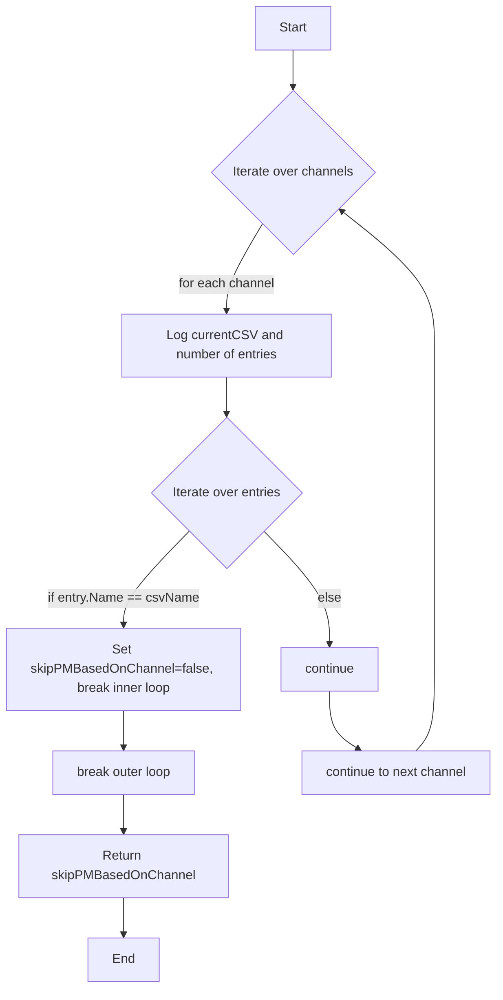
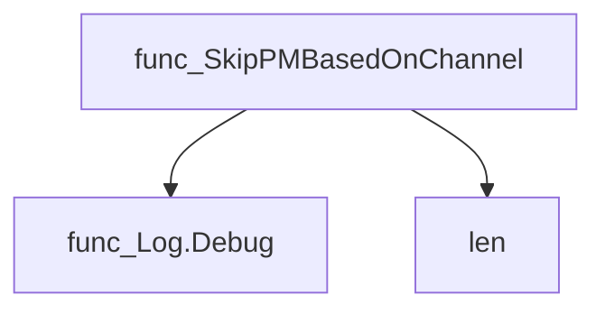
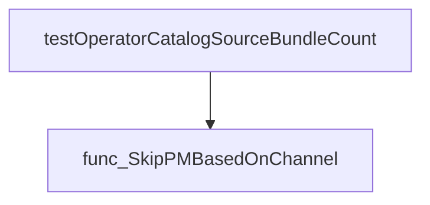

# Package catalogsource

**Path**: `tests/operator/catalogsource`

## Table of Contents

- [Overview](#overview)
- [Exported Functions](#exported-functions)
  - [SkipPMBasedOnChannel](#skippmbasedonchannel)

## Overview

The catalogsource package provides utilities for examining Operator Lifecycle Manager (OLM) catalog sources during tests, particularly to determine whether a PackageManifest should be processed based on its channel entries.

### Key Features

- Checks if a desired ClusterServiceVersion is already referenced in any of a PackageChannel's entries, allowing tests to skip redundant processing.

### Design Notes

- Assumes the input slice contains all channels for a PackageManifest; it only inspects the 'CurrentCSV' field.

### Exported Functions Summary

| Name | Purpose |
|------|----------|
| [func SkipPMBasedOnChannel(channels []olmpkgv1.PackageChannel, csvName string) bool](#skippmbasedonchannel) | Determines if a `PackageManifest` should be excluded from further processing because the desired CSV is already referenced in one of its channel entries. |

## Exported Functions

### SkipPMBasedOnChannel

**SkipPMBasedOnChannel** - Determines if a `PackageManifest` should be excluded from further processing because the desired CSV is already referenced in one of its channel entries.


#### 1) Signature (Go)

```go
func SkipPMBasedOnChannel(channels []olmpkgv1.PackageChannel, csvName string) bool
```

#### 2) Summary Table

| Aspect | Details |
|--------|---------|
| **Purpose** | Determines if a `PackageManifest` should be excluded from further processing because the desired CSV is already referenced in one of its channel entries. |
| **Parameters** | - `channels []olmpkgv1.PackageChannel` – list of channels defined for the package.<br>- `csvName string` – name of the CSV currently being examined. |
| **Return value** | `bool`: `true` if the manifest should be skipped; `false` otherwise. |
| **Key dependencies** | • `log.Debug` from `github.com/redhat-best-practices-for-k8s/certsuite/internal/log`<br>• `len` built‑in function |
| **Side effects** | Emits debug logs only; no state mutation or I/O. |
| **How it fits the package** | Used by catalog source tests to avoid double counting bundle references when an operator’s CSV is already listed in a channel entry of a `PackageManifest`. |

#### 3) Internal workflow (Mermaid)



#### 4) Function dependencies (Mermaid)



#### 5) Functions calling `SkipPMBasedOnChannel` (Mermaid)



#### 6) Usage example (Go)

```go
// Minimal example invoking SkipPMBasedOnChannel
package main

import (
    "fmt"
    catalogsource "github.com/redhat-best-practices-for-k8s/certsuite/tests/operator/catalogsource"
    olmpkgv1 "github.com/operator-framework/api/pkg/operators/v1alpha1"
)

func main() {
    channels := []olmpkgv1.PackageChannel{
        {
            CurrentCSV: "my-operator.v2",
            Entries: []olmpkgv1.ChannelEntry{
                {Name: "my-operator.v1"},
                {Name: "my-operator.v2"},
            },
        },
    }

    skip := catalogsource.SkipPMBasedOnChannel(channels, "my-operator.v2")
    fmt.Printf("Should skip package manifest? %t\n", skip)
}
```

---

---

