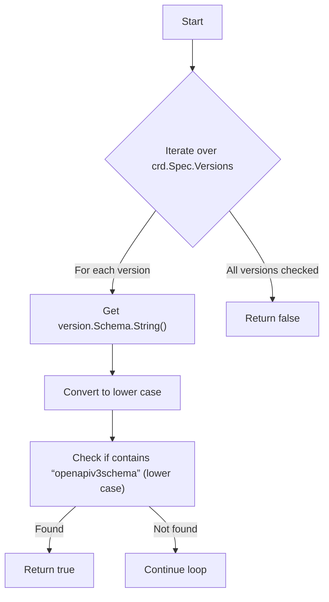
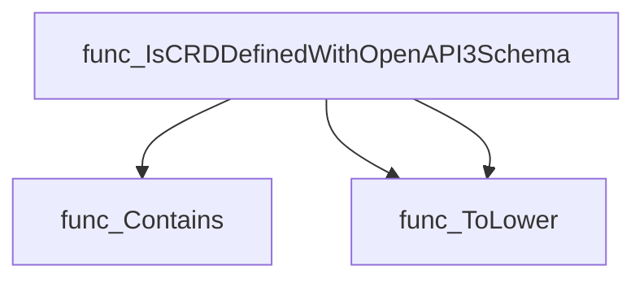
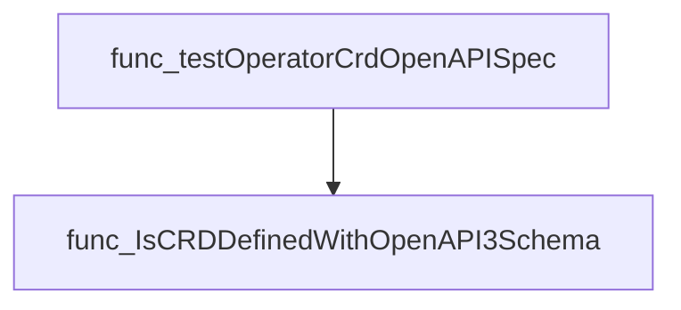

# Package openapi

**Path**: `tests/operator/openapi`

## Table of Contents

- [Overview](#overview)
- [Exported Functions](#exported-functions)
  - [IsCRDDefinedWithOpenAPI3Schema](#iscrddefinedwithopenapi3schema)

## Overview

The package provides utilities for inspecting Custom Resource Definitions (CRDs) to determine if any of their versions declare an OpenAPI v3 schema. It is used in tests that need to verify CRD compliance with API‑extension specifications.

### Key Features

- Checks all versions of a CRD for the presence of an `OpenAPIV3Schema` field
- Returns a boolean indicating existence, simplifying test assertions
- Utilizes standard string operations to handle case‑insensitive matching

### Design Notes

- Assumes that the CRD’s `Spec.Versions` slice is populated; if empty the function returns false
- The check stops at the first detected schema, not validating its correctness
- Best practice: call after loading a fully‑resolved CRD from the API server to ensure accurate results

### Exported Functions Summary

| Name | Purpose |
|------|----------|
| [func IsCRDDefinedWithOpenAPI3Schema(crd *apiextv1.CustomResourceDefinition) bool](#iscrddefinedwithopenapi3schema) | Determines whether any version of a Custom Resource Definition includes an OpenAPI v3 schema declaration. |

## Exported Functions

### IsCRDDefinedWithOpenAPI3Schema

**IsCRDDefinedWithOpenAPI3Schema** - Determines whether any version of a Custom Resource Definition includes an OpenAPI v3 schema declaration.

#### Signature (Go)

```go
func IsCRDDefinedWithOpenAPI3Schema(crd *apiextv1.CustomResourceDefinition) bool
```

#### Summary Table

| Aspect | Details |
|--------|---------|
| **Purpose** | Determines whether any version of a Custom Resource Definition includes an OpenAPI v3 schema declaration. |
| **Parameters** | `crd` – pointer to `apiextv1.CustomResourceDefinition`; the CRD to inspect. |
| **Return value** | `bool`: `true` if at least one version contains the substring “openapiv3schema” (case‑insensitive); otherwise `false`. |
| **Key dependencies** | • `strings.Contains`<br>• `strings.ToLower` (twice) |
| **Side effects** | None; purely functional. |
| **How it fits the package** | Provides a helper for tests that need to filter CRDs by schema definition, enabling compliance checks on operator‑provided CRDs. |

#### Internal workflow



#### Function dependencies



#### Functions calling `IsCRDDefinedWithOpenAPI3Schema`



#### Usage example (Go)

```go
// Minimal example invoking IsCRDDefinedWithOpenAPI3Schema
import (
    "github.com/redhat-best-practices-for-k8s/certsuite/tests/operator/openapi"
    apiextv1 "k8s.io/apiextensions-apiserver/pkg/apis/apiextensions/v1"
)

func checkCRDSchema(crd *apiextv1.CustomResourceDefinition) {
    if openapi.IsCRDDefinedWithOpenAPI3Schema(crd) {
        fmt.Println("CRD uses OpenAPI v3 schema")
    } else {
        fmt.Println("CRD does not use OpenAPI v3 schema")
    }
}
```

---
