# Package operator

**Path**: `tests/operator`

## Table of Contents

- [Overview](#overview)
- [Structs](#structs)
  - [CsvResult](#csvresult)
- [Exported Functions](#exported-functions)
  - [LoadChecks](#loadchecks)
  - [OperatorInstalledMoreThanOnce](#operatorinstalledmorethanonce)
  - [SplitCsv](#splitcsv)
- [Local Functions](#local-functions)
  - [checkIfCsvUnderTest](#checkifcsvundertest)
  - [checkValidOperatorInstallation](#checkvalidoperatorinstallation)
  - [findPodsNotBelongingToOperators](#findpodsnotbelongingtooperators)
  - [getAllPodsBy](#getallpodsby)
  - [getCsvsBy](#getcsvsby)
  - [isCsvInNamespaceClusterWide](#iscsvinnamespaceclusterwide)
  - [isMultiNamespacedOperator](#ismultinamespacedoperator)
  - [isSingleNamespacedOperator](#issinglenamespacedoperator)
  - [testMultipleSameOperators](#testmultiplesameoperators)
  - [testOnlySingleOrMultiNamespacedOperatorsAllowedInTenantNamespaces](#testonlysingleormultinamespacedoperatorsallowedintenantnamespaces)
  - [testOperatorCatalogSourceBundleCount](#testoperatorcatalogsourcebundlecount)
  - [testOperatorCrdOpenAPISpec](#testoperatorcrdopenapispec)
  - [testOperatorCrdVersioning](#testoperatorcrdversioning)
  - [testOperatorInstallationAccessToSCC](#testoperatorinstallationaccesstoscc)
  - [testOperatorInstallationPhaseSucceeded](#testoperatorinstallationphasesucceeded)
  - [testOperatorOlmSkipRange](#testoperatorolmskiprange)
  - [testOperatorOlmSubscription](#testoperatorolmsubscription)
  - [testOperatorPodsNoHugepages](#testoperatorpodsnohugepages)
  - [testOperatorSemanticVersioning](#testoperatorsemanticversioning)
  - [testOperatorSingleCrdOwner](#testoperatorsinglecrdowner)

## Overview

The operator test suite registers checks that validate Operator Lifecycle Manager (OLM) installations, configuration and runtime behavior in a Kubernetes cluster.

### Key Features

- Provides helpers to parse CSV strings and determine namespace relationships
- Implements validation for OLM annotations, CRD ownership, SCC permissions, versioning and resource limits
- Generates detailed report objects for operators, catalog sources, pods and CRDs

### Design Notes

- Assumes a global TestEnvironment with operator and pod data
- Checks are registered via LoadChecks which constructs checksdb groups
- Functions return simple booleans or slice of error strings to allow aggregation

### Structs Summary

| Name | Purpose |
|------|----------|
| [**CsvResult**](#csvresult) | Holds the outcome of parsing a CSV string |

### Exported Functions Summary

| Name | Purpose |
|------|----------|
| [func LoadChecks()](#loadchecks) | Populates the *operator* test group with a series of checks that validate operator installation, configuration, and runtime behaviour. |
| [func OperatorInstalledMoreThanOnce(*provider.Operator, *provider.Operator)(bool)](#operatorinstalledmorethanonce) | Function implementation |
| [func SplitCsv(csv string) CsvResult](#splitcsv) | Extracts the CSV name (`NameCsv`) and optional namespace (`Namespace`) from a comma‑separated input string. |

### Local Functions Summary

| Name | Purpose |
|------|----------|
| [func (*v1alpha1.ClusterServiceVersion) bool](#checkifcsvundertest) | Returns `true` if the supplied CSV matches any operator defined in the global `env.Operators` slice, indicating it is being tested. |
| [func checkValidOperatorInstallation(namespace string) (     isDedicatedOperatorNamespace bool,     singleOrMultiNamespaceOperators []string,     nonSingleOrMultiNamespaceOperators []string,     csvsTargetingNamespace []string,     operatorsFoundButNotUnderTest []string,     podsNotBelongingToOperators []string,     err error)](#checkvalidoperatorinstallation) | Determines whether a namespace is dedicated to single‑ or multi‑namespaced operators, gathers lists of operator CSVs and pods that violate the expected installation rules, and reports any errors encountered. |
| [func findPodsNotBelongingToOperators(namespace string) ([]string, error)](#findpodsnotbelongingtooperators) | Returns the names of all pods within *namespace* that are not owned by any operator (ClusterServiceVersion) in that same namespace. |
| [func getAllPodsBy(namespace string, allPods []*provider.Pod) (podsInNamespace []*provider.Pod)](#getallpodsby) | Filters a slice of pod objects, returning only those whose `Namespace` field matches the supplied namespace. |
| [func getCsvsBy(namespace string, allCsvs []*v1alpha1.ClusterServiceVersion) (csvsInNamespace []*v1alpha1.ClusterServiceVersion)](#getcsvsby) | Filters a slice of `ClusterServiceVersion` objects, returning only those whose `Namespace` field matches the supplied namespace. |
| [func isCsvInNamespaceClusterWide(csvName string, allCsvs []*v1alpha1.ClusterServiceVersion) bool](#iscsvinnamespaceclusterwide) | Checks whether the ClusterServiceVersion (CSV) identified by `csvName` targets every namespace in the cluster. It returns `true` if no specific target namespaces are annotated, indicating a cluster‑wide operator. |
| [func isMultiNamespacedOperator(operatorNamespace string, targetNamespaces []string) bool](#ismultinamespacedoperator) | Checks whether a given operator runs across more than one namespace while *excluding* its own namespace from the list of targets. |
| [func isSingleNamespacedOperator(operatorNamespace string, targetNamespaces []string) bool](#issinglenamespacedoperator) | Determines if the operator’s *olm.targetNamespaces* annotation specifies exactly one namespace that is different from the operator’s own namespace. |
| [func testMultipleSameOperators(check *checksdb.Check, env *provider.TestEnvironment)](#testmultiplesameoperators) | Validates that each operator’s CSV name appears only once across the cluster; reports compliance or non‑compliance. |
| [func testOnlySingleOrMultiNamespacedOperatorsAllowedInTenantNamespaces(check *checksdb.Check, env *provider.TestEnvironment)](#testonlysingleormultinamespacedoperatorsallowedintenantnamespaces) | Validates that a namespace dedicated to operator installation contains only single or multi‑namespaced operators and no other operator artifacts (e.g., cluster‑wide CSVs, pods outside the operator’s scope). |
| [func testOperatorCatalogSourceBundleCount(check *checksdb.Check, env *provider.TestEnvironment)](#testoperatorcatalogsourcebundlecount) | Validates that every catalog source used by an operator has a bundle count below 1,000. It logs results and records compliant/non‑compliant objects for reporting. |
| [func testOperatorCrdOpenAPISpec(check *checksdb.Check, env *provider.TestEnvironment)](#testoperatorcrdopenapispec) | Validates that each Custom Resource Definition (CRD) managed by an operator declares an OpenAPI v3 schema in its spec. |
| [func testOperatorCrdVersioning(check *checksdb.Check, env *provider.TestEnvironment)](#testoperatorcrdversioning) | Ensures every Custom Resource Definition (CRD) provided by an Operator follows Kubernetes‑style version naming (`v<major>[alpha/beta]…`). |
| [func testOperatorInstallationAccessToSCC(check *checksdb.Check, env *provider.TestEnvironment)](#testoperatorinstallationaccesstoscc) | Verifies that none of an operator’s cluster permissions grant access to Security Context Constraints (SCCs). Operators with such rules are flagged as non‑compliant. |
| [func testOperatorInstallationPhaseSucceeded(check *checksdb.Check, env *provider.TestEnvironment)](#testoperatorinstallationphasesucceeded) | Verifies every operator in the test environment has reached the *Succeeded* status and records compliance results. |
| [func testOperatorOlmSkipRange(check *checksdb.Check, env *provider.TestEnvironment)](#testoperatorolmskiprange) | Confirms every operator in the test environment includes an `olm.skipRange` annotation on its ClusterServiceVersion (CSV). |
| [func testOperatorOlmSubscription(check *checksdb.Check, env *provider.TestEnvironment) {}](#testoperatorolmsubscription) | Checks whether every operator in the environment has an OLM subscription; records compliant and non‑compliant results. |
| [func testOperatorPodsNoHugepages(check *checksdb.Check, env *provider.TestEnvironment)](#testoperatorpodsnohugepages) | Verifies that none of the operator‑managed pods request huge page memory. If a pod requests huge pages it is marked non‑compliant; otherwise it is compliant. |
| [func (*checksdb.Check, *provider.TestEnvironment)()](#testoperatorsemanticversioning) | Validates that every operator in the test environment has a version string that conforms to [Semantic Versioning](https://semver.org/). |
| [func testOperatorSingleCrdOwner(check *checksdb.Check, env *provider.TestEnvironment)](#testoperatorsinglecrdowner) | Ensures every CRD declared in the environment’s operators is owned by a single operator. If multiple operators own the same CRD name, the check flags it as non‑compliant. |

## Structs

### CsvResult

#### Fields

| Field     | Type   | Description |
|-----------|--------|-------------|
| `NameCsv` | `string` | The comma‑separated list of names extracted from the input CSV, after trimming whitespace. |
| `Namespace` | `string` | The namespace value prefixed with `ns=` in the input; if none is present it remains an empty string. |

#### Purpose

`CsvResult` aggregates the pieces returned by the `SplitCsv` helper: a cleaned list of names and an optional namespace extracted from a CSV‑formatted string.

#### Related functions

| Function | Purpose |
|----------|---------|
| `SplitCsv` | Parses a CSV string, separates components by commas, trims spaces, assigns values to `NameCsv` or `Namespace`, and returns the populated `CsvResult`. |

---

## Exported Functions

### LoadChecks

**LoadChecks** - Populates the *operator* test group with a series of checks that validate operator installation, configuration, and runtime behaviour.

#### 1) Signature (Go)

```go
func LoadChecks()
```

#### 2) Summary Table

| Aspect | Details |
|--------|---------|
| **Purpose** | Populates the *operator* test group with a series of checks that validate operator installation, configuration, and runtime behaviour. |
| **Parameters** | None |
| **Return value** | None |
| **Key dependencies** | `log.Debug` – logs the loading action.<br>`checksdb.NewChecksGroup` – creates a check group for operators.<br>`WithBeforeEachFn`, `Add`, `WithCheckFn`, `WithSkipCheckFn` – configure each individual check.<br>Test helpers such as `GetNoOperatorsSkipFn`, `GetNoOperatorCrdsSkipFn`, `GetNoCatalogSourcesSkipFn`, etc., provide skip logic.<br>Specific test functions (`testOperatorInstallationPhaseSucceeded`, `testOperatorInstallationAccessToSCC`, …) perform the actual validation. |
| **Side effects** | Mutates the global checks database by adding a new group and its checks; emits debug log entries. No external I/O is performed directly. |
| **How it fits the package** | Called from `pkg/certsuite.LoadInternalChecksDB` to ensure operator‑related tests are available when the test suite runs. |

#### 3) Internal workflow (Mermaid)

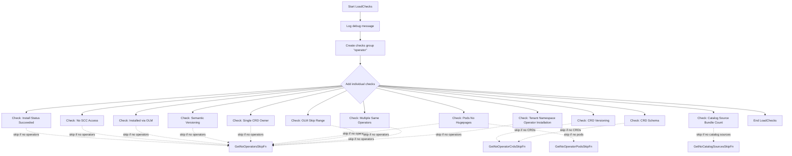

#### 4) Function dependencies (Mermaid)

```mermaid
graph TD
  func_LoadChecks --> log_Debug
  func_LoadChecks --> checksdb_NewChecksGroup
  func_LoadChecks --> WithBeforeEachFn
  func_LoadChecks --> Add
  func_LoadChecks --> WithCheckFn
  func_LoadChecks --> WithSkipCheckFn
  func_LoadChecks --> testOperatorInstallationPhaseSucceeded
  func_LoadChecks --> testOperatorInstallationAccessToSCC
  func_LoadChecks --> testOperatorOlmSubscription
  func_LoadChecks --> testOperatorSemanticVersioning
  func_LoadChecks --> testOperatorCrdVersioning
  func_LoadChecks --> testOperatorCrdOpenAPISpec
  func_LoadChecks --> testOperatorSingleCrdOwner
  func_LoadChecks --> testOperatorPodsNoHugepages
  func_LoadChecks --> testOperatorOlmSkipRange
  func_LoadChecks --> testMultipleSameOperators
  func_LoadChecks --> testOperatorCatalogSourceBundleCount
  func_LoadChecks --> testOnlySingleOrMultiNamespacedOperatorsAllowedInTenantNamespaces
```

#### 5) Functions calling `LoadChecks` (Mermaid)

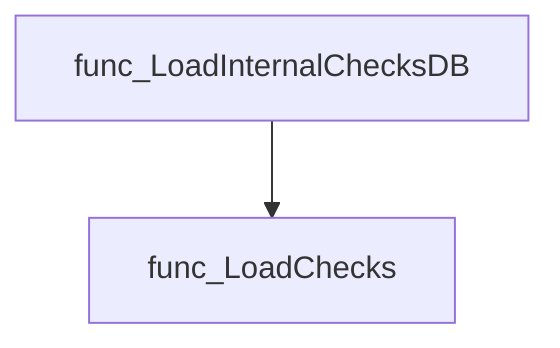

#### 6) Usage example (Go)

```go
// Within the package initialization, ensure operator checks are registered:
func init() {
    // Load all internal check groups, including operators.
    certsuite.LoadInternalChecksDB()
}
```

---

### OperatorInstalledMoreThanOnce

<!-- DEBUG: Function OperatorInstalledMoreThanOnce exists in bundle but ParsedOK=false -->
**Signature**: `func(*provider.Operator, *provider.Operator)(bool)`

**Purpose**:

---

### SplitCsv

**SplitCsv** - Extracts the CSV name (`NameCsv`) and optional namespace (`Namespace`) from a comma‑separated input string.

Splits a CSV‑style string into its component name and namespace values.

---

#### Signature (Go)

```go
func SplitCsv(csv string) CsvResult
```

---

#### Summary Table

| Aspect | Details |
|--------|---------|
| **Purpose** | Extracts the CSV name (`NameCsv`) and optional namespace (`Namespace`) from a comma‑separated input string. |
| **Parameters** | `csv string` – The raw CSV representation (e.g., `"name, ns=namespace"`). |
| **Return value** | `CsvResult` – A struct containing `NameCsv` and `Namespace`. |
| **Key dependencies** | • `strings.Split`<br>• `strings.TrimSpace`<br>• `strings.HasPrefix`<br>• `strings.TrimPrefix` |
| **Side effects** | None; purely functional. |
| **How it fits the package** | Provides a helper for tests that need to parse CSV identifiers before performing checks on operator pods. |

---

#### Internal workflow (Mermaid)

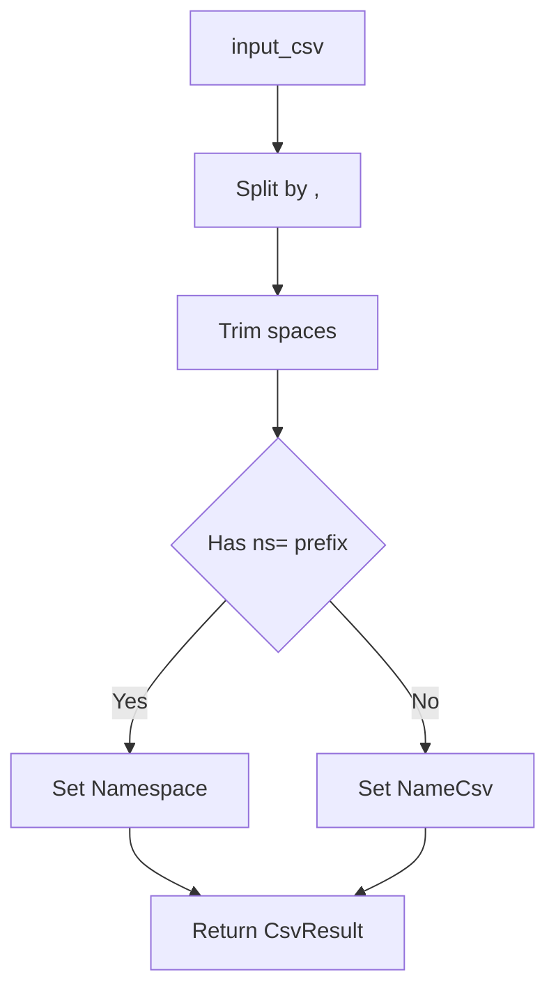

---

#### Function dependencies (Mermaid)

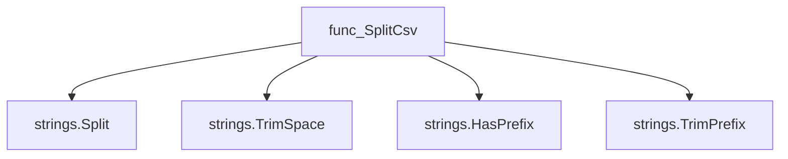

---

#### Functions calling `SplitCsv` (Mermaid)

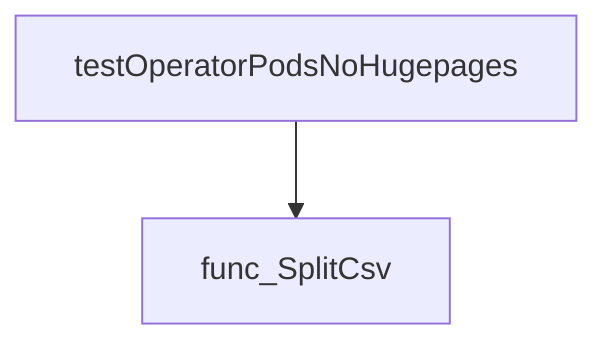

---

#### Usage example (Go)

```go
// Minimal example invoking SplitCsv
csv := "my-operator, ns=my-namespace"
result := SplitCsv(csv)
fmt.Printf("Name: %s, Namespace: %s\n", result.NameCsv, result.Namespace)
// Output: Name: my-operator, Namespace: my-namespace
```

---

## Local Functions

### checkIfCsvUnderTest

**checkIfCsvUnderTest** - Returns `true` if the supplied CSV matches any operator defined in the global `env.Operators` slice, indicating it is being tested.

Determines whether a given CSV is part of the current test operator set.

```go
func (*v1alpha1.ClusterServiceVersion) bool
```

| Aspect | Details |
|--------|---------|
| **Purpose** | Returns `true` if the supplied CSV matches any operator defined in the global `env.Operators` slice, indicating it is being tested. |
| **Parameters** | `csv *v1alpha1.ClusterServiceVersion` – the CSV to evaluate |
| **Return value** | `bool` – `true` when the CSV belongs to a test operator; otherwise `false`. |
| **Key dependencies** | • `env.Operators` (global slice of test operators) <br>• Comparison of `csv.Name` with each `testOperator.Csv.Name` |
| **Side effects** | None; purely functional. |
| **How it fits the package** | Used by higher‑level validation logic to filter out CSVs that are not relevant to the current operator installation test. |

#### Internal workflow

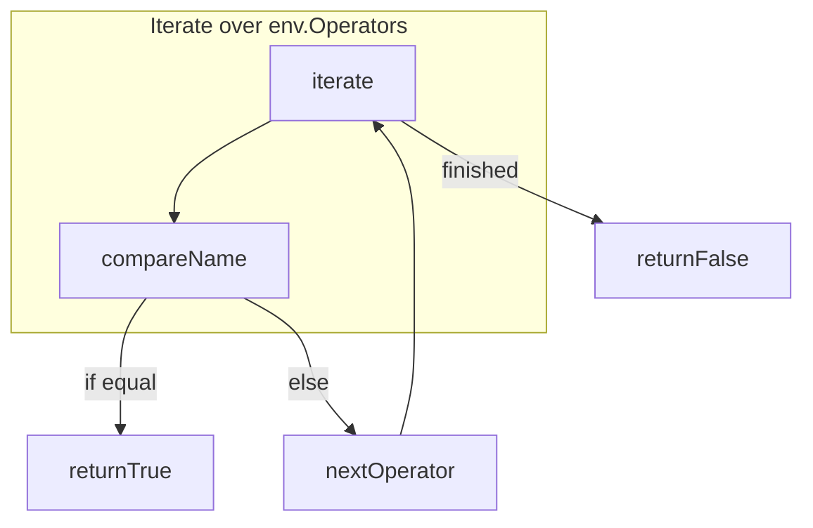

#### Function dependencies  

None – this function is currently not referenced elsewhere in the package.

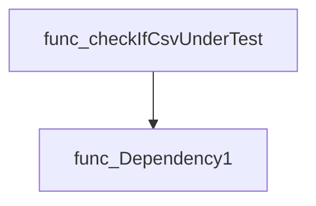

*(Note: no external function calls are made from `checkIfCsvUnderTest`.)*

#### Functions calling `checkIfCsvUnderTest`

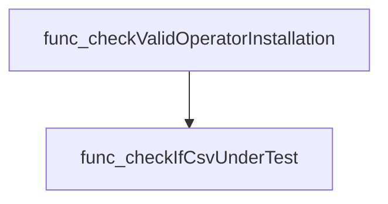

#### Usage example (Go)

```go
// Minimal example invoking checkIfCsvUnderTest
import (
    "github.com/redhat-best-practices-for-k8s/certsuite/tests/operator"
    v1alpha1 "github.com/operator-framework/api/pkg/operators/v1alpha1"
)

// Assume csv is a previously retrieved ClusterServiceVersion instance.
csv := &v1alpha1.ClusterServiceVersion{Name: "my-operator.v1.0.0"}
if operator.checkIfCsvUnderTest(csv) {
    fmt.Println("CSV is part of the test set.")
} else {
    fmt.Println("CSV is not under test.")
}
```

---

### checkValidOperatorInstallation

**checkValidOperatorInstallation** - Determines whether a namespace is dedicated to single‑ or multi‑namespaced operators, gathers lists of operator CSVs and pods that violate the expected installation rules, and reports any errors encountered.

#### Signature (Go)

```go
func checkValidOperatorInstallation(namespace string) (
    isDedicatedOperatorNamespace bool,
    singleOrMultiNamespaceOperators []string,
    nonSingleOrMultiNamespaceOperators []string,
    csvsTargetingNamespace []string,
    operatorsFoundButNotUnderTest []string,
    podsNotBelongingToOperators []string,
    err error)
```

#### Summary Table

| Aspect | Details |
|--------|---------|
| **Purpose** | Determines whether a namespace is dedicated to single‑ or multi‑namespaced operators, gathers lists of operator CSVs and pods that violate the expected installation rules, and reports any errors encountered. |
| **Parameters** | `namespace string` – the Kubernetes namespace under evaluation. |
| **Return value** | 1) `isDedicatedOperatorNamespace bool`: true if at least one single‑ or multi‑namespaced operator is installed in this namespace.<br>2) `singleOrMultiNamespaceOperators []string`: names of operators that satisfy single/multi installation criteria.<br>3) `nonSingleOrMultiNamespaceOperators []string`: names of operators whose install mode differs from the above.<br>4) `csvsTargetingNamespace []string`: CSVs targeting this namespace but installed elsewhere.<br>5) `operatorsFoundButNotUnderTest []string`: operator CSVs found in the namespace that are not part of the current test environment.<br>6) `podsNotBelongingToOperators []string`: pods present in the namespace that lack a valid operator owner.<br>7) `err error`: any error encountered during processing. |
| **Key dependencies** | • `getCsvsBy` – filters all CSVs to those in the target namespace.<br>• `strings.Split` – parses comma‑separated target namespaces.<br>• `checkIfCsvUnderTest` – checks if a CSV is part of the test environment.<br>• `isSingleNamespacedOperator`, `isMultiNamespacedOperator` – determine installation scope.<br>• `isCsvInNamespaceClusterWide` – identifies cluster‑wide operators.<br>• `findPodsNotBelongingToOperators` – lists pods without operator ownership. |
| **Side effects** | No global state mutation; only reads from the test environment (`env`). Produces error values but does not perform I/O or spawn goroutines. |
| **How it fits the package** | This helper supports tests that validate tenant namespace isolation for operators, ensuring that each namespace hosts only approved operator configurations and no stray pods. |

#### Internal workflow (Mermaid)

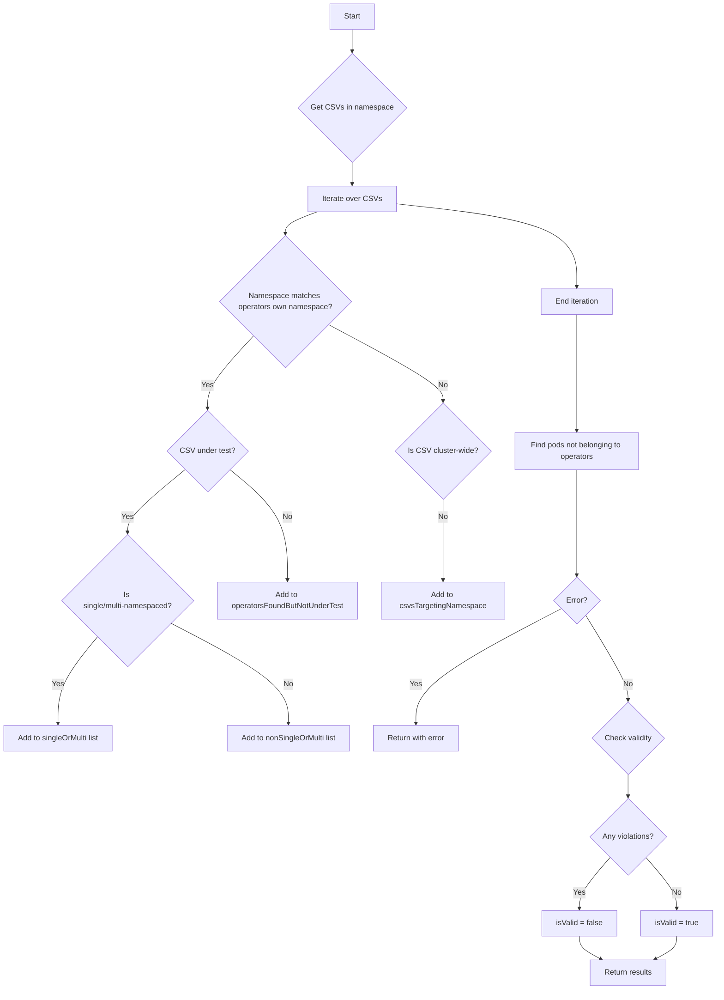

#### Function dependencies (Mermaid)

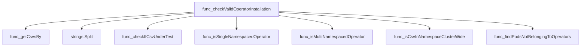

#### Functions calling `checkValidOperatorInstallation` (Mermaid)

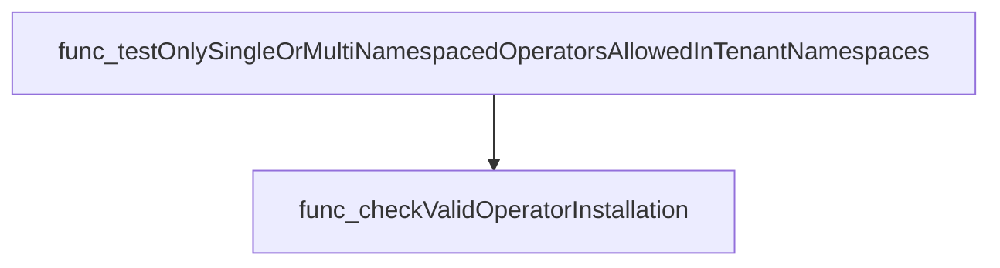

#### Usage example (Go)

```go
// Minimal example invoking checkValidOperatorInstallation
package main

import (
 "fmt"
 "github.com/redhat-best-practices-for-k8s/certsuite/tests/operator"
)

func main() {
 namespace := "tenant-namespace"

 isDedicated, singleOps, nonSingleOps,
  targetedCSVs, othersNotUnderTest, orphanPods, err :=
  operator.checkValidOperatorInstallation(namespace)

 if err != nil {
  fmt.Printf("Error checking namespace %s: %v\n", namespace, err)
  return
 }

 fmt.Printf("Namespace %s dedicated? %t\n", namespace, isDedicated)
 fmt.Printf("Single/multi‑namespaced ops: %v\n", singleOps)
 fmt.Printf("Non‑single/multi ops: %v\n", nonSingleOps)
 fmt.Printf("CSVs targeting namespace: %v\n", targetedCSVs)
 fmt.Printf("Operators not under test: %v\n", othersNotUnderTest)
 fmt.Printf("Orphan pods: %v\n", orphanPods)
}
```

---

### findPodsNotBelongingToOperators

**findPodsNotBelongingToOperators** - Returns the names of all pods within *namespace* that are not owned by any operator (ClusterServiceVersion) in that same namespace.

#### Signature (Go)

```go
func findPodsNotBelongingToOperators(namespace string) ([]string, error)
```

#### Summary Table

| Aspect | Details |
|--------|---------|
| **Purpose** | Returns the names of all pods within *namespace* that are not owned by any operator (ClusterServiceVersion) in that same namespace. |
| **Parameters** | `namespace` (string) – the Kubernetes namespace to inspect. |
| **Return value** | `[]string` – list of pod names lacking an operator owner; `error` – error from owner resolution or nil. |
| **Key dependencies** | • `getAllPodsBy(namespace, env.AllPods)` – filters all known pods to those in *namespace*.  <br>• `podhelper.GetPodTopOwner(pod.Namespace, pod.OwnerReferences)` – resolves the top‑level owners of a pod.<br>• Kubernetes API types (`v1alpha1.ClusterServiceVersionKind`). |
| **Side effects** | None; purely functional. No state mutation or I/O beyond reading global `env.AllPods`. |
| **How it fits the package** | Used by operator validation routines to ensure that every pod in a namespace is controlled by an operator, helping detect orphaned workloads. |

#### Internal workflow (Mermaid)

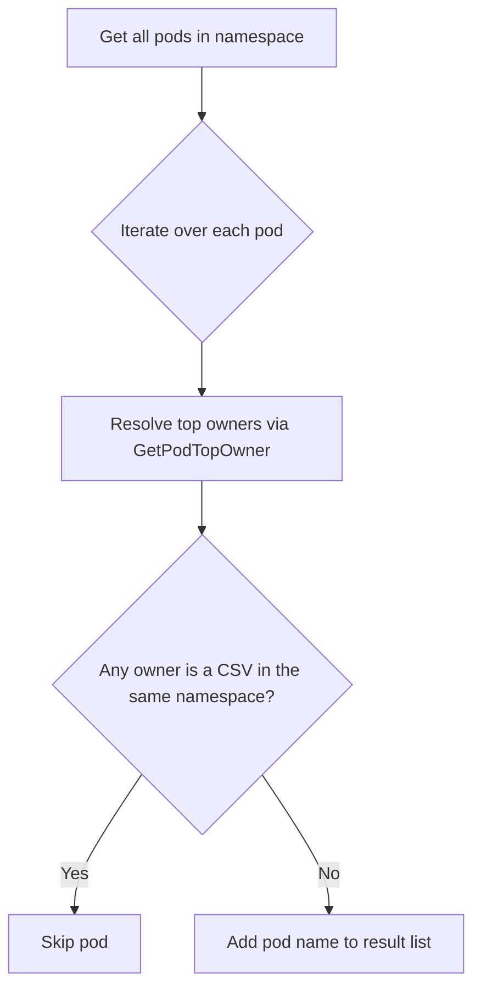

#### Function dependencies (Mermaid)

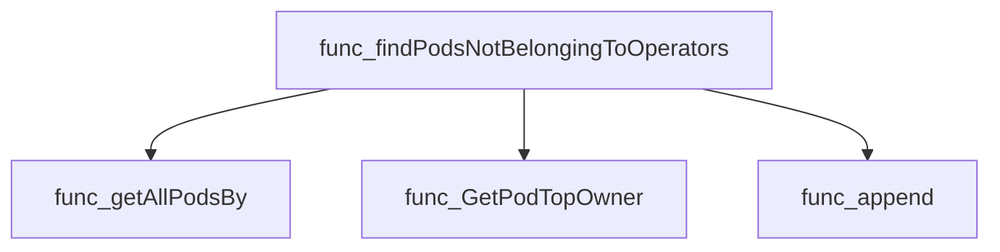

#### Functions calling `findPodsNotBelongingToOperators` (Mermaid)

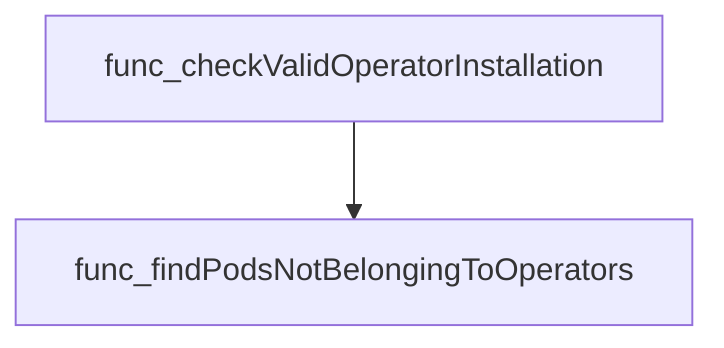

#### Usage example (Go)

```go
// Minimal example invoking findPodsNotBelongingToOperators
namespace := "my-operator-ns"
orphanedPods, err := findPodsNotBelongingToOperators(namespace)
if err != nil {
    log.Fatalf("error finding orphaned pods: %v", err)
}
fmt.Printf("Pods not owned by an operator in %s: %v\n", namespace, orphanedPods)
```

---

---

### getAllPodsBy

**getAllPodsBy** - Filters a slice of pod objects, returning only those whose `Namespace` field matches the supplied namespace.

#### Signature (Go)

```go
func getAllPodsBy(namespace string, allPods []*provider.Pod) (podsInNamespace []*provider.Pod)
```

#### Summary Table

| Aspect | Details |
|--------|---------|
| **Purpose** | Filters a slice of pod objects, returning only those whose `Namespace` field matches the supplied namespace. |
| **Parameters** | *`namespace`* – string; target namespace.<br>*`allPods`* – slice of pointers to `provider.Pod`; complete pod collection. |
| **Return value** | *`podsInNamespace`* – slice of pointers to `provider.Pod` that belong to the specified namespace. |
| **Key dependencies** | • `append` (built‑in) for accumulating results.<br>• Accesses `pod.Namespace`. |
| **Side effects** | None; pure function with no external state changes or I/O. |
| **How it fits the package** | Utility helper used by higher‑level functions to isolate pods of a given namespace before further processing (e.g., ownership checks). |

#### Internal workflow

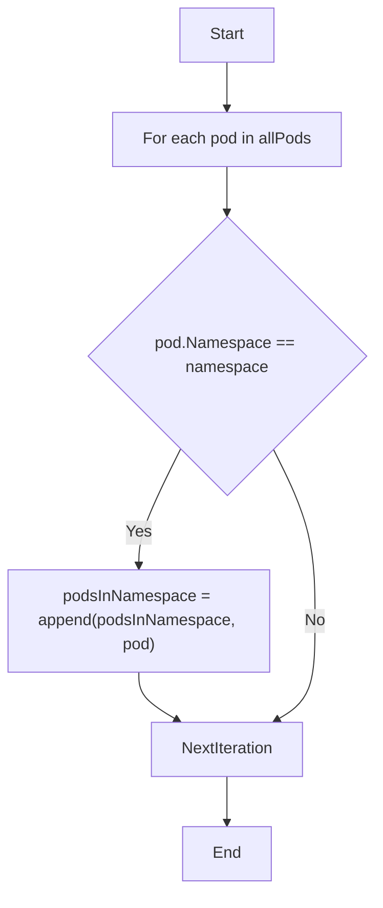

#### Function dependencies

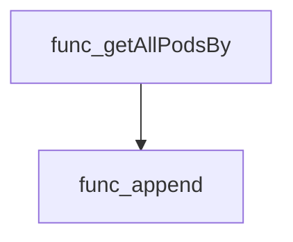

#### Functions calling `getAllPodsBy`

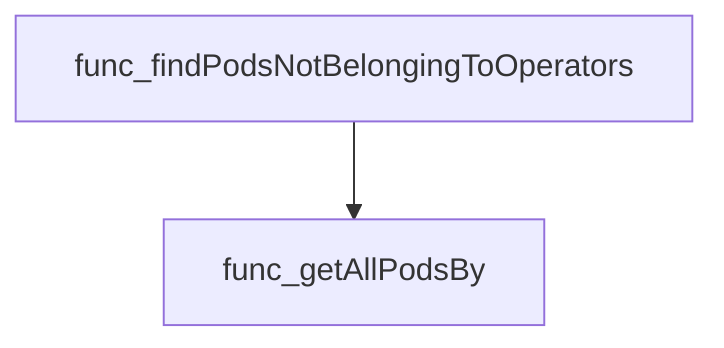

#### Usage example (Go)

```go
// Minimal example invoking getAllPodsBy
pods := []*provider.Pod{
    {Name: "pod1", Namespace: "dev"},
    {Name: "pod2", Namespace: "prod"},
}
namespace := "dev"
filtered := getAllPodsBy(namespace, pods)
// filtered now contains only pod1
```

---

### getCsvsBy

**getCsvsBy** - Filters a slice of `ClusterServiceVersion` objects, returning only those whose `Namespace` field matches the supplied namespace.

```go
func getCsvsBy(namespace string, allCsvs []*v1alpha1.ClusterServiceVersion) (csvsInNamespace []*v1alpha1.ClusterServiceVersion)
```

| Aspect | Details |
|--------|---------|
| **Purpose** | Filters a slice of `ClusterServiceVersion` objects, returning only those whose `Namespace` field matches the supplied namespace. |
| **Parameters** | - `namespace string` – Target namespace to filter by.<br>- `allCsvs []*v1alpha1.ClusterServiceVersion` – Complete list of CSVs to search through. |
| **Return value** | `csvsInNamespace []*v1alpha1.ClusterServiceVersion` – Slice containing all CSVs that belong to the specified namespace. |
| **Key dependencies** | • Calls the built‑in `append` function.<br>• Relies on the `ClusterServiceVersion.Namespace` field from the `k8s.io/api/operator/v1alpha1` package. |
| **Side effects** | None; purely functional, no mutation of input slices or external state. |
| **How it fits the package** | Supports operator validation by isolating CSVs relevant to a particular namespace before performing further checks. |

#### Internal workflow

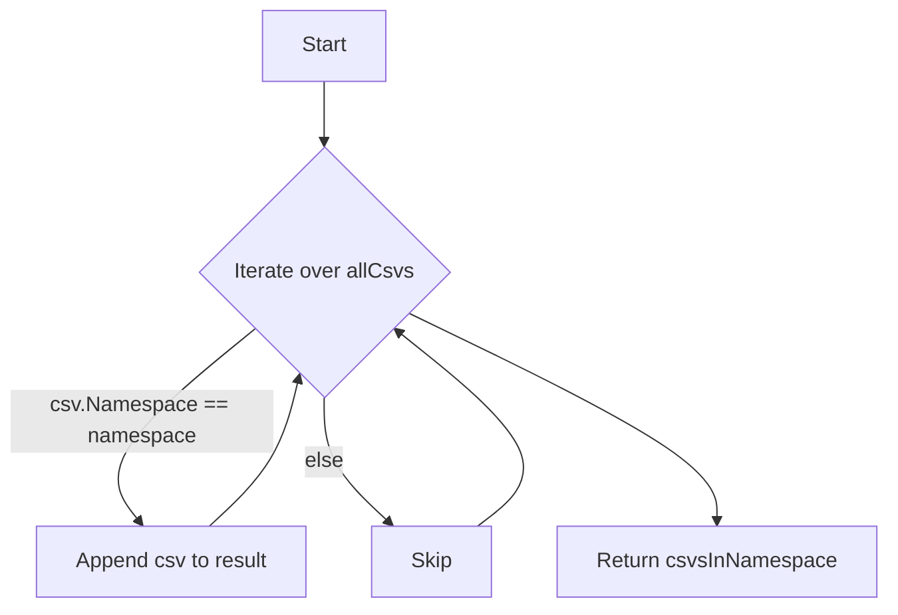

#### Function dependencies

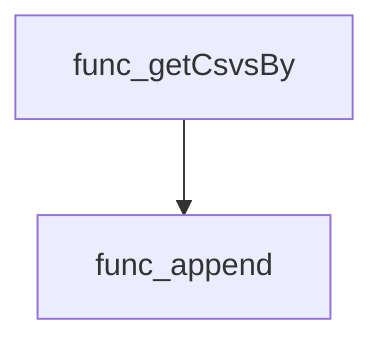

#### Functions calling `getCsvsBy`

```mermaid
graph TD
  func_checkValidOperatorInstallation --> func_getCsvsBy
```

#### Usage example (Go)

```go
// Minimal example invoking getCsvsBy
package main

import (
    v1alpha1 "k8s.io/api/operator/v1alpha1"
)

func main() {
    // Example CSV objects (normally obtained from the cluster)
    csv1 := &v1alpha1.ClusterServiceVersion{Namespace: "dev"}
    csv2 := &v1alpha1.ClusterServiceVersion{Namespace: "prod"}
    allCsvs := []*v1alpha1.ClusterServiceVersion{csv1, csv2}

    // Retrieve CSVs belonging to the "dev" namespace
    devCsvs := getCsvsBy("dev", allCsvs)

    // devCsvs now contains only csv1
}
```

---

### isCsvInNamespaceClusterWide

**isCsvInNamespaceClusterWide** - Checks whether the ClusterServiceVersion (CSV) identified by `csvName` targets every namespace in the cluster. It returns `true` if no specific target namespaces are annotated, indicating a cluster‑wide operator.

#### Signature (Go)

```go
func isCsvInNamespaceClusterWide(csvName string, allCsvs []*v1alpha1.ClusterServiceVersion) bool
```

#### Summary Table

| Aspect | Details |
|--------|---------|
| **Purpose** | Checks whether the ClusterServiceVersion (CSV) identified by `csvName` targets every namespace in the cluster. It returns `true` if no specific target namespaces are annotated, indicating a cluster‑wide operator. |
| **Parameters** | *`csvName`* `string` – Name of the CSV to inspect.<br>*`allCsvs`* `[]*v1alpha1.ClusterServiceVersion` – Slice containing all known CSV objects. |
| **Return value** | `bool` – `true` if the CSV is cluster‑wide; `false` otherwise. |
| **Key dependencies** | *Iteration over `allCsvs`.<br>* Access to each CSV’s `Annotations["olm.targetNamespaces"]`. |
| **Side effects** | None. The function only reads data and returns a value. |
| **How it fits the package** | Used by higher‑level validation logic (e.g., `checkValidOperatorInstallation`) to differentiate between cluster‑wide and namespace‑scoped operators when evaluating operator installation correctness. |

#### Internal workflow

```mermaid
flowchart TD
  A["Start"] --> B{"For each CSV in allCsvs"}
  B -->|"csv.Name == csvName"| C["Check annotations olm.targetNamespaces"]
  C -->|"exists && non‑empty"| D["Set isClusterWide = false & break"]
  C -->|"otherwise"| E["Continue loop"]
  B --> F("End")
  E --> F
```

#### Function dependencies

None – this function is currently not referenced elsewhere in the package.

#### Functions calling `isCsvInNamespaceClusterWide`

```mermaid
graph TD
  func_checkValidOperatorInstallation --> func_isCsvInNamespaceClusterWide
```

#### Usage example (Go)

```go
// Minimal example invoking isCsvInNamespaceClusterWide
package main

import (
 "fmt"

 "github.com/redhat-best-practices-for-k8s/certsuite/tests/operator"
 v1alpha1 "github.com/operator-framework/api/pkg/operators/v1alpha1"
)

func main() {
 // Assume we have a slice of CSV objects loaded elsewhere.
 var allCsvs []*v1alpha1.ClusterServiceVersion

 csvName := "example-operator.v0.1.0"

 if operator.IsCsvInNamespaceClusterWide(csvName, allCsvs) {
  fmt.Printf("CSV %s is cluster‑wide.\n", csvName)
 } else {
  fmt.Printf("CSV %s targets specific namespaces.\n", csvName)
 }
}
```

*Note:* The function itself is unexported (`isCsvInNamespaceClusterWide`). In the example, it is accessed via a hypothetical exported wrapper `operator.IsCsvInNamespaceClusterWide` for illustration purposes.

---

### isMultiNamespacedOperator

**isMultiNamespacedOperator** - Checks whether a given operator runs across more than one namespace while *excluding* its own namespace from the list of targets.

#### 1) Signature (Go)

```go
func isMultiNamespacedOperator(operatorNamespace string, targetNamespaces []string) bool
```

#### 2) Summary Table

| Aspect | Details |
|--------|---------|
| **Purpose** | Checks whether a given operator runs across more than one namespace while *excluding* its own namespace from the list of targets. |
| **Parameters** | `operatorNamespace string` – the namespace where the operator itself is installed.<br>`targetNamespaces []string` – namespaces declared in the CSV’s `olm.targetNamespaces` annotation. |
| **Return value** | `bool` – `true` if `len(targetNamespaces) > 1` and the operator’s own namespace is not among them; otherwise `false`. |
| **Key dependencies** | • `len` (builtin)<br>• `github.com/redhat-best-practices-for-k8s/certsuite/pkg/stringhelper.StringInSlice` |
| **Side effects** | None. Pure function – no state mutation or I/O. |
| **How it fits the package** | Used by operator validation logic to classify operators as *single‑or‑multi‑namespace* installations. |

#### 3) Internal workflow (Mermaid)

```mermaid
flowchart TD
  A["Start"] --> B{"len(targetNamespaces) > 1"}
  B -- No --> C["Return false"]
  B -- Yes --> D{"StringInSlice(targetNamespaces, operatorNamespace, false)"}
  D -- Yes --> C
  D -- No --> E["Return true"]
```

#### 4) Function dependencies (Mermaid)

```mermaid
graph TD
  func_isMultiNamespacedOperator --> builtin_len
  func_isMultiNamespacedOperator --> func_StringInSlice
```

#### 5) Functions calling `isMultiNamespacedOperator` (Mermaid)

```mermaid
graph TD
  func_checkValidOperatorInstallation --> func_isMultiNamespacedOperator
```

#### 6) Usage example (Go)

```go
package main

import (
 "fmt"
 "github.com/redhat-best-practices-for-k8s/certsuite/tests/operator"
)

func main() {
 operatorNS := "operators"
 targets   := []string{"dev", "prod", "operators"}

 if operator.isMultiNamespacedOperator(operatorNS, targets) {
  fmt.Println("This operator spans multiple namespaces.")
 } else {
  fmt.Println("Not a multi‑namespaced operator.")
 }
}
```

---

### isSingleNamespacedOperator

**isSingleNamespacedOperator** - Determines if the operator’s *olm.targetNamespaces* annotation specifies exactly one namespace that is different from the operator’s own namespace.

Checks whether an operator is intended for a single namespace that differs from its installation namespace.

#### Signature (Go)

```go
func isSingleNamespacedOperator(operatorNamespace string, targetNamespaces []string) bool
```

#### Summary Table

| Aspect | Details |
|--------|---------|
| **Purpose** | Determines if the operator’s *olm.targetNamespaces* annotation specifies exactly one namespace that is different from the operator’s own namespace. |
| **Parameters** | `operatorNamespace` (string) – Namespace where the CSV is installed.<br>`targetNamespaces` ([]string) – List of namespaces parsed from the CSV’s *olm.targetNamespaces* annotation. |
| **Return value** | `bool` – `true` if exactly one target namespace exists and it is not equal to the installation namespace; otherwise `false`. |
| **Key dependencies** | • `len` (built‑in) to count elements in `targetNamespaces`. |
| **Side effects** | None. Pure function. |
| **How it fits the package** | Used by `checkValidOperatorInstallation` to classify operators as single‑namespace or multi‑namespace installations during validation of operator deployments. |

#### Internal workflow (Mermaid)

```mermaid
flowchart TD
  A["Start"] --> B["Evaluate len(targetNamespaces)"]
  B --> C{"len == 1"}
  C -- "yes" --> D["Compare operatorNamespace vs targetNamespaces\\[0\\]"]
  D --> E{"operatorNamespace != targetNamespaces\\[0\\]"}
  E -- "yes" --> F["Return true"]
  E -- "no" --> G["Return false"]
  C -- "no" --> H["Return false"]
```

#### Function dependencies (Mermaid)

```mermaid
graph TD
  func_isSingleNamespacedOperator --> func_len
```

#### Functions calling `isSingleNamespacedOperator` (Mermaid)

```mermaid
graph TD
  func_checkValidOperatorInstallation --> func_isSingleNamespacedOperator
```

#### Usage example (Go)

```go
// Minimal example invoking isSingleNamespacedOperator
namespace := "operators"
targets := []string{"app-1"}
isSingle := isSingleNamespacedOperator(namespace, targets)
// isSingle == true because the operator runs in a different namespace than its target
```

---

### testMultipleSameOperators

**testMultipleSameOperators** - Validates that each operator’s CSV name appears only once across the cluster; reports compliance or non‑compliance.

#### 1) Signature (Go)

```go
func testMultipleSameOperators(check *checksdb.Check, env *provider.TestEnvironment)
```

#### 2) Summary Table

| Aspect | Details |
|--------|---------|
| **Purpose** | Validates that each operator’s CSV name appears only once across the cluster; reports compliance or non‑compliance. |
| **Parameters** | `check` – test framework check object to log and set results.<br>`env` – environment containing all discovered operators (`AllOperators`). |
| **Return value** | None (the result is stored in the `check` object). |
| **Key dependencies** | *`OperatorInstalledMoreThanOnce(op, op2)` – comparison helper.<br>* `testhelper.NewOperatorReportObject()` – creates a report entry.<br>*Logging helpers: `LogInfo`, `LogDebug`.<br>* `check.SetResult()` – finalises the test outcome. |
| **Side effects** | Logs diagnostic messages; mutates the internal state of `check` by setting result objects. No external I/O. |
| **How it fits the package** | Part of the *operator* test suite; ensures that OLM does not install duplicate CSVs, which would violate best practices. |

#### 3) Internal workflow (Mermaid)

```mermaid
flowchart TD
    start["Start"] --> logInfo["Log: Checking if operator is installed more than once"]
    logInfo --> forAllOps["For each operator op in env.AllOperators"]
    forAllOps --> logDebugOp["Log: Checking operator %q, op.Name"]
    forAllOps --> forAllOps2["For each operator op2 in env.AllOperators"]
    forAllOps2 --> compare["If OperatorInstalledMoreThanOnce(op, op2)"]
    compare -- Yes --> addNonCompliant["Append non‑compliant report object"]
    addNonCompliant --> breakLoop["Break inner loop"]
    compare -- No --> nextOp2["Continue inner loop"]
    forAllOps2 --> nextOp2
    forAllOps --> addCompliant["Append compliant report object"]
    addCompliant --> endLoop["End outer loop"]
    endLoop --> setResult["check.SetResult(compliantObjects, nonCompliantObjects)"]
    setResult --> finish["Finish"]
```

#### 4) Function dependencies (Mermaid)

```mermaid
graph TD
  func_testMultipleSameOperators --> func_OperatorInstalledMoreThanOnce
  func_testMultipleSameOperators --> func_NewOperatorReportObject
  func_testMultipleSameOperators --> func_SetResult
  func_testMultipleSameOperators --> func_LogInfo
  func_testMultipleSameOperators --> func_LogDebug
```

#### 5) Functions calling `testMultipleSameOperators` (Mermaid)

```mermaid
graph TD
  func_LoadChecks --> func_testMultipleSameOperators
```

#### 6) Usage example (Go)

```go
// Minimal example invoking testMultipleSameOperators
check := checksdb.NewCheck("TestID")
env := &provider.TestEnvironment{
    AllOperators: []*provider.Operator{ /* operators to evaluate */ },
}
testMultipleSameOperators(check, env)
```

---

### testOnlySingleOrMultiNamespacedOperatorsAllowedInTenantNamespaces

**testOnlySingleOrMultiNamespacedOperatorsAllowedInTenantNamespaces** - Validates that a namespace dedicated to operator installation contains only single or multi‑namespaced operators and no other operator artifacts (e.g., cluster‑wide CSVs, pods outside the operator’s scope).

#### Signature (Go)

```go
func testOnlySingleOrMultiNamespacedOperatorsAllowedInTenantNamespaces(check *checksdb.Check, env *provider.TestEnvironment)
```

#### Summary Table

| Aspect | Details |
|--------|---------|
| **Purpose** | Validates that a namespace dedicated to operator installation contains only single or multi‑namespaced operators and no other operator artifacts (e.g., cluster‑wide CSVs, pods outside the operator’s scope). |
| **Parameters** | `check *checksdb.Check` – test context used for logging and result reporting.<br>`env *provider.TestEnvironment` – execution environment holding namespaces, operators, and CSV data. |
| **Return value** | None (results are stored in the `check` via `SetResult`). |
| **Key dependencies** | • `LogInfo`, `LogError`, `SetResult` from `checksdb.Check`<br>• `fmt.Sprintf`, `strings.Join`<br>• `make`, `append` built‑ins<br>• `testhelper.NewNamespacedReportObject`<br>• `checkValidOperatorInstallation` (internal helper) |
| **Side effects** | Writes log entries, constructs report objects, and sets the test result on `check`. No external I/O beyond logging. |
| **How it fits the package** | Part of the Operator test suite; invoked by `LoadChecks` to enforce namespace‑specific operator installation rules in tenant environments. |

#### Internal workflow (Mermaid)

```mermaid
flowchart TD
  A["Gather operator namespaces"] --> B["Iterate each dedicated namespace"]
  B --> C{"Validate via checkValidOperatorInstallation"}
  C -->|"error"| D["Log error & create non‑compliant report"]
  C -->|"valid"| E{"Is dedicated?"}
  E -->|"yes"| F["Create compliant report"]
  E -->|"no"| G["Build detailed non‑compliant message"]
  G --> H["Add to non‑compliant list"]
  D & F & H --> I["SetResult(compliant, non‑compliant)"]
```

#### Function dependencies (Mermaid)

```mermaid
graph TD
  func_testOnlySingleOrMultiNamespacedOperatorsAllowedInTenantNamespaces --> func_checkValidOperatorInstallation
  func_testOnlySingleOrMultiNamespacedOperatorsAllowedInTenantNamespaces --> func_LogInfo
  func_testOnlySingleOrMultiNamespacedOperatorsAllowedInTenantNamespaces --> func_LogError
  func_testOnlySingleOrMultiNamespacedOperatorsAllowedInTenantNamespaces --> func_SetResult
  func_testOnlySingleOrMultiNamespacedOperatorsAllowedInTenantNamespaces --> func_NewNamespacedReportObject
```

#### Functions calling `testOnlySingleOrMultiNamespacedOperatorsAllowedInTenantNamespaces` (Mermaid)

```mermaid
graph TD
  func_LoadChecks --> func_testOnlySingleOrMultiNamespacedOperatorsAllowedInTenantNamespaces
```

#### Usage example (Go)

```go
// Minimal example invoking testOnlySingleOrMultiNamespacedOperatorsAllowedInTenantNamespaces
func ExampleTest() {
    env := provider.NewTestEnvironment()
    check := checksdb.NewCheck("operator-namespace-validation")
    testOnlySingleOrMultiNamespacedOperatorsAllowedInTenantNamespaces(check, &env)
    // Result is now stored in check.Result
}
```

---

### testOperatorCatalogSourceBundleCount

**testOperatorCatalogSourceBundleCount** - Validates that every catalog source used by an operator has a bundle count below 1,000. It logs results and records compliant/non‑compliant objects for reporting.

#### Signature (Go)

```go
func testOperatorCatalogSourceBundleCount(check *checksdb.Check, env *provider.TestEnvironment)
```

#### Summary Table

| Aspect | Details |
|--------|---------|
| **Purpose** | Validates that every catalog source used by an operator has a bundle count below 1,000. It logs results and records compliant/non‑compliant objects for reporting. |
| **Parameters** | `check *checksdb.Check` – test context; `env *provider.TestEnvironment` – environment snapshot containing operators, catalog sources, package manifests, and OpenShift version. |
| **Return value** | none (void) |
| **Key dependencies** | • `log.Info`, `log.Debug`, `log.Error` – structured logging<br>• `semver.NewVersion` – parse OCP version<br>• `strconv.Itoa` – convert int to string<br>• `stringhelper.StringInSlice` – check slice membership<br>• `provider.GetCatalogSourceBundleCount` – obtain bundle count for a catalog source<br>• `testhelper.NewCatalogSourceReportObject` – create report objects |
| **Side effects** | Emits log messages, populates `compliantObjects`/`nonCompliantObjects`, and calls `check.SetResult`. No external I/O beyond logging. |
| **How it fits the package** | Part of the operator test suite; executed during the *CatalogSourceBundleCount* check to enforce a best‑practice limit on catalog source bundle references. |

#### Internal workflow (Mermaid)

```mermaid
flowchart TD
  A["Start"] --> B{"Is OCP <= 4.12?"}
  B -- Yes --> C["Set ocp412Skip = true"]
  B -- No --> D["ocp412Skip remains false"]
  C & D --> E["Iterate over env.Operators"]
  E --> F["For each operator, iterate over env.AllPackageManifests"]
  F --> G{"Should skip PM?"}
  G -- Yes --> H["Continue to next PM"]
  G -- No --> I["Find matching catalog source in env.AllCatalogSources"]
  I --> J{"Already reported?"}
  J -- Yes --> K["Skip"]
  J -- No --> L["Get bundle count via provider.GetCatalogSourceBundleCount"]
  L --> M{"bundleCount == -1?"}
  M -- Yes --> N["Record non‑compliant error"]
  M -- No --> O{"bundleCount > limit?"}
  O -- Yes --> P["Record non‑compliant"]
  O -- No --> Q["Record compliant"]
  K & P & Q --> R["Mark catalog source as reported"]
  R --> S["Break inner loops if checked"]
  E --> T["End of operators loop"]
  T --> U["check.SetResult(compliantObjects, nonCompliantObjects)"]
  U --> V["Finish"]
```

#### Function dependencies (Mermaid)

```mermaid
graph TD
  func_testOperatorCatalogSourceBundleCount --> log.Info
  func_testOperatorCatalogSourceBundleCount --> semver.NewVersion
  func_testOperatorCatalogSourceBundleCount --> strconv.Itoa
  func_testOperatorCatalogSourceBundleCount --> stringhelper.StringInSlice
  func_testOperatorCatalogSourceBundleCount --> provider.GetCatalogSourceBundleCount
  func_testOperatorCatalogSourceBundleCount --> testhelper.NewCatalogSourceReportObject
```

#### Functions calling `testOperatorCatalogSourceCatalogSourceBundleCount` (Mermaid)

```mermaid
graph TD
  LoadChecks --> testOperatorCatalogSourceBundleCount
```

#### Usage example (Go)

```go
// Minimal example invoking testOperatorCatalogSourceBundleCount
import (
    "github.com/redhat-best-practices-for-k8s/certsuite/pkg/checksdb"
    "github.com/redhat-best-practices-for-k8s/certsuite/pkg/provider"
)

// Assume `check` and `env` are already initialized.
func runExample() {
    check := checksdb.NewCheck(nil)          // placeholder; normally created by the test framework
    env   := provider.TestEnvironment{}      // populated with operators, catalog sources, etc.
    testOperatorCatalogSourceBundleCount(check, &env)
}
```

---

---

### testOperatorCrdOpenAPISpec

**testOperatorCrdOpenAPISpec** - Validates that each Custom Resource Definition (CRD) managed by an operator declares an OpenAPI v3 schema in its spec.

#### Signature (Go)

```go
func testOperatorCrdOpenAPISpec(check *checksdb.Check, env *provider.TestEnvironment)
```

#### Summary Table

| Aspect | Details |
|--------|---------|
| **Purpose** | Validates that each Custom Resource Definition (CRD) managed by an operator declares an OpenAPI v3 schema in its spec. |
| **Parameters** | `check *checksdb.Check` – the test context; `env *provider.TestEnvironment` – environment containing the CRDs to evaluate |
| **Return value** | None (the function records results via `check.SetResult`) |
| **Key dependencies** | • `openapi.IsCRDDefinedWithOpenAPI3Schema(crd)`<br>• `testhelper.NewOperatorReportObject(...)`<br>• `check.LogInfo`, `check.SetResult` |
| **Side effects** | Appends report objects to the check result; logs diagnostic information |
| **How it fits the package** | One of several operator‑specific checks in the `operator` test suite, ensuring CRD schema compliance. |

#### Internal workflow (Mermaid)

```mermaid
flowchart TD
  A["Start"] --> B{"Iterate over env.Crds"}
  B -->|"CRD has OpenAPI v3"| C["Log success"]
  C --> D["Create compliant report object"]
  B -->|"No OpenAPI v3"| E["Log failure"]
  E --> F["Create non‑compliant report object"]
  D & F --> G["Append to respective list"]
  G --> H["SetResult(compliant, nonCompliant)"]
  H --> I["End"]
```

#### Function dependencies (Mermaid)

```mermaid
graph TD
  func_testOperatorCrdOpenAPISpec --> func_LogInfo
  func_testOperatorCrdOpenAPISpec --> openapi_IsCRDDefinedWithOpenAPI3Schema
  func_testOperatorCrdOpenAPISpec --> testhelper_NewOperatorReportObject
  func_testOperatorCrdOpenAPISpec --> func_SetResult
```

#### Functions calling `testOperatorCrdOpenAPISpec` (Mermaid)

```mermaid
graph TD
  func_LoadChecks --> func_testOperatorCrdOpenAPISpec
```

#### Usage example (Go)

```go
// Minimal example invoking testOperatorCrdOpenAPISpec
import (
    "github.com/redhat-best-practices-for-k8s/certsuite/tests/operator"
    "github.com/redhat-best-practices-for-k8s/certsuite/tests/provider"
    "github.com/redhat-best-practices-for-k8s/certsuite/tests/checksdb"
)

func main() {
    // Assume check and env are already created by the test harness
    var check *checksdb.Check
    var env *provider.TestEnvironment

    operator.testOperatorCrdOpenAPISpec(check, env)
}
```

---

### testOperatorCrdVersioning

**testOperatorCrdVersioning** - Ensures every Custom Resource Definition (CRD) provided by an Operator follows Kubernetes‑style version naming (`v<major>[alpha/beta]…`).

#### Signature (Go)

```go
func testOperatorCrdVersioning(check *checksdb.Check, env *provider.TestEnvironment)
```

#### Summary Table

| Aspect | Details |
|--------|---------|
| **Purpose** | Ensures every Custom Resource Definition (CRD) provided by an Operator follows Kubernetes‑style version naming (`v<major>[alpha/beta]…`). |
| **Parameters** | `check *checksdb.Check` – test context for logging and result aggregation. <br> `env *provider.TestEnvironment` – environment containing the list of CRDs to examine. |
| **Return value** | None (results are recorded via `check.SetResult`). |
| **Key dependencies** | • `check.LogInfo`, `check.LogDebug`, `check.LogError` – logging.<br>• `github.com/redhat-best-practices-for-k8s/certsuite/pkg/versions.IsValidK8sVersion` – version validation regex.<br>• `testhelper.NewOperatorReportObject` – creates per‑CRD compliance reports.<br>• `check.SetResult` – stores compliant/non‑compliant lists. |
| **Side effects** | Logs diagnostic information; mutates the internal state of `check` by setting its result objects. No external I/O or concurrency. |
| **How it fits the package** | Part of the Operator test suite, specifically registered in `LoadChecks`. It verifies that Operators expose CRDs with proper semantic versioning, a requirement for Kubernetes compatibility. |

#### Internal workflow (Mermaid)

```mermaid
flowchart TD
  A["Start"] --> B{"Iterate over env.Crds"}
  B --> C["Set doesUseK8sVersioning=true"]
  B --> D["nonCompliantVersion="]
  C --> E{"For each crd.Spec.Versions"}
  E --> F["Get versionName"]
  E --> G{"IsValidK8sVersion(versionName)"}
  G -- true --> H["Continue loop"]
  G -- false --> I["doesUseK8sVersioning=false, nonCompliantVersion=versionName, break"]
  H --> J["End inner loop"]
  J --> K{"doesUseK8sVersioning"}
  K -- true --> L["LogInfo, append compliantObjects"]
  K -- false --> M["LogError, append nonCompliantObjects"]
  L --> N["Next crd"]
  M --> N
  N --> O["End outer loop"]
  O --> P["check.SetResult(compliantObjects, nonCompliantObjects)"]
```

#### Function dependencies (Mermaid)

```mermaid
graph TD
  func_testOperatorCrdVersioning --> func_LogInfo
  func_testOperatorCrdVersioning --> func_LogDebug
  func_testOperatorCrdVersioning --> func_IsValidK8sVersion
  func_testOperatorCrdVersioning --> func_NewOperatorReportObject
  func_testOperatorCrdVersioning --> func_LogError
  func_testOperatorCrdVersioning --> func_SetResult
```

#### Functions calling `testOperatorCrdVersioning` (Mermaid)

```mermaid
graph TD
  func_LoadChecks --> func_testOperatorCrdVersioning
```

#### Usage example (Go)

```go
// Minimal example invoking testOperatorCrdVersioning
check := checksdb.NewCheck("example-id")
env := &provider.TestEnvironment{
    Crds: []*crdv1.CustomResourceDefinition{ /* populated CRDs */ },
}
testOperatorCrdVersioning(check, env)
// After execution, check.Result holds compliant and non‑compliant objects.
```

---

### testOperatorInstallationAccessToSCC

**testOperatorInstallationAccessToSCC** - Verifies that none of an operator’s cluster permissions grant access to Security Context Constraints (SCCs). Operators with such rules are flagged as non‑compliant.

#### Signature (Go)

```go
func testOperatorInstallationAccessToSCC(check *checksdb.Check, env *provider.TestEnvironment)
```

#### Summary Table

| Aspect | Details |
|--------|---------|
| **Purpose** | Verifies that none of an operator’s cluster permissions grant access to Security Context Constraints (SCCs). Operators with such rules are flagged as non‑compliant. |
| **Parameters** | `check *checksdb.Check` – test context for logging and result handling.<br>`env *provider.TestEnvironment` – environment containing the list of operators under test. |
| **Return value** | None (results are stored via `check.SetResult`). |
| **Key dependencies** | • `LogDebug`, `LogInfo` (logging)<br>• `len`, `append` (built‑in utilities)<br>• `testhelper.NewOperatorReportObject` (creates compliance reports)<br>• `access.PermissionsHaveBadRule` (logic that detects SCC rules)<br>• `check.SetResult` (stores the final outcome) |
| **Side effects** | Mutates internal result slices, logs diagnostic information, but does not alter the input environment. |
| **How it fits the package** | Part of the operator test suite; invoked by `LoadChecks` to enforce best‑practice security checks on installed operators. |

#### Internal workflow

```mermaid
flowchart TD
  start([Start]) --> iterate["Iterate over env.Operators"]
  iterate --> checkPerms{"clusterPermissions empty?"}
  checkPerms -- Yes --> noPerms["No clusterPermissions"]
  noPerms --> createCompliant["Create compliant report (no rules)"]
  createCompliant --> continueLoop["Continue loop"]
  checkPerms -- No --> badRuleCheck["access.PermissionsHaveBadRule"]
  badRuleCheck -- True --> nonCompliant["Create non‑compliant report"]
  badRuleCheck -- False --> compliant["Create compliant report"]
  nonCompliant --> continueLoop
  compliant --> continueLoop
  continueLoop --> endLoop([End loop])
  endLoop --> setResult["check.SetResult"]
```

#### Function dependencies

```mermaid
graph TD
  func_testOperatorInstallationAccessToSCC --> LogDebug
  func_testOperatorInstallationAccessToSCC --> len
  func_testOperatorInstallationAccessToSCC --> LogInfo
  func_testOperatorInstallationAccessToSCC --> append
  func_testOperatorInstallationAccessToSCC --> testhelper.NewOperatorReportObject
  func_testOperatorInstallationAccessToSCC --> access.PermissionsHaveBadRule
  func_testOperatorInstallationAccessToSCC --> check.SetResult
```

#### Functions calling `testOperatorInstallationAccessToSCC`

```mermaid
graph TD
  LoadChecks --> testOperatorInstallationAccessToSCC
```

#### Usage example (Go)

```go
// Minimal example invoking testOperatorInstallationAccessToSCC
func runExample() {
    // Assume check and env are already initialized.
    var check *checksdb.Check
    var env *provider.TestEnvironment

    // Invoke the function to perform SCC access checks.
    testOperatorInstallationAccessToSCC(check, env)

    // Results can be retrieved from `check`.
}
```

---

### testOperatorInstallationPhaseSucceeded

**testOperatorInstallationPhaseSucceeded** - Verifies every operator in the test environment has reached the *Succeeded* status and records compliance results.

#### Signature (Go)

```go
func testOperatorInstallationPhaseSucceeded(check *checksdb.Check, env *provider.TestEnvironment)
```

#### Summary Table

| Aspect | Details |
|--------|---------|
| **Purpose** | Verifies every operator in the test environment has reached the *Succeeded* status and records compliance results. |
| **Parameters** | `check *checksdb.Check` – test check object used for logging and result aggregation.<br>`env *provider.TestEnvironment` – environment containing a list of operators to evaluate. |
| **Return value** | None (void). Result is stored via `check.SetResult`. |
| **Key dependencies** | • `phasecheck.WaitOperatorReady(csv)` – polls operator status.<br>• `testhelper.NewOperatorReportObject(...)` – creates report entries.<br>• Logging functions (`LogInfo`, `LogError`). |
| **Side effects** | *Logs* progress and errors.<br>*Updates* the check’s result with compliant/non‑compliant operator reports. |
| **How it fits the package** | Implements a core test for operator installation status within the `operator` test suite; called by `LoadChecks`. |

#### Internal workflow (Mermaid)

```mermaid
flowchart TD
  A["Start"] --> B{"Iterate over env.Operators"}
  B -->|"For each op"| C["Log “Testing Operator …”"]
  C --> D{"WaitOperatorReady(op.Csv)"}
  D -- true --> E["Log “Operator … is in Succeeded phase”"]
  E --> F["Create compliant ReportObject"]
  D -- false --> G["Log “Operator … not in Succeeded phase”"]
  G --> H["Create non‑compliant ReportObject"]
  F & H --> I["Append to respective list"]
  I --> B
  B --> J{"All operators processed?"}
  J --> K["check.SetResult(compliant, nonCompliant)"]
  K --> L["End"]
```

#### Function dependencies (Mermaid)

```mermaid
graph TD
  func_testOperatorInstallationPhaseSucceeded --> phasecheck.WaitOperatorReady
  func_testOperatorInstallationPhaseSucceeded --> testhelper.NewOperatorReportObject
  func_testOperatorInstallationPhaseSucceeded --> check.LogInfo
  func_testOperatorInstallationPhaseSucceeded --> check.LogError
```

#### Functions calling `testOperatorInstallationPhaseSucceeded` (Mermaid)

```mermaid
graph TD
  func_LoadChecks --> func_testOperatorInstallationPhaseSucceeded
```

#### Usage example (Go)

```go
// Minimal example invoking testOperatorInstallationPhaseSucceeded
func ExampleTestOperatorInstallation() {
    // Assume we have a populated TestEnvironment and a Check instance.
    env := &provider.TestEnvironment{
        Operators: []operatorInfo{ /* operators to test */ },
    }
    check := checksdb.NewCheck("operator-installation-status")
    testOperatorInstallationPhaseSucceeded(check, env)

    // Results can be inspected via check.GetResult() or similar API.
}
```

---

### testOperatorOlmSkipRange

**testOperatorOlmSkipRange** - Confirms every operator in the test environment includes an `olm.skipRange` annotation on its ClusterServiceVersion (CSV).

#### Signature (Go)

```go
func testOperatorOlmSkipRange(check *checksdb.Check, env *provider.TestEnvironment) 
```

#### Summary Table

| Aspect | Details |
|--------|---------|
| **Purpose** | Confirms every operator in the test environment includes an `olm.skipRange` annotation on its ClusterServiceVersion (CSV). |
| **Parameters** | `check *checksdb.Check` – current check context; `env *provider.TestEnvironment` – snapshot of operators under test. |
| **Return value** | None (side‑effect only) |
| **Key dependencies** | • `LogInfo`, `LogError` on the check<br>• `testhelper.NewOperatorReportObject` for report objects<br>• `SetResult` to record compliant/non‑compliant results |
| **Side effects** | Logs informational or error messages; populates result slices via `SetResult`; no external I/O. |
| **How it fits the package** | Part of the Operator test suite, executed when the `TestOperatorOlmSkipRange` check is triggered. |

#### Internal workflow (Mermaid)

```mermaid
flowchart TD
  A["Start"] --> B{"Iterate env.Operators"}
  B --> C["Log operator name"]
  C --> D{"Check olm.skipRange present?"}
  D -- Yes --> E["Create compliant report object<br>Add field olm.SkipRange"]
  D -- No --> F["Create non‑compliant report object"]
  E --> G
  F --> G
  G --> H["SetResult(compliant, nonCompliant)"]
```

#### Function dependencies (Mermaid)

```mermaid
graph TD
  testOperatorOlmSkipRange --> LogInfo
  testOperatorOlmSkipRange --> LogError
  testOperatorOlmSkipRange --> NewOperatorReportObject
  testOperatorOlmSkipRange --> SetResult
```

#### Functions calling `testOperatorOlmSkipRange` (Mermaid)

```mermaid
graph TD
  LoadChecks --> testOperatorOlmSkipRange
```

#### Usage example (Go)

```go
// Minimal example invoking testOperatorOlmSkipRange
func example() {
    // Assume check and env are prepared elsewhere
    var check *checksdb.Check
    var env *provider.TestEnvironment

    testOperatorOlmSkipRange(check, env)
}
```

---

### testOperatorOlmSubscription

**testOperatorOlmSubscription** - Checks whether every operator in the environment has an OLM subscription; records compliant and non‑compliant results.

#### Signature (Go)

```go
func testOperatorOlmSubscription(check *checksdb.Check, env *provider.TestEnvironment) {}
```

#### Summary Table

| Aspect | Details |
|--------|---------|
| **Purpose** | Checks whether every operator in the environment has an OLM subscription; records compliant and non‑compliant results. |
| **Parameters** | `check *checksdb.Check` – test context for logging and result setting.<br>`env *provider.TestEnvironment` – runtime data including the list of operators to inspect. |
| **Return value** | None (side‑effects only). |
| **Key dependencies** | • `LogInfo`, `LogError`<br>• `append` (slice operation)<br>• `AddField` on report objects<br>• `testhelper.NewOperatorReportObject`<br>• `check.SetResult` |
| **Side effects** | • Writes log messages.<br>• Mutates two slices (`compliantObjects`, `nonCompliantObjects`).<br>• Sets the check result via `SetResult`. |
| **How it fits the package** | Part of the Operator test suite; invoked by `LoadChecks` to verify OLM‑based installation compliance. |

#### Internal workflow (Mermaid)

```mermaid
flowchart TD
  A["Start"] --> B{"For each operator in env.Operators"}
  B -->|"SubscriptionName empty?"| C["Log error & add non‑compliant object"]
  B -->|"Has subscription"| D["Log info & add compliant object"]
  C --> E["Add SubscriptionName field"]
  D --> F["Add SubscriptionName field"]
  E --> G{"Next operator?"}
  F --> G
  G -->|"Yes"| B
  G -->|"No"| H["SetResult(compliant, noncompliant)"]
```

#### Function dependencies (Mermaid)

```mermaid
graph TD
  func_testOperatorOlmSubscription --> LogInfo
  func_testOperatorOlmSubscription --> LogError
  func_testOperatorOlmSubscription --> append
  func_testOperatorOlmSubscription --> AddField
  func_testOperatorOlmSubscription --> testhelper.NewOperatorReportObject
  func_testOperatorOlmSubscription --> SetResult
```

#### Functions calling `testOperatorOlmSubscription` (Mermaid)

```mermaid
graph TD
  LoadChecks --> testOperatorOlmSubscription
```

#### Usage example (Go)

```go
// Minimal example invoking testOperatorOlmSubscription
import (
    "github.com/redhat-best-practices-for-k8s/certsuite/tests/operator/checksdb"
    "github.com/redhat-best-practices-for-k8s/certsuite/tests/operator/provider"
)

func main() {
    check := checksdb.NewCheck("example-id")
    env   := &provider.TestEnvironment{
        Operators: []provider.Operator{
            {Namespace:"ns1", Name:"op1", SubscriptionName:"sub-1"},
            {Namespace:"ns2", Name:"op2", SubscriptionName:""},
        },
    }
    testOperatorOlmSubscription(check, env)
}
```

---

### testOperatorPodsNoHugepages

**testOperatorPodsNoHugepages** - Verifies that none of the operator‑managed pods request huge page memory. If a pod requests huge pages it is marked non‑compliant; otherwise it is compliant.

#### Signature (Go)

```go
func testOperatorPodsNoHugepages(check *checksdb.Check, env *provider.TestEnvironment)
```

#### Summary Table

| Aspect | Details |
|--------|---------|
| **Purpose** | Verifies that none of the operator‑managed pods request huge page memory. If a pod requests huge pages it is marked non‑compliant; otherwise it is compliant. |
| **Parameters** | `check *checksdb.Check` – test check context for logging and result reporting.<br>`env *provider.TestEnvironment` – environment containing CSV‑to‑pod mappings (`CSVToPodListMap`). |
| **Return value** | None (the function records results via `check.SetResult`). |
| **Key dependencies** | • `SplitCsv(csv string) CsvResult` – parses a CSV key into namespace and name.<br>• `logInfo`, `logError` – logging helpers from the check context.<br>• `HasHugepages() bool` – pod method that reports huge page usage.<br>• `testhelper.NewPodReportObject(...)` – constructs a report object for a pod.<br>• `check.SetResult(compliant, nonCompliant)` – finalises the test outcome. |
| **Side effects** | • Emits log messages for each CSV and pod examined.<br>• Creates and stores compliance/non‑compliance report objects in the check’s result set.<br>No external I/O or concurrency is performed. |
| **How it fits the package** | Part of the Operator test suite; called by `LoadChecks` to register the “Pods no hugepages” check for all operator installations. |

#### Internal workflow (Mermaid)

```mermaid
flowchart TD
  A["Start"] --> B{"Iterate over CSV→PodList"}
  B -->|"for each csv, pods"| C["Parse CSV"]
  C --> D{"For each pod"}
  D -->|"HasHugepages()"| E["Log error & add non‑compliant"]
  D -->|"!HasHugepages()"| F["Log info & add compliant"]
  E --> G
  F --> G
  G --> H["SetResult(compliant, nonCompliant)"]
  H --> I["End"]
```

#### Function dependencies (Mermaid)

```mermaid
graph TD
  func_testOperatorPodsNoHugepages --> SplitCsv
  func_testOperatorPodsNoHugepages --> LogInfo
  func_testOperatorPodsNoHugepages --> HasHugepages
  func_testOperatorPodsNoHugepages --> LogError
  func_testOperatorPodsNoHugepages --> testhelper.NewPodReportObject
  func_testOperatorPodsNoHugepages --> SetResult
```

#### Functions calling `testOperatorPodsNoHugepages` (Mermaid)

```mermaid
graph TD
  LoadChecks --> testOperatorPodsNoHugepages
```

#### Usage example (Go)

```go
// Minimal example invoking testOperatorPodsNoHugepages
check := checksdb.NewCheck("operator-pods-no-hugepages")
env   := provider.NewTestEnvironment() // populated with CSVToPodListMap

testOperatorPodsNoHugepages(check, env)

// After execution, check.Result contains compliant and non‑compliant pod reports.
```

---

### testOperatorSemanticVersioning

**testOperatorSemanticVersioning** - Validates that every operator in the test environment has a version string that conforms to [Semantic Versioning](https://semver.org/).

#### Signature (Go)

```go
func (*checksdb.Check, *provider.TestEnvironment)()
```

#### Summary Table

| Aspect | Details |
|--------|---------|
| **Purpose** | Validates that every operator in the test environment has a version string that conforms to [Semantic Versioning](https://semver.org/). |
| **Parameters** | `check *checksdb.Check` – test context for logging and result reporting. <br>`env *provider.TestEnvironment` – execution environment containing the list of operators. |
| **Return value** | None (side‑effect only). |
| **Key dependencies** | • `check.LogInfo`, `check.LogError` – logging.<br>• `versions.IsValidSemanticVersion` – semantic‑version validation.<br>• `testhelper.NewOperatorReportObject` – report object construction.<br>• `check.SetResult` – final result aggregation. |
| **Side effects** | • Logs informational and error messages.<br>• Builds slices of compliant/non‑compliant `*ReportObject`s.<br>• Stores results via `SetResult`. No external I/O or concurrency. |
| **How it fits the package** | Part of the operator test suite; invoked by `LoadChecks` to provide a check named *TestOperatorHasSemanticVersioning*. |

#### Internal workflow (Mermaid)

```mermaid
flowchart TD
  Start --> LogStart["LogInfo: Starting testOperatorSemanticVersioning"]
  Start --> Iterate["For each operator in env.Operators"]
  Iterate --> Validate["IsValidSemanticVersion(operator.Version)?"]
  Validate -- Yes --> Compliant["Add to compliantObjects"]
  Validate -- No --> NonCompliant["Add to nonCompliantObjects"]
  Compliant --> LogComp["LogInfo: Operator has a valid semantic version"]
  NonCompliant --> LogErr["LogError: Operator has an invalid semantic version"]
  End --> SetResult["SetResult(compliant, nonCompliant)"]
```

#### Function dependencies (Mermaid)

```mermaid
graph TD
  testOperatorSemanticVersioning --> LogInfo
  testOperatorSemanticVersioning --> IsValidSemanticVersion
  testOperatorSemanticVersioning --> NewOperatorReportObject
  testOperatorSemanticVersioning --> SetResult
```

#### Functions calling `testOperatorSemanticVersioning` (Mermaid)

```mermaid
graph TD
  LoadChecks --> testOperatorSemanticVersioning
```

#### Usage example (Go)

```go
// Minimal example invoking testOperatorSemanticVersioning
check := checksdb.NewCheck("example")
env := &provider.TestEnvironment{Operators: []operator.Operator{
    {Namespace: "default", Name: "foo-operator", Version: "1.2.3"},
}}
testOperatorSemanticVersioning(check, env)
```

---

### testOperatorSingleCrdOwner

**testOperatorSingleCrdOwner** - Ensures every CRD declared in the environment’s operators is owned by a single operator. If multiple operators own the same CRD name, the check flags it as non‑compliant.

#### Signature (Go)

```go
func testOperatorSingleCrdOwner(check *checksdb.Check, env *provider.TestEnvironment)
```

#### Summary Table

| Aspect | Details |
|--------|---------|
| **Purpose** | Ensures every CRD declared in the environment’s operators is owned by a single operator. If multiple operators own the same CRD name, the check flags it as non‑compliant. |
| **Parameters** | `check *checksdb.Check` – test context for logging and result storage; `<env> *provider.TestEnvironment` – collection of installed operators and their CSV specifications. |
| **Return value** | None (side effects via `check.SetResult`). |
| **Key dependencies** | • `log` methods (`LogInfo`, `LogError`, `LogDebug`) <br>• `strings.Join` <br>• `testhelper.NewCrdReportObject` and its `AddField` method <br>• `check.SetResult` |
| **Side effects** | Generates report objects, logs diagnostic messages, and sets the check result. |
| **How it fits the package** | Part of the operator test suite; invoked by `LoadChecks` to validate CRD ownership rules in a Kubernetes cluster. |

#### Internal workflow (Mermaid)

```mermaid
flowchart TD
  A["Iterate over env.Operators"] --> B["Collect unique owned CRDs per operator"]
  B --> C["Add operator name to crdOwners map"]
  C --> D["Iterate over crdOwners"]
  D -->|"len > 1"| E["Log error, create non‑compliant report object"]
  D -->|"len == 1"| F["Log debug, create compliant report object"]
  E & F --> G["Append to respective slice"]
  G --> H["SetResult(compliantObjects, nonCompliantObjects)"]
```

#### Function dependencies (Mermaid)

```mermaid
graph TD
  func_testOperatorSingleCrdOwner --> testhelper.NewCrdReportObject
  func_testOperatorSingleCrdOwner --> strings.Join
  func_testOperatorSingleCrdOwner --> check.SetResult
  func_testOperatorSingleCrdOwner --> log.LogInfo
  func_testOperatorSingleCrdOwner --> log.LogError
  func_testOperatorSingleCrdOwner --> log.LogDebug
```

#### Functions calling `testOperatorSingleCrdOwner` (Mermaid)

```mermaid
graph TD
  LoadChecks --> testOperatorSingleCrdOwner
```

#### Usage example (Go)

```go
// Minimal example invoking testOperatorSingleCrdOwner
func ExampleTestOperatorSingleCrdOwner() {
    env := &provider.TestEnvironment{ /* populate Operators slice */ }
    check := checksdb.NewCheck("operator-crd-ownership")
    testOperatorSingleCrdOwner(check, env)
    // After execution, inspect check.Result for compliance status.
}
```

---

---
