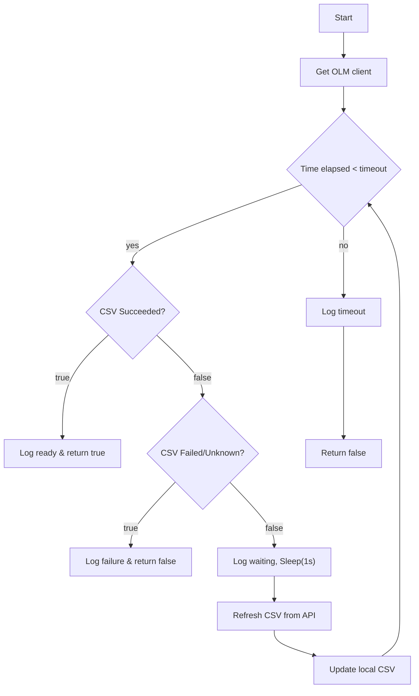
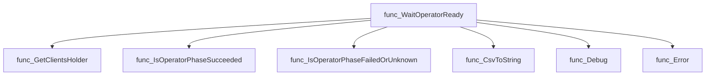
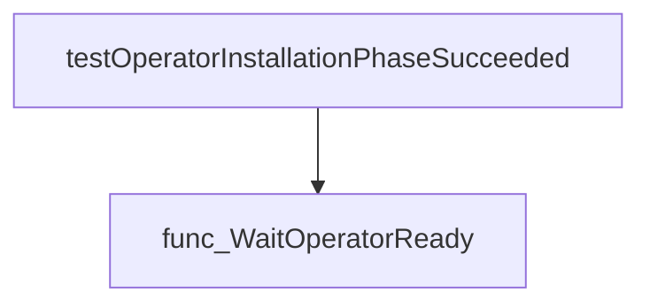
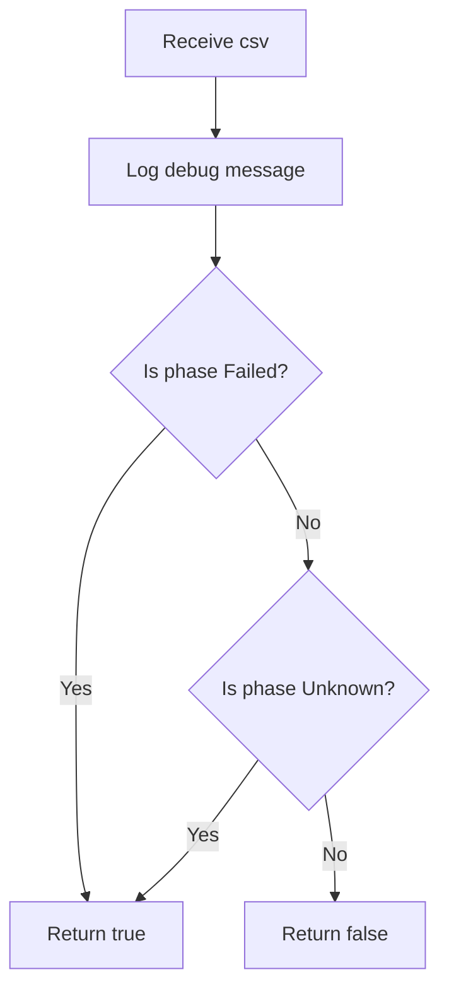
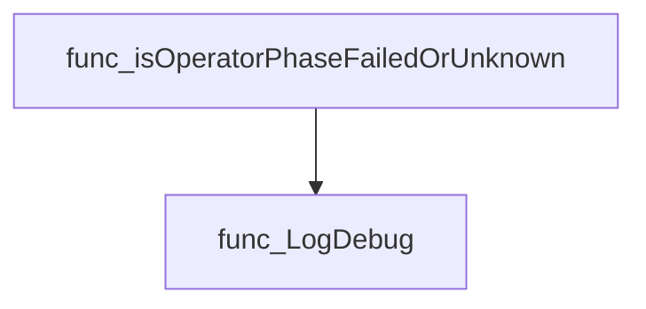
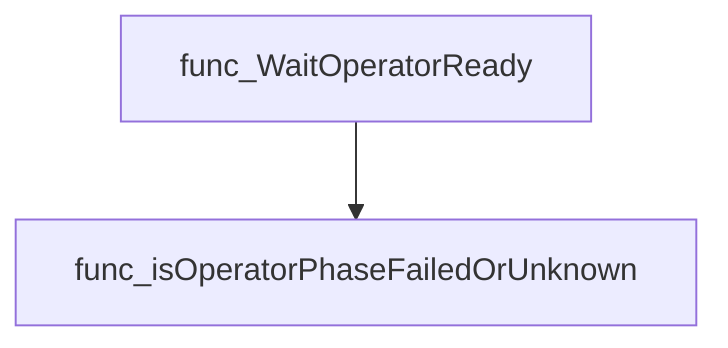
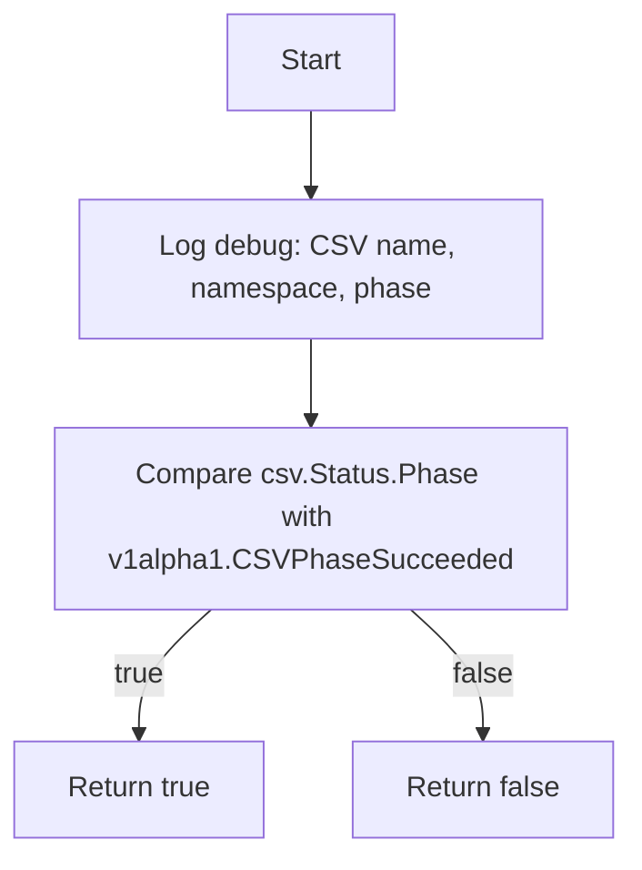
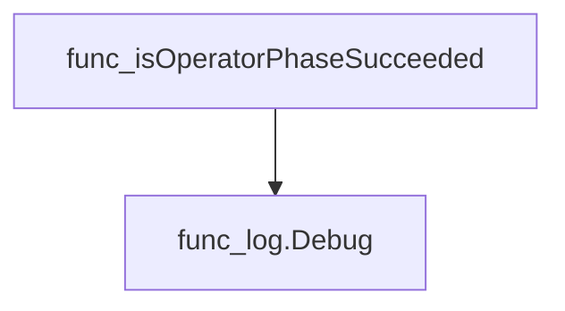
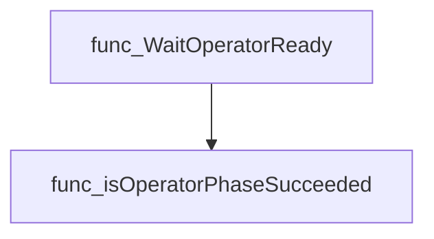

# Package phasecheck

**Path**: `tests/operator/phasecheck`

## Table of Contents

- [Overview](#overview)
- [Exported Functions](#exported-functions)
  - [WaitOperatorReady](#waitoperatorready)
- [Local Functions](#local-functions)
  - [isOperatorPhaseFailedOrUnknown](#isoperatorphasefailedorunknown)
  - [isOperatorPhaseSucceeded](#isoperatorphasesucceeded)

## Overview

The phasecheck package provides utilities to monitor the lifecycle of an Operator’s ClusterServiceVersion (CSV). It repeatedly polls the CSV status until it reaches a terminal state—either Succeeded or a failure/unknown condition—and reports success or terminates with an error.

### Key Features

- WaitOperatorReady – blocks until the CSV is in Succeeded, failed, or unknown, respecting a timeout and retry interval.
- isOperatorPhaseSucceeded – helper that checks if the CSV’s phase equals CSVPhaseSucceeded.
- isOperatorPhaseFailedOrUnknown – helper that detects terminal failure or uncertainty states.

### Design Notes

- A constant timeout (hidden) governs how long polling will continue before giving up.
- Polling uses context cancellation and sleeps between attempts to avoid busy‑waiting.
- The package logs each check, aiding debugging when the operator stalls or fails.

### Exported Functions Summary

| Name | Purpose |
|------|----------|
| [func WaitOperatorReady(csv *v1alpha1.ClusterServiceVersion) bool](#waitoperatorready) | Polls the CSV until it is in `Succeeded` or terminates on failure/timeout. |

### Local Functions Summary

| Name | Purpose |
|------|----------|
| [func isOperatorPhaseFailedOrUnknown(csv *v1alpha1.ClusterServiceVersion) bool](#isoperatorphasefailedorunknown) | Checks whether the given `ClusterServiceVersion` (CSV) has entered a terminal state indicating failure or uncertainty. It returns `true` if the CSV’s phase is either *Failed* or *Unknown*. |
| [func (*v1alpha1.ClusterServiceVersion) bool](#isoperatorphasesucceeded) | Determines if the CSV status phase equals `v1alpha1.CSVPhaseSucceeded`. |

## Exported Functions

### WaitOperatorReady

**WaitOperatorReady** - Polls the CSV until it is in `Succeeded` or terminates on failure/timeout.

Checks whether an Operator’s ClusterServiceVersion (CSV) reaches the **Succeeded** phase within a configured timeout.

---

#### Signature (Go)

```go
func WaitOperatorReady(csv *v1alpha1.ClusterServiceVersion) bool
```

---

#### Summary Table

| Aspect | Details |
|--------|---------|
| **Purpose** | Polls the CSV until it is in `Succeeded` or terminates on failure/timeout. |
| **Parameters** | `csv *v1alpha1.ClusterServiceVersion` – the CSV to monitor. |
| **Return value** | `bool`: `true` if the CSV reached `Succeeded`; `false` otherwise (failed phase, error fetching CSV, or timeout). |
| **Key dependencies** | • `clientsholder.GetClientsHolder()`<br>• `time.Now()`, `time.Since()`, `time.Sleep()`<br>• `isOperatorPhaseSucceeded(csv)`<br>• `isOperatorPhaseFailedOrUnknown(csv)`<br>• `provider.CsvToString(csv)`<br>• `log.Debug(...)`, `log.Error(...)` |
| **Side effects** | • Logs debug and error messages.<br>• Periodically refreshes the CSV via the OLM client to capture updated status. |
| **How it fits the package** | Used by tests in the *phasecheck* package to assert that an Operator installation has completed successfully before proceeding with further checks. |

---

#### Internal workflow (Mermaid)



---

#### Function dependencies (Mermaid)



---

#### Functions calling `WaitOperatorReady` (Mermaid)



---

#### Usage example (Go)

```go
// Minimal example invoking WaitOperatorReady
import (
    "github.com/redhat-best-practices-for-k8s/certsuite/tests/operator/phasecheck"
    olmapi "github.com/operator-framework/api/pkg/operators/v1alpha1"
)

func main() {
    // Assume csv is obtained from somewhere (e.g., test environment)
    var csv *olmapi.ClusterServiceVersion
    ready := phasecheck.WaitOperatorReady(csv)
    if ready {
        fmt.Println("Operator is ready")
    } else {
        fmt.Println("Operator failed to become ready")
    }
}
```

---

---

## Local Functions

### isOperatorPhaseFailedOrUnknown

**isOperatorPhaseFailedOrUnknown** - Checks whether the given `ClusterServiceVersion` (CSV) has entered a terminal state indicating failure or uncertainty. It returns `true` if the CSV’s phase is either *Failed* or *Unknown*.

#### Signature (Go)

```go
func isOperatorPhaseFailedOrUnknown(csv *v1alpha1.ClusterServiceVersion) bool
```

#### Summary Table

| Aspect | Details |
|--------|---------|
| **Purpose** | Checks whether the given `ClusterServiceVersion` (CSV) has entered a terminal state indicating failure or uncertainty. It returns `true` if the CSV’s phase is either *Failed* or *Unknown*. |
| **Parameters** | `csv *v1alpha1.ClusterServiceVersion` – pointer to the CSV whose status is inspected. |
| **Return value** | `bool` – `true` when `csv.Status.Phase` equals `v1alpha1.CSVPhaseFailed` or `v1alpha1.CSVPhaseUnknown`; otherwise `false`. |
| **Key dependencies** | • Calls `log.Debug()` from the internal logging package to emit diagnostic information. <br>• Relies on constants `CSVPhaseFailed` and `CSVPhaseUnknown` defined in `github.com/redhat-best-practices-for-k8s/certsuite/internal/v1alpha1`. |
| **Side effects** | None beyond logging; does not modify the CSV or any external state. |
| **How it fits the package** | Part of the operator phase‑checking utilities (`phasecheck` package). It is used by `WaitOperatorReady` to decide whether to abort waiting when a CSV cannot progress to *Succeeded*. |

#### Internal workflow (Mermaid)



#### Function dependencies (Mermaid)



#### Functions calling `isOperatorPhaseFailedOrUnknown` (Mermaid)



#### Usage example (Go)

```go
// Minimal example invoking isOperatorPhaseFailedOrUnknown
import (
 "github.com/redhat-best-practices-for-k8s/certsuite/internal/v1alpha1"
)

func main() {
 csv := &v1alpha1.ClusterServiceVersion{
  Status: v1alpha1.CSVStatus{Phase: v1alpha1.CSVPhaseFailed},
 }
 if isOperatorPhaseFailedOrUnknown(csv) {
  fmt.Println("CSV is in a failed or unknown state.")
 } else {
  fmt.Println("CSV is still progressing.")
 }
}
```

---

### isOperatorPhaseSucceeded

**isOperatorPhaseSucceeded** - Determines if the CSV status phase equals `v1alpha1.CSVPhaseSucceeded`.

Checks whether a given ClusterServiceVersion (CSV) has reached the **Succeeded** phase.

---

#### Signature (Go)

```go
func (*v1alpha1.ClusterServiceVersion) bool
```

---

#### Summary Table

| Aspect | Details |
|--------|---------|
| **Purpose** | Determines if the CSV status phase equals `v1alpha1.CSVPhaseSucceeded`. |
| **Parameters** | `csv *v1alpha1.ClusterServiceVersion` – pointer to a CSV object. |
| **Return value** | `bool` – `true` when `csv.Status.Phase == v1alpha1.CSVPhaseSucceeded`, otherwise `false`. |
| **Key dependencies** | • `log.Debug` from `github.com/redhat-best-practices-for-k8s/certsuite/internal/log`<br>• Constant `v1alpha1.CSVPhaseSucceeded` |
| **Side effects** | Logs a debug message; no mutation of the CSV or external state. |
| **How it fits the package** | Used by `WaitOperatorReady` to poll the readiness of an operator’s CSV during tests. |

---

#### Internal workflow (Mermaid)



---

#### Function dependencies (Mermaid)



---

#### Functions calling `isOperatorPhaseSucceeded` (Mermaid)



---

#### Usage example (Go)

```go
// Minimal example invoking isOperatorPhaseSucceeded
package main

import (
 "fmt"

 v1alpha1 "github.com/operator-framework/api/pkg/operators/v1alpha1"
)

func main() {
 csv := &v1alpha1.ClusterServiceVersion{
  Status: v1alpha1.ClusterServiceVersionStatus{Phase: v1alpha1.CSVPhaseSucceeded},
 }
 if isOperatorPhaseSucceeded(csv) {
  fmt.Println("CSV has succeeded")
 } else {
  fmt.Println("CSV not yet succeeded")
 }
}
```

---
