# Package performance

**Path**: `tests/performance`

## Table of Contents

- [Overview](#overview)
- [Exported Functions](#exported-functions)
  - [LoadChecks](#loadchecks)
- [Local Functions](#local-functions)
  - [filterProbeProcesses](#filterprobeprocesses)
  - [getExecProbesCmds](#getexecprobescmds)
  - [testExclusiveCPUPool](#testexclusivecpupool)
  - [testLimitedUseOfExecProbes](#testlimiteduseofexecprobes)
  - [testRtAppsNoExecProbes](#testrtappsnoexecprobes)
  - [testSchedulingPolicyInCPUPool](#testschedulingpolicyincpupool)

## Overview

The `performance` package registers a set of runtime checks that validate CNF workloads against performance‑related requirements such as CPU scheduling policies, exclusive CPU pool usage and limits on exec probes. It is intended to be used by the CertSuite test runner when evaluating CNFs for compliance with performance guidelines.

### Key Features

- Registers multiple checks via `LoadChecks`, automatically attaching setup and skip logic based on pod characteristics
- Validates that containers without host PID isolation do not run exec probes while any process uses a real‑time policy
- Ensures pods containing both exclusive‑CPU and shared‑CPU assignments are flagged as non‑compliant

### Design Notes

- Check registration is performed once; subsequent test runs reuse the shared checks database
- Skip functions are generated dynamically to avoid running irrelevant checks for certain pod types
- The package relies heavily on helper utilities (e.g., `testhelper` and `scheduling`) which abstract complex Kubernetes interactions

### Exported Functions Summary

| Name | Purpose |
|------|----------|
| [func LoadChecks()](#loadchecks) | Registers a set of performance‑related tests in the shared checks DB, attaching setup logic and skip conditions for each check. |

### Local Functions Summary

| Name | Purpose |
|------|----------|
| [func filterProbeProcesses(allProcesses []*crclient.Process, cut *provider.Container) (notExecProbeProcesses []*crclient.Process, compliantObjects []*testhelper.ReportObject)](#filterprobeprocesses) | Removes processes that are part of a container’s exec probes and returns the remaining processes along with report objects for the excluded ones. |
| [func getExecProbesCmds(c *provider.Container) map[string]bool](#getexecprobescmds) | Builds a lookup table of the exact command lines that are executed by any `exec` probe (`liveness`, `readiness`, or `startup`) configured in a container. The keys are normalized command strings, and the values are always `true`. |
| [func testExclusiveCPUPool(check *checksdb.Check, env *provider.TestEnvironment)](#testexclusivecpupool) | Detect pods containing containers that mix exclusive‑CPU and shared‑CPU assignments; flag such pods as non‑compliant. |
| [func testLimitedUseOfExecProbes(*checksdb.Check, *provider.TestEnvironment)()](#testlimiteduseofexecprobes) | Ensures that a CNF does not exceed the allowed number of exec probes and that each probe’s `PeriodSeconds` is ≥ 10 seconds. |
| [func testRtAppsNoExecProbes(check *checksdb.Check, env *provider.TestEnvironment)](#testrtappsnoexecprobes) | Ensures that containers lacking host PID isolation do not execute exec probes while any process is scheduled with a real‑time policy. It reports compliance or non‑compliance for each container and its processes. |
| [func testSchedulingPolicyInCPUPool(check *checksdb.Check, env *provider.TestEnvironment,  podContainers []*provider.Container, schedulingType string) ()](#testschedulingpolicyincpupool) | Ensures that every process inside each container’s PID namespace satisfies the CPU scheduling policy specified by `schedulingType`. It records compliant and non‑compliant processes in the test result. |

## Exported Functions

### LoadChecks

**LoadChecks** - Registers a set of performance‑related tests in the shared checks DB, attaching setup logic and skip conditions for each check.

#### Signature (Go)

```go
func LoadChecks()
```

#### Summary Table

| Aspect | Details |
|--------|---------|
| **Purpose** | Registers a set of performance‑related tests in the shared checks DB, attaching setup logic and skip conditions for each check. |
| **Parameters** | none |
| **Return value** | none |
| **Key dependencies** | • `log.Debug` – logs loading activity.<br>• `checksdb.NewChecksGroup`, `.WithBeforeEachFn`, `.Add`<br>• `identifiers.GetTestIDAndLabels` – resolves test IDs and tags.<br>• `testhelper.GetNoPodsUnderTestSkipFn` – provides skip function when no pods are present.<br>• Individual test functions (`testExclusiveCPUPool`, `testRtAppsNoExecProbes`, etc.)<br>• Skip helpers (`skipIfNoGuaranteedPodContainersWithExclusiveCPUs`, …) |
| **Side effects** | • Populates the checks database with a new group keyed by `common.PerformanceTestKey`. <br>• Configures each check’s skip logic and execution function. <br>• Emits debug logs. |
| **How it fits the package** | Part of the `performance` test suite; called by `pkg/certsuite.LoadInternalChecksDB` to aggregate all internal checks during initialization. |

#### Internal workflow (Mermaid)

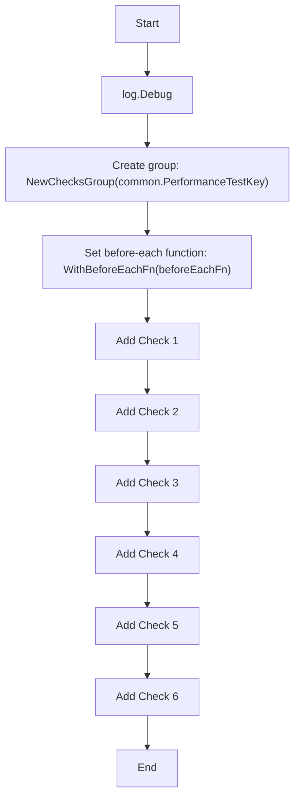

#### Function dependencies (Mermaid)

```mermaid
graph TD
  func_LoadChecks --> log_Debug
  func_LoadChecks --> checksdb_NewChecksGroup
  func_LoadChecks --> checksdb_Check_WithBeforeEachFn
  func_LoadChecks --> checksdb_Check_Add
  func_LoadChecks --> identifiers_GetTestIDAndLabels
  func_LoadChecks --> testhelper_GetNoPodsUnderTestSkipFn
  func_LoadChecks --> testExclusiveCPUPool
  func_LoadChecks --> testRtAppsNoExecProbes
  func_LoadChecks --> testSchedulingPolicyInCPUPool
  func_LoadChecks --> skipIfNoGuaranteedPodContainersWithExclusiveCPUs
  func_LoadChecks --> skipIfNoNonGuaranteedPodContainersWithoutHostPID
  func_LoadChecks --> skipIfNoGuaranteedPodContainersWithIsolatedCPUsWithoutHostPID
```

#### Functions calling `LoadChecks` (Mermaid)

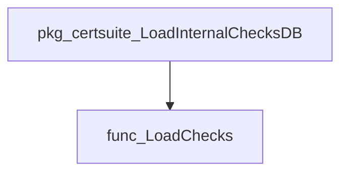

#### Usage example (Go)

```go
// In the package initialization phase
func init() {
    // Load all performance checks into the shared database.
    performance.LoadChecks()
}
```

---

## Local Functions

### filterProbeProcesses

**filterProbeProcesses** - Removes processes that are part of a container’s exec probes and returns the remaining processes along with report objects for the excluded ones.

#### 1) Signature (Go)

```go
func filterProbeProcesses(allProcesses []*crclient.Process, cut *provider.Container) (notExecProbeProcesses []*crclient.Process, compliantObjects []*testhelper.ReportObject)
```

#### 2) Summary Table

| Aspect | Details |
|--------|---------|
| **Purpose** | Removes processes that are part of a container’s exec probes and returns the remaining processes along with report objects for the excluded ones. |
| **Parameters** | `allProcesses []*crclient.Process` – list of all running processes in the container.<br>`cut *provider.Container` – container metadata (namespace, pod name, etc.). |
| **Return value** | `notExecProbeProcesses []*crclient.Process` – processes that are not part of exec probes.<br>`compliantObjects []*testhelper.ReportObject` – report objects describing each excluded process. |
| **Key dependencies** | - `getExecProbesCmds(cut)`<br>- `strings.Join`, `strings.Fields`<br>- `strconv.Itoa`<br>- `slices.Contains`<br>- `testhelper.NewContainerReportObject`<br>- `AddField` (on report objects) |
| **Side effects** | No mutation of input slices; creates new report objects. No I/O or concurrency. |
| **How it fits the package** | Used by performance tests to isolate processes that should not be evaluated for real‑time scheduling when exec probes are defined. |

#### 3) Internal workflow (Mermaid)

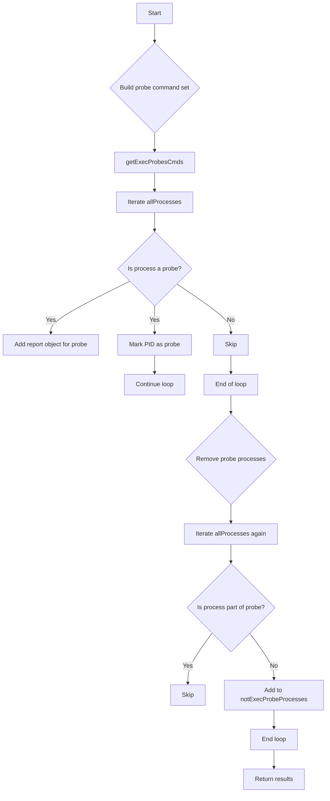

#### 4) Function dependencies (Mermaid)

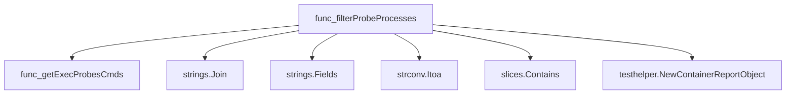

#### 5) Functions calling `filterProbeProcesses` (Mermaid)

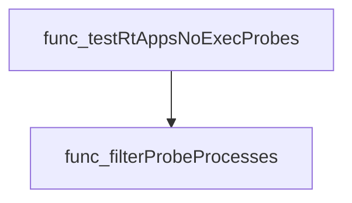

#### 6) Usage example (Go)

```go
// Minimal example invoking filterProbeProcesses
import (
    "github.com/redhat-best-practices-for-k8s/certsuite/pkg/crclient"
    "github.com/redhat-best-practices-for-k8s/certsuite/tests/performance/provider"
    "github.com/redhat-best-practices-for-k8s/certsuite/pkg/testhelper"
)

func example() {
    // Assume processes and container are obtained elsewhere
    var allProcesses []*crclient.Process
    var cut *provider.Container

    notExec, reports := filterProbeProcesses(allProcesses, cut)

    fmt.Println("Processes excluded by exec probes:", len(reports))
    fmt.Println("Remaining processes to evaluate:", len(notExec))
}
```

---

### getExecProbesCmds

**getExecProbesCmds** - Builds a lookup table of the exact command lines that are executed by any `exec` probe (`liveness`, `readiness`, or `startup`) configured in a container. The keys are normalized command strings, and the values are always `true`.

#### Signature (Go)

```go
func getExecProbesCmds(c *provider.Container) map[string]bool
```

#### Summary Table

| Aspect | Details |
|--------|---------|
| **Purpose** | Builds a lookup table of the exact command lines that are executed by any `exec` probe (`liveness`, `readiness`, or `startup`) configured in a container. The keys are normalized command strings, and the values are always `true`. |
| **Parameters** | `c *provider.Container –` the container whose probes are inspected. |
| **Return value** | `map[string]bool –` a map where each key is a probe command string and the corresponding value is `true`. |
| **Key dependencies** | • `strings.Join` (to concatenate slice elements)<br>• `strings.Fields` (to split and rejoin for normalization) |
| **Side effects** | None. The function performs pure computation without mutating input or external state. |
| **How it fits the package** | Used by higher‑level filtering logic (`filterProbeProcesses`) to identify processes that belong to probe execution, allowing them to be excluded from security checks. |

#### Internal workflow (Mermaid)

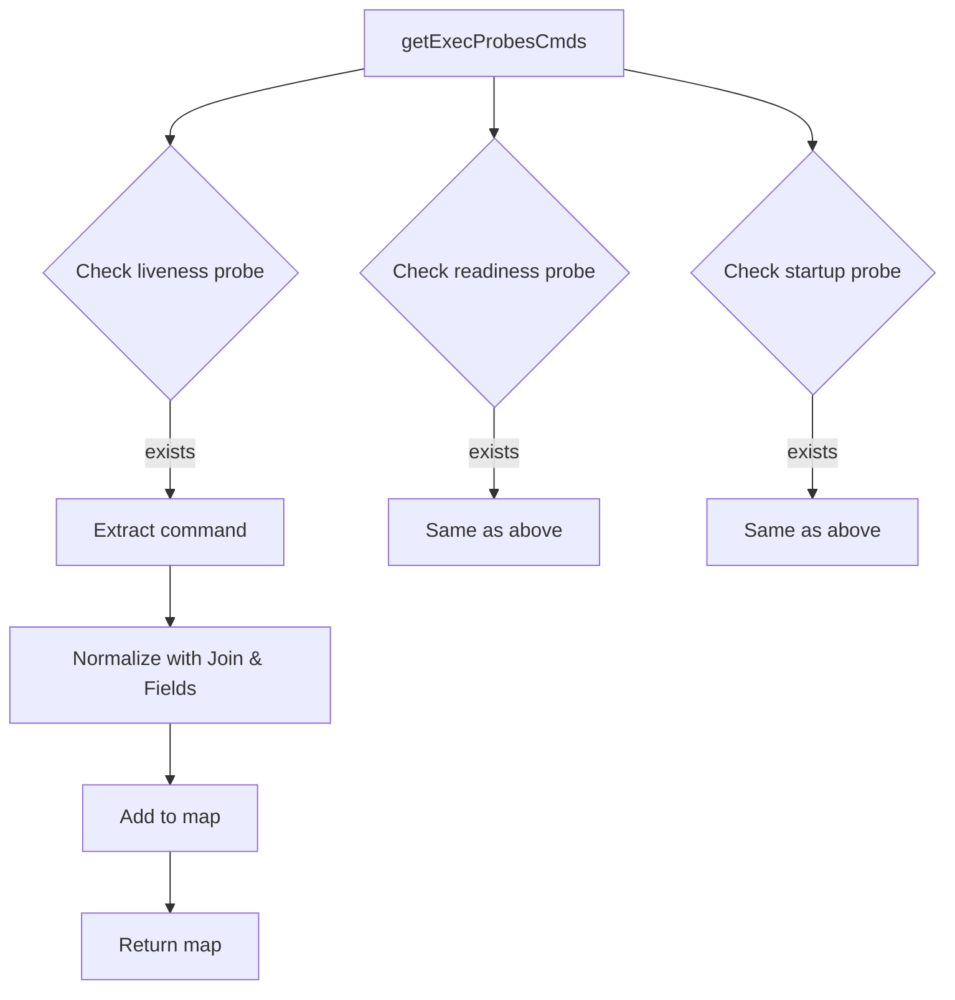

#### Function dependencies (Mermaid)

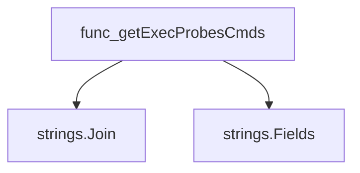

#### Functions calling `getExecProbesCmds` (Mermaid)

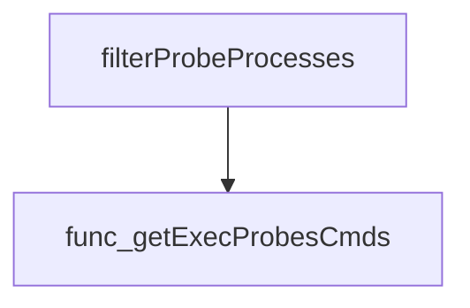

#### Usage example (Go)

```go
// Minimal example invoking getExecProbesCmds
package main

import (
    "fmt"
    "github.com/redhat-best-practices-for-k8s/certsuite/tests/performance/provider"
)

func main() {
    // Assume we have a container with probes set up.
    var cont *provider.Container
    // ... populate cont ...

    probeCmds := getExecProbesCmds(cont)
    fmt.Printf("Probe commands: %v\n", probeCmds)
}
```

---

### testExclusiveCPUPool

**testExclusiveCPUPool** - Detect pods containing containers that mix exclusive‑CPU and shared‑CPU assignments; flag such pods as non‑compliant.

The function verifies that all containers within a pod belong to the same CPU pool (exclusive or shared). It logs errors for mixed pools and records compliance results.

```go
func testExclusiveCPUPool(check *checksdb.Check, env *provider.TestEnvironment)
```

| Aspect | Details |
|--------|---------|
| **Purpose** | Detect pods containing containers that mix exclusive‑CPU and shared‑CPU assignments; flag such pods as non‑compliant. |
| **Parameters** | `check` – the current check context; `env` – test environment holding pod data. |
| **Return value** | None (results are stored via `SetResult`). |
| **Key dependencies** | • `resources.HasExclusiveCPUsAssigned(cut, logger)`<br>• `check.GetLogger()`<br>• `strconv.Itoa`<br>• `check.LogError`, `check.LogInfo`<br>• `testhelper.NewPodReportObject`<br>• `check.SetResult` |
| **Side effects** | Writes log entries; appends report objects to internal slices; updates check result state. |
| **How it fits the package** | Implements a single performance test that is registered in `LoadChecks`. It ensures pods do not mix CPU pool assignments, which could affect scheduling guarantees. |

#### Internal workflow

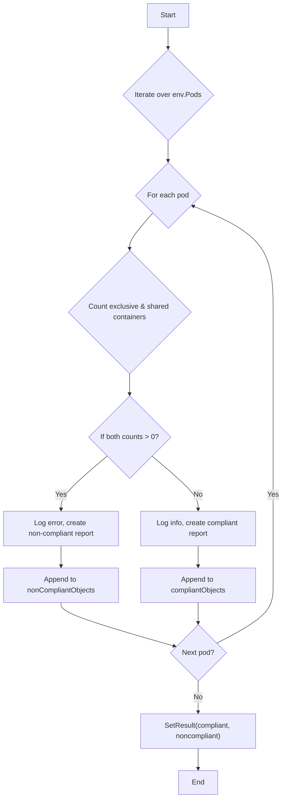

#### Function dependencies

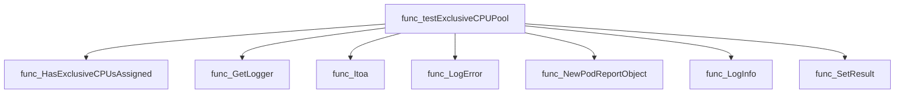

#### Functions calling `testExclusiveCPUPool`

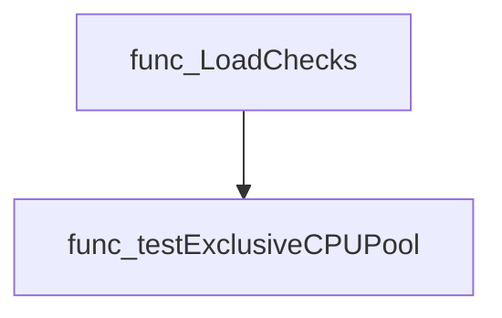

#### Usage example

```go
// Minimal example invoking testExclusiveCPUPool
check := checksdb.NewCheck(...)
env := &provider.TestEnvironment{Pods: /* ... */}

testExclusiveCPUPool(check, env)

// After execution, check.Result holds compliance information.
```

---

### testLimitedUseOfExecProbes

**testLimitedUseOfExecProbes** - Ensures that a CNF does not exceed the allowed number of exec probes and that each probe’s `PeriodSeconds` is ≥ 10 seconds.

#### 1) Signature (Go)

```go
func testLimitedUseOfExecProbes(*checksdb.Check, *provider.TestEnvironment)()
```

#### 2) Summary Table

| Aspect | Details |
|--------|---------|
| **Purpose** | Ensures that a CNF does not exceed the allowed number of exec probes and that each probe’s `PeriodSeconds` is ≥ 10 seconds. |
| **Parameters** | `check *checksdb.Check` – test harness for logging and result setting.<br>`env *provider.TestEnvironment` – contains all pods/containers under evaluation. |
| **Return value** | None; results are communicated via `check.SetResult`. |
| **Key dependencies** | - `check.LogInfo`, `check.LogError`<br>- `testhelper.NewContainerReportObject`, `testhelper.NewReportObject`<br>- `fmt.Sprintf`<br>- `check.SetResult` |
| **Side effects** | Emits logs, constructs report objects, and records pass/fail status on the provided check. No external state mutation. |
| **How it fits the package** | Implements the *TestLimitedUseOfExecProbes* test in the performance suite, ensuring CNF compliance with probe‑usage policies. |

#### 3) Internal workflow (Mermaid)

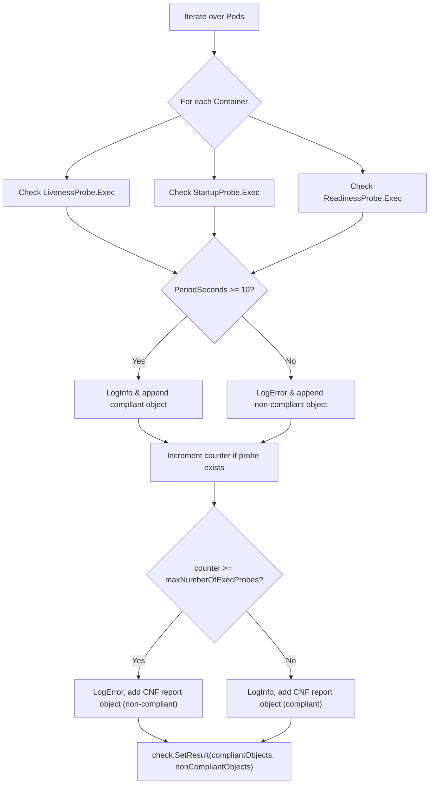

#### 4) Function dependencies (Mermaid)

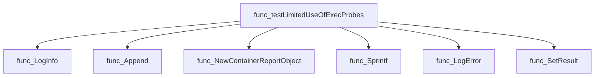

#### 5) Functions calling `testLimitedUseOfExecProbes` (Mermaid)

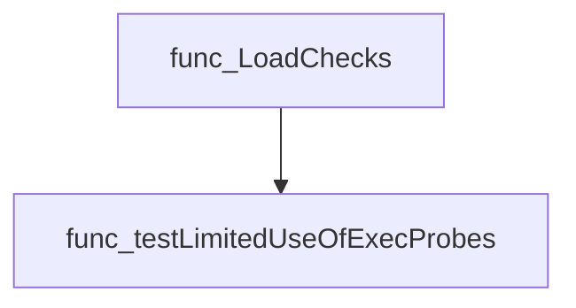

#### 6) Usage example (Go)

```go
// Minimal example invoking testLimitedUseOfExecProbes
package main

import (
    "github.com/redhat-best-practices-for-k8s/certsuite/tests/performance"
    "github.com/redhat-best-practices-for-k8s/certsuite/pkg/checksdb"
    "github.com/redhat-best-practices-for-k8s/certsuite/pkg/provider"
)

func main() {
    env := provider.NewTestEnvironment(/* populate with pods/containers */)
    check := checksdb.NewCheck("test-limited-use-of-exec-probes")
    performance.testLimitedUseOfExecProbes(check, env)
}
```

---

---

### testRtAppsNoExecProbes

**testRtAppsNoExecProbes** - Ensures that containers lacking host PID isolation do not execute exec probes while any process is scheduled with a real‑time policy. It reports compliance or non‑compliance for each container and its processes.

#### Signature (Go)

```go
func testRtAppsNoExecProbes(check *checksdb.Check, env *provider.TestEnvironment)
```

#### Summary Table

| Aspect | Details |
|--------|---------|
| **Purpose** | Ensures that containers lacking host PID isolation do not execute exec probes while any process is scheduled with a real‑time policy. It reports compliance or non‑compliance for each container and its processes. |
| **Parameters** | `check *checksdb.Check` – test context used for logging and result storage.<br>`env *provider.TestEnvironment` – environment providing access to containers under test. |
| **Return value** | None (side‑effect: sets check result). |
| **Key dependencies** | • `env.GetNonGuaranteedPodContainersWithoutHostPID()`<br>• `check.LogInfo`, `LogError`, `LogWarn`<br>• `crclient.GetContainerProcesses`<br>• `filterProbeProcesses`<br>• `scheduling.GetProcessCPUScheduling`<br>• `scheduling.PolicyIsRT`<br>• `testhelper.NewContainerReportObject` |
| **Side effects** | Logs information, errors and warnings; builds lists of compliant/non‑compliant report objects; calls `check.SetResult` to store the outcome. |
| **How it fits the package** | Part of the *performance* test suite; invoked by `LoadChecks` as the implementation for the “TestRtAppNoExecProbes” check, ensuring that real‑time scheduling is not used with exec probes in non‑guaranteed containers. |

#### Internal workflow (Mermaid)

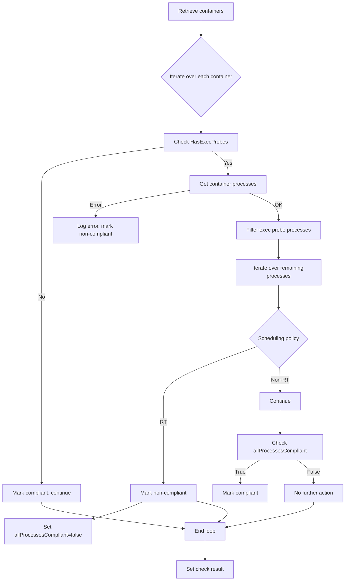

#### Function dependencies (Mermaid)

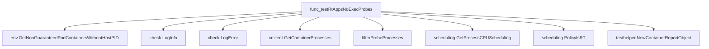

#### Functions calling `testRtAppsNoExecProbes` (Mermaid)

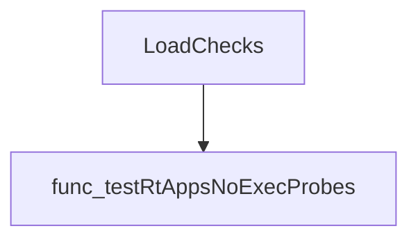

#### Usage example (Go)

```go
// Minimal example invoking testRtAppsNoExecProbes
func runExample() {
    // Assume env and check are already initialized
    var env *provider.TestEnvironment   // set up test environment
    var check *checksdb.Check           // create a new Check instance

    testRtAppsNoExecProbes(check, env)

    // After the call, results can be inspected via check.GetResult()
}
```

---

---

### testSchedulingPolicyInCPUPool

**testSchedulingPolicyInCPUPool** - Ensures that every process inside each container’s PID namespace satisfies the CPU scheduling policy specified by `schedulingType`. It records compliant and non‑compliant processes in the test result.

#### Signature (Go)

```go
func testSchedulingPolicyInCPUPool(check *checksdb.Check, env *provider.TestEnvironment,
 podContainers []*provider.Container, schedulingType string) ()
```

#### Summary Table

| Aspect | Details |
|--------|---------|
| **Purpose** | Ensures that every process inside each container’s PID namespace satisfies the CPU scheduling policy specified by `schedulingType`. It records compliant and non‑compliant processes in the test result. |
| **Parameters** | *`check`* – Test check instance for logging and result reporting.<br>*`env`* – Environment providing node/pod context.<br>*`podContainers`* – List of containers to evaluate.<br>*`schedulingType`* – Desired scheduling type (`SharedCPUScheduling`, `ExclusiveCPUScheduling`, or `IsolatedCPUScheduling`). |
| **Return value** | None (results are stored via `check.SetResult`). |
| **Key dependencies** | • `crclient.GetContainerPidNamespace` – obtains a container’s PID namespace.<br>• `crclient.GetPidsFromPidNamespace` – lists PIDs in that namespace.<br>• `scheduling.ProcessPidsCPUScheduling` – checks each process against the desired scheduling policy.<br>• `testhelper.NewContainerReportObject` – creates report objects. |
| **Side effects** | Logs informational, debug and error messages; appends report objects to internal slices; finally sets test results on `check`. No external state is modified. |
| **How it fits the package** | Part of the performance suite’s CPU‑pool checks; called by higher‑level functions that load and run checks for different scheduling scenarios. |

#### Internal workflow (Mermaid)

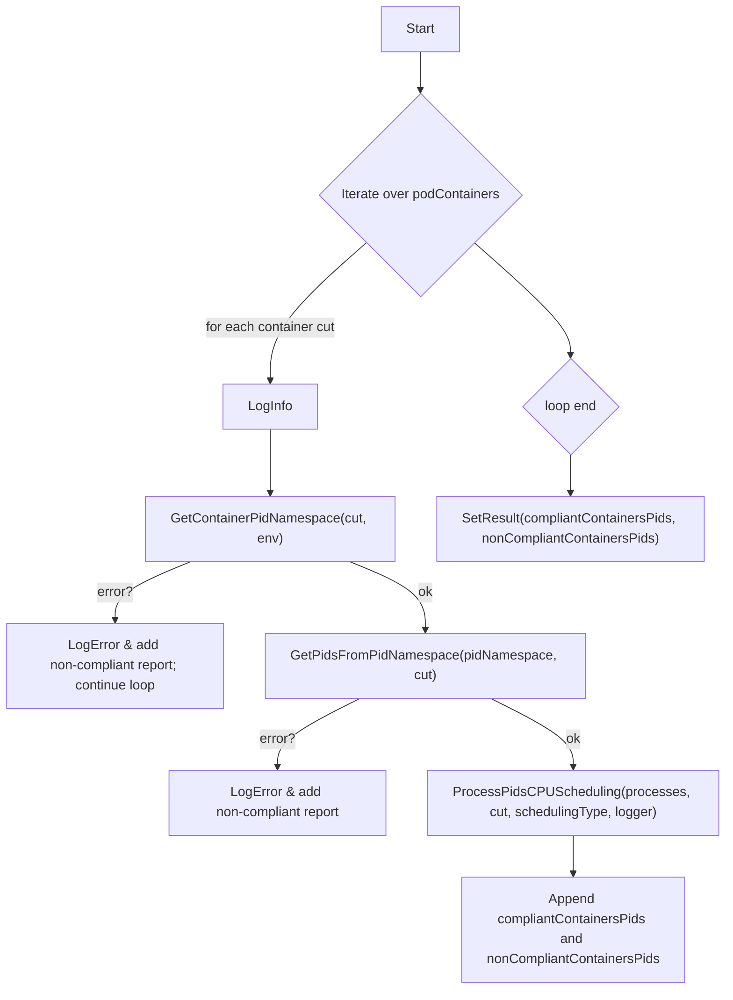

#### Function dependencies (Mermaid)

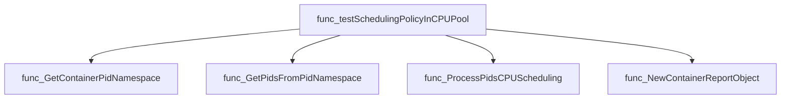

#### Functions calling `testSchedulingPolicyInCPUPool` (Mermaid)

```mermaid
graph TD
  func_LoadChecks --> func_testSchedulingPolicyInCPUPool
```

#### Usage example (Go)

```go
// Minimal example invoking testSchedulingPolicyInCPUPool
func runExample() {
    // Assume env and containers are already prepared.
    var check *checksdb.Check = checksdb.NewCheck("example")
    var env *provider.TestEnvironment = provider.GetTestEnvironment()
    var containers []*provider.Container = env.GetNonGuaranteedPodContainersWithoutHostPID()

    testSchedulingPolicyInCPUPool(check, env, containers, scheduling.SharedCPUScheduling)
}
```

---
