# Package bootparams

**Path**: `tests/platform/bootparams`

## Table of Contents

- [Overview](#overview)
- [Exported Functions](#exported-functions)
  - [GetMcKernelArguments](#getmckernelarguments)
  - [TestBootParamsHelper](#testbootparamshelper)
- [Local Functions](#local-functions)
  - [getCurrentKernelCmdlineArgs](#getcurrentkernelcmdlineargs)
  - [getGrubKernelArgs](#getgrubkernelargs)

## Overview

The bootparams package provides utilities for verifying that the kernel arguments specified in a node’s MachineConfig match those actually present on the running system, including both the container command line and GRUB configuration. It is intended for use within CertSuite test environments to detect misconfigurations.

### Key Features

- GetMcKernelArguments parses a MachineConfig string of kernel arguments into a key‑value map for easy lookup.
- TestBootParamsHelper compares the expected kernel args against the current container and GRUB values, emitting warnings or debug logs when mismatches occur.
- Internal helpers getCurrentKernelCmdlineArgs and getGrubKernelArgs execute commands inside probe pods to capture live kernel argument states.

### Design Notes

- Assumes that executing grub commands in a probe pod reflects the host’s boot configuration.
- Functions return detailed errors on command execution failures, which may surface as test failures.
- Best practice: run TestBootParamsHelper early in a test suite after MachineConfig changes to catch drift before deployment.

### Exported Functions Summary

| Name | Purpose |
|------|----------|
| [func GetMcKernelArguments(env *provider.TestEnvironment, nodeName string) (aMap map[string]string)](#getmckernelarguments) | Converts the list of kernel arguments (`[]string`) from a node’s MachineConfig into a key‑value map for easy lookup. |
| [func TestBootParamsHelper(env *provider.TestEnvironment, cut *provider.Container, logger *log.Logger) error](#testbootparamshelper) | Compares expected kernel arguments from MachineConfig (`GetMcKernelArguments`) against the current command‑line arguments in the container and GRUB configuration, emitting warnings or debug logs for mismatches. |

### Local Functions Summary

| Name | Purpose |
|------|----------|
| [func getCurrentKernelCmdlineArgs(env *provider.TestEnvironment, nodeName string) (map[string]string, error)](#getcurrentkernelcmdlineargs) | Executes the `grubKernelArgsCommand` inside a probe pod to capture the current kernel command‑line arguments and returns them as a map of key/value pairs. |
| [func getGrubKernelArgs(env *provider.TestEnvironment, nodeName string) (aMap map[string]string, err error)](#getgrubkernelargs) | Executes `grub2-editenv list` inside a probe pod to obtain the current GRUB kernel command line arguments and returns them as a key‑value map. |

## Exported Functions

### GetMcKernelArguments

**GetMcKernelArguments** - Converts the list of kernel arguments (`[]string`) from a node’s MachineConfig into a key‑value map for easy lookup.

Retrieve the kernel argument map defined in a node’s MachineConfig.

---

#### Signature (Go)

```go
func GetMcKernelArguments(env *provider.TestEnvironment, nodeName string) (aMap map[string]string)
```

---

#### Summary Table

| Aspect | Details |
|--------|---------|
| **Purpose** | Converts the list of kernel arguments (`[]string`) from a node’s MachineConfig into a key‑value map for easy lookup. |
| **Parameters** | `env *provider.TestEnvironment` – test environment containing node data.<br>`nodeName string` – name of the target node. |
| **Return value** | `map[string]string` – mapping of kernel argument names to their values (empty string if no value). |
| **Key dependencies** | Calls `arrayhelper.ArgListToMap` from `github.com/redhat-best-practices-for-k8s/certsuite/pkg/arrayhelper`. |
| **Side effects** | None. Pure function; only reads data from the supplied environment. |
| **How it fits the package** | Provides a helper for tests that need to compare MachineConfig kernel arguments against other sources (e.g., runtime cmdline, GRUB). |

---

#### Internal workflow (Mermaid)

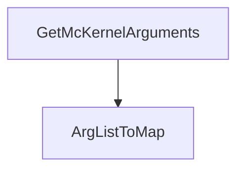

---

#### Function dependencies (Mermaid)

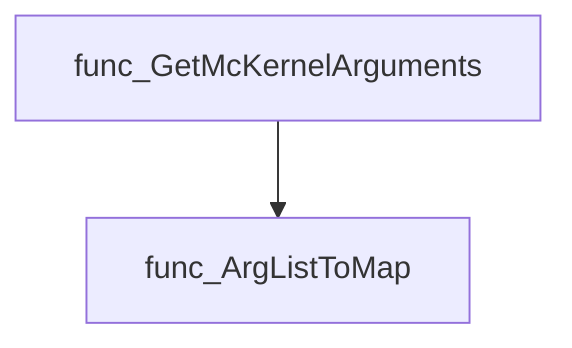

---

#### Functions calling `GetMcKernelArguments` (Mermaid)

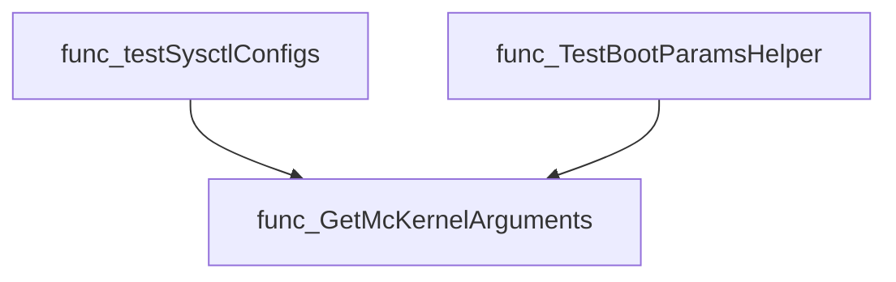

---

#### Usage example (Go)

```go
// Minimal example invoking GetMcKernelArguments
env := &provider.TestEnvironment{ /* … populate as needed … */ }
nodeName := "worker-0"

kernelArgs, err := bootparams.GetMcKernelArguments(env, nodeName)
if err != nil {
    // Handle error if the environment is malformed (not expected in current signature)
}
for key, val := range kernelArgs {
    fmt.Printf("Kernel arg %q = %q\n", key, val)
}
```

---

### TestBootParamsHelper

**TestBootParamsHelper** - Compares expected kernel arguments from MachineConfig (`GetMcKernelArguments`) against the current command‑line arguments in the container and GRUB configuration, emitting warnings or debug logs for mismatches.

Validates that the kernel command line arguments specified in a node’s MachineConfig match those actually present in the running container and in GRUB, logging any discrepancies.

```go
func TestBootParamsHelper(env *provider.TestEnvironment, cut *provider.Container, logger *log.Logger) error
```

| Aspect | Details |
|--------|---------|
| **Purpose** | Compares expected kernel arguments from MachineConfig (`GetMcKernelArguments`) against the current command‑line arguments in the container and GRUB configuration, emitting warnings or debug logs for mismatches. |
| **Parameters** | `env *provider.TestEnvironment` – test environment context.<br>`cut *provider.Container` – container under test.<br>`logger *log.Logger` – logger used for reporting. |
| **Return value** | `error` – non‑nil if the probe pod is missing or any helper call fails; otherwise nil. |
| **Key dependencies** | • `GetMcKernelArguments(env, nodeName)`<br>• `getCurrentKernelCmdlineArgs(env, nodeName)`<br>• `getGrubKernelArgs(env, nodeName)`<br>• `fmt.Errorf` for error construction |
| **Side effects** | Writes log entries via the supplied logger; no state mutation. |
| **How it fits the package** | Serves as the core check used by higher‑level tests (e.g., `testUnalteredBootParams`) to ensure that boot parameters are not unintentionally altered on a node. |

#### Internal workflow

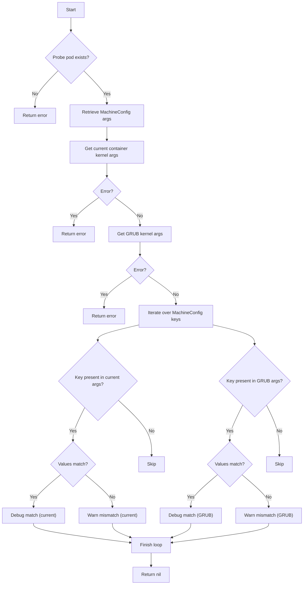

#### Function dependencies

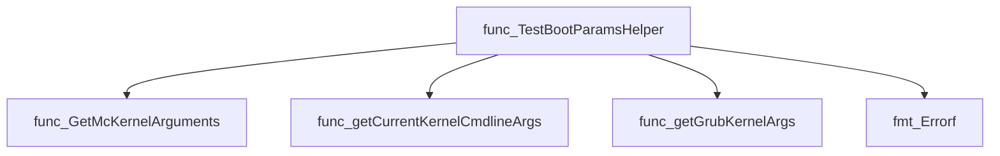

#### Functions calling `TestBootParamsHelper`

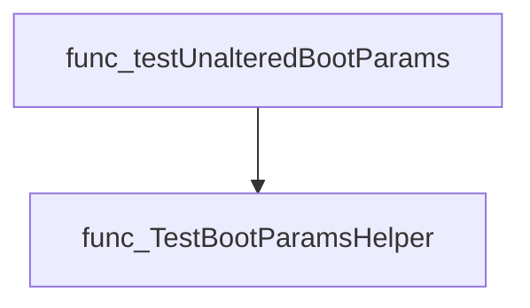

#### Usage example

```go
// Minimal example invoking TestBootParamsHelper
env := provider.NewTestEnvironment(...)
cut := &provider.Container{NodeName: "node-1", ...}
logger := log.New(os.Stdout, "", log.LstdFlags)

if err := bootparams.TestBootParamsHelper(env, cut, logger); err != nil {
    fmt.Printf("Boot params check failed: %v\n", err)
} else {
    fmt.Println("Boot parameters are consistent")
}
```

---

## Local Functions

### getCurrentKernelCmdlineArgs

**getCurrentKernelCmdlineArgs** - Executes the `grubKernelArgsCommand` inside a probe pod to capture the current kernel command‑line arguments and returns them as a map of key/value pairs.

#### Signature (Go)

```go
func getCurrentKernelCmdlineArgs(env *provider.TestEnvironment, nodeName string) (map[string]string, error)
```

#### Summary Table

| Aspect | Details |
|--------|---------|
| **Purpose** | Executes the `grubKernelArgsCommand` inside a probe pod to capture the current kernel command‑line arguments and returns them as a map of key/value pairs. |
| **Parameters** | `env *provider.TestEnvironment` – test environment containing probe pods; <br> `nodeName string` – name of the node whose probe pod is queried. |
| **Return value** | `map[string]string` – parsed kernel arguments; `error` if execution fails or output cannot be parsed. |
| **Key dependencies** | • `clientsholder.GetClientsHolder()`<br>• `clientsholder.NewContext(...)`<br>• `o.ExecCommandContainer(ctx, kernelArgscommand)`<br>• `strings.Split`, `strings.TrimSuffix`<br>• `arrayhelper.ArgListToMap` |
| **Side effects** | No state mutation; performs I/O by executing a command inside a container. |
| **How it fits the package** | Provides low‑level data needed for boot parameter validation in the *bootparams* test suite. |

#### Internal workflow (Mermaid)

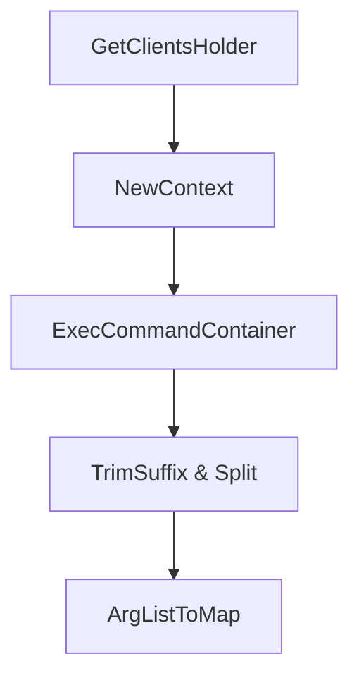

#### Function dependencies (Mermaid)

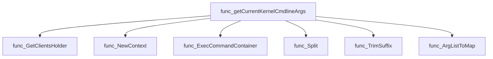

#### Functions calling `getCurrentKernelCmdlineArgs` (Mermaid)

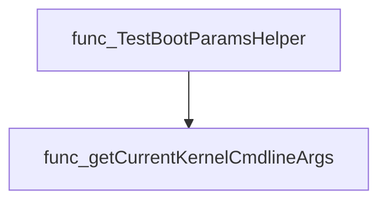

#### Usage example (Go)

```go
// Minimal example invoking getCurrentKernelCmdlineArgs
env := &provider.TestEnvironment{ /* populated elsewhere */ }
nodeName := "worker-node-01"

args, err := getCurrentKernelCmdlineArgs(env, nodeName)
if err != nil {
    log.Fatalf("failed to retrieve kernel args: %v", err)
}
fmt.Printf("Kernel arguments for %s: %+v\n", nodeName, args)
```

---

### getGrubKernelArgs

**getGrubKernelArgs** - Executes `grub2-editenv list` inside a probe pod to obtain the current GRUB kernel command line arguments and returns them as a key‑value map.

#### Signature (Go)

```go
func getGrubKernelArgs(env *provider.TestEnvironment, nodeName string) (aMap map[string]string, err error)
```

#### Summary Table

| Aspect | Details |
|--------|---------|
| **Purpose** | Executes `grub2-editenv list` inside a probe pod to obtain the current GRUB kernel command line arguments and returns them as a key‑value map. |
| **Parameters** | `env *provider.TestEnvironment` – test environment holding probe pods.<br>`nodeName string` – name of the node whose probe pod will be queried. |
| **Return value** | `aMap map[string]string` – mapping of GRUB kernel argument names to values (empty string if no value).<br>`err error` – any execution or parsing error. |
| **Key dependencies** | • `clientsholder.GetClientsHolder()` – obtains Kubernetes client holder.<br>• `clientsholder.NewContext(...)` – builds context for pod, namespace and container.<br>• `ExecCommandContainer(ctx, grubKernelArgsCommand)` – runs command inside the pod.<br>• `strings.Split`, `strings.HasPrefix` – parse output.<br>• `arrayhelper.FilterArray`, `arrayhelper.ArgListToMap` – filter & convert list to map. |
| **Side effects** | No state mutation; performs I/O by executing a container command and parsing its stdout. |
| **How it fits the package** | Provides GRUB‑level kernel parameters used in boot‑parameter validation tests within `bootparams`. |

#### Internal workflow (Mermaid)

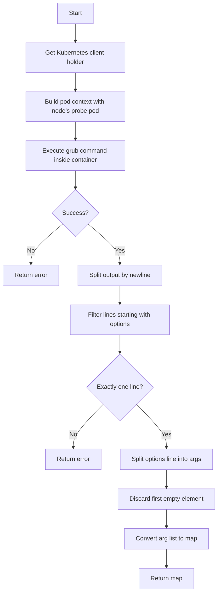

#### Function dependencies (Mermaid)

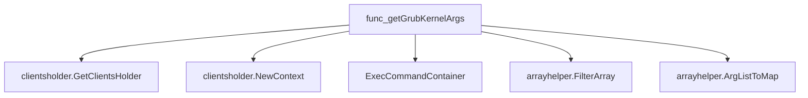

#### Functions calling `getGrubKernelArgs` (Mermaid)

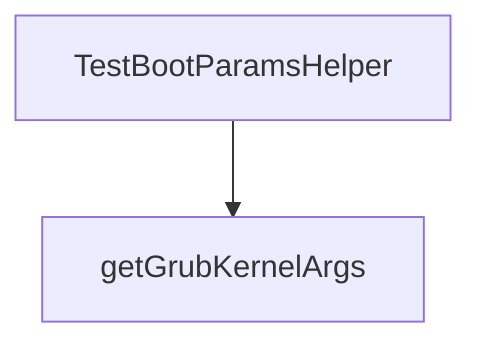

#### Usage example (Go)

```go
// Minimal example invoking getGrubKernelArgs
env := &provider.TestEnvironment{ /* initialized elsewhere */ }
nodeName := "worker-0"

grubArgs, err := getGrubKernelArgs(env, nodeName)
if err != nil {
    log.Fatalf("failed to get GRUB args: %v", err)
}
fmt.Printf("GRUB kernel arguments for %s: %+v\n", nodeName, grubArgs)
```

---
