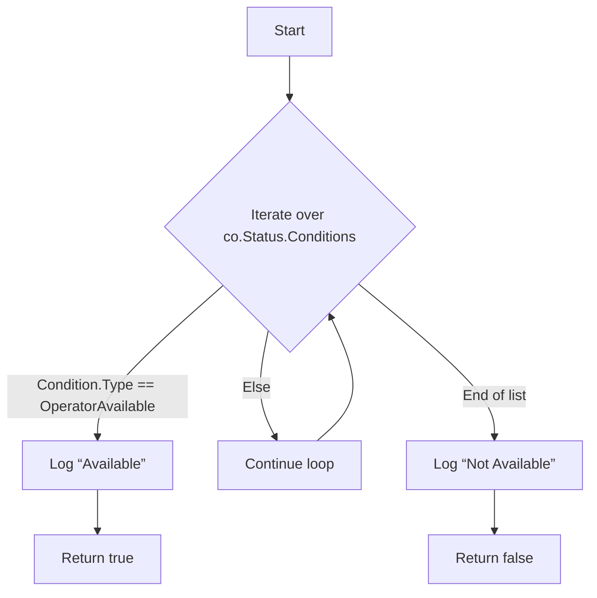
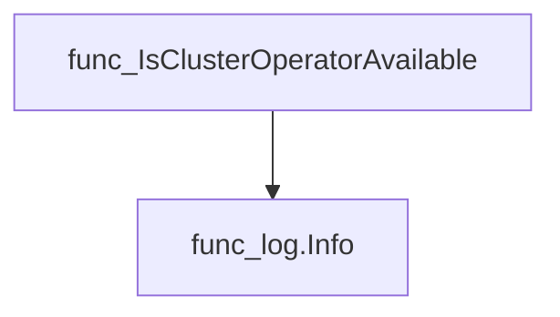
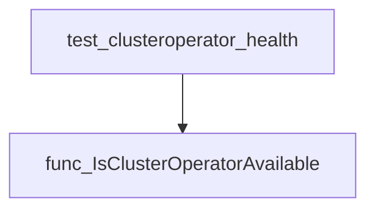

# Package clusteroperator

**Path**: `tests/platform/clusteroperator`

## Table of Contents

- [Overview](#overview)
- [Exported Functions](#exported-functions)
  - [IsClusterOperatorAvailable](#isclusteroperatoravailable)

## Overview

The clusteroperator package provides utilities for verifying the operational status of OpenShift Cluster Operators during tests.

### Key Features

- Checks an operator’s status conditions to confirm availability
- Integrates with the internal logging system for test output
- Exposes a single exported function for reuse in multiple test cases

### Design Notes

- Relies on the openshift/config API to inspect OperatorStatusConditions
- Assumes the presence of an "Available" condition indicates readiness; other conditions are ignored
- Best practice: call after operator deployment and before running dependent tests

### Exported Functions Summary

| Name | Purpose |
|------|----------|
| [func IsClusterOperatorAvailable(co *configv1.ClusterOperator) bool](#isclusteroperatoravailable) | Checks the operator’s status conditions and returns true when the “Available” condition is present, indicating the operator is functioning correctly. |

## Exported Functions

### IsClusterOperatorAvailable

**IsClusterOperatorAvailable** - Checks the operator’s status conditions and returns true when the “Available” condition is present, indicating the operator is functioning correctly.

```go
func IsClusterOperatorAvailable(co *configv1.ClusterOperator) bool
```

| Aspect | Details |
|--------|---------|
| **Purpose** | Checks the operator’s status conditions and returns true when the “Available” condition is present, indicating the operator is functioning correctly. |
| **Parameters** | `co *configv1.ClusterOperator` – reference to the operator object whose state is examined. |
| **Return value** | `bool` – `true` if an `Available` condition exists; otherwise `false`. |
| **Key dependencies** | • Calls `log.Info` from the internal logging package to record status outcomes.<br>• Relies on the `configv1.OperatorAvailable` constant and the operator’s `Status.Conditions` slice. |
| **Side effects** | No state mutations; only logs informational messages. |
| **How it fits the package** | Serves as a helper for health‑check tests, enabling them to quickly assess operator readiness without duplicating condition‑parsing logic. |

#### Internal workflow



#### Function dependencies



#### Functions calling `IsClusterOperatorAvailable`



#### Usage example (Go)

```go
// Minimal example invoking IsClusterOperatorAvailable
package main

import (
    "github.com/redhat-best-practices-for-k8s/certsuite/tests/platform/clusteroperator"
    configv1 "k8s.io/api/config/v1"
)

func main() {
    // Example operator with an Available condition
    op := &configv1.ClusterOperator{
        Name: "example-operator",
        Status: configv1.ClusterOperatorStatus{
            Conditions: []configv1.OperatorCondition{{
                Type:   configv1.OperatorAvailable,
                Status: configv1.ConditionTrue,
            }},
        },
    }

    available := clusteroperator.IsClusterOperatorAvailable(op)
    if available {
        println("Operator is available")
    } else {
        println("Operator is not available")
    }
}
```

---
