# Package cnffsdiff

**Path**: `tests/platform/cnffsdiff`

## Table of Contents

- [Overview](#overview)
- [Structs](#structs)
  - [FsDiff](#fsdiff)
- [Interfaces](#interfaces)
  - [FsDiffFuncs](#fsdifffuncs)
- [Exported Functions](#exported-functions)
  - [FsDiff.GetResults](#fsdiff.getresults)
  - [FsDiff.RunTest](#fsdiff.runtest)
  - [NewFsDiffTester](#newfsdifftester)
- [Local Functions](#local-functions)
  - [FsDiff.createNodeFolder](#fsdiff.createnodefolder)
  - [FsDiff.deleteNodeFolder](#fsdiff.deletenodefolder)
  - [FsDiff.execCommandContainer](#fsdiff.execcommandcontainer)
  - [FsDiff.installCustomPodman](#fsdiff.installcustompodman)
  - [FsDiff.intersectTargetFolders](#fsdiff.intersecttargetfolders)
  - [FsDiff.mountProbePodmanFolder](#fsdiff.mountprobepodmanfolder)
  - [FsDiff.runPodmanDiff](#fsdiff.runpodmandiff)
  - [FsDiff.unmountCustomPodman](#fsdiff.unmountcustompodman)
  - [FsDiff.unmountProbePodmanFolder](#fsdiff.unmountprobepodmanfolder)
  - [shouldUseCustomPodman](#shouldusecustompodman)

## Overview

The cnffsdiff package provides a tester that runs podman diff against a target container on an OpenShift node, parses the JSON output and records which filesystem folders were added, changed or deleted. It can use either the system‑installed Podman or a custom binary depending on the cluster version.

### Key Features

- Runs podman diff inside a probe pod and captures JSON results
- Automatically mounts a temporary directory to expose the partner’s Podman binary if needed
- Filters output to only include predefined target folders, logging mismatches

### Design Notes

- Decision to use a custom Podman binary is based on OpenShift semantic version comparison; older versions lack required features.
- The diff operation retries when it encounters error code 125 (podman exit status) by sleeping and retrying once.
- Users should instantiate FsDiff via NewFsDiffTester, then call RunTest before accessing ChangedFolders/DeletedFolders or GetResults.

### Structs Summary

| Name | Purpose |
|------|----------|
| [**FsDiff**](#fsdiff) | Struct definition |

### Exported Functions Summary

| Name | Purpose |
|------|----------|
| [func (f *FsDiff) GetResults() int](#fsdiff.getresults) | Returns the integer status code stored in the `FsDiff` instance, representing the outcome of a filesystem diff operation. |
| [func (f *FsDiff) RunTest(containerUID string)](#fsdiff.runtest) | Runs `podman diff` against the specified container, handles custom podman installation, retries on known error codes, parses JSON output, and records changed or deleted folders. |
| [func NewFsDiffTester(     check *checksdb.Check,     client clientsholder.Command,     ctxt clientsholder.Context,     ocpVersion string, ) *FsDiff](#newfsdifftester) | Instantiates an `FsDiff` tester configured for the specified OpenShift version and client context. Determines whether to use a custom Podman binary based on the cluster’s version. |

### Local Functions Summary

| Name | Purpose |
|------|----------|
| [func (f *FsDiff) createNodeFolder() error](#fsdiff.createnodefolder) | Creates a temporary directory (`nodeTmpMountFolder`) inside the probe pod’s filesystem by executing `mkdir` on the target node. |
| [func (f *FsDiff) deleteNodeFolder() error](#fsdiff.deletenodefolder) | Removes the temporary directory used for mounting podman on the target node. It issues a `rmdir` command inside the container and reports any unexpected output or errors. |
| [func (f *FsDiff) execCommandContainer(cmd, errorStr string) error](#fsdiff.execcommandcontainer) | Runs `cmd` inside the container that hosts the probe pod. Any non‑empty stdout or stderr, or a failure of the underlying execution, causes an error containing the supplied `errorStr` and diagnostic information. |
| [func (f *FsDiff) installCustomPodman() error](#fsdiff.installcustompodman) | Creates a temporary directory on the node, mounts the partner’s Podman binary into it, and prepares the environment for subsequent `podman diff` invocations. |
| [func (f *FsDiff) intersectTargetFolders(src []string) []string](#fsdiff.intersecttargetfolders) | Returns only those folder paths from `src` that match any of the pre‑defined `targetFolders`. Logs a warning for each matched path. |
| [func (f *FsDiff) mountProbePodmanFolder() error](#fsdiff.mountprobepodmanfolder) | Binds the `partnerPodmanFolder` inside the probe container to a local temporary folder (`nodeTmpMountFolder`) so that files can be inspected or manipulated from the host. |
| [func (f *FsDiff) runPodmanDiff(containerUID string) (string, error)](#fsdiff.runpodmandiff) | Runs `podman diff --format json` for the specified container and returns its JSON output. Handles both system‑wide and custom Podman binaries. |
| [func (f *FsDiff) unmountCustomPodman()](#fsdiff.unmountcustompodman) | Detaches the host mount point that was created for the custom Podman instance and removes its temporary directory. It is invoked automatically when a test finishes using a custom Podman binary. |
| [func (f *FsDiff) unmountProbePodmanFolder() error](#fsdiff.unmountprobepodmanfolder) | Executes an `umount` command inside the target container to detach the temporary probe directory (`nodeTmpMountFolder`). |
| [func shouldUseCustomPodman(check *checksdb.Check, ocpVersion string) bool](#shouldusecustompodman) | Decides whether the probe should run with a custom‑compiled podman binary or rely on the preinstalled podman that ships with OpenShift nodes. The decision is based on the supplied OpenShift (OCP) version. |

## Structs

### FsDiff

<!-- DEBUG: Struct FsDiff exists in bundle but ParsedOK=false, Fields=8 -->
**Purpose**:

**Fields**:

| Field | Type | Description |
|-------|------|--------------|
| `ChangedFolders` | `[]string` | List of target folders that were modified (added or changed). |
| `Error` | `error` | Last error encountered during test execution, if any. |
| `check` | `*checksdb.Check` | Logger used to record progress and warnings. |
| `result` | `int` | Test outcome (`testhelper.SUCCESS`, `FAILURE`, or `ERROR`). |
| `clientHolder` | `clientsholder.Command` | Interface for executing commands inside the container. |
| `ctxt` | `clientsholder.Context` | Execution context passed to command invocations. |
| `useCustomPodman` | `bool` | Flag indicating whether a custom podman binary should be mounted from the probe pod. |
| `DeletedFolders` | `[]string` | List of target folders that were removed in the container’s filesystem. |

---

## Interfaces

### FsDiffFuncs

<!-- DEBUG: Interface FsDiffFuncs exists in bundle but ParsedOK=false -->
**Purpose**:

**Methods**:

| Method | Description |
|--------|--------------|
| `RunTest` | Method documentation |
| `GetResults` | Method documentation |

---

## Exported Functions

### FsDiff.GetResults

**GetResults** - Returns the integer status code stored in the `FsDiff` instance, representing the outcome of a filesystem diff operation.

#### Signature (Go)

```go
func (f *FsDiff) GetResults() int
```

#### Summary Table

| Aspect | Details |
|--------|---------|
| **Purpose** | Returns the integer status code stored in the `FsDiff` instance, representing the outcome of a filesystem diff operation. |
| **Parameters** | None |
| **Return value** | `int` – the result code held by the receiver (`f.result`). |
| **Key dependencies** | • accesses the exported field `result` on the `FsDiff` struct. |
| **Side effects** | No state mutation or I/O; purely a getter. |
| **How it fits the package** | Provides external callers with access to the diff result after an `FsDiff` object has performed its analysis. |

#### Internal workflow (Mermaid)

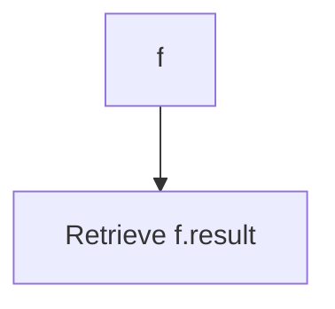

#### Function dependencies (Mermaid)

None – this function is currently not referenced elsewhere in the package.

#### Functions calling `FsDiff.GetResults` (Mermaid)

None – this function is currently not referenced elsewhere in the package.

#### Usage example (Go)

```go
// Minimal example invoking FsDiff.GetResults
diff := &cnffsdiff.FsDiff{result: 0} // normally populated by diff logic
status := diff.GetResults()
fmt.Println("Diff status:", status)
```

---

### FsDiff.RunTest

**RunTest** - Runs `podman diff` against the specified container, handles custom podman installation, retries on known error codes, parses JSON output, and records changed or deleted folders.

#### 1) Signature (Go)

```go
func (f *FsDiff) RunTest(containerUID string)
```

#### 2) Summary Table

| Aspect | Details |
|--------|---------|
| **Purpose** | Runs `podman diff` against the specified container, handles custom podman installation, retries on known error codes, parses JSON output, and records changed or deleted folders. |
| **Parameters** | `containerUID string` – The unique identifier of the target container. |
| **Return value** | None; results are stored in the receiver’s fields (`result`, `DeletedFolders`, `ChangedFolders`, etc.). |
| **Key dependencies** | • `FsDiff.installCustomPodman()`<br>• `FsDiff.unmountCustomPodman()`<br>• `FsDiff.runPodmanDiff(containerUID)`<br>• `strings.Contains`<br>• `time.Sleep`<br>• `json.Unmarshal`<br>• `FsDiff.intersectTargetFolders` |
| **Side effects** | • Logs informational, warning, and debug messages.<br>• May create/delete temporary directories when using custom podman.<br>• Sets `f.Error`, `f.result`, `DeletedFolders`, and `ChangedFolders`. |
| **How it fits the package** | Core entry point for performing filesystem integrity checks on a container; orchestrates setup, execution, parsing, and result classification. |

#### 3) Internal workflow (Mermaid)

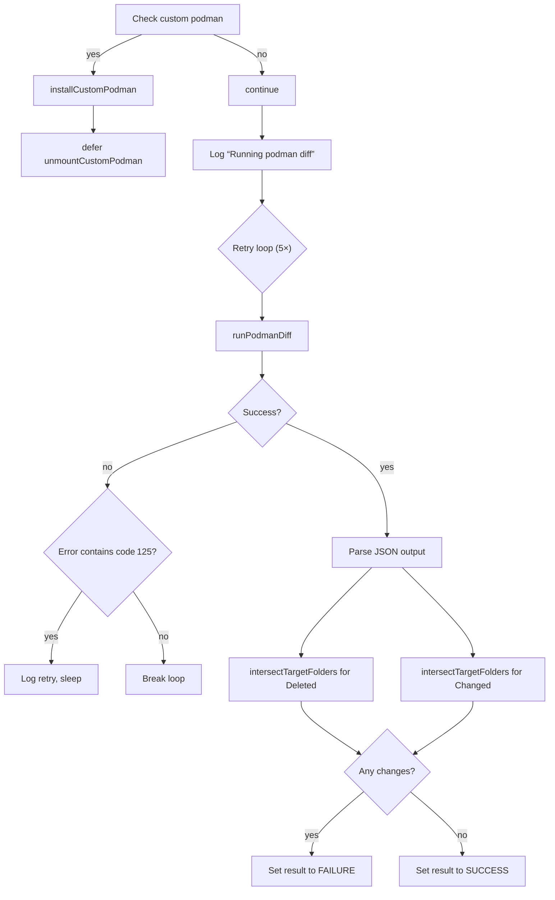

#### 4) Function dependencies (Mermaid)

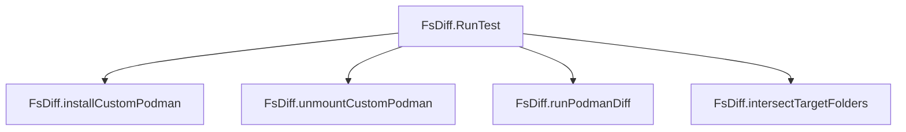

#### 5) Functions calling `FsDiff.RunTest` (Mermaid)

None – this function is currently not referenced elsewhere in the package.

#### 6) Usage example (Go)

```go
// Minimal example invoking FsDiff.RunTest
import (
    "github.com/redhat-best-practices-for-k8s/certsuite/tests/platform/cnffsdiff"
)

// Assume fsDiff is an initialized *FsDiff instance.
var fsDiff *cnffsdiff.FsDiff

// Run the diff test for a container with UID "abc123".
fsDiff.RunTest("abc123")

// Inspect results
if fsDiff.result == cnffsdiff.SUCCESS {
    fmt.Println("No filesystem changes detected.")
} else if fsDiff.result == cnffsdiff.FAILURE {
    fmt.Printf("Changed folders: %v\nDeleted folders: %v\n", fsDiff.ChangedFolders, fsDiff.DeletedFolders)
} else {
    fmt.Printf("Error running diff: %v\n", fsDiff.Error)
}
```

---

---

### NewFsDiffTester

**NewFsDiffTester** - Instantiates an `FsDiff` tester configured for the specified OpenShift version and client context. Determines whether to use a custom Podman binary based on the cluster’s version.

#### 1) Signature (Go)

```go
func NewFsDiffTester(
    check *checksdb.Check,
    client clientsholder.Command,
    ctxt clientsholder.Context,
    ocpVersion string,
) *FsDiff
```

#### 2) Summary Table

| Aspect | Details |
|--------|---------|
| **Purpose** | Instantiates an `FsDiff` tester configured for the specified OpenShift version and client context. Determines whether to use a custom Podman binary based on the cluster’s version. |
| **Parameters** | *check* – test check object; <br>*client* – command holder for executing container commands;<br>*ctxt* – execution context (namespace, pod, container);<br>*ocpVersion* – OpenShift version string used to decide Podman strategy. |
| **Return value** | Pointer to an `FsDiff` struct initialized with the provided parameters and a default result of `testhelper.ERROR`. |
| **Key dependencies** | • Calls `shouldUseCustomPodman(check, ocpVersion)`<br>• Calls `check.LogDebug(...)` |
| **Side effects** | No state mutations beyond constructing the struct; logs debug information. |
| **How it fits the package** | Provides the entry point for creating a diff tester that other test functions (e.g., `testContainersFsDiff`) use to verify container file‑system integrity. |

#### 3) Internal workflow (Mermaid)

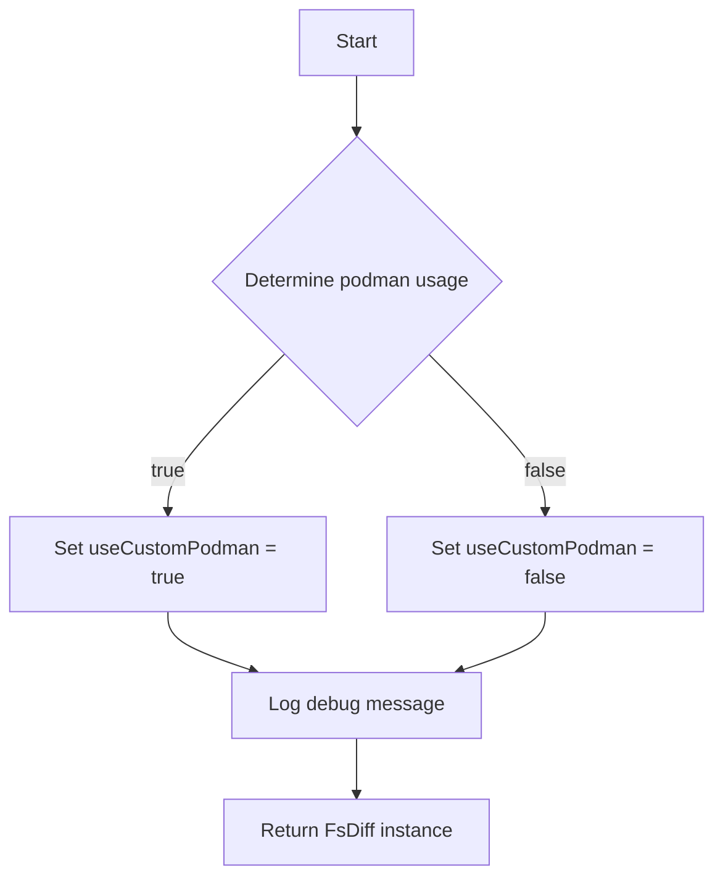

#### 4) Function dependencies (Mermaid)

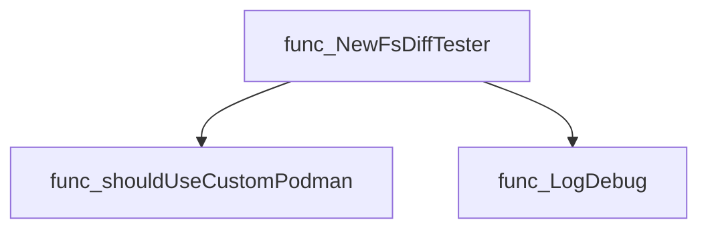

#### 5) Functions calling `NewFsDiffTester` (Mermaid)

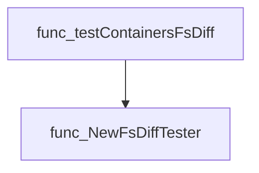

#### 6) Usage example (Go)

```go
// Minimal example invoking NewFsDiffTester
check := checksdb.NewCheck("example")
client := clientsholder.GetClientsHolder()
ctx := clientsholder.NewContext("default", "probe-pod", "probe-container")
ocpVer := "4.12"

fsDiffTester := cnffsdiff.NewFsDiffTester(check, client, ctx, ocpVer)
```

---

---

## Local Functions

### FsDiff.createNodeFolder

**createNodeFolder** - Creates a temporary directory (`nodeTmpMountFolder`) inside the probe pod’s filesystem by executing `mkdir` on the target node.

#### Signature (Go)

```go
func (f *FsDiff) createNodeFolder() error
```

#### Summary Table

| Aspect | Details |
|--------|---------|
| **Purpose** | Creates a temporary directory (`nodeTmpMountFolder`) inside the probe pod’s filesystem by executing `mkdir` on the target node. |
| **Parameters** | `f *FsDiff` – receiver containing client and context for container operations. |
| **Return value** | `error` – non‑nil if the command fails or returns unexpected output. |
| **Key dependencies** | • `FsDiff.execCommandContainer(cmd, errorStr string) error` <br>• `fmt.Sprintf` (for command & error message construction) |
| **Side effects** | Executes a shell command inside a container; may create a directory on the node’s filesystem and return any execution errors. No other state is modified. |
| **How it fits the package** | Part of the setup phase for `FsDiff`, ensuring a mount point exists before attempting to bind‑mount Podman binaries into it. |

#### Internal workflow (Mermaid)

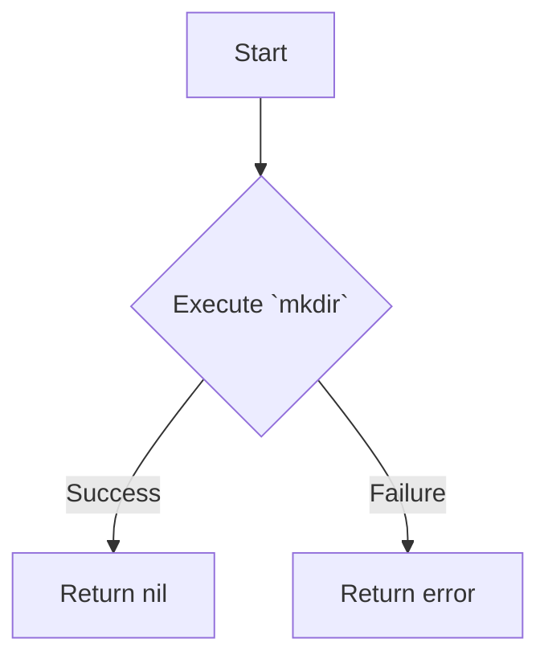

#### Function dependencies (Mermaid)

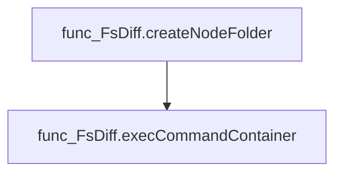

#### Functions calling `FsDiff.createNodeFolder` (Mermaid)

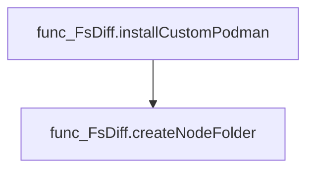

#### Usage example (Go)

```go
// Minimal example invoking FsDiff.createNodeFolder
f := &FsDiff{ /* fields initialized elsewhere */ }
if err := f.createNodeFolder(); err != nil {
    fmt.Printf("Failed to create node folder: %v\n", err)
}
```

---

### FsDiff.deleteNodeFolder

**deleteNodeFolder** - Removes the temporary directory used for mounting podman on the target node. It issues a `rmdir` command inside the container and reports any unexpected output or errors.

#### Signature (Go)

```go
func (f *FsDiff) deleteNodeFolder() error
```

#### Summary Table

| Aspect | Details |
|--------|---------|
| **Purpose** | Removes the temporary directory used for mounting podman on the target node. It issues a `rmdir` command inside the container and reports any unexpected output or errors. |
| **Parameters** | None |
| **Return value** | `error` – non‑nil if the deletion fails or produces output; otherwise `nil`. |
| **Key dependencies** | • `FsDiff.execCommandContainer` – runs a shell command in the node container.<br>• `fmt.Sprintf` – formats error strings. |
| **Side effects** | Executes an external command inside the test pod; may alter filesystem state on the target node by deleting the directory. |
| **How it fits the package** | Utility function used during setup and teardown of custom Podman mounts in `FsDiff`. It ensures that temporary directories do not persist between tests. |

#### Internal workflow (Mermaid)

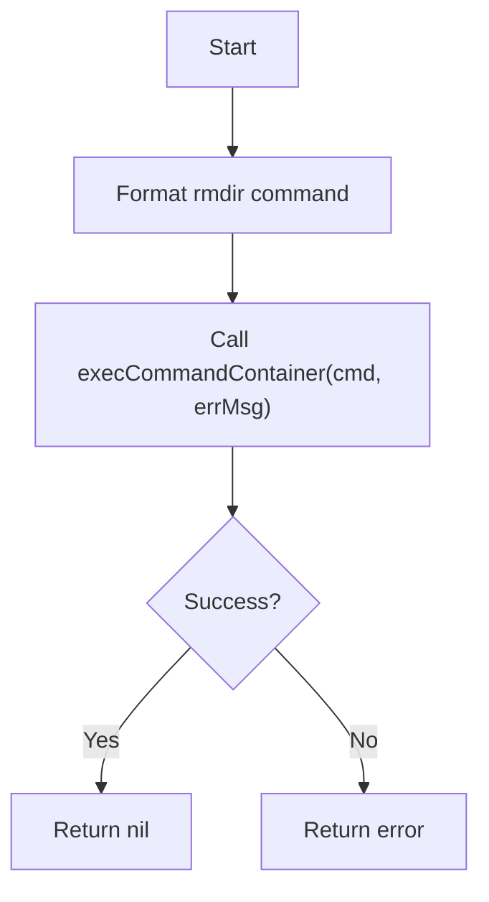

#### Function dependencies (Mermaid)

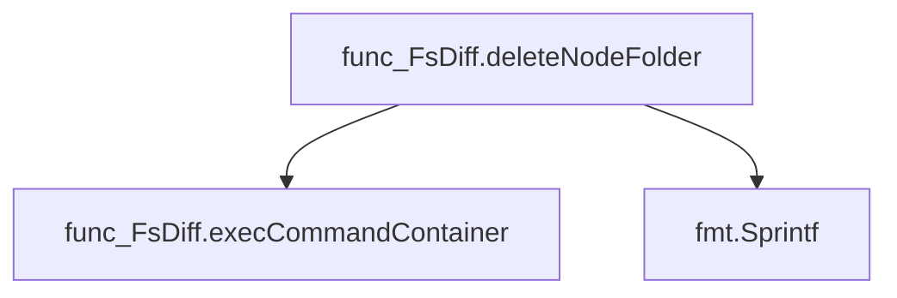

#### Functions calling `FsDiff.deleteNodeFolder` (Mermaid)

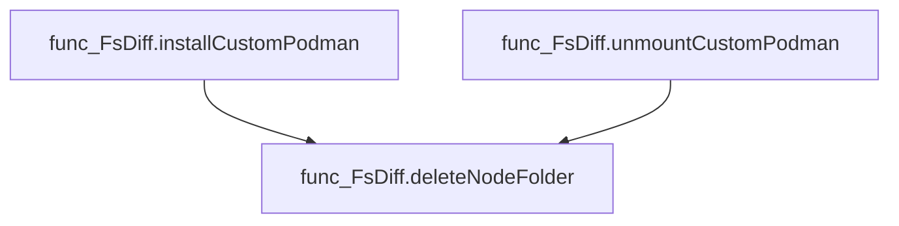

#### Usage example (Go)

```go
// Minimal example invoking FsDiff.deleteNodeFolder
func example() {
    f := &FsDiff{}
    if err := f.deleteNodeFolder(); err != nil {
        fmt.Printf("Failed to delete node folder: %v\n", err)
    } else {
        fmt.Println("Node folder deleted successfully.")
    }
}
```

---

### FsDiff.execCommandContainer

**execCommandContainer** - Runs `cmd` inside the container that hosts the probe pod. Any non‑empty stdout or stderr, or a failure of the underlying execution, causes an error containing the supplied `errorStr` and diagnostic information.

#### Signature (Go)

```go
func (f *FsDiff) execCommandContainer(cmd, errorStr string) error
```

#### Summary Table

| Aspect | Details |
|--------|---------|
| **Purpose** | Runs `cmd` inside the container that hosts the probe pod. Any non‑empty stdout or stderr, or a failure of the underlying execution, causes an error containing the supplied `errorStr` and diagnostic information. |
| **Parameters** | `cmd string –` command to run; `errorStr string –` prefix for the returned error message |
| **Return value** | `error –` nil on success, otherwise an error describing unexpected output or execution failure |
| **Key dependencies** | • `f.clientHolder.ExecCommandContainer` (executes command in pod) <br>• `errors.New` (creates error object) <br>• `fmt.Sprintf` (formats diagnostic message) |
| **Side effects** | No state changes; only I/O to the container’s stdout/stderr and potential propagation of the execution error. |
| **How it fits the package** | Provides a low‑level helper used by higher‑level operations that manipulate temporary directories or bind mounts on the node through the probe pod. |

#### Internal workflow (Mermaid)

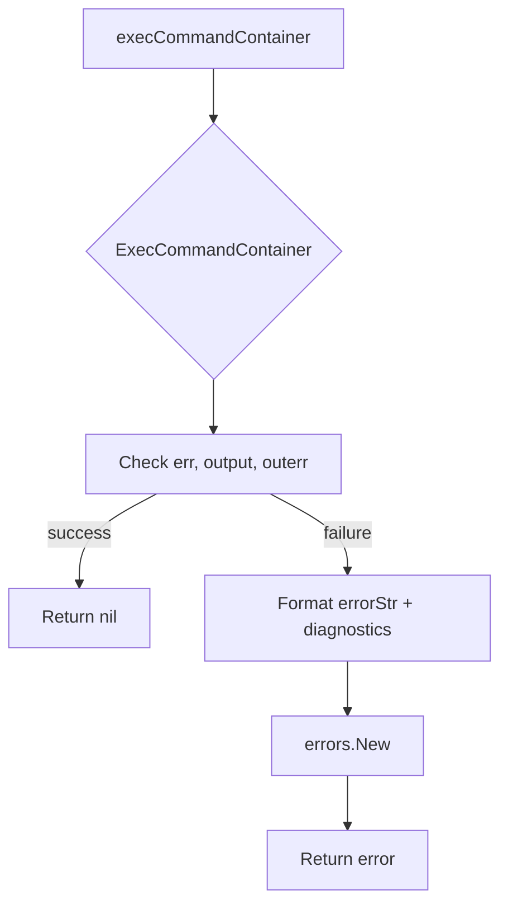

#### Function dependencies (Mermaid)

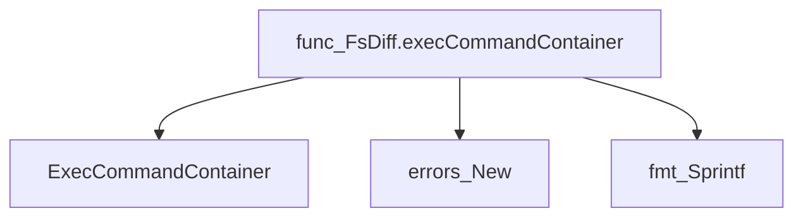

#### Functions calling `FsDiff.execCommandContainer` (Mermaid)

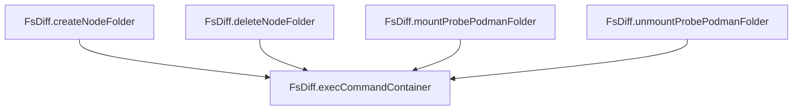

#### Usage example (Go)

```go
// Minimal example invoking execCommandContainer
func (f *FsDiff) example() error {
    // Create a temporary directory on the node via the probe pod.
    return f.execCommandContainer(
        fmt.Sprintf("mkdir %s", "/tmp/example"),
        "failed or unexpected output when creating /tmp/example",
    )
}
```

---

### FsDiff.installCustomPodman

**installCustomPodman** - Creates a temporary directory on the node, mounts the partner’s Podman binary into it, and prepares the environment for subsequent `podman diff` invocations.

#### Signature (Go)

```go
func (f *FsDiff) installCustomPodman() error
```

#### Summary Table

| Aspect | Details |
|--------|---------|
| **Purpose** | Creates a temporary directory on the node, mounts the partner’s Podman binary into it, and prepares the environment for subsequent `podman diff` invocations. |
| **Parameters** | None |
| **Return value** | `error`: non‑nil if folder creation, mounting or cleanup fails; otherwise `nil`. |
| **Key dependencies** | • `FsDiff.createNodeFolder()` – executes `mkdir` inside the container.<br>• `FsDiff.mountProbePodmanFolder()` – performs a bind mount of the partner Podman folder.<br>• `FsDiff.deleteNodeFolder()` – removes the temporary directory if mounting fails.<br>• `f.check.LogInfo()` – logs informational messages.<br>• `fmt.Errorf` – formats error strings. |
| **Side effects** | • Filesystem changes inside the container (directory creation, bind mount).<br>• Logging output via the test checker. |
| **How it fits the package** | The function is invoked by `FsDiff.RunTest` when a custom Podman binary must be used to run `podman diff`. It prepares the environment so that subsequent operations can access the correct binary without interfering with the host system. |

#### Internal workflow (Mermaid)

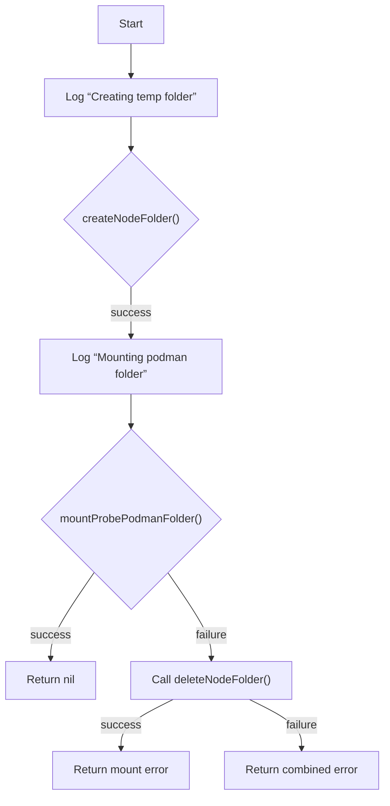

#### Function dependencies (Mermaid)

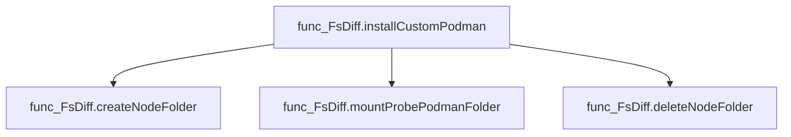

#### Functions calling `FsDiff.installCustomPodman` (Mermaid)

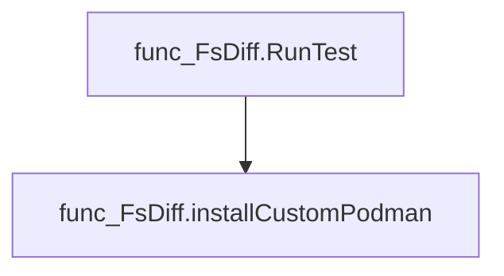

#### Usage example (Go)

```go
// Minimal example invoking FsDiff.installCustomPodman
f := &cnffsdiff.FsDiff{ /* fields initialized elsewhere */ }
if err := f.installCustomPodman(); err != nil {
    fmt.Printf("Failed to set up custom Podman: %v\n", err)
}
```

---

### FsDiff.intersectTargetFolders

**intersectTargetFolders** - Returns only those folder paths from `src` that match any of the pre‑defined `targetFolders`. Logs a warning for each matched path.

#### 1) Signature (Go)

```go
func (f *FsDiff) intersectTargetFolders(src []string) []string
```

#### 2) Summary Table

| Aspect | Details |
|--------|---------|
| **Purpose** | Returns only those folder paths from `src` that match any of the pre‑defined `targetFolders`. Logs a warning for each matched path. |
| **Parameters** | `src []string –` list of folder paths returned by a podman diff operation. |
| **Return value** | `[]string –` slice containing only the folders that are present in `targetFolders`. |
| **Key dependencies** | • `github.com/redhat-best-practices-for-k8s/certsuite/pkg/stringhelper.StringInSlice`<br>• `f.check.LogWarn`<br>• Built‑in `append` |
| **Side effects** | Logs warnings via the test checker; no state mutation beyond local slice construction. |
| **How it fits the package** | Used by `FsDiff.RunTest` to narrow down diff results to a small, relevant set of directories for verification. |

#### 3) Internal workflow (Mermaid)

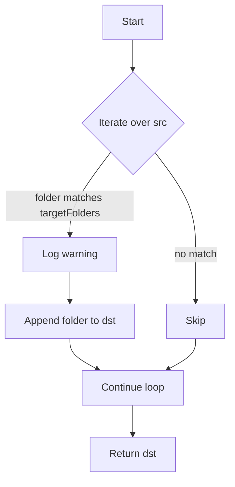

#### 4) Function dependencies (Mermaid)

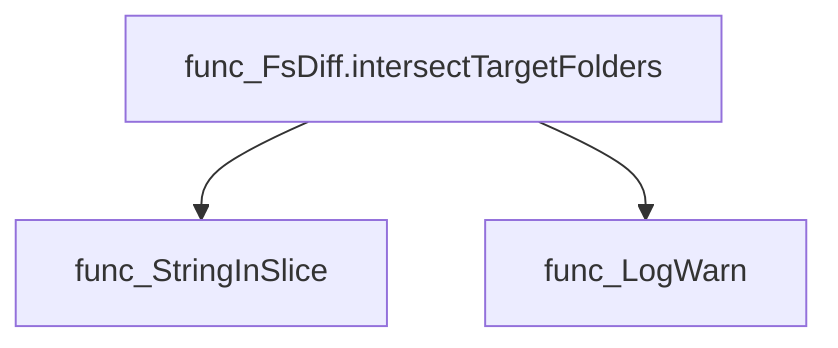

#### 5) Functions calling `FsDiff.intersectTargetFolders` (Mermaid)

```mermaid
graph TD
  func_FsDiff.RunTest --> func_FsDiff.intersectTargetFolders
```

#### 6) Usage example (Go)

```go
// Minimal example invoking FsDiff.intersectTargetFolders

func main() {
    // Assume we have a pre‑configured FsDiff instance `fd`.
    diffOutput := []string{"/etc/passwd", "/var/log/app.log", "/home/user/.bashrc"}
    relevant := fd.intersectTargetFolders(diffOutput)
    fmt.Println("Relevant folders:", relevant)
}
```

---

### FsDiff.mountProbePodmanFolder

**mountProbePodmanFolder** - Binds the `partnerPodmanFolder` inside the probe container to a local temporary folder (`nodeTmpMountFolder`) so that files can be inspected or manipulated from the host.

#### Signature (Go)

```go
func (f *FsDiff) mountProbePodmanFolder() error
```

#### Summary Table

| Aspect | Details |
|--------|---------|
| **Purpose** | Binds the `partnerPodmanFolder` inside the probe container to a local temporary folder (`nodeTmpMountFolder`) so that files can be inspected or manipulated from the host. |
| **Parameters** | None |
| **Return value** | `error` – non‑nil if the bind mount command fails or produces unexpected output. |
| **Key dependencies** | • Calls `FsDiff.execCommandContainer` to run the mount command inside the container.<br>• Uses `fmt.Sprintf` for error message formatting. |
| **Side effects** | Executes a shell command within the probe pod; if successful, the folder becomes accessible at `nodeTmpMountFolder`. No state mutation on Go objects occurs. |
| **How it fits the package** | Part of the test harness that prepares the environment for filesystem diffing between two container runtimes (podman vs. CRI‑O). It is invoked during installation of a custom podman instance. |

#### Internal workflow (Mermaid)

```mermaid
flowchart TD
  A["Start"] --> B{"Run mount command"}
  B -->|"Success"| C["Mount completed"]
  B -->|"Failure"| D["Return error"]
```

#### Function dependencies

```mermaid
graph TD
  FsDiff.mountProbePodmanFolder --> FsDiff.execCommandContainer
  FsDiff.mountProbePodmanFolder --> fmt.Sprintf
```

#### Functions calling `FsDiff.mountProbePodmanFolder` (Mermaid)

```mermaid
graph TD
  FsDiff.installCustomPodman --> FsDiff.mountProbePodmanFolder
```

#### Usage example (Go)

```go
// Minimal example invoking FsDiff.mountProbePodmanFolder
f := &FsDiff{ /* assume clientHolder and other fields are initialized */ }
if err := f.mountProbePodmanFolder(); err != nil {
    log.Fatalf("Failed to mount probe podman folder: %v", err)
}
```

---

### FsDiff.runPodmanDiff

**runPodmanDiff** - Runs `podman diff --format json` for the specified container and returns its JSON output. Handles both system‑wide and custom Podman binaries.

#### Signature (Go)

```go
func (f *FsDiff) runPodmanDiff(containerUID string) (string, error)
```

#### Summary Table

| Aspect | Details |
|--------|---------|
| **Purpose** | Runs `podman diff --format json` for the specified container and returns its JSON output. Handles both system‑wide and custom Podman binaries. |
| **Parameters** | *containerUID* string – identifier of the target container. |
| **Return value** | *output* string – JSON diff result; *error* if command execution or output parsing fails. |
| **Key dependencies** | • `fmt.Sprintf` (formatting path)<br>• `clientHolder.ExecCommandContainer` (remote command execution)<br>• `fmt.Errorf` (error wrapping) |
| **Side effects** | No state mutation; performs I/O by executing a remote shell command and capturing stdout/stderr. |
| **How it fits the package** | Provides the low‑level diff data that higher‑level methods (`RunTest`) parse to determine file system changes in a container. |

#### Internal workflow (Mermaid)

```mermaid
flowchart TD
  A["Determine podmanPath"] --> B{"Use custom Podman?"}
  B -- Yes --> C["Set path: tmpMountDestFolder/podman"]
  B -- No --> D["Default path: podman"]
  subgraph ExecuteCommand
    E["Build command string"] --> F["clientHolder.ExecCommandContainer"]
  end
  G{"Check err"} -->|"non‑nil"| H["Return wrapped error"]
  G --> I{"Check stderr"}
  I -->|"non‑empty"| H
  I -->|"empty"| J["Return stdout, nil"]
```

#### Function dependencies (Mermaid)

```mermaid
graph TD
  func_FsDiff.runPodmanDiff --> fmt.Sprintf
  func_FsDiff.runPodmanDiff --> clientHolder.ExecCommandContainer
  func_FsDiff.runPodmanDiff --> fmt.Errorf
```

#### Functions calling `FsDiff.runPodmanDiff` (Mermaid)

```mermaid
graph TD
  FsDiff.RunTest --> func_FsDiff.runPodmanDiff
```

#### Usage example (Go)

```go
// Minimal example invoking FsDiff.runPodmanDiff
f := &FsDiff{useCustomPodman: false, clientHolder: someClient}
output, err := f.runPodmanDiff("my-container-id")
if err != nil {
    log.Fatalf("podman diff failed: %v", err)
}
fmt.Println("Podman diff output:", output)
```

---

### FsDiff.unmountCustomPodman

**unmountCustomPodman** - Detaches the host mount point that was created for the custom Podman instance and removes its temporary directory. It is invoked automatically when a test finishes using a custom Podman binary.

#### Signature (Go)

```go
func (f *FsDiff) unmountCustomPodman()
```

#### Summary Table

| Aspect | Details |
|--------|---------|
| **Purpose** | Detaches the host mount point that was created for the custom Podman instance and removes its temporary directory. It is invoked automatically when a test finishes using a custom Podman binary. |
| **Parameters** | `f *FsDiff` – receiver holding test state, logger, error accumulator, and configuration flags. |
| **Return value** | None (the function updates the receiver’s fields instead of returning values). |
| **Key dependencies** | • `LogInfo` – logs progress.<br>• `unmountProbePodmanFolder` – executes `umount` on the mount point.<br>• `deleteNodeFolder` – removes the temporary directory. |
| **Side effects** | *I/O: runs system commands to unmount and delete a directory.<br>* State mutation: sets `f.Error` and `f.result` if any step fails.<br>* Logging output via `f.check`. |
| **How it fits the package** | Part of the cleanup routine for tests that install a custom Podman binary (`FsDiff.installCustomPodman`). It ensures that resources allocated during the test are released, preventing interference with subsequent tests. |

#### Internal workflow (Mermaid)

```mermaid
flowchart TD
  A["Start"] --> B{"Unmount probe folder"}
  B -- success --> C["Delete temporary folder"]
  B -- failure --> D["Set error & result to ERROR"]
  C -- success --> E["End"]
  C -- failure --> F["Set error & result to ERROR"]
```

#### Function dependencies (Mermaid)

```mermaid
graph TD
  FsDiff.unmountCustomPodman --> LogInfo
  FsDiff.unmountCustomPodman --> FsDiff.unmountProbePodmanFolder
  FsDiff.unmountCustomPodman --> FsDiff.deleteNodeFolder
```

#### Functions calling `FsDiff.unmountCustomPodman` (Mermaid)

```mermaid
graph TD
  FsDiff.RunTest --> FsDiff.unmountCustomPodman
```

#### Usage example (Go)

```go
// Minimal example invoking unmountCustomPodman as part of a test run.
func example() {
    diff := &FsDiff{useCustomPodman: true}
    // ... install custom podman, run tests ...
    defer diff.unmountCustomPodman()
}
```

---

### FsDiff.unmountProbePodmanFolder

**unmountProbePodmanFolder** - Executes an `umount` command inside the target container to detach the temporary probe directory (`nodeTmpMountFolder`).

#### Signature (Go)

```go
func (f *FsDiff) unmountProbePodmanFolder() error
```

#### Summary Table

| Aspect | Details |
|--------|---------|
| **Purpose** | Executes an `umount` command inside the target container to detach the temporary probe directory (`nodeTmpMountFolder`). |
| **Parameters** | None. The method relies on receiver fields such as `f.clientHolder`, `f.ctxt`, and the global constant `nodeTmpMountFolder`. |
| **Return value** | `error` – wrapped with contextual information if the command fails or produces unexpected output. |
| **Key dependencies** | • `FsDiff.execCommandContainer`<br>• `fmt.Sprintf` (twice) |
| **Side effects** | Performs a container‑injected system call that may modify filesystem state inside the container; returns error on failure. |
| **How it fits the package** | Used during cleanup in `unmountCustomPodman`, ensuring the probe mount does not persist after tests complete. |

#### Internal workflow (Mermaid)

```mermaid
flowchart TD
  A["Start"] --> B{"Prepare umount command"}
  B --> C["fmt.Sprintf(umount %s, nodeTmpMountFolder)"]
  C --> D["execCommandContainer(command, errorMessage)"]
  D --> E["Return result"]
```

#### Function dependencies (Mermaid)

```mermaid
graph TD
  func_FsDiff.unmountProbePodmanFolder --> func_FsDiff.execCommandContainer
  func_FsDiff.unmountProbePodmanFolder --> fmt.Sprintf
```

#### Functions calling `FsDiff.unmountProbePodmanFolder` (Mermaid)

```mermaid
graph TD
  func_FsDiff.unmountCustomPodman --> func_FsDiff.unmountProbePodmanFolder
```

#### Usage example (Go)

```go
// Minimal example invoking FsDiff.unmountProbePodmanFolder
fd := &FsDiff{ /* initialize fields as required */ }
if err := fd.unmountProbePodmanFolder(); err != nil {
    fmt.Printf("Failed to unmount probe folder: %v\n", err)
}
```

---

---

### shouldUseCustomPodman

**shouldUseCustomPodman** - Decides whether the probe should run with a custom‑compiled podman binary or rely on the preinstalled podman that ships with OpenShift nodes. The decision is based on the supplied OpenShift (OCP) version.

#### Signature (Go)

```go
func shouldUseCustomPodman(check *checksdb.Check, ocpVersion string) bool
```

#### Summary Table

| Aspect | Details |
|--------|---------|
| **Purpose** | Decides whether the probe should run with a custom‑compiled podman binary or rely on the preinstalled podman that ships with OpenShift nodes. The decision is based on the supplied OpenShift (OCP) version. |
| **Parameters** | `check *checksdb.Check` – logger and context object for reporting; <br>`ocpVersion string` – semantic version string of the target OCP cluster. |
| **Return value** | `bool` – `true` if the custom podman should be used, otherwise `false`. |
| **Key dependencies** | • `semver.NewVersion` – parses the version string.<br>• `check.LogError` – logs parsing failures.<br>• `version.Major`, `version.Minor` – semantic‑version helpers. |
| **Side effects** | Emits an error log when the OCP version cannot be parsed; otherwise purely computational. No external I/O or state changes. |
| **How it fits the package** | Used by `NewFsDiffTester` to configure a filesystem diff test runner with the appropriate podman binary, ensuring compatibility across different RHEL‑based OpenShift releases. |

#### Internal workflow (Mermaid)

```mermaid
flowchart TD
  A["Start"] --> B{"Parse ocpVersion"}
  B -- success --> C{"Major > 4?"}
  B -- failure --> D["Log error, use preinstalled podman"]
  C -- yes --> D
  C -- no --> E{"Major == 4?"}
  E -- yes --> F{"Minor < 13?"}
  F -- yes --> G["Use custom podman (return true)"]
  F -- no --> D
  E -- no --> D
  D --> H["Return false"]
```

#### Function dependencies

```mermaid
graph TD
  func_shouldUseCustomPodman --> func_NewVersion
  func_shouldUseCustomPodman --> func_LogError
  func_shouldUseCustomPodman --> func_Major
  func_shouldUseCustomPodman --> func_Minor
```

#### Functions calling `shouldUseCustomPodman`

```mermaid
graph TD
  func_NewFsDiffTester --> func_shouldUseCustomPodman
```

#### Usage example (Go)

```go
// Minimal example invoking shouldUseCustomPodman
import (
    "github.com/redhat-best-practices-for-k8s/certsuite/tests/platform/cnffsdiff"
    "github.com/redhat-best-practices-for-k8s/certsuite/tests/checksdb"
)

// Assume we have a check instance and an OCP version string.
var check *checksdb.Check
ocpVersion := "4.12.3"

useCustom := cnffsdiff.shouldUseCustomPodman(check, ocpVersion)
if useCustom {
    fmt.Println("Running with custom podman binary")
} else {
    fmt.Println("Using preinstalled podman on the node")
}
```

---

---
