# Package hugepages

**Path**: `tests/platform/hugepages`

## Table of Contents

- [Overview](#overview)
- [Structs](#structs)
  - [Tester](#tester)
- [Exported Functions](#exported-functions)
  - [NewTester](#newtester)
  - [Tester.HasMcSystemdHugepagesUnits](#tester.hasmcsystemdhugepagesunits)
  - [Tester.Run](#tester.run)
  - [Tester.TestNodeHugepagesWithKernelArgs](#tester.testnodehugepageswithkernelargs)
  - [Tester.TestNodeHugepagesWithMcSystemd](#tester.testnodehugepageswithmcsystemd)
  - [hugepagesByNuma.String](#hugepagesbynuma.string)
- [Local Functions](#local-functions)
  - [Tester.getNodeNumaHugePages](#tester.getnodenumahugepages)
  - [getMcHugepagesFromMcKernelArguments](#getmchugepagesfrommckernelarguments)
  - [getMcSystemdUnitsHugepagesConfig](#getmcsystemdunitshugepagesconfig)
  - [hugepageSizeToInt](#hugepagesizetoint)
  - [logMcKernelArgumentsHugepages](#logmckernelargumentshugepages)

## Overview

Manages validation of huge‑page configuration on a node against the MachineConfig used in the cluster, supporting both kernel argument and systemd unit mechanisms.

### Key Features

- Parses MachineConfig kernel arguments or systemd unit files to extract expected huge‑page sizes, counts and NUMA mapping
- Executes commands inside a probe pod to read actual per‑NUMA huge‑page allocation on the node
- Compares expected versus observed values and reports mismatches via structured logging

### Design Notes

- Assumes MachineConfig is present in the pod’s filesystem and that kernel arguments follow a specific pattern; errors are surfaced as fmt.Errorf
- The comparison logic treats missing entries as zero, ensuring strict alignment with defaults
- Best practice: run Tester.Run after node has finished booting so systemd units are active

### Structs Summary

| Name | Purpose |
|------|----------|
| [**Tester**](#tester) | One‑line purpose |

### Exported Functions Summary

| Name | Purpose |
|------|----------|
| [func NewTester(node *provider.Node, probePod *corev1.Pod, commander clientsholder.Command) (*Tester, error)](#newtester) | Instantiates a `Tester` that gathers huge‑page information from a node and its MachineConfig. |
| [func (tester *Tester) HasMcSystemdHugepagesUnits() bool](#tester.hasmcsystemdhugepagesunits) | Returns `true` if the tester has at least one Systemd hugepage unit mapped to a NUMA node, otherwise `false`. |
| [func (tester *Tester) Run() error](#tester.run) | Orchestrates comparison of MachineConfig (MC) huge‑page settings with the node’s actual configuration, choosing between Systemd units or kernel arguments based on availability. |
| [func (tester *Tester) TestNodeHugepagesWithKernelArgs() (bool, error)](#tester.testnodehugepageswithkernelargs) | Validates that the hugepage sizes and counts declared in a node’s `MachineConfig` kernel arguments match the actual hugepage allocation observed on the node. For each size present in the kernel arguments, the sum of node‑level allocations must equal the specified count; other sizes should have zero allocation. |
| [func (tester *Tester) TestNodeHugepagesWithMcSystemd() (bool, error)](#tester.testnodehugepageswithmcsystemd) | Validates that each node‑specific hugepage size and count matches the MachineConfig systemd units; ensures missing entries are zeroed. |
| [func (numaHps hugepagesByNuma) String() string](#hugepagesbynuma.string) | Formats `hugepagesByNuma` as a string where each NUMA node is listed with its page sizes and counts, sorted by node ID. |

### Local Functions Summary

| Name | Purpose |
|------|----------|
| [func (tester *Tester) getNodeNumaHugePages() (hugepages hugepagesByNuma, err error)](#tester.getnodenumahugepages) | Reads the node’s current hugepage allocation per NUMA node by executing a command inside the probe pod and parses its output. |
| [func getMcHugepagesFromMcKernelArguments(mc *provider.MachineConfig) (hugepagesPerSize map[int]int, defhugepagesz int)](#getmchugepagesfrommckernelarguments) | Parses kernel‑argument strings in a `MachineConfig` to build a mapping of hugepage size (in kB) → count, and returns the default hugepage size. |
| [func getMcSystemdUnitsHugepagesConfig(mc *provider.MachineConfig) (hugepagesByNuma, error)](#getmcsystemdunitshugepagesconfig) | Parses systemd unit files in a MachineConfig to extract huge‑page count, size, and NUMA node information. |
| [func hugepageSizeToInt(s string) int](#hugepagesizetoint) | Parses a string such as `"1M"` or `"2G"` and returns the size in kilobytes. The function supports megabyte (`'M'`) and gigabyte (`'G'`) units, converting them to the appropriate number of kilobytes. |
| [func logMcKernelArgumentsHugepages(hugepagesPerSize map[int]int, defhugepagesz int) {}](#logmckernelargumentshugepages) | Formats and logs the hugepage size‑to‑count mapping along with the default hugepage size extracted from a MachineConfig’s kernel arguments. |

## Structs

### Tester

The `Tester` struct orchestrates validation of a node’s hugepage configuration against the corresponding MachineConfig specifications (either via kernel arguments or systemd unit files).

#### Fields

| Field | Type | Description |
|-------|------|-------------|
| `node` | `*provider.Node` | Reference to the target node being tested. |
| `context` | `clientsholder.Context` | Execution context for running commands inside the probe pod on the node. |
| `commander` | `clientsholder.Command` | Interface used to execute shell commands on the node. |
| `nodeHugepagesByNuma` | `hugepagesByNuma` | Map of NUMA index → (hugepage size → count) representing actual node values obtained via `getNodeNumaHugePages`. |
| `mcSystemdHugepagesByNuma` | `hugepagesByNuma` | Map of NUMA index → (hugepage size → count) parsed from the MachineConfig’s systemd unit files. |

#### Purpose  

`Tester` encapsulates all data and logic required to compare a node’s runtime hugepage allocation against what is declared in its MachineConfig. It supports two comparison modes:  

1. **Kernel arguments** – when the MachineConfig only specifies hugepages via `kernelArguments`.  
2. **Systemd units** – when the MachineConfig declares per‑NUMA hugepage settings through systemd unit files.

The struct provides methods to perform the comparison, report mismatches, and return a success flag or detailed error information.

#### Related functions

| Function | Purpose |
|----------|---------|
| `NewTester` | Constructs a `Tester`, populating node data, context, commander, and loading both node‑side and MachineConfig‑side hugepage configurations. |
| `HasMcSystemdHugepagesUnits` | Indicates whether the MachineConfig contains systemd unit entries for hugepages (used to choose comparison strategy). |
| `Run` | Executes the appropriate validation routine (`TestNodeHugepagesWithKernelArgs` or `TestNodeHugepagesWithMcSystemd`) and returns any errors. |
| `TestNodeHugepagesWithKernelArgs` | Compares node NUMA‑level hugepage counts against MachineConfig kernel arguments, ensuring sizes match globally. |
| `TestNodeHugepagesWithMcSystemd` | Performs a detailed per‑NUMA and per‑size comparison between node values and MachineConfig systemd unit specifications. |
| `getNodeNumaHugePages` | Helper that runs a command on the node to retrieve actual hugepage counts per NUMA node, populating `nodeHugepagesByNuma`. |

---

---

## Exported Functions

### NewTester

**NewTester** - Instantiates a `Tester` that gathers huge‑page information from a node and its MachineConfig.

#### Signature (Go)

```go
func NewTester(node *provider.Node, probePod *corev1.Pod, commander clientsholder.Command) (*Tester, error)
```

#### Summary Table

| Aspect | Details |
|--------|---------|
| **Purpose** | Instantiates a `Tester` that gathers huge‑page information from a node and its MachineConfig. |
| **Parameters** | `node *provider.Node` – target node; <br>`probePod *corev1.Pod` – probe pod running on the node; <br>`commander clientsholder.Command` – command executor interface. |
| **Return value** | `(*Tester, error)` – a fully initialised tester or an error if data collection fails. |
| **Key dependencies** | • `clientsholder.NewContext` – builds execution context.<br>• `tester.getNodeNumaHugePages()` – fetches node‑level huge‑page stats.<br>• `getMcSystemdUnitsHugepagesConfig(&tester.node.Mc)` – parses MachineConfig for huge‑page config. |
| **Side effects** | Logs progress via the package logger; performs remote command execution inside the probe pod. No global state is modified. |
| **How it fits the package** | Serves as a factory function used by test harnesses (e.g., `testHugepages`) to create per‑node testers that validate huge‑page compliance. |

#### Internal workflow

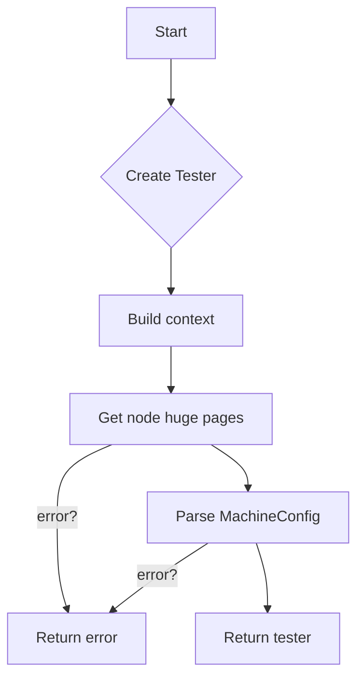

#### Function dependencies

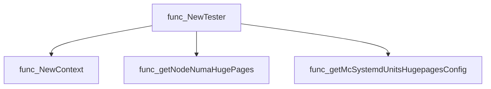

#### Functions calling `NewTester`

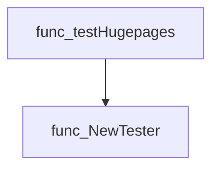

#### Usage example (Go)

```go
// Minimal example invoking NewTester
import (
    "github.com/redhat-best-practices-for-k8s/certsuite/internal/clientsholder"
    "github.com/redhat-best-practices-for-k8s/certsuite/internal/provider"
    corev1 "k8s.io/api/core/v1"
)

func example() error {
    // Assume node, pod, and command executor are already available
    var node *provider.Node
    var probePod *corev1.Pod
    commander := clientsholder.GetClientsHolder()

    tester, err := hugepages.NewTester(node, probePod, commander)
    if err != nil {
        return err
    }
    // Run the test logic
    return tester.Run()
}
```

---

### Tester.HasMcSystemdHugepagesUnits

**HasMcSystemdHugepagesUnits** - Returns `true` if the tester has at least one Systemd hugepage unit mapped to a NUMA node, otherwise `false`.

Checks whether the tester has any MachineConfig Systemd hugepage units collected for NUMA nodes.

#### Signature (Go)

```go
func (tester *Tester) HasMcSystemdHugepagesUnits() bool
```

#### Summary Table

| Aspect | Details |
|--------|---------|
| **Purpose** | Returns `true` if the tester has at least one Systemd hugepage unit mapped to a NUMA node, otherwise `false`. |
| **Parameters** | None. |
| **Return value** | `bool` – presence of Systemd hugepage units (`>0`). |
| **Key dependencies** | • `len` (built‑in function)<br>• `tester.mcSystemdHugepagesByNuma` (map field) |
| **Side effects** | None. Purely reads internal state. |
| **How it fits the package** | Determines which path of hugepage comparison logic to execute in `Tester.Run`. |

#### Internal workflow (Mermaid)

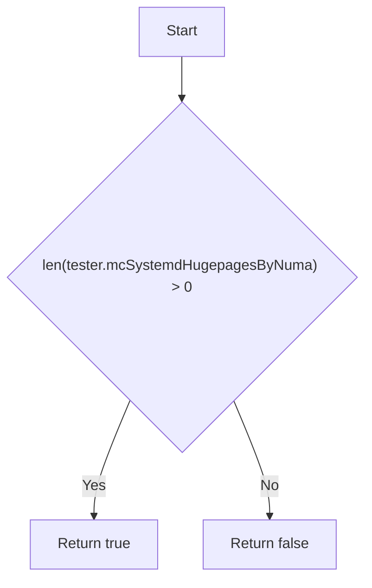

#### Function dependencies (Mermaid)

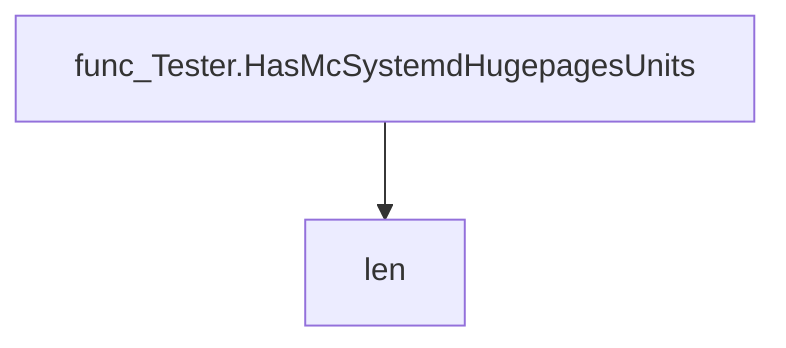

#### Functions calling `Tester.HasMcSystemdHugepagesUnits` (Mermaid)

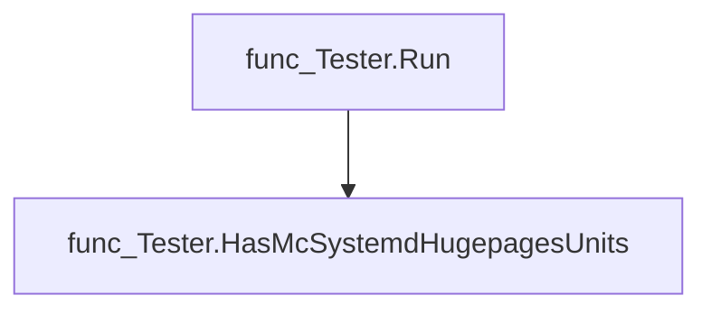

#### Usage example (Go)

```go
// Minimal example invoking Tester.HasMcSystemdHugepagesUnits
func main() {
    tester := &Tester{}
    // Assume mcSystemdHugepagesByNuma is initialized elsewhere
    if tester.HasMcSystemdHugepagesUnits() {
        fmt.Println("MachineConfig Systemd hugepage units present.")
    } else {
        fmt.Println("No MachineConfig Systemd hugepage units found.")
    }
}
```

---

### Tester.Run

**Run** - Orchestrates comparison of MachineConfig (MC) huge‑page settings with the node’s actual configuration, choosing between Systemd units or kernel arguments based on availability.

#### Signature (Go)

```go
func (tester *Tester) Run() error
```

#### Summary Table

| Aspect | Details |
|--------|---------|
| **Purpose** | Orchestrates comparison of MachineConfig (MC) huge‑page settings with the node’s actual configuration, choosing between Systemd units or kernel arguments based on availability. |
| **Parameters** | *none* – operates on the receiver `tester`. |
| **Return value** | `error` – non‑nil if any validation fails; otherwise nil. |
| **Key dependencies** | • `Tester.HasMcSystemdHugepagesUnits()`<br>• `log.Info` (internal logger)<br>• `Tester.TestNodeHugepagesWithMcSystemd()`<br>• `Tester.TestNodeHugepagesWithKernelArgs()`<br>• `fmt.Errorf` |
| **Side effects** | Emits informational logs; may return an error that includes diagnostic messages. No state mutation occurs beyond logging. |
| **How it fits the package** | Entry point for huge‑page validation tests in the `hugepages` package; decides which comparison routine to invoke based on MC configuration. |

#### Internal workflow (Mermaid)

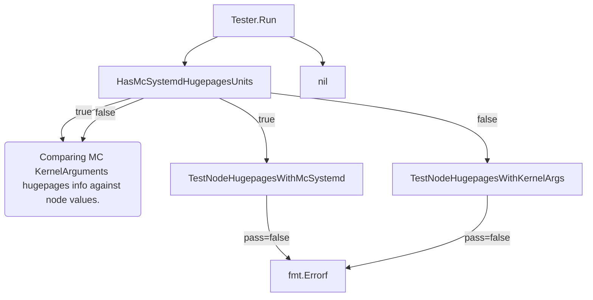

#### Function dependencies (Mermaid)

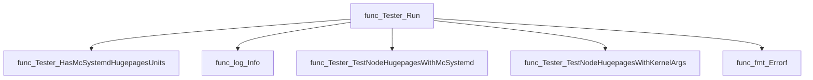

#### Functions calling `Tester.Run` (Mermaid)

None – this function is currently not referenced elsewhere in the package.

#### Usage example (Go)

```go
// Minimal example invoking Tester.Run
package main

import (
    "github.com/redhat-best-practices-for-k8s/certsuite/tests/platform/hugepages"
)

func main() {
    tester := &hugepages.Tester{
        // Populate tester fields as required for the test environment.
    }
    if err := tester.Run(); err != nil {
        fmt.Printf("Huge‑page validation failed: %v\n", err)
    } else {
        fmt.Println("All huge‑page checks passed.")
    }
}
```

---

### Tester.TestNodeHugepagesWithKernelArgs

**TestNodeHugepagesWithKernelArgs** - Validates that the hugepage sizes and counts declared in a node’s `MachineConfig` kernel arguments match the actual hugepage allocation observed on the node. For each size present in the kernel arguments, the sum of node‑level allocations must equal the specified count; other sizes should have zero allocation.

#### 1) Signature (Go)

```go
func (tester *Tester) TestNodeHugepagesWithKernelArgs() (bool, error)
```

#### 2) Summary Table

| Aspect | Details |
|--------|---------|
| **Purpose** | Validates that the hugepage sizes and counts declared in a node’s `MachineConfig` kernel arguments match the actual hugepage allocation observed on the node. For each size present in the kernel arguments, the sum of node‑level allocations must equal the specified count; other sizes should have zero allocation. |
| **Parameters** | `tester *Tester` – receiver containing node information and precomputed node‑by‑NUMA hugepage data (`nodeHugepagesByNuma`). |
| **Return value** | `bool, error` – `true` if all checks pass; otherwise `false` with an explanatory error. |
| **Key dependencies** | • `getMcHugepagesFromMcKernelArguments(&tester.node.Mc)` – parses kernel arguments into a map of size→count.<br>• `log.Info` – records successful matches.<br>• `fmt.Errorf` – constructs detailed failure messages. |
| **Side effects** | Emits informational logs; no state mutation occurs. |
| **How it fits the package** | Part of the *hugepages* test suite, invoked by `Tester.Run()` to verify that a node’s runtime hugepage configuration aligns with its MachineConfig specification. |

#### 3) Internal workflow (Mermaid)

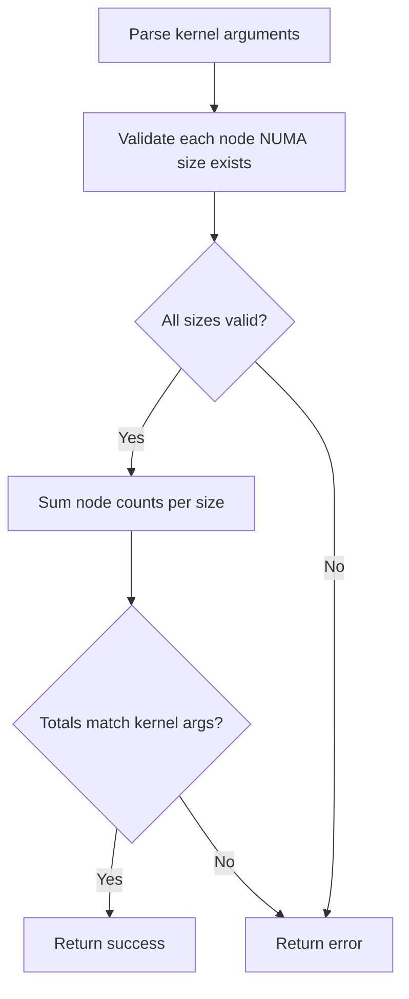

#### 4) Function dependencies (Mermaid)

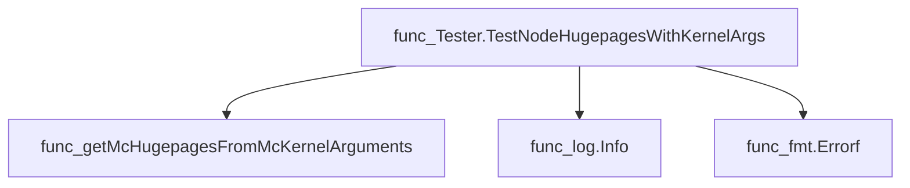

#### 5) Functions calling `Tester.TestNodeHugepagesWithKernelArgs` (Mermaid)

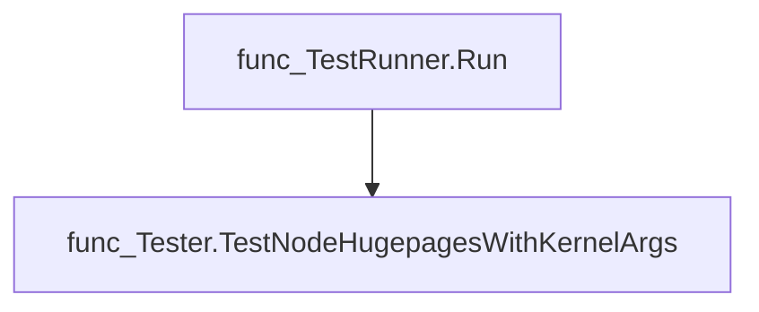

#### 6) Usage example (Go)

```go
// Minimal example invoking Tester.TestNodeHugepagesWithKernelArgs
tester := &Tester{node: nodeInfo, nodeHugepagesByNuma: numaMap}
pass, err := tester.TestNodeHugepagesWithKernelArgs()
if !pass {
    log.Fatalf("hugepage test failed: %v", err)
}
fmt.Println("Hugepage configuration matches kernel arguments.")
```

---

### Tester.TestNodeHugepagesWithMcSystemd

**TestNodeHugepagesWithMcSystemd** - Validates that each node‑specific hugepage size and count matches the MachineConfig systemd units; ensures missing entries are zeroed.

Compare the hugepage configuration reported by a node against the values defined in its MachineConfig systemd units.

---

#### Signature (Go)

```go
func (tester *Tester) TestNodeHugepagesWithMcSystemd() (bool, error)
```

---

#### Summary Table

| Aspect | Details |
|--------|---------|
| **Purpose** | Validates that each node‑specific hugepage size and count matches the MachineConfig systemd units; ensures missing entries are zeroed. |
| **Parameters** | `tester *Tester` – receiver containing cached node and MC hugepage maps (`nodeHugepagesByNuma`, `mcSystemdHugepagesByNuma`). |
| **Return value** | `bool, error` – `true` if all comparisons succeed; otherwise `false` with a descriptive error. |
| **Key dependencies** | • `log.Warn(msg string, args ...any)` (internal logger)  <br>• `fmt.Errorf(format string, args ...interface{})` (error formatting) |
| **Side effects** | Emits warning logs when a NUMA node exists in the node but not in MC; otherwise only returns errors. No state mutation occurs. |
| **How it fits the package** | Part of the hugepages test suite that checks consistency between node runtime and MachineConfig specifications before reporting success to higher‑level orchestrators. |

---

#### Internal workflow (Mermaid)

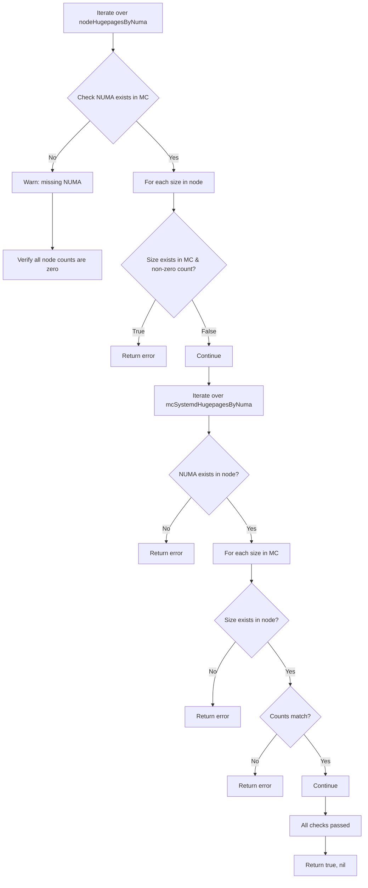

---

#### Function dependencies (Mermaid)

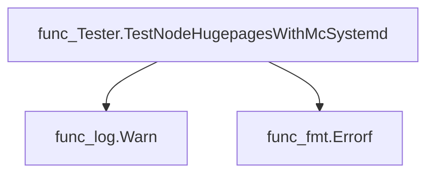

---

#### Functions calling `Tester.TestNodeHugepagesWithMcSystemd` (Mermaid)

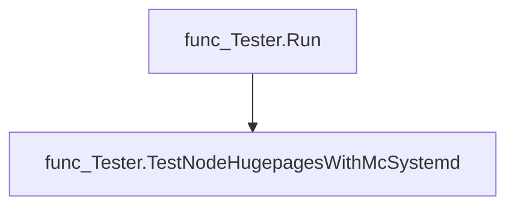

---

#### Usage example (Go)

```go
// Minimal example invoking Tester.TestNodeHugepagesWithMcSystemd
tester := &Tester{
    nodeHugepagesByNuma:   map[int]map[uint64]int{0: {2048: 4}},
    mcSystemdHugepagesByNuma: map[int]map[uint64]int{0: {2048: 4}},
}
pass, err := tester.TestNodeHugepagesWithMcSystemd()
if !pass {
    fmt.Printf("Hugepage mismatch: %v\n", err)
} else {
    fmt.Println("All hugepage settings match.")
}
```

---

### hugepagesByNuma.String

**String** - Formats `hugepagesByNuma` as a string where each NUMA node is listed with its page sizes and counts, sorted by node ID.

Provides a human‑readable string representation of the mapping from NUMA node IDs to page size counts, used for debugging and logging.

```go
func (numaHps hugepagesByNuma) String() string
```

| Aspect | Details |
|--------|---------|
| **Purpose** | Formats `hugepagesByNuma` as a string where each NUMA node is listed with its page sizes and counts, sorted by node ID. |
| **Parameters** | None (receiver: `numaHps hugepagesByNuma`) |
| **Return value** | `string` – concatenated representation of all nodes and their size/count pairs. |
| **Key dependencies** | *`sort.Ints`* – sorts NUMA indexes.<br>*`strings.Builder`* – efficient string construction.<br>*`fmt.Sprintf`* – formatting each component. |
| **Side effects** | None; pure function that only reads the receiver. |
| **How it fits the package** | Implements `Stringer` for `hugepagesByNuma`, enabling concise logging of hugepage distributions across NUMA nodes. |

#### Internal workflow (Mermaid)

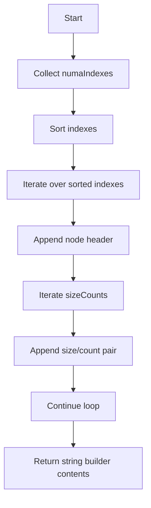

#### Function dependencies (Mermaid)

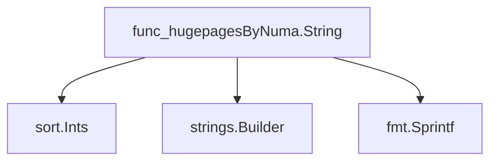

#### Functions calling `hugepagesByNuma.String` (Mermaid)

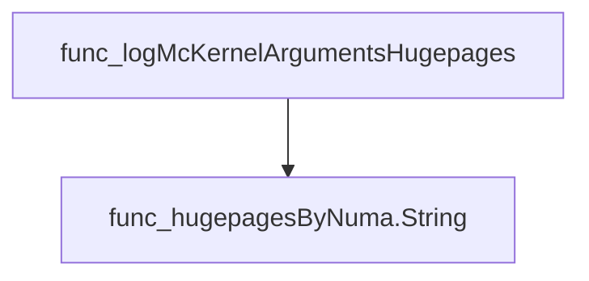

#### Usage example (Go)

```go
// Minimal example invoking hugepagesByNuma.String
var numaPages = hugepagesByNuma{
    0: {2048: 10, 1048576: 2},
    1: {2048: 5},
}
fmt.Println(numaPages.String())
// Output: Numa=0 [Size=2048kB Count=10] [Size=1048576kB Count=2] Numa=1 [Size=2048kB Count=5]
```

---

## Local Functions

### Tester.getNodeNumaHugePages

**getNodeNumaHugePages** - Reads the node’s current hugepage allocation per NUMA node by executing a command inside the probe pod and parses its output.

#### Signature (Go)

```go
func (tester *Tester) getNodeNumaHugePages() (hugepages hugepagesByNuma, err error)
```

#### Summary Table

| Aspect | Details |
|--------|---------|
| **Purpose** | Reads the node’s current hugepage allocation per NUMA node by executing a command inside the probe pod and parses its output. |
| **Parameters** | `tester *Tester` – receiver holding node, commander, and context information. |
| **Return value** | `hugepagesByNuma` – map of NUMA node to hugepage size/count pairs; `error` on failure to execute command or parse output. |
| **Key dependencies** | • `ExecCommandContainer` (runs shell command inside pod)  <br>• `log.Debug`, `log.Info` (logging)  <br>• `regexp.MustCompile`, `strings.Split`, `strconv.Atoi` (parsing)  <br>• `errors.New`, `fmt.Errorf` (error handling) |
| **Side effects** | No state mutation; only I/O via command execution and logging. |
| **How it fits the package** | Provides the baseline hugepage configuration used by tests that compare desired vs actual settings on a Kubernetes node. |

#### Internal workflow

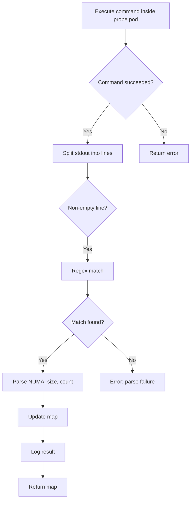

#### Function dependencies

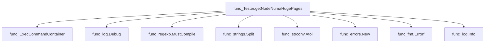

#### Functions calling `Tester.getNodeNumaHugePages`

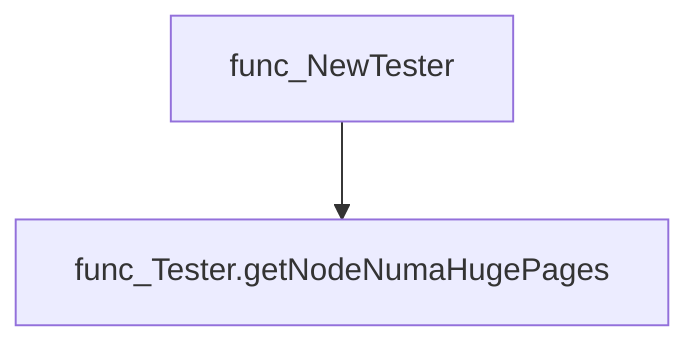

#### Usage example (Go)

```go
// Minimal example invoking Tester.getNodeNumaHugePages
tester, err := NewTester(node, probePod, commander)
if err != nil {
    log.Fatalf("cannot create tester: %v", err)
}
hugepages, err := tester.getNodeNumaHugePages()
if err != nil {
    log.Fatalf("failed to get hugepages: %v", err)
}
fmt.Printf("Hugepage config: %+v\n", hugepages)
```

---

### getMcHugepagesFromMcKernelArguments

**getMcHugepagesFromMcKernelArguments** - Parses kernel‑argument strings in a `MachineConfig` to build a mapping of hugepage size (in kB) → count, and returns the default hugepage size.

#### Signature (Go)

```go
func getMcHugepagesFromMcKernelArguments(mc *provider.MachineConfig) (hugepagesPerSize map[int]int, defhugepagesz int)
```

#### Summary Table

| Aspect | Details |
|--------|---------|
| **Purpose** | Parses kernel‑argument strings in a `MachineConfig` to build a mapping of hugepage size (in kB) → count, and returns the default hugepage size. |
| **Parameters** | `mc *provider.MachineConfig` – machine configuration containing kernel arguments. |
| **Return value** | `hugepagesPerSize map[int]int` – map from page size to count; `defhugepagesz int` – default hugepage size in kB. |
| **Key dependencies** | • `strings.Split`, `len` <br>• `strconv.Atoi`<br>• helper `hugepageSizeToInt` (parses `"1G"` → 1048576)<br>• logging via `log.Warn`, `logMcKernelArgumentsHugepages` |
| **Side effects** | Emits warning logs if no hugepage info is found; logs parsed configuration. No state mutation outside its local variables. |
| **How it fits the package** | Provides a central routine for tests that need to validate kernel‑argument based hugepage settings against node reports. |

#### Internal workflow (Mermaid)

```mermaid
flowchart TD
  A["Start"] --> B{"Iterate over mc.Spec.KernelArguments"}
  B -->|"Parse key=value"| C["Split argument"]
  C --> D{"Key is hugepages && value not empty"}
  D -->|"Add count to map"| E["Update hugepagesPerSize for current size"]
  D -->|"Else use default size"| F["Use RhelDefaultHugepagesz"]
  B --> G{"Key is hugepagesz"}
  G -->|"Set current size"| H["Convert value → int via hugepageSizeToInt"]
  H --> I["Create map entry with count = 0"]
  B --> J{"Key is default_hugepagesz"}
  J -->|"Set default size"| K["Convert value → int"]
  K --> L["Overwrite map entry for default size"]
  B --> M["Continue loop"]
  M --> B
  B --> N{"Map empty?"}
  N -->|"Yes"| O["Insert RhelDefaultHugepagesz→RhelDefaultHugepages"]
  N -->|"No"| Q["Proceed normally"]
  O --> P["Warn log"]
  Q --> S["Log parsed config via logMcKernelArgumentsHugepages"]
  S --> T["Return map, default size"]
```

#### Function dependencies (Mermaid)

```mermaid
graph TD
  func_getMcHugepagesFromMcKernelArguments --> strings_Split
  func_getMcHugepagesFromMcKernelArguments --> len
  func_getMcHugepagesFromMcKernelArguments --> strconv_Atoi
  func_getMcHugepagesFromMcKernelArguments --> hugepageSizeToInt
  func_getMcHugepagesFromMcKernelArguments --> log_Warn
  func_getMcHugepagesFromMcKernelArguments --> logMcKernelArgumentsHugepages
```

#### Functions calling `getMcHugepagesFromMcKernelArguments` (Mermaid)

```mermaid
graph TD
  func_TestNodeHugepagesWithKernelArgs --> func_getMcHugepagesFromMcKernelArguments
```

#### Usage example (Go)

```go
// Minimal example invoking getMcHugepagesFromMcKernelArguments
import (
    "github.com/redhat-best-practices-for-k8s/certsuite/internal/provider"
)

func main() {
    // Assume cfg is a populated provider.MachineConfig
    var cfg *provider.MachineConfig

    hugepages, defaultSize := getMcHugepagesFromMcKernelArguments(cfg)
    fmt.Printf("Default size: %d kB\n", defaultSize)
    for sz, cnt := range hugepages {
        fmt.Printf("Size %d kB → count %d\n", sz, cnt)
    }
}
```

---

### getMcSystemdUnitsHugepagesConfig

**getMcSystemdUnitsHugepagesConfig** - Parses systemd unit files in a MachineConfig to extract huge‑page count, size, and NUMA node information.

#### 1) Signature (Go)

```go
func getMcSystemdUnitsHugepagesConfig(mc *provider.MachineConfig) (hugepagesByNuma, error)
```

#### 2) Summary Table

| Aspect | Details |
|--------|---------|
| **Purpose** | Parses systemd unit files in a MachineConfig to extract huge‑page count, size, and NUMA node information. |
| **Parameters** | `mc *provider.MachineConfig` – the machine configuration containing systemd units. |
| **Return value** | `hugepagesByNuma` – a map keyed by NUMA node with values mapping page sizes to counts; `error` if parsing fails. |
| **Key dependencies** | • `regexp.MustCompile`, `strings.Trim`, `strings.Contains`, `log.Logger.Info`, <br>• `strconv.Atoi`, <br>• `fmt.Errorf` |
| **Side effects** | Logs progress and errors via the internal logger; no mutation of the input MachineConfig. |
| **How it fits the package** | Provides a helper for the huge‑pages tester to compare node‑level values with those declared in MachineConfig. |

#### 3) Internal workflow (Mermaid)

```mermaid
flowchart TD
    Start --> CompileRegex["Compile regex"]
    CompileRegex --> LoopUnits{"Iterate over mc.Config.Systemd.Units"}
    LoopUnits -->|"unit.Name contains hugepages-allocation"| ProcessUnit
    LoopUnits -->|"otherwise"| SkipUnit
    ProcessUnit --> TrimName["Trim unit name"]
    ProcessUnit --> ContainsCheck["Check for hugepages string"]
    ContainsCheck --> LogInfo["Log unit details"]
    LogInfo --> TrimContent["Trim unit contents"]
    TrimContent --> ExtractValues["Find regex submatches"]
    ExtractValues -->|"invalid"| ReturnError["Return fmt.Errorf"]
    ExtractValues --> ParseInts["Parse NUMA, size, count"]
    ParseInts --> UpdateMap{"Update hugepages map"}
    UpdateMap --> LoopUnits
    LoopUnits --> EndLoop{"All units processed?"}
    EndLoop -->|"yes"| LogSummary["Log final map or missing info"]
    LogSummary --> ReturnResult["Return hugepages, nil"]
```

#### 4) Function dependencies (Mermaid)

```mermaid
graph TD
  getMcSystemdUnitsHugepagesConfig --> regexp.MustCompile
  getMcSystemdUnitsHugepagesConfig --> strings.Trim
  getMcSystemdUnitsHugepagesConfig --> strings.Contains
  getMcSystemdUnitsHugepagesConfig --> log.Logger.Info
  getMcSystemdUnitsHugepagesConfig --> strconv.Atoi
  getMcSystemdUnitsHugepagesConfig --> fmt.Errorf
```

#### 5) Functions calling `getMcSystemdUnitsHugepagesConfig` (Mermaid)

```mermaid
graph TD
  NewTester --> getMcSystemdUnitsHugepagesConfig
```

#### 6) Usage example (Go)

```go
// Minimal example invoking getMcSystemdUnitsHugepagesConfig
import (
    "github.com/redhat-best-practices-for-k8s/certsuite/tests/platform/hugepages"
    "github.com/redhat-best-practices-for-k8s/certsuite/internal/provider"
)

func main() {
    // Assume mc is obtained elsewhere (e.g., from a MachineConfig CR)
    var mc *provider.MachineConfig
    hugepages, err := hugepages.getMcSystemdUnitsHugepagesConfig(mc)
    if err != nil {
        panic(err)
    }
    fmt.Printf("Parsed hugepages: %+v\n", hugepages)
}
```

---

### hugepageSizeToInt

**hugepageSizeToInt** - Parses a string such as `"1M"` or `"2G"` and returns the size in kilobytes. The function supports megabyte (`'M'`) and gigabyte (`'G'`) units, converting them to the appropriate number of kilobytes.

```go
func hugepageSizeToInt(s string) int
```

| Aspect | Details |
|--------|---------|
| **Purpose** | Parses a string such as `"1M"` or `"2G"` and returns the size in kilobytes. The function supports megabyte (`'M'`) and gigabyte (`'G'`) units, converting them to the appropriate number of kilobytes. |
| **Parameters** | `s string –` a numeric value followed by a single unit character (`M` or `G`). |
| **Return value** | `int –` size in kilobytes; returns 0 if parsing fails or an unsupported unit is supplied. |
| **Key dependencies** | • `strconv.Atoi` – converts the numeric part of the string to an integer.<br>• `len` – used twice: once to slice off the trailing unit character, and again to index that last character. |
| **Side effects** | None; pure function with no external state changes or I/O. |
| **How it fits the package** | This helper is used by other functions in the *hugepages* test suite (e.g., `getMcHugepagesFromMcKernelArguments`) to interpret kernel argument values that specify huge‑page sizes. It centralizes the unit conversion logic for consistency across tests. |

#### Internal workflow

```mermaid
flowchart TD
  A["Start"] --> B{"Trim last char"}
  B --> C["Convert numeric part"]
  C --> D{"Unit = M or G"}
  D -->|"M"| E["Multiply by 1024"]
  D -->|"G"| F["Multiply by 1,048,576"]
  D -->|"Other"| G["Return num (unchanged)"]
  E & F & G --> H["Return result"]
```

#### Function dependencies

```mermaid
graph TD
  func_hugepageSizeToInt --> func_Atoi
  func_hugepageSizeToInt --> len
  func_hugepageSizeToInt --> len
```

#### Functions calling `hugepageSizeToInt`

```mermaid
graph TD
  func_getMcHugepagesFromMcKernelArguments --> func_hugepageSizeToInt
```

#### Usage example (Go)

```go
// Minimal example invoking hugepageSizeToInt
package main

import (
 "fmt"
)

func main() {
 fmt.Println(hugepageSizeToInt("1M")) // 1024
 fmt.Println(hugepageSizeToInt("2G")) // 2097152
}
```

---

### logMcKernelArgumentsHugepages

**logMcKernelArgumentsHugepages** - Formats and logs the hugepage size‑to‑count mapping along with the default hugepage size extracted from a MachineConfig’s kernel arguments.

#### Signature (Go)

```go
func logMcKernelArgumentsHugepages(hugepagesPerSize map[int]int, defhugepagesz int) {}
```

#### Summary Table

| Aspect | Details |
|--------|---------|
| **Purpose** | Formats and logs the hugepage size‑to‑count mapping along with the default hugepage size extracted from a MachineConfig’s kernel arguments. |
| **Parameters** | `hugepagesPerSize map[int]int` – mapping of hugepage size (kB) to its count.<br>`defhugepagesz int` – default hugepage size in kB. |
| **Return value** | None (side‑effect only). |
| **Key dependencies** | • `strings.Builder`<br>• `fmt.Sprintf`<br>• `log.Info` from the internal logging package |
| **Side effects** | Writes a formatted string to the global logger; no state mutation outside the log. |
| **How it fits the package** | Used by the hugepages test suite to record parsed kernel argument values for debugging and audit purposes. |

#### Internal workflow (Mermaid)

```mermaid
flowchart TD
    A["Start"] --> B["Create strings.Builder"]
    B --> C["Write header with default size"]
    C --> D{"Iterate over hugepagesPerSize"}
    D -->|"for each size,count"| E["Append , size=%dkB - count=%d"]
    D --> F["End loop"]
    F --> G["Log the built string via log.Info"]
```

#### Function dependencies (Mermaid)

```mermaid
graph TD
  func_logMcKernelArgumentsHugepages --> fmt.Sprintf
  func_logMcKernelArgumentsHugepages --> strings.Builder
  func_logMcKernelArgumentsHugepages --> internal/log.Logger.Info
```

#### Functions calling `logMcKernelArgumentsHugepages` (Mermaid)

```mermaid
graph TD
  func_getMcHugepagesFromMcKernelArguments --> func_logMcKernelArgumentsHugepages
```

#### Usage example (Go)

```go
// Minimal example invoking logMcKernelArgumentsHugepages
package main

import (
    "github.com/redhat-best-practices-for-k8s/certsuite/tests/platform/hugepages"
)

func main() {
    // Example hugepage configuration: 2 sizes with counts
    config := map[int]int{
        2048: 4,   // 2 MB pages, count 4
        1048576: 1, // 1 GB page, count 1
    }
    defaultSize := 2048

    hugepages.logMcKernelArgumentsHugepages(config, defaultSize)
}
```

---
