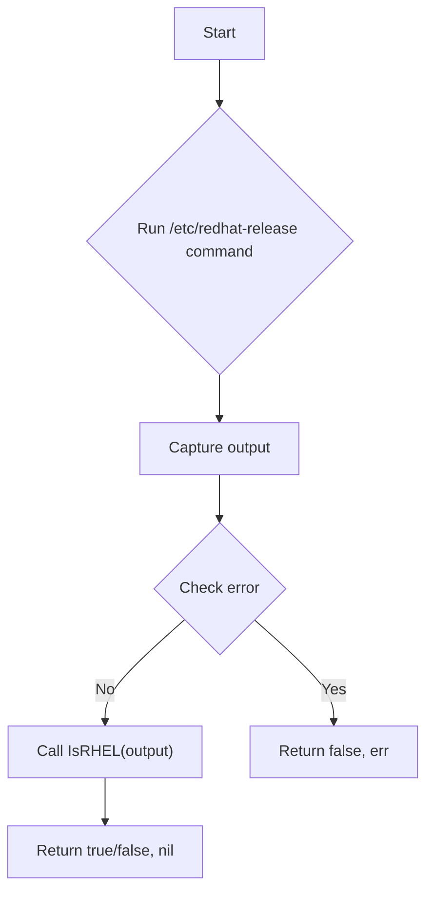
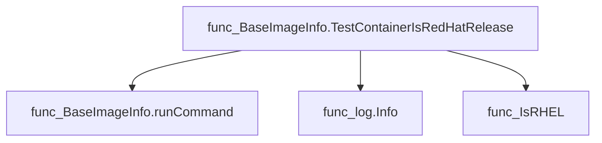
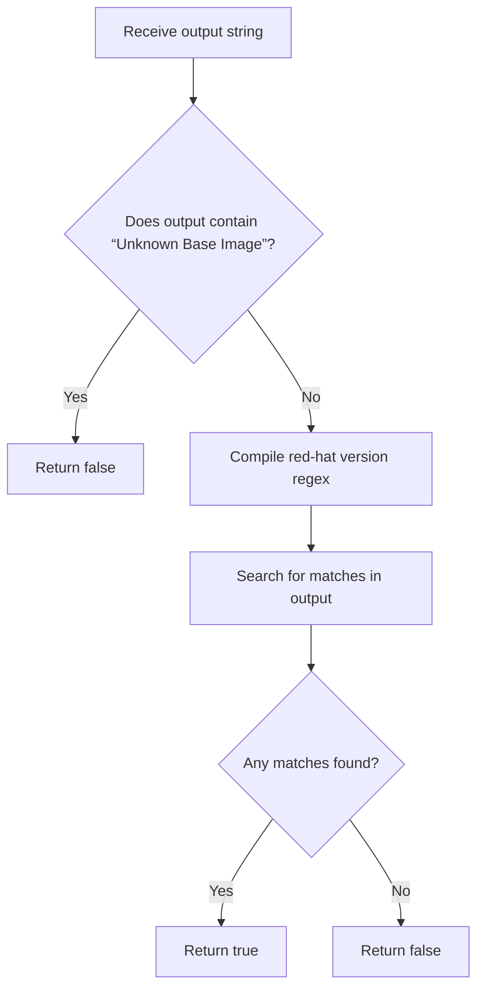
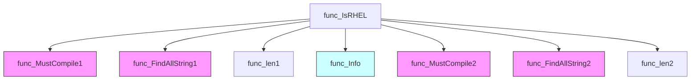
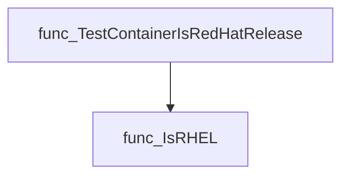
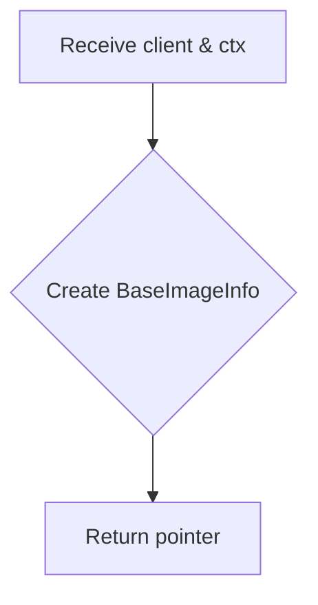
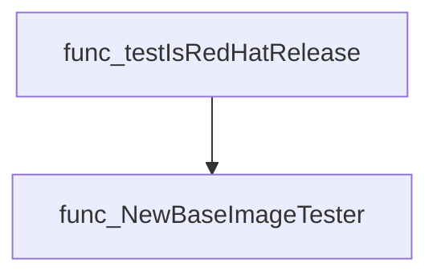
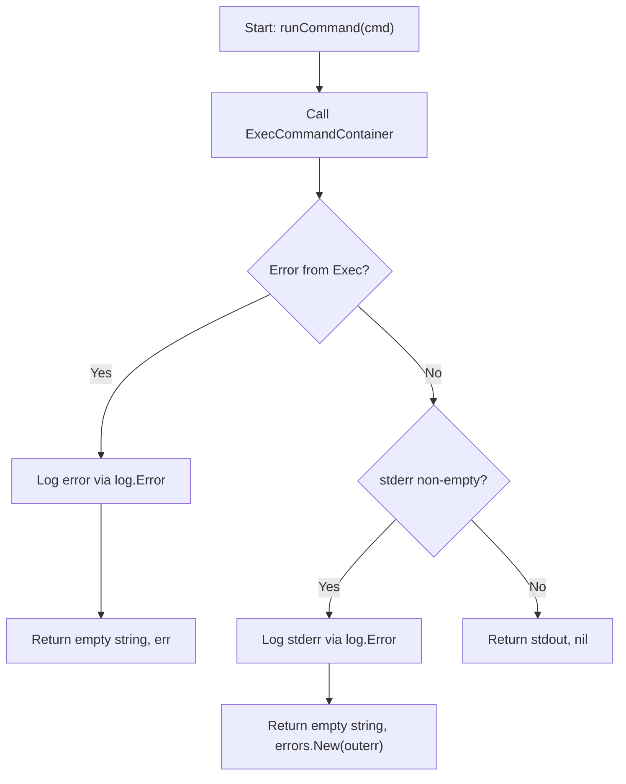
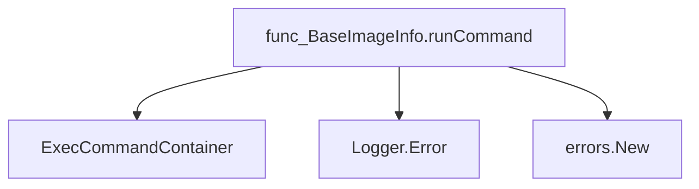
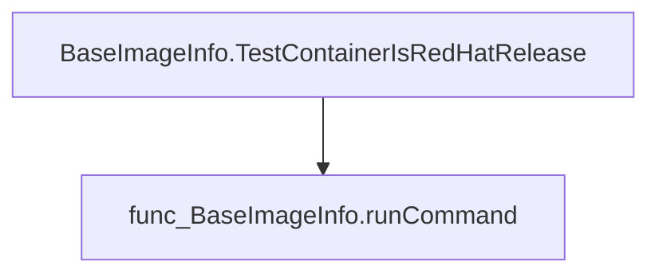

# Package isredhat

**Path**: `tests/platform/isredhat`

## Table of Contents

- [Overview](#overview)
- [Structs](#structs)
  - [BaseImageInfo](#baseimageinfo)
- [Exported Functions](#exported-functions)
  - [BaseImageInfo.TestContainerIsRedHatRelease](#baseimageinfo.testcontainerisredhatrelease)
  - [IsRHEL](#isrhel)
  - [NewBaseImageTester](#newbaseimagetester)
- [Local Functions](#local-functions)
  - [BaseImageInfo.runCommand](#baseimageinfo.runcommand)

## Overview

Provides utilities for determining whether a container image is an official Red Hat distribution by executing commands inside the image and parsing its release information.

### Key Features

- Executes shell snippets in containers to read `/etc/redhat-release` via a command executor
- Parses release text using precompiled regular expressions to detect official Red Hat releases
- Exposes a constructor that bundles client holder and context for testing images

### Design Notes

- Runs commands through an external client holder, assuming container access and `exec` capability
- Only checks `/etc/redhat-release`; non‑Red Hat images lacking this file will return false
- Typical usage: create a BaseImageInfo via NewBaseImageTester then call TestContainerIsRedHatRelease to assert image type

### Structs Summary

| Name | Purpose |
|------|----------|
| [**BaseImageInfo**](#baseimageinfo) | One-line purpose |

### Exported Functions Summary

| Name | Purpose |
|------|----------|
| [func (b *BaseImageInfo) TestContainerIsRedHatRelease() (bool, error)](#baseimageinfo.testcontainerisredhatrelease) | Executes a shell snippet inside the container to read `/etc/redhat-release` and determines if the image is an official Red Hat distribution. |
| [func IsRHEL(output string) bool](#isrhel) | Returns `true` if the supplied text matches patterns that identify an official Red Hat release; otherwise returns `false`. |
| [func NewBaseImageTester(client clientsholder.Command, ctx clientsholder.Context) *BaseImageInfo](#newbaseimagetester) | Instantiates a `BaseImageInfo` object that holds the necessary context and command executor for testing container base images. |

### Local Functions Summary

| Name | Purpose |
|------|----------|
| [func (b *BaseImageInfo) runCommand(cmd string) (string, error)](#baseimageinfo.runcommand) | Runs an arbitrary shell command in the target container via `ExecCommandContainer`, returning stdout or reporting errors. |

## Structs

### BaseImageInfo

Represents a helper that executes commands inside an OpenShift container to discover the base image of a pod.

#### Fields

| Field       | Type                 | Description |
|-------------|----------------------|-------------|
| ClientHolder | `clientsholder.Command` | Holds the client interface used to run shell commands in a container. |
| OCPContext   | `clientsholder.Context`  | Provides the execution context (e.g., namespace, pod name) for command runs. |

#### Purpose  

The struct encapsulates the dependencies required to interrogate a running container. It is primarily used by test functions that need to determine whether the image inside a pod is based on Red Hat Enterprise Linux. By delegating command execution through `ClientHolder`, it abstracts away the underlying client implementation and keeps tests focused on logic rather than connection details.

#### Related functions

| Function | Purpose |
|----------|---------|
| `NewBaseImageTester` | Constructs a new `BaseImageInfo` with the provided command executor and context. |
| `runCommand` | Executes an arbitrary shell command inside the target container, returning its output or error. |
| `TestContainerIsRedHatRelease` | Uses `runCommand` to read `/etc/redhat-release`, logs the result, and returns whether the image is RHEL‑based. |

---

---

## Exported Functions

### BaseImageInfo.TestContainerIsRedHatRelease

**TestContainerIsRedHatRelease** - Executes a shell snippet inside the container to read `/etc/redhat-release` and determines if the image is an official Red Hat distribution.

Checks whether a container’s base image is an official Red Hat release.

---

#### Signature (Go)

```go
func (b *BaseImageInfo) TestContainerIsRedHatRelease() (bool, error)
```

---

#### Summary Table

| Aspect | Details |
|--------|---------|
| **Purpose** | Executes a shell snippet inside the container to read `/etc/redhat-release` and determines if the image is an official Red Hat distribution. |
| **Parameters** | `b *BaseImageInfo` – receiver containing client and context information. |
| **Return value** | `bool` – true when the base image matches a known Red Hat release; `error` – any execution or parsing error. |
| **Key dependencies** | • `BaseImageInfo.runCommand` – runs the shell command inside the container.<br>• `log.Info` – logs command output.<br>• `IsRHEL` – evaluates the command result. |
| **Side effects** | No state mutation; only performs I/O by executing a command in the target container and logging the output. |
| **How it fits the package** | Part of the `isredhat` test suite, providing a reusable check for Red Hat base images used across other tests. |

---

#### Internal workflow (Mermaid)



---

#### Function dependencies (Mermaid)



---

#### Functions calling `BaseImageInfo.TestContainerIsRedHatRelease` (Mermaid)

None – this function is currently not referenced elsewhere in the package.

---

#### Usage example (Go)

```go
// Minimal example invoking BaseImageInfo.TestContainerIsRedHatRelease
b := &isredhat.BaseImageInfo{
    ClientHolder: /* client implementation */,
    OCPContext:   /* context string */,
}
isRHEL, err := b.TestContainerIsRedHatRelease()
if err != nil {
    log.Fatalf("error checking base image: %v", err)
}
fmt.Printf("Container is Red Hat release: %t\n", isRHEL)
```

---

### IsRHEL

**IsRHEL** - Returns `true` if the supplied text matches patterns that identify an official Red Hat release; otherwise returns `false`.

#### Signature (Go)

```go
func IsRHEL(output string) bool
```

#### Summary Table

| Aspect | Details |
|--------|---------|
| **Purpose** | Returns `true` if the supplied text matches patterns that identify an official Red Hat release; otherwise returns `false`. |
| **Parameters** | `output string –` textual content of `/etc/redhat-release` or a similar source. |
| **Return value** | `bool – true if output indicates a Red Hat image, false otherwise.` |
| **Key dependencies** | • `regexp.MustCompile` (to compile regexes)  <br>• `regexp.FindAllString` (to search matches) <br>• `len` (to count matches) <br>• `log.Logger.Info` (for debug logging) |
| **Side effects** | Emits informational logs via the package logger; no state mutation or I/O beyond logging. |
| **How it fits the package** | Part of the `isredhat` test helper package, used to validate container base images in the Certsuite platform tests. |

#### Internal workflow (Mermaid)



#### Function dependencies (Mermaid)



#### Functions calling `IsRHEL` (Mermaid)



#### Usage example (Go)

```go
// Minimal example invoking IsRHEL
package main

import (
 "fmt"
 "github.com/redhat-best-practices-for-k8s/certsuite/tests/platform/isredhat"
)

func main() {
 output := "Red Hat Enterprise Linux Server release 7.9 (Maipo)"
 isRHEL := isredhat.IsRHEL(output)
 fmt.Printf("Is Red Hat? %t\n", isRHEL)
}
```

---

### NewBaseImageTester

**NewBaseImageTester** - Instantiates a `BaseImageInfo` object that holds the necessary context and command executor for testing container base images.

#### Signature (Go)

```go
func NewBaseImageTester(client clientsholder.Command, ctx clientsholder.Context) *BaseImageInfo
```

#### Summary Table

| Aspect | Details |
|--------|---------|
| **Purpose** | Instantiates a `BaseImageInfo` object that holds the necessary context and command executor for testing container base images. |
| **Parameters** | `client` – A `clientsholder.Command` used to run Kubernetes client commands.<br>`ctx` – A `clientsholder.Context` providing namespace, pod name, and container name information. |
| **Return value** | Pointer to a newly created `BaseImageInfo`. |
| **Key dependencies** | *`clientsholder.Command` – command execution interface.<br>* `clientsholder.Context` – contextual data holder. |
| **Side effects** | No external state changes; only constructs an in‑memory struct. |
| **How it fits the package** | Serves as a constructor for the test harness that validates Red‑Hat base images. It is invoked by higher‑level tests (e.g., `testIsRedHatRelease`) to prepare the tester with appropriate context and command capabilities. |

#### Internal workflow



#### Function dependencies

None – this function is currently not referenced elsewhere in the package.

#### Functions calling `NewBaseImageTester` (Mermaid)



#### Usage example (Go)

```go
// Minimal example invoking NewBaseImageTester
package main

import (
    "github.com/redhat-best-practices-for-k8s/certsuite/tests/platform/clientsholder"
    "github.com/redhat-best-practices-for-k8s/certsuite/tests/platform/isredhat"
)

func main() {
    // Assume we have concrete implementations of Command and Context
    client := clientsholder.GetClientsHolder()
    ctx    := clientsholder.NewContext("default", "my-pod", "my-container")

    tester := isredhat.NewBaseImageTester(client, ctx)
    _ = tester // use the tester for further checks
}
```

---

## Local Functions

### BaseImageInfo.runCommand

**runCommand** - Runs an arbitrary shell command in the target container via `ExecCommandContainer`, returning stdout or reporting errors.

#### Signature (Go)

```go
func (b *BaseImageInfo) runCommand(cmd string) (string, error)
```

#### Summary Table

| Aspect | Details |
|--------|---------|
| **Purpose** | Runs an arbitrary shell command in the target container via `ExecCommandContainer`, returning stdout or reporting errors. |
| **Parameters** | `cmd` *string* – The shell command to execute inside the container. |
| **Return value** | `output` *string* – Captured standard output.<br>`error` *error* – Non‑nil if execution fails or stderr contains data. |
| **Key dependencies** | • `b.ClientHolder.ExecCommandContainer(b.OCPContext, cmd)`<br>• `log.Error` (from internal/log)<br>• `errors.New` |
| **Side effects** | Logs error messages via the global logger; no state mutation on `BaseImageInfo`. |
| **How it fits the package** | Provides a low‑level helper for other test methods to query container properties (e.g., checking `/etc/redhat-release`). |

#### Internal workflow



#### Function dependencies



#### Functions calling `BaseImageInfo.runCommand`



#### Usage example (Go)

```go
// Minimal example invoking BaseImageInfo.runCommand
b := &BaseImageInfo{ /* fields initialized elsewhere */ }
output, err := b.runCommand("echo hello")
if err != nil {
    log.Error("command failed: %v", err)
}
fmt.Println("Command output:", output)
```

---
