# Package nodetainted

**Path**: `tests/platform/nodetainted`

## Table of Contents

- [Overview](#overview)
- [Structs](#structs)
  - [KernelTaint](#kerneltaint)
  - [NodeTainted](#nodetainted)
- [Exported Functions](#exported-functions)
  - [DecodeKernelTaintsFromBitMask](#decodekerneltaintsfrombitmask)
  - [DecodeKernelTaintsFromLetters](#decodekerneltaintsfromletters)
  - [GetOtherTaintedBits](#getothertaintedbits)
  - [GetTaintMsg](#gettaintmsg)
  - [GetTaintedBitsByModules](#gettaintedbitsbymodules)
  - [NewNodeTaintedTester](#newnodetaintedtester)
  - [NodeTainted.GetKernelTaintsMask](#nodetainted.getkerneltaintsmask)
  - [NodeTainted.GetTainterModules](#nodetainted.gettaintermodules)
  - [RemoveAllExceptNumbers](#removeallexceptnumbers)
- [Local Functions](#local-functions)
  - [NodeTainted.getAllTainterModules](#nodetainted.getalltaintermodules)
  - [getBitPosFromLetter](#getbitposfromletter)

## Overview

The nodetainted package supplies utilities for inspecting and interpreting kernel taint information on a specific Kubernetes node, enabling tests to verify that no unwanted taints are present.

### Key Features

- Decodes a 64‑bit taint bitmask into human‑readable messages via GetTaintMsg and DecodeKernelTaintsFromBitMask.

### Design Notes

- Relies on reading /proc/sys/kernel/tainted and module taint files, assuming a Linux environment.

### Structs Summary

| Name | Purpose |
|------|----------|
| [**KernelTaint**](#kerneltaint) | One-line purpose |
| [**NodeTainted**](#nodetainted) | Holds information about tainted nodes |

### Exported Functions Summary

| Name | Purpose |
|------|----------|
| [func DecodeKernelTaintsFromBitMask(bitmask uint64) []string](#decodekerneltaintsfrombitmask) | Translates each set bit in a 64‑bit kernel taint mask into its descriptive message using `GetTaintMsg`. |
| [func DecodeKernelTaintsFromLetters(letters string) []string](#decodekerneltaintsfromletters) | Translates each character in `letters` into a descriptive taint string, including the original letter and its bit index. Unknown letters are reported explicitly. |
| [func GetOtherTaintedBits(taintsMask uint64, taintedBitsByModules map[int]bool) []int](#getothertaintedbits) | Returns a slice of bit positions that are set in `taintsMask` but are not recorded as being set by any module (i.e., keys absent or false in `taintedBitsByModules`). |
| [func GetTaintMsg(bit int) string](#gettaintmsg) | Returns a descriptive string for a kernel taint bit. If the bit is defined in the `kernelTaints` map, the message includes its description; otherwise it indicates that the bit is reserved. |
| [func GetTaintedBitsByModules(tainters map[string]string) (map[int]bool, error)](#gettaintedbitsbymodules) | For every module name and its associated taint letters, determine the corresponding kernel‑taint bit positions and aggregate them into a single set. |
| [func NewNodeTaintedTester(context *clientsholder.Context, node string) *NodeTainted](#newnodetaintedtester) | Instantiates a `NodeTainted` helper that provides methods for querying kernel taint information on a specific Kubernetes node. |
| [func (nt *NodeTainted) GetKernelTaintsMask() (uint64, error)](#nodetainted.getkerneltaintsmask) | Reads `/proc/sys/kernel/tainted` to obtain the current kernel taints bitmask and returns it as a `uint64`. |
| [func (nt *NodeTainted) GetTainterModules(allowList map[string]bool) (tainters map[string]string, taintBits map[int]bool, err error)](#nodetainted.gettaintermodules) | Gathers all kernel modules that set taint bits on a node, filters out allow‑listed modules, and returns the remaining module names with their taint letters plus a map of all taint bit positions used. |
| [func RemoveAllExceptNumbers(incomingStr string) string](#removeallexceptnumbers) | Returns a new string containing only the numeric characters of `incomingStr`. Useful for normalizing taint identifiers that may include letters or punctuation. |

### Local Functions Summary

| Name | Purpose |
|------|----------|
| [func (nt *NodeTainted) getAllTainterModules() (map[string]string, error)](#nodetainted.getalltaintermodules) | Executes a shell script to list every kernel module present in `/sys/module`, reads each module’s taint file, and returns a map of module names to their associated taint letters. |
| [func getBitPosFromLetter(letter string) (int, error)](#getbitposfromletter) | Maps a single‑character taint letter to its corresponding kernel taint bit position (zero‑based). Validates input length and existence of the letter in known taints. |

## Structs

### KernelTaint

A lightweight representation of a Linux kernel taint entry used in node‑tainted tests.

#### Fields

| Field       | Type   | Description |
|-------------|--------|-------------|
| `Description` | `string` | Human‑readable explanation of why the node is considered tainted. |
| `Letters`      | `string` | One or more kernel taint letters that identify the specific taint condition (e.g., `"S"` for bad system call). |

#### Purpose

The `KernelTaint` struct encapsulates information about a kernel taint applied to a node during testing. The `Description` field provides context for test logs, while the `Letters` field holds the canonical taint identifier used by Kubernetes to mark the node’s state.

#### Related functions

| Function | Purpose |
|----------|---------|
| *none* | No functions directly interact with this struct in the current codebase. |

---

---

### NodeTainted

#### Fields

| Field | Type | Description |
|-------|------|-------------|
| `ctx` | `*clientsholder.Context` | Context used to execute commands on the target node; contains client configuration and authentication details. |
| `node` | `string` | Name or identifier of the Kubernetes node whose taint status is being inspected. |

#### Purpose

The `NodeTainted` struct represents a specific node in a cluster that may be marked as tainted by the Linux kernel. It encapsulates both the node identity and the context required to query the node’s state (e.g., reading `/proc/sys/kernel/tainted` or module taint files). Methods on this type retrieve kernel‑level taint masks, list modules responsible for taints, and filter those modules against an allow‑list.

#### Related functions

| Function | Purpose |
|----------|---------|
| `NewNodeTaintedTester(context *clientsholder.Context, node string)` | Creates a new `NodeTainted` instance initialized with the given context and node name. |
| `GetKernelTaintsMask() (uint64, error)` | Reads `/proc/sys/kernel/tainted`, parses the decimal value into a 64‑bit mask representing active kernel taints on the node. |
| `GetTainterModules(allowList map[string]bool) (tainters map[string]string, taintBits map[int]bool, err error)` | Enumerates all kernel modules that have set taint bits on the node, applies an allow‑list filter, and returns both module names with their taints and a bitset of tainted bits. |
| `getAllTainterModules() (map[string]string, error)` | Internal helper that lists each loaded module in `/sys/module`, reads its `taint` file if present, and builds a map from module name to the string of taint letters it has set. |

---

---

## Exported Functions

### DecodeKernelTaintsFromBitMask

**DecodeKernelTaintsFromBitMask** - Translates each set bit in a 64‑bit kernel taint mask into its descriptive message using `GetTaintMsg`.

#### Signature (Go)

```go
func DecodeKernelTaintsFromBitMask(bitmask uint64) []string
```

#### Summary Table

| Aspect | Details |
|--------|---------|
| **Purpose** | Translates each set bit in a 64‑bit kernel taint mask into its descriptive message using `GetTaintMsg`. |
| **Parameters** | `bitmask uint64` – raw kernel taint bitmask. |
| **Return value** | `[]string` – slice of messages corresponding to all bits that are set. |
| **Key dependencies** | • `append` (slice manipulation)<br>• `GetTaintMsg(int)` (message lookup) |
| **Side effects** | None; pure function that only reads input and returns a new slice. |
| **How it fits the package** | Utility in `nodetainted` for decoding kernel taint information obtained from nodes, used by higher‑level tests to report compliance. |

#### Internal workflow (Mermaid)

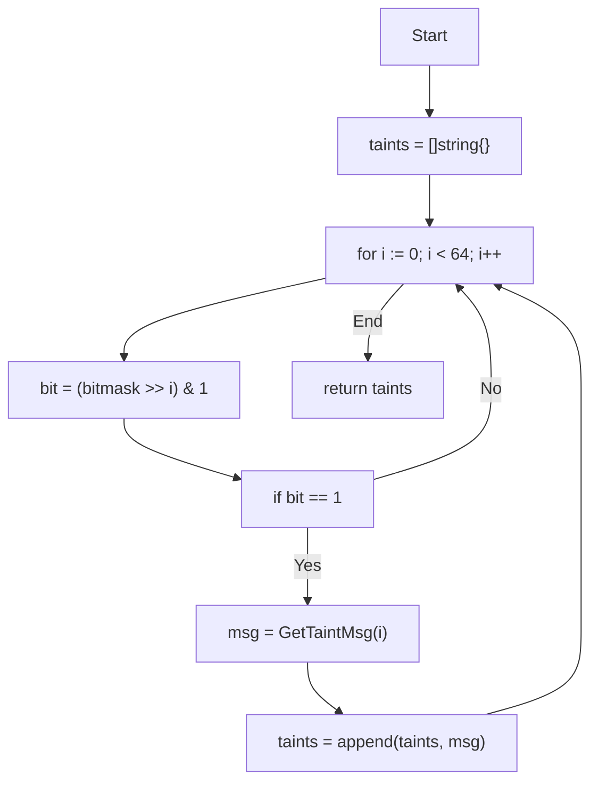

#### Function dependencies (Mermaid)

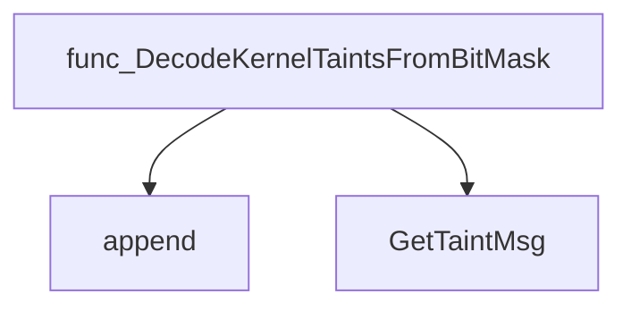

#### Functions calling `DecodeKernelTaintsFromBitMask` (Mermaid)

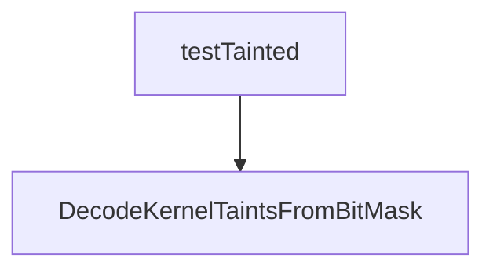

#### Usage example (Go)

```go
// Minimal example invoking DecodeKernelTaintsFromBitMask
package main

import (
 "fmt"
 "github.com/redhat-best-practices-for-k8s/certsuite/tests/platform/nodetainted"
)

func main() {
 mask := uint64(0x5) // bits 0 and 2 set
 messages := nodetainted.DecodeKernelTaintsFromBitMask(mask)
 fmt.Println(messages) // e.g., ["taint0 (bit 0)", "taint2 (bit 2)"]
}
```

---

### DecodeKernelTaintsFromLetters

**DecodeKernelTaintsFromLetters** - Translates each character in `letters` into a descriptive taint string, including the original letter and its bit index. Unknown letters are reported explicitly.

#### Signature (Go)

```go
func DecodeKernelTaintsFromLetters(letters string) []string
```

#### Summary Table

| Aspect | Details |
|--------|---------|
| **Purpose** | Translates each character in `letters` into a descriptive taint string, including the original letter and its bit index. Unknown letters are reported explicitly. |
| **Parameters** | `letters string –` sequence of single‑character taint identifiers to decode. |
| **Return value** | `[]string` – slice containing a formatted description for each input character. Each entry follows: `<Description> (taint letter:<letter>, bit:<index>)` or `unknown taint (letter <letter>)`. |
| **Key dependencies** | • `strings.Contains` from the standard library<br>• `fmt.Sprintf` for formatting<br>• Reference to the package‑wide `kernelTaints` slice, which maps indices to known taints |
| **Side effects** | None. Pure function; only reads global data and returns a new slice. |
| **How it fits the package** | Used by `NodeTainted.GetTainterModules` and test logic to interpret kernel taint letters returned from nodes into user‑friendly messages for reporting and logging. |

#### Internal workflow (Mermaid)

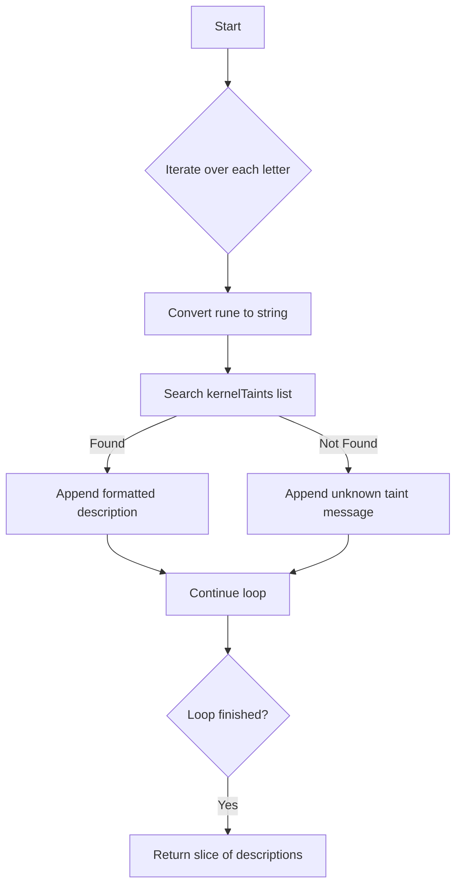

#### Function dependencies (Mermaid)

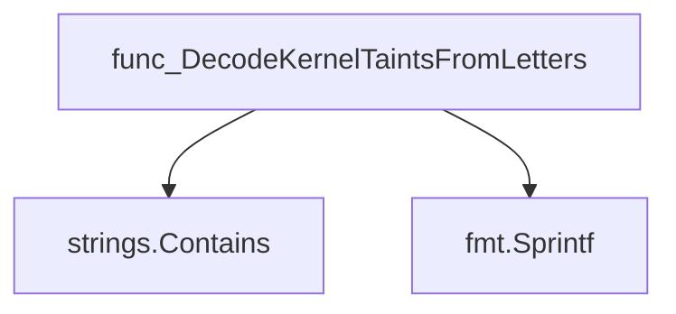

#### Functions calling `DecodeKernelTaintsFromLetters` (Mermaid)

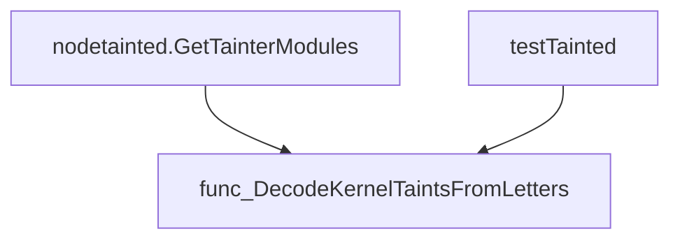

#### Usage example (Go)

```go
// Minimal example invoking DecodeKernelTaintsFromLetters
package main

import (
    "fmt"
    "github.com/redhat-best-practices-for-k8s/certsuite/tests/platform/nodetainted"
)

func main() {
    // Suppose a node reports the taint letters "abc"
    letters := "abc"

    decoded := nodetainted.DecodeKernelTaintsFromLetters(letters)
    fmt.Println("Decoded taints:")
    for _, t := range decoded {
        fmt.Println(t)
    }
}
```

---

### GetOtherTaintedBits

**GetOtherTaintedBits** - Returns a slice of bit positions that are set in `taintsMask` but are not recorded as being set by any module (i.e., keys absent or false in `taintedBitsByModules`).

#### Signature (Go)

```go
func GetOtherTaintedBits(taintsMask uint64, taintedBitsByModules map[int]bool) []int
```

#### Summary Table

| Aspect | Details |
|--------|---------|
| **Purpose** | Returns a slice of bit positions that are set in `taintsMask` but are not recorded as being set by any module (i.e., keys absent or false in `taintedBitsByModules`). |
| **Parameters** | `taintsMask uint64` – 64‑bit mask representing kernel taint bits.<br>`taintedBitsByModules map[int]bool` – mapping of bit index to whether that bit was set by a module. |
| **Return value** | `[]int` – indices (0‑63) of bits that are set but unaccounted for by modules. |
| **Key dependencies** | • Standard library: basic arithmetic, slice append.<br>• No external packages or side effects. |
| **Side effects** | None; purely functional. |
| **How it fits the package** | Used in node‑taint verification to flag unexpected taints that cannot be traced back to a known kernel module. |

#### Internal workflow (Mermaid)

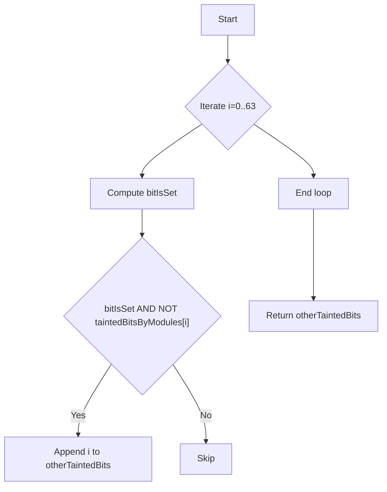

#### Function dependencies (Mermaid)

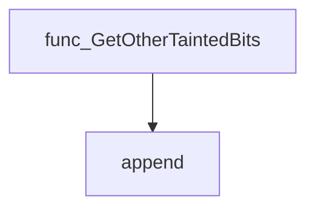

#### Functions calling `GetOtherTaintedBits` (Mermaid)

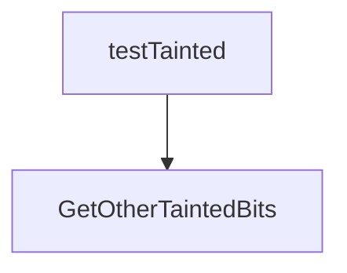

#### Usage example (Go)

```go
// Minimal example invoking GetOtherTaintedBits
package main

import (
    "fmt"
    "github.com/redhat-best-practices-for-k8s/certsuite/tests/platform/nodetainted"
)

func main() {
    // Example taintsMask with bits 1, 3, and 5 set (binary: 0b00101010)
    taintsMask := uint64(42) // 0x2A

    // Suppose modules only accounted for bit 1
    taintedBitsByModules := map[int]bool{
        1: true,
        3: false,
        5: false,
    }

    otherBits := nodetainted.GetOtherTaintedBits(taintsMask, taintedBitsByModules)
    fmt.Printf("Unaccounted taint bits: %v\n", otherBits) // Output: [3 5]
}
```

---

### GetTaintMsg

**GetTaintMsg** - Returns a descriptive string for a kernel taint bit. If the bit is defined in the `kernelTaints` map, the message includes its description; otherwise it indicates that the bit is reserved.

#### Signature (Go)

```go
func GetTaintMsg(bit int) string
```

#### Summary Table

| Aspect | Details |
|--------|---------|
| **Purpose** | Returns a descriptive string for a kernel taint bit. If the bit is defined in the `kernelTaints` map, the message includes its description; otherwise it indicates that the bit is reserved. |
| **Parameters** | `bit int – index of the taint bit (0‑63)` |
| **Return value** | `string – human‑readable taint description or “reserved” message` |
| **Key dependencies** | - `kernelTaints` map (package‑level) <br>- `fmt.Sprintf` from the standard library |
| **Side effects** | None. Pure function; no state mutation, I/O, or concurrency. |
| **How it fits the package** | Utility helper used by other functions (e.g., `DecodeKernelTaintsFromBitMask`) to translate raw bit positions into meaningful labels for reporting and logging. |

#### Internal workflow

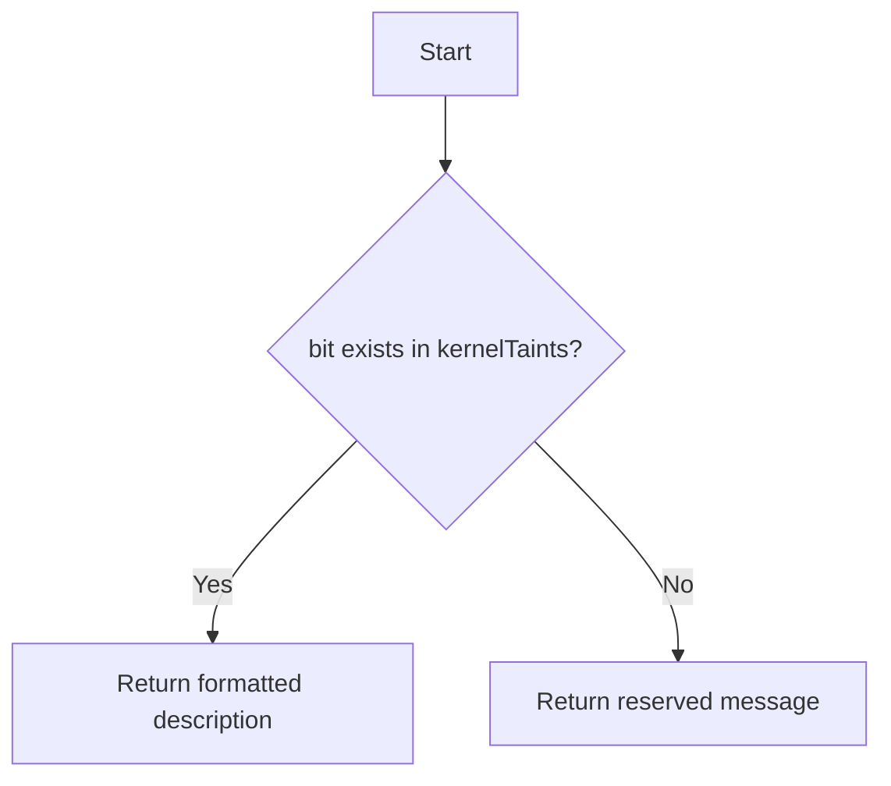

#### Function dependencies

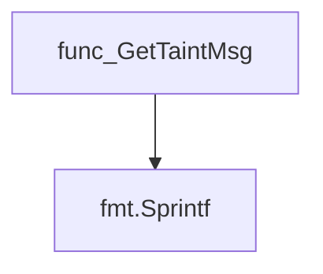

#### Functions calling `GetTaintMsg` (in the same package)

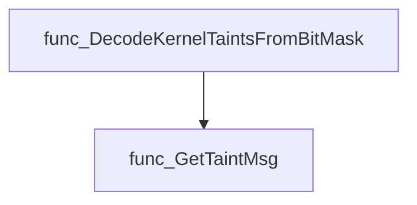

#### Usage example (Go)

```go
// Minimal example invoking GetTaintMsg
package main

import (
    "fmt"
    "github.com/redhat-best-practices-for-k8s/certsuite/tests/platform/nodetainted"
)

func main() {
    // Example: get description for bit 3
    msg := nodetainted.GetTaintMsg(3)
    fmt.Println(msg) // Output depends on kernelTaints map contents
}
```

---

---

### GetTaintedBitsByModules

**GetTaintedBitsByModules** - For every module name and its associated taint letters, determine the corresponding kernel‑taint bit positions and aggregate them into a single set.

Retrieves the set of kernel taint bits that are active for each module in a given map.

---

#### Signature (Go)

```go
func GetTaintedBitsByModules(tainters map[string]string) (map[int]bool, error)
```

---

#### Summary Table

| Aspect | Details |
|--------|---------|
| **Purpose** | For every module name and its associated taint letters, determine the corresponding kernel‑taint bit positions and aggregate them into a single set. |
| **Parameters** | `tainters map[string]string` – keys are module names; values are strings of one‑letter taints (e.g., `"M"`, `"S"`). |
| **Return value** | `map[int]bool` – a mapping where the key is a bit position and the value indicates that the bit is set. Returns an error if any letter cannot be resolved to a known taint. |
| **Key dependencies** | • `string` conversion of byte to string.<br>• `getBitPosFromLetter(letter string) (int, error)` – translates a single‑letter taint into its bit index.<br>• `fmt.Errorf` for error wrapping. |
| **Side effects** | None; purely functional. |
| **How it fits the package** | Used by `NodeTainted.GetTainterModules` to produce the overall set of active taint bits from individual modules’ letters. |

---

#### Internal workflow (Mermaid)

```mermaid
flowchart TD
  A(tainter) --> B(letters)
  B --> C["Loop each letter"]
  C --> D{"letter=string(letters[i])"}
  D --> E{"bit,err=getBitPosFromLetter(letter)"}
  E --|"err"| F(Return error)
  E --> G(taintedBits["bit"]=true)
  G --> H(End of loops)
  H --> I(Return taintedBits,nil)
```

---

#### Function dependencies (Mermaid)

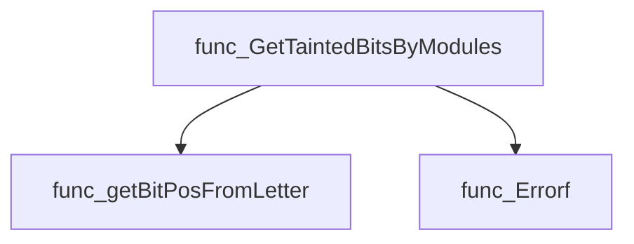

---

#### Functions calling `GetTaintedBitsByModules` (Mermaid)

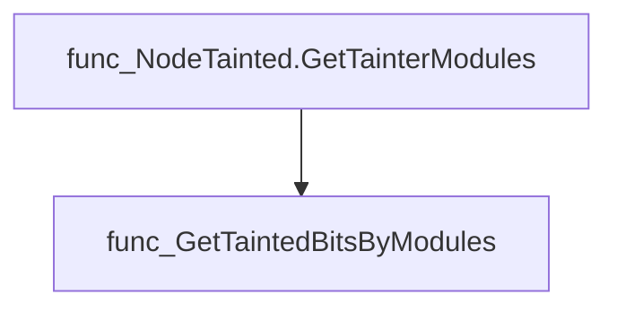

---

#### Usage example (Go)

```go
// Minimal example invoking GetTaintedBitsByModules
package main

import (
 "fmt"
 "github.com/redhat-best-practices-for-k8s/certsuite/tests/platform/nodetainted"
)

func main() {
 modules := map[string]string{
  "moduleA": "M",
  "moduleB": "S",
 }
 bits, err := nodetainted.GetTaintedBitsByModules(modules)
 if err != nil {
  fmt.Println("error:", err)
  return
 }
 fmt.Println("Active taint bits:", bits)
}
```

---

### NewNodeTaintedTester

**NewNodeTaintedTester** - Instantiates a `NodeTainted` helper that provides methods for querying kernel taint information on a specific Kubernetes node.

#### Signature (Go)

```go
func NewNodeTaintedTester(context *clientsholder.Context, node string) *NodeTainted
```

#### Summary Table

| Aspect | Details |
|--------|---------|
| **Purpose** | Instantiates a `NodeTainted` helper that provides methods for querying kernel taint information on a specific Kubernetes node. |
| **Parameters** | `context *clientsholder.Context –` the client context used to communicate with the node; <br>`node string –` the name of the target node. |
| **Return value** | `*NodeTainted –` a pointer to a new `NodeTainted` struct initialized with the supplied context and node name. |
| **Key dependencies** | *Uses the `clientsholder.Context` type from the test framework.<br>* Stores values in the `NodeTainted` struct (no external calls at construction). |
| **Side effects** | None – only creates an object; does not perform I/O or modify global state. |
| **How it fits the package** | Provides the entry point for all taint‑related checks performed by the *nodetainted* test suite, allowing other functions to retrieve kernel taints and module information via the returned `NodeTainted` instance. |

#### Internal workflow (Mermaid)

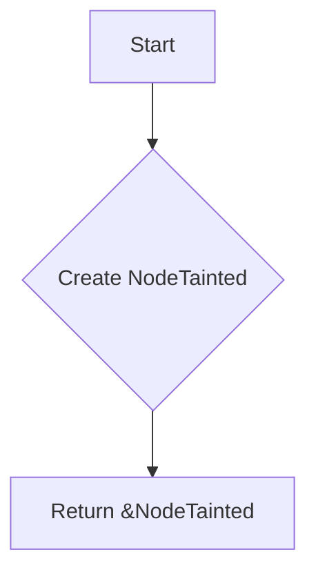

#### Function dependencies (Mermaid)

None – this function is currently not referenced elsewhere in the package.

#### Functions calling `NewNodeTaintedTester` (Mermaid)

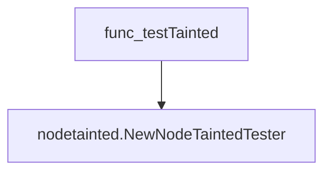

#### Usage example (Go)

```go
// Minimal example invoking NewNodeTaintedTester
package main

import (
 "github.com/redhat-best-practices-for-k8s/certsuite/tests/platform/nodetainted"
 "github.com/redhat-best-practices-for-k8s/certsuite/tests/platform/clientsholder"
)

func main() {
 ctx := clientsholder.NewContext("namespace", "podName", "containerName")
 nodeTester := nodetainted.NewNodeTaintedTester(ctx, "worker-node-1")

 // Use nodeTester to query kernel taints, e.g.:
 taintsMask, err := nodeTester.GetKernelTaintsMask()
 if err != nil {
  panic(err)
 }
 println("Kernel taint mask:", taintsMask)
}
```

---

### NodeTainted.GetKernelTaintsMask

**GetKernelTaintsMask** - Reads `/proc/sys/kernel/tainted` to obtain the current kernel taints bitmask and returns it as a `uint64`.

#### Signature (Go)

```go
func (nt *NodeTainted) GetKernelTaintsMask() (uint64, error)
```

#### Summary Table

| Aspect | Details |
|--------|---------|
| **Purpose** | Reads `/proc/sys/kernel/tainted` to obtain the current kernel taints bitmask and returns it as a `uint64`. |
| **Parameters** | *None* – uses the receiver’s context (`nt.ctx`). |
| **Return value** | `uint64` – the parsed taint mask; `error` if command execution or parsing fails. |
| **Key dependencies** | • `runCommand(nt.ctx, ...)` <br>• `strings.ReplaceAll` (×3) <br>• `strconv.ParseUint` <br>• `fmt.Errorf` |
| **Side effects** | None; the function performs read‑only operations and returns values. |
| **How it fits the package** | Provides a helper for tests to determine whether a node is tainted, enabling conditional logic based on kernel state. |

#### Internal workflow

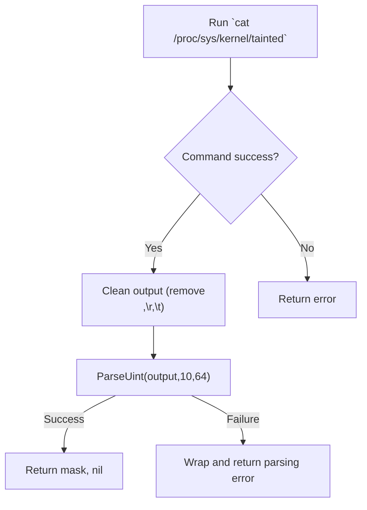

#### Function dependencies

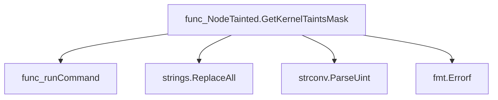

#### Functions calling `NodeTainted.GetKernelTaintsMask`

None – this function is currently not referenced elsewhere in the package.

#### Usage example (Go)

```go
// Minimal example invoking NodeTainted.GetKernelTaintsMask
ctx := context.Background()
nt := &nodetainted.NodeTainted{Ctx: ctx}
mask, err := nt.GetKernelTaintsMask()
if err != nil {
    log.Fatalf("cannot read kernel taints mask: %v", err)
}
fmt.Printf("Kernel taints mask: 0x%X\n", mask)
```

---

### NodeTainted.GetTainterModules

**GetTainterModules** - Gathers all kernel modules that set taint bits on a node, filters out allow‑listed modules, and returns the remaining module names with their taint letters plus a map of all taint bit positions used.

#### 1) Signature (Go)

```go
func (nt *NodeTainted) GetTainterModules(allowList map[string]bool) (tainters map[string]string, taintBits map[int]bool, err error)
```

#### 2) Summary Table

| Aspect | Details |
|--------|---------|
| **Purpose** | Gathers all kernel modules that set taint bits on a node, filters out allow‑listed modules, and returns the remaining module names with their taint letters plus a map of all taint bit positions used. |
| **Parameters** | `allowList map[string]bool` – module names to ignore (typically known safe modules). |
| **Return value** | `tainters map[string]string` – module → string of taint‑letter codes for non‑allow‑listed modules.<br>`taintBits map[int]bool` – set of bit positions corresponding to all detected taints, including allow‑listed ones.<br>`err error` – failure reason if any step fails. |
| **Key dependencies** | • `NodeTainted.getAllTainterModules()`<br>• `DecodeKernelTaintsFromLetters(string)`<br>• `GetTaintedBitsByModules(map[string]string)`<br>• `log.Debug` for logging |
| **Side effects** | None. The function only reads state from the node and logs debug messages. |
| **How it fits the package** | Provides high‑level, user‑friendly data about kernel taints, used by tests to assert that no unexpected modules are tainting the system. |

#### 3) Internal workflow (Mermaid)

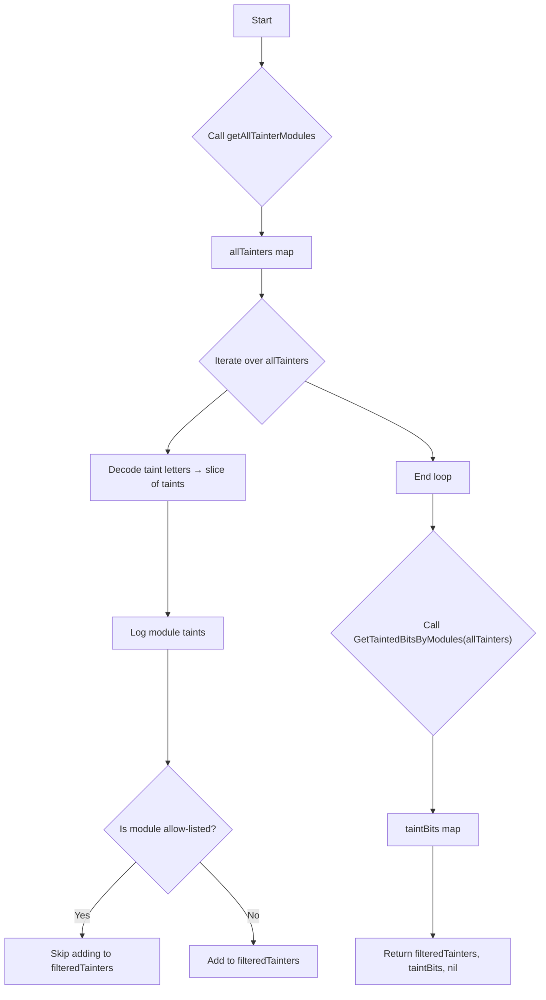

#### 4) Function dependencies (Mermaid)

```mermaid
graph TD
  func_NodeTainted.GetTainterModules --> func_NodeTainted.getAllTainterModules
  func_NodeTainted.GetTainterModules --> func_DecodeKernelTaintsFromLetters
  func_NodeTainted.GetTainterModules --> func_GetTaintedBitsByModules
```

#### 5) Functions calling `NodeTainted.GetTainterModules` (Mermaid)

None – this function is currently not referenced elsewhere in the package.

#### 6) Usage example (Go)

```go
// Minimal example invoking NodeTainted.GetTainterModules

import (
    "github.com/redhat-best-practices-for-k8s/certsuite/tests/platform/nodetainted"
)

func main() {
    // Assume `nodeTainted` is an initialized *nodetainted.NodeTainted instance.
    allowList := map[string]bool{
        "module_safe": true,
    }

    tainters, taintBits, err := nodeTainted.GetTainterModules(allowList)
    if err != nil {
        // handle error
    }

    fmt.Printf("Filtered tainters: %+v\n", tainters)
    fmt.Printf("All taint bits: %+v\n", taintBits)
}
```

---

### RemoveAllExceptNumbers

**RemoveAllExceptNumbers** - Returns a new string containing only the numeric characters of `incomingStr`. Useful for normalizing taint identifiers that may include letters or punctuation.

#### Signature (Go)

```go
func RemoveAllExceptNumbers(incomingStr string) string
```

#### Summary Table

| Aspect | Details |
|--------|---------|
| **Purpose** | Returns a new string containing only the numeric characters of `incomingStr`. Useful for normalizing taint identifiers that may include letters or punctuation. |
| **Parameters** | `incomingStr` string – the raw input from which non‑numeric characters will be removed. |
| **Return value** | A string composed solely of digits extracted from `incomingStr`. |
| **Key dependencies** | • `regexp.MustCompile`\n• `regexp.ReplaceAllString` |
| **Side effects** | None – purely functional; no state mutation or I/O. |
| **How it fits the package** | Used by the taint‑analysis logic to convert taint identifiers like `"bit:10)"` into a clean numeric representation (`"10"`), facilitating further processing and reporting. |

#### Internal workflow (Mermaid)

```mermaid
flowchart TD
  A["Start"] --> B{"Compile regex `\D+`"}
  B --> C["Replace all non‑digit sequences with"]
  C --> D["Return cleaned string"]
```

#### Function dependencies (Mermaid)

```mermaid
graph TD
  func_RemoveAllExceptNumbers --> func_MustCompile
  func_RemoveAllExceptNumbers --> func_ReplaceAllString
```

#### Functions calling `RemoveAllExceptNumbers` (Mermaid)

```mermaid
graph TD
  func_testTainted --> func_RemoveAllExceptNumbers
```

#### Usage example (Go)

```go
// Minimal example invoking RemoveAllExceptNumbers
package main

import (
    "fmt"
    "github.com/redhat-best-practices-for-k8s/certsuite/tests/platform/nodetainted"
)

func main() {
    raw := "bit:10)"
    cleaned := nodetainted.RemoveAllExceptNumbers(raw)
    fmt.Println(cleaned) // Output: 10
}
```

---

## Local Functions

### NodeTainted.getAllTainterModules

**getAllTainterModules** - Executes a shell script to list every kernel module present in `/sys/module`, reads each module’s taint file, and returns a map of module names to their associated taint letters.

#### 1) Signature (Go)

```go
func (nt *NodeTainted) getAllTainterModules() (map[string]string, error)
```

#### 2) Summary Table

| Aspect | Details |
|--------|---------|
| **Purpose** | Executes a shell script to list every kernel module present in `/sys/module`, reads each module’s taint file, and returns a map of module names to their associated taint letters. |
| **Parameters** | `nt *NodeTainted` – the receiver holding context for command execution (`ctx`). |
| **Return value** | `<map[string]string>` mapping module name → taint string; `error` if command execution or parsing fails. |
| **Key dependencies** | • `runCommand(ctx, cmd)` to execute shell code<br>• `fmt.Errorf` for error formatting<br>• `strings.Split` to split command output and lines |
| **Side effects** | No state mutation on the receiver; only I/O via external command execution. |
| **How it fits the package** | Provides low‑level data used by higher‑level APIs (`GetTainterModules`) to filter allowlisted modules and compute taint bits for the node. |

#### 3) Internal workflow (Mermaid)

```mermaid
flowchart TD
    A["Build shell command"] --> B["runCommand(ctx, cmd)"]
    B --> C{"Success?"}
    C -- Yes --> D["Split output into lines"]
    D --> E["Parse each line: module taints"]
    E --> F["Populate map<module,taints>"]
    F --> G["Return map"]
    C -- No --> H["Return error via fmt.Errorf"]
```

#### 4) Function dependencies (Mermaid)

```mermaid
graph TD
  func_NodeTainted.getAllTainterModules --> func_runCommand
  func_NodeTainted.getAllTainterModules --> fmt_Errorf
  func_NodeTainted.getAllTainterModules --> strings_Split
```

#### 5) Functions calling `NodeTainted.getAllTainterModules` (Mermaid)

```mermaid
graph TD
  func_NodeTainted.GetTainterModules --> func_NodeTainted.getAllTainterModules
```

#### 6) Usage example (Go)

```go
// Minimal example invoking NodeTainted.getAllTainterModules
nt := &nodetainted.NodeTainted{Ctx: context.Background()}
modules, err := nt.getAllTainterModules()
if err != nil {
    log.Fatalf("cannot list tainting modules: %v", err)
}
for mod, taints := range modules {
    fmt.Printf("%s taints: %s\n", mod, taints)
}
```

---

---

### getBitPosFromLetter

**getBitPosFromLetter** - Maps a single‑character taint letter to its corresponding kernel taint bit position (zero‑based). Validates input length and existence of the letter in known taints.

#### Signature (Go)

```go
func getBitPosFromLetter(letter string) (int, error)
```

#### Summary Table

| Aspect | Details |
|--------|---------|
| **Purpose** | Maps a single‑character taint letter to its corresponding kernel taint bit position (zero‑based). Validates input length and existence of the letter in known taints. |
| **Parameters** | `letter string` – A one‑character string representing a kernel taint letter. |
| **Return value** | `(int, error)` – The zero‑based bit index on success; otherwise an error explaining the failure. |
| **Key dependencies** | • `len` (builtin) <br>• `fmt.Errorf` <br>• `strings.Contains` |
| **Side effects** | None. Pure function with no state mutation or I/O. |
| **How it fits the package** | Supports the public helper `GetTaintedBitsByModules`, translating module‑supplied taint letters into bit indices for internal use. |

#### Internal workflow (Mermaid)

```mermaid
flowchart TD
  A["Validate input length"] --> B{"Is single letter?"}
  B -- Yes --> C["Iterate over kernelTaints"]
  C --> D{"Letter found in taint.Letters?"}
  D -- Yes --> E["Return bit index, nil"]
  D -- No --> F["Continue loop"]
  F --> C
  D -- End of list --> G["Return error: unknown letter"]
```

#### Function dependencies (Mermaid)

```mermaid
graph TD
  func_getBitPosFromLetter --> builtin_len
  func_getBitPosFromLetter --> fmt_Errorf
  func_getBitPosFromLetter --> strings_Contains
```

#### Functions calling `getBitPosFromLetter` (Mermaid)

```mermaid
graph TD
  func_GetTaintedBitsByModules --> func_getBitPosFromLetter
```

#### Usage example (Go)

```go
// Minimal example invoking getBitPosFromLetter
bit, err := getBitPosFromLetter("X")
if err != nil {
    fmt.Printf("error: %v\n", err)
} else {
    fmt.Printf("taint bit position for 'X': %d\n", bit)
}
```

---
