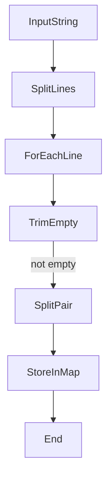
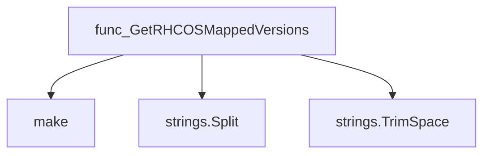
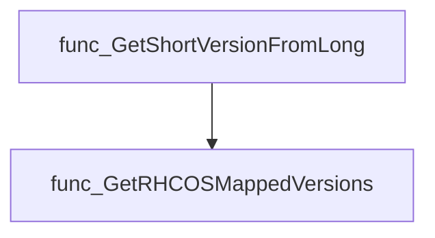
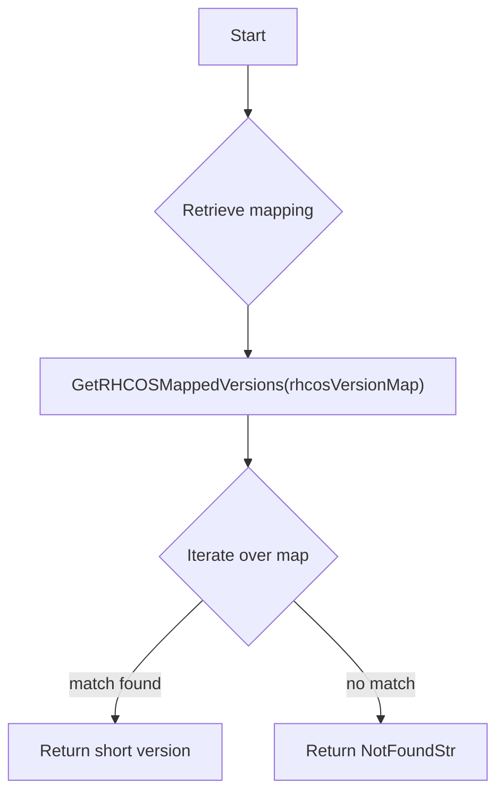
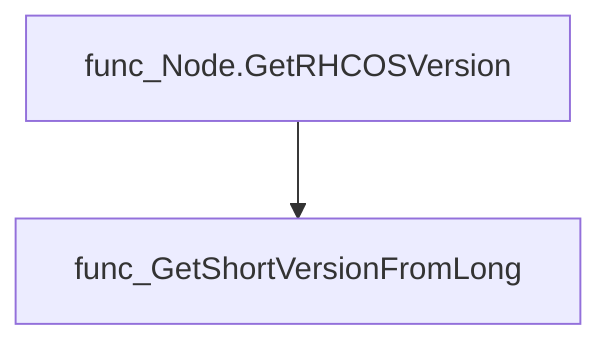

# Package operatingsystem

**Path**: `tests/platform/operatingsystem`

## Table of Contents

- [Overview](#overview)
- [Exported Functions](#exported-functions)
  - [GetRHCOSMappedVersions](#getrhcosmappedversions)
  - [GetShortVersionFromLong](#getshortversionfromlong)

## Overview

Provides utilities for mapping Red Hat CoreOS (RHCOS) release strings between long and short forms, enabling other packages to retrieve concise version identifiers.

### Key Features

- Parses a newline‑separated embedded file containing RHCOS version mappings into a map of short→long

### Design Notes

- Mappings are loaded from an embedded file at build time; no runtime I/O occurs
- If a lookup fails the functions return a sentinel string and an error to signal absence
- Users should cache the returned map when multiple lookups are needed for efficiency

### Exported Functions Summary

| Name | Purpose |
|------|----------|
| [func GetRHCOSMappedVersions(rhcosVersionMap string) (map[string]string, error)](#getrhcosmappedversions) | Parses a newline‑separated list of RHCOS version mappings (`short / long`) and returns a map where the short version is the key and the long form is the value. |
| [func GetShortVersionFromLong(longVersion string) (string, error)](#getshortversionfromlong) | Looks up the short RHCOS version that corresponds to a supplied long‑form release string. If no match is found it returns a sentinel value. |

## Exported Functions

### GetRHCOSMappedVersions

**GetRHCOSMappedVersions** - Parses a newline‑separated list of RHCOS version mappings (`short / long`) and returns a map where the short version is the key and the long form is the value.

#### Signature (Go)

```go
func GetRHCOSMappedVersions(rhcosVersionMap string) (map[string]string, error)
```

#### Summary Table

| Aspect | Details |
|--------|---------|
| **Purpose** | Parses a newline‑separated list of RHCOS version mappings (`short / long`) and returns a map where the short version is the key and the long form is the value. |
| **Parameters** | `rhcosVersionMap string` – raw text containing lines such as “4.10.14 / 410.84.202205031645‑0”. |
| **Return value** | `map[string]string, error` – a mapping from short to long version; the function currently never returns an error, but the signature allows for future extensions. |
| **Key dependencies** | • `strings.Split`, `strings.TrimSpace` (standard library) <br>• `make` (built‑in) |
| **Side effects** | None – purely functional: creates and returns a new map without mutating globals or performing I/O. |
| **How it fits the package** | Provides data for other helpers (e.g., `GetShortVersionFromLong`) to resolve between short and long RHCOS identifiers. |

#### Internal workflow



#### Function dependencies



#### Functions calling `GetRHCOSMappedVersions`



#### Usage example (Go)

```go
// Minimal example invoking GetRHCOSMappedVersions
package main

import (
    "fmt"
    "github.com/redhat-best-practices-for-k8s/certsuite/tests/platform/operatingsystem"
)

func main() {
    data := `4.9.21 / 49.84.202202081504-0
4.10.14 / 410.84.202205031645-0`
    mapping, err := operatingsystem.GetRHCOSMappedVersions(data)
    if err != nil {
        fmt.Println("error:", err)
        return
    }
    fmt.Printf("%+v\n", mapping) // Output: map[4.9.21:49.84.202202081504-0 4.10.14:410.84.202205031645-0]
}
```

---

### GetShortVersionFromLong

**GetShortVersionFromLong** - Looks up the short RHCOS version that corresponds to a supplied long‑form release string. If no match is found it returns a sentinel value.

#### Signature (Go)

```go
func GetShortVersionFromLong(longVersion string) (string, error)
```

#### Summary Table

| Aspect | Details |
|--------|---------|
| **Purpose** | Looks up the short RHCOS version that corresponds to a supplied long‑form release string. If no match is found it returns a sentinel value. |
| **Parameters** | `longVersion` (string) – the full RHCOS build identifier (e.g., `"410.84.202205031645-0"`). |
| **Return value** | `(string, error)` – the matching short version string or `"version-not-found"` with a nil error if no match exists; an error is returned only when mapping data cannot be retrieved. |
| **Key dependencies** | • `GetRHCOSMappedVersions` – retrieves the map of short → long versions.<br>• `rhcosVersionMap` (global string constant) – source text for mapping. |
| **Side effects** | None; purely functional lookup. |
| **How it fits the package** | Provides a helper used by node‑level logic to translate OS image identifiers into concise version tags required elsewhere in the suite. |

#### Internal workflow



#### Function dependencies


#### Functions calling `GetShortVersionFromLong`



#### Usage example (Go)

```go
// Minimal example invoking GetShortVersionFromLong
short, err := operatingsystem.GetShortVersionFromLong("410.84.202205031645-0")
if err != nil {
    log.Fatalf("mapping failed: %v", err)
}
fmt.Printf("short version: %s\n", short) // prints the matching short tag or "version-not-found"
```

---
