# Package platform

**Path**: `tests/platform`

## Table of Contents

- [Overview](#overview)
- [Exported Functions](#exported-functions)
  - [LoadChecks](#loadchecks)
- [Local Functions](#local-functions)
  - [testClusterOperatorHealth](#testclusteroperatorhealth)
  - [testContainersFsDiff](#testcontainersfsdiff)
  - [testHugepages](#testhugepages)
  - [testHyperThreadingEnabled](#testhyperthreadingenabled)
  - [testIsRedHatRelease](#testisredhatrelease)
  - [testIsSELinuxEnforcing](#testisselinuxenforcing)
  - [testNodeOperatingSystemStatus](#testnodeoperatingsystemstatus)
  - [testOCPStatus](#testocpstatus)
  - [testPodHugePagesSize](#testpodhugepagessize)
  - [testServiceMesh](#testservicemesh)
  - [testSysctlConfigs](#testsysctlconfigs)
  - [testTainted](#testtainted)
  - [testUnalteredBootParams](#testunalteredbootparams)

## Overview

The `platform` package registers a collection of platform‑alteration tests (e.g., hyper‑threading, kernel taints, SELinux state, OS compatibility) into the checks database for use by Certsuite’s test runner.

### Key Features

- Registers a suite of platform‑specific compliance checks under the common platform alteration group
- Provides helper functions to validate node and container configurations against OpenShift and Red Hat requirements
- Integrates with Certsuite’s reporting system to record compliant or non‑compliant objects

### Design Notes

- All tests are defined as standalone functions that accept a `*checksdb.Check` and `*provider.TestEnvironment`; this keeps the test logic decoupled from registration logic
- The package relies on external helpers (e.g., `testhelper`, `clientsholder`) to gather runtime data, so it is intentionally thin and focused on orchestration rather than low‑level implementation
- Skips are applied per check via skip functions derived from environment state or node attributes, ensuring irrelevant checks do not run in unsupported contexts

### Exported Functions Summary

| Name | Purpose |
|------|----------|
| [func LoadChecks() ()](#loadchecks) | Registers a collection of platform‑alteration tests (hyper‑threading, kernel taints, SELinux, etc.) into the checks database under the `common.PlatformAlterationTestKey` group. |

### Local Functions Summary

| Name | Purpose |
|------|----------|
| [func (*checksdb.Check, *provider.TestEnvironment)()](#testclusteroperatorhealth) | Determines whether every ClusterOperator on the cluster reports an `Available` status. If any operator is not available, the check fails and records non‑compliant objects. |
| [func testContainersFsDiff(check *checksdb.Check, env *provider.TestEnvironment)](#testcontainersfsdiff) | Verifies each container in the environment has an unmodified file system by running a diff against a probe pod and records compliance status. |
| [func testHugepages(check *checksdb.Check, env *provider.TestEnvironment)()](#testhugepages) | Verifies that each worker node’s hugepage settings are unchanged and reports compliance. |
| [func testHyperThreadingEnabled(check *checksdb.Check, env *provider.TestEnvironment)](#testhyperthreadingenabled) | Checks each bare‑metal node in the environment to determine whether hyper‑threading is enabled, logs the outcome, and records compliant/non‑compliant results. |
| [func testIsRedHatRelease(check *checksdb.Check, env *provider.TestEnvironment)](#testisredhatrelease) | Validates each container in the test environment is built from a Red Hat Enterprise Linux base image. It records compliance or non‑compliance for reporting. |
| [func testIsSELinuxEnforcing(check *checksdb.Check, env *provider.TestEnvironment)](#testisselinuxenforcing) | Executes `getenforce` inside each probe pod to confirm SELinux is in *enforcing* state on the host node. Reports compliance per node and aggregates results into the test check. |
| [func testNodeOperatingSystemStatus(check *checksdb.Check, env *provider.TestEnvironment)](#testnodeoperatingsystemstatus) | Ensures every control‑plane node uses RHCOS or CentOS Stream CoreOS and that worker nodes use a supported OS (RHCOS, RHEL, or CSCC). Checks version compatibility against the OpenShift release. |
| [func testOCPStatus(check *checksdb.Check, env *provider.TestEnvironment)](#testocpstatus) | Inspects `env.OCPStatus` to decide if the cluster’s OpenShift version is in end‑of‑life (EOL). Logs an appropriate message and creates a compliance report object. |
| [func testPodHugePagesSize(check *checksdb.Check, env *provider.TestEnvironment, size string)](#testpodhugepagessize) | Iterates over all huge‑pages pods in the test environment and verifies each pod’s resource requests/limits match the expected page size (`size`). Logs results and records compliant/non‑compliant objects. |
| [func testServiceMesh(check *checksdb.Check, env *provider.TestEnvironment)](#testservicemesh) | Verifies each pod has at least one Istio‑proxy container. Pods lacking the proxy are flagged as non‑compliant; those with it are marked compliant. |
| [func testSysctlConfigs(check *checksdb.Check, env *provider.TestEnvironment)](#testsysctlconfigs) | Ensures that each node’s runtime sysctl settings match the corresponding kernel arguments defined in its machine config. Non‑compliant nodes are recorded for reporting. |
| [func testTainted(check *checksdb.Check, env *provider.TestEnvironment)](#testtainted) | Determines whether each node in the environment has kernel taints that are either unapproved or caused by modules not on an allow‑list. It records compliant and non‑compliant findings for reporting. |
| [func testUnalteredBootParams(check *checksdb.Check, env *provider.TestEnvironment)](#testunalteredbootparams) | For every distinct node in the test environment, it runs `bootparams.TestBootParamsHelper` to ensure that kernel command‑line arguments are unchanged from their configured MachineConfig values. It records compliant and non‑compliant nodes for reporting. |

## Exported Functions

### LoadChecks

**LoadChecks** - Registers a collection of platform‑alteration tests (hyper‑threading, kernel taints, SELinux, etc.) into the checks database under the `common.PlatformAlterationTestKey` group.

#### Signature (Go)

```go
func LoadChecks() ()
```

#### Summary Table

| Aspect | Details |
|--------|---------|
| **Purpose** | Registers a collection of platform‑alteration tests (hyper‑threading, kernel taints, SELinux, etc.) into the checks database under the `common.PlatformAlterationTestKey` group. |
| **Parameters** | None |
| **Return value** | None |
| **Key dependencies** | • `log.Debug`<br>• `WithBeforeEachFn`<br>• `checksdb.NewChecksGroup`<br>• `checksdb.Check.Add`, `WithCheckFn`, `WithSkipCheckFn`<br>• Test identifiers (`identifiers.GetTestIDAndLabels`) <br>• Skip functions from `testhelper` (e.g., `GetNoBareMetalNodesSkipFn`) <br>• Individual test implementations (e.g., `testHyperThreadingEnabled`, `testTainted`, etc.) |
| **Side effects** | Adds checks to the global checks database; logs a debug message. No I/O beyond logging. |
| **How it fits the package** | Called by `certsuite.LoadInternalChecksDB` during test suite initialization, populating the platform alteration group of checks that will be executed in tests. |

#### Internal workflow (Mermaid)

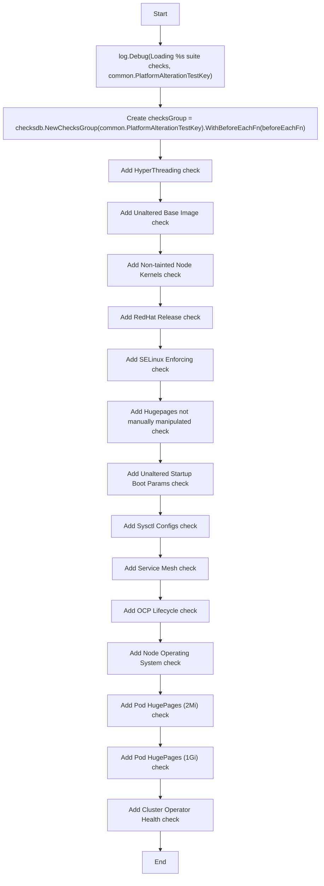

#### Function dependencies (Mermaid)

```mermaid
graph TD
  func_LoadChecks --> log_Debug
  func_LoadChecks --> WithBeforeEachFn
  func_LoadChecks --> checksdb_NewChecksGroup
  func_LoadChecks --> checksdb_Check_Add
  func_LoadChecks --> checksdb_WithCheckFn
  func_LoadChecks --> checksdb_WithSkipCheckFn
  func_LoadChecks --> identifiers_GetTestIDAndLabels
  func_LoadChecks --> testhelper_GetNoBareMetalNodesSkipFn
  func_LoadChecks --> testhelper_GetNonOCPClusterSkipFn
  func_LoadChecks --> testhelper_GetDaemonSetFailedToSpawnSkipFn
  func_LoadChecks --> testhelper_GetNoContainersUnderTestSkipFn
  func_LoadChecks --> testhelper_GetNoIstioSkipFn
  func_LoadChecks --> testhelper_GetNoPodsUnderTestSkipFn
  func_LoadChecks --> testhelper_GetNoHugepagesPodsSkipFn
  func_LoadChecks --> testHyperThreadingEnabled
  func_LoadChecks --> testContainersFsDiff
  func_LoadChecks --> testTainted
  func_LoadChecks --> testIsRedHatRelease
  func_LoadChecks --> testIsSELinuxEnforcing
  func_LoadChecks --> testHugepages
  func_LoadChecks --> testUnalteredBootParams
  func_LoadChecks --> testSysctlConfigs
  func_LoadChecks --> testServiceMesh
  func_LoadChecks --> testOCPStatus
  func_LoadChecks --> testNodeOperatingSystemStatus
  func_LoadChecks --> testPodHugePagesSize
  func_LoadChecks --> testClusterOperatorHealth
```

#### Functions calling `LoadChecks` (Mermaid)

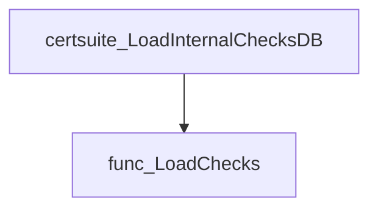

#### Usage example (Go)

```go
// Minimal example invoking LoadChecks
func main() {
    // Initialise the checks database (usually done during test setup)
    platform.LoadChecks()
}
```

---

## Local Functions

### testClusterOperatorHealth

**testClusterOperatorHealth** - Determines whether every ClusterOperator on the cluster reports an `Available` status. If any operator is not available, the check fails and records non‑compliant objects.

#### Signature (Go)

```go
func (*checksdb.Check, *provider.TestEnvironment)()
```

#### Summary Table

| Aspect | Details |
|--------|---------|
| **Purpose** | Determines whether every ClusterOperator on the cluster reports an `Available` status. If any operator is not available, the check fails and records non‑compliant objects. |
| **Parameters** | `check *checksdb.Check` – the test instance; `<nil>` unused. <br> `env *provider.TestEnvironment` – holds discovered ClusterOperator objects. |
| **Return value** | None (the result is stored via `SetResult`). |
| **Key dependencies** | • `log.LogInfo`<br>• `clusteroperator.IsClusterOperatorAvailable`<br>• `testhelper.NewClusterOperatorReportObject`<br>• `check.SetResult` |
| **Side effects** | • Writes log messages.<br>• Mutates the `Check` object by setting its result. |
| **How it fits the package** | Part of the platform test suite; executed when the “TestClusterOperatorHealth” check is loaded in `LoadChecks`. |

#### Internal workflow (Mermaid)

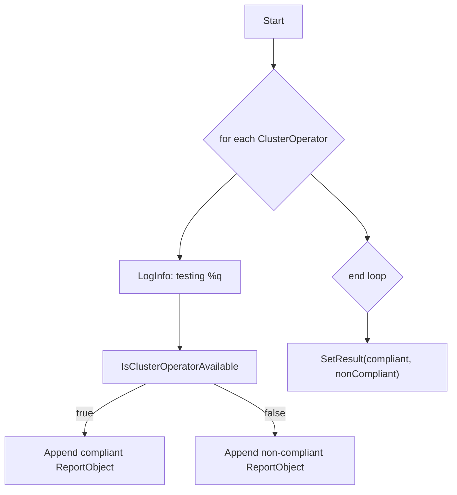

#### Function dependencies (Mermaid)

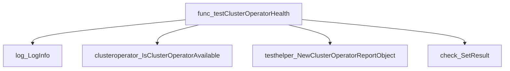

#### Functions calling `testClusterOperatorHealth` (Mermaid)

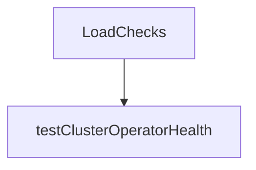

#### Usage example (Go)

```go
// Minimal example invoking testClusterOperatorHealth
func ExampleTest() {
    // Assume env is a populated TestEnvironment with ClusterOperators.
    var check *checksdb.Check
    var env provider.TestEnvironment
    // The function mutates the check’s result internally.
    testClusterOperatorHealth(check, &env)
}
```

---

### testContainersFsDiff

**testContainersFsDiff** - Verifies each container in the environment has an unmodified file system by running a diff against a probe pod and records compliance status.

#### Signature (Go)

```go
func testContainersFsDiff(check *checksdb.Check, env *provider.TestEnvironment)
```

#### Summary Table

| Aspect | Details |
|--------|---------|
| **Purpose** | Verifies each container in the environment has an unmodified file system by running a diff against a probe pod and records compliance status. |
| **Parameters** | `check *checksdb.Check` – test context for logging and result storage.<br>`env *provider.TestEnvironment` – holds containers, probe pods, OpenShift version, etc. |
| **Return value** | None; results are stored via `check.SetResult`. |
| **Key dependencies** | • `clientsholder.NewContext`<br>• `cnffsdiff.NewFsDiffTester`<br>• `fsDiffTester.RunTest`, `GetResults`, fields `ChangedFolders`, `DeletedFolders`, `Error`<br>• `testhelper.NewContainerReportObject` and its methods (`AddField`)<br>• Logging helpers: `check.LogInfo`, `check.LogError` |
| **Side effects** | Creates report objects, logs information/errors, updates the test result in `check`. No external I/O beyond logging. |
| **How it fits the package** | Called by `LoadChecks` as one of many checks for the platform suite; contributes to overall compliance assessment. |

#### Internal workflow (Mermaid)

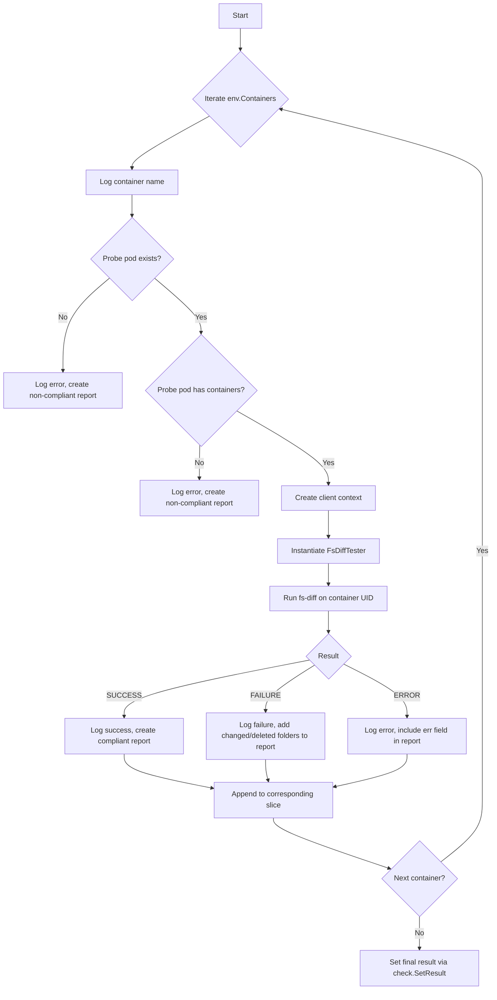

#### Function dependencies (Mermaid)

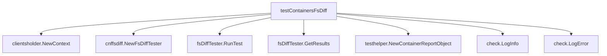

#### Functions calling `testContainersFsDiff` (Mermaid)

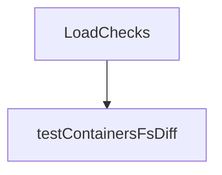

#### Usage example (Go)

```go
// Minimal example invoking testContainersFsDiff
package main

import (
    "github.com/redhat-best-practices-for-k8s/certsuite/tests/platform"
    "github.com/redhat-best-practices-for-k8s/certsuite/pkg/checksdb"
    "github.com/redhat-best-practices-for-k8s/certsuite/provider"
)

func main() {
    // Assume we have a populated Check and TestEnvironment
    var check *checksdb.Check
    var env  *provider.TestEnvironment

    platform.testContainersFsDiff(check, env)
}
```

---

### testHugepages

**testHugepages** - Verifies that each worker node’s hugepage settings are unchanged and reports compliance.

#### Signature (Go)

```go
func testHugepages(check *checksdb.Check, env *provider.TestEnvironment)()
```

#### Summary Table

| Aspect | Details |
|--------|---------|
| **Purpose** | Verifies that each worker node’s hugepage settings are unchanged and reports compliance. |
| **Parameters** | `check *checksdb.Check` – the test check object; `<br>` `env *provider.TestEnvironment` – environment containing nodes, pods, and other context. |
| **Return value** | None (updates the `Check` result). |
| **Key dependencies** | • `log.LogInfo`, `log.LogError`<br>• `node.IsWorkerNode()`<br>• `env.ProbePods[nodeName]` lookup<br>• `hugepages.NewTester` and its `Run` method<br>• `testhelper.NewNodeReportObject` |
| **Side effects** | • Emits log messages.<br>• Appends compliant/non‑compliant `ReportObject`s to the check result. |
| **How it fits the package** | Part of the platform test suite; invoked by `LoadChecks()` for the “Hugepages not manually manipulated” check. |

#### Internal workflow (Mermaid)

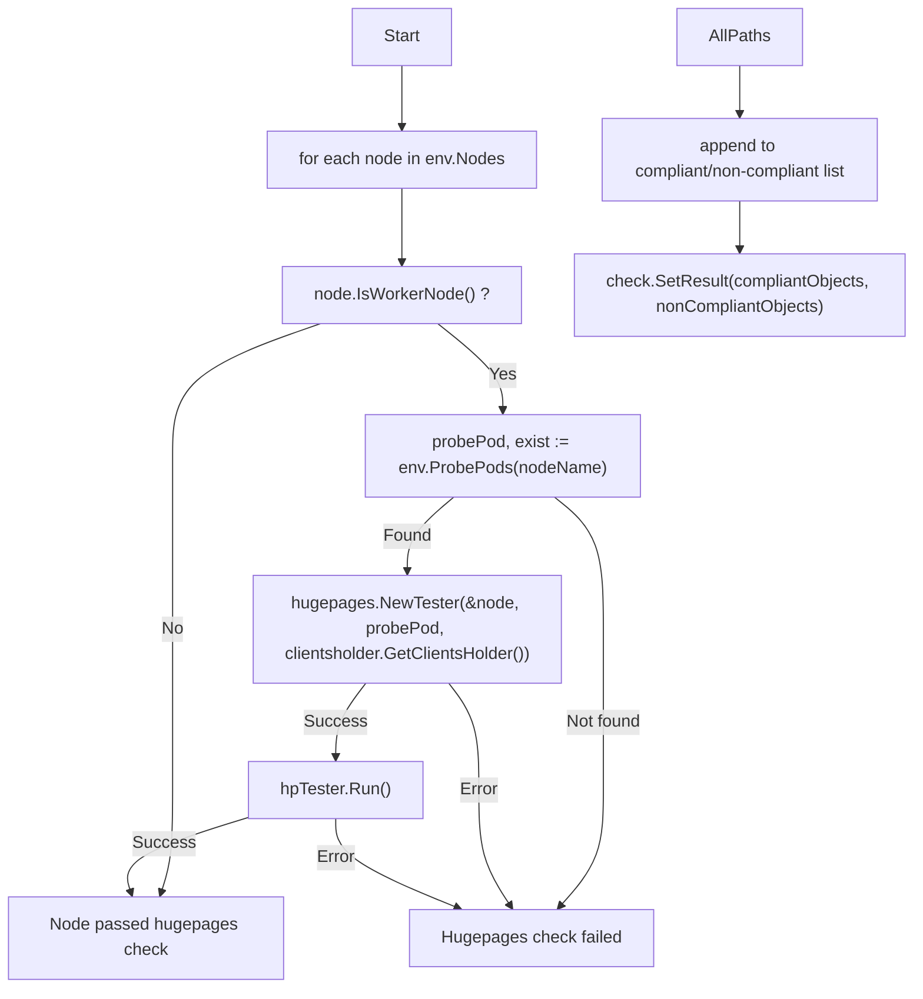

#### Function dependencies (Mermaid)

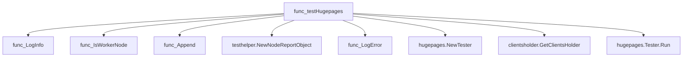

#### Functions calling `testHugepages` (Mermaid)

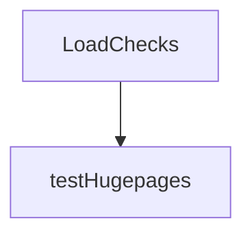

#### Usage example (Go)

```go
// Minimal example invoking testHugepages
package main

import (
    "github.com/redhat-best-practices-for-k8s/certsuite/tests/platform"
    "github.com/redhat-best-practices-for-k8s/certsuite/tests/provider"
)

func main() {
    // Assume env and check are initialized elsewhere
    var env *provider.TestEnvironment
    var check *checksdb.Check

    platform.testHugepages(check, env)
}
```

---

### testHyperThreadingEnabled

**testHyperThreadingEnabled** - Checks each bare‑metal node in the environment to determine whether hyper‑threading is enabled, logs the outcome, and records compliant/non‑compliant results.

#### Signature (Go)

```go
func testHyperThreadingEnabled(check *checksdb.Check, env *provider.TestEnvironment)
```

#### Summary Table

| Aspect | Details |
|--------|---------|
| **Purpose** | Checks each bare‑metal node in the environment to determine whether hyper‑threading is enabled, logs the outcome, and records compliant/non‑compliant results. |
| **Parameters** | `check *checksdb.Check` – The check instance used for logging and result reporting.<br>`env *provider.TestEnvironment` – Test environment providing node information. |
| **Return value** | None (the function reports via `check.SetResult`). |
| **Key dependencies** | • `env.GetBaremetalNodes()`<br>• `node.IsHyperThreadNode(env)`<br>• `check.LogInfo` / `check.LogError`<br>• `testhelper.NewNodeReportObject`<br>• `check.SetResult` |
| **Side effects** | *Mutates the supplied `check` by calling `SetResult` with lists of compliant and non‑compliant report objects.<br>* Emits log entries via the check’s logger. |
| **How it fits the package** | Implements the “Hyper‑Threading Enabled” test within the platform test suite; invoked from `LoadChecks` during test registration. |

#### Internal workflow (Mermaid)

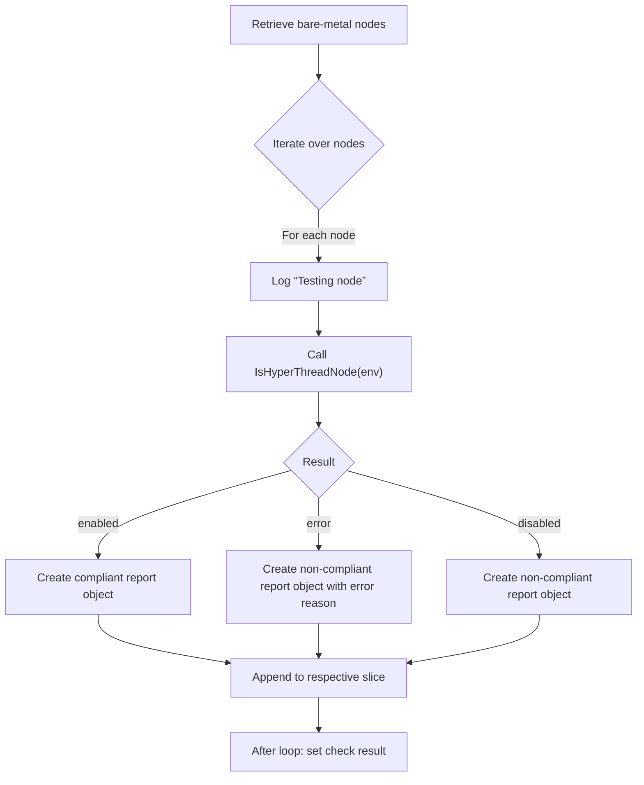

#### Function dependencies (Mermaid)

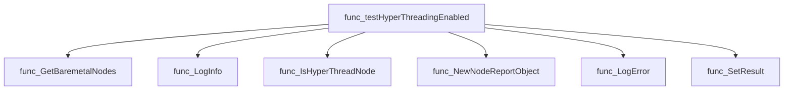

#### Functions calling `testHyperThreadingEnabled` (Mermaid)

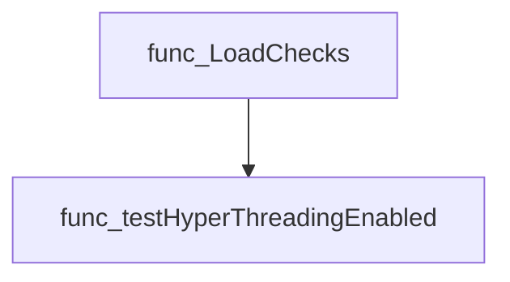

#### Usage example (Go)

```go
// Minimal example invoking testHyperThreadingEnabled
func ExampleTest() {
    // Assume env and check are already initialized
    var env provider.TestEnvironment
    var check checksdb.Check

    // Run the hyper‑threading check
    testHyperThreadingEnabled(&check, &env)

    // Inspect results
    fmt.Println("Compliant nodes:", len(check.CompliantObjects))
    fmt.Println("Non‑compliant nodes:", len(check.NonCompliantObjects))
}
```

---

---

### testIsRedHatRelease

**testIsRedHatRelease** - Validates each container in the test environment is built from a Red Hat Enterprise Linux base image. It records compliance or non‑compliance for reporting.

#### Signature (Go)

```go
func testIsRedHatRelease(check *checksdb.Check, env *provider.TestEnvironment) 
```

#### Summary Table

| Aspect | Details |
|--------|---------|
| **Purpose** | Validates each container in the test environment is built from a Red Hat Enterprise Linux base image. It records compliance or non‑compliance for reporting. |
| **Parameters** | `check *checksdb.Check` – The check instance used to log and store results.<br>`env *provider.TestEnvironment` – Holds metadata about containers under test. |
| **Return value** | None (void). Results are stored via `check.SetResult`. |
| **Key dependencies** | • `isredhat.NewBaseImageTester` – creates a tester for a container’s base image.<br>• `clientsholder.GetClientsHolder()` & `clientsholder.NewContext(...)` – provide Kubernetes client context.<br>• `testhelper.NewContainerReportObject` – constructs report objects.<br>• Logging methods on the check (`LogInfo`, `LogError`). |
| **Side effects** | • Logs information and errors to the check’s logger.<br>• Appends compliant/non‑compliant containers to result slices.<br>• Calls `check.SetResult` to store final lists. No external I/O or concurrency is performed. |
| **How it fits the package** | Part of the *platform* test suite, this function implements the logic for the “Is Red Hat Release” check (TestID: `TestIsRedHatReleaseIdentifier`). It is invoked by `LoadChecks` when registering the check. |

#### Internal workflow

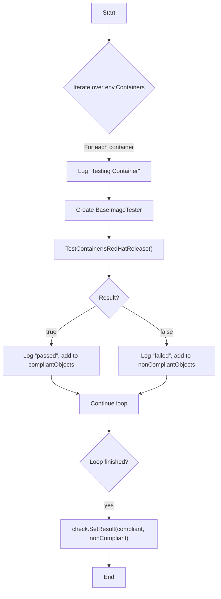

#### Function dependencies

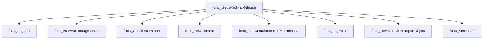

#### Functions calling `testIsRedHatRelease`

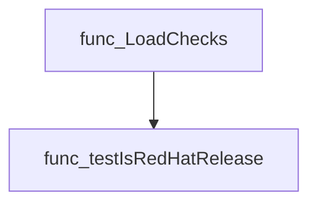

#### Usage example (Go)

```go
// Minimal example invoking testIsRedHatRelease
env := &provider.TestEnvironment{
    Containers: []*provider.Container{
        {Namespace: "default", Podname: "pod-1", Name: "app"},
    },
}
check := checksdb.NewCheck(...)
testIsRedHatRelease(check, env)
```

---

### testIsSELinuxEnforcing

**testIsSELinuxEnforcing** - Executes `getenforce` inside each probe pod to confirm SELinux is in *enforcing* state on the host node. Reports compliance per node and aggregates results into the test check.

#### 1) Signature (Go)

```go
func testIsSELinuxEnforcing(check *checksdb.Check, env *provider.TestEnvironment)
```

#### 2) Summary Table

| Aspect | Details |
|--------|---------|
| **Purpose** | Executes `getenforce` inside each probe pod to confirm SELinux is in *enforcing* state on the host node. Reports compliance per node and aggregates results into the test check. |
| **Parameters** | `check *checksdb.Check` – the test definition that receives results.<br>`env *provider.TestEnvironment` – contains the list of probe pods used to reach each node. |
| **Return value** | None; results are stored via `check.SetResult`. |
| **Key dependencies** | • `clientsholder.GetClientsHolder()`<br>• `clientsholder.NewContext(...)`<br>• `o.ExecCommandContainer(ctx, cmd)`<br>• `testhelper.NewPodReportObject`, `testhelper.NewNodeReportObject`<br>• `check.LogError`, `check.LogInfo`, `check.SetResult` |
| **Side effects** | Executes a command inside each probe pod; logs errors and info; mutates the test check with compliance data. No external state is altered. |
| **How it fits the package** | Part of the platform tests suite, specifically the SELinux enforcement check that ensures cluster nodes run with correct security posture. |

#### 3) Internal workflow (Mermaid)

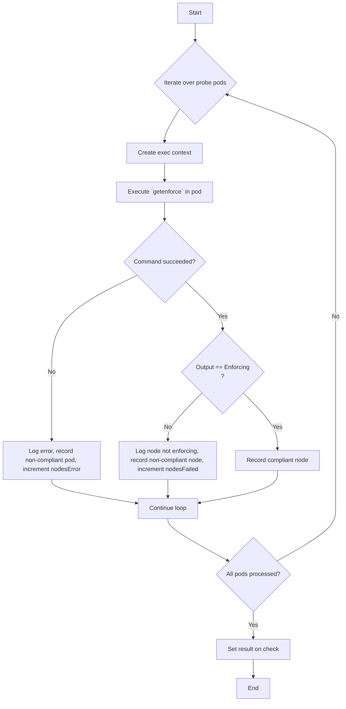

#### 4) Function dependencies (Mermaid)

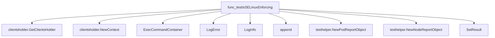

#### 5) Functions calling `testIsSELinuxEnforcing` (Mermaid)

```mermaid
graph TD
  func_LoadChecks --> func_testIsSELinuxEnforcing
```

#### 6) Usage example (Go)

```go
// Minimal example invoking testIsSELinuxEnforcing
import (
    "github.com/redhat-best-practices-for-k8s/certsuite/pkg/checksdb"
    "github.com/redhat-best-practices-for-k8s/certsuite/tests/platform/provider"
)

// Assume `check` and `env` are already initialized.
func runExample() {
    check := checksdb.NewCheck(...)
    env := &provider.TestEnvironment{ProbePods: ...}
    testIsSELinuxEnforcing(check, env)
}
```

---

### testNodeOperatingSystemStatus

**testNodeOperatingSystemStatus** - Ensures every control‑plane node uses RHCOS or CentOS Stream CoreOS and that worker nodes use a supported OS (RHCOS, RHEL, or CSCC). Checks version compatibility against the OpenShift release.

#### Signature (Go)

```go
func testNodeOperatingSystemStatus(check *checksdb.Check, env *provider.TestEnvironment) 
```

#### Summary Table

| Aspect | Details |
|--------|---------|
| **Purpose** | Ensures every control‑plane node uses RHCOS or CentOS Stream CoreOS and that worker nodes use a supported OS (RHCOS, RHEL, or CSCC). Checks version compatibility against the OpenShift release. |
| **Parameters** | `check *checksdb.Check` – test context for logging and result handling.<br>`env *provider.TestEnvironment` – environment containing node list and OpenShift version. |
| **Return value** | None (results are stored via `check.SetResult`). |
| **Key dependencies** | *Logging*: `LogInfo`, `LogError`, `LogDebug`.<br>*Node checks*: `IsControlPlaneNode`, `IsWorkerNode`, `IsRHCOS`, `IsCSCOS`, `IsRHEL`.<br>*Version retrieval*: `GetRHCOSVersion`, `GetCSCOSVersion`, `GetRHELVersion`.<br>*Compatibility checks*: `compatibility.IsRHCOSCompatible`, `compatibility.IsRHELCompatible`.<br>*Reporting*: `testhelper.NewNodeReportObject`, `AddField`. |
| **Side effects** | Modifies the test result via `check.SetResult`; logs diagnostic messages; appends to internal slices of compliant/non‑compliant report objects. |
| **How it fits the package** | Implements the *TestNodeOperatingSystemIdentifier* check within the platform test suite, ensuring cluster nodes comply with Red Hat operating system requirements before proceeding with further tests. |

#### Internal workflow (Mermaid)

```mermaid
flowchart TD
  A["Iterate over env.Nodes"] --> B{"node.IsControlPlaneNode()"}
  B -- yes --> C{"node.IsRHCOS() || node.IsCSCOS()"}
  C -- no --> D["Log error, record non‑compliant"]
  C -- yes --> E["continue"]
  B -- no --> F{"node.IsWorkerNode()"}
  F -- yes --> G{"node.IsRHCOS()"}
  G -- yes --> H["Get RHCOS version"]
  H --> I{"error"}
  I -- yes --> J["Log error, record non‑compliant"]
  I -- no --> K{"shortVersion == NotFoundStr"}
  K -- yes --> L["Skip node"]
  K -- no --> M["Check compatibility via IsRHCOSCompatible"]
  M -- incompatible --> N["Log error, record non‑compliant"]
  M -- compatible --> O["Record compliant"]
  G -- no --> P{"node.IsCSCOS()"}
  P -- yes --> Q["Get CSCC version"] --> R["Log debug (unreleased)"]
  P -- no --> S{"node.IsRHEL()"}
  S -- yes --> T["Get RHEL version"] --> U{"error"}
  U -- yes --> V["Log error, record non‑compliant"]
  U -- no --> W["Check compatibility via IsRHELCompatible"]
  W -- incompatible --> X["Log error, record non‑compliant"]
  W -- compatible --> Y["Record compliant"]
  S -- no --> Z["Log error, record non‑compliant"]
  ...
```

#### Function dependencies (Mermaid)

```mermaid
graph TD
  func_testNodeOperatingSystemStatus --> LogInfo
  func_testNodeOperatingSystemStatus --> LogError
  func_testNodeOperatingSystemStatus --> LogDebug
  func_testNodeOperatingSystemStatus --> IsControlPlaneNode
  func_testNodeOperatingSystemStatus --> IsWorkerNode
  func_testNodeOperatingSystemStatus --> IsRHCOS
  func_testNodeOperatingSystemStatus --> IsCSCOS
  func_testNodeOperatingSystemStatus --> IsRHEL
  func_testNodeOperatingSystemStatus --> GetRHCOSVersion
  func_testNodeOperatingSystemStatus --> GetCSCOSVersion
  func_testNodeOperatingSystemStatus --> GetRHELVersion
  func_testNodeOperatingSystemStatus --> compatibility.IsRHCOSCompatible
  func_testNodeOperatingSystemStatus --> compatibility.IsRHELCompatible
  func_testNodeOperatingSystemStatus --> testhelper.NewNodeReportObject
  func_testNodeOperatingSystemStatus --> AddField
```

#### Functions calling `testNodeOperatingSystemStatus` (Mermaid)

```mermaid
graph TD
  LoadChecks --> testNodeOperatingSystemStatus
```

#### Usage example (Go)

```go
// Minimal example invoking testNodeOperatingSystemStatus
check := checksdb.NewCheck(...)
env := &provider.TestEnvironment{ /* populate Nodes and OpenshiftVersion */ }
testNodeOperatingSystemStatus(check, env)
// check.Result now contains compliant/non‑compliant node reports
```

---

### testOCPStatus

**testOCPStatus** - Inspects `env.OCPStatus` to decide if the cluster’s OpenShift version is in end‑of‑life (EOL). Logs an appropriate message and creates a compliance report object.

#### 1) Signature (Go)

```go
func testOCPStatus(check *checksdb.Check, env *provider.TestEnvironment)
```

#### 2) Summary Table

| Aspect | Details |
|--------|---------|
| **Purpose** | Inspects `env.OCPStatus` to decide if the cluster’s OpenShift version is in end‑of‑life (EOL). Logs an appropriate message and creates a compliance report object. |
| **Parameters** | • `check *checksdb.Check` – test instance used for logging and setting results.<br>• `env *provider.TestEnvironment` – environment data containing the cluster’s OpenShift version and lifecycle status. |
| **Return value** | None (void). The function records its result via `check.SetResult`. |
| **Key dependencies** | • `LogError`, `LogInfo` on the check instance.<br>• `testhelper.NewClusterVersionReportObject` to build report objects.<br>• `SetResult` to store compliant/non‑compliant results. |
| **Side effects** | • Emits log messages.<br>• Mutates the check’s result state via `SetResult`. |
| **How it fits the package** | Part of the OpenShift platform test suite; called by `LoadChecks` when registering the “OCPLifecycle” check. It validates that a cluster is not running an EOL version. |

#### 3) Internal workflow (Mermaid)

```mermaid
flowchart TD
  A["Start"] --> B{"env.OCPStatus"}
  B -- OCPStatusEOL --> C["LogError, set non‑compliant"]
  B -- OCPStatusMS --> D["LogInfo"]
  B -- OCPStatusGA --> D
  B -- OCPStatusPreGA --> D
  B -- default --> E["LogInfo"]
  C --> F["Create non‑compliant report object"]
  D --> G["Create compliant report object"]
  E --> G
  F & G --> H["check.SetResult(compliant, nonCompliant)"]
```

#### 4) Function dependencies (Mermaid)

```mermaid
graph TD
  func_testOCPStatus --> func_LogError
  func_testOCPStatus --> func_LogInfo
  func_testOCPStatus --> testhelper.NewClusterVersionReportObject
  func_testOCPStatus --> func_SetResult
```

#### 5) Functions calling `testOCPStatus` (Mermaid)

```mermaid
graph TD
  checksdb.NewCheck --> func_testOCPStatus
```

> *Note: The only caller in the package is the registration of the “OCPLifecycle” check inside `LoadChecks`.*

#### 6) Usage example (Go)

```go
// Minimal example invoking testOCPStatus
package main

import (
    "github.com/redhat-best-practices-for-k8s/certsuite/tests/platform"
    "github.com/redhat-best-practices-for-k8s/certsuite/pkg/checksdb"
    "github.com/redhat-best-practices-for-k8s/certsuite/pkg/provider"
)

func main() {
    // Create a dummy check and environment
    c := &checksdb.Check{}
    env := &provider.TestEnvironment{
        OpenshiftVersion: "4.12",
        OCPStatus:       compatibility.OCPStatusGA, // assume GA for illustration
    }

    // Run the status test
    platform.testOCPStatus(c, env)

    // Results are now stored in c.Result
}
```

*The example demonstrates how to call `testOCPStatus` directly with a check instance and environment data.*

---

### testPodHugePagesSize

**testPodHugePagesSize** - Iterates over all huge‑pages pods in the test environment and verifies each pod’s resource requests/limits match the expected page size (`size`). Logs results and records compliant/non‑compliant objects.

#### Signature (Go)

```go
func testPodHugePagesSize(check *checksdb.Check, env *provider.TestEnvironment, size string)
```

#### Summary Table

| Aspect | Details |
|--------|---------|
| **Purpose** | Iterates over all huge‑pages pods in the test environment and verifies each pod’s resource requests/limits match the expected page size (`size`). Logs results and records compliant/non‑compliant objects. |
| **Parameters** | `check *checksdb.Check` – test check context.<br>`env *provider.TestEnvironment` – execution environment providing huge‑pages pod list.<br>`size string` – expected huge‑pages size (e.g., `"2Mi"` or `"1Gi"`). |
| **Return value** | None. Side effects are recorded via `check.SetResult`. |
| **Key dependencies** | • `env.GetHugepagesPods()`<br>• `put.CheckResourceHugePagesSize(size)`<br>• `check.LogInfo`, `check.LogError`<br>• `testhelper.NewPodReportObject`<br>• `check.SetResult` |
| **Side effects** | Logs informational or error messages; builds slices of report objects and stores them in the check result. No external I/O beyond logging. |
| **How it fits the package** | Used by platform test suite to assert correct huge‑pages configuration for pods, supporting tests `TestPodHugePages2M` and `TestPodHugePages1G`. |

#### Internal workflow (Mermaid)

```mermaid
flowchart TD
  A["Start"] --> B{"Iterate env.GetHugepagesPods()"}
  B -->|"for each pod"| C["LogInfo “Testing Pod …”"]
  C --> D["CheckResourceHugePagesSize(size)"]
  D --> E{"Result"}
  E -- false --> F["LogError “Pod … incorrect size”"]
  F --> G["Append to nonCompliantObjects"]
  E -- true --> H["LogInfo “Pod … correct size”"]
  H --> I["Append to compliantObjects"]
  I --> J["Continue loop"]
  J --> B
  B -- end --> K["SetResult(compliant, nonCompliant)"]
```

#### Function dependencies (Mermaid)

```mermaid
graph TD
  func_testPodHugePagesSize --> func_GetHugepagesPods
  func_testPodHugePagesSize --> func_CheckResourceHugePagesSize
  func_testPodHugePagesSize --> func_LogInfo
  func_testPodHugePagesSize --> func_LogError
  func_testPodHugePagesSize --> func_NewPodReportObject
  func_testPodHugePagesSize --> func_SetResult
```

#### Functions calling `testPodHugePagesSize` (Mermaid)

```mermaid
graph TD
  func_LoadChecks --> func_testPodHugePagesSize
```

#### Usage example (Go)

```go
// Minimal example invoking testPodHugePagesSize
func ExampleTest() {
    // Assume check and env are already created by the testing framework.
    var check *checksdb.Check
    var env *provider.TestEnvironment

    // Validate that all huge‑pages pods use 2Mi pages.
    testPodHugePagesSize(check, env, provider.HugePages2Mi)
}
```

---

---

### testServiceMesh

**testServiceMesh** - Verifies each pod has at least one Istio‑proxy container. Pods lacking the proxy are flagged as non‑compliant; those with it are marked compliant.

#### Signature (Go)

```go
func testServiceMesh(check *checksdb.Check, env *provider.TestEnvironment)
```

#### Summary Table

| Aspect | Details |
|--------|---------|
| **Purpose** | Verifies each pod has at least one Istio‑proxy container. Pods lacking the proxy are flagged as non‑compliant; those with it are marked compliant. |
| **Parameters** | `check *checksdb.Check` – test context for logging and result reporting.<br>`env *provider.TestEnvironment` – runtime information, including the list of pods to inspect. |
| **Return value** | None – results are stored via `check.SetResult`. |
| **Key dependencies** | • `check.LogInfo`, `check.LogError`<br>• `Container.IsIstioProxy()`<br>• `testhelper.NewPodReportObject`<br>• `check.SetResult` |
| **Side effects** | Emits log messages; creates report objects; updates the check result. No external I/O or state mutation beyond the supplied structures. |
| **How it fits the package** | Implements the “Service Mesh” test in the platform suite, ensuring that an Istio installation is present on all pods when required. |

#### Internal workflow (Mermaid)

```mermaid
flowchart TD
  A["Start"] --> B{"Iterate env.Pods"}
  B -->|"for each pod"| C["Log pod name"]
  C --> D{"Search containers"}
  D -->|"found Istio proxy"| E["Mark compliant"]
  D -->|"not found"| F["Mark non‑compliant"]
  E --> G["Append to compliant list"]
  F --> H["Append to non‑compliant list"]
  G & H --> I["Continue loop"]
  I --> J{"Loop finished?"}
  J -- yes --> K["SetResult(compliant, nonCompliant)"]
  K --> L["End"]
```

#### Function dependencies (Mermaid)

```mermaid
graph TD
  func_testServiceMesh --> func_LogInfo
  func_testServiceMesh --> func_IsIstioProxy
  func_testServiceMesh --> func_LogError
  func_testServiceMesh --> func_append
  func_testServiceMesh --> func_NewPodReportObject
  func_testServiceMesh --> func_SetResult
```

#### Functions calling `testServiceMesh` (Mermaid)

```mermaid
graph TD
  func_LoadChecks --> func_testServiceMesh
```

#### Usage example (Go)

```go
// Minimal example invoking testServiceMesh
package main

import (
    "github.com/redhat-best-practices-for-k8s/certsuite/tests/platform"
    "github.com/redhat-best-practices-for-k8s/certsuite/pkg/checksdb"
    "github.com/redhat-best-practices-for-k8s/certsuite/provider"
)

func main() {
    // Assume `c` and `env` are initialized appropriately.
    var c *checksdb.Check
    var env *provider.TestEnvironment

    platform.testServiceMesh(c, env)
}
```

---

---

### testSysctlConfigs

**testSysctlConfigs** - Ensures that each node’s runtime sysctl settings match the corresponding kernel arguments defined in its machine config. Non‑compliant nodes are recorded for reporting.

#### Signature (Go)

```go
func testSysctlConfigs(check *checksdb.Check, env *provider.TestEnvironment)
```

#### Summary Table

| Aspect | Details |
|--------|---------|
| **Purpose** | Ensures that each node’s runtime sysctl settings match the corresponding kernel arguments defined in its machine config. Non‑compliant nodes are recorded for reporting. |
| **Parameters** | `check *checksdb.Check` – test context used for logging and result aggregation.<br>`env *provider.TestEnvironment` – collection of cluster metadata, including containers, probe pods, and node configuration. |
| **Return value** | None; the function records results via `check.SetResult`. |
| **Key dependencies** | • `sysctlconfig.GetSysctlSettings` (executes `sysctl --system` inside a probe pod).<br>• `bootparams.GetMcKernelArguments` (extracts kernel arguments from machine config).<br>• `testhelper.NewNodeReportObject` (creates report entries).<br>• Logging helpers: `LogInfo`, `LogError`. |
| **Side effects** | • Logs informational and error messages.<br>• Modifies the internal slices of compliant/non‑compliant objects held by `check`. |
| **How it fits the package** | Implements the “TestSysctlConfigs” check registered in `LoadChecks`. It verifies kernel configuration consistency across nodes, a core part of platform integrity validation. |

#### Internal workflow

```mermaid
flowchart TD
  A["Iterate over all containers"] --> B{"First container on node?"}
  B -- Yes --> C["Get probe pod"]
  C --> D{"Probe pod exists?"}
  D -- No --> E["Log error, add non‑compliant report"]
  D -- Yes --> F["Retrieve sysctl settings"]
  F --> G{"Error retrieving?"}
  G -- Yes --> H["Log error, add non‑compliant report"]
  G -- No --> I["Get kernel arguments map"]
  I --> J["Compare each key/value pair"]
  J --> K{"Mismatch found?"}
  K -- Yes --> L["Log mismatch, add non‑compliant report, mark invalid"]
  K -- No --> M["Continue comparison"]
  J --> N{"All keys valid?"}
  N -- Yes --> O["Mark node compliant, add report"]
  N -- No --> P["Skip compliance for this node"]
```

#### Function dependencies

```mermaid
graph TD
  func_testSysctlConfigs --> func_GetSysctlSettings
  func_testSysctlConfigs --> func_GetMcKernelArguments
  func_testSysctlConfigs --> func_NewNodeReportObject
  func_testSysctlConfigs --> func_LogInfo
  func_testSysctlConfigs --> func_LogError
```

#### Functions calling `testSysctlConfigs`

```mermaid
graph TD
  func_LoadChecks --> func_testSysctlConfigs
```

#### Usage example (Go)

```go
// Minimal example invoking testSysctlConfigs
import (
    "github.com/redhat-best-practices-for-k8s/certsuite/tests/platform"
    "github.com/redhat-best-practices-for-k8s/certsuite/tests/platform/provider"
    "github.com/redhat-best-practices-for-k8s/certsuite/pkg/checksdb"
)

func example() {
    // Assume env is prepared elsewhere with containers and probe pods
    var env *provider.TestEnvironment

    // Create a dummy check context
    check := checksdb.NewCheck(nil) // In real code, provide proper metadata

    platform.testSysctlConfigs(check, env)

    // Results are now available via check.Result()
}
```

---

### testTainted

**testTainted** - Determines whether each node in the environment has kernel taints that are either unapproved or caused by modules not on an allow‑list. It records compliant and non‑compliant findings for reporting.

#### Signature (Go)

```go
func testTainted(check *checksdb.Check, env *provider.TestEnvironment) 
```

#### Summary Table

| Aspect | Details |
|--------|---------|
| **Purpose** | Determines whether each node in the environment has kernel taints that are either unapproved or caused by modules not on an allow‑list. It records compliant and non‑compliant findings for reporting. |
| **Parameters** | `check *checksdb.Check` – test harness object; <br>`env *provider.TestEnvironment` – runtime data (nodes, pods, config). |
| **Return value** | none (the function records results via `check.SetResult`). |
| **Key dependencies** | - `clientsholder.NewContext`, `nodetainted.NewNodeTaintedTester` for per‑node taint access.<br>- `GetKernelTaintsMask`, `GetTainterModules`, `DecodeKernelTaintsFromBitMask`, `DecodeKernelTaintsFromLetters`, `GetOtherTaintedBits`, `RemoveAllExceptNumbers`, `GetTaintMsg`. <br>- Logging helpers (`LogInfo`, `LogError`).<br>- Report constructors (`testhelper.NewNodeReportObject`, `testhelper.NewTaintReportObject`). |
| **Side effects** | Emits log messages; collects and sets test results via `check.SetResult`; may mutate slices of report objects but does not alter global state. |
| **How it fits the package** | This function is invoked by the platform test loader (`LoadChecks`) as part of the “Non‑Tainted Node Kernels” check, ensuring that cluster nodes do not contain unexpected kernel taints. |

#### Internal workflow (Mermaid)

```mermaid
flowchart TD
  A["testTainted"] --> B["Iterate env.Nodes"]
  B --> C["Check workload deployed?"]
  C -->|"yes"| D["Create probe context & tester"]
  D --> E["Retrieve taints mask"]
  E --> F{"mask==0"}
  F -->|"yes"| G["Mark node compliant"]
  F -->|"no"| H["Decode mask to taint list"]
  H --> I["Check allow‑list presence"]
  I -->|"none"| J["Log error, mark non‑compliant"]
  I -->|"present"| K["Get tainter modules"]
  K --> L{"error"}
  L -->|"yes"| M["Mark node non‑compliant, record error"]
  L -->|"no"| N["Process each module’s taints"]
  N --> O["Log errors per taint"]
  N --> P["Set compliantNode=false"]
  N --> Q["Collect other kernel taints"]
  Q --> R["Log errors for unmodule taints"]
  R --> S["Set compliantNode=false"]
  P --> T{"compliantNode"}
  T -->|"yes"| U["Mark node compliant"]
  T -->|"no"| V["Continue next node"]
  U & V --> W["Finish loop"]
  W --> X["Check errNodes, badModules, otherTaints"]
  X --> Y["Log aggregated errors"]
  Y --> Z["check.SetResult(compliantObjects, nonCompliantObjects)"]
```

#### Function dependencies (Mermaid)

```mermaid
graph TD
  func_testTainted --> func_LogInfo
  func_testTainted --> func_HasWorkloadDeployed
  func_testTainted --> func_NewContext
  func_testTainted --> func_NewNodeTaintedTester
  func_testTainted --> func_GetKernelTaintsMask
  func_testTainted --> func_DecodeKernelTaintsFromBitMask
  func_testTainted --> func_GetTainterModules
  func_testTainted --> func_RemoveAllExceptNumbers
  func_testTainted --> func_EncodeKernelTaintsFromLetters
  func_testTainted --> func_GetOtherTaintedBits
  func_testTainted --> func_GetTaintMsg
  func_testTainted --> func_LogError
  func_testTainted --> func_AddField
  func_testTainted --> func_NewNodeReportObject
  func_testTainted --> func_NewTaintReportObject
  func_testTainted --> func_SetResult
```

#### Functions calling `testTainted` (Mermaid)

```mermaid
graph TD
  func_LoadChecks --> func_testTainted
```

#### Usage example (Go)

```go
// Minimal example invoking testTainted
func ExampleTestTainted() {
    // Setup a mock environment and check object.
    env := &provider.TestEnvironment{ /* populate Nodes, Pods, Config */ }
    chk := checksdb.NewCheck("example-test")
    
    // Execute the taint verification logic.
    testTainted(chk, env)
    
    // Inspect results (for demonstration purposes).
    fmt.Println("Compliant:", len(chk.CompliantObjects))
    fmt.Println("Non‑compliant:", len(chk.NonCompliantObjects))
}
```

---

### testUnalteredBootParams

**testUnalteredBootParams** - For every distinct node in the test environment, it runs `bootparams.TestBootParamsHelper` to ensure that kernel command‑line arguments are unchanged from their configured MachineConfig values. It records compliant and non‑compliant nodes for reporting.

#### Signature (Go)

```go
func testUnalteredBootParams(check *checksdb.Check, env *provider.TestEnvironment)
```

#### Summary Table

| Aspect | Details |
|--------|---------|
| **Purpose** | For every distinct node in the test environment, it runs `bootparams.TestBootParamsHelper` to ensure that kernel command‑line arguments are unchanged from their configured MachineConfig values. It records compliant and non‑compliant nodes for reporting. |
| **Parameters** | `check *checksdb.Check` – the check context used for logging and result aggregation.<br>`env *provider.TestEnvironment` – contains containers, probe pods, and helper methods needed to query node state. |
| **Return value** | None (the function updates the check’s result via `SetResult`). |
| **Key dependencies** | • `check.LogInfo`, `check.LogError`<br>• `bootparams.TestBootParamsHelper`<br>• `check.GetLogger()`<br>• `testhelper.NewNodeReportObject`<br>• `check.SetResult` |
| **Side effects** | • Logs information and errors.<br>• Creates report objects for compliant/non‑compliant nodes.<br>• Marks nodes as checked to avoid duplicate processing. |
| **How it fits the package** | It is one of the platform‑alteration tests loaded by `LoadChecks`. It ensures boot parameter integrity across all nodes in an OCP cluster. |

#### Internal workflow (Mermaid)

```mermaid
flowchart TD
  Start --> CheckContainers
  CheckContainers -->|"For each container"| NodeLoop
  NodeLoop --> DedupCheck
  DedupCheck -->|"Not checked yet"| CallBootParamsHelper
  DedupCheck -->|"Already checked"| SkipNode
  CallBootParamsHelper -->|"Error"| RecordNonCompliant
  CallBootParamsHelper -->|"Success"| RecordCompliant
  RecordNonCompliant --> SetResult
  RecordCompliant --> SetResult
  SetResult --> End
```

#### Function dependencies (Mermaid)

```mermaid
graph TD
  testUnalteredBootParams --> LogInfo
  testUnalteredBootParams --> TestBootParamsHelper
  testUnalteredBootParams --> GetLogger
  testUnalteredBootParams --> LogError
  testUnalteredBootParams --> NewNodeReportObject
  testUnalteredBootParams --> SetResult
```

#### Functions calling `testUnalteredBootParams` (Mermaid)

```mermaid
graph TD
  LoadChecks --> testUnalteredBootParams
```

#### Usage example (Go)

```go
// Minimal example invoking testUnalteredBootParams
import (
    "github.com/redhat-best-practices-for-k8s/certsuite/tests/platform"
    "github.com/redhat-best-practices-for-k8s/certsuite/pkg/checksdb"
    "github.com/redhat-best-practices-for-k8s/certsuite/provider"
)

func main() {
    check := checksdb.NewCheck("testUnalteredBootParams")
    env   := provider.NewTestEnvironment()
    platform.testUnalteredBootParams(check, env)
}
```

---
