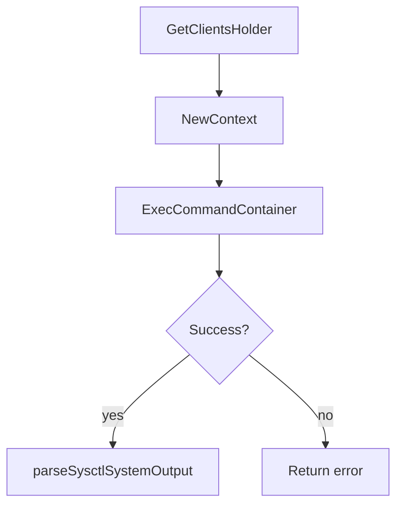
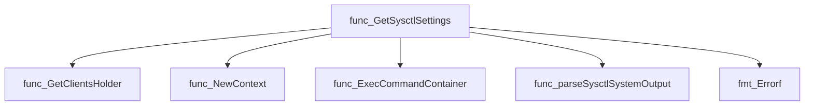
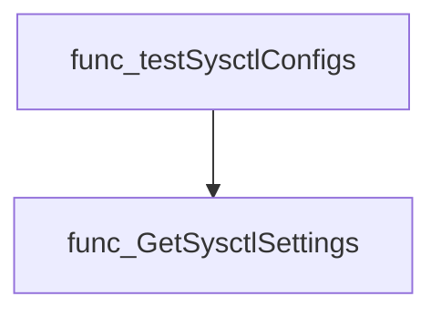
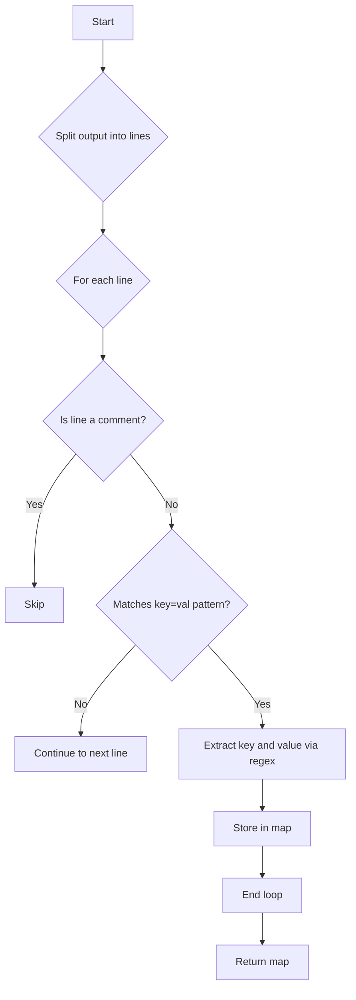
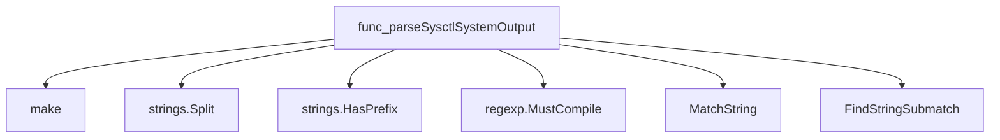
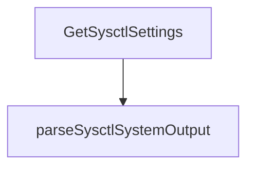

# Package sysctlconfig

**Path**: `tests/platform/sysctlconfig`

## Table of Contents

- [Overview](#overview)
- [Exported Functions](#exported-functions)
  - [GetSysctlSettings](#getsysctlsettings)
- [Local Functions](#local-functions)
  - [parseSysctlSystemOutput](#parsesysctlsystemoutput)

## Overview

The sysctlconfig package provides utilities for retrieving and parsing kernel sysctl settings from a Kubernetes node via a probe pod, enabling tests to verify system configuration.

### Key Features

- Executes `sysctl --system` inside a probe pod and returns the output as a map of key‑value pairs
- Parses multiline sysctl output while filtering comments and malformed lines
- Integrates with CertSuite’s client holder for pod communication

### Design Notes

- Assumes the test environment can run privileged pods to execute sysctl commands
- Relies on regex pattern matching; non‑matching lines are silently ignored
- Best practice: call GetSysctlSettings early in a platform test to capture baseline configuration

### Exported Functions Summary

| Name | Purpose |
|------|----------|
| [func GetSysctlSettings(env *provider.TestEnvironment, nodeName string) (map[string]string, error)](#getsysctlsettings) | Executes `sysctl --system` inside a probe pod to collect kernel sysctl settings for a specific node and returns them as a key‑value map. |

### Local Functions Summary

| Name | Purpose |
|------|----------|
| [func parseSysctlSystemOutput(string) map[string]string](#parsesysctlsystemoutput) | Parses the multiline string returned by `sysctl --system` and builds a key‑value map of sysctl settings. Lines that are comments or do not match the expected pattern are ignored. |

## Exported Functions

### GetSysctlSettings

**GetSysctlSettings** - Executes `sysctl --system` inside a probe pod to collect kernel sysctl settings for a specific node and returns them as a key‑value map.

#### 1) Signature (Go)

```go
func GetSysctlSettings(env *provider.TestEnvironment, nodeName string) (map[string]string, error)
```

#### 2) Summary Table

| Aspect | Details |
|--------|---------|
| **Purpose** | Executes `sysctl --system` inside a probe pod to collect kernel sysctl settings for a specific node and returns them as a key‑value map. |
| **Parameters** | `env *provider.TestEnvironment –` test environment containing probe pods.<br>`nodeName string –` name of the target node. |
| **Return value** | `<map[string]string> –` mapping from sysctl keys to their current values.<br>`error –` non‑nil if command execution fails or output parsing encounters an issue. |
| **Key dependencies** | • `clientsholder.GetClientsHolder()` – obtains Kubernetes client holder.<br>• `clientsholder.NewContext(...)` – creates exec context for the probe pod.<br>• `ExecCommandContainer(ctx, cmd)` – runs the command inside the container.<br>• `parseSysctlSystemOutput(outStr)` – parses raw sysctl output into a map.<br>• `fmt.Errorf` – formats error messages. |
| **Side effects** | No state mutation; performs I/O by executing a shell command inside a pod and reads its stdout/stderr. |
| **How it fits the package** | Provides core functionality for sysctl configuration checks, enabling tests to compare runtime settings against expected machine‑config values. |

#### 3) Internal workflow (Mermaid)



#### 4) Function dependencies (Mermaid)



#### 5) Functions calling `GetSysctlSettings` (Mermaid)



#### 6) Usage example (Go)

```go
// Minimal example invoking GetSysctlSettings
env := &provider.TestEnvironment{ /* initialized elsewhere */ }
nodeName := "worker-1"

settings, err := sysctlconfig.GetSysctlSettings(env, nodeName)
if err != nil {
    log.Fatalf("Failed to get sysctl settings: %v", err)
}

for k, v := range settings {
    fmt.Printf("%s = %s\n", k, v)
}
```

---

## Local Functions

### parseSysctlSystemOutput

**parseSysctlSystemOutput** - Parses the multiline string returned by `sysctl --system` and builds a key‑value map of sysctl settings. Lines that are comments or do not match the expected pattern are ignored.

Creates a map of sysctl keys to their values from the output of `sysctl --system`.

#### Signature (Go)

```go
func parseSysctlSystemOutput(string) map[string]string
```

#### Summary Table

| Aspect | Details |
|--------|---------|
| **Purpose** | Parses the multiline string returned by `sysctl --system` and builds a key‑value map of sysctl settings. Lines that are comments or do not match the expected pattern are ignored. |
| **Parameters** | `sysctlSystemOutput string –` raw output from `sysctl --system`. |
| **Return value** | `map[string]string` – mapping of sysctl keys to their corresponding values. |
| **Key dependencies** | • `make` (to create the map)  <br>• `strings.Split` and `strings.HasPrefix` (to iterate lines)  <br>• `regexp.MustCompile`, `MatchString`, `FindStringSubmatch` (regex parsing of key‑value pairs). |
| **Side effects** | None – purely functional. No I/O, no state mutation outside the returned map. |
| **How it fits the package** | Utility used by `GetSysctlSettings` to interpret command output and expose sysctl configuration as a Go data structure for further analysis or validation. |

#### Internal workflow (Mermaid)



#### Function dependencies (Mermaid)



#### Functions calling `parseSysctlSystemOutput` (Mermaid)



#### Usage example (Go)

```go
// Minimal example invoking parseSysctlSystemOutput
package main

import (
 "fmt"
)

func main() {
 raw := `
kernel.yama.ptrace_scope = 0
*some comment line*
net.ipv4.ip_forward = 1`
 settings := parseSysctlSystemOutput(raw)
 fmt.Println(settings) // map[net.ipv4.ip_forward:1 kernel.yama.ptrace_scope:0]
}
```

---
