# Package preflight

**Path**: `tests/preflight`

## Table of Contents

- [Overview](#overview)
- [Exported Functions](#exported-functions)
  - [LoadChecks](#loadchecks)
  - [ShouldRun](#shouldrun)
- [Local Functions](#local-functions)
  - [generatePreflightContainerCnfCertTest](#generatepreflightcontainercnfcerttest)
  - [generatePreflightOperatorCnfCertTest](#generatepreflightoperatorcnfcerttest)
  - [getUniqueTestEntriesFromContainerResults](#getuniquetestentriesfromcontainerresults)
  - [getUniqueTestEntriesFromOperatorResults](#getuniquetestentriesfromoperatorresults)
  - [labelsAllowTestRun](#labelsallowtestrun)
  - [testPreflightContainers](#testpreflightcontainers)
  - [testPreflightOperators](#testpreflightoperators)

## Overview

The preflight package orchestrates security scans for containers and operators in a test environment, converting the results into CNF‑certified checks that can be reported and evaluated.

### Key Features

- Runs container and operator pre‑flight diagnostics while caching image results to avoid duplicate work
- Aggregates unique test entries across all subjects and registers them as checks in a checks group
- Provides helper logic for determining if tests should run based on environment labels and configuration

### Design Notes

- Preflight execution is gated by ShouldRun, which inspects both environment state and label filters before any scans are performed
- Results are aggregated into maps keyed by test name to ensure each distinct test appears only once in the catalog
- Checks are added via a ChecksGroup; best practice is to create a new group per suite run so that results remain isolated

### Exported Functions Summary

| Name | Purpose |
|------|----------|
| [func LoadChecks()](#loadchecks) | Initiates the pre‑flight test suite, retrieves the test environment, creates a checks group for *Preflight*, runs container and operator tests, and logs progress. |
| [func ShouldRun(labelsExpr string) bool](#shouldrun) | Returns `true` if the current environment and labels permit running preflight checks. It prevents unnecessary execution when no relevant tags are present or required configuration is missing. |

### Local Functions Summary

| Name | Purpose |
|------|----------|
| [func generatePreflightContainerCnfCertTest(checksGroup *checksdb.ChecksGroup, testName, description, remediation string, containers []*provider.Container)](#generatepreflightcontainercnfcerttest) | Creates a catalog entry for a specific pre‑flight test and registers a check that evaluates the results of that test across all supplied container objects. |
| [func generatePreflightOperatorCnfCertTest(checksGroup *checksdb.ChecksGroup, testName, description, remediation string, operators []*provider.Operator) {}](#generatepreflightoperatorcnfcerttest) | Registers a CNF pre‑flight test into the results catalog and adds a corresponding check that evaluates each operator’s pre‑flight outcomes for that specific test. |
| [func getUniqueTestEntriesFromContainerResults(containers []*provider.Container) map[string]provider.PreflightTest](#getuniquetestentriesfromcontainerresults) | Builds a map keyed by test name containing the first encountered `PreflightTest` result for each unique test across all provided containers. |
| [func getUniqueTestEntriesFromOperatorResults(operators []*provider.Operator) map[string]provider.PreflightTest](#getuniquetestentriesfromoperatorresults) | Aggregates all pre‑flight test entries (`Passed`, `Failed`, `Errors`) from a slice of operators into a single map keyed by test name, ensuring each test appears only once. |
| [func(labelsFilter string, allowedLabels []string) bool](#labelsallowtestrun) | Checks whether any of the *allowed* labels appear within the supplied label filter string. If at least one match is found, it permits the test run. |
| [func testPreflightContainers(checksGroup *checksdb.ChecksGroup, env *provider.TestEnvironment)](#testpreflightcontainers) | Executes Preflight security scans for every container in the supplied `TestEnvironment`, caches image results to avoid duplicate work, logs progress, and converts each unique test result into a CNF‑certified check within the provided checks group. |
| [func testPreflightOperators(checksGroup *checksdb.ChecksGroup, env *provider.TestEnvironment)](#testpreflightoperators) | Executes pre‑flight diagnostics on every operator present in `env.Operators`, records the results into the checks group, and generates CNF‑certification tests for each unique pre‑flight test discovered. |

## Exported Functions

### LoadChecks

**LoadChecks** - Initiates the pre‑flight test suite, retrieves the test environment, creates a checks group for *Preflight*, runs container and operator tests, and logs progress.


#### Signature (Go)

```go
func LoadChecks()
```

#### Summary Table

| Aspect | Details |
|--------|---------|
| **Purpose** | Initiates the pre‑flight test suite, retrieves the test environment, creates a checks group for *Preflight*, runs container and operator tests, and logs progress. |
| **Parameters** | None |
| **Return value** | None (side effects only) |
| **Key dependencies** | `log.Debug`, `provider.GetTestEnvironment`, `checksdb.NewChecksGroup`, `WithBeforeEachFn`, `testPreflightContainers`, `provider.IsOCPCluster`, `log.Info`, `testPreflightOperators` |
| **Side effects** | Writes log entries, mutates global variable `env`, registers checks in the database via `NewChecksGroup`. |
| **How it fits the package** | Acts as the entry point for the pre‑flight test suite; called by higher‑level test orchestration (`LoadChecksDB`). |

#### Internal workflow (Mermaid)

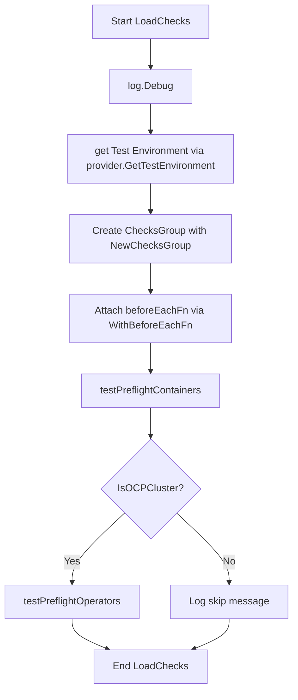

#### Function dependencies (Mermaid)

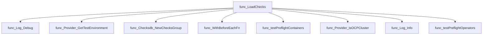

#### Functions calling `LoadChecks` (Mermaid)

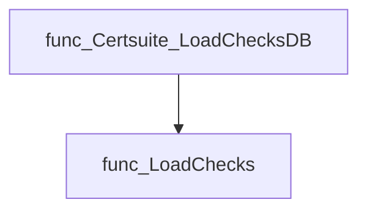

#### Usage example (Go)

```go
// Minimal example invoking LoadChecks
package main

import (
    "github.com/redhat-best-practices-for-k8s/certsuite/tests/preflight"
)

func main() {
    // Trigger the pre‑flight test suite
    preflight.LoadChecks()
}
```

---

### ShouldRun

**ShouldRun** - Returns `true` if the current environment and labels permit running preflight checks. It prevents unnecessary execution when no relevant tags are present or required configuration is missing.


Determines whether the preflight test suite should be executed for a given label expression.

---

#### Signature (Go)

```go
func ShouldRun(labelsExpr string) bool
```

---

#### Summary Table

| Aspect | Details |
|--------|---------|
| **Purpose** | Returns `true` if the current environment and labels permit running preflight checks. It prevents unnecessary execution when no relevant tags are present or required configuration is missing. |
| **Parameters** | `labelsExpr string –` label expression supplied by the caller (e.g., a comma‑separated list of test tags). |
| **Return value** | `bool –` `true` if preflight tests should run, otherwise `false`. |
| **Key dependencies** | • `provider.GetTestEnvironment()`<br>• `labelsAllowTestRun(labelsExpr, allowedLabels)`<br>• `configuration.GetTestParameters().PfltDockerconfig`<br>• `log.Warn(...)` |
| **Side effects** | Sets the global test environment flag `SkipPreflight` to `true` when Docker config is missing; logs a warning. No other mutable state is altered. |
| **How it fits the package** | Used by `certsuite.LoadChecksDB` to decide whether to load and run preflight checks, thereby optimizing startup time and avoiding unnecessary work. |

---

#### Internal workflow (Mermaid)

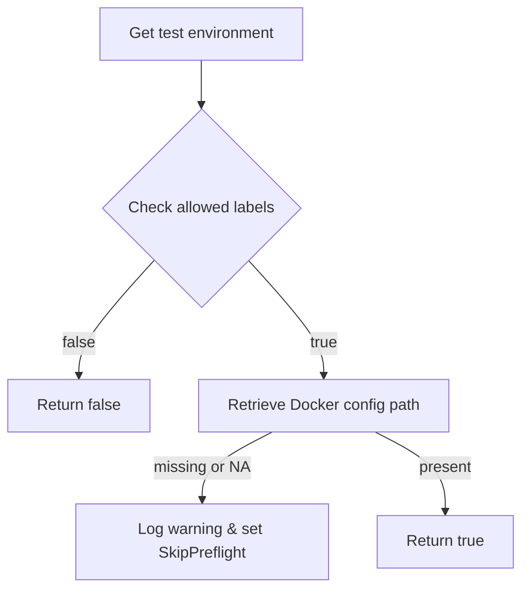

---

#### Function dependencies (Mermaid)

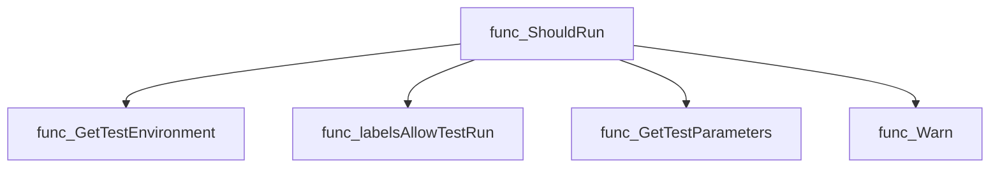

---

#### Functions calling `ShouldRun` (Mermaid)

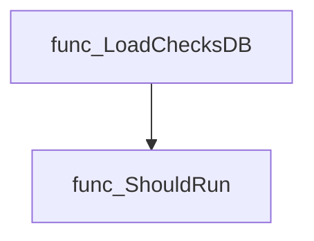

---

#### Usage example (Go)

```go
// Minimal example invoking ShouldRun
package main

import (
    "fmt"
    "github.com/redhat-best-practices-for-k8s/certsuite/tests/preflight"
)

func main() {
    labels := "preflight,security" // example label expression
    if preflight.ShouldRun(labels) {
        fmt.Println("Preflight checks will run.")
    } else {
        fmt.Println("Preflight checks skipped.")
    }
}
```

---

---

## Local Functions

### generatePreflightContainerCnfCertTest

**generatePreflightContainerCnfCertTest** - Creates a catalog entry for a specific pre‑flight test and registers a check that evaluates the results of that test across all supplied container objects.


#### Signature (Go)

```go
func generatePreflightContainerCnfCertTest(checksGroup *checksdb.ChecksGroup, testName, description, remediation string, containers []*provider.Container) 
```

#### Summary Table

| Aspect | Details |
|--------|---------|
| **Purpose** | Creates a catalog entry for a specific pre‑flight test and registers a check that evaluates the results of that test across all supplied container objects. |
| **Parameters** | `checksGroup *checksdb.ChecksGroup` – group to which the check will be added.<br>`testName string` – name of the pre‑flight test.<br>`description string` – human readable description.<br>`remediation string` – suggested remediation action.<br>`containers []*provider.Container` – list of containers whose pre‑flight results are evaluated. |
| **Return value** | None (void). |
| **Key dependencies** | `identifiers.AddCatalogEntry`, `identifiers.GetTestIDAndLabels`, `testhelper.GetNoContainersUnderTestSkipFn`, `testhelper.NewContainerReportObject`, `fmt.Sprintf`, `check.SetResult` and several logging helpers. |
| **Side effects** | Modifies the supplied `checksGroup` by adding a new check; writes to internal catalog maps via `AddCatalogEntry`; produces log output for each container processed. No external I/O. |
| **How it fits the package** | Called from `testPreflightContainers` to translate per‑container pre‑flight results into the generic test framework used by CertSuite. |

#### Internal workflow (Mermaid)

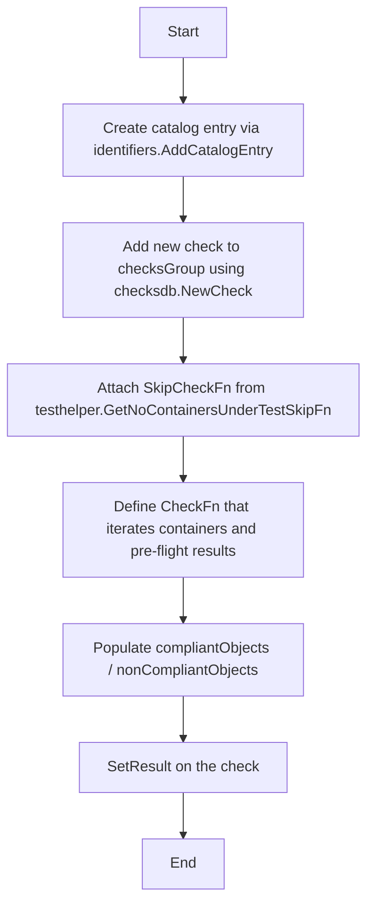

#### Function dependencies (Mermaid)

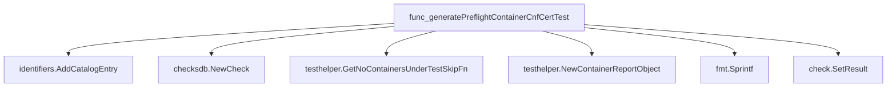

#### Functions calling `generatePreflightContainerCnfCertTest` (Mermaid)

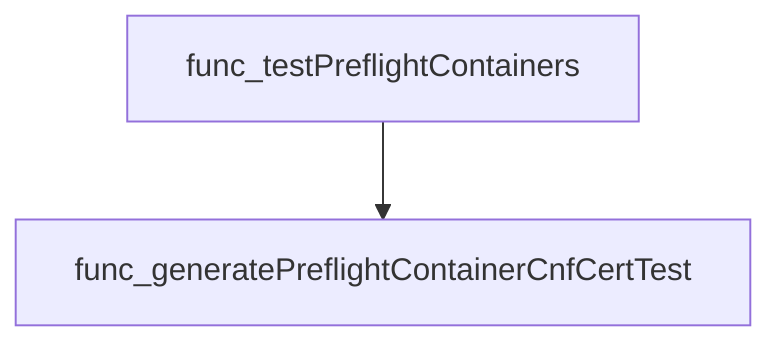

#### Usage example (Go)

```go
// Minimal example invoking generatePreflightContainerCnfCertTest
package main

import (
    "github.com/redhat-best-practices-for-k8s/certsuite/pkg/checksdb"
    "github.com/redhat-best-practices-for-k8s/certsuite/tests/preflight"
    // assume provider.Container is defined elsewhere
)

func main() {
    checksGroup := &checksdb.ChecksGroup{}
    containers := []*provider.Container{ /* populated container objects */ }

    preflight.generatePreflightContainerCnfCertTest(
        checksGroup,
        "ExampleTest",
        "Checks that the image contains a non‑root user",
        "Run `preflight run --tests=container.user` to verify",
        containers,
    )
}
```

---

### generatePreflightOperatorCnfCertTest

**generatePreflightOperatorCnfCertTest** - Registers a CNF pre‑flight test into the results catalog and adds a corresponding check that evaluates each operator’s pre‑flight outcomes for that specific test.


#### Signature (Go)
```go
func generatePreflightOperatorCnfCertTest(checksGroup *checksdb.ChecksGroup, testName, description, remediation string, operators []*provider.Operator) {}
```

#### Summary Table
| Aspect | Details |
|--------|---------|
| **Purpose** | Registers a CNF pre‑flight test into the results catalog and adds a corresponding check that evaluates each operator’s pre‑flight outcomes for that specific test. |
| **Parameters** | `checksGroup *checksdb.ChecksGroup` – container of checks.<br>`testName string` – unique identifier of the test.<br>`description string` – human‑readable description.<br>`remediation string` – suggested fix.<br>`operators []*provider.Operator` – list of operators to evaluate. |
| **Return value** | none (void) |
| **Key dependencies** | • `identifiers.AddCatalogEntry`<br>• `checksdb.NewCheck` & its builder methods (`WithSkipCheckFn`, `WithCheckFn`) <br>• `identifiers.GetTestIDAndLabels`<br>• `testhelper.GetNoOperatorsSkipFn`<br>• Logging helpers (`LogInfo`, `LogError`) <br>• `testhelper.NewOperatorReportObject`<br>• `fmt.Sprintf`<br>• `Check.SetResult` |
| **Side effects** | Adds a catalog entry, creates and registers a new check in `checksGroup`, logs information or errors during evaluation, and records compliance results. |
| **How it fits the package** | Implements the core logic that translates operator pre‑flight outcomes into structured test cases used by the CNF testing framework. |

#### Internal workflow (Mermaid)
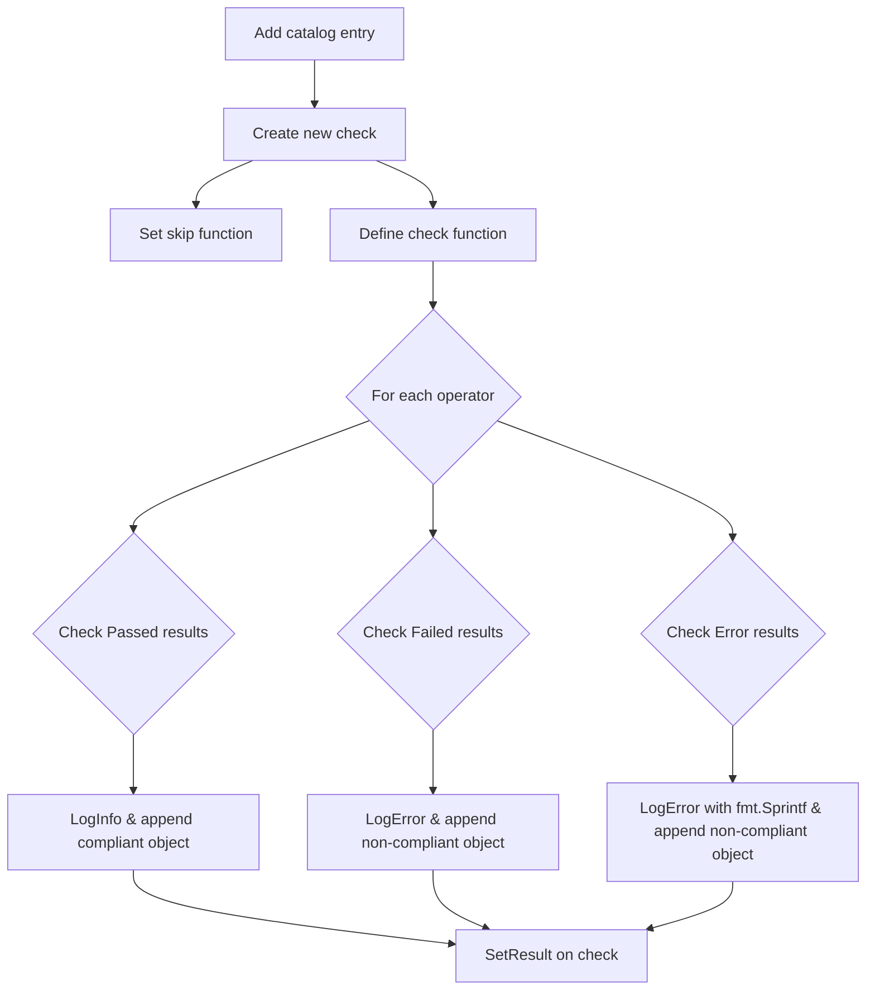

#### Function dependencies (Mermaid)
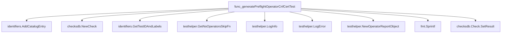

#### Functions calling `generatePreflightOperatorCnfCertTest` (Mermaid)
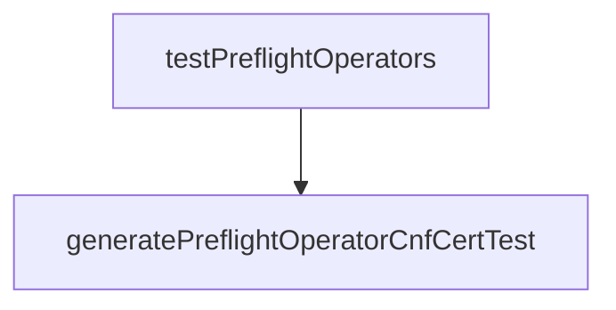

#### Usage example (Go)
```go
// Minimal example invoking generatePreflightOperatorCnfCertTest
package main

import (
	"github.com/redhat-best-practices-for-k8s/certsuite/pkg/checksdb"
	"github.com/redhat-best-practices-for-k8s/certsuite/tests/preflight"
)

func main() {
	var checksGroup *checksdb.ChecksGroup // assume initialized elsewhere
	testName := "Operator-ConfigValidation"
	description := "Checks operator configuration validity."
	remediation := "Verify operator config files."

	// Example operators slice (normally obtained from the environment)
	var operators []*provider.Operator

	preflight.generatePreflightOperatorCnfCertTest(checksGroup, testName, description, remediation, operators)
}
```

---

### getUniqueTestEntriesFromContainerResults

**getUniqueTestEntriesFromContainerResults** - Builds a map keyed by test name containing the first encountered `PreflightTest` result for each unique test across all provided containers.


#### Signature (Go)
```go
func getUniqueTestEntriesFromContainerResults(containers []*provider.Container) map[string]provider.PreflightTest
```

#### Summary Table
| Aspect | Details |
|--------|---------|
| **Purpose** | Builds a map keyed by test name containing the first encountered `PreflightTest` result for each unique test across all provided containers. |
| **Parameters** | *containers* `[]*provider.Container` – list of container objects to inspect. |
| **Return value** | `map[string]provider.PreflightTest` – a lookup of test names to their corresponding `PreflightTest` entry (passed, failed or error). |
| **Key dependencies** | • `make(map[string]provider.PreflightTest)`<br>• Iteration over `cut.PreflightResults.Passed`, `.Failed`, and `.Errors`. |
| **Side effects** | None – pure function; no mutation of input slices or external state. |
| **How it fits the package** | Used by `testPreflightContainers` to deduplicate test entries when generating container‑based pre‑flight certificates, ensuring each distinct test is processed once even if multiple containers share the same image. |

#### Internal workflow (Mermaid)
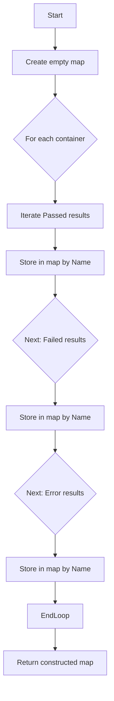

#### Function dependencies (Mermaid)
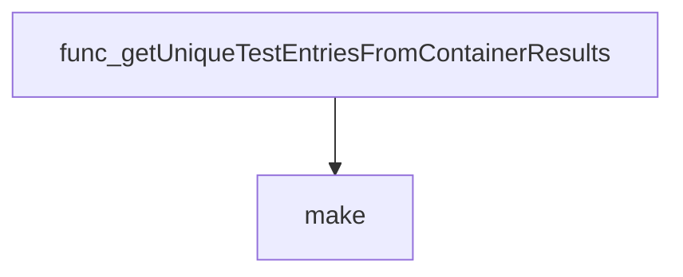

#### Functions calling `getUniqueTestEntriesFromContainerResults` (Mermaid)
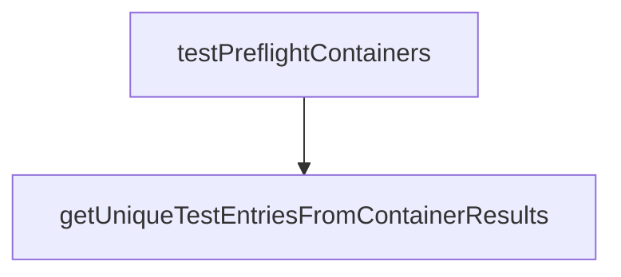

#### Usage example (Go)
```go
// Minimal example invoking getUniqueTestEntriesFromContainerResults
import (
	"github.com/redhat-best-practices-for-k8s/certsuite/tests/preflight"
)

func main() {
	var containers []*provider.Container // assume populated elsewhere

	testMap := preflight.getUniqueTestEntriesFromContainerResults(containers)
	for name, test := range testMap {
		fmt.Printf("Test %q: %+v\n", name, test)
	}
}
```

---

### getUniqueTestEntriesFromOperatorResults

**getUniqueTestEntriesFromOperatorResults** - Aggregates all pre‑flight test entries (`Passed`, `Failed`, `Errors`) from a slice of operators into a single map keyed by test name, ensuring each test appears only once.


#### Signature (Go)
```go
func getUniqueTestEntriesFromOperatorResults(operators []*provider.Operator) map[string]provider.PreflightTest
```

#### Summary Table
| Aspect | Details |
|--------|---------|
| **Purpose** | Aggregates all pre‑flight test entries (`Passed`, `Failed`, `Errors`) from a slice of operators into a single map keyed by test name, ensuring each test appears only once. |
| **Parameters** | `operators []*provider.Operator` – list of operator instances whose pre‑flight results are to be examined. |
| **Return value** | `map[string]provider.PreflightTest` – mapping from test names to their most recent `PreflightTest` entry (from any operator). |
| **Key dependencies** | • `make(map[string]provider.PreflightTest)`<br>• Iteration over `op.PreflightResults.Passed`, `.Failed`, `.Errors`. |
| **Side effects** | None; purely functional. |
| **How it fits the package** | Used by higher‑level test orchestration to collate operator‑specific pre‑flight results before generating consolidated certificates or logs. |

#### Internal workflow (Mermaid)
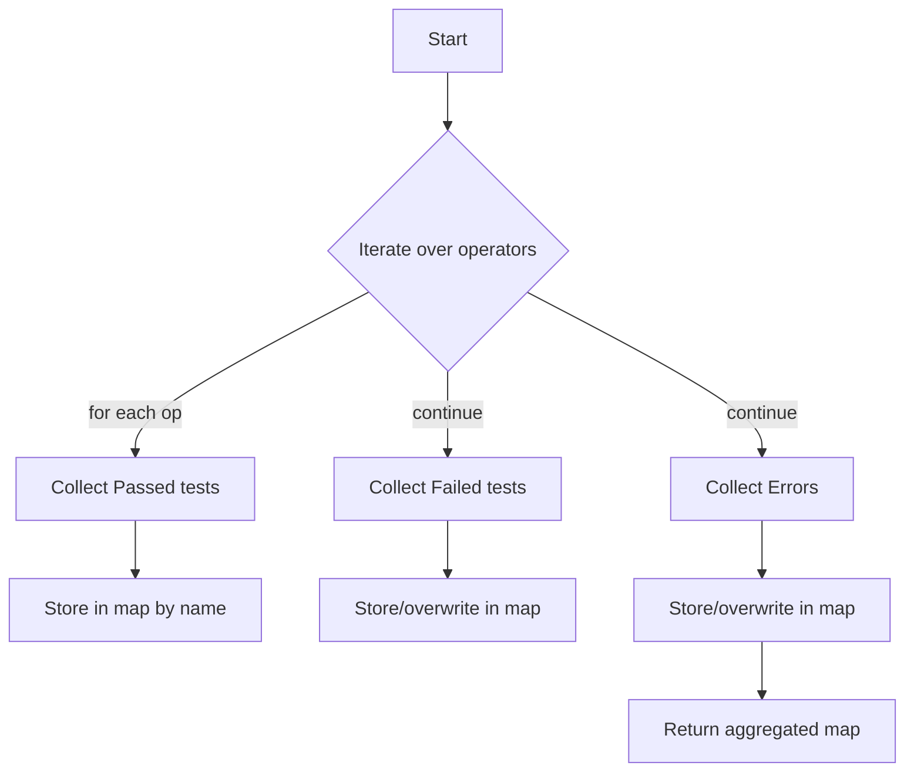

#### Function dependencies (Mermaid)
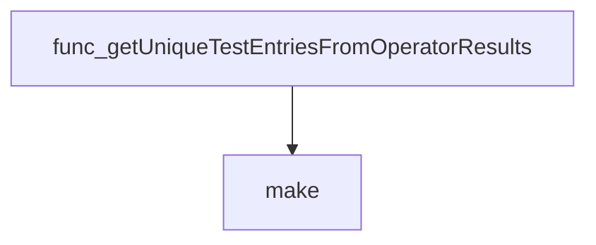

#### Functions calling `getUniqueTestEntriesFromOperatorResults` (Mermaid)
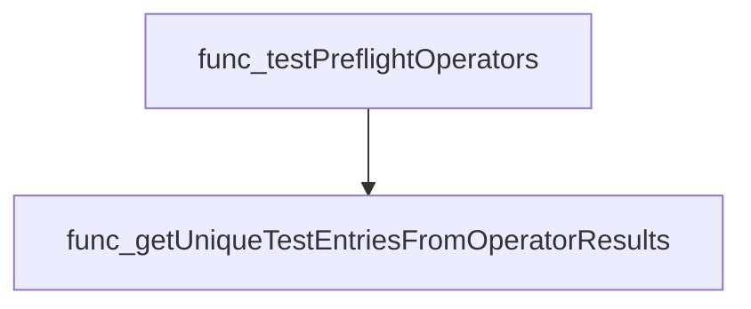

#### Usage example (Go)
```go
// Minimal example invoking getUniqueTestEntriesFromOperatorResults
operators := []*provider.Operator{op1, op2, op3}
uniqueTests := getUniqueTestEntriesFromOperatorResults(operators)

for name, test := range uniqueTests {
    fmt.Printf("Test %s: %v\n", name, test)
}
```

---

### labelsAllowTestRun

**labelsAllowTestRun** - Checks whether any of the *allowed* labels appear within the supplied label filter string. If at least one match is found, it permits the test run.


#### Signature (Go)
```go
func(labelsFilter string, allowedLabels []string) bool
```

#### Summary Table
| Aspect | Details |
|--------|---------|
| **Purpose** | Checks whether any of the *allowed* labels appear within the supplied label filter string. If at least one match is found, it permits the test run. |
| **Parameters** | `labelsFilter` – a comma‑separated or space‑separated string representing labels applied to a test.<br>`allowedLabels` – slice of strings containing labels that grant permission to execute the suite. |
| **Return value** | `true` if any allowed label is present in `labelsFilter`; otherwise `false`. |
| **Key dependencies** | • `strings.Contains` from the standard library.<br>• No external packages are imported beyond `strings`. |
| **Side effects** | None – purely functional; no state mutation, I/O, or concurrency. |
| **How it fits the package** | Used by the internal `ShouldRun` helper to gate execution of preflight tests based on environmental labeling conventions. |

#### Internal workflow (Mermaid)
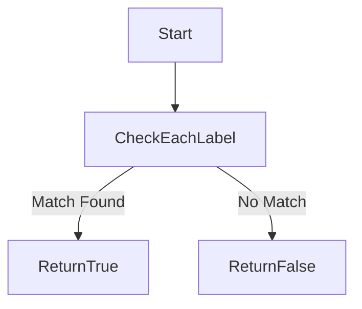

#### Function dependencies (Mermaid)
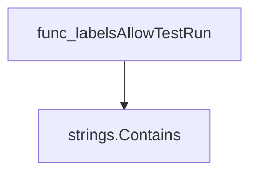

#### Functions calling `labelsAllowTestRun` (Mermaid)
```mermaid
graph TD
  func_ShouldRun --> func_labelsAllowTestRun
```

#### Usage example (Go)
```go
// Minimal example invoking labelsAllowTestRun
package main

import (
	"fmt"
)

func main() {
	filter := "preflight,performance"
	allowed := []string{"preflight", "security"}

	if labelsAllowTestRun(filter, allowed) {
		fmt.Println("Test run permitted.")
	} else {
		fmt.Println("Test run denied.")
	}
}

// Output:
// Test run permitted.
```

---

### testPreflightContainers

**testPreflightContainers** - Executes Preflight security scans for every container in the supplied `TestEnvironment`, caches image results to avoid duplicate work, logs progress, and converts each unique test result into a CNF‑certified check within the provided checks group.


#### 1) Signature (Go)

```go
func testPreflightContainers(checksGroup *checksdb.ChecksGroup, env *provider.TestEnvironment)
```

#### 2) Summary Table

| Aspect | Details |
|--------|---------|
| **Purpose** | Executes Preflight security scans for every container in the supplied `TestEnvironment`, caches image results to avoid duplicate work, logs progress, and converts each unique test result into a CNF‑certified check within the provided checks group. |
| **Parameters** | *`checksGroup`* *(*`*checksdb.ChecksGroup`*)* – Target collection for generated checks.<br>*`env`* *(*`*provider.TestEnvironment`*)* – Environment containing containers and related metadata. |
| **Return value** | None (void). The function mutates `checksGroup` and logs status. |
| **Key dependencies** | • `cut.SetPreflightResults(preflightImageCache, env)`<br>• `log.Fatal`, `log.Info`<br>• `getUniqueTestEntriesFromContainerResults(env.Containers)`<br>• `generatePreflightContainerCnfCertTest(checksGroup, testName, description, remediation, env.Containers)` |
| **Side effects** | • Populates `preflightImageCache` per image.<br>• Calls `SetPreflightResults` on each container, which may perform network I/O and modify the container’s result state.<br>• Emits fatal logs on error and info logs for progress.<br>• Adds checks to `checksGroup`. |
| **How it fits the package** | This helper is invoked by the preflight test loader (`LoadChecks`) to bridge raw Preflight results with Cert‑Suite's CNF certification framework. It centralizes result collection, caching, and transformation logic for container‑level tests. |

#### 3) Internal workflow (Mermaid)

```mermaid
flowchart TD
    Start --> Cache["Create empty image cache"]
    Cache --> ForEachContainer{"For each container in env.Containers"}
    ForEachContainer --> SetResults["SetPreflightResults(cache, env)"]
    SetResults -->|"Error?"| Fail["log.Fatal & exit"]
    SetResults --> Continue["Proceed to next container"]
    Continue --> EndLoop{{End of loop}}
    EndLoop --> LogInfo["log.Info(Completed running Preflight container tests)"]
    LogInfo --> ForEachTest{"For each unique test entry"}
    ForEachTest --> GenerateTest["generatePreflightContainerCnfCertTest(checksGroup, …)"]
    GenerateTest --> NextTest
    NextTest --> End{{End of function}}
```

#### 4) Function dependencies (Mermaid)

```mermaid
graph TD
  func_testPreflightContainers --> func_SetPreflightResults
  func_testPreflightContainers --> func_log.Fatal
  func_testPreflightContainers --> func_log.Info
  func_testPreflightContainers --> func_getUniqueTestEntriesFromContainerResults
  func_testPreflightContainers --> func_generatePreflightContainerCnfCertTest
```

#### 5) Functions calling `testPreflightContainers` (Mermaid)

```mermaid
graph TD
  func_LoadChecks --> func_testPreflightContainers
```

#### 6) Usage example (Go)

```go
// Minimal example invoking testPreflightContainers
package main

import (
    "github.com/redhat-best-practices-for-k8s/certsuite/tests/preflight"
    "github.com/redhat-best-practices-for-k8s/certsuite/internal/checksdb"
    "github.com/redhat-best-practices-for-k8s/certsuite/internal/provider"
)

func main() {
    // Assume env has been populated elsewhere
    var env provider.TestEnvironment

    checksGroup := checksdb.NewChecksGroup("preflight")
    preflight.testPreflightContainers(checksGroup, &env)

    // Now checksGroup contains CNF‑certified tests derived from Preflight results
}
```

---

### testPreflightOperators

**testPreflightOperators** - Executes pre‑flight diagnostics on every operator present in `env.Operators`, records the results into the checks group, and generates CNF‑certification tests for each unique pre‑flight test discovered.


#### Signature (Go)

```go
func testPreflightOperators(checksGroup *checksdb.ChecksGroup, env *provider.TestEnvironment)
```

#### Summary Table

| Aspect | Details |
|--------|---------|
| **Purpose** | Executes pre‑flight diagnostics on every operator present in `env.Operators`, records the results into the checks group, and generates CNF‑certification tests for each unique pre‑flight test discovered. |
| **Parameters** | `checksGroup *checksdb.ChecksGroup` – container where check definitions are stored.<br>`env *provider.TestEnvironment` – runtime information including operator list. |
| **Return value** | None (void). Errors during pre‑flight execution terminate the process via a fatal log. |
| **Key dependencies** | • `op.SetPreflightResults(env)`<br>• `log.Fatal`, `log.Info` from internal/log<br>• `getUniqueTestEntriesFromOperatorResults`<br>• `generatePreflightOperatorCnfCertTest` |
| **Side effects** | • Mutates each operator’s pre‑flight result state.<br>• Emits log messages (info/fatal).<br>• Adds new checks to `checksGroup`. |
| **How it fits the package** | This function is called by `LoadChecks()` when an OpenShift cluster is detected. It bridges raw operator diagnostics with the CNF certification test framework. |

#### Internal workflow

```mermaid
flowchart TD
  A["Iterate over env.Operators"] --> B["op.SetPreflightResults(env)"]
  B --> C{"err?"}
  C -- yes --> D["log.Fatal"]
  C -- no --> E["continue"]
  E --> F["Collect unique test entries"]
  F --> G["For each entry: generatePreflightOperatorCnfCertTest"]
```

#### Function dependencies

```mermaid
graph TD
  func_testPreflightOperators --> func_SetPreflightResults
  func_testPreflightOperators --> func_log.Fatal
  func_testPreflightOperators --> func_log.Info
  func_testPreflightOperators --> func_getUniqueTestEntriesFromOperatorResults
  func_testPreflightOperators --> func_generatePreflightOperatorCnfCertTest
```

#### Functions calling `testPreflightOperators`

```mermaid
graph TD
  func_LoadChecks --> func_testPreflightOperators
```

#### Usage example (Go)

```go
// Minimal example invoking testPreflightOperators
package main

import (
	"github.com/redhat-best-practices-for-k8s/certsuite/tests/preflight"
	"github.com/redhat-best-practices-for-k8s/certsuite/internal/checksdb"
	"github.com/redhat-best-practices-for-k8s/certsuite/internal/provider"
)

func main() {
	checksGroup := checksdb.NewChecksGroup("preflight")
	env := provider.GetTestEnvironment()
	preflight.testPreflightOperators(checksGroup, env)
}
```

---

