# Package webserver

**Path**: `webserver`

## Table of Contents

- [Overview](#overview)
- [Structs](#structs)
  - [Entry](#entry)
  - [RequestedData](#requesteddata)
  - [ResponseData](#responsedata)
- [Exported Functions](#exported-functions)
  - [CreatePrintableCatalogFromIdentifiers](#createprintablecatalogfromidentifiers)
  - [GetSuitesFromIdentifiers](#getsuitesfromidentifiers)
  - [StartServer](#startserver)
- [Local Functions](#local-functions)
  - [installReqHandlers](#installreqhandlers)
  - [logStreamHandler](#logstreamhandler)
  - [outputTestCases](#outputtestcases)
  - [runHandler](#runhandler)
  - [toJSONString](#tojsonstring)
  - [updateTnf](#updatetnf)

## Overview

The webserver package provides an HTTP server that serves static client assets and exposes endpoints to submit test runs, stream logs via WebSocket, and deliver a catalog of test cases for the certsuite tool.

### Key Features

- Serves embedded HTML/JS/CSS files and supports dynamic JSON responses for test case data
- Handles multipart form uploads with kubeconfig and configuration overrides, then triggers CERTSUITE execution
- Streams log output in real‑time over WebSockets converting ANSI to HTML

### Design Notes

- Embedded assets are compiled into the binary using Go's embed package, simplifying distribution
- Log streaming upgrades HTTP connections via gorilla/websocket; each line is processed before sending
- Configuration updates combine YAML defaults with user overrides from RequestedData; errors abort execution

### Structs Summary

| Name | Purpose |
|------|----------|
| [**Entry**](#entry) | One-line purpose |
| [**RequestedData**](#requesteddata) | Struct definition |
| [**ResponseData**](#responsedata) | One-line purpose |

### Exported Functions Summary

| Name | Purpose |
|------|----------|
| [func CreatePrintableCatalogFromIdentifiers(keys []claim.Identifier) map[string][]Entry](#createprintablecatalogfromidentifiers) | Organises identifiers by their associated test suite into a printable structure. |
| [func GetSuitesFromIdentifiers(keys []claim.Identifier) []string](#getsuitesfromidentifiers) | Collects all suite names referenced by a slice of `claim.Identifier` values and returns them as a de‑duplicated list. |
| [func StartServer(outputFolder string)](#startserver) | Starts an HTTP server on port 8084 that serves static content and exposes endpoints to run tests, stream logs, and provide test results. The server’s context is enriched with the output folder path for downstream handlers. |

### Local Functions Summary

| Name | Purpose |
|------|----------|
| [func installReqHandlers() ()](#installreqhandlers) | Binds several HTTP endpoints (`/`, `/submit.js`, `/logs.js`, etc.) to handler functions that return embedded static content or dynamic data. |
| [func(logStreamHandler)(w http.ResponseWriter, r *http.Request)](#logstreamhandler) | Upgrades an HTTP connection to a WebSocket and streams the contents of a log file in real‑time to the client. Each line is converted from ANSI escape codes to HTML before transmission. |
| [func outputTestCases() (outString string)](#outputtestcases) | Builds a string representation of the test case catalog, formatted as a JavaScript object literal. The string is later written to an HTTP response for client‑side consumption. |
| [func runHandler(w http.ResponseWriter, r *http.Request)](#runhandler) | Processes a multipart/form‑data request containing a kubeconfig file and JSON options, updates the CERTSUITE configuration, runs the test suite, and returns a JSON status message. |
| [func(toJSONString data map[string]string) string](#tojsonstring) | Produces an indented JSON representation of a `map[string]string`. Useful for embedding classification details in output. |
| [func updateTnf(tnfConfig []byte, data *RequestedData) []byte](#updatetnf) | Reads a YAML configuration, applies user‑supplied overrides from `*RequestedData`, and returns the updated YAML. |

## Structs

### Entry


Represents a single test entry in a printable catalog, containing the test name and its identifying information.

#### Fields
| Field      | Type              | Description |
|------------|-------------------|-------------|
| `testName` | `string`          | The human‑readable name of the test. |
| `identifier` | `claim.Identifier` | Metadata that uniquely identifies the test, typically including a URL and version information. |

#### Purpose
The `Entry` struct is used to collect and organize tests by suite when generating printable catalogs. Each entry holds the test’s display name (`testName`) along with its underlying identifier (`identifier`) so that downstream processes can reference or link to the specific test definition.

#### Related functions (if any)
| Function | Purpose |
|----------|---------|
| `CreatePrintableCatalogFromIdentifiers` | Builds a map of suite names to slices of `Entry`, grouping tests by their `Suite` field extracted from each `claim.Identifier`. |

---

---

### RequestedData

<!-- DEBUG: Struct RequestedData exists in bundle but ParsedOK=false, Fields=0 -->
**Purpose**: 

**Fields**:

| Field | Type | Description |
|-------|------|--------------|
| `ManagedDeployments` | `[]string` | Field documentation |
| `SkipScalingTestStatefulsetsname` | `[]string` | Field documentation |
| `ValidProtocolNames` | `[]string` | Field documentation |
| `PartnerName` | `[]string` | Field documentation |
| `ConnectAPIKey` | `[]string` | Field documentation |
| `ConnectProjectID` | `[]string` | Field documentation |
| `ConnectAPIProxyPort` | `[]string` | Field documentation |
| `TargetNameSpaces` | `[]string` | Field documentation |
| `PodsUnderTestLabels` | `[]string` | Field documentation |
| `SkipScalingTestDeploymentsname` | `[]string` | Field documentation |
| `SkipHelmChartList` | `[]string` | Field documentation |
| `CollectorAppEndPoint` | `[]string` | Field documentation |
| `ConnectAPIBaseURL` | `[]string` | Field documentation |
| `OperatorsUnderTestLabels` | `[]string` | Field documentation |
| `TargetCrdFiltersnameSuffix` | `[]string` | Field documentation |
| `TargetCrdFiltersscalable` | `[]string` | Field documentation |
| `ConnectAPIProxyURL` | `[]string` | Field documentation |
| `ManagedStatefulsets` | `[]string` | Field documentation |
| `SkipScalingTestDeploymentsnamespace` | `[]string` | Field documentation |
| `SkipScalingTestStatefulsetsnamespace` | `[]string` | Field documentation |
| `AcceptedKernelTaints` | `[]string` | Field documentation |
| `Servicesignorelist` | `[]string` | Field documentation |
| `ProbeDaemonSetNamespace` | `[]string` | Field documentation |
| `ExecutedBy` | `[]string` | Field documentation |
| `CollectorAppPassword` | `[]string` | Field documentation |
| `SelectedOptions` | `[]string` | Field documentation |

---

### ResponseData


A lightweight container for sending textual responses from the web server.

#### Fields
| Field | Type   | Description |
|-------|--------|-------------|
| `Message` | `string` | Human‑readable message returned in JSON format (`"message"` key). |

#### Purpose
`ResponseData` encapsulates a simple string payload that the web server marshals into JSON for HTTP responses. It is used to convey status or error messages back to clients.

#### Related functions (none)
| Function | Purpose |
|----------|---------|
| — | — |

---

## Exported Functions

### CreatePrintableCatalogFromIdentifiers

**CreatePrintableCatalogFromIdentifiers** - Organises identifiers by their associated test suite into a printable structure.


#### Signature (Go)
```go
func CreatePrintableCatalogFromIdentifiers(keys []claim.Identifier) map[string][]Entry
```

#### Summary Table
| Aspect | Details |
|--------|---------|
| **Purpose** | Organises identifiers by their associated test suite into a printable structure. |
| **Parameters** | `keys` – slice of `claim.Identifier`; each identifier contains an ID and a suite name. |
| **Return value** | A map where the key is a suite name (`string`) and the value is a slice of `Entry` objects representing individual tests. |
| **Key dependencies** | • `make` to initialise the map.<br>• `append` to accumulate entries per suite. |
| **Side effects** | None – purely functional; no global state or I/O. |
| **How it fits the package** | Used by `outputTestCases` to generate a human‑readable classification string from the catalog of test identifiers. |

#### Internal workflow (Mermaid)
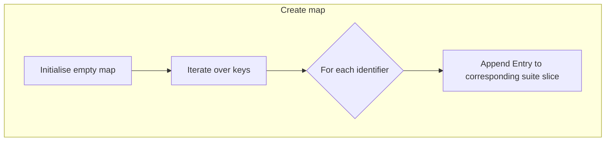

#### Function dependencies (Mermaid)
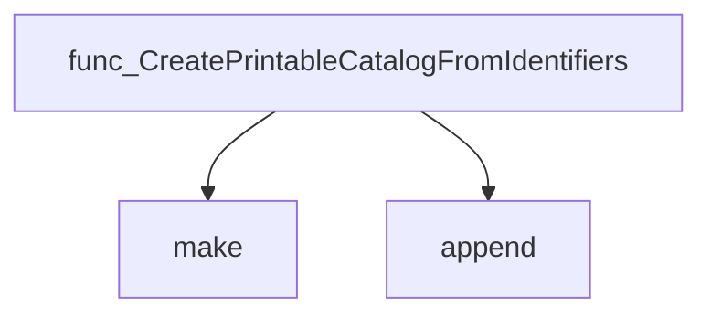

#### Functions calling `CreatePrintableCatalogFromIdentifiers` (Mermaid)
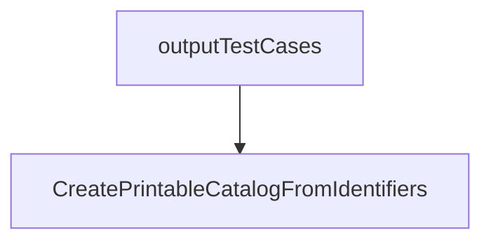

#### Usage example (Go)
```go
// Minimal example invoking CreatePrintableCatalogFromIdentifiers
package main

import (
    "fmt"
    "github.com/redhat-best-practices-for-k8s/certsuite/webserver"
)

func main() {
    // Example identifiers – in practice these would come from the catalog
    ids := []claim.Identifier{
        {Id: "test1", Suite: "suiteA"},
        {Id: "test2", Suite: "suiteB"},
        {Id: "test3", Suite: "suiteA"},
    }

    // Build printable map
    catalog := webserver.CreatePrintableCatalogFromIdentifiers(ids)

    fmt.Printf("%+v\n", catalog)
}
```

---

### GetSuitesFromIdentifiers

**GetSuitesFromIdentifiers** - Collects all suite names referenced by a slice of `claim.Identifier` values and returns them as a de‑duplicated list.


#### Signature (Go)

```go
func GetSuitesFromIdentifiers(keys []claim.Identifier) []string
```

#### Summary Table

| Aspect | Details |
|--------|---------|
| **Purpose** | Collects all suite names referenced by a slice of `claim.Identifier` values and returns them as a de‑duplicated list. |
| **Parameters** | `keys []claim.Identifier –` identifiers whose `Suite` fields are to be extracted. |
| **Return value** | `[]string –` unique suite names in the order first encountered. |
| **Key dependencies** | • `append` (built‑in) <br>• `arrayhelper.Unique` from `github.com/redhat-best-practices-for-k8s/certsuite/pkg/arrayhelper` |
| **Side effects** | None – pure function; does not modify inputs or global state. |
| **How it fits the package** | Used by the HTTP handler to build a printable catalog of test cases grouped by suite name. |

#### Internal workflow (Mermaid)

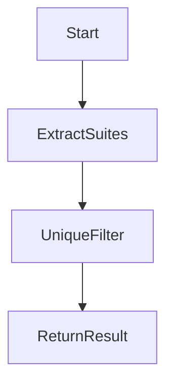

- **Start**: function receives `keys`.
- **ExtractSuites**: iterate over each identifier, append its `Suite` field to a slice.
- **UniqueFilter**: call `arrayhelper.Unique` to remove duplicates while preserving order.
- **ReturnResult**: return the de‑duplicated slice.

#### Function dependencies (Mermaid)

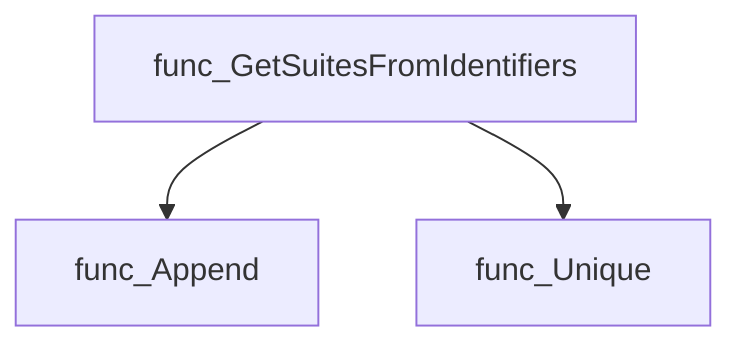

#### Functions calling `GetSuitesFromIdentifiers` (Mermaid)

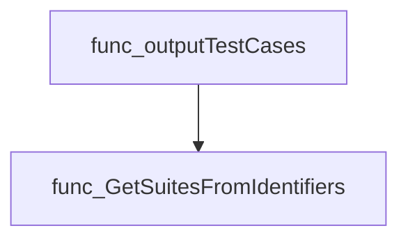

#### Usage example (Go)

```go
// Minimal example invoking GetSuitesFromIdentifiers
import (
    "github.com/redhat-best-practices-for-k8s/certsuite/pkg/claim"
    "github.com/redhat-best-practices-for-k8s/certsuite/webserver"
)

func main() {
    ids := []claim.Identifier{
        {Id: "1", Suite: "alpha"},
        {Id: "2", Suite: "beta"},
        {Id: "3", Suite: "alpha"},
    }

    suites := webserver.GetSuitesFromIdentifiers(ids)
    // suites == []string{"alpha", "beta"}
}
```

---

### StartServer

**StartServer** - Starts an HTTP server on port 8084 that serves static content and exposes endpoints to run tests, stream logs, and provide test results. The server’s context is enriched with the output folder path for downstream handlers.


#### 1) Signature (Go)

```go
func StartServer(outputFolder string)
```

#### 2) Summary Table

| Aspect | Details |
|--------|---------|
| **Purpose** | Starts an HTTP server on port 8084 that serves static content and exposes endpoints to run tests, stream logs, and provide test results. The server’s context is enriched with the output folder path for downstream handlers. |
| **Parameters** | `outputFolder string` – Directory where test artifacts are written; stored in request‑context under key `outputFolderCtxKey`. |
| **Return value** | None (the function blocks until the server exits). |
| **Key dependencies** | • `net/http.HandleFunc` for routing.<br>• `http.Server.ListenAndServe` to bind and serve.<br>• `context.WithValue` to inject output folder into base context.<br>• `installReqHandlers()` – registers static file handlers.<br>• `runHandler` – endpoint `/runFunction`. |
| **Side effects** | • Starts a blocking HTTP server.<br>• Logs startup message via `log.Info`.<br>• Panics if the server fails to start. |
| **How it fits the package** | Serves as the entry point for web‑server mode, enabling external tools or browsers to trigger test runs and view results through a browser UI. |

#### 3) Internal workflow (Mermaid)

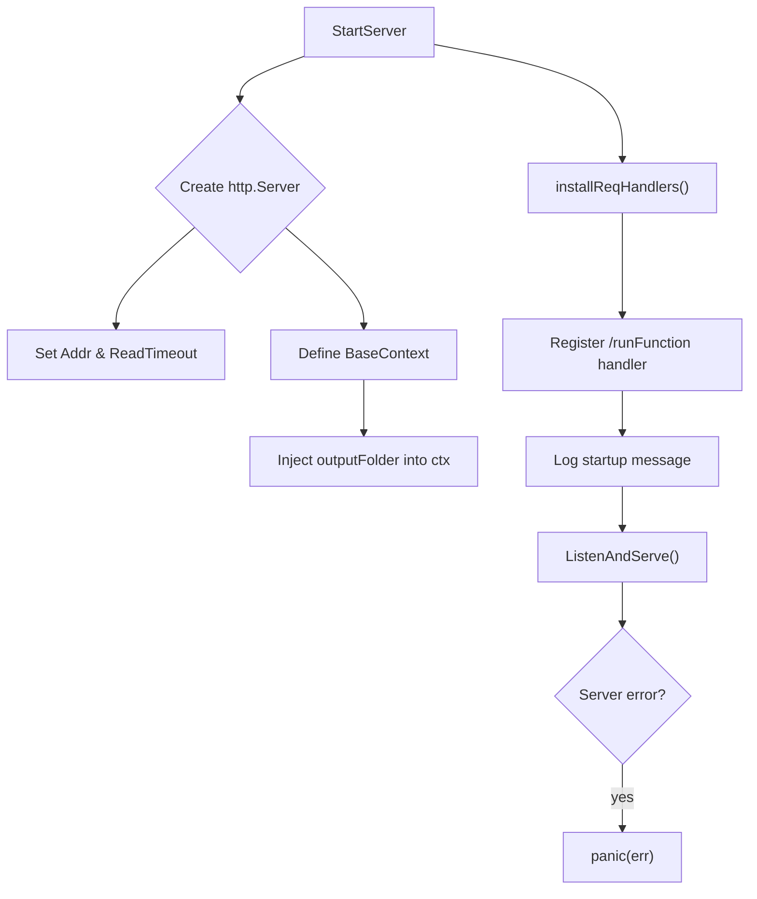

#### 4) Function dependencies (Mermaid)

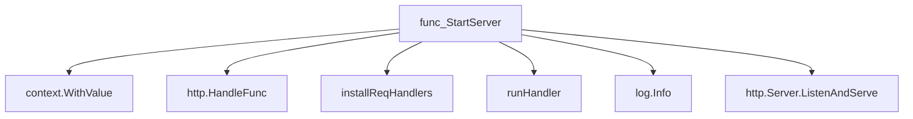

#### 5) Functions calling `StartServer` (Mermaid)

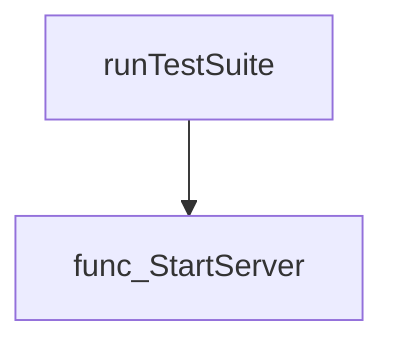

#### 6) Usage example (Go)

```go
package main

import (
    "github.com/redhat-best-practices-for-k8s/certsuite/webserver"
)

func main() {
    // Start the web server and serve test output from "./results"
    webserver.StartServer("./results")
}
```

---

---

## Local Functions

### installReqHandlers

**installReqHandlers** - Binds several HTTP endpoints (`/`, `/submit.js`, `/logs.js`, etc.) to handler functions that return embedded static content or dynamic data.


#### Signature (Go)

```go
func installReqHandlers() ()
```

#### Summary Table

| Aspect | Details |
|--------|---------|
| **Purpose** | Binds several HTTP endpoints (`/`, `/submit.js`, `/logs.js`, etc.) to handler functions that return embedded static content or dynamic data. |
| **Parameters** | None |
| **Return value** | None (side‑effecting) |
| **Key dependencies** | `net/http.HandleFunc`, `http.ResponseWriter.Header().Set`, `ResponseWriter.Write`, `http.Error` |
| **Side effects** | Registers global handlers in the default HTTP serve mux; writes static content to responses; sets appropriate MIME types. |
| **How it fits the package** | Invoked by `StartServer`; establishes the endpoints needed for the web UI that interacts with the rest of Certsuite’s server logic. |

#### Internal workflow (Mermaid)

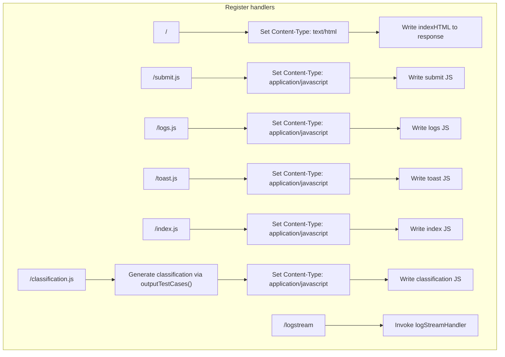

#### Function dependencies (Mermaid)

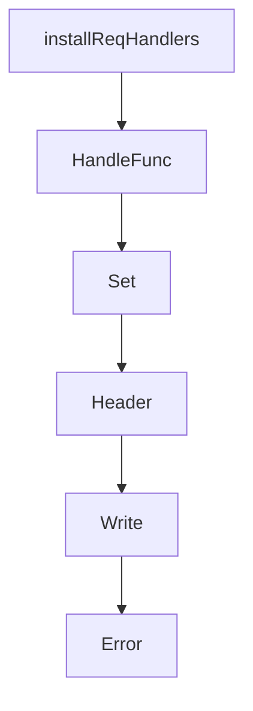

#### Functions calling `installReqHandlers` (Mermaid)

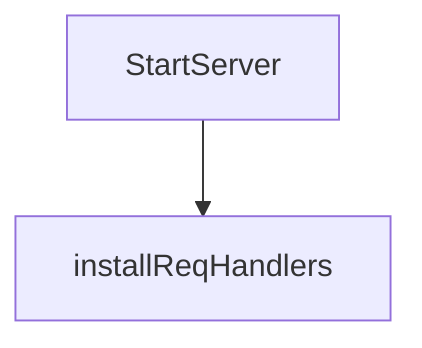

#### Usage example (Go)

```go
// Minimal example invoking installReqHandlers
package main

import (
    "github.com/redhat-best-practices-for-k8s/certsuite/webserver"
    "net/http"
)

func main() {
    // Register handlers before starting the server.
    webserver.StartServer("/tmp/output")
    http.ListenAndServe(":8084", nil)
}
```

---

---

### logStreamHandler

**logStreamHandler** - Upgrades an HTTP connection to a WebSocket and streams the contents of a log file in real‑time to the client. Each line is converted from ANSI escape codes to HTML before transmission.


#### Signature (Go)

```go
func(logStreamHandler)(w http.ResponseWriter, r *http.Request)
```

#### Summary Table

| Aspect | Details |
|--------|---------|
| **Purpose** | Upgrades an HTTP connection to a WebSocket and streams the contents of a log file in real‑time to the client. Each line is converted from ANSI escape codes to HTML before transmission. |
| **Parameters** | `w http.ResponseWriter` – original HTTP response writer.<br>`r *http.Request` – incoming request containing context for upgrade. |
| **Return value** | None (function has no return). |
| **Key dependencies** | • `upgrader.Upgrade` – converts HTTP to WebSocket.<br>• `log.Info` – logs status and errors.<br>• `bufio.NewScanner`, `scanner.Scan()`, `scanner.Bytes()` – read log file line by line.<br>• `ansihtml.ConvertToHTML` – translate ANSI to HTML.<br>• `conn.WriteMessage` – send data over WebSocket.<br>• `time.Sleep(logTimeout)` – throttle message sending. |
| **Side effects** | • Creates a WebSocket connection that remains open until an error occurs or the client disconnects.<br>• Logs errors and informational messages via the package logger.<br>• Writes each log line (after conversion) to the WebSocket, appending `<br>` for HTML formatting. |
| **How it fits the package** | Part of the `webserver` module’s debugging interface; exposes a live log view that can be embedded in web dashboards or accessed via browser consoles. |

#### Internal workflow

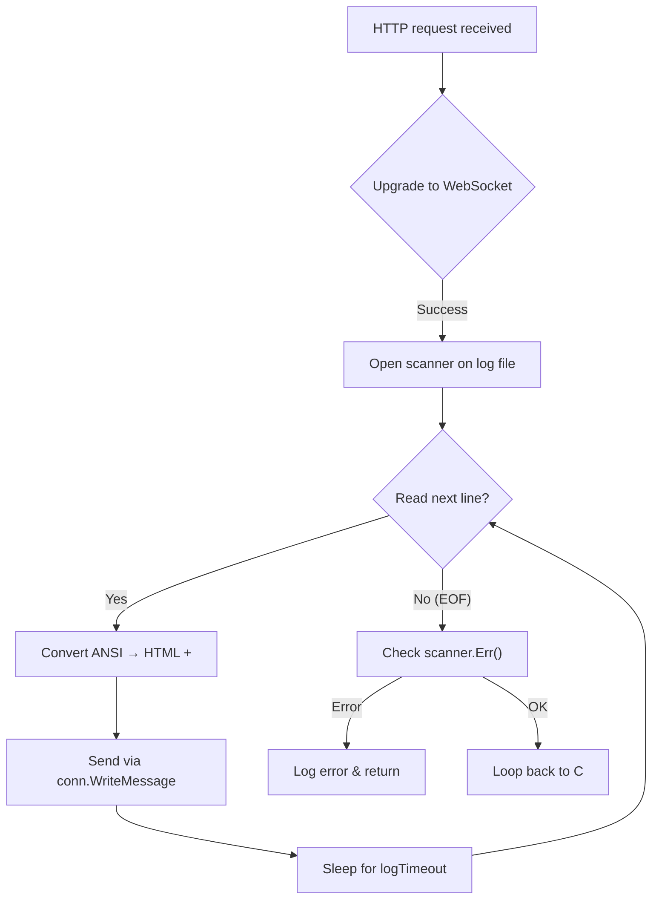

#### Function dependencies

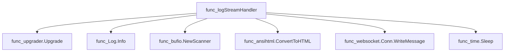

#### Functions calling `logStreamHandler`

None – this function is currently not referenced elsewhere in the package.

#### Usage example (Go)

```go
// Minimal example invoking logStreamHandler
package main

import (
    "net/http"
    "github.com/redhat-best-practices-for-k8s/certsuite/webserver"
)

func main() {
    http.HandleFunc("/logs", webserver.logStreamHandler)
    _ = http.ListenAndServe(":8080", nil)
}
```

---

### outputTestCases

**outputTestCases** - Builds a string representation of the test case catalog, formatted as a JavaScript object literal. The string is later written to an HTTP response for client‑side consumption.


#### Signature (Go)

```go
func outputTestCases() (outString string)
```

#### Summary Table

| Aspect | Details |
|--------|---------|
| **Purpose** | Builds a string representation of the test case catalog, formatted as a JavaScript object literal. The string is later written to an HTTP response for client‑side consumption. |
| **Parameters** | None |
| **Return value** | `outString` – a single string containing the serialized classification data (e.g., `classification= {"testID": [...], ...}`). |
| **Key dependencies** | • `make`, `append`, `len` – slice construction<br>• `sort.Slice`, `sort.Strings` – ordering of identifiers and suites<br>• `CreatePrintableCatalogFromIdentifiers(keys)` – groups entries by suite<br>• `GetSuitesFromIdentifiers(keys)` – extracts unique suite names<br>• `fmt.Sprintf`, `strings.ReplaceAll` – string formatting and sanitisation<br>• `toJSONString(map[string]string)` – serialises the `CategoryClassification` map |
| **Side effects** | No global state changes. Produces output only via the return value. |
| **How it fits the package** | Used by the HTTP handler for `/classification.js` to supply the front‑end with test case metadata in a format that can be embedded directly into JavaScript code. |

#### Internal workflow (Mermaid)

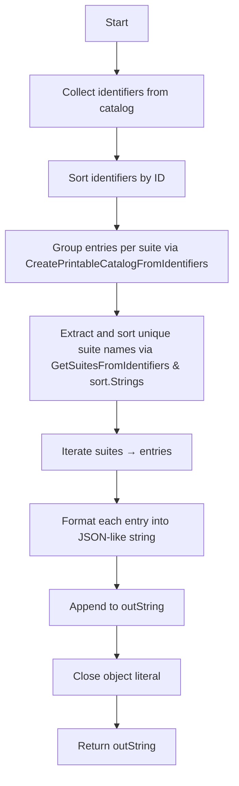

#### Function dependencies (Mermaid)

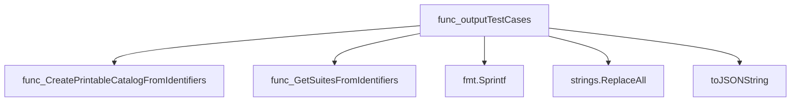

#### Functions calling `outputTestCases` (Mermaid)

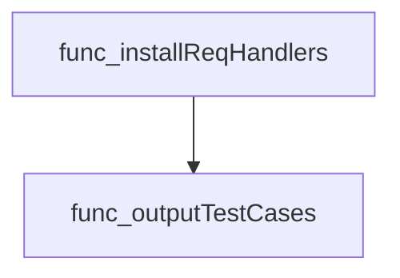

#### Usage example (Go)

```go
// Minimal example invoking outputTestCases
package main

import (
	"fmt"
	"github.com/redhat-best-practices-for-k8s/certsuite/webserver"
)

func main() {
	classificationJS := webserver.OutputTestCases()
	fmt.Println(classificationJS)
}
```

> **Note**: `outputTestCases` is unexported; in practice it is accessed via the HTTP handler defined in `installReqHandlers`.

---

### runHandler

**runHandler** - Processes a multipart/form‑data request containing a kubeconfig file and JSON options, updates the CERTSUITE configuration, runs the test suite, and returns a JSON status message.


#### Signature (Go)
```go
func runHandler(w http.ResponseWriter, r *http.Request)
```

#### Summary Table
| Aspect | Details |
|--------|---------|
| **Purpose** | Processes a multipart/form‑data request containing a kubeconfig file and JSON options, updates the CERTSUITE configuration, runs the test suite, and returns a JSON status message. |
| **Parameters** | `w http.ResponseWriter` – HTTP response writer.<br>`r *http.Request` – incoming HTTP request. |
| **Return value** | None (writes directly to `w`). |
| **Key dependencies** | - `bytes.NewBufferString`, <br>- `log.SetLogger`, `log.GetMultiLogger`,<br>- `json.Unmarshal`, <br>- `r.FormValue`, `r.FormFile`,<br>- `os.CreateTemp`, `io.Copy`, `os.Remove`,<br>- `updateTnf`, `os.WriteFile`,<br>- `clientsholder.GetNewClientsHolder`,<br>- `certsuite.LoadChecksDB`,<br>- `checksdb.InitLabelsExprEvaluator`,<br>- `log.CreateGlobalLogFile`,<br>- `certsuite.Run` |
| **Side effects** | Creates temporary file for kubeconfig, writes logs to a buffer and log file, modifies configuration YAML on disk, runs the entire CERTSUITE test suite (which may spawn goroutines), removes temp file, returns JSON response. |
| **How it fits the package** | Serves as the core HTTP endpoint of the webserver, orchestrating user input handling, configuration updates, test execution, and result reporting in web mode. |

#### Internal workflow
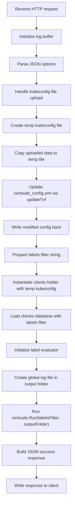

#### Function dependencies
```mermaid
graph TD
  func_runHandler --> func_NewBufferString
  func_runHandler --> func_SetLogger
  func_runHandler --> func_GetMultiLogger
  func_runHandler --> func_Unmarshal
  func_runHandler --> func_FormValue
  func_runHandler --> func_FormFile
  func_runHandler --> func_CreateTemp
  func_runHandler --> func_Copy
  func_runHandler --> func_Remove
  func_runHandler --> func_updateTnf
  func_runHandler --> func_WriteFile
  func_runHandler --> func_GetNewClientsHolder
  func_runHandler --> func_LoadChecksDB
  func_runHandler --> func_InitLabelsExprEvaluator
  func_runHandler --> func_CreateGlobalLogFile
  func_runHandler --> func_Run
```

#### Functions calling `runHandler`
None – this function is currently not referenced elsewhere in the package.

#### Usage example (Go)
```go
package main

import (
    "net/http"
    "github.com/redhat-best-practices-for-k8s/certsuite/webserver"
)

func main() {
    http.HandleFunc("/", webserver.runHandler) // register handler
    http.ListenAndServe(":8080", nil)
}
```

---

### toJSONString

**toJSONString** - Produces an indented JSON representation of a `map[string]string`. Useful for embedding classification details in output.


#### Signature (Go)
```go
func(toJSONString data map[string]string) string
```

#### Summary Table
| Aspect | Details |
|--------|---------|
| **Purpose** | Produces an indented JSON representation of a `map[string]string`. Useful for embedding classification details in output. |
| **Parameters** | `data` (map[string]string) – key‑value pairs to serialize. |
| **Return value** | `string` – UTF‑8 JSON text; empty string if marshalling fails. |
| **Key dependencies** | • `encoding/json.MarshalIndent`<br>• Built‑in `string()` conversion |
| **Side effects** | None. The function is pure: it only reads the input map and returns a new string. |
| **How it fits the package** | Used by `outputTestCases` to embed category classification data into a larger JSON‑like report. |

#### Internal workflow (Mermaid)
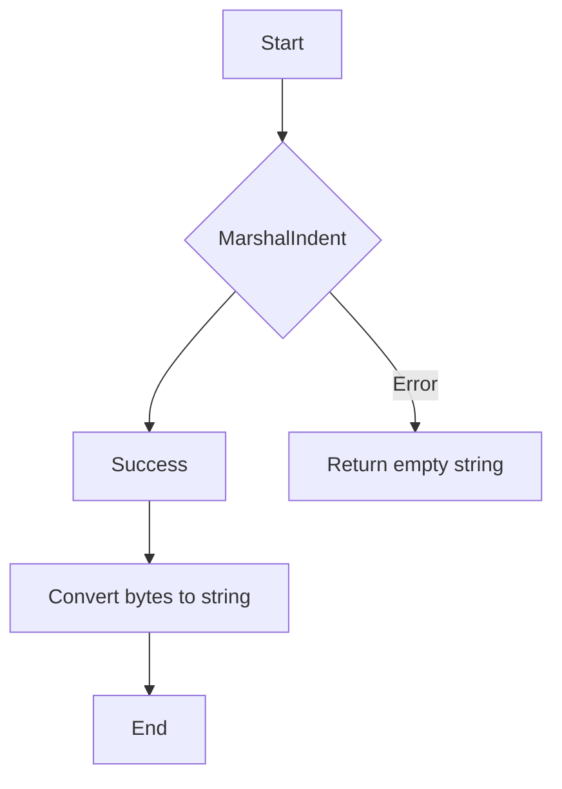

#### Function dependencies (Mermaid)
```mermaid
graph TD
  func_toJSONString --> func_MarshalIndent
  func_toJSONString --> func_string
```

#### Functions calling `toJSONString` (Mermaid)
```mermaid
graph TD
  func_outputTestCases --> func_toJSONString
```

#### Usage example (Go)
```go
// Minimal example invoking toJSONString
package main

import (
	"fmt"
)

func main() {
	data := map[string]string{
		"category":   "Security",
		"description": "Ensures proper security configuration.",
	}
	jsonStr := toJSONString(data)
	fmt.Println(jsonStr)
}
```

---

### updateTnf

**updateTnf** - Reads a YAML configuration, applies user‑supplied overrides from `*RequestedData`, and returns the updated YAML.


#### Signature (Go)

```go
func updateTnf(tnfConfig []byte, data *RequestedData) []byte
```

#### Summary Table

| Aspect | Details |
|--------|---------|
| **Purpose** | Reads a YAML configuration, applies user‑supplied overrides from `*RequestedData`, and returns the updated YAML. |
| **Parameters** | `tnfConfig` – original YAML bytes; `data` – pointer to `RequestedData` containing override values. |
| **Return value** | Updated YAML as a byte slice. The function never returns an error; fatal errors terminate the process via logging. |
| **Key dependencies** | *`gopkg.in/yaml.v3`* for unmarshalling/marshalling<br>*`github.com/redhat-best-practices-for-k8s/certsuite/internal/log`* for fatal logging |
| **Side effects** | Calls `log.Fatal` on any unmarshal/marshal error, which writes to stderr and exits the program. No other I/O or global state is modified. |
| **How it fits the package** | Used by the HTTP handler (`runHandler`) to persist user‑supplied configuration changes back into the main test suite YAML file before execution. |

#### Internal workflow (Mermaid)

```mermaid
flowchart TD
  A["Unmarshal tnfConfig"] --> B{"Success?"}
  B -- No --> C["log.Fatal Error unmarshalling YAML"]
  B -- Yes --> D["Build namespace slice"]
  D --> E["Set config.TargetNameSpaces"]
  E --> F["Set PodsUnderTestLabels"]
  F --> G["Build managedDeployments slice"]
  G --> H["Set config.ManagedDeployments"]
  H --> I["Build managedStatefulsets slice"]
  I --> J["Set config.ManagedStatefulsets"]
  J --> K["Build crdFilter slice"]
  K --> L["Set config.CrdFilters"]
  L --> M["Build acceptedKernelTaints slice"]
  M --> N["Set config.AcceptedKernelTaints"]
  N --> O["Build skipHelmChartList slice"]
  O --> P["Set config.SkipHelmChartList"]
  P --> Q["Build skipScalingTestDeployments slice"]
  Q --> R["Set config.SkipScalingTestDeployments"]
  R --> S["Build skipScalingTestStatefulSets slice"]
  S --> T["Set config.SkipScalingTestStatefulSets"]
  T --> U["Copy scalar fields (ServicesIgnoreList, ValidProtocolNames)"]
  U --> V["Conditional assignments for password, names, API config"]
  V --> W["Marshal updated config to YAML"]
  W -- No --> X["log.Fatal Error marshaling YAML"]
  W -- Yes --> Y["Return newData"]
```

#### Function dependencies (Mermaid)

```mermaid
graph TD
  func_updateTnf --> func_yaml.Unmarshal
  func_updateTnf --> func_log.Logger.Fatal
  func_updateTnf --> func_append
  func_updateTnf --> func_len
  func_updateTnf --> func_yaml.Marshal
```

#### Functions calling `updateTnf` (Mermaid)

```mermaid
graph TD
  func_runHandler --> func_updateTnf
```

#### Usage example (Go)

```go
// Minimal example invoking updateTnf

import (
    "fmt"

    "github.com/redhat-best-practices-for-k8s/certsuite/webserver"
)

// Assume we have the original YAML and a RequestedData instance.
originalYAML := []byte(`targetNamespaces: []`)

data := &webserver.RequestedData{
    TargetNameSpaces:        []string{"default"},
    PodsUnderTestLabels:     []string{"app=demo"},
    OperatorsUnderTestLabels: []string{},
    ManagedDeployments:      []string{"my-app"},
    // ... other fields as needed
}

updatedYAML := webserver.updateTnf(originalYAML, data)
fmt.Printf("Updated YAML:\n%s\n", string(updatedYAML))
```

---

---

